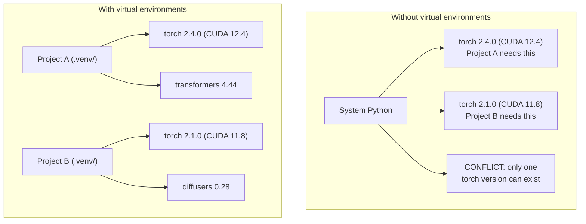

# 字符串环境

> 依赖性地狱是真实的.

**Type:** Build
**Languages:** Shell
**Prerequisites:** Phase 0, Lesson 01
**Time:** ~30 minutes

## 学习目标

- 创建使用 `uv`现在`venv`其他`conda`
- 写一个`pyproject.toml`具有可选的依赖组,并生成可复制性的锁文件
- 诊断和解决常见陷:全球安装,管/混合,CUDA版本不匹配
- 实施对项目有相互依赖的各阶段环境战略

## 问题

你安装PyTorch 2.4用于一个细节调整项目.下周,另一个项目需要PyTorch 2.1因为它的CUDA构建是固定的.你升级全球,第一个项目会断裂.你降级,第二个会断裂.

这就是依赖地狱. 在AI/ML工作中,它经常发生,因为:

- 皮托奇,JAX和TensorFlow每个公司都运送自己的CUDA绑定
- 模型库将特定框架版本定制
- 全球化`pip install`覆盖之前的任何东西
- CUDA 11.8 构建不适用于 CUDA 12.x 驱动程序 (反之亦然)

解决方案是:每个项目都会有自己的孤立环境,

## 概念



```figure
s0-env-isolation
```

## 建立它

### 选择1: uv venv (建议)

`uv`它可以在一个工具中处理虚拟环境,Python版本和依赖分辨率.

```bash
curl -LsSf https://astral.sh/uv/install.sh | sh

uv python install 3.12

cd your-project
uv venv
source .venv/bin/activate
```

装备包:

```bash
uv pip install torch numpy
```

创建一个项目`pyproject.toml`在一个步骤:

```bash
uv init my-ai-project
cd my-ai-project
uv add torch numpy matplotlib
```

### 选择2: venv (内置)

如果无法安装`uv`鱼船与`venv`其他:

```bash
python3 -m venv .venv
source .venv/bin/activate  # Linux/macOS
.venv\Scripts\activate     # Windows

pip install torch numpy
```

比较慢`uv`虽然它可以在任何地方使用 python.

### 选择3:可纳 (当你需要它时)

康达管理非Python依赖性,如CUDA工具包,cuDNN和C库.

- 你需要一个特定的CUDA工具包版本,而不需要系统范围内的安装
- 你在一个共享集群上,你不能安装系统包
- 图书馆的安装说明书说"使用公寓"

```bash
# Install miniconda (not the full Anaconda)
curl -LsSf https://repo.anaconda.com/miniconda/Miniconda3-latest-Linux-x86_64.sh -o miniconda.sh
bash miniconda.sh -b

conda create -n myproject python=3.12
conda activate myproject

conda install pytorch torchvision torchaudio pytorch-cuda=12.4 -c pytorch -c nvidia
```

混合 混合 混合 混合 混合 混合 混合 `pip install`由于这种情况,我们可以在一个"无限"中找到一个问题.

### 对于本课程:各阶段的战略

您可以为整个课程创造一个环境. 不做.不同的阶段需要不同的 (有时相互矛盾的) 依赖.

战略:

```
ai-engineering-from-scratch/
├── .venv/                    <-- shared lightweight env for phases 0-3
├── phases/
│   ├── 04-neural-networks/
│   │   └── .venv/            <-- PyTorch env
│   ├── 05-cnns/
│   │   └── .venv/            <-- same PyTorch env (symlink or shared)
│   ├── 08-transformers/
│   │   └── .venv/            <-- might need different transformer versions
│   └── 11-llm-apis/
│       └── .venv/            <-- API SDKs, no torch needed
```

剧本在`code/env_setup.sh`创造了本课程的基础环境.

## 项目. 基础知识

每个Python项目都应该有一个`pyproject.toml`它取代了`setup.py`现在`setup.cfg`其他`requirements.txt`在一个文件中.

```toml
[project]
name = "ai-engineering-from-scratch"
version = "0.1.0"
requires-python = ">=3.11"
dependencies = [
    "numpy>=1.26",
    "matplotlib>=3.8",
    "jupyter>=1.0",
    "scikit-learn>=1.4",
]

[project.optional-dependencies]
torch = ["torch>=2.3", "torchvision>=0.18"]
llm = ["anthropic>=0.39", "openai>=1.50"]
```

然后安装:

```bash
uv pip install -e ".[torch]"    # base + PyTorch
uv pip install -e ".[llm]"     # base + LLM SDKs
uv pip install -e ".[torch,llm]" # everything
```

## 锁文件

锁文件将所有依赖性 (包括过渡性) 转换到精确版本. 这保证可重复性:从锁文件中安装的人都得到了完全相同的包.

```bash
# uv generates uv.lock automatically when using uv add
uv add numpy

# pip-tools approach
uv pip compile pyproject.toml -o requirements.lock
uv pip install -r requirements.lock
```

让你的锁文件转载到 git. 当有人克隆了 repo,他们从锁文件安装并获得相同的版本.

## 常见的错误

### 1. 全球安装

```bash
pip install torch  # BAD: installs to system Python

source .venv/bin/activate
pip install torch  # GOOD: installs to virtual environment
```

检查你的包裹去哪里:

```bash
which python       # should show .venv/bin/python, not /usr/bin/python
which pip           # should show .venv/bin/pip
```

### 2. 混合和

```bash
conda create -n myenv python=3.12
conda activate myenv
conda install pytorch -c pytorch
pip install some-other-package   # BAD: can break conda's dependency tracking
conda install some-other-package # GOOD: let conda manage everything
```

如果您必须在conda内使用 pip (有些包装只使用 pip),首先安装所有conda包装,然后使用 pip包.

### 3. 忘记激活

```bash
python train.py           # uses system Python, missing packages
source .venv/bin/activate
python train.py           # uses project Python, packages found
```

您的 shell提示应显示环境名称:

```
(.venv) $ python train.py
```

### 4. 承诺.venv到 git

```bash
echo ".venv/" >> .gitignore
```

虚拟环境是200MB到2GB.它们是本地的,不是机器之间可移植的.`pyproject.toml`而不是锁文件.

### 5.  CUDA版本不匹配

```bash
nvidia-smi                # shows driver CUDA version (e.g., 12.4)
python -c "import torch; print(torch.version.cuda)"  # shows PyTorch CUDA version

# These must be compatible.
# PyTorch CUDA version must be <= driver CUDA version.
```

## 用它

运行设置脚本来创建课程环境:

```bash
bash phases/00-setup-and-tooling/06-python-environments/code/env_setup.sh
```

这就会产生一个`.venv`在核电源根上,核电源已安装和验证.

## 运动

1. 跑步`env_setup.sh`检查所有检查通过
2. 创建第二个虚拟环境,安装不同的版本的 numpy,并确认两个环境是孤立的
3. 写一个`pyproject.toml`对于需要 PyTorch 和 Anthropic SDK 的项目
4. 故意在全球范围内安装一个包 (不需要激活一个venv),注意它去哪里,然后卸载它

## 关键词

| Term | What people say | What it actually means |
|------|----------------|----------------------|
| Virtual environment | "A venv" | An isolated directory containing a Python interpreter and packages, separate from the system Python |
| Lockfile | "Pinned dependencies" | A file listing every package and its exact version, guaranteeing identical installs across machines |
| pyproject.toml | "The new setup.py" | The standard Python project configuration file, replacing setup.py/setup.cfg/requirements.txt |
| Transitive dependency | "A dependency of a dependency" | Package B depends on C; if you install A which depends on B, C is a transitive dependency of A |
| CUDA mismatch | "My GPU isn't working" | PyTorch was compiled for a different CUDA version than what your GPU driver supports |
