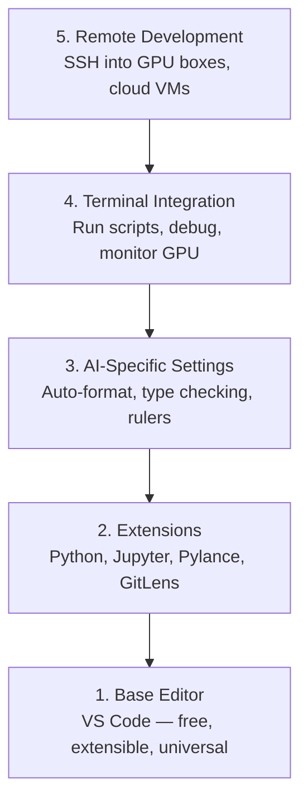

# 编辑器设置

> 你的编辑是你的副飞行员, 设置它一次, 让它远离你的道路,

**Type:** Build
**Languages:** --
**Prerequisites:** Phase 0, Lesson 01
**Time:** ~20 minutes

## 学习目标

- 安装VS代码,用于Python,Jupyter, linting和远程SSH的基本扩展
- 配置格式-在保存,类型检查,笔记本表输出滚动 AI 工作流
- 设置远程SSH来编辑和调试远程GPU机器上的代码,好像它们是本地
- 评估编辑替代方案 (Cursor, Windsurf, Neovim) 和它们对人工智能工作的折衷

## 问题

你将花费数千个小时在编辑器里写Python,运行笔记本,调试训练循环,并将SSH插入GPU盒子中.一个错误配置的编辑器将每次会议都变成摩擦:没有自动完成,没有字符提示,没有内线错误,手动格式化和一个拙的终端工作流程.

错过它每天都需要20分钟.

## 概念

为了设置人工智能工程编辑器,需要五件事:



```figure
s0-lsp-roundtrip
```

## 建立它

### 步骤1:安装VS代码

VS Code是推的编辑器. 它是免费的,运行在每个操作系统上,具有一流的Jupyter笔记本电脑支持,扩展生态系统涵盖了你需要的人工智能工作的一切.

从[code.visualstudio.com](https://code.visualstudio.com/)现在,我们要去.

在终端检查:

```bash
code --version
```

如果`code`在 macOS 上没有找到,打开 VS Code,按下`Cmd+Shift+P`输入"Shell Command"并选择"安装"代码"命令在PATH中".

### 步骤 2:安装必要的扩展

打开 VS 代码中的集成终端 (`` Ctrl+```) 并安装对人工智能工作重要的扩展:

```bash
code --install-extension ms-python.python
code --install-extension ms-python.vscode-pylance
code --install-extension ms-toolsai.jupyter
code --install-extension eamodio.gitlens
code --install-extension ms-vscode-remote.remote-ssh
code --install-extension ms-python.debugpy
code --install-extension ms-python.black-formatter
code --install-extension charliermarsh.ruff
```

每个人都做什么:

| Extension | Why |
|-----------|-----|
| Python | Language support, virtual env detection, run/debug |
| Pylance | Fast type checking, autocomplete, import resolution |
| Jupyter | Run notebooks inside VS Code, variable explorer |
| GitLens | See who changed what, inline git blame |
| Remote SSH | Open a folder on a remote GPU box as if it were local |
| Debugpy | Step-through debugging for Python |
| Black Formatter | Auto-format on save, consistent style |
| Ruff | Fast linting, catches common mistakes |

文件`code/.vscode/extensions.json`在本课程中包含了完整的建议列表. 当您打开项目文件时,VS Code将提示您安装它们.

### 步骤3: 设置设置

复制设置`code/.vscode/settings.json`在本课中,或手动应用它们.`Settings > Open Settings (JSON)`现在,我们要去.

人工智能工作的关键设置:

```jsonc
{
    "python.analysis.typeCheckingMode": "basic",
    "editor.formatOnSave": true,
    "editor.rulers": [88, 120],
    "notebook.output.scrolling": true,
    "files.autoSave": "afterDelay"
}
```

为什么这些问题重要:

- **Type checking on basic**节省对子形状不匹配和错误的API参数的调试时间.
- **Format on save**黑人可以处理.
- **Rulers at 88 and 120**黑色包裹在88. 120标记显示了文件串和评论变得太长了.
- **Notebook output scrolling**训练循环打印了数千条线.
- **Auto-save**您将忘记保存. 训练脚本将运行过时代码. 自动保存会防止这一点.

### 步骤4:终端集成

VS Code的集成终端是你运行训练脚本,监控GPU,管理环境的地方.

设置正确:

```jsonc
{
    "terminal.integrated.defaultProfile.osx": "zsh",
    "terminal.integrated.defaultProfile.linux": "bash",
    "terminal.integrated.fontSize": 13,
    "terminal.integrated.scrollback": 10000
}
```

有用的快捷方式:

| Action | macOS | Linux/Windows |
|--------|-------|---------------|
| Toggle terminal | `` Ctrl+` `` | `` Ctrl+` `` |
| New terminal | `` Ctrl+Shift+` `` | `` Ctrl+Shift+` `` |
| Split terminal | `Cmd+\` | `Ctrl+Shift+5` |

分开终端是有用的:一个用于运行脚本,一个用于监控GPU`nvidia-smi -l 1`或`watch -n 1 nvidia-smi`现在,我们要去.

### 步骤5:远程开发 (SSH进入GPU盒子)

远程SSH允许您打开远程文件系统,编辑文件,运行终端,并调试一切,好像是本地.

设置:

1. 安装远程SSH扩展 (在步骤2中完成).
2. 打印`Ctrl+Shift+P`(或`Cmd+Shift+P`), 输入"远程SSH:连接到主机".
3. 进入`user@your-gpu-box-ip`现在,我们要去.
4. VS Code自动安装服务器组件在远程机器上.

设置SSH密钥:

```bash
ssh-keygen -t ed25519 -C "your-email@example.com"
ssh-copy-id user@your-gpu-box-ip
```

添加主机到`~/.ssh/config`为了方便:

```
Host gpu-box
    HostName 203.0.113.50
    User ubuntu
    IdentityFile ~/.ssh/id_ed25519
    ForwardAgent yes
```

现在`Remote-SSH: Connect to Host > gpu-box`接连即时.

## 其他方法

### 曲者

[cursor.com](https://cursor.com)通过使用Cursor,本课程中的所有内容仍然适用. 导入相同的`settings.json`其他`extensions.json`现在,我们要去.

### 风冲浪

[windsurf.com](https://windsurf.com)类似的故事:相同的扩展,相同的设置格式,相同的远程SSH支持.

### 维姆/尼奥姆

如果您已经使用Vim或Neovim并且在其中产生效果,请留下来.

- **pyright**或**pylsp**进行类型检查 (通过机械或手动安装)
- **nvim-lspconfig**语言服务器集成
- **jupyter-vim**或**molten-nvim**用于类似笔记本执行
- **telescope.nvim**文件/符号搜索
- **none-ls.nvim**黑色和色,用于格式化/色

如果您还没有使用Vim,请不要现在开始.学习曲线将与学习人工智能工程竞争.使用VS代码.

## 用它

通过这种设置,你的日常工作流程看起来像:

1. 在 VS Code 中打开项目文件 (或通过远程SSH连接到 GPU 框).
2. 在编辑器中写Python,使用自动完成,输入提示和内行错误.
3. 运行Jupyter笔记本,与Jupyter扩展一致.
4. 使用集成终端进行训练脚本,`uv pip install`并且监控GPU.
5. 在提交之前,请使用 GitLens 进行修改.

## 运动

1. 安装 VS 代码和列出的扩展
2. 复制`settings.json`从这个课程开始,你将VS代码配置
3. 打开一个Python文件,并验证Pylance显示保存时的类型提示和黑色格式
4. 如果您有远程机器的访问权限,设置远程SSH,并打开一个文件

## 关键词

| Term | What people say | What it actually means |
|------|----------------|----------------------|
| LSP | "Autocomplete engine" | Language Server Protocol: a standard for editors to get type info, completions, and diagnostics from a language-specific server |
| Pylance | "The Python plugin" | Microsoft's Python language server using Pyright for type checking and IntelliSense |
| Remote SSH | "Working on the server" | VS Code extension that runs a lightweight server on a remote machine and streams the UI to your local editor |
| Format on save | "Auto-prettier" | The editor runs a formatter (Black, Ruff) every time you save, so code style is always consistent |
