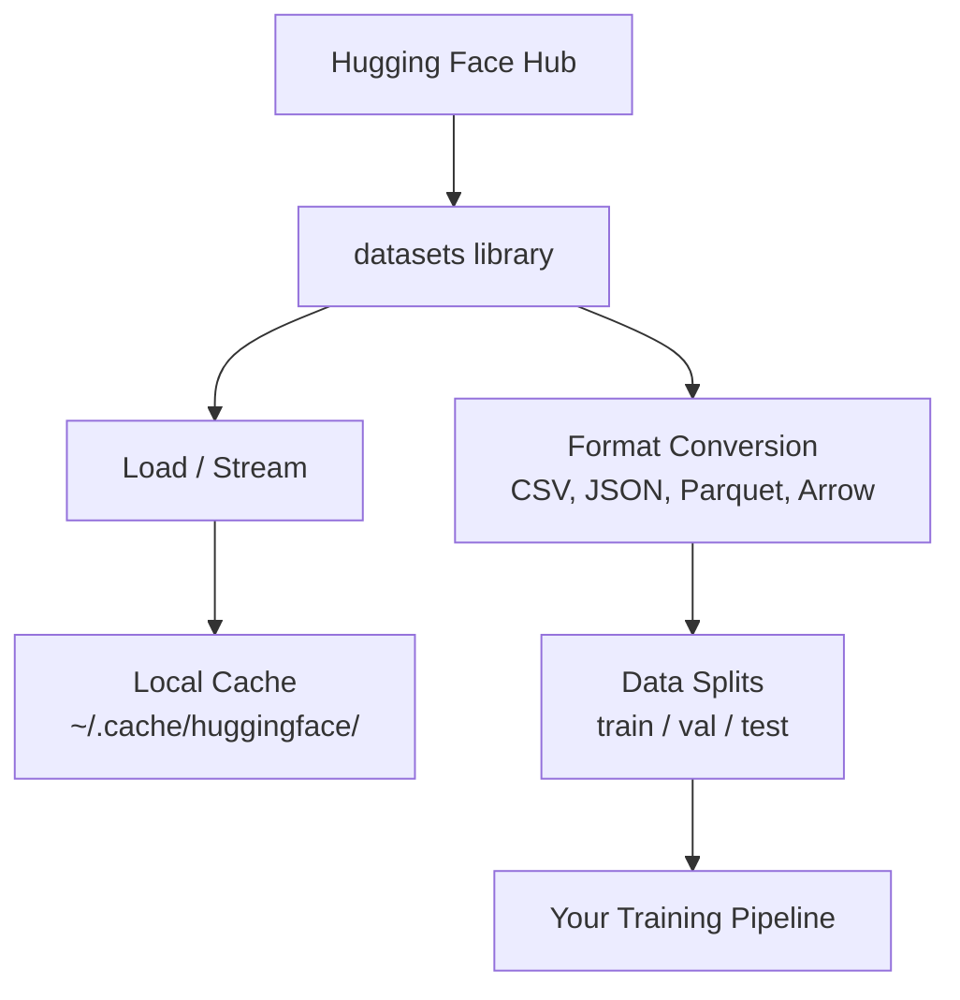

# 数据管理

> 数据是燃料,你如何管理它,

**Type:** Build
**Language:**字符串
**Prerequisites:** Phase 0, Lesson 01
**Time:** ~45 minutes

## 学习目标

- 使用拥抱面孔的数据集,流,缓存`datasets`图书馆
- 转换CSV,JSON,Parquet和Arrow格式,并解释它们的交易
- 创建可复制的火车/验证/测试分区,使用固定的随机种子
- 使用 管理大型模型和数据集文件`.gitignore`关键字:

## 问题

每个人工智能项目都从数据开始.你需要找到数据集,下载它们,将它们转换成格式,将它们分为训练和评估,并将它们版本化,使实验可重复.每次手动完成这项工作都是缓慢的,容易犯错误的.你需要一个可重复的工作流程.

## 概念



拥抱的脸`datasets`库是人工智能工作中加载数据的标准方式. 它处理下载,缓存,格式转换和流出.

```figure
s0-data-pipeline
```

## 建立它

### 步骤1:安装数据集库

```bash
pip install datasets huggingface_hub
```

### 步骤 2: 装载数据集

```python
from datasets import load_dataset

dataset = load_dataset("stanfordnlp/imdb")
print(dataset)
print(dataset["train"][0])
```

导航导航导航导航导航导航导航导航导航导航导航导航导航导航导航导航导航导航导航导航导航导航导航导航导航导航导航导航导航导航导航导航导航导航导航导航导航导航导航导航导航导航导航导航导航导航导航导航导航导航导航导航导航导航导航导航导航导航导航导航导航导航导航导航导航导航导航导航导航导航导航导航导航导航导航导航导航导航导航导航导航导航导航导航导航`~/.cache/huggingface/datasets/`现在,我们要去.

### 步骤3: 流动大型数据集

流媒体将它们排列一排,而没有下载完整的东西.

```python
dataset = load_dataset("wikimedia/wikipedia", "20220301.en", split="train", streaming=True)

for i, example in enumerate(dataset):
    print(example["title"])
    if i >= 4:
        break
```

流媒体给你一个`IterableDataset`记忆使用不变,不管数据集的尺寸.

### 步骤 4:数据集格式

其他`datasets`根据您的管道需要的,您可以将其转换到其他格式.

```python
dataset = load_dataset("stanfordnlp/imdb", split="train")

dataset.to_csv("imdb_train.csv")
dataset.to_json("imdb_train.json")
dataset.to_parquet("imdb_train.parquet")
```

格式比较:

| Format | Size | Read Speed | Best For |
|--------|------|-----------|----------|
| CSV | Large | Slow | Human readability, spreadsheets |
| JSON | Large | Slow | APIs, nested data |
| Parquet | Small | Fast | Analytics, columnar queries |
| Arrow | Small | Fastest | In-memory processing (what `datasets` uses internally) |

对于人工智能工作,Parquet是最好的存储格式.箭头是你在内存中使用的.CSV和JSON是交换的.

### 步骤5:数据分开

每个ML项目都需要三个分区:

- **Train**模型从此学习 (通常是80%).
- **Validation**您在培训期间检查进展 (通常是10%).
- **Test**毕业后的最终评估 (通常是10%)

某些数据集是预分的,如果没有,你自己分开它们:

```python
dataset = load_dataset("stanfordnlp/imdb", split="train")

split = dataset.train_test_split(test_size=0.2, seed=42)
train_val = split["train"].train_test_split(test_size=0.125, seed=42)

train_ds = train_val["train"]
val_ds = train_val["test"]
test_ds = split["test"]

print(f"Train: {len(train_ds)}, Val: {len(val_ds)}, Test: {len(test_ds)}")
```

总是设定一个种子,以确保可复制性.

### 步骤 6: 下载和缓存模型

模型是大型文件.`huggingface_hub`图书馆处理下载和缓存.

```python
from huggingface_hub import hf_hub_download, snapshot_download

model_path = hf_hub_download(
    repo_id="sentence-transformers/all-MiniLM-L6-v2",
    filename="config.json"
)
print(f"Cached at: {model_path}")

model_dir = snapshot_download("sentence-transformers/all-MiniLM-L6-v2")
print(f"Full model at: {model_dir}")
```

模特缓存到`~/.cache/huggingface/hub/`一旦下载,它们会立即上传.

### 步骤 7:处理大型文件

模型重量和大型数据集不应进入 git.

**Option A: .gitignore (simplest)**

```
*.bin
*.safetensors
*.pt
*.onnx
data/*.parquet
data/*.csv
models/
```

**Option B: Git LFS (track large files in git)**

```bash
git lfs install
git lfs track "*.bin"
git lfs track "*.safetensors"
git add .gitattributes
```

基特LFS存储在您的备忘录中指针和实际文件在单独的服务器上.GitHub为您提供1GB免费.

**Option C: DVC (data version control)**

```bash
pip install dvc
dvc init
dvc add data/training_set.parquet
git add data/training_set.parquet.dvc data/.gitignore
git commit -m "Track training data with DVC"
```

化品制造小`.dvc`数据本身存储在S3,GCS或其他远程存储后端.

| Approach | Complexity | Best For |
|----------|-----------|----------|
| .gitignore | Low | Personal projects, downloaded data you can re-fetch |
| Git LFS | Medium | Teams sharing model weights via git |
| DVC | High | Reproducible experiments, large datasets, teams |

为了这门课程,`.gitignore`需要在机器上复制精确的实验时使用DVC.

### 步骤 8: 存储模式

**Local storage**对于10GB以下的数据集来说,HF缓存将自动处理.

**Cloud storage**适用于任何更大或在机器之间共享的东西:

```python
import os

local_path = os.path.expanduser("~/.cache/huggingface/datasets/")

# s3_path = "s3://my-bucket/datasets/"
# gcs_path = "gs://my-bucket/datasets/"
```

体与S3和GCS直接集成:

```bash
dvc remote add -d myremote s3://my-bucket/dvc-store
dvc push
```

云存储是当你调整远程GPU实例时变得相关的.

## 在本课程中使用的数据集

| Dataset | Lessons | Size | What It Teaches |
|---------|---------|------|----------------|
| IMDB | Tokenization, classification | 84 MB | Text classification basics |
| WikiText | Language modeling | 181 MB | Next-token prediction |
| SQuAD | QA systems | 35 MB | Question answering, spans |
| Common Crawl (subset) | Embeddings | Varies | Large-scale text processing |
| MNIST | Vision basics | 21 MB | Image classification fundamentals |
| COCO (subset) | Multimodal | Varies | Image-text pairs |

现在不必下载所有这些,每一堂课都说明了需要的内容.

## 用它

运行实用程序脚本来验证一切工作:

```bash
python code/data_utils.py
```

这将下载一个小数据集,转换它,分开它,

## 运送它

这一课产生了:
- `code/data_utils.py`- 可重复使用的数据加载和缓存工具
- `outputs/prompt-data-helper.md`- 提示找到合适的数据集

## 运动

1. 装载`glue`数据集`mrpc`配置和检查前5个例子
2. 播放`c4`数据集,并计算在10秒内可以处理多少个例子
3. 将数据集转换为Parquet,并将文件大小进行比较为CSV
4. 创建一个70/15/15火车/值/测试分区,使用固定种子,并验证尺寸

## 关键词

| Term | What people say | What it actually means |
|------|----------------|----------------------|
| Dataset split | "Training data" | A named subset (train/val/test) used at different stages of the ML lifecycle |
| Streaming | "Load it lazily" | Processing data row by row from a remote source without downloading the full dataset |
| Parquet | "Compressed CSV" | A columnar file format optimized for analytical queries and storage efficiency |
| Arrow | "Fast dataframe" | An in-memory columnar format used internally by the datasets library for zero-copy reads |
| Git LFS | "Git for big files" | An extension that stores large files outside the git repo while keeping pointers in version control |
| DVC | "Git for data" | A version control system for datasets and models that integrates with cloud storage |
| Cache | "Already downloaded" | A local copy of previously fetched data, stored at ~/.cache/huggingface/ by default |
