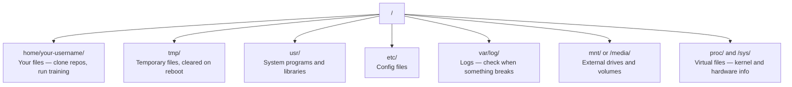

# 对于人工智能的Linux

> 大多数人工智能运行在Linux上.你需要足够的知识,

**Type:** Learn
**Languages:** --
**Prerequisites:** Phase 0, Lesson 01
**Time:** ~30 minutes

## 学习目标

- 从命令行执行基本文件操作
- 使用 管理文件权限`chmod`其他`chown`解决"拒绝许可"错误
- 安装系统包装`apt`设置一个新的GPU盒子来进行人工智能工作
- 识别macOS与Linux之间的差异,通常会让远程机器上的开发人员陷入困境

## 问题

你在macOS或Windows上开发. 但当你把它放入云GPU盒子,租用一个Lambda实例,或者发动一个EC2机器时,你就会进入Ubuntu. 终端是你的唯一接口. 没有Finder,没有 Explorer,没有GUI. 如果你无法导航文件系统,安装包,并从命令行管理进程, 你会在谷歌搜索"如何在Linux中解锁文件"时, 付费无用的GPU时间.

这是一本生存指南. 它涵盖了操作远程Linux机器的需要.

## 文件系统布局

Linux将所有东西都组织在一个根底下`/`没有.`C:\`或`/Volumes`你实际上会触摸的目录:



你的家目录是`~`或`/home/your-username`你几乎所有的事情都在这里发生.

## 基本的命令

这些15个命令涵盖了你在远程GPU盒子上所做的95%.

### 移动

```bash
pwd                         # Where am I?
ls                          # What's here?
ls -la                      # What's here, including hidden files with details?
cd /path/to/dir             # Go there
cd ~                        # Go home
cd ..                       # Go up one level
```

### 文件和目录

```bash
mkdir my-project            # Create a directory
mkdir -p a/b/c              # Create nested directories in one shot

cp file.txt backup.txt      # Copy a file
cp -r src/ src-backup/      # Copy a directory (recursive)

mv old.txt new.txt          # Rename a file
mv file.txt /tmp/           # Move a file

rm file.txt                 # Delete a file (no trash, it's gone)
rm -rf my-dir/              # Delete a directory and everything inside
```

`rm -rf`进入前,检查路径.

### 阅读文件

```bash
cat file.txt                # Print entire file
head -20 file.txt           # First 20 lines
tail -20 file.txt           # Last 20 lines
tail -f log.txt             # Follow a log file in real time (Ctrl+C to stop)
less file.txt               # Scroll through a file (q to quit)
```

### 寻找

```bash
grep "error" training.log           # Find lines containing "error"
grep -r "learning_rate" .           # Search all files in current directory
grep -i "cuda" config.yaml          # Case-insensitive search

find . -name "*.py"                 # Find all Python files under current dir
find . -name "*.ckpt" -size +1G     # Find checkpoint files larger than 1GB
```

## 许可证

每个Linux文件都有一个所有者和许可位. 当脚本不执行或不能写到目录时,你会遇到这个.

```bash
ls -l train.py
# -rwxr-xr-- 1 user group 2048 Mar 19 10:00 train.py
#  ^^^             owner permissions: read, write, execute
#     ^^^          group permissions: read, execute
#        ^^        everyone else: read only
```

常见的修复:

```bash
chmod +x train.sh           # Make a script executable
chmod 755 deploy.sh         # Owner: full, others: read+execute
chmod 644 config.yaml       # Owner: read+write, others: read only

chown user:group file.txt   # Change who owns a file (needs sudo)
```

当某事说"被拒绝许可",几乎总是一个权限问题.`chmod +x`或`sudo`解决了大多数案件.

## 包装管理 (适用)

 ubuntu 使用`apt`这就是你安装系统级软件的方式.

```bash
sudo apt update             # Refresh the package list (always do this first)
sudo apt install -y htop    # Install a package (-y skips confirmation)
sudo apt install -y build-essential  # C compiler, make, etc. Needed by many Python packages
sudo apt install -y tmux    # Terminal multiplexer (keep sessions alive after disconnect)

apt list --installed        # What's installed?
sudo apt remove htop        # Uninstall
```

您将安装在新鲜的GPU盒子上:

```bash
sudo apt update && sudo apt install -y \
    build-essential \
    git \
    curl \
    wget \
    tmux \
    htop \
    unzip \
    python3-venv
```

## 用户和 sudo

您通常是普通用户登录.有些操作需要根源 (管理员) 访问.

```bash
whoami                      # What user am I?
sudo command                # Run a single command as root
sudo su                     # Become root (exit to go back, use sparingly)
```

在云GPU实例中,你通常是唯一的用户,并且已经有Sudo访问权限.不要把一切运行为Root.只使用Sudo当需要时.

## 过程和系统d

当你的训练停留,或者你需要检查什么正在运行:

```bash
htop                        # Interactive process viewer (q to quit)
ps aux | grep python        # Find running Python processes
kill 12345                  # Gracefully stop process with PID 12345
kill -9 12345               # Force kill (use when graceful doesn't work)
nvidia-smi                  # GPU processes and memory usage
```

系统d管理服务 (后台恶魔). 如果运行推理服务器,您将使用它:

```bash
sudo systemctl start nginx          # Start a service
sudo systemctl stop nginx           # Stop it
sudo systemctl restart nginx        # Restart it
sudo systemctl status nginx         # Check if it's running
sudo systemctl enable nginx         # Start automatically on boot
```

## 磁盘空间

 GPU 盒子通常具有有限的磁盘空间.

```bash
df -h                       # Disk usage for all mounted drives
df -h /home                 # Disk usage for /home specifically

du -sh *                    # Size of each item in current directory
du -sh ~/.cache             # Size of your cache (pip, huggingface models land here)
du -sh /data/checkpoints/   # Check how big your checkpoints are

# Find the biggest space hogs
du -h --max-depth=1 / 2>/dev/null | sort -hr | head -20
```

常见的空间节省器:

```bash
# Clear pip cache
pip cache purge

# Clear apt cache
sudo apt clean

# Remove old checkpoints you don't need
rm -rf checkpoints/epoch_01/ checkpoints/epoch_02/
```

## 网络

您将从命令行下载模型,传输文件,

```bash
# Download files
wget https://example.com/model.bin                   # Download a file
curl -O https://example.com/data.tar.gz              # Same thing with curl
curl -s https://api.example.com/health | python3 -m json.tool  # Hit an API, pretty-print JSON

# Transfer files between machines
scp model.bin user@remote:/data/                     # Copy file to remote machine
scp user@remote:/data/results.csv .                  # Copy file from remote to local
scp -r user@remote:/data/checkpoints/ ./local-dir/   # Copy directory

# Sync directories (faster than scp for large transfers, resumes on failure)
rsync -avz --progress ./data/ user@remote:/data/
rsync -avz --progress user@remote:/results/ ./results/
```

使用`rsync`现在`scp`只有转移已更改的字节,

## 让会议活跃

当你把手机放进远程盒子时,关闭笔记本电脑会杀死你的训练.

```bash
tmux new -s train           # Start a new session named "train"
# ... start your training, then:
# Ctrl+B, then D            # Detach (training keeps running)

tmux ls                     # List sessions
tmux attach -t train        # Reattach to session

# Inside tmux:
# Ctrl+B, then %            # Split pane vertically
# Ctrl+B, then "            # Split pane horizontally
# Ctrl+B, then arrow keys   # Switch between panes
```

总是在克斯里做长时间的训练工作.

## 对于Windows用户的WSL2

如果您使用Windows,WSL2可以提供一个真正的Linux环境,

```bash
# In PowerShell (admin)
wsl --install -d Ubuntu-24.04

# After restart, open Ubuntu from Start menu
sudo apt update && sudo apt upgrade -y
```

现在,我们在WSL2上运行一个真正的Linux内核.`/mnt/c/Users/YourName/`来自WSL内部.

通过GPU通过安装在Windows侧的NVIDIA驱动程序工作.安装WindowsNVIDIA驱动程序 (而不是Linux),CUDA将在WSL2内提供.

## 接下来,我们将将其转换为 Linux.

如果您来自macOS,可能会让您陷入困境:

| macOS | Linux | Notes |
|-------|-------|-------|
| `brew install` | `sudo apt install` | Different package names sometimes. `brew install htop` vs `sudo apt install htop` works the same, but `brew install readline` vs `sudo apt install libreadline-dev` does not. |
| `open file.txt` | `xdg-open file.txt` | But you won't have a GUI on a remote box. Use `cat` or `less`. |
| `pbcopy` / `pbpaste` | Not available | Pipe to/from clipboard doesn't exist over SSH. |
| `~/.zshrc` | `~/.bashrc` | macOS defaults to zsh. Most Linux servers use bash. |
| `/opt/homebrew/` | `/usr/bin/`, `/usr/local/bin/` | Binaries live in different places. |
| `sed -i '' 's/a/b/' file` | `sed -i 's/a/b/' file` | macOS sed needs an empty string after `-i`. Linux does not. |
| Case-insensitive filesystem | Case-sensitive filesystem | `Model.py` and `model.py` are two different files on Linux. |
| Line endings `\n` | Line endings `\n` | Same. But Windows uses `\r\n`, which breaks bash scripts. Run `dos2unix` to fix. |

## 快速参考卡

```
Navigation:     pwd, ls, cd, find
Files:          cp, mv, rm, mkdir, cat, head, tail, less
Search:         grep, find
Permissions:    chmod, chown, sudo
Packages:       apt update, apt install
Processes:      htop, ps, kill, nvidia-smi
Services:       systemctl start/stop/restart/status
Disk:           df -h, du -sh
Network:        curl, wget, scp, rsync
Sessions:       tmux new/attach/detach
```

```figure
s0-process-fork
```

## 运动

1. 创建一个项目文件,在其中创建三个空格文件.`touch`然后列出它们.`ls -la`现在,我们要去.
2. 安装`htop`运行它,并确定哪个进程使用最多的内存.
3. 开始一个tmux会议,运行`sleep 300`在它里,脱离,列出会议,再连接.
4. 使用`df -h`查看可用的磁盘空间,然后使用`du -sh ~/.cache/*`找出你存储器里有什么空间.
5. 通过使用 移动一个文件从本地机器到远程机器`scp`然后与 `rsync`让我们比较经验.
