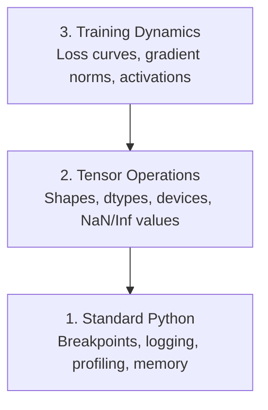

# 调整和配置文件

> 最糟糕的AI虫不会毁,而是沉默地训练垃圾,并报告一个美丽的损失曲线.

**Type:** Build
**Language:**字符串
**Prerequisites:** Lesson 1 (Dev Environment), basic PyTorch familiarity
**Time:** ~60 minutes

## 学习目标

- 使用条件`breakpoint()`其他`debug_print`检查子形状,dtype和NaN值在训练中
- 配置训练循环与`cProfile`现在`line_profiler`其他`tracemalloc`找瓶
- 检测常见的AI错误:形状不匹配,NaN损失,数据泄露和错误设备器
- 设置 TensorBoard 可可可查看损失曲线,权重 histogram 和梯度分布

## 问题

网络应用程序会出现条失败.一个错误配置的训练循环运行8小时,在GPU时间中燃烧200美元,并产生一个模型,预测每个输入的平均值.代码从来没有错误.错误是错误设备上的子,一个被遗忘的`.detach()`标签泄露到特征中.

需要检测这些默默失误的工具,

## 概念

人工智能调试在三个层次上运行:



大多数人直接跳到3级 (看TensorBoard). 但80%的AI bugs生活在1级和2级.

```figure
s0-flame-hot
```

## 建立它

### 第一个部分:打印问题 (是的,它可以工作)

对于子代码,一个目标打印语句比通过一个调试器进行排错更好,因为你需要同时看到形状,类型和值范围.

```python
def debug_print(name, tensor):
    print(f"{name}: shape={tensor.shape}, dtype={tensor.dtype}, "
          f"device={tensor.device}, "
          f"min={tensor.min().item():.4f}, max={tensor.max().item():.4f}, "
          f"mean={tensor.mean().item():.4f}, "
          f"has_nan={tensor.isnan().any().item()}")
```

任何可疑的操作后,请打电话,

### 第2部分:Python 调试器 (pdb 和破点)

由于人工智能工作,内置的调试器被低估.`breakpoint()`进入训练循环,并进行互动检查.

```python
def training_step(model, batch, criterion, optimizer):
    inputs, labels = batch
    outputs = model(inputs)
    loss = criterion(outputs, labels)

    if loss.item() > 100 or torch.isnan(loss):
        breakpoint()

    loss.backward()
    optimizer.step()
```

当调试器让你进入时,有用的命令:

- `p outputs.shape`检查形状
- `p loss.item()`查看损失值
- `p torch.isnan(outputs).sum()`计数纳米
- `p model.fc1.weight.grad`检查梯度
- `c`继续,`q`放弃

这只是条件调试,你只会停下来当有些东西看起来不对.

### 第三部分:Python记录

检查时,将打印声明取代为记录.

```python
import logging

logging.basicConfig(
    level=logging.INFO,
    format="%(asctime)s [%(levelname)s] %(message)s",
    handlers=[
        logging.FileHandler("training.log"),
        logging.StreamHandler()
    ]
)
logger = logging.getLogger(__name__)

logger.info("Starting training: lr=%.4f, batch_size=%d", lr, batch_size)
logger.warning("Loss spike detected: %.4f at step %d", loss.item(), step)
logger.error("NaN loss at step %d, stopping", step)
```

登录给你时间标签,严重程度水平和文件输出. 当训练运行在凌晨3点失败时,你需要一个日志文件,而不是终端输出,

### 第四部分:时间代码部分

知道时间的发展是优化第一步.

```python
import time

class Timer:
    def __init__(self, name=""):
        self.name = name

    def __enter__(self):
        self.start = time.perf_counter()
        return self

    def __exit__(self, *args):
        elapsed = time.perf_counter() - self.start
        print(f"[{self.name}] {elapsed:.4f}s")

with Timer("data loading"):
    batch = next(dataloader_iter)

with Timer("forward pass"):
    outputs = model(batch)

with Timer("backward pass"):
    loss.backward()
```

常见发现:数据加载需要60%的培训时间.`num_workers > 0`在你的数据加载器中,而不是更快的GPU.

### 第5部分:cProfile和line_profiiler

当你需要不仅仅是手动计时器时:

```bash
python -m cProfile -s cumtime train.py
```

这显示了每个函数调用按累积时间排序.

```bash
pip install line_profiler
```

```python
@profile
def train_step(model, data, target):
    output = model(data)
    loss = F.cross_entropy(output, target)
    loss.backward()
    return loss

# Run with: kernprof -l -v train.py
```

### 第六部分:记忆分析

#### 具有 tracemalloc 的CPU内存

```python
import tracemalloc

tracemalloc.start()

# your code here
model = build_model()
data = load_dataset()

snapshot = tracemalloc.take_snapshot()
top_stats = snapshot.statistics("lineno")
for stat in top_stats[:10]:
    print(stat)
```

#### 处理器内存与内存_配置文件

```bash
pip install memory_profiler
```

```python
from memory_profiler import profile

@profile
def load_data():
    raw = read_csv("data.csv")       # watch memory jump here
    processed = preprocess(raw)       # and here
    return processed
```

走上`python -m memory_profiler your_script.py`查看一行一行的内存使用.

#### 配备PyTorch的GPU内存

```python
import torch

if torch.cuda.is_available():
    print(torch.cuda.memory_summary())

    print(f"Allocated: {torch.cuda.memory_allocated() / 1e9:.2f} GB")
    print(f"Cached: {torch.cuda.memory_reserved() / 1e9:.2f} GB")
```

当你按OOM (Out of Memory) 时:

1. 减少批量 (首先尝试,总是)
2. 使用`torch.cuda.empty_cache()`释放缓存的内存
3. 使用`del tensor`接着是`torch.cuda.empty_cache()`对于大型中间产品
4. 使用混合精度 (`torch.cuda.amp`) 减少半个内存使用量
5. 对于非常深层模型使用梯度检查

### 第7部分:常见的人工智能虫害和如何捕获它们

#### 形状不匹配

子有形状.`[batch, features]`模型预期的时间`[batch, channels, height, width]`现在,我们要去.

```python
def check_shapes(model, sample_input):
    print(f"Input: {sample_input.shape}")
    hooks = []

    def make_hook(name):
        def hook(module, inp, out):
            in_shape = inp[0].shape if isinstance(inp, tuple) else inp.shape
            out_shape = out.shape if hasattr(out, "shape") else type(out)
            print(f"  {name}: {in_shape} -> {out_shape}")
        return hook

    for name, module in model.named_modules():
        hooks.append(module.register_forward_hook(make_hook(name)))

    with torch.no_grad():
        model(sample_input)

    for h in hooks:
        h.remove()
```

试试一次用样本,它将模型中的每个形状转变映射出来.

#### 损失

子的损失意味着爆炸.

- 学习率太高
- 关损失中零分
- 零或负数的记录
- 在RNN中爆炸梯度

```python
def detect_nan(model, loss, step):
    if torch.isnan(loss):
        print(f"NaN loss at step {step}")
        for name, param in model.named_parameters():
            if param.grad is not None:
                if torch.isnan(param.grad).any():
                    print(f"  NaN gradient in {name}")
                if torch.isinf(param.grad).any():
                    print(f"  Inf gradient in {name}")
        return True
    return False
```

#### 数据泄露

你的模型在测试组上得到了99%的准确性.听起来很好.这是一个错误.

```python
def check_data_leakage(train_set, test_set, id_column="id"):
    train_ids = set(train_set[id_column].tolist())
    test_ids = set(test_set[id_column].tolist())
    overlap = train_ids & test_ids
    if overlap:
        print(f"DATA LEAKAGE: {len(overlap)} samples in both train and test")
        return True
    return False
```

通过使用未来数据来预测过去,在分开之前按时间标签进行排序.

#### 错误的设备

虽然在不同设备 (CPU与GPU) 上的光器会导致运行时间错误.但有时一个光器默默地停留在CPU上,而其他的东西在GPU上,

```python
def check_devices(model, *tensors):
    model_device = next(model.parameters()).device
    print(f"Model device: {model_device}")
    for i, t in enumerate(tensors):
        if t.device != model_device:
            print(f"  WARNING: tensor {i} on {t.device}, model on {model_device}")
```

### 第8部分:机板的基本原理

子板显示了训练过程中的情况.

```bash
pip install tensorboard
```

```python
from torch.utils.tensorboard import SummaryWriter

writer = SummaryWriter("runs/experiment_1")

for step in range(num_steps):
    loss = train_step(model, batch)

    writer.add_scalar("loss/train", loss.item(), step)
    writer.add_scalar("lr", optimizer.param_groups[0]["lr"], step)

    if step % 100 == 0:
        for name, param in model.named_parameters():
            writer.add_histogram(f"weights/{name}", param, step)
            if param.grad is not None:
                writer.add_histogram(f"grads/{name}", param.grad, step)

writer.close()
```

发射:

```bash
tensorboard --logdir=runs
```

什么要找:

- **Loss not decreasing**学习率太低,或模型架构问题
- **Loss oscillating wildly**学习率太高
- **Loss goes to NaN**: 数字不稳定 (参见上述NAN部分)
- **Train loss decreasing, val loss increasing**过度装饰
- **Weight histograms collapsing to zero**: 渐变的梯度
- **Gradient histograms exploding**需要梯度剪切

### 第9部分: VS代码调试器

为了进行交互调试,配置VS代码`launch.json`其他:

```json
{
    "version": "0.2.0",
    "configurations": [
        {
            "name": "Debug Training",
            "type": "debugpy",
            "request": "launch",
            "program": "${file}",
            "console": "integratedTerminal",
            "justMyCode": false
        }
    ]
}
```

通过点击道设置断点. 使用变量窗口检查子属性. 调试控制台允许在执行中运行任意的Python表达式.

通过数据预处理管道, 看到每个转换.

## 用它

这里是检测大部分人工智能错误的调试工作流程:

1. **Before training**跑步`check_shapes`检查输入和输出尺寸符合预期.
2. **First 10 steps**使用 `debug_print`确认没有任何 NaN,值在合理的范围内.
3. **During training**通过TensorBoard进行可视化.
4. **When something breaks**放下`breakpoint()`检查电压器的互动性.
5. **For performance**时间数据加载,前进,后退传输,如果您接近OOM,则配置文件内存.

## 运送它

运行调试工具包脚本:

```bash
python phases/00-setup-and-tooling/12-debugging-and-profiling/code/debug_tools.py
```

看到`outputs/prompt-debug-ai-code.md`通过一个提示来诊断人工智能特定的错误.

## 运动

1. 跑步`debug_tools.py`修改模特以引入一个NaN (提示:在前进传输中除以零) 并观看探测器抓住它.
2. 配置一个训练循环`cProfile`并且确定最慢的函数.
3. 使用`tracemalloc`查找数据加载管道中哪条线分配最多的内存.
4. 设置TensorBoard进行简单的训练, 确定模型是否过度适合.
5. 使用`breakpoint()`练习检查子形状,设备和梯度值从调试器提示.
