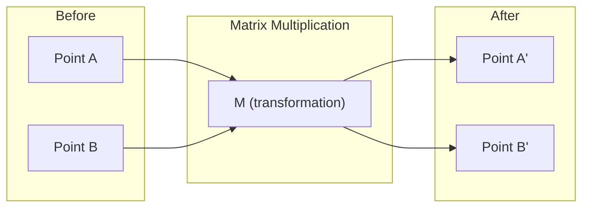
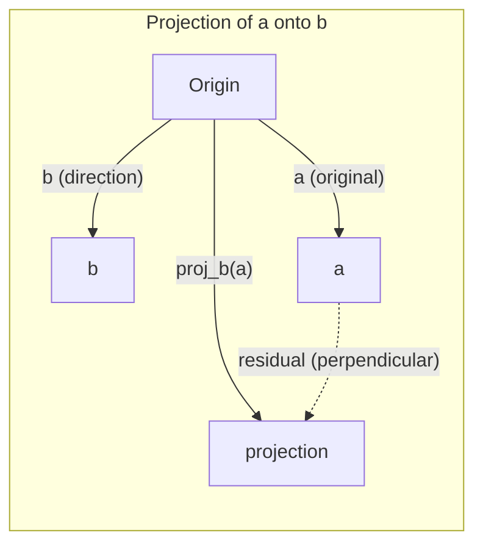

# 线性代数直观

> 每个人工智能模型都是用高档帽子的矩阵数学.

**Type:** Learn
**Languages:** Python, Julia
**Prerequisites:** Phase 0
**Time:** ~60 minutes

## 学习目标

- 在Python中从零开始实现向量和矩阵操作 (加值,点数,矩阵乘法)
- 几何地解释点产品,投影和格兰姆-施密特过程所做的事情
- 使用排序缩小来确定对向量的线性独立性,排列和基础
- 连接线性代数概念到AI应用:嵌入,注意力分数和LoRA

## 问题

打开任何ML文件. 在第一页内,你会看到向量,矩阵,点产品和转化.没有线性代数直觉,这些只是符号.用它,你可以看到神经网络实际上在做什么 - - 移动空间中的点.

你不需要成为数学家,你需要看到这些运算的几何含义,然后自己编码它们.

## 概念

### 矢量是点 (和方向)

矢量只是一个数量列表. 但这些数字意味着什么 - - 他们是空间中的坐标.

**2D vector [3, 2]:**

| x | y | Point |
|---|---|-------|
| 3 | 2 | The vector points from origin (0,0) to (3, 2) on the plane |

矢量有3^2 +2^2) =3^3 () 向上向右.

在人工智能中,向量代表了一切:
- 一个词 → 768 个数字的向量 (其"含义"在嵌入空间中)
- 一个图像 → 数百万像素值的向量
- 一个用户 → 偏好向量

### 矩阵是变化

一个矩阵将一个向量转化为另一个. 它可以旋转,扩展,延伸或投影.



在人工智能中,矩阵是模型:
- 转换输入成输出的神经网络重量 →矩阵
- 关注分数 → 决定要专注于什么的矩阵
- 嵌入式 → 矩阵将单词映射到向量

### 点产品测量相似性

两个向量的点乘法告诉你它们是多么相似.

```
a · b = a₁×b₁ + a₂×b₂ + ... + aₙ×bₙ

Same direction:      a · b > 0  (similar)
Perpendicular:       a · b = 0  (unrelated)
Opposite direction:  a · b < 0  (dissimilar)
```

这就是搜索引擎,推系统和RAG的工作方式 - - 找到高点产品的向量.

### 线性独立性

如果集合中没有向量可以被写成其他向量的组合,则向量是线性独立的.如果v1,v2,v3是独立的,则它们跨越3D空间.如果一个是其他向量的组合,则它们只跨越平面.

为什么对人工智能很重要:你的特征矩阵应该有线性独立的列.如果两个特征完全相连 (线性依赖),模型无法区分它们的效果.这导致回归的多线性 - - 重量矩阵变得不稳定,小输入变化产生了野蛮的输出波动.

**Concrete example:**

```
v1 = [1, 0, 0]
v2 = [0, 1, 0]
v3 = [2, 1, 0]   # v3 = 2*v1 + v2
```

v1和 v2是独立的,既不是一个尺度乘数,也不是一个结合的.但是 v3 = 2*v1 + v2,所以 {v1, v2, v3} 是一个依赖的集合.这些三个向量都位于xy平面.不管你如何结合它们,你不能达到 [0, 0, 1].你有三个向量,但只有两个自由维度.

在数据集中:如果 feature_3 = 2*feature_1 + feature_2,添加 feature_3给模型提供了零新信息.更糟糕的是,它使正常方程单一 - 对于权重没有唯一的解决方案.

### 基础和地位

基础是整个空间的最小线性独立向量集合.

3D空间的标准基础是 {[1,0,0], [0,1,0], [0,0,1]}.但在3D中任何三个独立向量都构成一个有效的基础.

矩阵的排名 = 线性独立列数 = 线性独立列数.如果排名 < min(列, cols),矩阵是排名不足的.这意味着:
- 系统有无限多的解决方案 (或没有)
- 信息在转变中丢失
- 矩阵不能倒车

| Situation | Rank | What it means for ML |
|-----------|------|---------------------|
| Full rank (rank = min(m, n)) | Maximum possible | Unique least-squares solution exists. Model is well-conditioned. |
| Rank deficient (rank < min(m, n)) | Below maximum | Features are redundant. Infinitely many weight solutions. Regularization needed. |
| Rank 1 | 1 | Every column is a scaled copy of one vector. All data lies on a line. |
| Near rank-deficient (small singular values) | Numerically low | Matrix is ill-conditioned. Tiny input noise causes large output changes. Use SVD truncation or ridge regression. |

### 投影

投影向量**a**在向量上**b**给出了**a**方向**b**其他:

```
proj_b(a) = (a dot b / b dot b) * b
```

剩余 (a - proj_b(a)) 垂直于b.这种直角分解是最小平方的配件的基础.

在ML中,投影在任何地方:
- 线性回归将从观测到列空间的距离降至最低 - - 解决方案是投影
- PCA对最大差距方向进行数据投影
- 转变器中的注意力计算了查询对键的投影



**Example:**其他类型的子

其他类型的产品:

投影下降了y元件.这是其最简单的形式的维度减少 - - 抛弃你不关心的方向.

### 格拉姆-施密德过程

转换任何单独向量集合为一个正规的基础.正规意味着每个向量都有长度1并且每个对都是垂直的.

算法:
1. 取第一向量,正常化它
2. 取第二个向量,减去它的投影到第一个,正常化
3. 减去其投影到之前的所有向量,正常化
4. 复制剩余的向量

```
Input:  v1, v2, v3, ... (linearly independent)

u1 = v1 / |v1|

w2 = v2 - (v2 dot u1) * u1
u2 = w2 / |w2|

w3 = v3 - (v3 dot u1) * u1 - (v3 dot u2) * u2
u3 = w3 / |w3|

Output: u1, u2, u3, ... (orthonormal basis)
```

是正规的基础,R捕获投影系数.QR分解用于:
- 解决线性系统 (比高斯消除更稳定)
- 计算自值 (QR算法)
- 最小方体回归 (标准数值方法)

```figure
eigen-directions
```

## 建立它

### 步骤1:从零开始的向量 (Python)

```python
class Vector:
    def __init__(self, components):
        self.components = list(components)
        self.dim = len(self.components)

    def __add__(self, other):
        return Vector([a + b for a, b in zip(self.components, other.components)])

    def __sub__(self, other):
        return Vector([a - b for a, b in zip(self.components, other.components)])

    def dot(self, other):
        return sum(a * b for a, b in zip(self.components, other.components))

    def magnitude(self):
        return sum(x**2 for x in self.components) ** 0.5

    def normalize(self):
        mag = self.magnitude()
        return Vector([x / mag for x in self.components])

    def cosine_similarity(self, other):
        return self.dot(other) / (self.magnitude() * other.magnitude())

    def __repr__(self):
        return f"Vector({self.components})"


a = Vector([1, 2, 3])
b = Vector([4, 5, 6])

print(f"a + b = {a + b}")
print(f"a · b = {a.dot(b)}")
print(f"|a| = {a.magnitude():.4f}")
print(f"cosine similarity = {a.cosine_similarity(b):.4f}")
```

### 步骤2:从零开始的矩阵 (Python)

```python
class Matrix:
    def __init__(self, rows):
        self.rows = [list(row) for row in rows]
        self.shape = (len(self.rows), len(self.rows[0]))

    def __matmul__(self, other):
        if isinstance(other, Vector):
            return Vector([
                sum(self.rows[i][j] * other.components[j] for j in range(self.shape[1]))
                for i in range(self.shape[0])
            ])
        rows = []
        for i in range(self.shape[0]):
            row = []
            for j in range(other.shape[1]):
                row.append(sum(
                    self.rows[i][k] * other.rows[k][j]
                    for k in range(self.shape[1])
                ))
            rows.append(row)
        return Matrix(rows)

    def transpose(self):
        return Matrix([
            [self.rows[j][i] for j in range(self.shape[0])]
            for i in range(self.shape[1])
        ])

    def __repr__(self):
        return f"Matrix({self.rows})"


rotation_90 = Matrix([[0, -1], [1, 0]])
point = Vector([3, 1])

rotated = rotation_90 @ point
print(f"Original: {point}")
print(f"Rotated 90°: {rotated}")
```

### 步骤3:为什么这对人工智能很重要

```python
import random

random.seed(42)
weights = Matrix([[random.gauss(0, 0.1) for _ in range(3)] for _ in range(2)])
input_vector = Vector([1.0, 0.5, -0.3])

output = weights @ input_vector
print(f"Input (3D): {input_vector}")
print(f"Output (2D): {output}")
print("This is what a neural network layer does -- matrix multiplication.")
```

### 步骤4:朱莉亚版本

```julia
a = [1.0, 2.0, 3.0]
b = [4.0, 5.0, 6.0]

println("a + b = ", a + b)
println("a · b = ", a ⋅ b)       # Julia supports unicode operators
println("|a| = ", √(a ⋅ a))
println("cosine = ", (a ⋅ b) / (√(a ⋅ a) * √(b ⋅ b)))

# Matrix-vector multiplication
W = [0.1 -0.2 0.3; 0.4 0.5 -0.1]
x = [1.0, 0.5, -0.3]
println("Wx = ", W * x)
println("This is a neural network layer.")
```

### 步骤5:线性独立和从零开始投影 (Python)

```python
def is_linearly_independent(vectors):
    n = len(vectors)
    dim = len(vectors[0].components)
    mat = Matrix([v.components[:] for v in vectors])
    rows = [row[:] for row in mat.rows]
    rank = 0
    for col in range(dim):
        pivot = None
        for row in range(rank, len(rows)):
            if abs(rows[row][col]) > 1e-10:
                pivot = row
                break
        if pivot is None:
            continue
        rows[rank], rows[pivot] = rows[pivot], rows[rank]
        scale = rows[rank][col]
        rows[rank] = [x / scale for x in rows[rank]]
        for row in range(len(rows)):
            if row != rank and abs(rows[row][col]) > 1e-10:
                factor = rows[row][col]
                rows[row] = [rows[row][j] - factor * rows[rank][j] for j in range(dim)]
        rank += 1
    return rank == n


def project(a, b):
    scalar = a.dot(b) / b.dot(b)
    return Vector([scalar * x for x in b.components])


def gram_schmidt(vectors):
    orthonormal = []
    for v in vectors:
        w = v
        for u in orthonormal:
            proj = project(w, u)
            w = w - proj
        if w.magnitude() < 1e-10:
            continue
        orthonormal.append(w.normalize())
    return orthonormal


v1 = Vector([1, 0, 0])
v2 = Vector([1, 1, 0])
v3 = Vector([1, 1, 1])
basis = gram_schmidt([v1, v2, v3])
for i, u in enumerate(basis):
    print(f"u{i+1} = {u}")
    print(f"  |u{i+1}| = {u.magnitude():.6f}")

print(f"u1 · u2 = {basis[0].dot(basis[1]):.6f}")
print(f"u1 · u3 = {basis[0].dot(basis[2]):.6f}")
print(f"u2 · u3 = {basis[1].dot(basis[2]):.6f}")
```

## 用它

现在,NumPy的情况也一样,实际上你会使用的东西:

```python
import numpy as np

a = np.array([1, 2, 3], dtype=float)
b = np.array([4, 5, 6], dtype=float)

print(f"a + b = {a + b}")
print(f"a · b = {np.dot(a, b)}")
print(f"|a| = {np.linalg.norm(a):.4f}")
print(f"cosine = {np.dot(a, b) / (np.linalg.norm(a) * np.linalg.norm(b)):.4f}")

W = np.random.randn(2, 3) * 0.1
x = np.array([1.0, 0.5, -0.3])
print(f"Wx = {W @ x}")
```

### 排名,投影和QR使用NumPy

```python
import numpy as np

A = np.array([[1, 2], [2, 4]])
print(f"Rank: {np.linalg.matrix_rank(A)}")

a = np.array([3, 4])
b = np.array([1, 0])
proj = (np.dot(a, b) / np.dot(b, b)) * b
print(f"Projection of {a} onto {b}: {proj}")

Q, R = np.linalg.qr(np.random.randn(3, 3))
print(f"Q is orthogonal: {np.allclose(Q @ Q.T, np.eye(3))}")
print(f"R is upper triangular: {np.allclose(R, np.triu(R))}")
```

### 光 - 电压器是自动变化的向量

```python
import torch

x = torch.randn(3, requires_grad=True)
y = torch.tensor([1.0, 0.0, 0.0])

similarity = torch.dot(x, y)
similarity.backward()

print(f"x = {x.data}")
print(f"y = {y.data}")
print(f"dot product = {similarity.item():.4f}")
print(f"d(dot)/dx = {x.grad}")
```

对于 x 的点子产量的梯度只是 y. PyTorch 计算了这个自动. 神经网络中的每一个操作都是由这样的操作构建的 - - 矩阵乘法,点子产品,投影 - -

你刚刚从头开始把NumPy在一行里做了什么,现在你知道在帽子下发生了什么.

## 运送它

这一课产生了:
- `outputs/prompt-linear-algebra-tutor.md`-- 让人工智能助理通过几何直觉教线性代数

## 联系

这一课中的一切都与现代人工智能的特定部分有关:

| Concept | Where it shows up |
|---------|------------------|
| Dot product | Attention scores in transformers, cosine similarity in RAG |
| Matrix multiply | Every neural network layer, every linear transformation |
| Linear independence | Feature selection, avoiding multicollinearity |
| Rank | Determining if a system is solvable, LoRA (low-rank adaptation) |
| Projection | Linear regression (projecting onto column space), PCA |
| Gram-Schmidt / QR | Numerical solvers, eigenvalue computation |
| Orthonormal basis | Stable numerical computation, whitening transforms |

洛拉值得特别提及. 它通过将重量更新分解成低级矩阵来细节化大型语言模型. 洛拉 (LoRA) 没有更新4096x4096重量矩阵 (16M参数),而是更新了两个4096x16和16x4096 (131K参数) 尺寸的矩阵. 排名16的限制意味着LoRA假设重量更新在全4096维空间的16维子空间中生活. 这就是线性代数做了真正的工作.

## 运动

1. 实施`Vector.angle_between(other)`返回两个向量之间的度角
2. 创建一个2D扩展矩阵,将x坐标翻倍和y坐标三倍,然后将其应用到向量 [1, 1]
3. 给出5个随机字样向量 (维度50),使用共数相似性找到两个最相似的
4. 检查Gram-Schmidt输出是否真的正规:检查每个对都有点产量0和每个向量都有大小1
5. 创建一个3x3矩阵,排名 2. 通过 验证`rank()`然后解释列的几何对象.
6. 投向向量 [1,2,3] 到 [1,1,1].结果的几何表现是什么?

## 关键词

| Term | What people say | What it actually means |
|------|----------------|----------------------|
| Vector | "An arrow" | A list of numbers representing a point or direction in n-dimensional space |
| Matrix | "A table of numbers" | A transformation that maps vectors from one space to another |
| Dot product | "Multiply and sum" | A measure of how aligned two vectors are -- the core of similarity search |
| Embedding | "Some AI magic" | A vector that represents the meaning of something (word, image, user) |
| Linear independence | "They don't overlap" | No vector in the set can be written as a combination of the others |
| Rank | "How many dimensions" | The number of linearly independent columns (or rows) in a matrix |
| Projection | "The shadow" | The component of one vector in the direction of another |
| Basis | "The coordinate axes" | A minimal set of independent vectors that span the space |
| Orthonormal | "Perpendicular unit vectors" | Vectors that are mutually perpendicular and each have length 1 |
