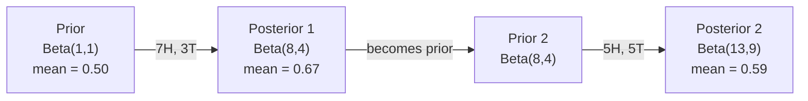

# 贝叶斯定理

> 概率是你预期的,贝叶斯定理是你学习的.

**Type:** Build
**Language:**字符串
**Prerequisites:** Phase 1, Lesson 06 (Probability Fundamentals)
**Time:** ~75 minutes

## 学习目标

- 应用贝叶斯定理来计算后期概率从前,概率和证据
- 创建一个简单的贝叶斯文本分类器从零开始,使用拉普莱斯平滑和日志空间计算
- 比较MLE和MAP估计,并解释MAP如何与L2规范化相符
- 执行使用Beta-Binomial结合前列进行A/B测试的连续贝叶斯式更新

## 问题

医疗检查是99%准确的.你检测得阳性.你确实有什么机会患上这种疾病?

大多数人说99%.真实的答案取决于这种疾病是多么罕见.如果每1万人中有1人患有这种疾病,积极的结果只会给你患病的机会大约1%.其余的99%的积极结果是健康人发出的虚假警报.

这不是一个诡计的问题.这是贝叶斯定理.每一个垃圾邮件过器,每一个医疗诊断,每一个测量不确定性的机器学习模型都使用了这个正确的推理.你从一个信念开始.你看到证据.你更新.

如果你没有理解这一点,就会误解模型输出,设定不好的门,

## 概念

### 从联合概率到贝斯

根据第六课,你已经知道条件概率是:

```
P(A|B) = P(A and B) / P(B)
```

并且对称:

```
P(B|A) = P(A and B) / P(A)
```

两个表达式都有相同的数值:P(A和B). 设置它们为等,然后重新排列:

```
P(A and B) = P(A|B) * P(B) = P(B|A) * P(A)

Therefore:

P(A|B) = P(B|A) * P(A) / P(B)
```

这就是贝叶斯定理,四个量,一个方程.

### 它们的四部分

| Part | Name | What it means |
|------|------|---------------|
| P(A\|B) | Posterior | Your updated belief about A after seeing evidence B |
| P(B\|A) | Likelihood | How probable the evidence B is if A is true |
| P(A) | Prior | Your belief about A before seeing any evidence |
| P(B) | Evidence | Total probability of seeing B under all possibilities |

证据术语P(B) 作为一个正常化.你可以用总概率定律扩展它:

```
P(B) = P(B|A) * P(A) + P(B|not A) * P(not A)
```

### 医疗检测的例子

检测结果是99%准确的 (检测结果是99%的病人,结果是1%的错误阳性).

```
P(sick)          = 0.0001     (prior: disease is rare)
P(positive|sick) = 0.99       (likelihood: test catches it)
P(positive|healthy) = 0.01    (false positive rate)

P(positive) = P(positive|sick) * P(sick) + P(positive|healthy) * P(healthy)
            = 0.99 * 0.0001 + 0.01 * 0.9999
            = 0.000099 + 0.009999
            = 0.010098

P(sick|positive) = P(positive|sick) * P(sick) / P(positive)
                 = 0.99 * 0.0001 / 0.010098
                 = 0.0098
                 = 0.98%
```

医生们说,如果病情很少,即使是精确的测试也会产生虚假阳性.

### 垃圾邮件过器的例子

你收到一封包含"彩票"的电子邮件.

```
P(spam)                = 0.3      (30% of email is spam)
P("lottery"|spam)      = 0.05     (5% of spam emails contain "lottery")
P("lottery"|not spam)  = 0.001    (0.1% of legitimate emails contain "lottery")

P("lottery") = 0.05 * 0.3 + 0.001 * 0.7
             = 0.015 + 0.0007
             = 0.0157

P(spam|"lottery") = 0.05 * 0.3 / 0.0157
                  = 0.955
                  = 95.5%
```

一个字将概率从30%转移到95.5%. 一个真正的垃圾邮件过器同时应用百度百度单词.

### 简单的贝耶斯:独立假设

简单的贝耶斯将这一点扩展到多个特征,假设所有特征都在给类别的条件下独立:

```
P(class | feature_1, feature_2, ..., feature_n)
  = P(class) * P(feature_1|class) * P(feature_2|class) * ... * P(feature_n|class)
    / P(feature_1, feature_2, ..., feature_n)
```

单词出现并不独立 ("新"和"纽约"相关).但这种假设在实践中非常有效,因为分类器只需要排名类,而不是产生校准概率.

由于所有类的分母是相同的,所以你可以跳过它,

```
score(class) = P(class) * product of P(feature_i | class)
```

选择最高分的班级.

### 极限概率估计 (MLE)

如何从训练数据中获得P (特征性) 类?

```
P("free"|spam) = (number of spam emails containing "free") / (total spam emails)
```

现在,我们要选择最可能的参数值, 并且要最大化概率函数,

问题:如果一个词在训练中从来没有出现在垃圾邮件中,MLE给它一个可能性是零.一个未见的词会杀死整个产品.

```
P(word|class) = (count(word, class) + 1) / (total_words_in_class + vocabulary_size)
```

增加1个数量,确保没有可能性是零的.

### 后期最大 (MAP)

们需要了解到哪些参数可以最大化数据参数的 P ?

图表问:什么参数可以最大化P 参数在数据中)?

根据贝叶斯定理:

```
P(parameters|data) proportional to P(data|parameters) * P(parameters)
```

图为""的定位,即""的定位,即""的定位,即""的定位.

| Estimation | Optimizes | ML equivalent |
|------------|-----------|---------------|
| MLE | P(data\|params) | Unregularized training |
| MAP | P(data\|params) * P(params) | L2 / L1 regularization |

### 贝叶斯人与频率主义者:实际的区别

频率学家认为参数是固定的未知的.他们问道:"如果我重复这个实验多次,会发生什么?"

贝叶斯人把参数视为分布,他们问:"鉴于我观察到的,我对参数有什么看法?"

对于构建ML系统,实际的区别:

| Aspect | Frequentist | Bayesian |
|--------|-------------|----------|
| Output | Point estimate | Distribution over values |
| Uncertainty | Confidence intervals (about procedure) | Credible intervals (about parameter) |
| Small data | Can overfit | Prior acts as regularization |
| Computation | Usually faster | Often requires sampling (MCMC) |

贝耶斯方法在需要校准不确定性 (医疗决策,安全关键系统) 或数据稀缺时 (短暂学习,冷启动) 闪耀.

### 为什么贝耶斯思想对 ML 重要

它们的联系比比喻更深.

**Priors are regularization.**对于重量来说,一个高斯式先例是L2规律化.一个拉普莱斯式先例是L1.每次你添加一个规律化术语,你就会做一个贝耶斯式声明,你预计的参数值是什么.

**Posteriors are uncertainty.**贝耶斯方法给出了分布:"我认为P(spam) 在0.8到0.95之间.

**Bayes updates are online learning.**当你的模型看到新的数据时,它会逐步更新自己的信念,而不是从头开始重新训练.

**Model comparison is Bayesian.**贝叶斯信息标准 (BIC),边际概率和贝叶斯因素都使用贝叶斯推理来选择没有过度适应的模型.

```figure
bayes-update
```

## 建立它

### 步骤1:贝叶斯定理函数

```python
def bayes(prior, likelihood, false_positive_rate):
    evidence = likelihood * prior + false_positive_rate * (1 - prior)
    posterior = likelihood * prior / evidence
    return posterior

result = bayes(prior=0.0001, likelihood=0.99, false_positive_rate=0.01)
print(f"P(sick|positive) = {result:.4f}")
```

### 步骤2: 简单的贝叶斯分类器

```python
import math
from collections import defaultdict

class NaiveBayes:
    def __init__(self, smoothing=1.0):
        self.smoothing = smoothing
        self.class_counts = defaultdict(int)
        self.word_counts = defaultdict(lambda: defaultdict(int))
        self.class_word_totals = defaultdict(int)
        self.vocab = set()

    def train(self, documents, labels):
        for doc, label in zip(documents, labels):
            self.class_counts[label] += 1
            words = doc.lower().split()
            for word in words:
                self.word_counts[label][word] += 1
                self.class_word_totals[label] += 1
                self.vocab.add(word)

    def predict(self, document):
        words = document.lower().split()
        total_docs = sum(self.class_counts.values())
        vocab_size = len(self.vocab)
        best_class = None
        best_score = float("-inf")
        for cls in self.class_counts:
            score = math.log(self.class_counts[cls] / total_docs)
            for word in words:
                count = self.word_counts[cls].get(word, 0)
                total = self.class_word_totals[cls]
                score += math.log((count + self.smoothing) / (total + self.smoothing * vocab_size))
            if score > best_score:
                best_score = score
                best_class = cls
        return best_class
```

记载概率防止下流.乘以许多小概率产生数量太小,无法浮动点.编算记载概率是数学的稳定和数学上的等价.

### 步骤3:训练垃圾邮件数据

```python
train_docs = [
    "win free money now",
    "free lottery ticket winner",
    "claim your prize today free",
    "urgent offer free cash",
    "congratulations you won free",
    "meeting tomorrow at noon",
    "project update attached",
    "can we schedule a call",
    "quarterly report review",
    "lunch on thursday sounds good",
    "team standup notes attached",
    "please review the pull request",
]

train_labels = [
    "spam", "spam", "spam", "spam", "spam",
    "ham", "ham", "ham", "ham", "ham", "ham", "ham",
]

classifier = NaiveBayes()
classifier.train(train_docs, train_labels)

test_messages = [
    "free money waiting for you",
    "meeting rescheduled to friday",
    "you won a free prize",
    "please review the attached report",
]

for msg in test_messages:
    print(f"  '{msg}' -> {classifier.predict(msg)}")
```

### 步骤4:检查所学到的可能性

```python
def show_top_words(classifier, cls, n=5):
    vocab_size = len(classifier.vocab)
    total = classifier.class_word_totals[cls]
    probs = {}
    for word in classifier.vocab:
        count = classifier.word_counts[cls].get(word, 0)
        probs[word] = (count + classifier.smoothing) / (total + classifier.smoothing * vocab_size)
    sorted_words = sorted(probs.items(), key=lambda x: x[1], reverse=True)
    for word, prob in sorted_words[:n]:
        print(f"    {word}: {prob:.4f}")

print("\nTop spam words:")
show_top_words(classifier, "spam")
print("\nTop ham words:")
show_top_words(classifier, "ham")
```

## 用它

无辜的贝伊斯实施,准备生产的飞船:

```python
from sklearn.feature_extraction.text import CountVectorizer
from sklearn.naive_bayes import MultinomialNB
from sklearn.metrics import classification_report

vectorizer = CountVectorizer()
X_train = vectorizer.fit_transform(train_docs)
clf = MultinomialNB()
clf.fit(X_train, train_labels)

X_test = vectorizer.transform(test_messages)
predictions = clf.predict(X_test)
for msg, pred in zip(test_messages, predictions):
    print(f"  '{msg}' -> {pred}")
```

算法相同. CountVectorizer处理代码化和词汇构建. MultinomialNB处理内地平滑和日志概率.你的从头开始版本在40行中做同样的事情.

## 运送它

代码在 果中是 果的代码, 代码在 果的代码中是 果的代码.`code/bayes.py`无需超越Python的标准库的依赖性.

### 结合的先驱

当前和后的分布属于同一类分布时,前的分布被称为"结合". 这使得贝耶斯的更新对代数清洁 - - 你得到一个没有数字集成的闭式后的形式.

| Likelihood | Conjugate Prior | Posterior | Example |
|-----------|----------------|-----------|---------|
| Bernoulli | Beta(a, b) | Beta(a + successes, b + failures) | Coin flip bias estimation |
| Normal (known variance) | Normal(mu_0, sigma_0) | Normal(weighted mean, smaller variance) | Sensor calibration |
| Poisson | Gamma(a, b) | Gamma(a + sum of counts, b + n) | Modeling arrival rates |
| Multinomial | Dirichlet(alpha) | Dirichlet(alpha + counts) | Topic modeling, language models |

没有结合前数,你需要蒙特卡罗样本或变化推理来接近后方.

贝塔分布是实践中最常见的结合式先.贝塔 (a,b) 表示你对概率参数的信念.平均值是/(a+b).a+b越大,分布就越集中 (自信).

贝塔前的特殊情况:
- 您对参数没有意见.
- 测量量量是0.5的.
- 测量参数是小的.

更新规则非常简单:

```
Prior:     Beta(a, b)
Data:      s successes, f failures
Posterior: Beta(a + s, b + f)
```

没有整体,没有样本,只是加算.

### 序列的贝叶斯语更新

贝叶斯推理是自然的序列.今天的后者成为明天的前者. 这就是真正的系统在没有重新处理所有历史数据的情况下逐步学习的方式.

具体例子:估计硬币是否公平.

**Day 1: No data yet.**
首先,Beta 1, 1,是统一的前任.
- 前平均:0.5
- 预先是平面的 [0, 1]

**Day 2: Observe 7 heads, 3 tails.**
后面 = 贝塔 (Beta) 1 + 7, 1 + 3) = 贝塔 (Beta) 8, 4)
- 后期平均值: 8/12 = 0.667
- 证据表明,硬币偏向头部

**Day 3: Observe 5 more heads, 5 more tails.**
现在用昨天的后面作为今天的前面.
后面 = 贝塔 ((8 + 5, 4 + 5) = 贝塔 ((13, 9)
- 后期平均值: 13/22 = 0.591
- 根据新的平衡数据,估计将重回0.5



测量顺序并不重要.Beta(1,1) 一次更新了所有12个头和8个尾,结果是Beta(13,9) - - 同样的结果.序列更新和批量更新是数学上相当的.但序列更新让你在每一步都能做出决定,而不需要存储原始数据.

这就是生产ML系统的在线学习的基础. 普森对盗进行样本取,增量推系统和流动异性检测器都使用这种模式.

### 连接到A/B测试

化测试是贝叶斯推理.

设置:您正在测试两个按颜色:A变体 (蓝色) 和B变体 (绿色).您想知道哪个获得更多点击.

贝耶斯 A/B 测试:

1. **Prior.**开始与Beta(1,1) 对两个变体.
2. **Data.**选择A: 1000个浏览中50个点击,选择B: 1000个浏览中65个点击.
3. **Posteriors.**
   - 答:Beta(1 + 50,1 + 950) =Beta(51,951).平均值 =0.051
   - 平均值为0.066
4. **Decision.**计算P ((B>A) -- B的真实转换率比A的可能性更高.

分析计算P (B) >A) 很难,但蒙特卡罗使得它很微不足道:

```
1. Draw 100,000 samples from Beta(51, 951)  -> samples_A
2. Draw 100,000 samples from Beta(66, 936)  -> samples_B
3. P(B > A) = fraction of samples where B > A
```

如果P(B > A) >0.95,你将运送B变体.如果它在0.05到0.95之间,你会继续收集数据.如果P(B > A) <0.05,你将运送A变体.

频率A/B测试的优势:
- 你得到了直接的概率声明:"有97%的机会B更好"
- 没有p值的混,没有"未能拒绝零假设"的对冲.
- 您可以随时检查结果,而不需要加大假阳性率 (没有"查问题")
- 您可以包含先前的知识 (例如,之前的测试表明转换率通常为3-8%)

| Aspect | Frequentist A/B | Bayesian A/B |
|--------|----------------|--------------|
| Output | p-value | P(B > A) |
| Interpretation | "How surprising is this data if A=B?" | "How likely is B better than A?" |
| Early stopping | Inflates false positives | Safe at any point (given a well-chosen prior and correctly specified model) |
| Prior knowledge | Not used | Encoded as Beta prior |
| Decision rule | p < 0.05 | P(B > A) > threshold |

## 运动

1. **Multiple tests.**一个患者在独立测试中检测得两次阳性 (两者都99%准确,病例在1万中1).两次测试后,P(病是什么?使用第一次测试后者作为第二次测试的前者.

2. **Smoothing impact.**运行垃圾邮件分类器,以0.01,0.1,1.0,和10.0的平滑值运行.顶级词概率如何改变?平滑=0和只出现在子中的词发生了什么?

3. **Add features.**扩展NaiveBayes类,以同时使用短/长的消息长度作为单词数量的功能. 从训练数据中估计P(short的时代垃圾) 和P(short的时代,然后将其折叠成预测分数.

4. **MAP by hand.**根据观察到的数据 (7个头10个币),使用Beta(2,2) 预先计算偏差的MAP估计,并将其与MLE估计 (7/10) 进行比较.

## 关键词

| Term | What people say | What it actually means |
|------|----------------|----------------------|
| Prior | "My initial guess" | P(hypothesis) before observing evidence. In ML: the regularization term. |
| Likelihood | "How well the data fits" | P(evidence\|hypothesis). How probable the observed data is under a specific hypothesis. |
| Posterior | "My updated belief" | P(hypothesis\|evidence). The prior multiplied by the likelihood, then normalized. |
| Evidence | "The normalizing constant" | P(data) across all hypotheses. Ensures the posterior sums to 1. |
| Naive Bayes | "That simple text classifier" | A classifier that assumes features are independent given the class. Works well despite the false assumption. |
| Laplace smoothing | "Add-one smoothing" | Adding a small count to every feature to prevent zero probabilities from unseen data. |
| MLE | "Just use the frequencies" | Choose parameters that maximize P(data\|parameters). No prior. Can overfit with small data. |
| MAP | "MLE with a prior" | Choose parameters that maximize P(data\|parameters) * P(parameters). Equivalent to regularized MLE. |
| Log-probability | "Work in log space" | Using log(P) instead of P to avoid floating-point underflow when multiplying many small numbers. |
| False positive | "A wrong alarm" | The test says positive, but the true state is negative. Drives the base rate fallacy. |

## 进一步阅读

- [3Blue1Brown: Bayes' theorem](https://www.youtube.com/watch?v=HZGCoVF3YvM)- 视觉解释与医疗检测示例
- [Stanford CS229: Generative Learning Algorithms](https://cs229.stanford.edu/notes2022fall/cs229-notes2.pdf)- 简单的贝尔斯及其与歧视性模式的联系
- [Think Bayes](https://greenteapress.com/wp/think-bayes/)- 免费书,贝耶斯统计数据,使用Python代码
- [scikit-learn Naive Bayes](https://scikit-learn.org/stable/modules/naive_bayes.html)-生产实施情况以及每种变体使用时间
