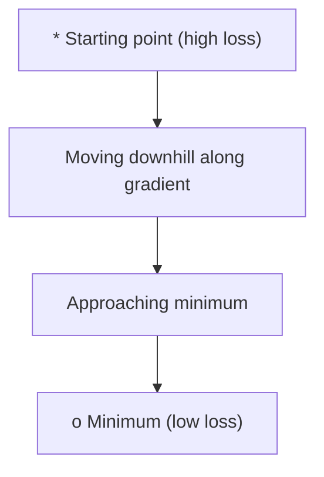
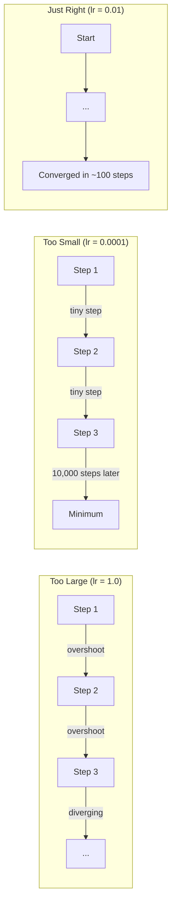
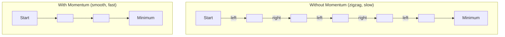
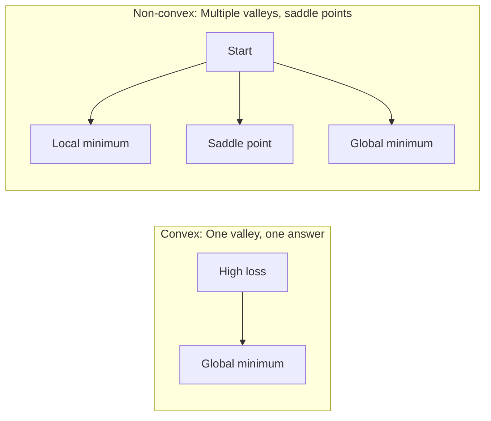
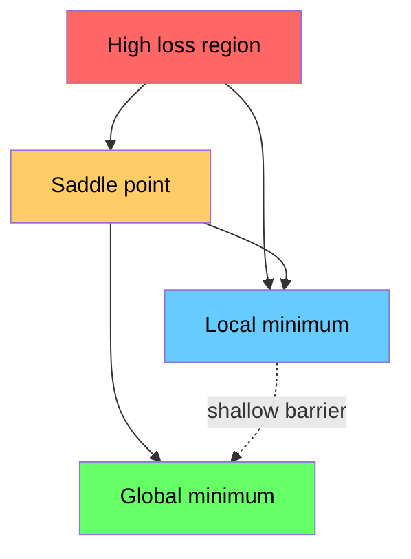

# 优化

> 训练神经网络,不过是发现谷底.

**Type:** Build
**Language:**字符串
**Prerequisites:** Phase 1, Lessons 04-05 (Derivatives, Gradients)
**Time:** ~75 minutes

## 学习目标

- 实现尼拉梯度下降,SGD与动力,亚当从零开始
- 根据罗森布洛克函数进行优化器融合比较,并解释为什么亚当适应按体重学习率
- 区分形和非形的损失景观,并解释座点在高尺寸中的作用
- 配置学习速度时间表 (步骤衰退,阴茎化,升温) 确保训练稳定

## 问题

你有一个损失函数. 它告诉你你的模型是多么错误. 你有梯度. 它告诉你哪个方向使损失变得更糟.

简单的方法是: 移动向梯度相反. 通过一些数字来衡量步骤,称为学习率. 复制. 这就是梯度下降,它有效. 但"工作"有警告. 太高的学习速度,你会完全超越谷口, 你会走上千里不必要的步骤, 虽然你没有找到最低点,但你就停止了.

每个深度学习优化者都能回答同一个问题:如何更快,更可靠地进入谷底?

## 概念

### 优化意味着什么

优化是找到最小化 (或最大化) 函数的输入值.在机器学习中,函数是损失.输入是模型的权重.培训是优化.

```
minimize L(w) where:
  L = loss function
  w = model weights (could be millions of parameters)
```

### 渐进性下降 (瓦尼拉)

简单的优化器.计算损失的梯度与每个重量相比. 移动每个重量在其梯度的相反方向. 根据学习速度测量步骤.

```
w = w - lr * gradient
```

这就是整个算法,一个行.



### 学习速度:最重要的超值

学习速度控制了步骤的尺寸. 它决定了所有关于融合的东西.



没有一个公式来确定正确的学习率. 实验可以找到它. 共同的起点:亚当的0.001 ,SGD的0.01

### 清算量与批量对比小批量

基梯度下降在采取一个步骤之前计算整个数据集的梯度.这被称为批次梯度下降.它是稳定的,但缓慢的.

梯降低 (SGD) 计算一个随机样本的梯度,并立即步骤.

微批次梯度下降将差异分开.计算梯度在一个小批次 (32, 64, 128, 256 个样本),然后步骤.这是每个人都实际使用的.

| Variant | Batch size | Gradient quality | Speed per step | Noise |
|---------|-----------|-----------------|---------------|-------|
| Batch GD | Entire dataset | Exact | Slow | None |
| SGD | 1 sample | Very noisy | Fast | High |
| Mini-batch | 32-256 | Good estimate | Balanced | Moderate |

噪音并不是一个错误,它可以避免低层的局部最小和车点.

### 动力:球滚下坡

尼拉梯度下降只看着当前梯度.如果梯度扎 (在狭窄的山谷中很常见),进展是缓慢的.动力通过积累过去梯度到速度术语来解决这一问题.

```
v = beta * v + gradient
w = w - lr * v
```

类似:一个滚滚下坡.它不会在每一次碰撞中停止或重新启动.它在一致的方向上增强速度,减缓振荡.



`beta`对于一个更高的beta 版本,意味着更多的动力,更平滑的路径,但对方向变化的反应更慢.

### 亚当:适应性学习率

对于不同体重,学习速度不同.一个很少获得高梯度的体重,最终应该采取更大的步骤.一个不断获得巨大的梯度的体重,应该采取更小的步骤.

根据体重的数据,

1. 第一个时刻 (m):渐变的运行平均值 (如动力)
2. 第二时刻 (v):正方梯度的运行平均 (梯度大小)

```
m = beta1 * m + (1 - beta1) * gradient
v = beta2 * v + (1 - beta2) * gradient^2

m_hat = m / (1 - beta1^t)    bias correction
v_hat = v / (1 - beta2^t)    bias correction

w = w - lr * m_hat / (sqrt(v_hat) + epsilon)
```

通过`sqrt(v_hat)`对于小小的度,每一个度都会得到一个适应性学习率.

默认的超参数: `lr=0.001, beta1=0.9, beta2=0.999, epsilon=1e-8`这些默认设置对大多数问题都很有效.

### 学习率时间表

固定学习率是妥协的. 训练初期,你需要大步骤才能快速进步. 训练后期,你需要小步骤才能达到最低水平.

常见时间表:

| Schedule | Formula | Use case |
|----------|---------|----------|
| Step decay | lr = lr * factor every N epochs | Simple, manual control |
| Exponential decay | lr = lr_0 * decay^t | Smooth reduction |
| Cosine annealing | lr = lr_min + 0.5 * (lr_max - lr_min) * (1 + cos(pi * t / T)) | Transformers, modern training |
| Warmup + decay | Linear ramp up, then decay | Large models, prevents early instability |

### 形与非形

曲函数有一个最小值.渐进式下降总是找到它.`f(x) = x^2`形的.

网络损失功能是非形的.它们有许多本地最小值,车点和平面区域.



在实践中,高维度神经网络中的本地最小极度极度极度极度极度极度极度极度极度极度极度极度极度极度极度极度极度极度极度极度极度极度极度极度极度极度极度极度极度极度极度极度极度极度极度极度极度极度极度极度极度极度极度极度极度极度极度极度极度极度极度极度极度极度极度极度极度极度极度极度极度极度极度极度极度极度极度极度极度极度极度极度极度极度极度极度极度极度极度极度极度极度极度极度极度极度极度极度极度极度极度极度极度极度极度极度极度极度极度极度极度极度极度极度极度极度极度极度极度极度极度极度极度极度极度极度极度极度极度极度极度极度极度极度极度极度极度极度极度极度极度极度极度极度极度极度极度极度极度极度极度极度极度极度极度极度极度极度极度极度极度极度极度极度极度极度极度极度极度极度极度极度极度极度极度极度极度极度极度极度极度极度极度极度极度极度极度极度极度极度极度极度极度极度极度极度极度极度极度极度极度极度极度极度极度极度极度极度极度极度极度极度极度极度极度极度极度极度极度极度极度极度极度极度极度极度极度极度极度极度极度极度极度极度极度极度极度极度极度极度极度极度极度极度极度极度极度极度极度极度极度极度极度极度极度极度极度极

### 失景视觉化

损失是所有权重的函数.对于一个100万权重的模型来说,损失景观生活在1000,001维空间中.我们通过在权重空间中选择两个随机方向并沿着这些方向绘制损失,产生2维表面来可视化它.



的最小值一般化不好. 的最小值一般化不好. 这也是一个原因,因为SGD的动力通常在最终测试准确性上超过亚当:它的噪音防止其定位在的最小值.

```figure
gradient-descent
```

## 建立它

### 步骤1:定义测试函数

罗森布洛克函数是经典的优化基准.其最小值在 (1, 1) 处于一个狭窄的曲线谷中,很容易找到,但很难跟踪.

```
f(x, y) = (1 - x)^2 + 100 * (y - x^2)^2
```

```python
def rosenbrock(params):
    x, y = params
    return (1 - x) ** 2 + 100 * (y - x ** 2) ** 2

def rosenbrock_gradient(params):
    x, y = params
    df_dx = -2 * (1 - x) + 200 * (y - x ** 2) * (-2 * x)
    df_dy = 200 * (y - x ** 2)
    return [df_dx, df_dy]
```

### 步骤2:瓦尼拉梯度下降

```python
class GradientDescent:
    def __init__(self, lr=0.001):
        self.lr = lr

    def step(self, params, grads):
        return [p - self.lr * g for p, g in zip(params, grads)]
```

### 步骤3:SGD与动力

```python
class SGDMomentum:
    def __init__(self, lr=0.001, momentum=0.9):
        self.lr = lr
        self.momentum = momentum
        self.velocity = None

    def step(self, params, grads):
        if self.velocity is None:
            self.velocity = [0.0] * len(params)
        self.velocity = [
            self.momentum * v + g
            for v, g in zip(self.velocity, grads)
        ]
        return [p - self.lr * v for p, v in zip(params, self.velocity)]
```

### 第四步:亚当

```python
class Adam:
    def __init__(self, lr=0.001, beta1=0.9, beta2=0.999, epsilon=1e-8):
        self.lr = lr
        self.beta1 = beta1
        self.beta2 = beta2
        self.epsilon = epsilon
        self.m = None
        self.v = None
        self.t = 0

    def step(self, params, grads):
        if self.m is None:
            self.m = [0.0] * len(params)
            self.v = [0.0] * len(params)

        self.t += 1

        self.m = [
            self.beta1 * m + (1 - self.beta1) * g
            for m, g in zip(self.m, grads)
        ]
        self.v = [
            self.beta2 * v + (1 - self.beta2) * g ** 2
            for v, g in zip(self.v, grads)
        ]

        m_hat = [m / (1 - self.beta1 ** self.t) for m in self.m]
        v_hat = [v / (1 - self.beta2 ** self.t) for v in self.v]

        return [
            p - self.lr * mh / (vh ** 0.5 + self.epsilon)
            for p, mh, vh in zip(params, m_hat, v_hat)
        ]
```

### 步骤5:运行并比较

```python
def optimize(optimizer, func, grad_func, start, steps=5000):
    params = list(start)
    history = [params[:]]
    for _ in range(steps):
        grads = grad_func(params)
        params = optimizer.step(params, grads)
        history.append(params[:])
    return history

start = [-1.0, 1.0]

gd_history = optimize(GradientDescent(lr=0.0005), rosenbrock, rosenbrock_gradient, start)
sgd_history = optimize(SGDMomentum(lr=0.0001, momentum=0.9), rosenbrock, rosenbrock_gradient, start)
adam_history = optimize(Adam(lr=0.01), rosenbrock, rosenbrock_gradient, start)

for name, history in [("GD", gd_history), ("SGD+M", sgd_history), ("Adam", adam_history)]:
    final = history[-1]
    loss = rosenbrock(final)
    print(f"{name:6s} -> x={final[0]:.6f}, y={final[1]:.6f}, loss={loss:.8f}")
```

预期输出:亚当走向最快.SGD带动量遵循更平滑的路径.尼拉GD沿狭窄的谷道慢慢进步.

## 用它

在实践中,使用PyTorch或JAX优化器.它们处理参数组,权重衰减,梯度剪辑和GPU加速.

```python
import torch

model = torch.nn.Linear(784, 10)

sgd = torch.optim.SGD(model.parameters(), lr=0.01, momentum=0.9)
adam = torch.optim.Adam(model.parameters(), lr=0.001)
adamw = torch.optim.AdamW(model.parameters(), lr=0.001, weight_decay=0.01)

scheduler = torch.optim.lr_scheduler.CosineAnnealingLR(adam, T_max=100)
```

基本规则:

- 首先是亚当 (lr=0.001). 它可以解决大多数问题,
- 转换到SGD时的动力 (lr=0.01,动力=0.9) 当你需要最好的最终精度,并且可以承担更多的调整.
- 使用AdamW (Adam与脱重量衰减) 为变压器.
- 训练时间长于几个时期,总是使用学习率时间表.
- 如果训练不稳定,请减少学习速度.

## 运送它

这一课提供了选择合适优化器的提示.`outputs/prompt-optimizer-guide.md`现在,我们要去.

在第三阶段,我们将一个神经网络从零开始训练.

## 运动

1. **Learning rate sweep.**运行基梯度下降在Rosenbrock函数上,以学习率 [0.0001, 0.0005, 0.001, 0.005, 0.01].每一步的5000步后绘制或打印最终损失.找到最大的学习率,仍然相近.

2. **Momentum comparison.**运行SGD在Rosenbrock函数上运行动力值 [0.0,0.5,0.9,0.99]. 随着每一步追踪损失.哪个动力值最快收缩?哪个超行?

3. **Saddle point escape.**定义函数`f(x, y) = x^2 - y^2`开始于0.01,0.01. 比较尼拉GD,SGD与动力以及亚当的行为.哪个逃离点?

4. **Implement learning rate decay.**添加一个指数式衰变时间表到 GradientDescent 类:`lr = lr_0 * 0.999^step`根据罗森布洛克函数的与不衰变相似性.

## 关键词

| Term | What people say | What it actually means |
|------|----------------|----------------------|
| Gradient descent | "Go downhill" | Update weights by subtracting the gradient scaled by the learning rate. The most basic optimizer. |
| Learning rate | "Step size" | A scalar that controls how far each update moves the weights. Too large causes divergence. Too small wastes compute. |
| Momentum | "Keep rolling" | Accumulate past gradients into a velocity vector. Dampens oscillations and accelerates movement through consistent directions. |
| SGD | "Random sampling" | Stochastic gradient descent. Compute gradient on a random subset instead of the full dataset. Almost always means mini-batch SGD in practice. |
| Mini-batch | "A chunk of data" | A small subset of training data (32-256 samples) used to estimate the gradient. Balances speed and gradient accuracy. |
| Adam | "The default optimizer" | Adaptive Moment Estimation. Tracks per-weight running averages of gradients and squared gradients to give each weight its own learning rate. |
| Bias correction | "Fix the cold start" | Adam's first and second moments are initialized to zero. Bias correction divides by (1 - beta^t) to compensate during early steps. |
| Learning rate schedule | "Change lr over time" | A function that adjusts the learning rate during training. Large steps early, small steps late. |
| Convex function | "One valley" | A function where any local minimum is the global minimum. Gradient descent always finds it. Neural network losses are not convex. |
| Saddle point | "Flat but not a minimum" | A point where the gradient is zero but it is a minimum in some directions and a maximum in others. Common in high dimensions. |
| Loss landscape | "The terrain" | The loss function plotted over weight space. Visualized by slicing along two random directions. |
| Convergence | "Getting there" | The optimizer has reached a point where further steps do not meaningfully reduce the loss. |

## 进一步阅读

- [Sebastian Ruder: An overview of gradient descent optimization algorithms](https://ruder.io/optimizing-gradient-descent/)- 对所有主要优化者进行全面调查
- [Why Momentum Really Works (Distill)](https://distill.pub/2017/momentum/)- 动力动态的互动可视化
- [Adam: A Method for Stochastic Optimization (Kingma & Ba, 2014)](https://arxiv.org/abs/1412.6980)- 原始的亚当文件,可读且短
- [Visualizing the Loss Landscape of Neural Nets (Li et al., 2018)](https://arxiv.org/abs/1712.09913)- 报纸显示了和平的最低水平
