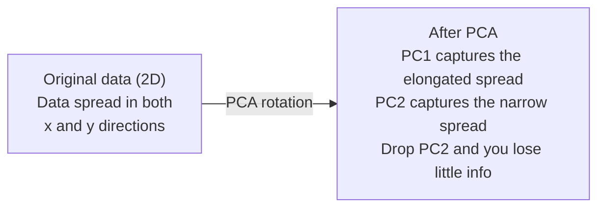

# 缩小尺寸

> 通过从正面角度看,我们可以找到它.

**Type:** Build
**Language:**字符串
**Prerequisites:** Phase 1, Lessons 01 (Linear Algebra Intuition), 02 (Vectors, Matrices & Operations), 03 (Eigenvalues & Eigenvectors), 06 (Probability & Distributions)
**Time:** ~90 minutes

## 学习目标

- 从零开始实施PCA:中心数据,计算共变矩阵,自主组合和项目
- 使用解释的变量比和肘部方法来选择主要组件数量
- 进行PCA,t-SNE和UMAP的比较,以2D可视化MNIST数字,并解释它们的交易
- 应用RBF内核的内核PCA来分离标准PCA无法处理的非线性数据结构

## 问题

你有一个数据集,每样品有784个特征.也许是手写数字的像素值.也许是基因表达水平.也许是用户行为信号.你不能想象784个维度.你不能绘制它们.你甚至不能考虑它们.

但这些784的大部分功能是过剩的.实际信息生活在一个更小的表面上.手写的"7"不需要784个独立的数字来描述它.它需要几个:拍摄的角度,横杆的长度,它倾斜多少.其余的噪音.

缩小尺寸会发现更小的表面,它将784维的数据压缩到2,10或50维度,同时保持重要结构.

## 概念

### 维度的诅咒

空间的高度是不直观的.

**Distance becomes meaningless.**在高维度中,两个随机点之间的距离相近于相同的值.如果每个点与其他点的距离大约相同,

```
Dimension    Avg distance ratio (max/min between random points)
2            ~5.0
10           ~1.8
100          ~1.2
1000         ~1.02
```

**Volume concentrates in corners.**对于一个在d维度的单元超立方体,则有2d角.在100维度,几乎所有的体积都在角落里,远离中心.数据点蔓延到边缘,你的模型在内部饥饿数据.

**You need exponentially more data.**为了保持相同的样本密度,从2D到20D需要10^18倍的数据.你永远没有足够的.减少尺寸使数据密度恢复到可操作的东西.

### 查找重要的方向

基本组件分析 (PCA) 找出了您数据最多变化的轴. 它旋转了坐标系统,所以第一个轴捕获了最多的变化,第二个捕获了最多的变化,等等.

算法:

```
1. Center the data        (subtract the mean from each feature)
2. Compute covariance     (how features move together)
3. Eigendecomposition     (find the principal directions)
4. Sort by eigenvalue     (biggest variance first)
5. Project               (keep top k eigenvectors, drop the rest)
```

为什么是自定义? 变量矩阵是对称和正的半确定的.它的自向量是特征空间中的直角方向.自向值告诉你每个方向捕获多少变量.最大变量方向沿着最大变量方向的自向量.



- **Before PCA:**数据云在x和y轴上横向分布
- **After PCA:**坐标系统旋转,使PC1与最大差距方向 (延长差距) 及PC2与最小差距方向 (狭窄差距) 保持一致.
- **Dimensionality reduction:**放弃PC2将数据投射到PC1,失去很少的信息

### 解释变异率

每个主要组件都占总变量的一小部分.

```
Component    Eigenvalue    Explained ratio    Cumulative
PC1          4.73          0.473              0.473
PC2          2.51          0.251              0.724
PC3          1.12          0.112              0.836
PC4          0.89          0.089              0.925
...
```

当总体解释变异达到0.95时,你知道许多组件捕获了95%的信息.

### 选择组件数量

需要采取三种策略:

1. **Threshold.**保持足够的组件,以解释90-95%的差异.
2. **Elbow method.**图解各组件的变化. 寻找一个急剧的降落.
3. **Downstream performance.**测量模型的精度,最好的精度是任何高原.

### 保护社区

t-分布式静态邻居嵌入式 (t-SNE) 设计用于可视化.它将高维度数据映射到2D (或3D) 同时保留哪些点相邻.

感觉:在原始空间中,根据距离计算对点的概率分布.近点的概率高.远点的概率低.然后找到一个2D排列,相同的概率分布.784维度的点是邻居,仍然是邻居的2D.

子的主要特性:
- 它可以展开复杂的多元化,而PCA不能.
- 不同的运行产生不同的布局.
- 困难参数控制了需要考虑多少邻居 (典型范围:5-50).
- 输出中的集群之间的距离并不重要.
- 默认情况下,在大型数据集上速度很慢.

### 快速,更好的全球结构

统一多重接近和投影 (UMAP) 与t-SNE类似,但具有两个优势:
- 它使用近邻图表,而不是计算所有对距离.
- 产量中的集群相对位置往往比t-SNE更有意义.

UMAP在高维空间中构建一个重量图 ("模糊的拓表现") 然后找到一个低维布局,以尽可能保存这个图.

关键参数:
- `n_neighbors`较高的价值保持更全球性的结构.
- `min_dist`输出中点的密集性.较低的值会产生更密集的集群.

### 什么时候使用

| Method | Use case | Preserves | Speed |
|--------|----------|-----------|-------|
| PCA | Preprocessing before training | Global variance | Fast (exact), works on millions of samples |
| PCA | Quick exploratory visualization | Linear structure | Fast |
| t-SNE | Publication-quality 2D plots | Local neighborhoods | Slow (< 10k samples ideal) |
| UMAP | 2D visualization at scale | Local + some global structure | Medium (handles millions) |
| PCA | Feature reduction for models | Variance-ranked features | Fast |
| t-SNE / UMAP | Understanding cluster structure | Cluster separation | Medium to slow |

基本规则:使用PCA进行预处理和数据压缩.使用t-SNE或UMAP,当需要在2D中可视化结构时.

### 核PCA

标准PCA会找到线性子空间.它会旋转你的坐标系统,然后放下轴.但是如果数据位于非线性多元件上怎么办? 2D中的圆不能被任何线分开.标准PCA不会帮助.

核心PCA将PCA应用到一个高维功能空间中,由一个核心函数引发,而没有明确计算该空间中的坐标.这是核心技巧 - - 基于SVM的想法.

算法:
1. 计算内核矩阵K,K_ij = k(x_i,x_j)
2. 核心矩阵中心在功能空间中
3. 组建中心核矩阵
4. 顶部的自向量 (以1/sqrt(自值值) 进行测量

常见的内核函数:

| Kernel | Formula | Good for |
|--------|---------|----------|
| RBF (Gaussian) | exp(-gamma * \|\|x - y\|\|^2) | Most nonlinear data, smooth manifolds |
| Polynomial | (x . y + c)^d | Polynomial relationships |
| Sigmoid | tanh(alpha * x . y + c) | Neural network-like mappings |

什么时候使用内核PCA与标准PCA:

| Criterion | Standard PCA | Kernel PCA |
|-----------|-------------|------------|
| Data structure | Linear subspace | Nonlinear manifold |
| Speed | O(min(n^2 d, d^2 n)) | O(n^2 d + n^3) |
| Interpretability | Components are linear combinations of features | Components lack direct feature interpretation |
| Scalability | Works on millions of samples | Kernel matrix is n x n, memory-limited |
| Reconstruction | Direct inverse transform | Requires pre-image approximation |

经典例子:二维的集中圆.两个点圈,一个在另一个内.标准的PCA都投射在同一线上 - - 无用于分类.一个RBF内核的核心PCA将内圆和外圆映射到不同的区域,使它们线性分离.

### 复制错误

你压缩了784个维度到50个.

测量重建错误:
1. 项目数据到 k 尺寸: X_reduced = X @ W_k
2. 复制:X_hat =X_reduced @ W_k^T
3. 计算MSE:平均 - X_hat) ^2)

对于PCA,重建错误与解释变异有清晰关系:

```
Reconstruction error = sum of eigenvalues NOT included
Total variance = sum of ALL eigenvalues
Fraction lost = (sum of dropped eigenvalues) / (sum of all eigenvalues)
```

解释的各组件的变异比为:

```
explained_ratio_k = eigenvalue_k / sum(all eigenvalues)
```

图表对组件数量的累积解释变异,给出了"肘部"曲线.
- 曲线平坦化 (回报率下降)
- 累计变异超过你的门 (通常是0.90或0.95)
- 下游任务执行平原

复制错误除了选择k之外,还有用.你可以使用它来检测异常:具有高重建错误的样本是不适合学习子空间的异常值.这是生产系统中基于PCA的异常检测的基础.

```figure
pca-axes
```

## 建立它

### 步骤1:从零开始进行PCA

```python
import numpy as np

class PCA:
    def __init__(self, n_components):
        self.n_components = n_components
        self.components = None
        self.mean = None
        self.eigenvalues = None
        self.explained_variance_ratio_ = None

    def fit(self, X):
        self.mean = np.mean(X, axis=0)
        X_centered = X - self.mean

        cov_matrix = np.cov(X_centered, rowvar=False)

        eigenvalues, eigenvectors = np.linalg.eigh(cov_matrix)

        sorted_idx = np.argsort(eigenvalues)[::-1]
        eigenvalues = eigenvalues[sorted_idx]
        eigenvectors = eigenvectors[:, sorted_idx]

        self.components = eigenvectors[:, :self.n_components].T
        self.eigenvalues = eigenvalues[:self.n_components]
        total_var = np.sum(eigenvalues)
        self.explained_variance_ratio_ = self.eigenvalues / total_var

        return self

    def transform(self, X):
        X_centered = X - self.mean
        return X_centered @ self.components.T

    def fit_transform(self, X):
        self.fit(X)
        return self.transform(X)
```

### 步骤2:对合成数据进行测试

```python
np.random.seed(42)
n_samples = 500

t = np.random.uniform(0, 2 * np.pi, n_samples)
x1 = 3 * np.cos(t) + np.random.normal(0, 0.2, n_samples)
x2 = 3 * np.sin(t) + np.random.normal(0, 0.2, n_samples)
x3 = 0.5 * x1 + 0.3 * x2 + np.random.normal(0, 0.1, n_samples)

X_synthetic = np.column_stack([x1, x2, x3])

pca = PCA(n_components=2)
X_reduced = pca.fit_transform(X_synthetic)

print(f"Original shape: {X_synthetic.shape}")
print(f"Reduced shape:  {X_reduced.shape}")
print(f"Explained variance ratios: {pca.explained_variance_ratio_}")
print(f"Total variance captured: {sum(pca.explained_variance_ratio_):.4f}")
```

### 步骤3:MNIST数字在2D中

```python
from sklearn.datasets import fetch_openml

mnist = fetch_openml("mnist_784", version=1, as_frame=False, parser="auto")
X_mnist = mnist.data[:5000].astype(float)
y_mnist = mnist.target[:5000].astype(int)

pca_mnist = PCA(n_components=50)
X_pca50 = pca_mnist.fit_transform(X_mnist)
print(f"50 components capture {sum(pca_mnist.explained_variance_ratio_):.2%} of variance")

pca_2d = PCA(n_components=2)
X_pca2d = pca_2d.fit_transform(X_mnist)
print(f"2 components capture {sum(pca_2d.explained_variance_ratio_):.2%} of variance")
```

### 步骤 4:与 sklearn 进行比较

```python
from sklearn.decomposition import PCA as SklearnPCA
from sklearn.manifold import TSNE

sklearn_pca = SklearnPCA(n_components=2)
X_sklearn_pca = sklearn_pca.fit_transform(X_mnist)

print(f"\nOur PCA explained variance:     {pca_2d.explained_variance_ratio_}")
print(f"Sklearn PCA explained variance: {sklearn_pca.explained_variance_ratio_}")

diff = np.abs(np.abs(X_pca2d) - np.abs(X_sklearn_pca))
print(f"Max absolute difference: {diff.max():.10f}")

tsne = TSNE(n_components=2, perplexity=30, random_state=42)
X_tsne = tsne.fit_transform(X_mnist)
print(f"\nt-SNE output shape: {X_tsne.shape}")
```

### 步骤5:UMAP比较

```python
try:
    from umap import UMAP

    reducer = UMAP(n_components=2, n_neighbors=15, min_dist=0.1, random_state=42)
    X_umap = reducer.fit_transform(X_mnist)
    print(f"UMAP output shape: {X_umap.shape}")
except ImportError:
    print("Install umap-learn: pip install umap-learn")
```

## 用它

作为分类器前预加工的PCA:

```python
from sklearn.decomposition import PCA as SklearnPCA
from sklearn.linear_model import LogisticRegression
from sklearn.model_selection import train_test_split
from sklearn.metrics import accuracy_score

X_train, X_test, y_train, y_test = train_test_split(
    X_mnist, y_mnist, test_size=0.2, random_state=42
)

results = {}
for k in [10, 30, 50, 100, 200]:
    pca_k = SklearnPCA(n_components=k)
    X_tr = pca_k.fit_transform(X_train)
    X_te = pca_k.transform(X_test)

    clf = LogisticRegression(max_iter=1000, random_state=42)
    clf.fit(X_tr, y_train)
    acc = accuracy_score(y_test, clf.predict(X_te))
    var_captured = sum(pca_k.explained_variance_ratio_)
    results[k] = (acc, var_captured)
    print(f"k={k:>3d}  accuracy={acc:.4f}  variance={var_captured:.4f}")
```

距离784维度远远前的高原.

## 运送它

这一课产生了:
- `outputs/skill-dimensionality-reduction.md`- 对于特定任务选择合适的尺寸降低技术的能力

## 运动

1. 修改PCA类以支持`inverse_transform`复制MNIST数字从 10, 50,和 200 个组件. 打印复制错误 (平均与原始的平方差别)

2. 在同一MNIST子组上运行t-SNE,具有5,30和100的困难值.描述输出变化.为什么困难会影响集群紧密性?

3. 采用50个特征的数据集,只有5个是信息性的 (生成一个具有`sklearn.datasets.make_classification`) 应用PCA并检查解释的变异曲线是否正确地识别数据实际上是五维的.

## 关键词

| Term | What people say | What it actually means |
|------|----------------|----------------------|
| Curse of dimensionality | "Too many features" | Distances, volumes, and data density all behave counterintuitively as dimensions grow. Models need exponentially more data to compensate. |
| PCA | "Reduce dimensions" | Rotate your coordinate system so the axes align with the directions of maximum variance, then drop the low-variance axes. |
| Principal component | "An important direction" | An eigenvector of the covariance matrix. The direction in feature space along which the data varies most. |
| Explained variance ratio | "How much info this component has" | The fraction of total variance captured by one principal component. Sum the top k ratios to see how much k components preserve. |
| Covariance matrix | "How features correlate" | A symmetric matrix where entry (i,j) measures how feature i and feature j move together. Diagonal entries are individual variances. |
| t-SNE | "That cluster plot" | A nonlinear method that maps high-dimensional data to 2D by preserving pairwise neighborhood probabilities. Good for visualization, not for preprocessing. |
| UMAP | "Faster t-SNE" | A nonlinear method based on topological data analysis. Preserves both local and some global structure. Scales better than t-SNE. |
| Perplexity | "A t-SNE knob" | Controls the effective number of neighbors each point considers. Low perplexity focuses on very local structure. High perplexity captures broader patterns. |
| Manifold | "The surface the data lives on" | A lower-dimensional surface embedded in a higher-dimensional space. A sheet of paper crumpled in 3D is a 2D manifold. |

## 进一步阅读

- [A Tutorial on Principal Component Analysis](https://arxiv.org/abs/1404.1100)(斯林斯) - PCA的清晰来源从头开始
- [How to Use t-SNE Effectively](https://distill.pub/2016/misread-tsne/)(Wattenberg等人) - 互动指南 t-SNE陷和参数选择
- [UMAP documentation](https://umap-learn.readthedocs.io/)- UMAP作者的理论和实践指导
