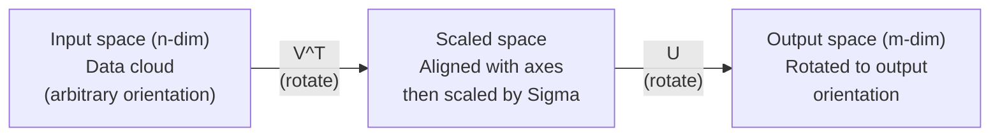
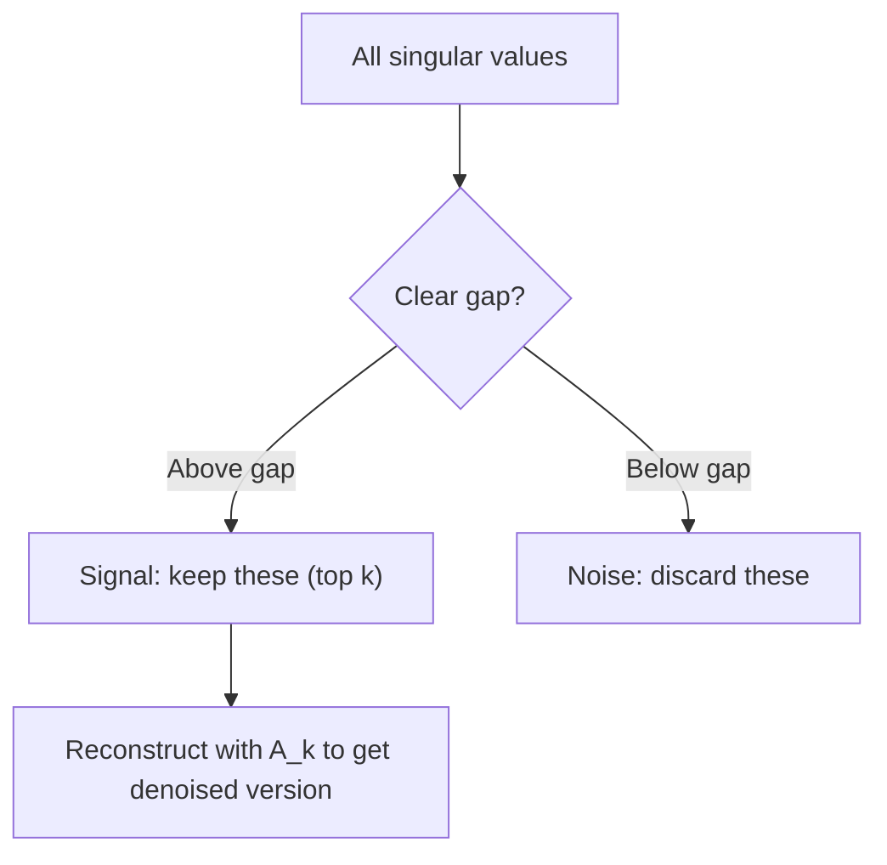

# 单一值分解

> 瑞士军队的线性代数刀,每个矩阵都有一个.每个数据科学家都需要一个.

**Type:** Build
**Languages:** Python, Julia
**Prerequisites:** Phase 1, Lessons 01 (Linear Algebra Intuition), 02 (Vectors & Matrices Operations), 03 (Matrix Transformations)
**Time:** ~120 minutes

## 学习目标

- 通过功率代实现SVD并解释U,Sigma和V^T的几何意义
- 应用缩短的SVD用于图像压缩,并测量压缩比与重建错误
- 通过SVD计算摩尔-罗斯伪逆转,以解决过度确定最小平方的系统
- 连接SVD与PCA,推系统 (隐藏因素) 和 NLP中的隐藏语义分析

## 问题

你有一个1000x2000矩阵.也许是用户电影评级.也许是文档术语频率表.也许是图像的像素值.你需要压缩它,消化它,找到隐藏的结构,或用它解决最小平方的系统. 固体复合只能在矩阵上工作.即使如此,它也需要矩阵拥有完整的线性独立的固体直径.

任何矩阵,任何形状,任何级别,没有条件,它分解矩阵成三个因素,这些因素揭示了矩阵对空间的几何学.这是线性代数中最普遍和最有用的因素化.

## 概念

### 几何学上SVD所做的

每个矩阵,不管形状,都在连续执行三个操作:旋转,规模,旋转.

```
A = U * Sigma * V^T

      m x n     m x m    m x n    n x n
     (any)    (rotate)  (scale)  (rotate)
```

根据任何矩阵A,SVD将其计算为:
- 输入空间中的向量 (n维)
- 沿每个轴的西格马尺度 (延伸或压缩)
- 转换成输出空间 (m维)



现在,我们可以用这个方法来看看.我们给SVD一个矩阵.它告诉你:"这个矩阵取一个输入球,首先用V^T旋转它,然后用Sigma拉伸它到一个圆,然后用U旋转圆.

### 完全的分解

对于形状m x n的矩阵A:

```
A = U * Sigma * V^T

where:
  U     is m x m, orthogonal (U^T U = I)
  Sigma is m x n, diagonal (singular values on the diagonal)
  V     is n x n, orthogonal (V^T V = I)

The singular values sigma_1 >= sigma_2 >= ... >= sigma_r > 0
where r = rank(A)
```

号的列称为左单向量.V的列称为右单向量.Sigma的角角输入称为单向值.它们总是非负的,通常以降低顺序排序.

### 左单向量,单向值,右单向量

任何SVD的组件都有不同的几何意义.

**Right singular vectors (columns of V):**这些构成输入空间 (R^n) 的正规基础.它们是矩阵在输入空间中的方向,它们将输出空间中的正方形方向映射到正方形方向.

**Singular values (diagonal of Sigma):**它们是扩展因子.第1单数值告诉你矩阵在第1右单数向量上延伸多少向量.

**Left singular vectors (columns of U):**这些构成输出空间 (R^m) 的正规基础.第1左单向量是输出空间中的方向,其中第1右单向量落地 (扩展后).

它们之间的关系:

```
A * v_i = sigma_i * u_i

The matrix A takes the i-th right singular vector v_i,
scales it by sigma_i, and maps it to the i-th left singular vector u_i.
```

这给了你一个坐标对坐标的图像,任何矩阵的作用.

### 外型产品形式

标准的SVD可以写成一级矩阵的总和:

```
A = sigma_1 * u_1 * v_1^T + sigma_2 * u_2 * v_2^T + ... + sigma_r * u_r * v_r^T

Each term sigma_i * u_i * v_i^T is a rank-1 matrix (an outer product).
The full matrix is the sum of r such matrices, where r is the rank.
```

这种形式是低级近似的基础.每个术语增加一个结构层.第一术语捕捉到单个最重要的模式.第二个捕捉到下一个最重要的模式.

```
Rank-1 approx:    A_1 = sigma_1 * u_1 * v_1^T
                  (captures the dominant pattern)

Rank-2 approx:    A_2 = sigma_1 * u_1 * v_1^T + sigma_2 * u_2 * v_2^T
                  (captures the two most important patterns)

Rank-k approx:    A_k = sum of top k terms
                  (optimal by the Eckart-Young theorem)
```

### 关于自己的组成的关系

 A 的单一值和向量直接来自 A^T A 和 A^T 的 eigen值和 eigenvectors.

```
A^T A = V * Sigma^T * U^T * U * Sigma * V^T
      = V * Sigma^T * Sigma * V^T
      = V * D * V^T

where D = Sigma^T * Sigma is a diagonal matrix with sigma_i^2 on the diagonal.

So:
- The right singular vectors (V) are eigenvectors of A^T A
- The singular values squared (sigma_i^2) are eigenvalues of A^T A

Similarly:
A A^T = U * Sigma * V^T * V * Sigma^T * U^T
      = U * Sigma * Sigma^T * U^T

So:
- The left singular vectors (U) are eigenvectors of A A^T
- The eigenvalues of A A^T are also sigma_i^2
```

这种联系告诉你三个东西:
1. 单独值总是真实且非负 (它们是正半定义矩阵的自值的平方根).
2. 您可以通过A^T A的自定义组合计算SVD,但这将条件数乘以平方,从而失去数值精度.
3. 当A是正方形和对称正半确时,SVD和自体组合是相同的.

### 缩短的SVD:低级近似

埃卡特-年轻-米尔斯基定理指出,最好的A级 k近似 (在弗罗贝尼斯和光谱规范中) 通过保持只有顶级k单数值及其相应的向量来获得:

```
A_k = U_k * Sigma_k * V_k^T

where:
  U_k     is m x k  (first k columns of U)
  Sigma_k is k x k  (top-left k x k block of Sigma)
  V_k     is n x k  (first k columns of V)

Approximation error = sigma_{k+1}  (in spectral norm)
                    = sqrt(sigma_{k+1}^2 + ... + sigma_r^2)  (in Frobenius norm)
```

这不仅仅是"一个好的"近似. 它可能是最好的可能的接近级 k. 没有其他级 k矩阵接近A.

| Component | Relative magnitude | Kept in rank-3 approx? |
|-----------|-------------------|------------------------|
| sigma_1 | Largest | Yes |
| sigma_2 | Large | Yes |
| sigma_3 | Medium-large | Yes |
| sigma_4 | Medium | No (error) |
| sigma_5 | Medium-small | No (error) |
| sigma_6 | Small | No (error) |
| sigma_7 | Very small | No (error) |
| sigma_8 | Tiny | No (error) |

保持上方3:A_3捕获了最大的三个单一值.错误 =剩余值 (sigma_4到 sigma_8).

如果单数值快速衰退,一个小的 k 捕捉到矩阵的大部分.如果它们慢慢衰退,矩阵没有低级结构.

### 使用SVD压缩图像

灰色图像是一个像素强度矩阵.一个800x600图像有480,000个值.SVD允许你用更少的方法接近它.

```
Original image: 800 x 600 = 480,000 values

SVD with rank k:
  U_k:      800 x k values
  Sigma_k:  k values
  V_k:      600 x k values
  Total:    k * (800 + 600 + 1) = k * 1401 values

  k=10:   14,010 values   (2.9% of original)
  k=50:   70,050 values  (14.6% of original)
  k=100: 140,100 values  (29.2% of original)

  The compression ratio improves as k gets smaller,
  but visual quality degrades.
```

基本的见解:自然图像具有快速衰退的单一值.第一几个单一值捕捉到广泛的结构 (形状,梯度).后来的捕捉细节和噪音.在50级的缩小通常产生一个图像看起来几乎相同的原始,同时使用85%少的存储.

### 推系统的SVD

利斯奖让这成为了名人. 你有一个用户电影评级矩阵,

```
             Movie1  Movie2  Movie3  Movie4  Movie5
  User1      [  5      ?       3       ?       1  ]
  User2      [  ?      4       ?       2       ?  ]
  User3      [  3      ?       5       ?       ?  ]
  User4      [  ?      ?       ?       4       3  ]

  ? = unknown rating
```

观念:这个评级矩阵的排名低.用户没有完全独立的品味.有几种隐藏因素 (行动与戏剧,旧与新,脑与内心) 解释了大多数偏好.

对于 (填充) 评级矩阵的SVD,将其分解为:
- U:隐藏因素空间中的用户配置文件
- 值:每个隐形因素的重要性
- :潜伏因素空间中的电影配置文件

用户预测电影的评级是用户个人资料的点数量和电影的个人资料 (按单数值权重).低级近似填写缺失的条目.

实际上,你使用了Simon Funk的增量SVD或ALS (替代最小方体) 等变体,直接处理缺失的数据.

### 无线性研究中的SVD:隐形语义分析

隐形语义分析 (LSA),也称为隐形语义指数 (LSI),将SVD应用于术语文档矩阵.

```
             Doc1   Doc2   Doc3   Doc4
  "cat"      [  3      0      1      0  ]
  "dog"      [  2      0      0      1  ]
  "fish"     [  0      4      1      0  ]
  "pet"      [  1      1      1      1  ]
  "ocean"    [  0      3      0      0  ]

After SVD with rank k=2:

  Each document becomes a point in 2D "concept space."
  Each term becomes a point in the same 2D space.
  Documents about similar topics cluster together.
  Terms with similar meanings cluster together.

  "cat" and "dog" end up near each other (land pets).
  "fish" and "ocean" end up near each other (water concepts).
  Doc1 and Doc3 cluster if they share similar topics.
```

基于原始文本的语义相似性,LSA是首个成功的方法之一.它是因为同义词往往出现在类似文档中,因此SVD将它们分为相同的隐藏维度.现代词嵌入 (Word2Vec, GloVe) 可以被视为这一想法的后代.

### 降低噪音的SVD

噪音数据的信号集中在最高单数值,噪音分布在所有单数值.

**Clean signal singular values:**

| Component | Magnitude | Type |
|-----------|-----------|------|
| sigma_1 | Very large | Signal |
| sigma_2 | Large | Signal |
| sigma_3 | Medium | Signal |
| sigma_4 | Near zero | Negligible |
| sigma_5 | Near zero | Negligible |

**Noisy signal singular values (noise adds to all):**

| Component | Magnitude | Type |
|-----------|-----------|------|
| sigma_1 | Very large | Signal |
| sigma_2 | Large | Signal |
| sigma_3 | Medium | Signal |
| sigma_4 | Small | Noise |
| sigma_5 | Small | Noise |
| sigma_6 | Small | Noise |
| sigma_7 | Small | Noise |



任何一个因添加噪音而损坏的矩阵,短缩的SVD是分离信号和噪音的原则性方法.

### 通过SVD进行伪逆转

摩尔-罗斯伪逆向A+将矩阵逆向将用于非正方形和单一矩阵.SVD使得计算很简单.

```
If A = U * Sigma * V^T, then:

A+ = V * Sigma+ * U^T

where Sigma+ is formed by:
  1. Transpose Sigma (swap rows and columns)
  2. Replace each non-zero diagonal entry sigma_i with 1/sigma_i
  3. Leave zeros as zeros

For A (m x n):      A+ is (n x m)
For Sigma (m x n):  Sigma+ is (n x m)
```

如果 Ax = b 没有准确的解决方案 (过于确定系统),那么x = A+ b 是最小的正方形解决方案 (最小化了不x - b 时时).

```
Overdetermined system (more equations than unknowns):

  [1  1]         [3]
  [2  1] x   =   [5]       No exact solution exists.
  [3  1]         [6]

  x_ls = A+ b = V * Sigma+ * U^T * b

  This gives the x that minimizes the sum of squared residuals.
  Same result as the normal equations (A^T A)^(-1) A^T b,
  but numerically more stable.
```

### 数字稳定性优势

计算A^T A的自成组合,方乘以单数值 (A^T A的自成值是sigma_i^2).

```
Example:
  A has singular values [1000, 1, 0.001]
  Condition number of A: 1000 / 0.001 = 10^6

  A^T A has eigenvalues [10^6, 1, 10^{-6}]
  Condition number of A^T A: 10^6 / 10^{-6} = 10^{12}

  Computing SVD directly: works with condition number 10^6
  Computing via A^T A:     works with condition number 10^{12}
                           (6 extra digits of precision lost)
```

现代SVD算法 (Golub-Kahan双诊断) 直接在A上工作,从来没有形成A^TA.`np.linalg.svd(A)`现在`np.linalg.eig(A.T @ A)`现在,我们要去.

### 连接到PCA

基于数据的PCA是SVD. 这不是一个比喻. 这实际上是相同的计算.

```
Given data matrix X (n_samples x n_features), centered (mean subtracted):

Covariance matrix: C = (1/(n-1)) * X^T X

PCA finds eigenvectors of C. But:

  X = U * Sigma * V^T    (SVD of X)

  X^T X = V * Sigma^2 * V^T

  C = (1/(n-1)) * V * Sigma^2 * V^T

So the principal components are exactly the right singular vectors V.
The explained variance for each component is sigma_i^2 / (n-1).

In sklearn, PCA is implemented using SVD, not eigendecomposition.
It is faster and more numerically stable.
```

这意味着10课时你学到的关于减小维度的一切都是SVD在帽子下.

```figure
svd-rank-reconstruction
```

## 建立它

### 步骤1:使用功率代使用从零开始的SVD

想法:要找到最大的单数值及其向量,使用A^T A (或A A^T) 的功率反复.然后,将矩阵减值,并重复下一个单数值.

```python
import numpy as np

def power_iteration(M, num_iters=100):
    n = M.shape[1]
    v = np.random.randn(n)
    v = v / np.linalg.norm(v)

    for _ in range(num_iters):
        Mv = M @ v
        v = Mv / np.linalg.norm(Mv)

    eigenvalue = v @ M @ v
    return eigenvalue, v

def svd_from_scratch(A, k=None):
    m, n = A.shape
    if k is None:
        k = min(m, n)

    sigmas = []
    us = []
    vs = []

    A_residual = A.copy().astype(float)

    for _ in range(k):
        AtA = A_residual.T @ A_residual
        eigenvalue, v = power_iteration(AtA, num_iters=200)

        if eigenvalue < 1e-10:
            break

        sigma = np.sqrt(eigenvalue)
        u = A_residual @ v / sigma

        sigmas.append(sigma)
        us.append(u)
        vs.append(v)

        A_residual = A_residual - sigma * np.outer(u, v)

    U = np.column_stack(us) if us else np.empty((m, 0))
    S = np.array(sigmas)
    V = np.column_stack(vs) if vs else np.empty((n, 0))

    return U, S, V
```

### 步骤2:与NumPy进行测试和比较

```python
np.random.seed(42)
A = np.random.randn(5, 4)

U_ours, S_ours, V_ours = svd_from_scratch(A)
U_np, S_np, Vt_np = np.linalg.svd(A, full_matrices=False)

print("Our singular values:", np.round(S_ours, 4))
print("NumPy singular values:", np.round(S_np, 4))

A_reconstructed = U_ours @ np.diag(S_ours) @ V_ours.T
print(f"Reconstruction error: {np.linalg.norm(A - A_reconstructed):.8f}")
```

### 步骤3:图像压缩演示

```python
def compress_image_svd(image_matrix, k):
    U, S, Vt = np.linalg.svd(image_matrix, full_matrices=False)
    compressed = U[:, :k] @ np.diag(S[:k]) @ Vt[:k, :]
    return compressed

image = np.random.seed(42)
rows, cols = 200, 300
image = np.random.randn(rows, cols)

for k in [1, 5, 10, 20, 50]:
    compressed = compress_image_svd(image, k)
    error = np.linalg.norm(image - compressed) / np.linalg.norm(image)
    original_size = rows * cols
    compressed_size = k * (rows + cols + 1)
    ratio = compressed_size / original_size
    print(f"k={k:>3d}  error={error:.4f}  storage={ratio:.1%}")
```

### 步骤4:减少噪音

```python
np.random.seed(42)
clean = np.outer(np.sin(np.linspace(0, 4*np.pi, 100)),
                 np.cos(np.linspace(0, 2*np.pi, 80)))
noise = 0.3 * np.random.randn(100, 80)
noisy = clean + noise

U, S, Vt = np.linalg.svd(noisy, full_matrices=False)
denoised = U[:, :5] @ np.diag(S[:5]) @ Vt[:5, :]

print(f"Noisy error:    {np.linalg.norm(noisy - clean):.4f}")
print(f"Denoised error: {np.linalg.norm(denoised - clean):.4f}")
print(f"Improvement:    {(1 - np.linalg.norm(denoised - clean) / np.linalg.norm(noisy - clean)):.1%}")
```

### 步骤5:伪逆

```python
A = np.array([[1, 1], [2, 1], [3, 1]], dtype=float)
b = np.array([3, 5, 6], dtype=float)

U, S, Vt = np.linalg.svd(A, full_matrices=False)
S_inv = np.diag(1.0 / S)
A_pinv = Vt.T @ S_inv @ U.T

x_svd = A_pinv @ b
x_lstsq = np.linalg.lstsq(A, b, rcond=None)[0]
x_pinv = np.linalg.pinv(A) @ b

print(f"SVD pseudoinverse solution:  {x_svd}")
print(f"np.linalg.lstsq solution:   {x_lstsq}")
print(f"np.linalg.pinv solution:    {x_pinv}")
```

## 用它

现在有完整的演示.`code/svd.py`运行它,以看到SVD用于图像压缩,推系统,隐藏语义分析和噪音降低.

```bash
python svd.py
```

朱莉亚版本在`code/svd.jl`通过朱莉亚的母语来证明相同的概念`svd()`功能和`LinearAlgebra`包装.

```bash
julia svd.jl
```

## 运送它

这一课产生了:
- `outputs/skill-svd.md`- 知道如何在实际项目中应用SVD的技能

## 运动

1. 执行从零开始的全SVD,而不使用功率代. 相反,计算A^T A的自成组合,以获得V和单一值,然后计算U =A V Sigma^{-1}.与你的功率代版本和NumPy进行数值准确度比较.

2. 输入一个真实的灰度图像 (或将其转换为灰度图像).将其压缩在排列1,5,10,25和50等.

3. 建立一个小的推系统.创建一个10×8用户电影评级矩阵,包含一些已知条目.用行方法填写缺失的条目.计算SVD并重建3级近似.使用重建矩阵预测缺失的评级.验证预测是合理的.

4. 创建一个100x50的文档术语矩阵,包含3个合成主题.每个主题都有5个相关的术语.添加噪音.应用SVD并验证前3个单一值比其余值大得多.将文档项目进入3D隐形空间,并检查来自同一主题集群的文档.

5. 生成一个清洁的低级矩阵 (排名3,大小50x40) 并在不同水平上添加高斯噪音 (sigma = 0.1, 0.5, 1.0, 2.0).对于每个噪音水平,通过扫描k从1到40来找到最佳的切割级别,并测量清洁矩阵的重建错误.绘制最佳k如何随噪音水平变化.

## 关键词

| Term | What people say | What it actually means |
|------|----------------|----------------------|
| SVD | "Factor any matrix" | Decompose A into U Sigma V^T where U and V are orthogonal and Sigma is diagonal with non-negative entries. Works for any matrix of any shape. |
| Singular value | "How important this component is" | The i-th diagonal entry of Sigma. Measures how much the matrix stretches along the i-th principal direction. Always non-negative, sorted in decreasing order. |
| Left singular vector | "Output direction" | A column of U. The direction in output space that the i-th right singular vector maps to (after scaling by sigma_i). |
| Right singular vector | "Input direction" | A column of V. The direction in input space that the matrix maps to the i-th left singular vector (after scaling by sigma_i). |
| Truncated SVD | "Low-rank approximation" | Keep only the top k singular values and their vectors. Produces the provably best rank-k approximation to the original matrix (Eckart-Young theorem). |
| Rank | "True dimensionality" | The number of non-zero singular values. Tells you how many independent directions the matrix actually uses. |
| Pseudoinverse | "Generalized inverse" | V Sigma+ U^T. Inverts non-zero singular values, leaves zeros as zeros. Solves least-squares problems for non-square or singular matrices. |
| Condition number | "How sensitive to errors" | sigma_max / sigma_min. A large condition number means small input changes cause large output changes. SVD reveals this directly. |
| Latent factor | "Hidden variable" | A dimension in the low-rank space discovered by SVD. In recommendations, a latent factor might correspond to genre preference. In NLP, it might correspond to a topic. |
| Frobenius norm | "Total matrix size" | Square root of the sum of squared entries. Equals the square root of the sum of squared singular values. Used to measure approximation error. |
| Eckart-Young theorem | "SVD gives the best compression" | For any target rank k, the truncated SVD minimizes the approximation error over all possible rank-k matrices. |
| Power iteration | "Find the biggest eigenvector" | Repeatedly multiply a random vector by the matrix and normalize. Converges to the eigenvector with the largest eigenvalue. The building block of many SVD algorithms. |

## 进一步阅读

- [Gilbert Strang: Linear Algebra and Its Applications, Chapter 7](https://math.mit.edu/~gs/linearalgebra/)- 通过应用进行了SVD的彻底治疗
- [3Blue1Brown: But what is the SVD?](https://www.youtube.com/watch?v=vSczTbgc8Rc)- 对于SVD的几何直觉
- [We Recommend a Singular Value Decomposition](https://www.ams.org/publicoutreach/feature-column/fcarc-svd)- 美国数学学会的可访问概述
- [Netflix Prize and Matrix Factorization](https://sifter.org/~simon/journal/20061211.html)- 关于SVD的Simon Funk的原始博客文章
- [Latent Semantic Analysis](https://en.wikipedia.org/wiki/Latent_semantic_analysis)- 苏维埃的原始NLP应用
- [Numerical Linear Algebra by Trefethen and Bau](https://people.maths.ox.ac.uk/trefethen/text.html)- 了解SVD算法及其数值特性的黄金标准
