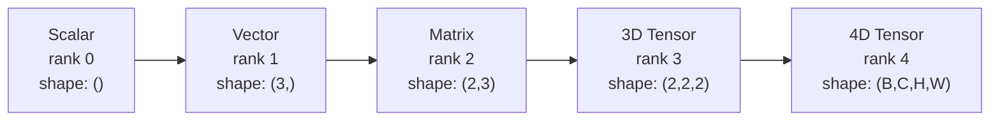
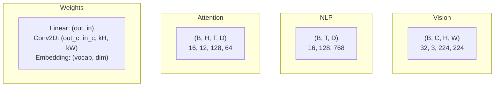
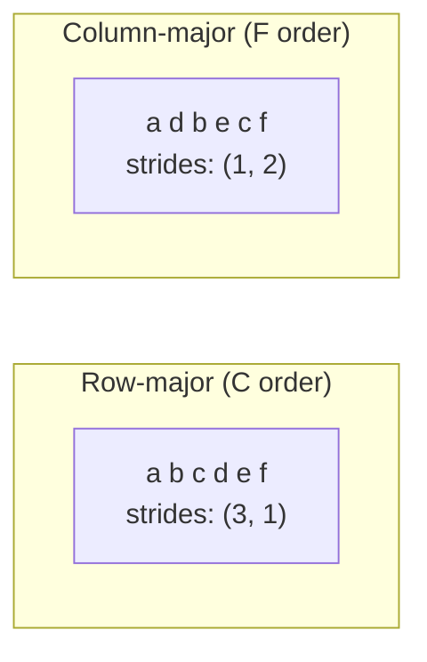
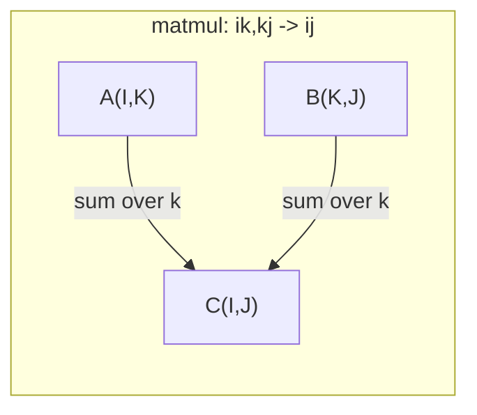

# 度操作

> 电压器是数据和深度学习之间的共同语言. 每个图像,每句话,每一个梯度都流过它们.

**Type:** Build
**Language:**字符串
**Prerequisites:** Phase 1, Lessons 01 (Linear Algebra Intuition), 02 (Vectors, Matrices & Operations)
**Time:** ~90 minutes

## 学习目标

- 实现一个子类,从零开始进行形状,步骤,重塑,转换和元素智能操作
- 应用广播规则,以无需复制数据而使用不同形状的光器
- 写点产品,矩阵乘法,外部产品和批量操作的数量表达式
- 通过多头关注的每个步骤,追踪精确的光形状

## 问题

你建造一个变压器,前进的通行器看起来很清洁,你运行它,得到:`RuntimeError: mat1 and mat2 shapes cannot be multiplied (32x768 and 512x768)`你看着形状,试着转移.`Expected 4D input (got 3D input)`你加一个不挤,另一个东西会破裂.

深度学习代码中最常见的错误是形状错误. 它们在概念上并不难,每个操作都有一个形式合约, 转变器有数十种重塑,转换和播放. 错误的轴和错误的布. 更糟糕的是,一些形状错误根本不会造成错误. 他们通过错误的维度播放或错误的轴线汇总,

矩阵处理两个物体组之间的双向关系. 实际数据不适合两个维度. 32 个RGB图像的批量在 224x224是4D色器:`(32, 3, 224, 224)`拥有12个头的自我注意力也是4D:`(batch, heads, seq_len, head_dim)`需要一个数据结构,将其概括到任何数量的维度,并进行操作,这些操作都在清洁地构成.

## 概念

### 子是什么?

子是一个多维数组,具有统一的数据类型.**rank**(或**order**它们的每一个维度都是**axis**现在,我们要去.**shape**是一个图布列出各轴的尺寸.



总元素 =所有尺寸的产量.`(2, 3, 4)`保持`2 * 3 * 4 = 24`其他元素.

### 深度学习中的度形状

根据传统,不同的数据类型将数据映射到特定的光形状.



光器使用NCHW (频道第一).TensorFlow默认情况下为NHWC (频道最后).不匹配的布局导致沉默的放缓或错误.

### 记忆布局的运作方式

存储中的2D数组是1D字节序列. **Strides**告诉你要跳过多少元素,以沿每个轴迈出一步.



转换不会移动数据,而是交换步骤,从而产生子.**non-contiguous**列中的元素不再是相邻的.

### 广播规则

广播允许你在不同形状的子上操作,而不需要复制数据.从右边对齐形状.两个维度是相容的,当它们等等或一个是1. 较少的维度被左边的1填充.

```
Tensor A:     (8, 1, 6, 1)
Tensor B:        (7, 1, 5)
Padded B:     (1, 7, 1, 5)
Result:       (8, 7, 6, 5)
```

### 爱因素:通用子操作

爱因斯坦的总和标签每一个轴的字母.输入中的轴,但输出的轴不被总和.



关键模式:`i,i->`(点产品),`i,j->ij`(外产品),`ii->`其他地方`ij->ji`转移`bij,bjk->bik`子,子,子,子,子,子,子,子,子,子,子,子,子,子,子,子,子,子,子,子,子.`bhtd,bhsd->bhts`其他地方的子.

```figure
tensor-broadcast
```

## 建立它

代码生活在`code/tensors.py`每一步都指向了执行.

### 步骤1:电压存储和步骤

子存储一个平面的数字列表加上形状的元数据.步骤告诉索引如何将多维指数映射到平面位置.

```python
class Tensor:
    def __init__(self, data, shape=None):
        if isinstance(data, (list, tuple)):
            self._data, self._shape = self._flatten_nested(data)
        elif isinstance(data, np.ndarray):
            self._data = data.flatten().tolist()
            self._shape = tuple(data.shape)
        else:
            self._data = [data]
            self._shape = ()

        if shape is not None:
            total = reduce(lambda a, b: a * b, shape, 1)
            if total != len(self._data):
                raise ValueError(
                    f"Cannot reshape {len(self._data)} elements into shape {shape}"
                )
            self._shape = tuple(shape)

        self._strides = self._compute_strides(self._shape)

    @staticmethod
    def _compute_strides(shape):
        if len(shape) == 0:
            return ()
        strides = [1] * len(shape)
        for i in range(len(shape) - 2, -1, -1):
            strides[i] = strides[i + 1] * shape[i + 1]
        return tuple(strides)
```

为了形状`(3, 4)`进步是`(4, 1)`-- 跳过4个元素,以推进一行,跳过1个元素,以推进一列.

### 步骤2:重新调整,挤压,卸压

换型变形,不变元素顺序. 元素的总数必须保持相同. 使用 `-1`为了推断其尺寸.

```python
t = Tensor(list(range(12)), shape=(2, 6))
r = t.reshape((3, 4))
r = t.reshape((-1, 3))
```

压缩取消一个尺寸的轴.不压缩插入一个.不压缩对于广播至关重要 - - 一个偏向向`(D,)`加入一批`(B, T, D)`需要不压缩`(1, 1, D)`现在,我们要去.

```python
t = Tensor(list(range(6)), shape=(1, 3, 1, 2))
s = t.squeeze()
v = Tensor([1, 2, 3])
u = v.unsqueeze(0)
```

### 转移和转移的步骤3:

转换两个轴,转换所有轴,这样将NCHW和NHWC转换.

```python
mat = Tensor(list(range(6)), shape=(2, 3))
tr = mat.transpose(0, 1)

t4d = Tensor(list(range(24)), shape=(1, 2, 3, 4))
perm = t4d.permute((0, 2, 3, 1))
```

在转移或转移后,电在内存中不连接.`view`没有连接的子失败--使用 `reshape`或打电话`.contiguous()`首先,我需要一个.

### 步骤4:按元素进行操作和减小

元素智能操作 (添加,乘以,减去) 独立适用于每个元素并保留形状.减小 (总和,平均,最大) 崩一个或多个轴.

```python
a = Tensor([[1, 2], [3, 4]])
b = Tensor([[10, 20], [30, 40]])
c = a + b
d = a * 2
s = a.sum(axis=0)
```

全球平均汇集在CNN中:`(B, C, H, W).mean(axis=[2, 3])`产量`(B, C)`序列中等在NLP中汇集:`(B, T, D).mean(axis=1)`产量`(B, D)`现在,我们要去.

### 步骤5:使用NumPy播放

其他`demo_broadcasting_numpy()`功能`tensors.py`它们显示了核心模式.

```python
activations = np.random.randn(4, 3)
bias = np.array([0.1, 0.2, 0.3])
result = activations + bias

images = np.random.randn(2, 3, 4, 4)
scale = np.array([0.5, 1.0, 1.5]).reshape(1, 3, 1, 1)
result = images * scale

a = np.array([1, 2, 3]).reshape(-1, 1)
b = np.array([10, 20, 30, 40]).reshape(1, -1)
outer = a * b
```

通过广播的双距离:重塑`(M, 2)`为了`(M, 1, 2)`其他`(N, 2)`为了`(1, N, 2)`总算在最后一个轴上,取平方根.结果: `(M, N)`现在,我们要去.

### 步骤 6: 爱因素操作

其他`demo_einsum()`其他`demo_einsum_gallery()`函数通过每个常见模式.

```python
a = np.array([1.0, 2.0, 3.0])
b = np.array([4.0, 5.0, 6.0])
dot = np.einsum("i,i->", a, b)

A = np.array([[1, 2], [3, 4], [5, 6]], dtype=float)
B = np.array([[7, 8, 9], [10, 11, 12]], dtype=float)
matmul = np.einsum("ik,kj->ij", A, B)

batch_A = np.random.randn(4, 3, 5)
batch_B = np.random.randn(4, 5, 2)
batch_mm = np.einsum("bij,bjk->bik", batch_A, batch_B)
```

收缩的计算成本是所有指数尺寸的产物 (保持和总和).`bij,bjk->bik`具有B=32,I=128,J=64,K=128:`32 * 128 * 64 * 128 = 33,554,432`乘以加.

### 步骤7:通过 einsum 的注意力机制

其他`demo_attention_einsum()`功能实现多头关注的终端到终端.

```python
B, H, T, D = 2, 4, 8, 16
E = H * D

X = np.random.randn(B, T, E)
W_q = np.random.randn(E, E) * 0.02

Q = np.einsum("bte,ek->btk", X, W_q)
Q = Q.reshape(B, T, H, D).transpose(0, 2, 1, 3)

scores = np.einsum("bhtd,bhsd->bhts", Q, K) / np.sqrt(D)
weights = softmax(scores, axis=-1)
attn_output = np.einsum("bhts,bhsd->bhtd", weights, V)

concat = attn_output.transpose(0, 2, 1, 3).reshape(B, T, E)
output = np.einsum("bte,ek->btk", concat, W_o)
```

每一步都是一个子操作:投影 (通过 einsum 的 matmul),头部分化 (重塑 + 转换),注意力分数 (通过 einsum 的 batch matmul),权重总数 (通过 einsum 的 batch matmul),头部合并 (通过 einsum 的 matmul + 转换),输出投影 (通过 einsum 的 matmul).

## 用它

### 与数码

| Operation | Scratch (Tensor class) | NumPy |
|---|---|---|
| Create | `Tensor([[1,2],[3,4]])` | `np.array([[1,2],[3,4]])` |
| Reshape | `t.reshape((3,4))` | `a.reshape(3,4)` |
| Transpose | `t.transpose(0,1)` | `a.T` or `a.transpose(0,1)` |
| Squeeze | `t.squeeze(0)` | `np.squeeze(a, 0)` |
| Sum | `t.sum(axis=0)` | `a.sum(axis=0)` |
| Einsum | N/A | `np.einsum("ij,jk->ik", a, b)` |

### 与皮托尔奇

```python
import torch

t = torch.tensor([[1, 2, 3], [4, 5, 6]], dtype=torch.float32)
t.shape
t.stride()
t.is_contiguous()

t.reshape(3, 2)
t.unsqueeze(0)
t.transpose(0, 1)
t.transpose(0, 1).contiguous()

torch.einsum("ik,kj->ij", A, B)
```

皮托尔奇添加了自动化,GPU支持和优化的BLAS内核.形状语义是相同的.如果你理解了零碎版本,PyTorch形状错误会变得可读.

### 每个神经网络层作为子操作

| Operation | Tensor Form | Einsum |
|---|---|---|
| Linear layer | `Y = X @ W.T + b` | `"bd,od->bo"` + bias |
| Attention QKV | `Q = X @ W_q` | `"btd,dh->bth"` |
| Attention scores | `Q @ K.T / sqrt(d)` | `"bhtd,bhsd->bhts"` |
| Attention output | `softmax(scores) @ V` | `"bhts,bhsd->bhtd"` |
| Batch norm | `(X - mu) / sigma * gamma` | element-wise + broadcast |
| Softmax | `exp(x) / sum(exp(x))` | element-wise + reduction |

## 运送它

这一课产生了两个可重复使用的提示:

1. **`outputs/prompt-tensor-shapes.md`**-- 系统性提示,用于调试子形状不匹配.包括每个常见操作 (matmul,广播,猫,线性,conv2d,batchNorm,softmax) 的决策表和修复查找表.

2. **`outputs/prompt-tensor-debugger.md`**-- 一个步骤的调试提示,当一个形状错误阻碍你时,你将它粘贴到任何人工智能助理中.

## 运动

1. **Easy -- Reshape round-trip.**取一个形状子`(2, 3, 4)`改装它.`(6, 4)`然后到`(24,)`然后回到`(2, 3, 4)`通过打印平面数据,每一步都保持验证元素的顺序.

2. **Medium -- Implement broadcasting.**扩大`Tensor`类型`broadcast_to(shape)`通过扩大尺寸的方法,将尺寸扩大到尺寸的尺寸,`_elementwise_op`通过模具进行测试.`(3, 1)`其他`(1, 4)`生产`(3, 4)`现在,我们要去.

3. **Hard -- Build einsum from scratch.**实施一个基本的`einsum(subscripts, *tensors)`处理至少:点产量 (`i,i->`),矩阵乘以 (`ij,jk->ik`),外观产品 (`i,j->ij`),并将其转化 (`ij->ji`分析子字符串,确定合约的指数,并循环对所有指数组合进行分析.`np.einsum`现在,我们要去.

4. **Hard -- Attention shape tracker.**写一个函数,需要`batch_size`现在`seq_len`现在`embed_dim`其他`num_heads`检查对输入,Q/K/V投影,头分,注意力分数,软最大重量,权重总和,头合并,输出投影.`demo_attention_einsum()`输出

## 关键词

| Term | What people say | What it actually means |
|---|---|---|
| Tensor | "A matrix but more dimensions" | A multi-dimensional array with uniform type and defined shape, strides, and operations |
| Rank | "The number of dimensions" | The number of axes. A matrix has rank 2, not rank equal to its matrix rank |
| Shape | "The size of the tensor" | A tuple listing the size along each axis. `(2, 3)` means 2 rows, 3 columns |
| Stride | "How memory is laid out" | The number of elements to skip to advance one position along each axis |
| Broadcasting | "It just works when shapes differ" | A strict set of rules: align from right, dimensions must be equal or one must be 1 |
| Contiguous | "The tensor is normal" | Elements stored sequentially in memory with no gaps or reordering from the logical layout |
| Einsum | "A fancy way to write matmul" | A general notation that expresses any tensor contraction, outer product, trace, or transpose in one line |
| View | "Same as reshape" | A tensor sharing the same memory buffer but with different shape/stride metadata. Fails on non-contiguous data |
| Contraction | "Summing over an index" | The general operation where a shared index between tensors is multiplied and summed, producing a lower-rank result |
| NCHW / NHWC | "PyTorch vs TensorFlow format" | Memory layout conventions for image tensors. NCHW puts channels before spatial dims, NHWC puts them after |

## 进一步阅读

- [NumPy Broadcasting](https://numpy.org/doc/stable/user/basics.broadcasting.html)-- 视觉示例的法规
- [PyTorch Tensor Views](https://pytorch.org/docs/stable/tensor_view.html)-- 视图工作时和复制时
- [einops](https://github.com/arogozhnikov/einops)-- 一个使子重塑可读和安全的图书馆
- [The Illustrated Transformer](https://jalammar.github.io/illustrated-transformer/)视觉化光形状流动在注意力
- [Einstein Summation in NumPy](https://numpy.org/doc/stable/reference/generated/numpy.einsum.html)-- 包含示例的完整总数文档
