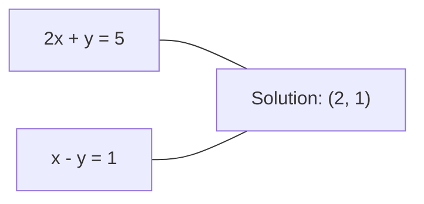
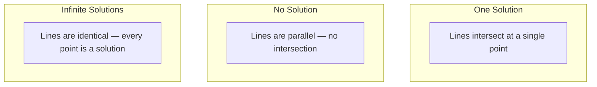

# 线性系统

> 解决 Ax = b 是数学中最古老的问题,

**Type:** Build
**Language:**字符串
**Prerequisites:** Phase 1, Lessons 01 (Linear Algebra Intuition), 02 (Vectors & Matrices), 03 (Matrix Transformations)
**Time:** ~120 minutes

## 学习目标

- 通过部分旋转和后置取代的高斯式消除来解决 Ax = b
- 含 LU,QR和Cholesky分解的因子矩阵,并解释每一个是什么时候合适的
- 求最小方体的正常方程并将它们连接到线性和脊柱回归
- 通过条件号码诊断出不良系统,并进行规律化来稳定它们

## 问题

每次训练线性回归,你解决一个线性系统. 每次计算最小平方的合适,你解决一个线性系统. 每次一个神经网络层计算.`y = Wx + b`通过加规化,我们修改了系统.使用高斯过程,我们将一个矩阵计算.当我们逆转一个共变矩阵为马哈拉诺比距离时,我们解决了一个线性系统.

方程Ax=b在任何地方都出现.A是已知系数的矩阵.b是已知输出的向量.x是你想要找到的未知的向量.在线性回归中,A是你的数据矩阵,b是你的目标向量,x是重量向量.整个模型缩小为:找到x以使Ax尽可能接近b.

这一课将从零开始构建解决这个方程的每种主要方法.你会理解为什么有些方法是快速的,有些方法是稳定的,为什么有些方法只适用于方形系统,而有些则适用于过度的,为什么你的矩阵的条件数决定了你的答案是否意味着任何东西.

## 概念

### 几何表示 Ax = b

一个线性方程系统具有几何解释.每个方程定义了一个超平面.解决方案是所有超平面交叉的点 (或点集).

```
2x + y = 5          Two lines in 2D.
x - y  = 1          They intersect at x=2, y=1.
```



发生三个事情:



在矩阵形式中",一个解决方案"意味着A是可逆的. "没有解决方案"意味着系统是不一致的. "无限解决方案"意味着A有一个零空间.大多数ML问题属于"没有准确解决方案"类别,因为你有更多的方程 (数据点) 比未知 (参数) 更多.这就是最少的方块进入的地方.

### 列图与行图

读取 Ax = b 的方法有两种.

**Row picture.**每一行A定义一个方程. 每一个方程是一个超平面. 解决方案是它们交叉的地方.

**Column picture.**问题是,A列的线性组合产生了b?

```
A = | 2  1 |    b = | 5 |
    | 1 -1 |        | 1 |

Row picture: solve 2x + y = 5 and x - y = 1 simultaneously.

Column picture: find x1, x2 such that:
  x1 * [2, 1] + x2 * [1, -1] = [5, 1]
  2 * [2, 1] + 1 * [1, -1] = [4+1, 2-1] = [5, 1]   check.
```

如果 b 位于 A 的列空间中,则系统有解决方案.如果 b 没有,则您会发现列空间中最接近的点.

### 盖斯的消除

通过加斯的消除,将 Ax = b 转化为上方三角形系统 Ux = c,通过后方替代来解决.这是最直接的方法.

算法:

```
1. For each column k (the pivot column):
   a. Find the largest entry in column k at or below row k (partial pivoting).
   b. Swap that row with row k.
   c. For each row i below k:
      - Compute multiplier m = A[i][k] / A[k][k]
      - Subtract m times row k from row i.
2. Back substitute: solve from the last equation upward.
```

举个例子:

```
Original:
| 2  1  1 | 8 |       R2 = R2 - (2)R1     | 2  1   1 |  8 |
| 4  3  3 |20 |  -->  R3 = R3 - (1)R1 --> | 0  1   1 |  4 |
| 2  3  1 |12 |                            | 0  2   0 |  4 |

                       R3 = R3 - (2)R2     | 2  1   1 |  8 |
                                       --> | 0  1   1 |  4 |
                                           | 0  0  -2 | -4 |

Back substitute:
  -2 * x3 = -4    -->  x3 = 2
  x2 + 2  = 4     -->  x2 = 2
  2*x1 + 2 + 2 = 8 --> x1 = 2
```

对于一个1000x1000系统,这就像一十亿的浮点操作.快速,但如果你需要用相同的A来解决多个系统,你可以做得更好.

### 部分转向:为什么这很重要

如果没有旋转,高斯的消除可以失败或产生垃圾.如果旋转元素是零,你将以零分割.如果它很小,你会放大圆错误.

```
Bad pivot:                       With partial pivoting:
| 0.001  1 | 1.001 |            Swap rows first:
| 1      1 | 2     |            | 1      1 | 2     |
                                 | 0.001  1 | 1.001 |
m = 1/0.001 = 1000              m = 0.001/1 = 0.001
R2 = R2 - 1000*R1               R2 = R2 - 0.001*R1
| 0.001  1     | 1.001   |      | 1      1     | 2     |
| 0     -999   | -999.0  |      | 0      0.999 | 0.999 |

x2 = 1.000 (correct)            x2 = 1.000 (correct)
x1 = (1.001 - 1)/0.001          x1 = (2 - 1)/1 = 1.000 (correct)
   = 0.001/0.001 = 1.000        Stable because the multiplier is small.
```

在有限精度的浮点算术中,未旋转版本可能会失去显著的数字.部分旋转总是选择最大可用旋转以最大限度地减少错误放大.

### 化

 LU分解因子 A 变成一个较低的三角形矩阵 L 和一个较高的三角形矩阵 U:A = LU. L矩阵存储了来自高斯的消除的乘法. U矩阵是消除的结果.

```
A = L @ U

| 2  1  1 |   | 1  0  0 |   | 2  1   1 |
| 4  3  3 | = | 2  1  0 | @ | 0  1   1 |
| 2  3  1 |   | 1  2  1 |   | 0  0  -2 |
```

为什么除了除了?因为一旦你有L和U,解决 Ax=b的任何新的b只需要O (n^2):

```
Ax = b
LUx = b
Let y = Ux:
  Ly = b    (forward substitution, O(n^2))
  Ux = y    (back substitution, O(n^2))
```

如果您需要用相同的A,但不同的b向量解决1000个系统,LU节省总工作的1000/3的因子.

通过部分旋转,你得到PA=LU,其中P是记录行交换的变量矩阵.

### 清理器分解

 QR分解因子 A 成直角矩阵 Q 和上方三角矩阵 R: A = QR.

直角矩阵具有Q^T Q = I的属性.其列是直线向量.乘以Q保存长度和角.

```
A = Q @ R

Q has orthonormal columns: Q^T Q = I
R is upper triangular

To solve Ax = b:
  QRx = b
  Rx = Q^T b    (just multiply by Q^T, no inversion needed)
  Back substitute to get x.
```

对于解决最小平方数问题,QR数量比LU更稳定.Gram-Schmidt过程构建了Q列后列:

```
Given columns a1, a2, ... of A:

q1 = a1 / ||a1||

q2 = a2 - (a2 . q1) * q1        (subtract projection onto q1)
q2 = q2 / ||q2||                (normalize)

q3 = a3 - (a3 . q1) * q1 - (a3 . q2) * q2
q3 = q3 / ||q3||

R[i][j] = qi . aj    for i <= j
```

每一步都将沿着所有以前的q向量移除组件,只留下新的直角方向.

### 乔莱斯基的分解

当A是对称 (A = A^T) 和正确的定义 (所有自值都是正),你可以将其作为A = L L^T,L是较低的三角形.这是乔莱斯基分解.

```
A = L @ L^T

| 4  2 |   | 2  0 |   | 2  1 |
| 2  5 | = | 1  2 | @ | 0  2 |

L[i][i] = sqrt(A[i][i] - sum(L[i][k]^2 for k < i))
L[i][j] = (A[i][j] - sum(L[i][k]*L[j][k] for k < j)) / L[j][j]    for i > j
```

乔莱斯基的速度是LU的两倍,需要半个存储空间.它只适用于对称正确的确定矩阵,但这些矩阵显示不停:

- 合变矩阵是对称正面半确式 (正确式与规范化).
- 在高斯过程中的内核矩阵是对称正确的.
- 曲函数的Hessian最小值是对称正确的.
- 总是对称正半确的.

在高斯过程中,你将内核矩阵K与Cholesky进行因数化,然后解决K alpha = y以获得预测平均值.Cholesky因子还给你提供了边际概率的日志决定因素: log det(K) = 2 * sum(log(diag(L))).

### 最小的正方形:当Ax = b没有确切的解决方案时

如果A是m x n,m > n (比未知更多的方程),则系统是过分确定的.没有确切的解决方案.相反,你将最小化二次错误:

```
minimize ||Ax - b||^2

This is the sum of squared residuals:
  sum((A[i,:] @ x - b[i])^2 for i in range(m))
```

最小化器满足了正常方程:

```
A^T A x = A^T b
```

导数:扩展Ax - b 否则是2 = (Ax - b) ^T (Ax - b) = x^T A^T A x - 2 x^T A^T b + b^T b. 取对 x 的梯度,设为零: 2 A^T A x - 2 A^T b = 0.

```
Original system (overdetermined, 4 equations, 2 unknowns):
| 1  1 |         | 3 |
| 1  2 | x     = | 5 |       No exact x satisfies all 4 equations.
| 1  3 |         | 6 |
| 1  4 |         | 8 |

Normal equations:
A^T A = | 4  10 |    A^T b = | 22 |
        | 10 30 |            | 63 |

Solve: x = [1.5, 1.7]

This is linear regression. x[0] is the intercept, x[1] is the slope.
```

### 常态方程 =线性回归

连接是准确的.在线性回归中,你的数据矩阵X每样本有一个行,每个特征有一个列.你的目标向量y每样本有一个输入.重量向量w满足:

```
X^T X w = X^T y
w = (X^T X)^(-1) X^T y
```

现在我们可以将其运用到一个新的方法.`sklearn.linear_model.LinearRegression.fit()`计算这个 (或通过QR或SVD进行等价).

添加一个规范化术语 lambda * I 在矩阵,你得到的脊柱回归:

```
(X^T X + lambda * I) w = X^T y
w = (X^T X + lambda * I)^(-1) X^T y
```

规律化使矩阵更好地定制 (更容易精确地逆转) 并通过缩小重量到零来防止过度匹配.矩阵X^T X + lambda * I 总是对称正确的确定,当 lambda > 0,所以你可以使用Cholesky来解决它.

### 伪逆 (摩尔-罗斯)

伪逆向 A+ 将矩阵逆向将用于非正方形和单一矩阵.

```
x = A+ b

where A+ = V Sigma+ U^T    (computed via SVD)
```

号+是通过取取每一个非零单数值的对应并转换结果形成的.如果A = U号 V^T,则A+ = V号+ U^T.

```
A = U Sigma V^T        (SVD)

Sigma = | 5  0 |       Sigma+ = | 1/5  0  0 |
        | 0  2 |                | 0  1/2  0 |
        | 0  0 |

A+ = V Sigma+ U^T
```

假相反式给出最小标准最小平方的解决方案. 如果系统有:
- 答案是:A+b给出了.
- 没有解决方案:A+b给出最小方体的解决方案.
- 无限解决方案:A+b给出最小的部分的部分.

皮的`np.linalg.lstsq`其他`np.linalg.pinv`两者都在内部使用SVD.

### 条件号码

条件数量测量解决方案对输入中微小变化的敏感性.对于矩阵A,条件数是:

```
kappa(A) = ||A|| * ||A^(-1)|| = sigma_max / sigma_min
```

在此,sigma_max和sigma_min是最大和最小的单一值.

```
Well-conditioned (kappa ~ 1):        Ill-conditioned (kappa ~ 10^15):
Small change in b -->                Small change in b -->
small change in x                    huge change in x

| 2  0 |   kappa = 2/1 = 2          | 1   1          |   kappa ~ 10^15
| 0  1 |   safe to solve            | 1   1+10^(-15) |   solution is garbage
```

基本规则:
- 卡帕 < 100:安全,溶液是准确的.
- 由于您的浮点算法,您失去约 k 个数字的精度.
- 对于 float64来说,这个解决方案是无意义的.

在ML中,条件不良发生在特征几乎是对线性的时.规律化 (添加 lambda * I) 从 sigma_max / sigma_min 提高条件数 (sigma_max + lambda) / (sigma_min + lambda).

### 复制方法:结合梯度

对于非常大的稀疏系统 (数百万未知的),像LU或Cholesky这样的直接方法太昂贵.反复方法通过改善许多反复的猜测来接近解决方案.

结合梯度 (CG) 在A是对称正确的定义时解决 Ax = b.它在最多的 n 代数中找到准确的解决方案 (在准确的算法中),但如果A的本值集成,通常会更快地收缩.

```
Algorithm sketch:
  x0 = initial guess (often zero)
  r0 = b - A x0           (residual)
  p0 = r0                 (search direction)

  For k = 0, 1, 2, ...:
    alpha = (rk . rk) / (pk . A pk)
    x_{k+1} = xk + alpha * pk
    r_{k+1} = rk - alpha * A pk
    beta = (r_{k+1} . r_{k+1}) / (rk . rk)
    p_{k+1} = r_{k+1} + beta * pk
    if ||r_{k+1}|| < tolerance: stop
```

CG用于:
- 大规模优化 (牛顿CG方法)
- 解决PDE分辨率
- 核矩阵太大,不能被因素分解的核方法
- 其他反复解决器的预条件

趋同率取决于条件数. 较好的条件系统趋同更快,这是规律化有助于的另一个原因.

### 完整的图片:哪种方法

| Method | Requirements | Cost | Use case |
|--------|-------------|------|----------|
| Gaussian elimination | Square, nonsingular A | O(n^3) | One-off solve of a square system |
| LU decomposition | Square, nonsingular A | O(n^3) factor + O(n^2) solve | Multiple solves with the same A |
| QR decomposition | Any A (m >= n) | O(mn^2) | Least squares, numerically stable |
| Cholesky | Symmetric positive definite A | O(n^3/3) | Covariance matrices, Gaussian processes, ridge regression |
| Normal equations | Overdetermined (m > n) | O(mn^2 + n^3) | Linear regression (small n) |
| SVD / pseudoinverse | Any A | O(mn^2) | Rank-deficient systems, minimum-norm solutions |
| Conjugate gradient | Symmetric positive definite, sparse A | O(n * k * nnz) | Large sparse systems, k = iterations |

### 与 ML 连接

在生产ML中,本课程中的每一种方法都出现在:

**Linear regression.**封闭式解决方案解决了正常方程 X^T X w = X^T y. 这通过Cholesky (如果n小) 或 QR (如果数值稳定性重要) 或SVD (如果矩阵可能是排列不足) 来完成.

**Ridge regression.**增加了 lambda * I 给 X^T X. 规律化系统 (X^T X + lambda * I) w = X^T y 总是可通过Cholesky来解决,因为 X^T X + lambda * I 是对 lambda > 0 的对称正确定义.

**Gaussian processes.**预测平均值需要解决K alpha = y,K是内核矩阵.K的乔莱斯基因数化是标准方法.

**Neural network initialization.**纵向初始化使用QR分解来创建一个重量矩阵,其列是正规的.这可以防止深度网络中信号崩.

**Preconditioning.**大规模优化器使用不完整的乔莱斯基或不完整的LU作为结合梯度溶剂的预先条件.

**Feature engineering.**如果卡帕是大,则放下功能或添加规则化.

```figure
linear-system-conditioning
```

## 建立它

### 步骤1:通过部分旋转的高斯式消除

```python
import numpy as np

def gaussian_elimination(A, b):
    n = len(b)
    Ab = np.hstack([A.astype(float), b.reshape(-1, 1).astype(float)])

    for k in range(n):
        max_row = k + np.argmax(np.abs(Ab[k:, k]))
        Ab[[k, max_row]] = Ab[[max_row, k]]

        if abs(Ab[k, k]) < 1e-12:
            raise ValueError(f"Matrix is singular or nearly singular at pivot {k}")

        for i in range(k + 1, n):
            m = Ab[i, k] / Ab[k, k]
            Ab[i, k:] -= m * Ab[k, k:]

    x = np.zeros(n)
    for i in range(n - 1, -1, -1):
        x[i] = (Ab[i, -1] - Ab[i, i+1:n] @ x[i+1:n]) / Ab[i, i]

    return x
```

### 步骤2: LU分解

```python
def lu_decompose(A):
    n = A.shape[0]
    L = np.eye(n)
    U = A.astype(float).copy()
    P = np.eye(n)

    for k in range(n):
        max_row = k + np.argmax(np.abs(U[k:, k]))
        if max_row != k:
            U[[k, max_row]] = U[[max_row, k]]
            P[[k, max_row]] = P[[max_row, k]]
            if k > 0:
                L[[k, max_row], :k] = L[[max_row, k], :k]

        for i in range(k + 1, n):
            L[i, k] = U[i, k] / U[k, k]
            U[i, k:] -= L[i, k] * U[k, k:]

    return P, L, U

def lu_solve(P, L, U, b):
    n = len(b)
    Pb = P @ b.astype(float)

    y = np.zeros(n)
    for i in range(n):
        y[i] = Pb[i] - L[i, :i] @ y[:i]

    x = np.zeros(n)
    for i in range(n - 1, -1, -1):
        x[i] = (y[i] - U[i, i+1:] @ x[i+1:]) / U[i, i]

    return x
```

### 步骤3: 乔莱斯基的分解

```python
def cholesky(A):
    n = A.shape[0]
    L = np.zeros_like(A, dtype=float)

    for i in range(n):
        for j in range(i + 1):
            s = A[i, j] - L[i, :j] @ L[j, :j]
            if i == j:
                if s <= 0:
                    raise ValueError("Matrix is not positive definite")
                L[i, j] = np.sqrt(s)
            else:
                L[i, j] = s / L[j, j]

    return L
```

### 步骤4:通过正常方程的最小方体

```python
def least_squares_normal(A, b):
    AtA = A.T @ A
    Atb = A.T @ b
    return gaussian_elimination(AtA, Atb)

def ridge_regression(A, b, lam):
    n = A.shape[1]
    AtA = A.T @ A + lam * np.eye(n)
    Atb = A.T @ b
    L = cholesky(AtA)
    y = np.zeros(n)
    for i in range(n):
        y[i] = (Atb[i] - L[i, :i] @ y[:i]) / L[i, i]
    x = np.zeros(n)
    for i in range(n - 1, -1, -1):
        x[i] = (y[i] - L.T[i, i+1:] @ x[i+1:]) / L.T[i, i]
    return x
```

### 步骤5:条件号码

```python
def condition_number(A):
    U, S, Vt = np.linalg.svd(A)
    return S[0] / S[-1]
```

## 用它

组合这些部分以实现线性回归和脊柱回归,

```python
np.random.seed(42)
X_raw = np.random.randn(100, 3)
w_true = np.array([2.0, -1.0, 0.5])
y = X_raw @ w_true + np.random.randn(100) * 0.1

X = np.column_stack([np.ones(100), X_raw])

w_ols = least_squares_normal(X, y)
print(f"OLS weights (ours):    {w_ols}")

w_np = np.linalg.lstsq(X, y, rcond=None)[0]
print(f"OLS weights (numpy):   {w_np}")
print(f"Max difference: {np.max(np.abs(w_ols - w_np)):.2e}")

w_ridge = ridge_regression(X, y, lam=1.0)
print(f"Ridge weights (ours):  {w_ridge}")

from sklearn.linear_model import Ridge
ridge_sk = Ridge(alpha=1.0, fit_intercept=False)
ridge_sk.fit(X, y)
print(f"Ridge weights (sklearn): {ridge_sk.coef_}")
```

## 运送它

这一课产生了:
- `code/linear_systems.py`包含从零开始的高斯消除,LU分解,Cholesky分解,最小方形和脊回归的实现
- 工作证明正常方程和Skularn的线性回归产生相同的重量

## 运动

1. 解决系统`[[1,2,3],[4,5,6],[7,8,10]] x = [6, 15, 27]`通过使用你的高斯解体,你的LU溶剂,`np.linalg.solve`检查三者均在浮点宽容范围内给予相同的答案.

2. 通过正常方程,解决w (通过QR)`np.linalg.qr`),SVD (通过`np.linalg.svd`),以及`np.linalg.lstsq`测量X^TX的条件数,并解释它如何影响你信任的方法.

3. 通过使两个列几乎相同的矩阵 (例如,列2=列1+1e-10*噪音) 创建一个几乎单一的矩阵.计算其条件号码.解决 Ax = b 随着和没有规律化 (添加0.01 * I).比较解决方案和残余物.解释为什么规律化有帮助.

4. 运用对100×100随机对称正确定义矩阵的结合梯度算法.计算到容量1e-8的结合需要多少次代.

5. 时间你的Cholesky解决器与你的LU解决器`np.linalg.solve`通过对称正确的定数矩阵进行测试,大小为 10, 50, 200, 500. 绘制结果.

## 关键词

| Term | What people say | What it actually means |
|------|----------------|----------------------|
| Linear system | "Solve for x" | A set of linear equations Ax = b. Finding x means finding the input that produces output b under transformation A. |
| Gaussian elimination | "Row reduce" | Systematically zero out entries below the diagonal using row operations, producing an upper triangular system solvable by back substitution. O(n^3). |
| Partial pivoting | "Swap rows for stability" | Before eliminating in column k, swap the row with the largest absolute value in that column to the pivot position. Prevents division by small numbers. |
| LU decomposition | "Factor into triangles" | Write A = LU where L is lower triangular (stores multipliers) and U is upper triangular (the eliminated matrix). Amortizes the O(n^3) cost over multiple solves. |
| QR decomposition | "Orthogonal factorization" | Write A = QR where Q has orthonormal columns and R is upper triangular. More stable than LU for least squares. |
| Cholesky decomposition | "Square root of a matrix" | For symmetric positive definite A, write A = LL^T. Half the cost of LU. Used for covariance matrices, kernel matrices, and ridge regression. |
| Least squares | "Best fit when exact is impossible" | Minimize the sum of squared residuals ||Ax - b||^2 when the system is overdetermined (more equations than unknowns). |
| Normal equations | "The calculus shortcut" | A^T A x = A^T b. Setting the gradient of ||Ax - b||^2 to zero. This IS the closed-form solution to linear regression. |
| Pseudoinverse | "Inversion for non-square matrices" | A+ = V Sigma+ U^T via SVD. Gives the minimum-norm least-squares solution for any matrix, square or rectangular, singular or not. |
| Condition number | "How trustworthy is this answer" | kappa = sigma_max / sigma_min. Measures sensitivity to input perturbations. Lose about log10(kappa) digits of precision. |
| Ridge regression | "Regularized least squares" | Solve (X^T X + lambda I) w = X^T y. Adding lambda I improves conditioning and shrinks weights toward zero. Prevents overfitting. |
| Conjugate gradient | "Iterative Ax=b for big matrices" | An iterative solver for symmetric positive definite systems. Converges in at most n steps. Practical for large sparse systems where factorization is too expensive. |
| Overdetermined system | "More data than parameters" | m > n in an m-by-n system. No exact solution exists. Least squares finds the best approximation. This is every regression problem. |
| Back substitution | "Solve from the bottom up" | Given an upper triangular system, solve the last equation first, then substitute backward. O(n^2). |
| Forward substitution | "Solve from the top down" | Given a lower triangular system, solve the first equation first, then substitute forward. O(n^2). Used in the L step of LU solves. |

## 进一步阅读

- [MIT 18.06: Linear Algebra](https://ocw.mit.edu/courses/18-06-linear-algebra-spring-2010/)关于线性系统和矩阵因数化的最终课程
- [Numerical Linear Algebra](https://people.maths.ox.ac.uk/trefethen/text.html)对于理解数值稳定性,条件化以及算法为什么失败的标准参考
- [Matrix Computations](https://www.cs.cornell.edu/cv/GolubVanLoan4/golubandvanloan.htm)对于每个矩阵算法的百科全书参考
- [3Blue1Brown: Inverse Matrices](https://www.3blue1brown.com/lessons/inverse-matrices)解决 Ax = b 什么意思的视觉直觉
