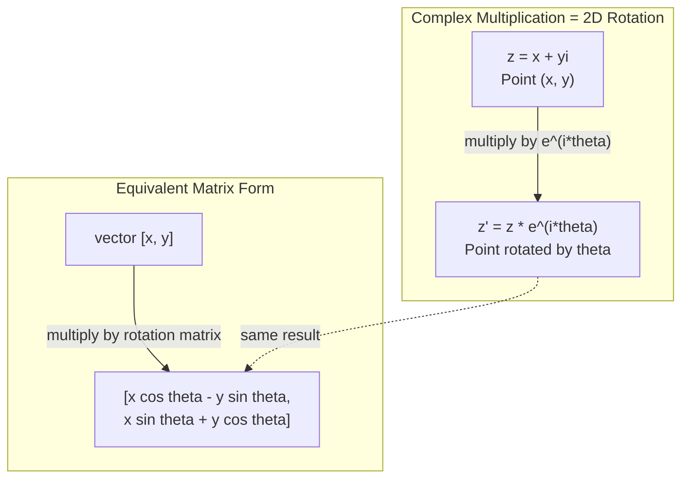
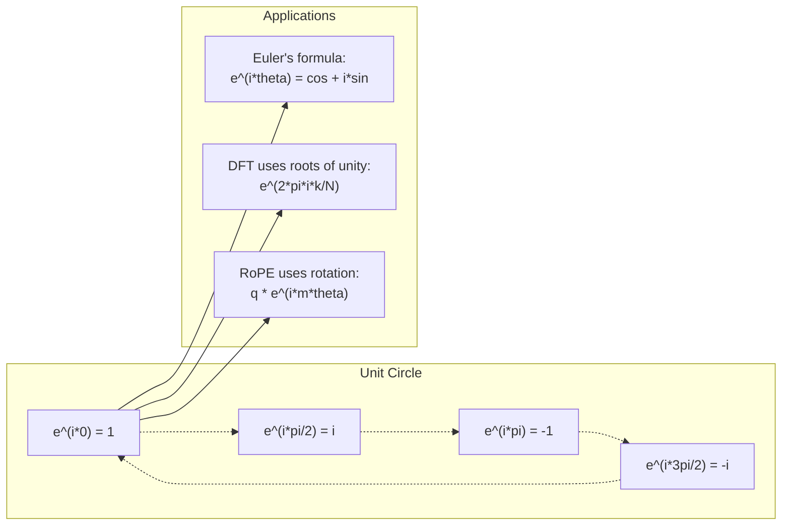

# 复杂的AI数字

> 平方根不是虚构的,它是旋转,频率和信号处理的重点.

**Type:** Learn
**Language:**字符串
**Prerequisites:** Phase 1, Lessons 01-04 (linear algebra, calculus)
**Time:** ~60 minutes

## 学习目标

- 进行复杂算术 (加,乘,分,结合) 在矩形和极形两种形式
- 应用尤勒公式来转换复杂指数和三角函数
- 通过复杂的团结根实现分离福利尔变形
- 解释转换器中的复杂旋转是如何构成ROPE和鼻状位置编码的基础

## 问题

你打开一篇关于福利尔转换的论文,`i`它们是的,它们是的.`sin`其他`cos`它们在不同的频率上,它们是复杂指数的真实和虚构部分.

复杂数字似乎是抽象的.一个基于 -1 的平方根构建的数量系统感觉像是一个数学技巧.但它不是一个技巧.它是旋转和振荡的自然语言.每当某种东西旋转,振动或振荡时,复杂数字都是正确的工具.

没有理解复杂数字,你无法理解分离福利尔转换.你无法理解FFT.你无法理解现代语言模型中ROPE (旋转位置嵌入) 如何工作.你无法理解原始转换器纸中的鼻状位置编码为什么使用它们的频率.

这一课从零开始构建复杂的算法,将其连接到几何,

## 概念

### 复杂数是什么?

复杂数有两个部分:一个真实部分和一个虚构部分.

```
z = a + bi

where:
  a is the real part
  b is the imaginary part
  i is the imaginary unit, defined by i^2 = -1
```

实际数字坐在一个轴上,虚构数字坐在另一轴上.每个复杂数字都是这个平面中的一个点.

### 复杂的算法

**Addition.**加入真实部分,加入虚构部分.

```
(a + bi) + (c + di) = (a + c) + (b + d)i

Example: (3 + 2i) + (1 + 4i) = 4 + 6i
```

**Multiplication.**运用分布法,记住i^2 = -1.

```
(a + bi)(c + di) = ac + adi + bci + bdi^2
                 = ac + adi + bci - bd
                 = (ac - bd) + (ad + bc)i

Example: (3 + 2i)(1 + 4i) = 3 + 12i + 2i + 8i^2
                            = 3 + 14i - 8
                            = -5 + 14i
```

**Conjugate.**转换了想象部分的标志.

```
conjugate of (a + bi) = a - bi
```

复杂数和其结合数的结果总是真实的:

```
(a + bi)(a - bi) = a^2 + b^2
```

**Division.**乘以指标的结合值的数量和命名符.

```
(a + bi) / (c + di) = (a + bi)(c - di) / (c^2 + d^2)
```

这将消除了虚构的部分,给出一个清洁的复杂数字.

### 复杂的平面

复杂平面将每个复杂数字映射到2维点.水平轴是真实的轴,垂直轴是想象的轴.

```
z = 3 + 2i  corresponds to the point (3, 2)
z = -1 + 0i corresponds to the point (-1, 0) on the real axis
z = 0 + 4i  corresponds to the point (0, 4) on the imaginary axis
```

复杂数同时是源头的点和向量. 这种双重解释使复杂数为几何有用.

### 极形

任何平面的点都可以通过距离原点和距离正实际轴的角度来描述.

```
z = r * (cos(theta) + i*sin(theta))

where:
  r = |z| = sqrt(a^2 + b^2)     (magnitude, or modulus)
  theta = atan2(b, a)             (phase, or argument)
```

矩形 (a + bi) 适合加算. 极形 (r, theta) 适合乘法.

**Multiplication in polar form.**乘以大小,加上角.

```
z1 = r1 * e^(i*theta1)
z2 = r2 * e^(i*theta2)

z1 * z2 = (r1 * r2) * e^(i*(theta1 + theta2))
```

复杂数为旋转而完美,因此乘以一个复杂数的大小是纯旋转.

### 勒的公式

复杂指数和三角形数学的桥梁:

```
e^(i*theta) = cos(theta) + i*sin(theta)
```

现在我们要做什么?

```
e^(i*pi) = cos(pi) + i*sin(pi) = -1 + 0i = -1

Therefore: e^(i*pi) + 1 = 0
```

五个基本常数 (e,i,pi,1,0) 连接在一个方程中.

### 为什么艾勒公式对ML重要

勒的公式说`e^(i*theta)`在theta=0时,你在 (1, 0).在theta=pi/2,你在 (0, 1).在theta=pi,你在 (-1, 0).在theta=3*pi/2,你在 (0, - 1).一个完整的旋转是theta=2*pi.

这意味着复杂的指数是旋转.

### 连接到2D旋转

乘以e^(i*theta) 乘以复杂数 (x + yi) 旋转点 (x,y) 通过角度围绕原点.

```
Rotation via complex multiplication:
  (x + yi) * (cos(theta) + i*sin(theta))
  = (x*cos(theta) - y*sin(theta)) + (x*sin(theta) + y*cos(theta))i

Rotation via matrix multiplication:
  [cos(theta)  -sin(theta)] [x]   [x*cos(theta) - y*sin(theta)]
  [sin(theta)   cos(theta)] [y] = [x*sin(theta) + y*cos(theta)]
```

复杂乘法是二维旋转.旋转矩阵只是复杂乘法,写在矩阵符号中.



### 光器和旋转信号

复杂指数式e^(i*omega*t) 是一个在角频mega中旋转单位圆的点.随着t的增加,点追踪圆.

实际的部分是 cos(omega*t) 想象中的部分是 sin(omega*t) 阴影是一个旋转复杂数.

```
e^(i*omega*t) = cos(omega*t) + i*sin(omega*t)

Real part:      cos(omega*t)    -- a cosine wave
Imaginary part: sin(omega*t)    -- a sine wave
```

这就是相光的表示.而不是跟踪一个动动的鼻波,你跟踪一个顺利旋转的箭头.相转变成为角度抵消.幅度变化成为大小变化.信号的增加成为向量增加.

### 团结的根源

单元圈上均等间隔的N点是单元圈的N-th根:

```
w_k = e^(2*pi*i*k/N)    for k = 0, 1, 2, ..., N-1
```

对于N=4,根是: 1,i, -1, -i (四个圆点).
对于N=8,你得到了四个圆点加上四个直角.

团结的根源是分离福利尔变形的基础.DFT在这些N相同的频率下分解信号成组件.

### 连接到DFT

信号x[0],x[1], ...,x[N-1]的分离福利尔变换是:

```
X[k] = sum_{n=0}^{N-1} x[n] * e^(-2*pi*i*k*n/N)
```

每个X[k]测量信号与团结的 k-th根相关程度 - - 一个复杂的 k频率上的突. DFT 将信号分解为 N 旋转的相元,并告诉每个相元的幅度和相元.

### 我为什么不想象

想象的词是历史上的意外.德卡特用它以轻视的方式.但我不比人们第一次拒绝它们时的负数更想象的.负数回答"从3中减去5是什么?"想象的单位回答"你方方数是什么,得到 -1?"

更多有用的是:i是一个90度旋转运算符.乘以i一个实数,你将90度旋转到想象轴.再乘以i (i^2),你将再旋转90度 - - 现在你指向负实方向.这就是为什么i^2=−1.这不是神秘的.这是一个半旋转,由两个四旋转构成.

因此,复杂数字在工程中到处存在.任何旋转的东西--电磁波,量子状态,信号振荡,定位编码--自然被复杂数字描述.

### 复杂指数与三角形函数

在艾勒公式之前,工程师写出信号为A*cos(omega*t + phi) - 幅A,频率omega,相 phi.这有效,但使算术痛苦.添加两个不同相的共数需要三角形识别.

复杂指数,同一个信号是A*e^(i*(omega*t + phi)). 添加两个信号只是添加两个复杂数字. 乘法 (调制)只是乘法大小和添加角. 阶段转变成为角度加增. 频率转变成为相数乘法.

整个信号处理领域都转向复杂的指数符号,因为数学更清洁. "真信号"总是复杂表示的真实部分.想象中的部分作为会计,使所有的代数自然运行.

### 连接到变压器

**Sinusoidal positional encodings**(原始的变压器纸):

```
PE(pos, 2i) = sin(pos / 10000^(2i/d))
PE(pos, 2i+1) = cos(pos / 10000^(2i/d))
```

两对是不同频率复杂指数的现实和想象中的部分.每个频率为编码位置提供不同的"分辨率".低频率缓慢变化 (粗位置).高频率快速变化 (细位置).它们一起给每个位置一个独特的频率指纹.

**RoPE (Rotary Position Embedding)**通过复杂的轮换矩阵,它明确乘以查询和关键向量.两个代币之间的相对位置变成了旋转角.注意力是使用这些旋转向量计算的,使模型通过复杂的乘法对相对位置敏感.

| Operation | Algebraic Form | Geometric Meaning |
|-----------|---------------|-------------------|
| Addition | (a+c) + (b+d)i | Vector addition in the plane |
| Multiplication | (ac-bd) + (ad+bc)i | Rotate and scale |
| Conjugate | a - bi | Reflect over real axis |
| Magnitude | sqrt(a^2 + b^2) | Distance from origin |
| Phase | atan2(b, a) | Angle from positive real axis |
| Division | multiply by conjugate | Reverse rotation and rescale |
| Power | r^n * e^(i*n*theta) | Rotate n times, scale by r^n |



```figure
roots-of-unity
```

## 建立它

### 步骤1:复杂课程

构建一个复杂数值类,支持矩形和极形形式之间的算数,大小,相和转换.

```python
import math

class Complex:
    def __init__(self, real, imag=0.0):
        self.real = real
        self.imag = imag

    def __add__(self, other):
        return Complex(self.real + other.real, self.imag + other.imag)

    def __mul__(self, other):
        r = self.real * other.real - self.imag * other.imag
        i = self.real * other.imag + self.imag * other.real
        return Complex(r, i)

    def __truediv__(self, other):
        denom = other.real ** 2 + other.imag ** 2
        r = (self.real * other.real + self.imag * other.imag) / denom
        i = (self.imag * other.real - self.real * other.imag) / denom
        return Complex(r, i)

    def magnitude(self):
        return math.sqrt(self.real ** 2 + self.imag ** 2)

    def phase(self):
        return math.atan2(self.imag, self.real)

    def conjugate(self):
        return Complex(self.real, -self.imag)
```

### 两步:极转换和尤勒公式

```python
def to_polar(z):
    return z.magnitude(), z.phase()

def from_polar(r, theta):
    return Complex(r * math.cos(theta), r * math.sin(theta))

def euler(theta):
    return Complex(math.cos(theta), math.sin(theta))
```

检查:`euler(theta).magnitude()`总是应该是1.0.`euler(0)`应该给 (1, 0). `euler(pi)`应该给出 (-1, 0).

### 步骤3:旋转

旋转一个点 (x,y) 通过角线是一个复杂的乘法:

```python
point = Complex(3, 4)
rotated = point * euler(math.pi / 4)
```

只有角度变化.

### 复杂算术中的DFT

```python
def dft(signal):
    N = len(signal)
    result = []
    for k in range(N):
        total = Complex(0, 0)
        for n in range(N):
            angle = -2 * math.pi * k * n / N
            total = total + Complex(signal[n], 0) * euler(angle)
        result.append(total)
    return result
```

这就是O(N^2) DFT. 每个输出X[k]是信号样本的总和乘以统一根.

### 步骤5:反向DFT

逆 DFT 从其频谱中重建原始信号.从前面 DFT 发生的唯一变化是:将标志翻转在指数中并乘以N.

```python
def idft(spectrum):
    N = len(spectrum)
    result = []
    for n in range(N):
        total = Complex(0, 0)
        for k in range(N):
            angle = 2 * math.pi * k * n / N
            total = total + spectrum[k] * euler(angle)
        result.append(Complex(total.real / N, total.imag / N))
    return result
```

通过DFT,然后IDFT,你将原始信号返回机器精度.没有信息丢失.

### 第六步:团结的根源

```python
def roots_of_unity(N):
    return [euler(2 * math.pi * k / N) for k in range(N)]
```

检查两个特性:
- 每个根都具有一个大小.
- 所有N根的总和是零 (它们通过对称取消).

它们是DFT可逆的特性. 统一的根构成频率域的直角基础.

## 用它

字面上,Python有内置的复杂数值支持.`j`代表了想象中的单位.

```python
z = 3 + 2j
w = 1 + 4j

print(z + w)
print(z * w)
print(abs(z))

import cmath
print(cmath.phase(z))
print(cmath.exp(1j * cmath.pi))
```

对于数组,numpy以本地处理复杂数量:

```python
import numpy as np

z = np.array([1+2j, 3+4j, 5+6j])
print(np.abs(z))
print(np.angle(z))
print(np.conj(z))
print(np.real(z))
print(np.imag(z))

signal = np.sin(2 * np.pi * 5 * np.linspace(0, 1, 128))
spectrum = np.fft.fft(signal)
freqs = np.fft.fftfreq(128, d=1/128)
```

## 运送它

跑步`code/complex_numbers.py`产生`outputs/skill-complex-arithmetic.md`现在,我们要去.

## 运动

1. **Complex arithmetic by hand.**计算 (2 + 3i) * (4 - i) 并使用代码验证.然后计算 (5 + 2i) / (1 - 3i).在复杂平面上绘制两个结果,检查乘法旋转和扩展第一个数字.

2. **Rotation sequence.**开始从点 (1, 0).乘以e^(i*pi/6) 12 次. 检查你回到 (1, 0) 12次乘以后. 打印每个步骤的坐标,确认它们追踪一个正规的12gon.

3. **DFT of a known signal.**创建一个信号,是32点采样2*pi*3*t) 和0.5*sin(2*pi*7*t) 的总和.运行你的DFT.检查大小频谱在频率3和7的峰值,7的峰值是3的峰值的高度的一半.

4. **Roots of unity visualization.**计算一个性的第8根. 验证它们的总和为零. 验证任何根乘以原始根 e^(2*pi*i/8) 给出下一个根.

5. **Rotation matrix equivalence.**对于10个随机角度和10个随机点,验证复杂乘法与2x2旋转矩阵的矩阵向量乘法相同的结果.打印最大数值差异.

## 关键词

| Term | What it means |
|------|---------------|
| Complex number | A number a + bi where a is the real part, b is the imaginary part, and i^2 = -1 |
| Imaginary unit | The number i, defined by i^2 = -1. Not imaginary in the philosophical sense -- it is a rotation operator |
| Complex plane | The 2D plane where the x-axis is real and the y-axis is imaginary. Also called the Argand plane |
| Magnitude (modulus) | The distance from the origin: sqrt(a^2 + b^2). Written as \|z\| |
| Phase (argument) | The angle from the positive real axis: atan2(b, a). Written as arg(z) |
| Conjugate | The mirror image across the real axis: conjugate of a + bi is a - bi |
| Polar form | Expressing z as r * e^(i*theta) instead of a + bi. Makes multiplication easy |
| Euler's formula | e^(i*theta) = cos(theta) + i*sin(theta). Connects exponentials to trigonometry |
| Phasor | A rotating complex number e^(i*omega*t) representing a sinusoidal signal |
| Roots of unity | The N complex numbers e^(2*pi*i*k/N) for k = 0 to N-1. N equally spaced points on the unit circle |
| DFT | Discrete Fourier Transform. Decomposes a signal into complex sinusoidal components using roots of unity |
| RoPE | Rotary Position Embedding. Uses complex multiplication to encode relative position in transformer attention |

## 进一步阅读

- [Visual Introduction to Euler's Formula](https://betterexplained.com/articles/intuitive-understanding-of-eulers-formula/)- 建立了没有重的符号的几何直觉
- [Su et al.: RoFormer (2021)](https://arxiv.org/abs/2104.09864)- 引入复杂旋转的旋转位置嵌入
- [Vaswani et al.: Attention Is All You Need (2017)](https://arxiv.org/abs/1706.03762)- 原始变压器纸,具有鼻状位置编码
- [3Blue1Brown: Euler's formula with introductory group theory](https://www.youtube.com/watch?v=mvmuCPvRoWQ)- 视觉解释为什么e^(i*pi) = -1
- [Needham: Visual Complex Analysis](https://global.oup.com/academic/product/visual-complex-analysis-9780198534464)- 复杂数字的最佳视觉处理,充满了几何洞察力
- [Strang: Introduction to Linear Algebra, Ch. 10](https://math.mit.edu/~gs/linearalgebra/)- 在线性代数和本值的背景下复杂数
