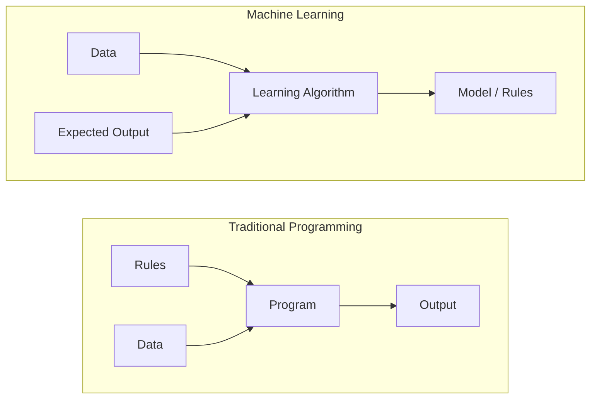
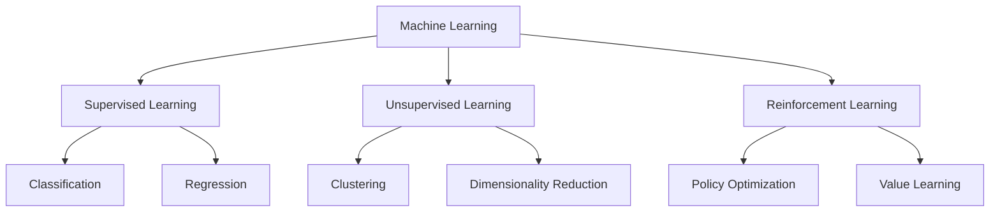
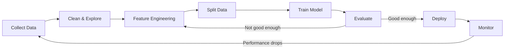
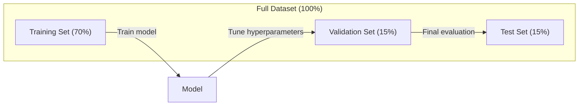
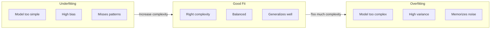
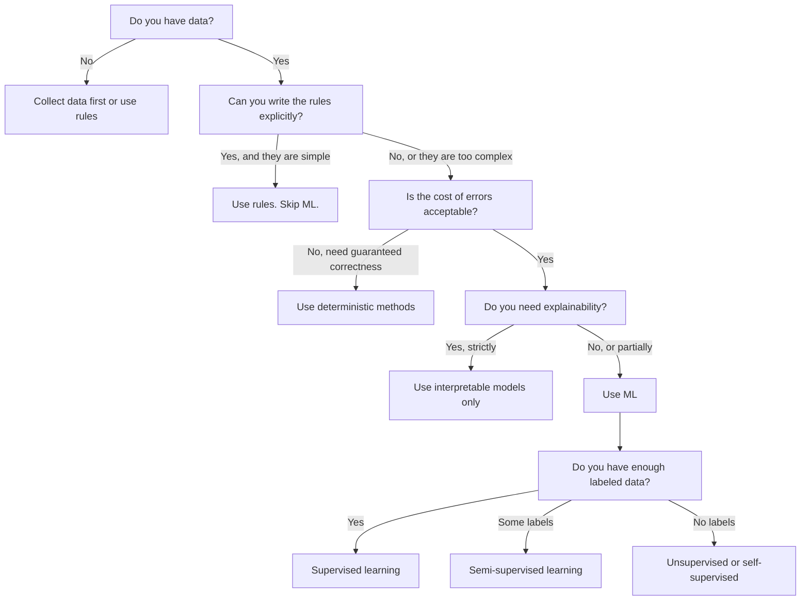

# 机器学习是什么?

> 机器学习是教计算机在数据中找到模式,而不是手动写规则.

**Type:** Learn
**Languages:** Python
**Prerequisites:** Phase 1 (Math Foundations)
**Time:** ~45 minutes

## 学习目标

- 解释监督,无监督和加强学习之间的区别,并确定适用于特定问题的类型
- 从零开始实现最接近的中位列分类器,并与随机基线进行评估
- 区分分分类和回归任务,并为每个任务选择适当的损失函数
- 评估一个特定的业务问题是否适合 ML 或更好地通过确定性规则解决

## 问题

如果你想建立一个垃圾邮件过器.传统的方法:坐下来写数百条规则. "如果电子邮件包含"免费的钱",请标记为垃圾邮件.如果有超过3个呼声符,请标记为垃圾邮件".你花了几周时间写规则.然后垃圾邮件人员改变了他们的措辞.你的规则被打破.你写了更多规则.循环永远不会结束.

机器学习会扭转这个问题.你给计算机送了数千封标记的电子邮件 ("垃圾邮件"或"不是垃圾邮件") 让它自己弄清楚这些规则.计算机会发现你从来没有想到的模式.

机器学习的核心是从"编程规则"转向"数据学习". 每个推引擎,语音助理,自动驾驶汽车和语言模型都以这种方式运作.

## 概念

### 从数据中学会,而不是规则

传统编程和机器学习解决了问题,



传统编程:你写出规则.程序将它们应用到数据中,以产生输出.

机器学习:你提供数据和预期的输出.算法发现了规则.

训练中所产生的"模式"是规则,编码为数字 (重量,参数).它从已见的例子中概括,以对从未见过的数据进行预测.

### 机器学习的三个类型



**Supervised Learning**模型学习如何将输入到输出地图.
- "这里有1万张标记着猫或狗的照片.
- "这里有房子的特征和价格.

**Unsupervised Learning**只有输入,没有标签,模型本身就能找到结构.
- "这里有1万个客户购买历史,找到自然的组合.
- "这里有1000个维度数据点,同时保持结构.

**Reinforcement Learning**经纪人在环境中采取行动,获得奖励或处罚.他学习一种战略 (政策) 来最大化总奖励.
- "玩这个游戏. 赢得1个,输掉1个,找出一个策略.
- "控制这个机器人臂. 接收物体的 +1 ,每秒浪费的 -0.01".

您将在实践中建立的大部分东西都使用监督学习.未监督学习是预处理和探索的常见.强化学习为语言模型提供了游戏人工智能,机器人和RLHF的能力.

### 超越三大

上面的三类都是清洁的,但现实世界ML经常模糊了线条.

**Semi-supervised learning**您可能有100个标记的医疗图像和100,000个标记不标记的图像. 技术包括:

- **Label propagation:**建立一个连接类似数据点的图表.标签从标记节点到未标记的邻居通过图表传播.
- **Pseudo-labeling:**训练一个模型,使用标签的数据,使用它来预测标签的数据,然后重新训练一切.
- **Consistency regularization:**模型应该对输入提供相同的预测,并且该输入的版本稍微乱.

**Self-supervised learning**模型从数据结构中创建了自己的预测任务.

- **Masked language modeling (BERT):**隐藏15%的单词,训练模型预测缺失的单词.
- **Contrastive learning (SimCLR):**让模型识别它们来自同一张图像,同时区分它们与其他图像的增强版本.
- **Next-token prediction (GPT):**预测下一个词,给出了之前的所有词.

它们不是与大三大分类的单独类别.它们是结合监督和未监督的战略.自我监督的学习技术上是监督的 (模型预测某种东西),但标签是自动生成的,不是由人类.

### 归类与回归

这些是监督学习的两个主要任务.

| Aspect | Classification | Regression |
|--------|---------------|------------|
| Output | Discrete categories | Continuous numbers |
| Example | "Is this email spam?" | "What will the house price be?" |
| Output space | {cat, dog, bird} | Any real number |
| Loss function | Cross-entropy, accuracy | Mean squared error, MAE |
| Decision | Boundaries between classes | A curve that fits the data |

归化回答"什么类别?" 退化回答"多少?"

预测股票上或下跌是分类.预测准确的价格是回归.

### 劳动力技术工作流程

每个机器学习项目都遵循相同的管道,不管算法如何.



**Collect Data**收集原始数据. 更多数据几乎总是更好,但质量比数量更重要.

**Clean & Explore**处理缺失值,删除重复,可视化分布,发现异常. 这一步通常需要60到80%的项目时间.

**Feature Engineering**转换原始数据成模型可以使用的功能.将日期转换为周日.正常化数值列.编码类别变量.好功能比精彩算法更重要.

**Split Data**模型训练基于训练数据,调整验证数据的超参数,并根据测试数据报告最终的性能.

**Train Model**输入训练数据到一个算法.算法调整内部参数以最大限度地减少损失函数.

**Evaluate**测量验证/测试数据的性能. 如果性能不合适,请回来试试不同的功能,算法或超参数.

**Deploy**模型将投入生产,它可以对新数据进行预测.

**Monitor**随着时间的推移,跟踪性能.数据分布变化 (数据漂移),模型降低.

### 训练,验证和测试分类

首先,你必须根据训练中从未见过的数据评估模型.否则你是测量记忆,而不是学习.



| Split | Purpose | When used | Typical size |
|-------|---------|-----------|-------------|
| Training | Model learns from this data | During training | 60-80% |
| Validation | Tune hyperparameters, compare models | After each training run | 10-20% |
| Test | Final unbiased performance estimate | Once, at the very end | 10-20% |

测试组是神圣的.你只看一次.如果你继续根据测试性能调整你的模型,你就在测试组上有效地训练,你的报告数字是无意义的.

对于小数据集,使用k倍交叉验证:将数据分为k部分,训练在k-1部分,验证剩余部分,旋转和平均结果.

### 过度适应与不足



**Underfitting**模型太简单,无法捕捉数据中的模式. 试图合适曲线关系的直线. 训练错误很高. 测试错误很高.

**Overfitting**模型太复杂,并且记忆训练数据,包括噪音.一个曲线,通过每一个训练点,但失败于新数据.训练错误很低.测试错误很高.

**Good fit**模型可以捕捉到实际的模式,而不会记住噪音.

过度装备的迹象:
- 训练精度远高于验证精度
- 模型在培训数据上表现良好,但在新数据上表现不佳
- 增加更多的培训数据提高了性能 (模型是记忆,而不是学习)

过装的固定装置:
- 获取更多训练数据
- 减少模型复杂性 (参数少,建筑简单)
- 规范 (加上大型重量罚款)
- 休息 (训练期间随机零结神经元)
- 早期停止 (验证错误开始增加时停止训练)

适配不良的固定装置:
- 使用更复杂的模型
- 添加更多功能
- 减少规律化
- 列车时间更长

### 偏差差的交易

这就是超级配件和不足配件的数学框架.

**Bias**错误的假设在模型中. 一个线性模型在真实的关系是非线性时具有高度偏见.高偏见导致不适合.

**Variance**错误:从敏感度到训练数据中的小波动.在不同数据子组上训练时,一个具有高差异的模型会提供非常不同的预测.高差异导致过度匹配.

| Model complexity | Bias | Variance | Result |
|-----------------|------|----------|--------|
| Too low (linear model for curved data) | High | Low | Underfitting |
| Just right | Medium | Medium | Good generalization |
| Too high (degree-20 polynomial for 10 points) | Low | High | Overfitting |

总误差 = 偏差^2 + 变异 + 无可减小的噪音

您不能减少不可减小的噪音 (这是数据本身的随机性).您想找到偏差^2+变异最小化的甜点点.

### 没有免费午餐理论

没有单一算法能适用于每一个问题.一个在一个类问题上表现良好的算法会在另一个类问题上表现不好.这就是为什么数据科学家试验多个算法并比较结果.

实际上,选择取决于:
- 你有多少数据
- 现在有多少特征
- 关系是否是线性或非线性
- 您是否需要解释性
- 你能承担多少的计算能力

### 什么时候不要使用机器学习

首先,问问你是否真的需要一个模型.

**Do not use ML when:**

- **Rules are simple and well-defined.**如果你可以用几种 if 语句写逻辑,模型就会增加复杂性,没有任何好处.
- **You have no data or very little data.**对于 ML,需要学习的例子. 有10个数据点,你不能训练任何有意义的东西.
- **The cost of being wrong is catastrophic and you need guaranteed correctness.**医疗剂量计算,核反应堆控制,加密验证.ML模型是概率的.它们有时会错误.如果"有时错误"是不可接受的,请使用确定性方法.
- **A lookup table or heuristic solves the problem.**如果一个简单的门或表覆盖99%的案例,增加ML将增加维护成本,而不会有意义上的改善.
- **You cannot explain the decision and explainability is required.**监管行业 (贷款,保险,刑事司法) 有时要求每个决定都能完全解释.有些ML模型可以解释 (线性回归,小决策树).大多数都不解释.
- **The problem changes faster than you can retrain.**如果每天规则都会改变,再训练需要一周,

使用此决定流程图:



```figure
f3-learning-boundary
```

## 建立它

编码在`code/ml_intro.py`它将从零开始实现最接近的中位数分类器,这是最简单的 ML 算法. 它展示了核心想法:从数据中学习,然后预测新的数据.

### 步骤1:从零开始,最接近的中位列表

最接近的中位分类器计算了训练数据中的每个类的中心 (平均值).为了预测,它将每个新点分配给最接近中心的类.

```python
class NearestCentroid:
    def fit(self, X, y):
        self.classes = np.unique(y)
        self.centroids = np.array([
            X[y == c].mean(axis=0) for c in self.classes
        ])

    def predict(self, X):
        distances = np.array([
            np.sqrt(((X - c) ** 2).sum(axis=1))
            for c in self.centroids
        ])
        return self.classes[distances.argmin(axis=0)]
```

预测计算距离,没有梯度下降,没有反复,没有超参数.

### 步骤2:训练合成数据

我们生成一个2D分类数据集,其中两个类别略有重叠.

```python
rng = np.random.RandomState(42)
X_class0 = rng.randn(100, 2) + np.array([1.0, 1.0])
X_class1 = rng.randn(100, 2) + np.array([-1.0, -1.0])
X = np.vstack([X_class0, X_class1])
y = np.array([0] * 100 + [1] * 100)
```

### 第三步:与原始标准相比较

任何ML模型都应该与一个微不足道的基线进行比较.这里,基线预测一个随机类.如果你的ML模型不胜随机猜测,那么有什么不对.

```python
baseline_preds = rng.choice([0, 1], size=len(y_test))
baseline_acc = np.mean(baseline_preds == y_test)
```

平均平均的数据准确度是50%左右.

### 为什么这很重要

最接近的中位数分类器很简单.它没有超参数,没有反演,没有梯度下降.然而它捕捉了基本的ML模式:

1. **Learn**培训数据的表示 (中心)
2. **Predict**采用该表示的新数据 (最近距离)
3. **Evaluate**根据基线 (随机猜测)

每个ML算法,从物流回归到变压器,都遵循相同的三步模式.表现变得更加复杂,但工作流程保持不变.

### 步骤4:中部分类器不能做什么

最接近的中位分类器假设每个类都形成一个斑点.它绘制了线性决策界限.它失败了当:

- 类有多个集群 (例如,数字1可以用多种不同的方式写作)
- 决策界限是非线性的 (例如,一个类围绕着另一个)
- 特性具有非常不同的尺度 (距离由最大尺度特征主导)

这些限制激励了你学习的每一个算法.K-近邻处理多个集群.决策树处理非线性界限.特征扩展解决了规模问题.每个课程都基于前一个的限制.

## 用它

 sklearn提供了`NearestCentroid`合成数据生成器:

```python
from sklearn.neighbors import NearestCentroid
from sklearn.datasets import make_classification
from sklearn.model_selection import train_test_split

X, y = make_classification(
    n_samples=500, n_features=2, n_redundant=0,
    n_clusters_per_class=1, random_state=42
)
X_train, X_test, y_train, y_test = train_test_split(X, y, test_size=0.3)

clf = NearestCentroid()
clf.fit(X_train, y_train)
print(f"Accuracy: {clf.score(X_test, y_test):.3f}")
```

## 运送它

这一课产生了`outputs/prompt-ml-problem-framer.md`让模糊的业务问题变成具体的 ML 任务. 给它一个问题描述 ("我们想减少缩"或"预测下一个季度需求") 它确定了学习类型,定义了预测目标,列出了候选人的特征,选择了成功指标,建立了基线,并标记了数据泄漏或类分类失衡等陷. 为了避免构建错误的东西,

## 关键词

| Term | What people say | What it actually means |
|------|----------------|----------------------|
| Model | "The AI" | A mathematical function with learnable parameters that maps inputs to outputs |
| Training | "Teaching the AI" | Running an optimization algorithm to adjust model parameters so predictions match known outputs |
| Feature | "An input column" | A measurable property of the data that the model uses to make predictions |
| Label | "The answer" | The known output for a training example, used to compute the error signal |
| Hyperparameter | "A setting you tweak" | A parameter set before training that controls the learning process (learning rate, number of layers) |
| Loss function | "How wrong the model is" | A function that measures the gap between predicted and actual outputs, which training tries to minimize |
| Overfitting | "It memorized the test" | The model learned training-specific noise instead of general patterns, so it fails on new data |
| Underfitting | "It didn't learn anything" | The model is too simple to capture the real patterns in the data |
| Generalization | "It works on new data" | The model's ability to make accurate predictions on data it was not trained on |
| Cross-validation | "Testing on different chunks" | Repeatedly splitting data into train/test folds and averaging results, giving a more robust performance estimate |
| Regularization | "Keeping weights small" | Adding a penalty term to the loss function that discourages overly complex models |
| Data drift | "The world changed" | The statistical distribution of incoming data shifts over time, degrading model performance |

## 运动

1. 根据"测试"的标准,您可以将数据集 (例如"Iris","Titanic") 分成70/15/15分成列车/验证/测试.
2. 列出现实世界三大问题. 对于每一个问题,请确定它们是否是分类,退缩或集群,以及是否受到监督或不受监督.
3. 模型在训练数据上获得99%的准确性,但在测试数据上获得60%的准确性.

## 进一步阅读

- [An Introduction to Statistical Learning](https://www.statlearning.com/)- 免费的教科书,涵盖所有经典的 ML 方法,提供实用例子
- [Google's Machine Learning Crash Course](https://developers.google.com/machine-learning/crash-course)- 简单的视觉介绍 ML概念
- [Scikit-learn User Guide](https://scikit-learn.org/stable/user_guide.html)- Python 中实现 ML 的实用参考
