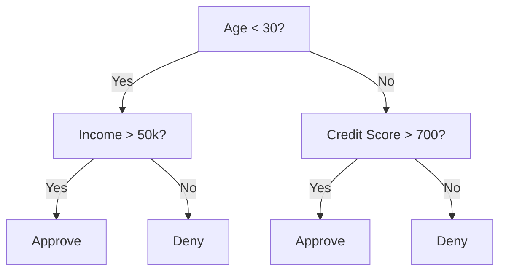
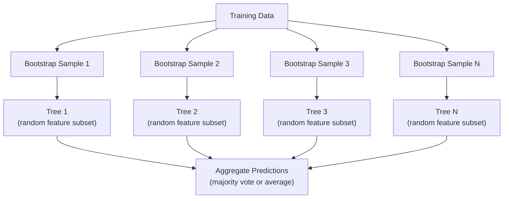

# 决策树木和随机森林

> 决策树只是一个流程图,但森林是 ML 中最强大的工具之一.

**Type:** Build
**Language:**字符串
**Prerequisites:** Phase 1 (Lessons 09 Information Theory, 06 Probability)
**Time:** ~90 minutes

## 学习目标

- 实现基尼杂质,缩和信息获取计算,以找到最佳的决策树分区
- 建立一个从零开始的决策树分类器,使用切割前控制 (最大深度,最小样本)
- 使用启动线抽样和特征随机化构建随机森林,并解释为什么它减少差异性
- 比较MDI特征的重要性与变量重要性,并确定MDI偏见何时

## 问题

您有表格数据.行列是样本,列是特征,您想预测的目标列.您可以将神经网络扔进它.但对于表格数据,基于树的模型 (决策树,随机森林,梯度增强树) 始终超过深度学习.结构数据上的Kaggle竞赛由XGBoost和LightGBM主导,而不是转换器.

为什么?树木处理混合特征类型 (数量和类型) 没有预处理.它们处理无线性关系,没有特征工程.它们可以解释:你可以看树木并看到为什么确切地做出预测.随机森林,平均有很多树木,非常耐适合中等规模的数据集.

通过使用复发分离,这个课程从零开始构建决策树,然后在顶部构建一个随机的森林.你将实现分离标准 (基尼杂质,透,获取信息) 背后的数学,并了解为什么一个弱的学习者集团成为一个强大的.

## 概念

### 决策树的作用

决策树通过问答答/否问题进行序列,将特征空间分为矩形区域.



每个内部节点都会测试一个特征,对一个门进行测试. 每个叶节点都会做一个预测.

树由顶部下构建,在每个节点上选择最好分离数据的特征和门. "最好"是通过分类标准定义的.

### 分类标准:测量杂质

我们想把它们分为尽可能"纯净"的子节点,这意味着每个子都包含一个类.

**Gini impurity**测量随机选择的样本如果根据该节点的类分布标记,将被错误分类的概率.

```
Gini(S) = 1 - sum(p_k^2)

where p_k is the proportion of class k in set S.
```

对于一个纯节点 (所有一个类),吉尼=0.对于一个50/50类的二进制分区,吉尼=0.5.较低更好.

```
Example: 6 cats, 4 dogs

Gini = 1 - (0.6^2 + 0.4^2) = 1 - (0.36 + 0.16) = 0.48
```

**Entropy**测量节点中的信息内容 (混乱).

```
Entropy(S) = -sum(p_k * log2(p_k))
```

对于纯节点,进化值=0.对于50/50的二进制分区,进化值=1.0.较低更好.

```
Example: 6 cats, 4 dogs

Entropy = -(0.6 * log2(0.6) + 0.4 * log2(0.4))
        = -(0.6 * -0.737 + 0.4 * -1.322)
        = 0.442 + 0.529
        = 0.971 bits
```

**Information gain**分后的杂质 (化或基尼) 减少.

```
IG(S, feature, threshold) = Impurity(S) - weighted_avg(Impurity(S_left), Impurity(S_right))

where the weights are the proportions of samples in each child.
```

它们的目标是: 尝试每一个功能和每一个可能的门.

### 分裂的方法

对于一个数据集,在当前节点上具有 n 个特征和 m 样本:

1. 对于每个特征 j (j = 1 到 n):
   - 按特征排序样本
   - 试试连续不同的值之间的每个中点作为门
   - 计算每个门的信息收益
2. 选择具有最高信息获取的特征和门
3. 按左 (特征 <=门) 和右 (特征 >门) 分开数据
4. 每个孩子的重复

利的方法不能保证全球最佳树.找到最佳树很难.

### 停止条件

树木在不停的条件下生长,直到每一张叶子都清纯 (每叶一样子). 这可以完美地记住训练数据,并将其普遍化得非常糟糕.

**Pre-pruning**在树完全长大之前,停止:
- 树木达到设定的深度时停止分开
- 每叶的最小样本:如果节点的样本数小于k,则停止
- 最低信息获取:如果最好的分离改善不度,则停止
- 最多叶节:限制叶子总数

**Post-pruning**树长满,然后剪下去.
- 成本复杂性剪裁 (使用于剪刀学习):增加与叶子数量的比例的罚款.增加罚款以获得较小的树木
- 减少错误剪裁:如果验证错误不增加,则删除子树

切割前更简单,更快.切割后通常会产生更好的树木,因为它不会提前阻止可能导致更有用的切割的裂.

### 归归的决策树

对于回归,叶子预测是该叶子中目标值的平均值. 分裂标准也会改变:

**Variance reduction**取代信息获取:

```
VR(S, feature, threshold) = Var(S) - weighted_avg(Var(S_left), Var(S_right))
```

选择最少变量的分区.树将输入空间分为区域,并预测每个区域的常数 (平均值).

### 随机森林:集团的力量

单个决策树具有很大的差异性.数据中的小变化可以产生完全不同的树木.随机森林通过平均计算许多树木来解决这一问题.



两种随机性来源使树木多样化:

**Bagging (bootstrap aggregating):**每棵树都采用一个引导链样本,一个随机样本,从训练数据中取代.大约63%的原始样本出现在每个引导链中 (其余的样本是可以用于验证的包装样本).

**Feature randomization:**在每一个分区时,只考虑一个随机的特征子集.用于分类,默认是 sqrt(n_特征).对于回归,n_特征/3. 这阻止所有树木在同一主导特征上分区.

基本的见解:平均数量多个不合并的树木可以减少差异性,而不会增加偏见.

### 功能重要性

随机森林自然提供特征重要性分数.

**Mean Decrease in Impurity (MDI):**对于每个特征,总结所有树木和使用该特征的所有节点的污染总减少.在早期的分离中产生更大的污染减少的特征更重要.

```
importance(feature_j) = sum over all nodes where feature_j is used:
    (n_samples_at_node / n_total_samples) * impurity_decrease
```

这种方法是快速的 (训练期间计算),但偏向于高卡丁度的特征和功能,有很多可能的分区点.

**Permutation importance**换个方式:将一个特征的值混为一谈,测量模型的精度有多下降.

### 当树木击败神经网络时

树木和森林在表格数据上占据了神经网络的主导地位.

| Factor | Trees | Neural networks |
|--------|-------|----------------|
| Mixed types (numeric + categorical) | Native support | Need encoding |
| Small datasets (< 10k rows) | Work well | Overfit |
| Feature interactions | Found by splitting | Need architecture design |
| Interpretability | Full transparency | Black box |
| Training time | Minutes | Hours |
| Hyperparameter sensitivity | Low | High |

网络在数据具有空间或序列结构 (图像,文本,音频) 时获胜.

```figure
decision-tree-depth
```

## 建立它

### 步骤1:基尼杂质和缩

建立两个分离标准从零开始,并验证他们同意哪些分离是好的.

```python
import math

def gini_impurity(labels):
    n = len(labels)
    if n == 0:
        return 0.0
    counts = {}
    for label in labels:
        counts[label] = counts.get(label, 0) + 1
    return 1.0 - sum((c / n) ** 2 for c in counts.values())

def entropy(labels):
    n = len(labels)
    if n == 0:
        return 0.0
    counts = {}
    for label in labels:
        counts[label] = counts.get(label, 0) + 1
    return -sum(
        (c / n) * math.log2(c / n) for c in counts.values() if c > 0
    )
```

### 步骤 2: 找到最好的分区

试试每一个特征和门,返回最多信息的门.

```python
def information_gain(parent_labels, left_labels, right_labels, criterion="gini"):
    measure = gini_impurity if criterion == "gini" else entropy
    n = len(parent_labels)
    n_left = len(left_labels)
    n_right = len(right_labels)
    if n_left == 0 or n_right == 0:
        return 0.0
    parent_impurity = measure(parent_labels)
    child_impurity = (
        (n_left / n) * measure(left_labels) +
        (n_right / n) * measure(right_labels)
    )
    return parent_impurity - child_impurity
```

### 步骤3:建立决策树类

复发分区,预测,以及特征重点跟踪. `_build`树的核心:它停止当一个节点是纯洁的或达到切割前的限制,否则它采取最好的分开,重复到两个孩子.

```python
import random

class DecisionTree:
    def __init__(self, max_depth=None, min_samples_split=2,
                 min_samples_leaf=1, criterion="gini",
                 max_features=None):
        self.max_depth = max_depth
        self.min_samples_split = min_samples_split
        self.min_samples_leaf = min_samples_leaf
        self.criterion = criterion
        self.max_features = max_features
        self.tree = None
        self.feature_importances_ = None

    def fit(self, X, y):
        self.n_features = len(X[0])
        self.feature_importances_ = [0.0] * self.n_features
        self.n_samples = len(X)
        self.tree = self._build(X, y, depth=0)
        total = sum(self.feature_importances_)
        if total > 0:
            self.feature_importances_ = [
                fi / total for fi in self.feature_importances_
            ]

    def predict(self, X):
        return [self._predict_one(x, self.tree) for x in X]

    def _build(self, X, y, depth):
        if len(set(y)) == 1:
            return {"leaf": True, "value": y[0]}

        if self.max_depth is not None and depth >= self.max_depth:
            return self._make_leaf(y)

        if len(y) < self.min_samples_split:
            return self._make_leaf(y)

        best_feature, best_threshold, best_gain = self._best_split(X, y)

        if best_feature is None or best_gain <= 0:
            return self._make_leaf(y)

        left_X, left_y, right_X, right_y = self._split_data(
            X, y, best_feature, best_threshold
        )

        if len(left_y) < self.min_samples_leaf or len(right_y) < self.min_samples_leaf:
            return self._make_leaf(y)

        weight = len(y) / self.n_samples
        self.feature_importances_[best_feature] += weight * best_gain

        return {
            "leaf": False,
            "feature": best_feature,
            "threshold": best_threshold,
            "left": self._build(left_X, left_y, depth + 1),
            "right": self._build(right_X, right_y, depth + 1),
        }

    def _make_leaf(self, y):
        counts = {}
        for label in y:
            counts[label] = counts.get(label, 0) + 1
        return {"leaf": True, "value": max(counts, key=counts.get)}

    def _best_split(self, X, y):
        best_feature = None
        best_threshold = None
        best_gain = -1.0

        if self.max_features == "sqrt":
            k = max(1, int(math.sqrt(self.n_features)))
            feature_indices = random.sample(range(self.n_features), k)
        elif isinstance(self.max_features, int):
            if self.max_features < 1:
                raise ValueError("max_features must be at least 1 when given as an integer")
            k = min(self.max_features, self.n_features)
            feature_indices = random.sample(range(self.n_features), k)
        else:
            feature_indices = list(range(self.n_features))

        for feature_idx in feature_indices:
            values = sorted(set(X[i][feature_idx] for i in range(len(X))))
            if len(values) <= 1:
                continue

            for i in range(len(values) - 1):
                threshold = (values[i] + values[i + 1]) / 2.0
                left_y = [y[j] for j in range(len(X)) if X[j][feature_idx] <= threshold]
                right_y = [y[j] for j in range(len(X)) if X[j][feature_idx] > threshold]

                if len(left_y) < self.min_samples_leaf or len(right_y) < self.min_samples_leaf:
                    continue

                gain = information_gain(y, left_y, right_y, self.criterion)
                if gain > best_gain:
                    best_gain = gain
                    best_feature = feature_idx
                    best_threshold = threshold

        return best_feature, best_threshold, best_gain

    def _split_data(self, X, y, feature, threshold):
        left_X, left_y, right_X, right_y = [], [], [], []
        for i in range(len(X)):
            if X[i][feature] <= threshold:
                left_X.append(X[i])
                left_y.append(y[i])
            else:
                right_X.append(X[i])
                right_y.append(y[i])
        return left_X, left_y, right_X, right_y

    def _predict_one(self, x, node):
        if node["leaf"]:
            return node["value"]
        if x[node["feature"]] <= node["threshold"]:
            return self._predict_one(x, node["left"])
        return self._predict_one(x, node["right"])
```

### 步骤4: 建立一个随机森林课程

启动抽样,随机定位,以及多数投票.

```python
class RandomForest:
    def __init__(self, n_trees=100, max_depth=None,
                 min_samples_split=2, max_features="sqrt",
                 criterion="gini"):
        self.n_trees = n_trees
        self.max_depth = max_depth
        self.min_samples_split = min_samples_split
        self.max_features = max_features
        self.criterion = criterion
        self.trees = []

    def fit(self, X, y):
        n = len(X)
        for _ in range(self.n_trees):
            indices = [random.randint(0, n - 1) for _ in range(n)]
            X_boot = [X[i] for i in indices]
            y_boot = [y[i] for i in indices]
            tree = DecisionTree(
                max_depth=self.max_depth,
                min_samples_split=self.min_samples_split,
                max_features=self.max_features,
                criterion=self.criterion,
            )
            tree.fit(X_boot, y_boot)
            self.trees.append(tree)

    def predict(self, X):
        all_preds = [tree.predict(X) for tree in self.trees]
        predictions = []
        for i in range(len(X)):
            votes = {}
            for preds in all_preds:
                v = preds[i]
                votes[v] = votes.get(v, 0) + 1
            predictions.append(max(votes, key=votes.get))
        return predictions
```

看到`code/trees.py`对于所有辅助方法的全面实施.

## 用它

通过学习,训练一个随机的森林是三个线条:

```python
from sklearn.ensemble import RandomForestClassifier
from sklearn.datasets import load_iris
from sklearn.model_selection import train_test_split

X, y = load_iris(return_X_y=True)
X_train, X_test, y_train, y_test = train_test_split(X, y, random_state=42)

rf = RandomForestClassifier(n_estimators=100, random_state=42)
rf.fit(X_train, y_train)
print(f"Accuracy: {rf.score(X_test, y_test):.4f}")
print(f"Feature importances: {rf.feature_importances_}")
```

实际上,梯度增强的树木 (XGBoost, LightGBM, CatBoost) 通常比随机树木强得多,因为它们连续构建树木,每个树都纠正了前一个的错误.

## 运送它

这一课产生了`outputs/prompt-tree-interpreter.md`-- 一个提示,可以解释决策树分类的企业利益相关者. 给它提供训练有素的树结构 (深度,特征,分区门,准确性) 并将模型转化为简单的语言规则,排名特征的重要性,标志过度填充或泄漏,并建议下一步步骤. 随时使用它,你需要向一个不读代码的人解释树基模型.

## 运动

1. 训练一个单个决策树在3类的2D数据集上.手动追踪分区和绘制矩形决策边界.在max_depth=2 vsmax_depth=10上比较边界.

2. 实现回归树的变量减小分化.生成y = sin(x) +噪音为200点,并将回归树匹配. 绘制树的零件定位预测与真曲线相比.

3. 构建一个随机森林,包括1,5,10,50和200棵树. 测试地图训练精度和测试精度与树数.观察测试精度高原但不会减少 (森林抵抗过度适应).

4. 根据5个不同的数据集进行基尼杂质与化比较.测量准确性和树深度.在大多数情况下,它们产生几乎相同的结果.解释原因.

5. 实现变量重要性.在数据集中,一个特征是随机噪音,但具有高的特点.MDI将高分别的噪音特征.变量重要性不会.

## 关键词

| Term | What people say | What it actually means |
|------|----------------|----------------------|
| Decision tree | "A flowchart for predictions" | A model that partitions feature space into rectangular regions by learning a sequence of if/else splits |
| Gini impurity | "How mixed the node is" | Probability of misclassifying a random sample at a node. 0 = pure, 0.5 = maximum impurity for binary |
| Entropy | "The disorder in a node" | Information content at a node. 0 = pure, 1.0 = maximum uncertainty for binary. From information theory |
| Information gain | "How good a split is" | Reduction in impurity after a split. The greedy criterion for choosing splits |
| Pre-pruning | "Stop the tree early" | Stopping tree growth early by setting max depth, min samples, or min gain thresholds |
| Post-pruning | "Trim the tree after" | Growing the full tree, then removing subtrees that do not improve validation performance |
| Bagging | "Train on random subsets" | Bootstrap aggregating. Train each model on a different random sample with replacement |
| Random forest | "A bunch of trees" | Ensemble of decision trees, each trained on a bootstrap sample with random feature subsets at each split |
| Feature importance (MDI) | "Which features matter" | Total impurity decrease contributed by each feature, summed across all trees and nodes |
| Permutation importance | "Shuffle and check" | Accuracy drop when a feature's values are randomly shuffled. More reliable than MDI for noisy features |
| Variance reduction | "The regression version of info gain" | The regression tree analogue of information gain. Picks the split that reduces target variance the most |
| Bootstrap sample | "Random sample with repeats" | A random sample drawn with replacement from the original dataset. Same size, but with duplicates |

## 进一步阅读

- [Breiman: Random Forests (2001)](https://link.springer.com/article/10.1023/A:1010933404324)- 原始的随机森林纸
- [Grinsztajn et al.: Why do tree-based models still outperform deep learning on tabular data? (2022)](https://arxiv.org/abs/2207.08815)- 树木与神经网络的严格比较
- [scikit-learn Decision Trees documentation](https://scikit-learn.org/stable/modules/tree.html)- 实用指南,可用可视化工具
- [XGBoost: A Scalable Tree Boosting System (Chen & Guestrin, 2016)](https://arxiv.org/abs/1603.02754)- 升升升升升升升升升升升升升升升升升升升升升升升升升升升升升升升升升升升升升升升升升升升升升升升升升升升升升升升升升升升升升升升升升升升升升升升升升升升升升升升升升升升升升升升升升升升升升升升升升升升升升升升升升升升升升升升升升升升升升升升升升升升升升升升升升升升升升升升升升升升升升升升升升升升升升升升升升升升升升升升升升升升升升升升升升升升升升升升升升升升升升升升升升升升升升升升升升升升升升升升升升升升升升升升升升升升升升升升升升升升升升升升升升升升升升升升升升升升升升升升升升升升升升升升升升升升升升升升升升升升升升升升升升升升升升升升升升升升升升升升升升升升升升升升升升升升升升升升升升升升升升升升升升升升升升升升升升升升升升升升升升升升升升升升升升升升升升升升升升升升升升升升升升升升升升升升升升升升升升升升升升升升升升升升升升升升升升升升升升升升升升升升升升升升升升升升升升升升升升升升升升升升升升升升升升升升升升升升升升升升升升升升升升升升升升升升升升升升升升升升升升升升升升升升升升升升升升升升升升升升升升升升升升升升升升升升升升升升升升升升升升升升升升升升升升升升升升升升升升升升升升升升升升升升
