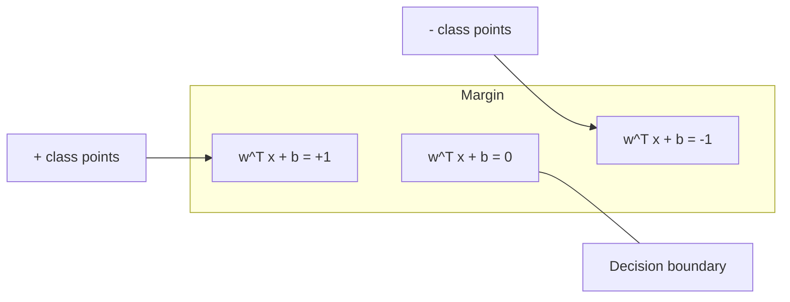
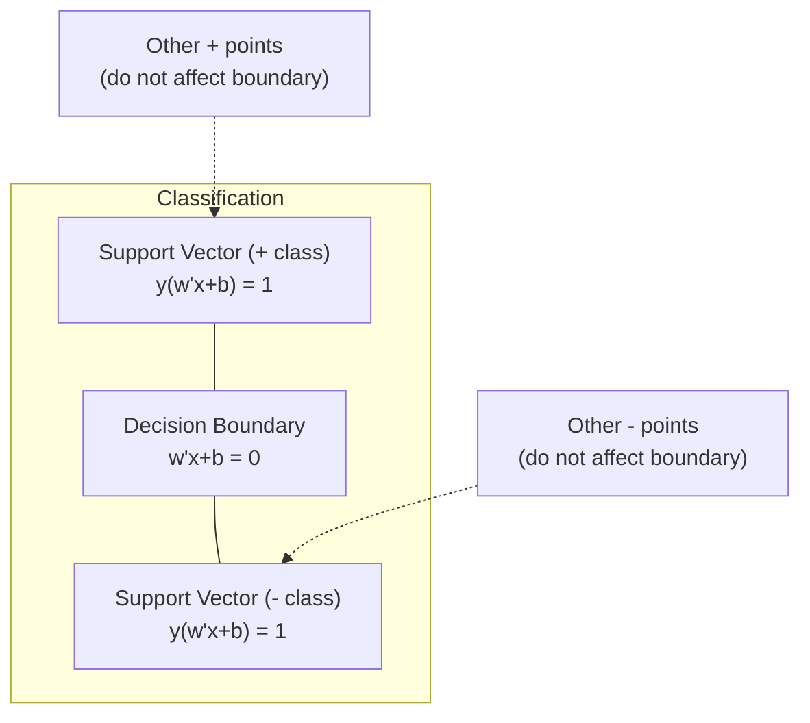
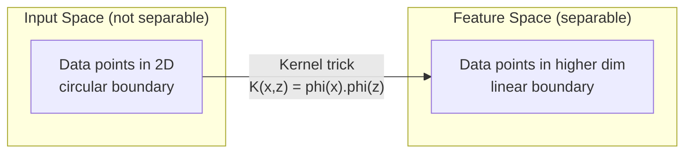

# 支持向量机

> 找出两个阶级之间的最宽的街道.

**Type:** Build
**Language:**字符串
**Prerequisites:** Phase 1 (Lessons 08 Optimization, 14 Norms and Distances, 18 Convex Optimization)
**Time:** ~90 minutes

## 学习目标

- 实现从零开始使用原始配方的链损失和梯度下降的线性SVM
- 解释最大边缘原则,并从训练有素的模型中确定支持向量
- 比较线性,多项和RBF内核,并解释内核技巧如何避免明确的高维映射
- 评估边缘宽度和分类错误之间的C参数控制的权衡

## 问题

您有两个类的数据点,需要画一个线 (或超平面) 分离它们.无限的许多线可以工作.你应该选择哪一个?

差距是决定边界和每一边最接近的数据点之间的距离. 较宽的差距意味着分类器更有信心,更好地将未见的数据概括.

这种直觉导致了支持向量机,这是 ML 中最具数学优雅的算法之一.SVM在深度学习之前是主导分类方法,并且仍然是小数据集,高维度数据和需要原则,理解良好模型的理论保障的问题最好的选择.

 SVM 直接连接到第1阶段:优化是曲的 (课时18),边缘是用规范 (课时14) 测量的,并且内核技巧利用点产品来处理非线性界限,而无需在高维空间中计算.

## 概念

### 最大利分类器

由于线性分离的数据, 标签 y_i 在 {-1, +1} 和特征向量 x_i, 我们想要一个超平面 w^T x + b = 0 分离类.

从点 x_i 到超平面的距离是:

```
distance = |w^T x_i + b| / ||w||
```

对于正确分类的点:y_i * (w^T x_i + b) > 0. 边缘是从超平面到两侧最近的点的距离的两倍.



优化问题:

```
maximize    2 / ||w||     (the margin width)
subject to  y_i * (w^T x_i + b) >= 1  for all i
```

同样 (最小化时的时间更容易优化):

```
minimize    (1/2) ||w||^2
subject to  y_i * (w^T x_i + b) >= 1  for all i
```

这是一个曲的方形程序. 它有一个独特的全球解决方案.坐落在边界边界 (w^T x_i + b) = 1) 的数据点是支持向量.它们是决定边界的唯一点.移动或移除任何非支持向量点,边界不会改变.

### 支持向量:少数关键



大多数训练点是无关紧要的.只有支持向量才有所重要.这就是为什么SVM在预测时间上具有记忆效率:你只需要存储支持向量,而不是整个训练集.

支持向量数量也给出了通用错误的限制.与数据集尺寸相比,支持向量较少意味着更好的通用.

### 软边缘:使用C参数处理噪音

实际数据很少完全可以分开.一些点可能位于边界的错误侧面或边界内部.软边界公式允许通过引入宽松变量来违反.

```
minimize    (1/2) ||w||^2 + C * sum(xi_i)
subject to  y_i * (w^T x_i + b) >= 1 - xi_i
            xi_i >= 0  for all i
```

宽松变量 xi_i 测量了 i 点违反了边际的程度. C 控制了交易:

| C value | Behavior |
|---------|----------|
| Large C | Penalizes violations heavily. Narrow margin, fewer misclassifications. Overfits |
| Small C | Allows more violations. Wide margin, more misclassifications. Underfits |

是规律化强度,逆转.大 C = 规律化较少.小 C = 规律化较大.

### 损失:SVM损失函数

软边缘SVM可以被重写为无限制优化:

```
minimize    (1/2) ||w||^2 + C * sum(max(0, 1 - y_i * (w^T x_i + b)))
```

术语max(0,1 - y_i * f(x_i)) 是链损失.当点正确分类后,它是零.当点在边缘内或错误分类后,它是线性.

```
Hinge loss for a single point:

loss
  |
  | \
  |  \
  |   \
  |    \
  |     \_______________
  |
  +-----|-----|-------->  y * f(x)
       0     1

Zero loss when y*f(x) >= 1 (correctly classified, outside margin).
Linear penalty when y*f(x) < 1.
```

进行物流损失 (物流回归) 的比较:

```
Hinge:     max(0, 1 - y*f(x))          Hard cutoff at margin
Logistic:  log(1 + exp(-y*f(x)))        Smooth, never exactly zero
```

损产生稀缺的解决方案 (只有支持向量有非零的贡献).物流损失使用所有数据点.这使得SVM在预测时间更有效的存储.

### 训练直线SVM,梯度下降

您可以使用链损失的梯度下降加上L2规律化来训练线性SVM,而不需要解决限制的QP:

```
L(w, b) = (lambda/2) * ||w||^2 + (1/n) * sum(max(0, 1 - y_i * (w^T x_i + b)))

Gradient with respect to w:
  If y_i * (w^T x_i + b) >= 1:  dL/dw = lambda * w
  If y_i * (w^T x_i + b) < 1:   dL/dw = lambda * w - y_i * x_i

Gradient with respect to b:
  If y_i * (w^T x_i + b) >= 1:  dL/db = 0
  If y_i * (w^T x_i + b) < 1:   dL/db = -y_i
```

这称为原始式.它运行在O(n * d) 每个时代,其中n是样本数,d是特征数.对于大小,稀少,高维度数据 (文本分类),这是快速的.

### 双重配方和核心技巧

根据第一阶段18课,KKT条件,SVM问题的拉格兰基双数是:

```
maximize    sum(alpha_i) - (1/2) * sum_ij(alpha_i * alpha_j * y_i * y_j * (x_i . x_j))
subject to  0 <= alpha_i <= C
            sum(alpha_i * y_i) = 0
```

双只涉及数据点之间的点产品x_i.x_j.这是关键见解.用内核函数K(x_i,x_j) 取代每个点产品,SVM可以学习非线性界限,而不会明确计算转换.

```
Linear kernel:      K(x, z) = x . z
Polynomial kernel:  K(x, z) = (x . z + c)^d
RBF (Gaussian):     K(x, z) = exp(-gamma * ||x - z||^2)
```

 RBF 核将数据映射到无限维度空间中.输入空间中接近的点具有接近 1 的核值.距离较远的点具有接近 0 的核值.它可以学习任何平滑的决策界限.



核技巧在高维空间中计算点产量,但从来没有到达那里.对于 D 维度的多项内核,明确的特征空间有 O  D 维度.但 K  x, z 计算在 O  D 时间.

### 逆转的SVM (SVR)

支持向量回归将宽度的子环绕数据.子内部的点是零损失的.子以外的点是线性地处罚的.

```
minimize    (1/2) ||w||^2 + C * sum(xi_i + xi_i*)
subject to  y_i - (w^T x_i + b) <= epsilon + xi_i
            (w^T x_i + b) - y_i <= epsilon + xi_i*
            xi_i, xi_i* >= 0
```

宽管 = 支持向量较少 = 适合性更高.窄管 = 支持向量较多 = 适合性更紧.

### 为什么SVM输给深度学习 (以及当他们仍然赢得时)

从1990年代末到2010年代初,SVM主导了 ML.深度学习因多种原因超过了它们:

| Factor | SVMs | Deep learning |
|--------|------|---------------|
| Feature engineering | Requires it | Learns features |
| Scalability | O(n^2) to O(n^3) for kernel | O(n) per epoch with SGD |
| Image/text/audio | Needs handcrafted features | Learns from raw data |
| Large datasets (>100k) | Slow | Scales well |
| GPU acceleration | Limited benefit | Massive speedup |

在这些情况下,SVM仍然赢得胜利:
- 小数据集 (数百到数千个样本)
- 高维度稀疏数据 (含TF-IDF功能的文本)
- 需要数学保证时 (边际额度)
- 训练时间必须最小 (线性SVM非常快)
- 具有明确的利结构的二元分类
- 异常检测 (单类SVM)

```figure
svm-margin
```

## 建立它

### 步骤1:痕损失和梯度

根据,计算一批的杆损失及其梯度.

```python
def hinge_loss(X, y, w, b):
    n = len(X)
    total_loss = 0.0
    for i in range(n):
        margin = y[i] * (dot(w, X[i]) + b)
        total_loss += max(0.0, 1.0 - margin)
    return total_loss / n
```

### 步骤2:通过梯度下降的线性SVM

通过减少规律化关损失来训练.

```python
class LinearSVM:
    def __init__(self, lr=0.001, lambda_param=0.01, n_epochs=1000):
        self.lr = lr
        self.lambda_param = lambda_param
        self.n_epochs = n_epochs
        self.w = None
        self.b = 0.0

    def fit(self, X, y):
        n_features = len(X[0])
        self.w = [0.0] * n_features
        self.b = 0.0

        for epoch in range(self.n_epochs):
            for i in range(len(X)):
                margin = y[i] * (dot(self.w, X[i]) + self.b)
                if margin >= 1:
                    self.w = [wj - self.lr * self.lambda_param * wj
                              for wj in self.w]
                else:
                    self.w = [wj - self.lr * (self.lambda_param * wj - y[i] * X[i][j])
                              for j, wj in enumerate(self.w)]
                    self.b -= self.lr * (-y[i])

    def predict(self, X):
        return [1 if dot(self.w, x) + self.b >= 0 else -1 for x in X]
```

### 步骤3:内核函数

实现线性,多项和RBF核.

```python
def linear_kernel(x, z):
    return dot(x, z)

def polynomial_kernel(x, z, degree=3, c=1.0):
    return (dot(x, z) + c) ** degree

def rbf_kernel(x, z, gamma=0.5):
    diff = [xi - zi for xi, zi in zip(x, z)]
    return math.exp(-gamma * dot(diff, diff))
```

### 步骤4:边缘和支持向量识别

训练后,确定哪些点是支向量,并计算边缘宽度.

```python
def find_support_vectors(X, y, w, b, tol=1e-3):
    support_vectors = []
    for i in range(len(X)):
        margin = y[i] * (dot(w, X[i]) + b)
        if abs(margin - 1.0) < tol:
            support_vectors.append(i)
    return support_vectors
```

看到`code/svm.py`对于所有演示的全面实施.

## 用它

通过"学习"

```python
from sklearn.svm import SVC, LinearSVC, SVR
from sklearn.preprocessing import StandardScaler
from sklearn.pipeline import Pipeline

clf = Pipeline([
    ("scaler", StandardScaler()),
    ("svm", SVC(kernel="rbf", C=1.0, gamma="scale")),
])
clf.fit(X_train, y_train)
print(f"Accuracy: {clf.score(X_test, y_test):.4f}")
print(f"Support vectors: {clf['svm'].n_support_}")
```

重要:在训练SVM之前,总是扩展特征.SVM对特征大小敏感,因为边缘取决于未扩展的特征,而扭曲了几何学.

对于大型数据集,使用`LinearSVC`(原始表达式,O(n) 按时代)`SVC`(双式表达,O(n^2) 到O(n^3)):

```python
from sklearn.svm import LinearSVC

clf = Pipeline([
    ("scaler", StandardScaler()),
    ("svm", LinearSVC(C=1.0, max_iter=10000)),
])
```

## 运动

1. 生成一个2D线性可分离的数据集.训练你的线性SVM并识别支持向量. 检查支持向量是决策边界最接近的点.

2. 在噪音集中的C从0.001到1000变化.为每个C值绘制决定界限.观察从宽边缘 (不适合) 到狭窄边缘 (过适合) 的过渡.

3. 创建一个类界限圆形 (非线性) 的数据集. 显示线性SVM失败.计算RBF内核矩阵,并显示内核诱导的功能空间中类变得可分离.

4. 根据数据集进行链损失与物流损失的比较.训练线性SVM和物流回归.计算每个模型的决策边界 (支持向量与所有点) 贡献多少训练点.

5. 执行SVR (epsilon-insensitive loss).将其调整为y = sin(x) +噪音. 围绕预测图画出epsilon管,并突出支持向量 (管外的点).

## 关键词

| Term | What it actually means |
|------|----------------------|
| Support vectors | The training points closest to the decision boundary. The only points that determine the hyperplane |
| Margin | The distance between the decision boundary and the nearest support vectors. SVMs maximize this |
| Hinge loss | max(0, 1 - y*f(x)). Zero when correctly classified and outside the margin. Linear penalty otherwise |
| C parameter | Trade-off between margin width and classification errors. Large C = narrow margin, small C = wide margin |
| Soft margin | SVM formulation that allows margin violations via slack variables. Handles non-separable data |
| Kernel trick | Computing dot products in a high-dimensional feature space without explicitly mapping to that space |
| Linear kernel | K(x, z) = x . z. Equivalent to standard dot product. For linearly separable data |
| RBF kernel | K(x, z) = exp(-gamma * \|\|x-z\|\|^2). Maps to infinite dimensions. Learns any smooth boundary |
| Polynomial kernel | K(x, z) = (x . z + c)^d. Maps to a feature space of polynomial combinations |
| Dual formulation | Reformulation of the SVM problem that depends only on dot products between data points. Enables kernels |
| SVR | Support Vector Regression. Fits an epsilon-tube around the data. Points inside the tube have zero loss |
| Slack variables | xi_i: measures how much a point violates the margin. Zero for correctly classified points outside margin |
| Maximum margin | The principle of choosing the hyperplane that maximizes the distance to the nearest points of each class |

## 进一步阅读

- [Vapnik: The Nature of Statistical Learning Theory (1995)](https://link.springer.com/book/10.1007/978-1-4757-3264-1)- 关于SVM和统计学学习的基础文本
- [Cortes & Vapnik: Support-vector networks (1995)](https://link.springer.com/article/10.1007/BF00994018)- 原始的SVM纸
- [Platt: Sequential Minimal Optimization (1998)](https://www.microsoft.com/en-us/research/publication/sequential-minimal-optimization-a-fast-algorithm-for-training-support-vector-machines/)-使SM培训成为实践的SMO算法
- [scikit-learn SVM documentation](https://scikit-learn.org/stable/modules/svm.html)- 具体实施的实践指南
- [LIBSVM: A Library for Support Vector Machines](https://www.csie.ntu.edu.tw/~cjlin/libsvm/)- 支持大多数SVM实现的C++库
