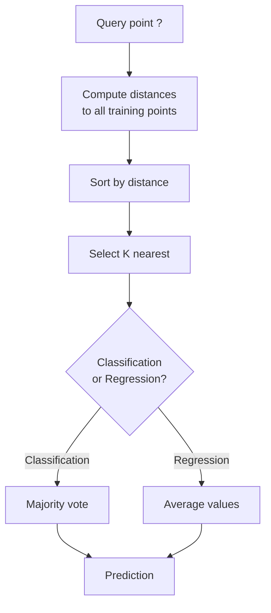
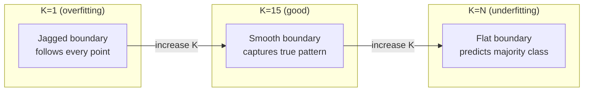
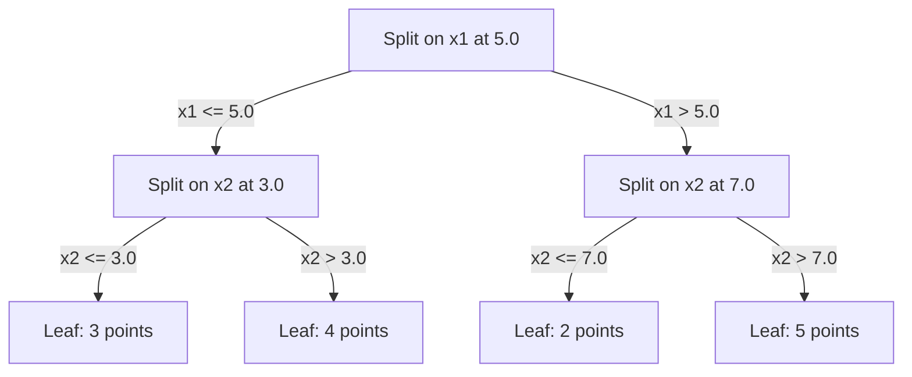

# 附近邻居和距离

> 通过观察邻居来预测,最简单的算法实际上是有效的.

**Type:** Build
**Language:**字符串
**Prerequisites:** Phase 1 (Lesson 14 Norms and Distances)
**Time:** ~90 minutes

## 学习目标

- 实施KN分类和从零开始回归,使用可配置的K和距离权重投票
- 进行L1,L2,Cosine和Minkowski距离指标的比较,并选择适合给定的数据类型的指标
- 解释维度的诅咒,并证明KNN为什么在高维空间中降解
- 建立一个KD树,以有效地搜索和分析近邻,

## 问题

你有一个数据集.一个新的数据点到来.你需要分类它或预测它的价值.而不是从数据中学习参数 (如线性回归或SVM),你只能找到K训练点最接近新点,让他们投票.

没有训练阶段,没有学习参数,没有减轻损失函数,你将整个训练集存储并计算距离在预测时间.

对于许多问题来说,KNN显然具有竞争力,特别是对于小到中等数据集,理解它深入揭示了基本概念:距离测量 (连接到第一阶段14课),维度的诅咒,

现在,KNN也在现代人工智能中出现,只是以不同的名称.向量数据库在嵌入式中搜索KNN.检索增强生成 (RAG) 发现K最近的文档块.推系统发现类似的用户或项目.算法是一样的.规模和数据结构不同.

## 概念

### KNN 的运作方式

鉴于标记点的数据集和新的查询点:

1. 计算查询到数据集中的每个点的距离
2. 按距离排序
3. 取 K 最接近的点
4. 归类:K邻国中多数投票
5. 对于回归:K邻居值的平均值 (或权重平均值)



没有适应,没有梯度下降,没有时代.

### 选择K

基是单个超参数,它控制偏差变量交易:

| K | Behavior |
|---|----------|
| K = 1 | Decision boundary follows every point. Zero training error. High variance. Overfits |
| Small K (3-5) | Sensitive to local structure. Can capture complex boundaries |
| Large K | Smoother boundaries. More robust to noise. May underfit |
| K = N | Predicts the majority class for every point. Maximum bias |

对于一个数据集的N点,一个常见的起点是K = sqrt(N. 为了避免联系,使用奇数K进行二进制分类.



### 距离指标

距离函数定义了"接近"的意思.不同的指标产生不同的邻居,不同的预测.

**L2 (Euclidean)**长度是默认的.

```
d(a, b) = sqrt(sum((a_i - b_i)^2))
```

对于特征尺度敏感. 在使用L2与KNN之前,始终标准化特征.

**L1 (Manhattan)**较强于L2的异常值,因为它不方方分差异.

```
d(a, b) = sum(|a_i - b_i|)
```

**Cosine distance**测量向量之间的角度,忽略大小.

```
d(a, b) = 1 - (a . b) / (||a|| * ||b||)
```

**Minkowski**概括L1和L2的参数p.

```
d(a, b) = (sum(|a_i - b_i|^p))^(1/p)

p=1: Manhattan
p=2: Euclidean
p->inf: Chebyshev (max absolute difference)
```

哪个指标使用取决于数据:

| Data type | Best metric | Why |
|-----------|------------|-----|
| Numeric features, similar scale | L2 (Euclidean) | Default, works for spatial data |
| Numeric features, outliers | L1 (Manhattan) | Robust, does not amplify large differences |
| Text embeddings | Cosine | Magnitude is noise, direction is meaning |
| High-dimensional sparse | Cosine or L1 | L2 suffers from curse of dimensionality |
| Mixed types | Custom distance | Combine metrics per feature type |

### 权重 KNN

标准KN给所有K邻居的重量相同. 但在0.1距离的邻居应该在5.0距离的重量超过一个.

**Distance-weighted KNN**按距离的逆向对每个邻居的重量:

```
weight_i = 1 / (distance_i + epsilon)

For classification: weighted vote
For regression:     weighted average = sum(w_i * y_i) / sum(w_i)
```

问答点与训练点完全匹配时,epsilon可以防止零分.

体重KN对K的选择不太敏感,因为远方邻居的贡献不多.

### 维度的诅咒

由于KNN性能在高层次下降,这不是一个模糊的担忧.

**Problem 1: distances converge.**随着维度的增加,最大距离与最小距离的比率接近1.所有点都与查询相等"远".

```
In d dimensions, for random uniform points:

d=2:    max_dist / min_dist = varies widely
d=100:  max_dist / min_dist ~ 1.01
d=1000: max_dist / min_dist ~ 1.001

When all distances are nearly equal, "nearest" is meaningless.
```

**Problem 2: volume explodes.**为了在数据的固定部分内捕获K邻居,你需要扩大搜索半径,以覆盖更大的部分特征空间.

**Problem 3: corners dominate.**在d维度的单元超立方体中,大部分体积集中在角落附近,而不是中心.一个刻在立方体中的球体包含d增长时体积的消失小部分.

实际结果:KNN可以使用20-50个功能.除此之外,在应用KNN之前,您需要减少维度 (PCA,UMAP,t-SNE),或者您需要使用基于树的搜索结构,以利用数据的内在较低维度.

### 快速搜索近邻

粗力 KNN计算了查询到每个训练点的距离.这就是每次查询的O(n * d).对于大型数据集,这太慢.

基达树在各个层面上,在中值上分开一个维度.



为了找到最接近的邻居, 穿过树到包含查询的叶子, 然后回头, 检查邻居的分区只有如果它们可以包含更接近的点.

平均查询时间:低维度的O(log n).但KD树在高维度 (d > 20) 中降至O(n,因为后续追踪消除越来越少的分支.

### 球树:适量尺寸的树木更好

球树分区数据成嵌套的超层,而不是轴对齐的框.每个节点定义了一个球 (中心+半径) 包含该子树中的所有点.

与KD树相比的优势:
- 在中等尺寸 (最大50°C) 工作更好
- 操作不轴对齐结构
- 越来越紧密的边界量意味着搜索过程中更多的枝子被剪切

对于真正的大规模搜索 (数百万点,数百个维度),使用近邻方法 (HNSW,IVF,产品量化).这些方法在第1阶段课程14中涵盖.

### 惰学习与渴望学习

现在,KNN是个惰的学习者:它在训练时间没有工作,而所有工作都在预测时间.大多数其他算法 (线性回归,SVM,神经网络) 是热衷于学习者:他们在训练时间进行重计算,以构建紧模型,然后预测是快速的.

| Aspect | Lazy (KNN) | Eager (SVM, neural net) |
|--------|------------|------------------------|
| Training time | O(1) just store data | O(n * epochs) |
| Prediction time | O(n * d) per query | O(d) or O(parameters) |
| Memory at prediction | Store entire training set | Store model parameters only |
| Adapts to new data | Add points instantly | Retrain the model |
| Decision boundary | Implicit, computed on the fly | Explicit, fixed after training |

惰学习是理想的,
- 数据集经常发生变化 (不需要重新训练添加/删除点)
- 对于很少的查询,你需要预测
- 你想要零训练时间
- 数据集足够小,以使强迫搜索速度快

### 退回 KNN

而不是多数投票,KN为回归的平均值为K邻居的目标值.

```
prediction = (1/K) * sum(y_i for i in K nearest neighbors)

Or with distance weighting:
prediction = sum(w_i * y_i) / sum(w_i)
where w_i = 1 / distance_i
```

基因回归产生零件稳定 (或零件平滑与权重) 的预测.它不能超出训练数据范围.如果所有训练目标都在0到100之间,基因永远不会预测200.

```figure
knn-smoothness
```

## 建立它

### 步骤1:距离函数

实现L1,L2,kosine和Minkowski距离.这些直接连接到第一阶段14课.

```python
import math

def l2_distance(a, b):
    return math.sqrt(sum((ai - bi) ** 2 for ai, bi in zip(a, b)))

def l1_distance(a, b):
    return sum(abs(ai - bi) for ai, bi in zip(a, b))

def cosine_distance(a, b):
    dot_val = sum(ai * bi for ai, bi in zip(a, b))
    norm_a = math.sqrt(sum(ai ** 2 for ai in a))
    norm_b = math.sqrt(sum(bi ** 2 for bi in b))
    if norm_a == 0 or norm_b == 0:
        return 1.0
    return 1.0 - dot_val / (norm_a * norm_b)

def minkowski_distance(a, b, p=2):
    if p == float('inf'):
        return max(abs(ai - bi) for ai, bi in zip(a, b))
    return sum(abs(ai - bi) ** p for ai, bi in zip(a, b)) ** (1 / p)
```

### 步骤2:KNN分类器和回归器

构建全KN,设置可 K,距离指标和可选距离权重.

```python
class KNN:
    def __init__(self, k=5, distance_fn=l2_distance, weighted=False,
                 task="classification"):
        self.k = k
        self.distance_fn = distance_fn
        self.weighted = weighted
        self.task = task
        self.X_train = None
        self.y_train = None

    def fit(self, X, y):
        self.X_train = X
        self.y_train = y

    def predict(self, X):
        return [self._predict_one(x) for x in X]
```

### 步骤3:KD树,以有效搜索

建立一个从零开始的KD树,它在每个维度的中位数上反复分裂.

```python
class KDTree:
    def __init__(self, X, indices=None, depth=0):
        # Recursively partition the data
        self.axis = depth % len(X[0])
        # Split on median of the current axis
        ...

    def query(self, point, k=1):
        # Traverse to leaf, then backtrack
        ...
```

看到`code/knn.py`对于所有辅助方法和演示的全面实施.

### 步骤4: 功能扩展

KNN需要特征扩展,因为距离对特征大小敏感.从0到1000的特征将占据从0到1的特征的主导地位.

```python
def standardize(X):
    n = len(X)
    d = len(X[0])
    means = [sum(X[i][j] for i in range(n)) / n for j in range(d)]
    stds = [
        max(1e-10, (sum((X[i][j] - means[j]) ** 2 for i in range(n)) / n) ** 0.5)
        for j in range(d)
    ]
    return [[((X[i][j] - means[j]) / stds[j]) for j in range(d)] for i in range(n)], means, stds
```

## 用它

通过"学习"

```python
from sklearn.neighbors import KNeighborsClassifier
from sklearn.preprocessing import StandardScaler
from sklearn.pipeline import Pipeline

clf = Pipeline([
    ("scaler", StandardScaler()),
    ("knn", KNeighborsClassifier(n_neighbors=5, metric="euclidean")),
])
clf.fit(X_train, y_train)
print(f"Accuracy: {clf.score(X_test, y_test):.4f}")
```

对于高维度数据,它会回到原力.你可以使用`algorithm`参数

为了大规模的近邻搜索 (数百万个向量),使用FAISS,Annoy或向量数据库:

```python
import faiss

index = faiss.IndexFlatL2(dimension)
index.add(embeddings)
distances, indices = index.search(query_vectors, k=5)
```

## 运动

1. 实现KNN分类在3类的2D数据集上.绘制K=1,K=5,K=15,K=N的决策边界.观察过度适应到不足适应的过渡.

2. 生成1000个随机点在2,5,10,50,50,100和500个维度中.对于每个维度,计算最大双向距离的比例到最低双向距离.绘制比与维度以可视化维度的诅咒.

3. 在文本分类问题上,比较L1,L2和KNN的小数距离 (使用TF-IDF向量).哪个指标能提供最佳准确性?为什么小数往往在文本中获胜?

4. 实现KD树,并对2D,10D和50D中的1k,10k和100k点数据集进行查询时间与粗体力测量.在哪个维度下,KD树停止比粗体力更快?

5. 构建为y = sin(x) +噪音的权重KN回归器.与K=3, 10,30的非权重KN进行比较.

## 关键词

| Term | What it actually means |
|------|----------------------|
| K-nearest neighbors | Non-parametric algorithm that predicts by finding the K closest training points to a query |
| Lazy learning | No computation at training time. All work happens at prediction time. KNN is the canonical example |
| Eager learning | Heavy computation at training time to build a compact model. Most ML algorithms are eager |
| Curse of dimensionality | In high dimensions, distances converge and neighborhoods expand to cover most of the space, making KNN ineffective |
| KD-tree | Binary tree that recursively partitions space along feature axes. O(log n) queries in low dimensions |
| Ball tree | Tree of nested hyperspheres. Works better than KD-trees in moderate dimensions (up to ~50) |
| Weighted KNN | Neighbors weighted inversely by distance. Closer neighbors have more influence on the prediction |
| Feature scaling | Normalizing features to comparable ranges. Required for distance-based methods like KNN |
| Majority vote | Classification by counting which class is most common among K neighbors |
| Brute force search | Computing distance to every training point. O(n*d) per query. Exact but slow for large n |
| Approximate nearest neighbor | Algorithms (HNSW, LSH, IVF) that find approximately nearest points much faster than exact search |
| Voronoi diagram | The partition of space where each region contains all points closer to one training point than any other. K=1 KNN produces Voronoi boundaries |

## 进一步阅读

- [Cover & Hart: Nearest Neighbor Pattern Classification (1967)](https://ieeexplore.ieee.org/document/1053964)- 基础KNN论文证明它具有最大的错误率是贝耶斯最佳的两倍
- [Friedman, Bentley, Finkel: An Algorithm for Finding Best Matches in Logarithmic Expected Time (1977)](https://dl.acm.org/doi/10.1145/355744.355745)- 原始的KD树纸
- [Beyer et al.: When Is "Nearest Neighbor" Meaningful? (1999)](https://link.springer.com/chapter/10.1007/3-540-49257-7_15)- 对于近邻的维度诅咒的正式分析
- [scikit-learn Nearest Neighbors documentation](https://scikit-learn.org/stable/modules/neighbors.html)- 选项选项的实践指南
- [FAISS: A Library for Efficient Similarity Search](https://github.com/facebookresearch/faiss)- 测量数亿的近邻搜索库
