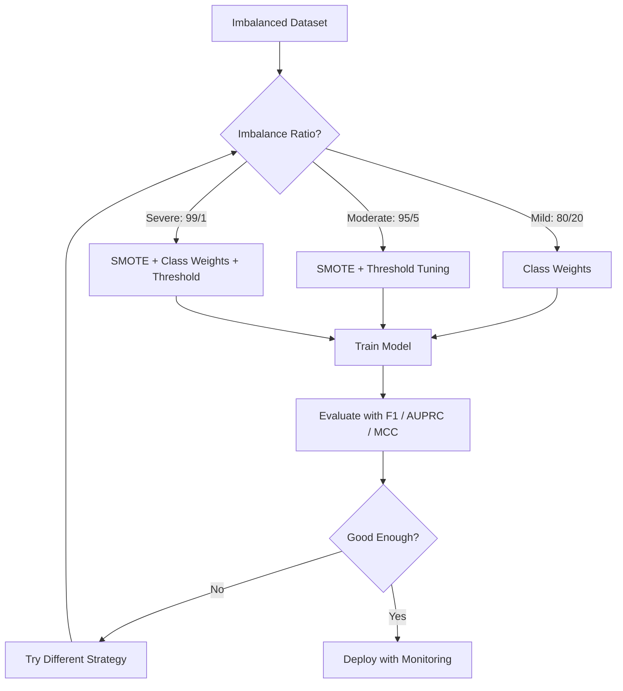
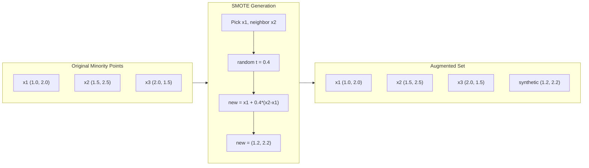
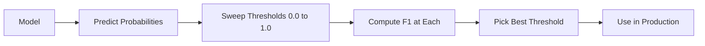
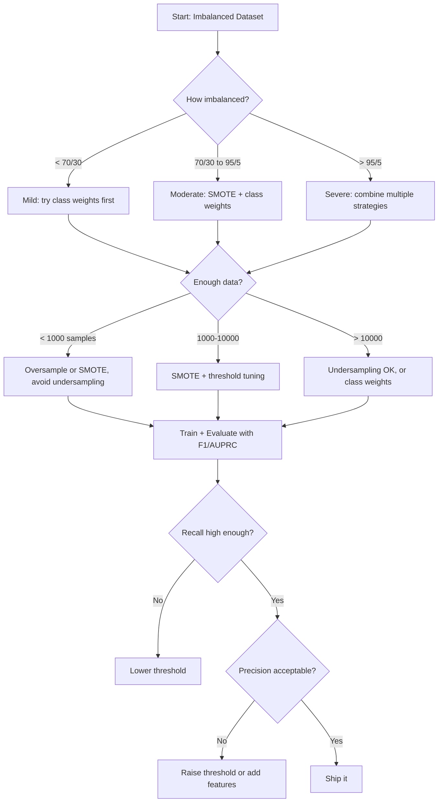

# 处理不平衡的数据

> 当99%的数据是"正常的",准确性是谎言.

**Type:** Build
**Language:**字符串
**Prerequisites:** Phase 2, Lessons 01-09 (especially evaluation metrics)
**Time:** ~90 minutes

## 学习目标

- 从零开始实施SMOTE,并解释合成过量样本采集与随机复制如何不同
- 评估不平衡分类器使用F1,AUPRC和马修斯相关系数而不是准确性
- 进行类权重,门调整和重新样本策略的比较,并选择对给定的失衡比率的正确方法
- 构建一个完整的不平衡数据管道,结合SMOTE,类重量和门优化

## 问题

你建立一个欺诈检测模型,它得到99.9%的准确性,你庆祝,然后你意识到它预测"不欺诈"每一个交易.

只有0.1%的交易是欺诈性的.模型学会了总是猜测多数类最小化总体错误.这技术上是正确的,完全无用的.

网络入侵率:0.01%攻击.制造业缺陷:0.5%缺陷.垃圾邮件过率:20%垃圾邮件. 缩预测:5%缩.少数群体的影响力越高,它往往越少.

准确性失败,因为它对待所有正确的预测均等.正确标记合法的交易和正确捕获欺诈都是一个准确性点.但捕获欺诈是模型存在的全部原因.我们需要指标,技术和培训策略,迫使模型注意罕见但重要的类别.

## 概念

### 为什么准确性失败

考虑一个数据集,有1000个样本:990个负,10个正.一个模型总是预测负:

|  | Predicted Positive | Predicted Negative |
|--|---|---|
| Actually Positive | 0 (TP) | 10 (FN) |
| Actually Negative | 0 (FP) | 990 (TN) |

精度 = (0 + 990) / 1000 = 99.0%

模型没有欺诈,没有疾病,没有缺陷,但精确度是99%.

### 更好的指标

**Precision**值得注意的是,在每一个电路上,每一个电路上,每一个电路上,每一个电路上,每一个电路上,每一个电路上,每一个电路上,每一个电路上,每一个电路上,每一个电路上,每一个电路上,每一个电路上,每一个电路上,每一个电路上,每一个电路上,每一个电路上,每一个电路上,每一个电路上,每一个电路上,每一个电路上,每一个电路上,每一个电路上,每一个电路上,每一个电路上,每一个电路上,每一个电路上,每一个电路上,每一个电路上,每一个电路上,每一个电路上,每一个电路上,每一个电路上,每一个电路上,每一个电路上,每一个电路上,每一个电路上,每一个电路上,每一个电路上,每一个电路上,每一个电路上,每一个电路上,每一个电路上,每一个电路上,每一个电路上,每一个电路上,每一个电路上,每一个电路上,每一个电路上,每一个电路上,每一个电路上,每一个电路上.

**Recall**现在,我们已经发现了多少个正确的结果?

**F1 Score**准度和回忆之间的极端不平衡比算术平均更严重.

**F-beta Score**精度 (F2) 在欺诈检测中很常见 (错失欺诈比虚假报警更糟).

**AUPRC**(精度回忆曲线下的区域).类似于AUC-ROC,但对于不平衡数据来说更有信息性.随机分类器具有AUPRC等于正分类率 (而不是0.5像ROC).这使得改善更容易看到.

**Matthews Correlation Coefficient**= (TP * TN - FP * FN) / sqrt((TP+FP)(TP+FN)(TN+FP)(TN+FN)).从 -1 到 +1. 只会给出高分,当模型在两个类中表现得很好时.即使类的尺寸非常不同时,也会平衡.

对于上述"总是预测负"模型:精度=0/0 (未定义,通常设置为0),回忆 =0/10 = 0,F1 = 0,MCC = 0. 这些指标正确地确定模型是无价值的.

### 失衡数据管道



### 综合少数民族过量样本技术

随机过量样本复制现有少数样本. 这有效,但风险过度匹配,因为模型会多次看到相同的点.

通过SMOTE创建新的合成少数样本,这些样本是可行的,但不是副本.

1. 对于每个少数群体样本x,在其他少数群体样本中,找到其最近邻居的 k
2. 随机选择一个邻居
3. 在 x 与邻居之间的线段上创建一个新的样本

公式:`new_sample = x + random(0, 1) * (neighbor - x)`

这种方法是对实际少数点进行间接的, 创造样本在同一区域的特征空间,而不仅仅是复制现有数据.



### 采样策略的比较

**Random Oversampling**复制少数群体样本以匹配多数群体数量.
- 优点:简单,没有信息丢失
- 缺点:精确复制导致过度适应,增加了训练时间

**Random Undersampling**取消多数样本,以匹配少数人数.
- 优势:快速训练,简单
- 缺点:丢弃潜在有用的多数数据,更高的差异性

**SMOTE**通过插射,创造合成少数群体样本.
- 优点:生成新的数据点,减少随机过度采样相比过度匹配
- 缺点:可以在决策边界附近产生噪音样本,不考虑多数类分布

| Strategy | Data Changed | Risk | When to Use |
|----------|-------------|------|-------------|
| Oversample | Minority duplicated | Overfitting | Small datasets, moderate imbalance |
| Undersample | Majority removed | Information loss | Large datasets, want fast training |
| SMOTE | Synthetic minority added | Boundary noise | Moderate imbalance, enough minority samples for k-NN |

### 类型的重量

换取数据,更改模型处理错误的方式. 赋予更高的重量错误分类少数类.

对于950负样本和50正样本的二进制问题:
- 负类的重量 = n_samples / (2 * n_negative) = 1000 / (2 * 950) = 0.526
- 积极类的重量 = n_样本 / (2 * n_积极) = 1000 / (2 * 50) = 10.0

正面类型的重量是19倍.错误分类一个正面样本的成本是错误分类19个负面样本.模型被迫注意少数类型.

在物流回归中,这改变了损失函数:

```
weighted_loss = -sum(w_i * [y_i * log(p_i) + (1-y_i) * log(1-p_i)])
```

在哪里 w_i 取决于样本 i 的类型.

类重量在数学上相当于预期过度样本,但没有创造新的数据点. 这使它们更快,避免了重复样本过度合适的风险.

### 值调整

大多数分类器输出一个概率.默认门为0.5:如果P ((正) >=0.5,预测正.但0.5是任意的.当类是不平衡时,最佳门通常要低得多.

过程:
1. 训练一个模型
2. 在验证集中得到预测概率
3. 扫描门从0到1.0
4. 在每一个门时计算F1 (或您选择的指标)
5. 选择最大化你的标准值



模型可能输出 P ((欺诈) = 0.15 对欺诈交易.在0.5的门上,这个值被归类为不是欺诈.在0.10的门上,它被正确捕获.概率校准比排名更不重要 - 只要欺诈比非欺诈更高的概率,就有一个分离它们的门.

### 低成本的学习

类重量概括. 代替统一成本,分配特定的错误分类成本:

| | Predict Positive | Predict Negative |
|--|---|---|
| Actually Positive | 0 (correct) | C_FN = 100 |
| Actually Negative | C_FP = 1 | 0 (correct) |

错过欺诈交易 (FN) 的成本高于虚假报警 (FP) 的100倍. 该模型优化了总成本,而不是总错误数量.

没有发现癌症的确诊,与假报警,导致额外的生物检查,产生了非常不同的成本.

### 决策流程图



```figure
class-imbalance
```

## 建立它

### 步骤1:生成一个不平衡的数据集

```python
import numpy as np


def make_imbalanced_data(n_majority=950, n_minority=50, seed=42):
    rng = np.random.RandomState(seed)

    X_maj = rng.randn(n_majority, 2) * 1.0 + np.array([0.0, 0.0])
    X_min = rng.randn(n_minority, 2) * 0.8 + np.array([2.5, 2.5])

    X = np.vstack([X_maj, X_min])
    y = np.concatenate([np.zeros(n_majority), np.ones(n_minority)])

    shuffle_idx = rng.permutation(len(y))
    return X[shuffle_idx], y[shuffle_idx]
```

### 步骤2:从零开始

```python
def euclidean_distance(a, b):
    return np.sqrt(np.sum((a - b) ** 2))


def find_k_neighbors(X, idx, k):
    distances = []
    for i in range(len(X)):
        if i == idx:
            continue
        d = euclidean_distance(X[idx], X[i])
        distances.append((i, d))
    distances.sort(key=lambda x: x[1])
    return [d[0] for d in distances[:k]]


def smote(X_minority, k=5, n_synthetic=100, seed=42):
    rng = np.random.RandomState(seed)
    n_samples = len(X_minority)
    k = min(k, n_samples - 1)
    synthetic = []

    for _ in range(n_synthetic):
        idx = rng.randint(0, n_samples)
        neighbors = find_k_neighbors(X_minority, idx, k)
        neighbor_idx = neighbors[rng.randint(0, len(neighbors))]
        t = rng.random()
        new_point = X_minority[idx] + t * (X_minority[neighbor_idx] - X_minority[idx])
        synthetic.append(new_point)

    return np.array(synthetic)
```

### 步骤3:随机过量样本和下样本

```python
def random_oversample(X, y, seed=42):
    rng = np.random.RandomState(seed)
    classes, counts = np.unique(y, return_counts=True)
    max_count = counts.max()

    X_resampled = list(X)
    y_resampled = list(y)

    for cls, count in zip(classes, counts):
        if count < max_count:
            cls_indices = np.where(y == cls)[0]
            n_needed = max_count - count
            chosen = rng.choice(cls_indices, size=n_needed, replace=True)
            X_resampled.extend(X[chosen])
            y_resampled.extend(y[chosen])

    X_out = np.array(X_resampled)
    y_out = np.array(y_resampled)
    shuffle = rng.permutation(len(y_out))
    return X_out[shuffle], y_out[shuffle]


def random_undersample(X, y, seed=42):
    rng = np.random.RandomState(seed)
    classes, counts = np.unique(y, return_counts=True)
    min_count = counts.min()

    X_resampled = []
    y_resampled = []

    for cls in classes:
        cls_indices = np.where(y == cls)[0]
        chosen = rng.choice(cls_indices, size=min_count, replace=False)
        X_resampled.extend(X[chosen])
        y_resampled.extend(y[chosen])

    X_out = np.array(X_resampled)
    y_out = np.array(y_resampled)
    shuffle = rng.permutation(len(y_out))
    return X_out[shuffle], y_out[shuffle]
```

### 阶段4:与类权重的物流回归

```python
def sigmoid(z):
    return 1.0 / (1.0 + np.exp(-np.clip(z, -500, 500)))


def logistic_regression_weighted(X, y, weights, lr=0.01, epochs=200):
    n_samples, n_features = X.shape
    w = np.zeros(n_features)
    b = 0.0

    for _ in range(epochs):
        z = X @ w + b
        pred = sigmoid(z)
        error = pred - y
        weighted_error = error * weights

        gradient_w = (X.T @ weighted_error) / n_samples
        gradient_b = np.mean(weighted_error)

        w -= lr * gradient_w
        b -= lr * gradient_b

    return w, b


def compute_class_weights(y):
    classes, counts = np.unique(y, return_counts=True)
    n_samples = len(y)
    n_classes = len(classes)
    weight_map = {}
    for cls, count in zip(classes, counts):
        weight_map[cls] = n_samples / (n_classes * count)
    return np.array([weight_map[yi] for yi in y])
```

### 步骤5:调整门

```python
def find_optimal_threshold(y_true, y_probs, metric="f1"):
    best_threshold = 0.5
    best_score = -1.0

    for threshold in np.arange(0.05, 0.96, 0.01):
        y_pred = (y_probs >= threshold).astype(int)
        tp = np.sum((y_pred == 1) & (y_true == 1))
        fp = np.sum((y_pred == 1) & (y_true == 0))
        fn = np.sum((y_pred == 0) & (y_true == 1))

        if metric == "f1":
            precision = tp / (tp + fp) if (tp + fp) > 0 else 0.0
            recall = tp / (tp + fn) if (tp + fn) > 0 else 0.0
            score = 2 * precision * recall / (precision + recall) if (precision + recall) > 0 else 0.0
        elif metric == "recall":
            score = tp / (tp + fn) if (tp + fn) > 0 else 0.0
        elif metric == "precision":
            score = tp / (tp + fp) if (tp + fp) > 0 else 0.0

        if score > best_score:
            best_score = score
            best_threshold = threshold

    return best_threshold, best_score
```

### 步骤 6: 评估功能

```python
def confusion_matrix_values(y_true, y_pred):
    tp = np.sum((y_pred == 1) & (y_true == 1))
    tn = np.sum((y_pred == 0) & (y_true == 0))
    fp = np.sum((y_pred == 1) & (y_true == 0))
    fn = np.sum((y_pred == 0) & (y_true == 1))
    return tp, tn, fp, fn


def compute_metrics(y_true, y_pred):
    tp, tn, fp, fn = confusion_matrix_values(y_true, y_pred)
    accuracy = (tp + tn) / (tp + tn + fp + fn)
    precision = tp / (tp + fp) if (tp + fp) > 0 else 0.0
    recall = tp / (tp + fn) if (tp + fn) > 0 else 0.0
    f1 = 2 * precision * recall / (precision + recall) if (precision + recall) > 0 else 0.0

    denom = np.sqrt(float((tp + fp) * (tp + fn) * (tn + fp) * (tn + fn)))
    mcc = (tp * tn - fp * fn) / denom if denom > 0 else 0.0

    return {
        "accuracy": accuracy,
        "precision": precision,
        "recall": recall,
        "f1": f1,
        "mcc": mcc,
    }
```

### 步骤7:将所有方法进行比较

```python
X, y = make_imbalanced_data(950, 50, seed=42)
split = int(0.8 * len(y))
X_train, X_test = X[:split], X[split:]
y_train, y_test = y[:split], y[split:]

# Baseline: no treatment
w_base, b_base = logistic_regression_weighted(
    X_train, y_train, np.ones(len(y_train)), lr=0.1, epochs=300
)
probs_base = sigmoid(X_test @ w_base + b_base)
preds_base = (probs_base >= 0.5).astype(int)

# Oversampled
X_over, y_over = random_oversample(X_train, y_train)
w_over, b_over = logistic_regression_weighted(
    X_over, y_over, np.ones(len(y_over)), lr=0.1, epochs=300
)
preds_over = (sigmoid(X_test @ w_over + b_over) >= 0.5).astype(int)

# SMOTE
minority_mask = y_train == 1
X_minority = X_train[minority_mask]
synthetic = smote(X_minority, k=5, n_synthetic=len(y_train) - 2 * int(minority_mask.sum()))
X_smote = np.vstack([X_train, synthetic])
y_smote = np.concatenate([y_train, np.ones(len(synthetic))])
w_sm, b_sm = logistic_regression_weighted(
    X_smote, y_smote, np.ones(len(y_smote)), lr=0.1, epochs=300
)
preds_smote = (sigmoid(X_test @ w_sm + b_sm) >= 0.5).astype(int)

# Class weights
sample_weights = compute_class_weights(y_train)
w_cw, b_cw = logistic_regression_weighted(
    X_train, y_train, sample_weights, lr=0.1, epochs=300
)
probs_cw = sigmoid(X_test @ w_cw + b_cw)
preds_cw = (probs_cw >= 0.5).astype(int)

# Threshold tuning (tune on held-out validation set, not test set)
probs_val = sigmoid(X_val @ w_cw + b_cw)
best_thresh, best_f1 = find_optimal_threshold(y_val, probs_val, metric="f1")
preds_thresh = (probs_cw >= best_thresh).astype(int)
```

代码文件将所有这些运行在一个脚本中,

## 用它

通过学习和不平衡学习,这些技术是单行:

```python
from sklearn.linear_model import LogisticRegression
from sklearn.metrics import classification_report, f1_score
from sklearn.model_selection import train_test_split
from imblearn.over_sampling import SMOTE
from imblearn.under_sampling import RandomUnderSampler
from imblearn.pipeline import Pipeline

X_train, X_test, y_train, y_test = train_test_split(X, y, stratify=y)

model_weighted = LogisticRegression(class_weight="balanced")
model_weighted.fit(X_train, y_train)
print(classification_report(y_test, model_weighted.predict(X_test)))

smote = SMOTE(random_state=42)
X_resampled, y_resampled = smote.fit_resample(X_train, y_train)
model_smote = LogisticRegression()
model_smote.fit(X_resampled, y_resampled)
print(classification_report(y_test, model_smote.predict(X_test)))

pipeline = Pipeline([
    ("smote", SMOTE()),
    ("model", LogisticRegression(class_weight="balanced")),
])
pipeline.fit(X_train, y_train)
print(classification_report(y_test, pipeline.predict(X_test)))
```

首先,我们可以看到一个小组的数量,然后我们可以看到一个小组的数量.

## 运送它

这一课产生了:
- `outputs/skill-imbalanced-data.md`-- 处理不平衡分类问题的决策检查清单

## 运动

1. **Borderline-SMOTE**通过修改SMOTE实现,只能生成接近决策边界的少数点的合成样本 (其中 k-近邻包括多数类样本).

2. **Cost matrix optimization**运用成本对比矩阵为参数的成本敏感学习.创建一个取成本矩阵的函数,返回最大的预测,以最大限度地降低预期成本.使用不同的成本比率 (1:10, 1:100, 1:1000) 测试,并绘制精度召回权衡如何变化.

3. **Threshold calibration**实现平板规模化 (将模型原始输出进行物流回归,以产生校准概率). 在校准之前和之后进行精度召回曲线的比较. 显示校准不会改变排名 (AUC保持不变),而是使概率变得更有意义.

4. **Ensemble with balanced bagging**训练多个模型,每个模型都基于均衡的启动样本 (所有少数+多数的随机子集).平均他们的预测.与单个模型进行比较.测量运行中的性能和差异.

5. **Imbalance ratio experiment**对于每一个比率,训练与与没有SMOTE. 剧情 F1对两个方法的不平衡比率. 在哪个比率上,SMOTE开始产生有意义的差异?

## 关键词

| Term | What people say | What it actually means |
|------|----------------|----------------------|
| Class imbalance | "One class has way more samples" | The distribution of classes in the dataset is significantly skewed, causing models to favor the majority class |
| SMOTE | "Synthetic oversampling" | Creates new minority samples by interpolating between existing minority samples and their k-nearest minority neighbors |
| Class weights | "Making errors on rare classes more expensive" | Multiplying the loss function by class-specific weights so the model penalizes minority misclassification more heavily |
| Threshold tuning | "Moving the decision boundary" | Changing the probability cutoff for classification from the default 0.5 to a value that optimizes the desired metric |
| Precision-recall tradeoff | "You cannot have both" | Lowering the threshold catches more positives (higher recall) but also flags more false positives (lower precision), and vice versa |
| AUPRC | "Area under the PR curve" | Summarizes the precision-recall curve into a single number; more informative than AUC-ROC when classes are heavily imbalanced |
| Matthews Correlation Coefficient | "The balanced metric" | A correlation between predicted and actual labels that produces a high score only when the model performs well on both classes |
| Cost-sensitive learning | "Different mistakes cost different amounts" | Incorporating real-world misclassification costs into the training objective so the model optimizes for total cost, not error count |
| Random oversampling | "Duplicate the minority" | Repeating minority class samples to balance class counts; simple but risks overfitting to duplicated points |

## 进一步阅读

- [SMOTE: Synthetic Minority Over-sampling Technique (Chawla et al., 2002)](https://arxiv.org/abs/1106.1813)--原始的SMOTE论文,仍然是最受引用的不平衡学习论文
- [Learning from Imbalanced Data (He & Garcia, 2009)](https://ieeexplore.ieee.org/document/5128907)综合调查包括采样,成本敏感和算法方法
- [imbalanced-learn documentation](https://imbalanced-learn.org/stable/)-- 配备SMOTE变体,低样本策略和管道集成的Python库
- [The Precision-Recall Plot Is More Informative than the ROC Plot (Saito & Rehmsmeier, 2015)](https://journals.plos.org/plosone/article?id=10.1371/journal.pone.0118432)-- 什么时候和为什么要偏好 PR 曲线而不是 ROC 曲线,以解决不平衡问题
