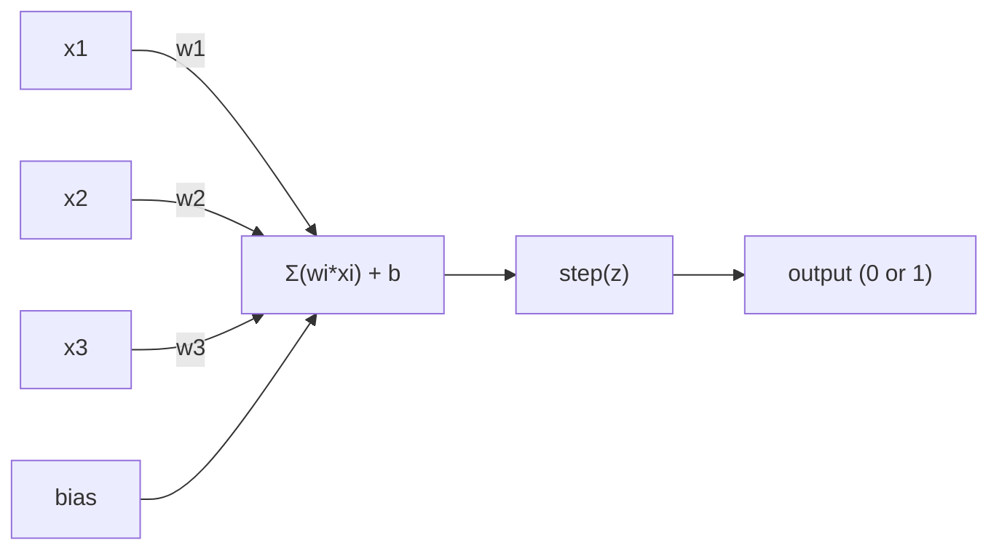
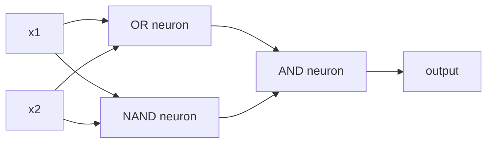

# 感觉器

> 感知器是神经网络的原子. 打开它,你会发现重量,偏见和决定.

**Type:** Build
**Languages:** Python
**Prerequisites:** Phase 1 (Linear Algebra Intuition)
**Time:** ~60 minutes

## 学习目标

- 在Python中从零开始实现一个 perceptron,包括重量更新规则和步骤激活函数
- 解释为什么一个 perceptron 只有解决线性分离的问题,并证明XOR故障案例
- 通过组合OR,NAND和AND门来构建一个多层的感知器来解决XOR
- 训练一个双层网络,使用sigmoid激活和反扩散,自动学习XOR

## 问题

你知道向量和点点产品.你知道一个矩阵将输入转化为输出.但是,机器如何学习使用哪种转化?

感知器回答了这个问题. 它是最简单的学习机器: 取一些输入,乘以重量,添加偏见,做出二进制决定. 然后调整.就这样了.

了解感知意味着理解"学习"在代码中实际上意味着什么:调整数字,直到输出匹配现实.

## 概念

### 一个神经元,一个决定

一个感知器采用n输入,乘以重量,总结它们,添加偏差,并通过激活函数传递结果.



步骤函数是残酷的:如果加重总和加偏差是 >= 0,输出 1.否则输出 0.

```
step(z) = 1  if z >= 0
           0  if z < 0
```

这是一个线性分类器. 重量和偏差定义了一个线 (或更高的维度中的超平面) 将输入空间分为两个区域.

### 决策的界限

对于两个输入,感知器通过2D空间绘制了一条线:

```
  x2
  ┤
  │  Class 1        /
  │    (0)          /
  │                /
  │               / w1·x1 + w2·x2 + b = 0
  │              /
  │             /     Class 2
  │            /        (1)
  ┼───────────/──────────── x1
```

训练将这个线路移动,直到它正确地分离了类.

### 学习规则

感知学规则很简单:

```
For each training example (x, y_true):
    y_pred = predict(x)
    error = y_true - y_pred

    For each weight:
        w_i = w_i + learning_rate * error * x_i
    bias = bias + learning_rate * error
```

如果预测是正确的,错误=0,没有什么改变.如果预测是0但应该是1,重量增加.如果预测是1但应该是0,重量减少.学习率控制每个调整的规模.

### 关于XOR问题

这里是它破裂的地方.

```
AND gate:           OR gate:            XOR gate:
x1  x2  out         x1  x2  out         x1  x2  out
0   0   0           0   0   0           0   0   0
0   1   0           0   1   1           0   1   1
1   0   0           1   0   1           1   0   1
1   1   1           1   1   1           1   1   0
```

 AND 和 OR 是线性分离的:你可以绘制一个单行来分离0s和1s. XOR不是.没有单行可以分离 [0,1]和 [1,0]和 [0,0]和 [1,1].

```
AND (separable):        XOR (not separable):

  x2                      x2
  1 ┤  0     1            1 ┤  1     0
    │     /                 │
  0 ┤  0 / 0              0 ┤  0     1
    ┼──/──────── x1         ┼──────────── x1
       line works!          no single line works!
```

只有一个单个感知器才能解决线性分离的问题. 敏斯基和帕珀特在1969年证明了这一点,这几乎杀死了十年的神经网络研究.

解决方案:将感知子堆叠成层. 一个多层感知子可以通过将两个线性决定结合成一个非线性来解决XOR.

```figure
perceptron-boundary
```

## 建立它

### 步骤1: 佩尔塞普特龙类

```python
class Perceptron:
    def __init__(self, n_inputs, learning_rate=0.1):
        self.weights = [0.0] * n_inputs
        self.bias = 0.0
        self.lr = learning_rate

    def predict(self, inputs):
        total = sum(w * x for w, x in zip(self.weights, inputs))
        total += self.bias
        return 1 if total >= 0 else 0

    def train(self, training_data, epochs=100):
        for epoch in range(epochs):
            errors = 0
            for inputs, target in training_data:
                prediction = self.predict(inputs)
                error = target - prediction
                if error != 0:
                    errors += 1
                    for i in range(len(self.weights)):
                        self.weights[i] += self.lr * error * inputs[i]
                    self.bias += self.lr * error
            if errors == 0:
                print(f"Converged at epoch {epoch + 1}")
                return
        print(f"Did not converge after {epochs} epochs")
```

### 步骤2:训练逻辑门

```python
and_data = [
    ([0, 0], 0),
    ([0, 1], 0),
    ([1, 0], 0),
    ([1, 1], 1),
]

or_data = [
    ([0, 0], 0),
    ([0, 1], 1),
    ([1, 0], 1),
    ([1, 1], 1),
]

not_data = [
    ([0], 1),
    ([1], 0),
]

print("=== AND Gate ===")
p_and = Perceptron(2)
p_and.train(and_data)
for inputs, _ in and_data:
    print(f"  {inputs} -> {p_and.predict(inputs)}")

print("\n=== OR Gate ===")
p_or = Perceptron(2)
p_or.train(or_data)
for inputs, _ in or_data:
    print(f"  {inputs} -> {p_or.predict(inputs)}")

print("\n=== NOT Gate ===")
p_not = Perceptron(1)
p_not.train(not_data)
for inputs, _ in not_data:
    print(f"  {inputs} -> {p_not.predict(inputs)}")
```

### 步骤3: 观察XOR失败

```python
xor_data = [
    ([0, 0], 0),
    ([0, 1], 1),
    ([1, 0], 1),
    ([1, 1], 0),
]

print("\n=== XOR Gate (single perceptron) ===")
p_xor = Perceptron(2)
p_xor.train(xor_data, epochs=1000)
for inputs, expected in xor_data:
    result = p_xor.predict(inputs)
    status = "OK" if result == expected else "WRONG"
    print(f"  {inputs} -> {result} (expected {expected}) {status}")
```

这证明一个单个感知器不能学习XOR.

### 步骤 4:用两个层解决XOR

技巧是:XOR= (x1 OR x2) 并不是 (x1 AND x2). 结合三个感知光:



```python
def xor_network(x1, x2):
    or_neuron = Perceptron(2)
    or_neuron.weights = [1.0, 1.0]
    or_neuron.bias = -0.5

    nand_neuron = Perceptron(2)
    nand_neuron.weights = [-1.0, -1.0]
    nand_neuron.bias = 1.5

    and_neuron = Perceptron(2)
    and_neuron.weights = [1.0, 1.0]
    and_neuron.bias = -1.5

    hidden1 = or_neuron.predict([x1, x2])
    hidden2 = nand_neuron.predict([x1, x2])
    output = and_neuron.predict([hidden1, hidden2])
    return output


print("\n=== XOR Gate (multi-layer network) ===")
for inputs, expected in xor_data:
    result = xor_network(inputs[0], inputs[1])
    print(f"  {inputs} -> {result} (expected {expected})")
```

积感知子在层层中创造出决策界限,

### 步骤5:培养两层网络

步骤4是手动连接权重.这对XOR而言是有效的,但不是对真正的问题,你不能提前知道正确的权重.解决办法:用sigmoid取代步骤函数,通过后延伸自动学习权重.

```python
class TwoLayerNetwork:
    def __init__(self, learning_rate=0.5):
        import random
        random.seed(0)
        self.w_hidden = [[random.uniform(-1, 1), random.uniform(-1, 1)] for _ in range(2)]
        self.b_hidden = [random.uniform(-1, 1), random.uniform(-1, 1)]
        self.w_output = [random.uniform(-1, 1), random.uniform(-1, 1)]
        self.b_output = random.uniform(-1, 1)
        self.lr = learning_rate

    def sigmoid(self, x):
        import math
        x = max(-500, min(500, x))
        return 1.0 / (1.0 + math.exp(-x))

    def forward(self, inputs):
        self.inputs = inputs
        self.hidden_outputs = []
        for i in range(2):
            z = sum(w * x for w, x in zip(self.w_hidden[i], inputs)) + self.b_hidden[i]
            self.hidden_outputs.append(self.sigmoid(z))
        z_out = sum(w * h for w, h in zip(self.w_output, self.hidden_outputs)) + self.b_output
        self.output = self.sigmoid(z_out)
        return self.output

    def train(self, training_data, epochs=10000):
        for epoch in range(epochs):
            total_error = 0
            for inputs, target in training_data:
                output = self.forward(inputs)
                error = target - output
                total_error += error ** 2

                d_output = error * output * (1 - output)

                saved_w_output = self.w_output[:]
                hidden_deltas = []
                for i in range(2):
                    h = self.hidden_outputs[i]
                    hd = d_output * saved_w_output[i] * h * (1 - h)
                    hidden_deltas.append(hd)

                for i in range(2):
                    self.w_output[i] += self.lr * d_output * self.hidden_outputs[i]
                self.b_output += self.lr * d_output

                for i in range(2):
                    for j in range(len(inputs)):
                        self.w_hidden[i][j] += self.lr * hidden_deltas[i] * inputs[j]
                    self.b_hidden[i] += self.lr * hidden_deltas[i]
```

```python
net = TwoLayerNetwork(learning_rate=2.0)
net.train(xor_data, epochs=10000)
for inputs, expected in xor_data:
    result = net.forward(inputs)
    predicted = 1 if result >= 0.5 else 0
    print(f"  {inputs} -> {result:.4f} (rounded: {predicted}, expected {expected})")
```

首先,sigmoid取代了步骤函数,它是光滑的,所以梯度存在.`train`通过这种方法,输出到隐藏层的错误会向后传播,调整每个重量以其对错误的贡献比例.

这就是第3课的桥梁.`d_output`其他`hidden_deltas`我们将把它从这个线程中得到.

## 用它

你从零开始的东西都存在于一个进口:

```python
from sklearn.linear_model import Perceptron as SkPerceptron
import numpy as np

X = np.array([[0,0],[0,1],[1,0],[1,1]])
y = np.array([0, 0, 0, 1])

clf = SkPerceptron(max_iter=100, tol=1e-3)
clf.fit(X, y)
print([clf.predict([x])[0] for x in X])
```

五行,你的30行.`Perceptron`并且,在Sklern版本中,我们可以看到一个类的重量,

实际的差距在规模上显现.

- 步骤函数变成sigmoid,ReLU或其他流的激活
- 通过反向扩散自动学习重量 (课3)
- 层变得更深: 3, 10, 100+层
- 根据此,每一个层都会从前一个层的输出中创造新的特性.

一个感知器只能画直线,堆叠它们,你可以画任何形状.

## 运送它

这一课产生了:
- `outputs/skill-perceptron.md`- 需要单层与多层架构时,

## 运动

1. 训练一个感知器在NAND门 (通用门 - - 任何逻辑电路都可以从NAND构建).验证其重量和偏差形成有效的决策界限.
2. 修改Perceptron类,以追踪每个时代的决策边界 (w1*x1 + w2*x2 + b = 0).在 AND 门上打印训练过程中线路的转移.
3. 构建一个3输入感知器,只有当至少3输入中的2个是1 (多数投票函数) 时才能输出1.这是否线性分离的?为什么?

## 关键词

| Term | What people say | What it actually means |
|------|----------------|----------------------|
| Perceptron | "A fake neuron" | A linear classifier: dot product of inputs and weights, plus bias, through a step function |
| Weight | "How important an input is" | A multiplier that scales each input's contribution to the decision |
| Bias | "The threshold" | A constant that shifts the decision boundary, letting the perceptron fire even with zero inputs |
| Activation function | "The thing that squishes values" | A function applied after the weighted sum - step function for perceptrons, sigmoid/ReLU for modern networks |
| Linearly separable | "You can draw a line between them" | A dataset where a single hyperplane can perfectly separate the classes |
| XOR problem | "The thing perceptrons can't do" | Proof that single-layer networks cannot learn non-linearly-separable functions |
| Decision boundary | "Where the classifier switches" | The hyperplane w*x + b = 0 that divides input space into two classes |
| Multi-layer perceptron | "A real neural network" | Perceptrons stacked in layers, where each layer's output feeds the next layer's input |

## 进一步阅读

- 弗兰克·罗森布拉特,"感知器:大脑信息存储和组织的概率模型" (1958) -- 首先开始的论文
- 敏斯基和帕珀特"感知器" (1969) - - 证明XOR是单层网络无法解决的书,并杀死了感知器研究十年
- 迈克尔·尼尔森"神经网络和深度学习"第1章 (http://neuralnetworksanddeeplearning.com/) --免费在线,最好的视觉解释如何构成网络的感知器
