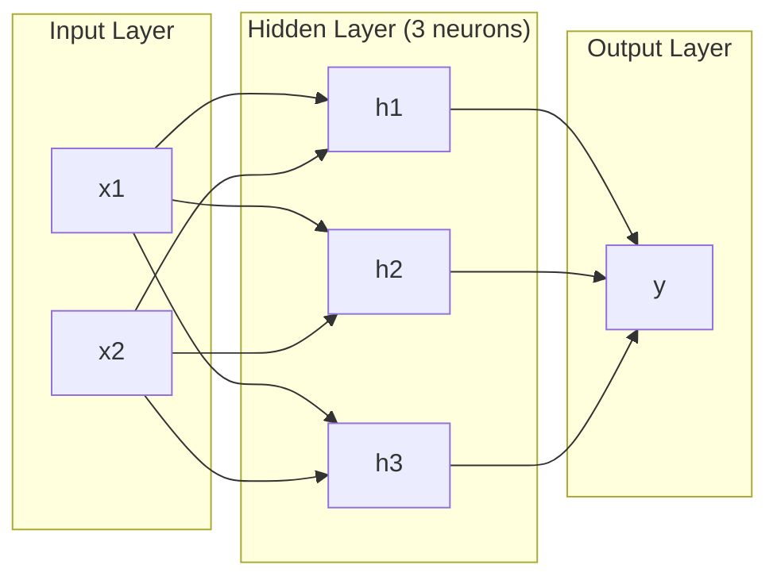
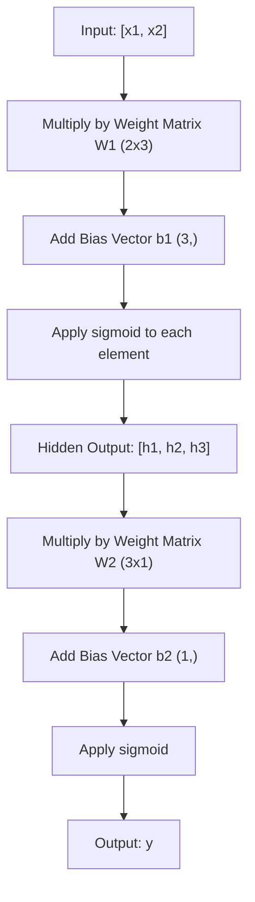
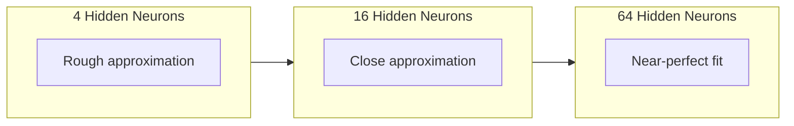

# 多层网络和前行通行

> 一个神经元画出一个线,堆叠它们,你可以画任何东西.

**Type:** Build
**Languages:** Python
**Prerequisites:** Phase 01 (Math Foundations), Lesson 03.01 (The Perceptron)
**Time:** ~90 minutes

## 学习目标

- 创建一个多层网络从零开始,使用一个完整的前进传输的层和网络类
- 通过网络的每个层进行跟踪矩阵尺寸,并确定形状不匹配
- 解释如何堆叠非线性激活使网络能够学习曲线决策界限
- 使用手调sigmoid权重的2-2-1架构解决XOR问题

## 问题

一个神经元就是一个线条抽.就这样. 一条直线通过数据.人工智能的每一个真正的问题 - - 识别图像,语言理解,玩GO - - 都需要曲线.

1969年,明斯基和帕珀特证明了这种限制是致命的:单层网络不能学习XOR.不是"努力学习" - - 数学上不能.XOR真相表在一边放置[0,1]和[1,0],在另一边放置[0,0]和[1,1].没有单一线分离它们.

这导致了超过十年的神经网络资金被削减. 后来看,解决方案很明显:停止使用一个层. 堆叠神经元成层. 让第一层将输入空间切割成新功能,让第二层将这些功能结合成决策,没有单一线可以做出的.

这堆是多层网络.它是今天生产的每一个深度学习模型的基础.前进传输 - - 从输入到输出的数据从隐藏层流到输出 - - 是你需要建立的第一件事,

## 概念

### 层:输入,隐藏,输出

多层网络有三个层:

**Input layer**两个功能意味着两个输入节点.这里没有计算.

**Hidden layers**每个神经元从前层中取出每一个输出,应用重量和偏差,然后通过激活函数传递结果. "隐藏",因为你从来没有直接看到这些值在训练数据中.

**Output layer**对于二进制分类,一个神经元与sigmoid.对于多类,一个神经元每个类.



这是一个2-3-1网络.两个输入,三个隐藏的神经元,一个输出.每个连接都带有重量.每个神经元 (除输入) 都带有偏见.

每层都产生一个数字向量,称为隐藏状态.对于文本来说,隐藏状态增加了维度 - - 编码一个词为768个数字来捕捉语义意义.对于图像来说,它们减少了维度 - - 压缩了数百万像素成为可管理的表示.隐藏状态是学习生活的地方.

### 神经元和激活

每个神经元都能做三个事情:

1. 乘以其相应的重量
2. 总结所有产品,并添加一个偏见
3. 通过激活函数传递总数

现在,激活是sigmoid:

```
sigmoid(z) = 1 / (1 + e^(-z))
```

sigmoid将任何数量压缩到范围 (0,1). 大量的正进口向1推进. 大量的负进口向0推进.零地图到0.5. 这种光滑的曲线是使学习成为可能的 - - 与感知器的硬步骤不同,sigmoid在任何地方都有梯度.

### 往前通行:数据流动方式

进口传输通过网络,层次推进输入数据,直到它达到输出.进口传输过程中没有学习发生.这是纯计算:乘以,添加,激活,重复.



在每个层次上,有三个操作发生:

```
z = W * input + b       (linear transformation)
a = sigmoid(z)           (activation)
```

一层输出成为下一个层输入.

### 矩阵尺寸

追踪维度是深度学习中最重要的调试技能.

| Step | Operation | Dimensions | Result Shape |
|------|-----------|------------|-------------|
| Input | x | -- | (2,) |
| Hidden linear | W1 * x + b1 | W1: (3, 2), b1: (3,) | (3,) |
| Hidden activation | sigmoid(z1) | -- | (3,) |
| Output linear | W2 * h + b2 | W2: (1, 3), b2: (1,) | (1,) |
| Output activation | sigmoid(z2) | -- | (1,) |

规则:在层 k 的重量矩阵 W 有形状 (神经元_in_layer_k,神经元_in_layer_k_minus_1). 排列与当前层匹配.列表与前层匹配.如果形状不排列,则你有错误.

### 全球近似定理

1989年,乔治·赛本科证明了一些非凡的东西:一个隐藏的单层和足够的神经元的神经网络可以接近任何连续的功能,

这并不意味着一个隐藏的层面总是最好.这意味着架构理论上是有能力的.实际上,更深层的网络 (每个层有更多层次,每个层有更少的神经元) 与浅层网络相比学习的总参数要少得多.这就是为什么深层学习工作的原因.

感觉:隐藏的每个神经元都学会了一个""或特征. 足够的放在正确的地方可以接近任何平滑的曲线.更多的神经元,更多的,更好的接近.



### 复合性

网络可以组合.你可以堆叠它们,链接它们,并行它们.一个Whisper模型使用编码网络来处理音频,并使用单独的编码网络来生成文本.现代的LLM仅使用编码器.BERT仅使用编码器.T5是编码器-解码器.建筑选择定义模型能做什么.

```figure
mlp-forward
```

## 建立它

纯粹的Python,没有,每一个矩阵操作都从头开始.

### 步骤1:Sigmoid激活

```python
import math

def sigmoid(x):
    x = max(-500.0, min(500.0, x))
    return 1.0 / (1.0 + math.exp(-x))
```

到500500,防止过.`math.exp(500)`它们是大但有限的.`math.exp(1000)`无限性.

### 步骤2:层级

深度学习中最重要的操作是矩阵乘法. 每一个层,每一个注意力头,每一个前进传递,都是矩阵. 一个线性层取出输入向量,乘以重量矩阵,并添加一个偏差向量: y = Wx + b.

一层包含一个重量矩阵和一个偏向向量.它的前进方法采用一个输入向量,返回了激活的输出.

```python
class Layer:
    def __init__(self, n_inputs, n_neurons, weights=None, biases=None):
        if weights is not None:
            self.weights = weights
        else:
            import random
            self.weights = [
                [random.uniform(-1, 1) for _ in range(n_inputs)]
                for _ in range(n_neurons)
            ]
        if biases is not None:
            self.biases = biases
        else:
            self.biases = [0.0] * n_neurons

    def forward(self, inputs):
        self.last_input = inputs
        self.last_output = []
        for neuron_idx in range(len(self.weights)):
            z = sum(
                w * x for w, x in zip(self.weights[neuron_idx], inputs)
            )
            z += self.biases[neuron_idx]
            self.last_output.append(sigmoid(z))
        return self.last_output
```

体重矩阵有形状 (n_neurons, n_inputs).每个行是所有输入中一个神经元的重量.前进方法通过神经元循环,计算加重的总和加偏差,应用sigmoid,收集结果.

### 步骤3:网络类

网络是层次列表.前进传递链接它们:层 k的输出输入到层 k+1.

```python
class Network:
    def __init__(self, layers):
        self.layers = layers

    def forward(self, inputs):
        current = inputs
        for layer in self.layers:
            current = layer.forward(current)
        return current
```

数据进入,流过每个层,从另一边出.

### 步骤4:XOR与手调重量

在第01课中,我们通过结合OR,NAND和AND感知符号来解决XOR.现在我们用我们的层和网络类做同样的事情. 2-2-1架构:两个输入,两个隐藏的神经元,一个输出.

```python
hidden = Layer(
    n_inputs=2,
    n_neurons=2,
    weights=[[20.0, 20.0], [-20.0, -20.0]],
    biases=[-10.0, 30.0],
)

output = Layer(
    n_inputs=2,
    n_neurons=1,
    weights=[[20.0, 20.0]],
    biases=[-30.0],
)

xor_net = Network([hidden, output])

xor_data = [
    ([0, 0], 0),
    ([0, 1], 1),
    ([1, 0], 1),
    ([1, 1], 0),
]

for inputs, expected in xor_data:
    result = xor_net.forward(inputs)
    predicted = 1 if result[0] >= 0.5 else 0
    print(f"  {inputs} -> {result[0]:.6f} (rounded: {predicted}, expected: {expected})")
```

由于大重量 (20, -20) 让西格莫ид作为步骤函数.第一个隐藏的神经元接近OR.第二个接近NAND.输出神经元将它们结合为AND,这就是XOR.

### 步骤5:圆的分类

复杂的问题是:将二维点分类为一个半径0.5的圆体内或外面,以中心于源头.这需要一个曲线的决定边界,

```python
import random
import math

random.seed(42)

data = []
for _ in range(200):
    x = random.uniform(-1, 1)
    y = random.uniform(-1, 1)
    label = 1 if (x * x + y * y) < 0.25 else 0
    data.append(([x, y], label))

circle_net = Network([
    Layer(n_inputs=2, n_neurons=8),
    Layer(n_inputs=8, n_neurons=1),
])
```

随机权重的网络不会进行好分类.但前进的传递仍然运行.这是点--前进的传递只是计算.学习正确的权重是背后传播,进入课3.

```python
correct = 0
for inputs, expected in data:
    result = circle_net.forward(inputs)
    predicted = 1 if result[0] >= 0.5 else 0
    if predicted == expected:
        correct += 1

print(f"Accuracy with random weights: {correct}/{len(data)} ({100*correct/len(data):.1f}%)")
```

随机重量给出了差的准确性,通常比估算多数类更糟. 训练后 (课3) 这个同样的结构有8个隐藏的神经元将绘制一个曲线的边界,将内部与外部分开.

## 用它

皮托奇在四行中完成了以上所有工作:

```python
import torch
import torch.nn as nn

model = nn.Sequential(
    nn.Linear(2, 8),
    nn.Sigmoid(),
    nn.Linear(8, 1),
    nn.Sigmoid(),
)

x = torch.tensor([[0.0, 0.0], [0.0, 1.0], [1.0, 0.0], [1.0, 1.0]])
output = model(x)
print(output)
```

`nn.Linear(2, 8)`是你的层类:形状的重量矩阵 (8, 2),形状的偏向向量 (8,). `nn.Sigmoid()`它们的元素是指它们的元素.`nn.Sequential`链层顺序.

差别在于速度和规模. PyTorch 运行在GPU上,处理数百万个样本,并自动计算向后传播的梯度.

## 运送它

这一课程提供了可重复使用的网络架构设计提示:

- `outputs/prompt-network-architect.md`

需要决定每层有多少层,每个层有多少神经元,以及在特定问题上使用哪些激活功能时使用它.

## 运动

1. 建立一个 2-4-2-1 网络 (两个隐藏层) 并运行随机重量 XOR 数据的前传.打印中间隐藏层输出,以查看每个层中的表示如何转换.

2. 通过随机重量运行前进传输. 隐藏的神经元的数量是否改变输出范围或分布? 为什么?

3. 实施一个`count_parameters`网络类的方法,返回可训练的总数重量和偏差. 在784-256-128-10网络 (经典的MNIST架构) 上测试它. 它有多少参数?

4. 建立一个前进传输器为 3-4-4-2 网络. 输入它 RGB 颜色值 (正常化为 0-1) 并观察两个输出.这是一个简单的颜色分类器的架构,有两个类.

5. 替换sigmoid用"漏洞步骤"函数:返回0.01 * z 如果z < 0,否则1.0.在XOR上运行前进传输,使用从步骤4的相同手调权重.它是否仍然有效?为什么更喜欢滑的sigmoid而不是硬的切断?

## 关键词

| Term | What people say | What it actually means |
|------|----------------|----------------------|
| Forward pass | "Running the model" | Pushing input through every layer -- multiply by weights, add bias, activate -- to produce an output |
| Hidden layer | "The middle part" | Any layer between input and output whose values are not directly observed in the data |
| Multi-layer network | "A deep neural network" | Layers of neurons stacked sequentially, where each layer's output feeds the next layer's input |
| Activation function | "The nonlinearity" | A function applied after the linear transformation that introduces curves into the decision boundary |
| Sigmoid | "The S-curve" | sigma(z) = 1/(1+e^(-z)), squashes any real number to (0,1), smooth and differentiable everywhere |
| Weight matrix | "The parameters" | A matrix W of shape (current_layer_neurons, previous_layer_neurons) containing learnable connection strengths |
| Bias vector | "The offset" | A vector added after the matrix multiply that lets neurons activate even when all inputs are zero |
| Universal approximation | "Neural nets can learn anything" | A single hidden layer with enough neurons can approximate any continuous function -- but "enough" can mean billions |
| Linear transformation | "The matrix multiply step" | z = W * x + b, the computation before activation, which maps inputs to a new space |
| Decision boundary | "Where the classifier switches" | The surface in input space where the network output crosses the classification threshold |

## 进一步阅读

- 迈克尔·尼尔森"神经网络和深度学习",1-2章 (http://neuralnetworksanddeeplearning.com/) -- 通过前进通行和网络结构的最清晰的自由解释,
- 赛本科,"Sigmoidal函数的超置式近似" (1989) - - 原始的普遍近似定理论文,令人惊的是可读
- 蓝色1棕色",但神经网络是什么?"https://www.youtube.com/watch?v=aircAruvnKk通过20分钟的视觉步行,
- 善良的同事,Bengio, Courville,"深度学习",第6章 (https://www.deeplearningbook.org/) - - 对于多层网络的标准参考,免费在线
