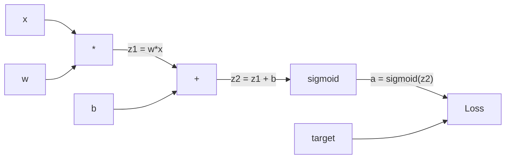
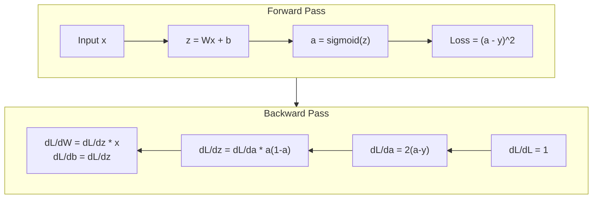
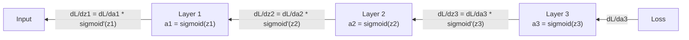

# 从零开始向后传播

> 没有它,神经网络只是昂贵的随机数生成器.

**Type:** Build
**Languages:** Python
**Prerequisites:** Lesson 03.02 (Multi-Layer Networks)
**Time:** ~120 minutes

## 学习目标

- 实现基于值的自行排序引擎,构建计算图表,通过拓排序计算梯度
- 使用链条规则来推导加,乘和sigmoid的倒退通行
- 通过使用您的从零开始的反扩散引擎来训练多层网络在XOR和圆形分类上
- 识别深度西格莫ид网络中消失梯度问题,并解释为什么梯度呈指数缩小

## 问题

你的网络有一个隐藏的层,有768个输入和3072个输出. 这就是2,359,296个重量. 它做了一个错误的预测. 哪个重量导致了错误? 单独测试每个重量意味着2,300万个前进传输. 倒传计算了所有2,300万个梯度在一个倒传输中. 这不是优化. 这就是训练和不可能之间的区别.

简单的方法是:拿一个重量,把它推到一个小小的量,再运行前进的传输,测量损失是否上升或下降. 这给你了重量的梯度.现在为网络中的每一个重量做.乘以数千个训练步骤和数百万的数据点.你需要地质时间来训练任何有用的东西.

逆向传播解决了这个问题. 一个向前传递,一个向后传递,所有梯度计算. 俩是计算的链条规则,系统地应用到计算图表. 这就是使深度学习实用的算法. 没有它,我们仍然会陷入玩具问题.

## 概念

### 链条适用于网络

简单的重复:如果y=f(g(x)),那么dy/dx=f'(g(x)) *g'(x.

在神经网络中",链"是从输入到损失的操作序列.每个层应用权重,添加偏差,通过激活.损失函数将最终输出与目标进行比较.反传播追踪了这一链向后,计算了每个操作如何导致错误.

### 计算图表

每个前进传输构建一个图表. 每个节点是一个操作 (乘,加, sigmoid). 每一个边缘携带一个前进值和一个向后梯度.



进前传:值流向左向右. x 和 w 产生z1 = w*x. 添加b 得到z2. 辛格莫ид 给出激活a. 使用损失函数对比a 目标y.

往后传递:梯度流向右向左.从dL/da开始 (激活过程中损失发生变化).乘以da/dz2 (sigmoid衍生值).这就给出dL/dz2.分为dL/db (dL/dz2等于dL/dz2),因为z2 =z1 + b) 和dL/dz1.然后dL/dw =dL/dz1 * x,dL/dx =dL/dz1 * w.

每个节点在图表中都有一个任务:从上方来来的梯度,乘以其本地衍生值,然后传递下来.

### 前往对后退



前传存储每个中间值:z,a,每个层的输入.后传需要这些存储值来计算梯度.这是后传的核心的内存-计算权衡.你以速度 (一个传输而不是数百万) 换取内存 (存储激活).

### 渐进的流动

对于三层网络,梯度链通过每个层:



在每层,梯度由西格莫因衍生品乘以.西格莫因衍生品是* (1 - a),最大值为0.25 (当 a = 0.5).

### 渐变物消失

形的形是形的形. 形的形是形的形. 形的形是形的形. 形的形是形的形. 形的形是形的形. 形的形是形的形. 形的形是形的形. 形的形是形的形. 形的形是形的形. 形的形是形的形. 形的形是形的形. 形的形是形的形. 形的形是形的形. 形的形是形的形. 形的形是形的形. 形的形是形的形. 形的形是形的形. 形的形是形的形的形. 形的形的形是形的形的形的形.

```
sigmoid(z):     Output range [0, 1]
sigmoid'(z):    Max value 0.25 (at z = 0)

After 5 layers:   gradient * 0.25^5 = 0.001x original
After 10 layers:  gradient * 0.25^10 = 0.000001x original
```

这就是为什么深度sigmoid网络几乎不可能训练. 修复 - - ReLU及其变体 - - 是第04课题.

### 取代二层网络的基梯子

具体计算一个网络的输入 x,隐藏层与 sigmoid,输出层与 sigmoid,和 MSE 损失.

进步通行:
```
z1 = W1 * x + b1
a1 = sigmoid(z1)
z2 = W2 * a1 + b2
a2 = sigmoid(z2)
L = (a2 - y)^2
```

后行 (应用链条节点一步一步):
```
dL/da2 = 2(a2 - y)
da2/dz2 = a2 * (1 - a2)
dL/dz2 = dL/da2 * da2/dz2 = 2(a2 - y) * a2 * (1 - a2)

dL/dW2 = dL/dz2 * a1
dL/db2 = dL/dz2

dL/da1 = dL/dz2 * W2
da1/dz1 = a1 * (1 - a1)
dL/dz1 = dL/da1 * da1/dz1

dL/dW1 = dL/dz1 * x
dL/db1 = dL/dz1
```

每个梯度都是从损失中追溯到本地衍生品的产物.

```figure
backprop-vanishing
```

## 建立它

### 步骤1:值节点

我们计算中的每一个数字都会变成一个值. 它存储其数据,其梯度,以及它是如何创建的 (所以它知道如何计算梯度向后).

```python
class Value:
    def __init__(self, data, children=(), op=''):
        self.data = data
        self.grad = 0.0
        self._backward = lambda: None
        self._children = set(children)
        self._op = op

    def __repr__(self):
        return f"Value(data={self.data:.4f}, grad={self.grad:.4f})"
```

没有向后函数 (没有操作).`_children`现在我们可以在图表上进行排序.

### 步骤2: 后期功能操作

每个操作都会创造一个新的值,并定义梯度如何通过它向后流动.

```python
def __add__(self, other):
    other = other if isinstance(other, Value) else Value(other)
    out = Value(self.data + other.data, (self, other), '+')

    def _backward():
        self.grad += out.grad
        other.grad += out.grad

    out._backward = _backward
    return out

def __mul__(self, other):
    other = other if isinstance(other, Value) else Value(other)
    out = Value(self.data * other.data, (self, other), '*')

    def _backward():
        self.grad += other.data * out.grad
        other.grad += self.data * out.grad

    out._backward = _backward
    return out
```

为了加起来:d(a+b)/da = 1,d(a+b)/db = 1. 所以两个输入直接得到输出梯度.

对于乘法:d(a*b)/da = b,d(a*b)/db = a. 每个输入都得到了另一个值乘以输出梯度.

其他`+=`值可以用于多个操作.它的梯度是所有路径的梯度的总和.

### 步骤3:西格莫因和损失

```python
import math

def sigmoid(self):
    x = self.data
    x = max(-500, min(500, x))
    s = 1.0 / (1.0 + math.exp(-x))
    out = Value(s, (self,), 'sigmoid')

    def _backward():
        self.grad += (s * (1 - s)) * out.grad

    out._backward = _backward
    return out
```

引号导数:sigmoid(x) * (1 -sigmoid(x)). 我们在前进传递过程中计算了sigmoid(x) = s. 再利用它.没有额外的工作.

```python
def mse_loss(predicted, target):
    diff = predicted + Value(-target)
    return diff * diff
```

单个输出的MSE: (预测 - 目标) ^2.我们表达减值为加值,负值.

### 步骤4: 往后过渡

拓类型确保我们按正确的顺序处理节点, 节点的梯度在我们通过它传播之前完全积累.

```python
def backward(self):
    topo = []
    visited = set()

    def build_topo(v):
        if v not in visited:
            visited.add(v)
            for child in v._children:
                build_topo(child)
            topo.append(v)

    build_topo(self)
    self.grad = 1.0
    for v in reversed(topo):
        v._backward()
```

开始在损失 (渐进值=1.0,因为dL/dL=1). 通过排序图表向后行走.`_backward`让孩子们的态度变得更低.

### 步骤5:层和网络

```python
import random

class Neuron:
    def __init__(self, n_inputs):
        scale = (2.0 / n_inputs) ** 0.5
        self.weights = [Value(random.uniform(-scale, scale)) for _ in range(n_inputs)]
        self.bias = Value(0.0)

    def __call__(self, x):
        act = sum((wi * xi for wi, xi in zip(self.weights, x)), self.bias)
        return act.sigmoid()

    def parameters(self):
        return self.weights + [self.bias]


class Layer:
    def __init__(self, n_inputs, n_outputs):
        self.neurons = [Neuron(n_inputs) for _ in range(n_outputs)]

    def __call__(self, x):
        out = [n(x) for n in self.neurons]
        return out[0] if len(out) == 1 else out

    def parameters(self):
        params = []
        for n in self.neurons:
            params.extend(n.parameters())
        return params


class Network:
    def __init__(self, sizes):
        self.layers = []
        for i in range(len(sizes) - 1):
            self.layers.append(Layer(sizes[i], sizes[i + 1]))

    def __call__(self, x):
        for layer in self.layers:
            x = layer(x)
            if not isinstance(x, list):
                x = [x]
        return x[0] if len(x) == 1 else x

    def parameters(self):
        params = []
        for layer in self.layers:
            params.extend(layer.parameters())
        return params

    def zero_grad(self):
        for p in self.parameters():
            p.grad = 0.0
```

神经元采集输入,计算重量的总数 +偏差,并应用sigmoid.重量初始化尺度由 sqrt(2/n_input) 防止深层网络中的sigmoid和.一个层是神经元的列表.一个网络是层的列表.`parameters()`方法收集所有可学习的值,以便我们更新它们.

### 步骤 6: 在XOR上列车

```python
random.seed(42)
net = Network([2, 4, 1])

xor_data = [
    ([0.0, 0.0], 0.0),
    ([0.0, 1.0], 1.0),
    ([1.0, 0.0], 1.0),
    ([1.0, 1.0], 0.0),
]

learning_rate = 1.0

for epoch in range(1000):
    total_loss = Value(0.0)
    for inputs, target in xor_data:
        x = [Value(i) for i in inputs]
        pred = net(x)
        loss = mse_loss(pred, target)
        total_loss = total_loss + loss

    net.zero_grad()
    total_loss.backward()

    for p in net.parameters():
        p.data -= learning_rate * p.grad

    if epoch % 100 == 0:
        print(f"Epoch {epoch:4d} | Loss: {total_loss.data:.6f}")

print("\nXOR Results:")
for inputs, target in xor_data:
    x = [Value(i) for i in inputs]
    pred = net(x)
    print(f"  {inputs} -> {pred.data:.4f} (expected {target})")
```

从随机预测到纠正XOR输出,完全由后延伸计算梯度和推重在正确的方向驱动.

### 阶段7:圆的分类

在第02课中,你手动调节了重量来进行圆形分类.

```python
random.seed(7)

def generate_circle_data(n=100):
    data = []
    for _ in range(n):
        x1 = random.uniform(-1.5, 1.5)
        x2 = random.uniform(-1.5, 1.5)
        label = 1.0 if x1 * x1 + x2 * x2 < 1.0 else 0.0
        data.append(([x1, x2], label))
    return data

circle_data = generate_circle_data(80)

circle_net = Network([2, 8, 1])
learning_rate = 0.5

for epoch in range(2000):
    random.shuffle(circle_data)
    total_loss_val = 0.0
    for inputs, target in circle_data:
        x = [Value(i) for i in inputs]
        pred = circle_net(x)
        loss = mse_loss(pred, target)
        circle_net.zero_grad()
        loss.backward()
        for p in circle_net.parameters():
            p.data -= learning_rate * p.grad
        total_loss_val += loss.data

    if epoch % 200 == 0:
        correct = 0
        for inputs, target in circle_data:
            x = [Value(i) for i in inputs]
            pred = circle_net(x)
            predicted_class = 1.0 if pred.data > 0.5 else 0.0
            if predicted_class == target:
                correct += 1
        accuracy = correct / len(circle_data) * 100
        print(f"Epoch {epoch:4d} | Loss: {total_loss_val:.4f} | Accuracy: {accuracy:.1f}%")
```

我们使用在线SGD在这里 - 每个样本之后更新重量,而不是积累全批. 这更快地打破对称,避免了全损失景观上的sigmoid和.每一个时代混动数据,防止网络记忆顺序.

网络可以自行发现圆形决策边界.这是反扩散的力量:你定义了架构,损失函数和数据.算法计算了重量.

## 用它

皮托尔奇在上面的所有内容都用几行来完成.核心想法是一样的 - - 自动基数在前进的过程中构建一个计算图表,然后追踪它向后计算梯度.

```python
import torch
import torch.nn as nn

model = nn.Sequential(
    nn.Linear(2, 4),
    nn.Sigmoid(),
    nn.Linear(4, 1),
    nn.Sigmoid(),
)
optimizer = torch.optim.SGD(model.parameters(), lr=1.0)
criterion = nn.MSELoss()

X = torch.tensor([[0,0],[0,1],[1,0],[1,1]], dtype=torch.float32)
y = torch.tensor([[0],[1],[1],[0]], dtype=torch.float32)

for epoch in range(1000):
    pred = model(X)
    loss = criterion(pred, y)
    optimizer.zero_grad()
    loss.backward()
    optimizer.step()

print("PyTorch XOR Results:")
with torch.no_grad():
    for i in range(4):
        pred = model(X[i])
        print(f"  {X[i].tolist()} -> {pred.item():.4f} (expected {y[i].item()})")
```

`loss.backward()`是你的`total_loss.backward()`现在,我们要去.`optimizer.step()`是你的手册吗?`p.data -= lr * p.grad`现在,我们要去.`optimizer.zero_grad()`是你的`net.zero_grad()`鱼处理GPU加速,混合精度,梯度检查,以及数百种层类型.但向后传递是同一链条规则适用于同一计算图.

训练运行前进,然后倒退,然后更新体重. 推理只运行前进的传输. 没有梯度,没有更新. 这种区别是重要的,因为推断是生产过程中发生的事情. 当你打电话给一个像Cloed或GPT这样的API时,你会推断--你的提示通过网络流向前, 没有变量. 了解背后支架是重要的,因为它塑造了网络中的每一个重量.

## 运送它

这一课产生了:
- `outputs/prompt-gradient-debugger.md`-- 任何神经网络中可重复使用的提示来诊断梯度问题 (消失,爆炸,NaN)

## 运动

1. 添加一个`__sub__`运行一个                                `__neg__`通过将 (a - b) ^2等简单表达式与手动计算进行比较来验证梯度是否正确.

2. 添加一个`relu`换取隐藏层中的雷,再在XOR上训练.比较缩速度.你应该看到更快的训练--这预览课04

3. 实施一个`__pow__`通过使用它来替换`mse_loss`具有适当的`(predicted - target) ** 2`检查梯度与原始实现一致.

4. 加入梯剪切到训练循环: 调用后`backward()`通过缩,将所有梯度切断到 [-1, 1]. 训练更深的网络 (使用sigmoid) 进行4+层,并比较与没有切割的损失曲线.这是你第一次防范爆炸的梯度.

5. 建立一个视觉化:在XOR训练后,打印网络中的每个参数的梯度.确定哪个层具有最小梯度. 这表明了您在概念部分读到的消失梯度问题.

## 关键词

| Term | What people say | What it actually means |
|------|----------------|----------------------|
| Backpropagation | "The network learns" | An algorithm that computes dL/dw for every weight by applying the chain rule backward through the computational graph |
| Computational graph | "The network structure" | A directed acyclic graph where nodes are operations and edges carry values (forward) and gradients (backward) |
| Chain rule | "Multiply the derivatives" | If y = f(g(x)), then dy/dx = f'(g(x)) * g'(x) -- the mathematical foundation of backpropagation |
| Gradient | "The direction of steepest ascent" | The partial derivative of the loss with respect to a parameter -- tells you how to change that parameter to reduce the loss |
| Vanishing gradient | "Deep networks don't learn" | Gradients shrink exponentially as they propagate through layers with saturating activations like sigmoid |
| Forward pass | "Running the network" | Computing the output from inputs by sequentially applying each layer's operations and storing intermediate values |
| Backward pass | "Computing gradients" | Traversing the computational graph in reverse, accumulating gradients at each node using the chain rule |
| Learning rate | "How fast it learns" | A scalar that controls the step size when updating weights: w_new = w_old - lr * gradient |
| Topological sort | "The right order" | An ordering of graph nodes where each node appears after all nodes it depends on -- ensures gradients are fully accumulated before propagation |
| Autograd | "Automatic differentiation" | A system that builds computational graphs during forward computation and automatically computes gradients -- what PyTorch's engine does |

## 进一步阅读

- 鲁姆尔哈特,希顿和威廉姆斯,"通过反向传播错误学习表示" (1986) - - 论文使反向传播成为主流和解锁的多层网络培训
- 蓝色1棕色,神经网络系列 (https://www.youtube.com/playlist?list=PLZHQObOWTQDNU6R1_67000Dx_ZCJB-3pi) -- 网络中回传和梯度流量的最佳视觉解释
