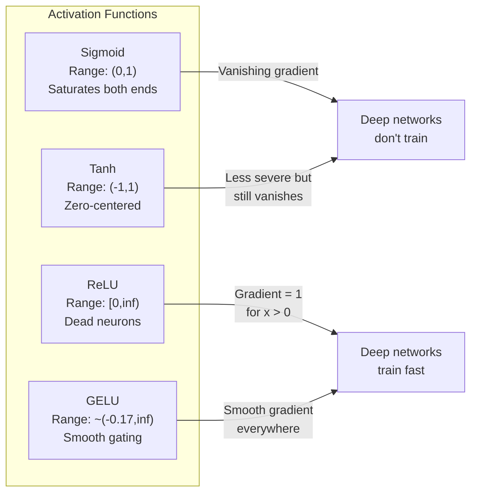
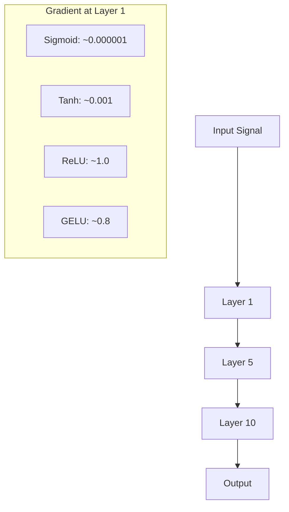
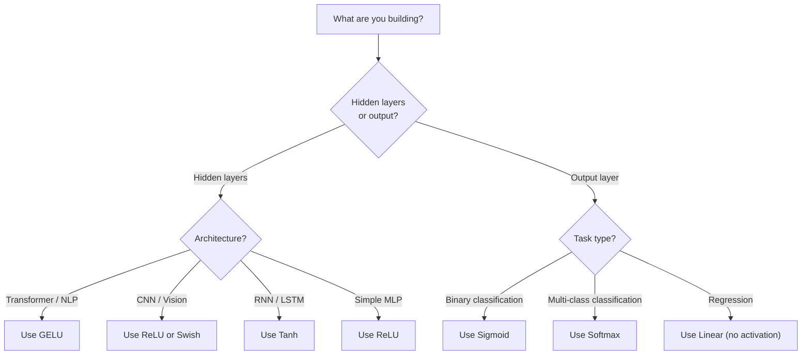

# 激活功能

> 没有线性,你的100层网络就像一个精致的矩阵乘法. 激活是让神经网络在曲线中思考的门户.

**Type:** Build
**Languages:** Python
**Prerequisites:** Lesson 03.03 (Backpropagation)
**Time:** ~75 minutes

## 学习目标

- 实现sigmoid,tanh,ReLU,Leaky ReLU,GELU,Swish和softmax及其衍生品从零开始
- 通过测量激活大小通过10+层不同激活的激活量来诊断消失梯度问题
- 检测 ReLU 网络中死神经元,并解释为什么 GELU 避免了这种故障模式
- 选择给定架构的正确激活函数 (变压器,CNN,RNN,输出层)

## 问题

堆叠两个线性转换:y=W2(W1x+b1) +b2.扩展它:y=W2W1x+W2b1+b2.这只是y=Ax+c--一个线性转换.不管你堆叠多少线性层,结果都会崩到一个矩阵乘以.你的100层网络具有与单层相同的表示能力.

这不是理论上的好奇心. 这意味着一个深线网络实际上无法学习XOR,不能分类螺旋数据集,不能识别面孔.没有激活函数,深度是幻觉.

激活函数打破了线性. 他们通过非线性函数扭曲每个层的输出,使网络能够曲决策界限,近似任意函数,并实际学习. 但选择错误的激活,你的渐变会消失到零 (深度网络中的sigmoid),爆炸到无限 (无限的激活,没有仔细的初始化), 网络是否能学习,直接决定了激活函数的选择.

## 概念

### 为什么不线性是必要的

矩阵乘法是可复合的.乘以矩阵A乘以矩阵B乘以 AB乘以相同.这意味着堆10个线性层是数学上相当于一个线性层,一个大矩阵.所有这些参数,所有深度,都是浪费的.你需要一些东西来打破链.这是激活函数的作用.

线性层计算了f ((x) =Wx + b.

```
Layer 1: h = W1 * x + b1
Layer 2: y = W2 * h + b2
```

替代品:

```
y = W2 * (W1 * x + b1) + b2
y = (W2 * W1) * x + (W2 * b1 + b2)
y = A * x + c
```

插入一个非线性激活g() 之间的层:

```
h = g(W1 * x + b1)
y = W2 * h + b2
```

现在替代器断裂.W2 * g(W1 * x + b1) + b2不能缩小到单个线性转换.网络可以代表非线性函数.每一个具有激活的额外层增加了表示容量.

### 状

对于神经网络的原始激活功能.

```
sigmoid(x) = 1 / (1 + e^(-x))
```

输出范围: (0,1). 顺,可分化,将任何真数映射到类似概率的值.

衍生品:

```
sigmoid'(x) = sigmoid(x) * (1 - sigmoid(x))
```

转移的高值为0.25,发生在x=0. 转移时,梯度通过层次乘以.

```
0.25^10 = 0.000000953674
```

信号的百万分之一不到.这是渐变问题.早期层的梯度变得如此小,重量几乎无法更新.网络似乎学习 - - 后层的损失减少 - - 但第一层是结的.深层的sigmoid网络根本没有训练.

另外一个问题:sigmoid输出总是正 (0到 1),这意味着重量上的梯度总是相同的标志.

### 

它们是"西格莫伊德"的中心版本.

```
tanh(x) = (e^x - e^(-x)) / (e^x + e^(-x))
```

产出范围: (-1,1) 零中心,消除了扎克问题.

衍生品:

```
tanh'(x) = 1 - tanh(x)^2
```

最高衍生值为1.0在x=0时 - - 比sigmoid好四倍.但消失梯度问题仍然存在.对于大量的正值或负值输入,衍生值接近零.十层仍然压碎梯度,但不那么积极.

### 突破

修改线性单元. 2010 年由纳尔和希顿推广为深度学习 (该功能本身可以追溯到福岛1969年的作品),它改变了一切.

```
relu(x) = max(0, x)
```

输出范围: [0,无限).衍生式是微乎其微的简单:

```
relu'(x) = 1  if x > 0
            0  if x <= 0
```

没有消逝梯度.梯度是正确的1,通过直线.这就是为什么深度网络变得可训练的原因.

但有一个失败模式:死神经元问题.如果神经元的权重输入总是负面 (由于大负偏差或不幸的权重初始化),其输出总是零,其梯度总是零,它永远不会更新.它永久死亡.实际上,ReLU网络中的10-40%的神经元可以在训练中死亡.

### 泄漏的RLU

对于死神经元的最简单的补救方法.

```
leaky_relu(x) = x        if x > 0
                alpha * x if x <= 0
```

负面侧面的斜率是小的,而不是零,所以死神经元仍然得到一个梯度信号,

### 现代的默认

盖斯错误线性单位. 于2016年由亨德里克斯和吉普尔推出. 在BERT,GPT和大多数现代变压器中默认激活.

```
gelu(x) = x * Phi(x)
```

在phi ((x) 是标准正常分布的累积分布函数.

```
gelu(x) ~= 0.5 * x * (1 + tanh(sqrt(2/pi) * (x + 0.044715 * x^3)))
```

格鲁在任何地方都是平滑的,允许小负值 (与硬剪切到零的ReLU不同),并且具有概率解释:它根据高斯分布中每一个输入的可能性进行权重.这种平滑的门口在变体架构中优于ReLU,因为它提供了更好的梯度流量,完全避免了死神经元问题.

### 瑞士 / 瑞士

通过自动搜索发现的自闭关键激活.

```
swish(x) = x * sigmoid(x)
```

通过自动搜索在激活函数空间上发现了它 - - 一个设计神经网络的神经网络.

像GELU一样,它是光滑的,非单调的,并允许小负值.区别微妙:Swish使用sigmoid为盖特,而GELU使用高斯CDF. 在实践中,性能几乎是一样的.Swish用于EfficientNet和一些视觉模型.GELU在语言模型中占主导地位.

### 软max:输出激活

软max将原始分数 (logits) 的向量转换为概率分布.

```
softmax(x_i) = e^(x_i) / sum(e^(x_j) for all j)
```

每个输出均为0到1之间.所有输出总和为1.这使得它成为多类分类的标准最终激活.最大的逻辑得到最高概率,但与 argmax不同,软max是可分化的,并保留有关相对可靠性的信息.

### 形状的比较



### 渐进流量比较



### 什么时候激活



```figure
softmax-temperature
```

## 建立它

### 执行所有激活函数,使用衍生值

每个函数都采用一个浮动,返回一个浮动. 每个衍生函数都采用相同的输入,返回梯度.

```python
import math

def sigmoid(x):
    x = max(-500, min(500, x))
    return 1.0 / (1.0 + math.exp(-x))

def sigmoid_derivative(x):
    s = sigmoid(x)
    return s * (1 - s)

def tanh_act(x):
    return math.tanh(x)

def tanh_derivative(x):
    t = math.tanh(x)
    return 1 - t * t

def relu(x):
    return max(0.0, x)

def relu_derivative(x):
    return 1.0 if x > 0 else 0.0

def leaky_relu(x, alpha=0.01):
    return x if x > 0 else alpha * x

def leaky_relu_derivative(x, alpha=0.01):
    return 1.0 if x > 0 else alpha

def gelu(x):
    return 0.5 * x * (1 + math.tanh(math.sqrt(2 / math.pi) * (x + 0.044715 * x ** 3)))

def gelu_derivative(x):
    phi = 0.5 * (1 + math.erf(x / math.sqrt(2)))
    pdf = math.exp(-0.5 * x * x) / math.sqrt(2 * math.pi)
    return phi + x * pdf

def swish(x):
    return x * sigmoid(x)

def swish_derivative(x):
    s = sigmoid(x)
    return s + x * s * (1 - s)

def softmax(xs):
    max_x = max(xs)
    exps = [math.exp(x - max_x) for x in xs]
    total = sum(exps)
    return [e / total for e in exps]
```

### 第二步: 想象出梯度的死亡

计算在100个平间点的梯度,从 -5到 -5. 打印一个文字历史图,显示每个激活梯度接近零.

```python
def gradient_scan(name, derivative_fn, start=-5, end=5, n=100):
    step = (end - start) / n
    near_zero = 0
    healthy = 0
    for i in range(n):
        x = start + i * step
        g = derivative_fn(x)
        if abs(g) < 0.01:
            near_zero += 1
        else:
            healthy += 1
    pct_dead = near_zero / n * 100
    print(f"{name:15s}: {healthy:3d} healthy, {near_zero:3d} near-zero ({pct_dead:.0f}% dead zone)")

gradient_scan("Sigmoid", sigmoid_derivative)
gradient_scan("Tanh", tanh_derivative)
gradient_scan("ReLU", relu_derivative)
gradient_scan("Leaky ReLU", leaky_relu_derivative)
gradient_scan("GELU", gelu_derivative)
gradient_scan("Swish", swish_derivative)
```

### 第三步: 逐渐消失的实验

通过N层通过sigmoid对ReLU进行前传信号.测量激活大小如何变化.

```python
import random

def vanishing_gradient_experiment(activation_fn, name, n_layers=10, n_inputs=5):
    random.seed(42)
    values = [random.gauss(0, 1) for _ in range(n_inputs)]

    print(f"\n{name} through {n_layers} layers:")
    for layer in range(n_layers):
        weights = [random.gauss(0, 1) for _ in range(n_inputs)]
        z = sum(w * v for w, v in zip(weights, values))
        activated = activation_fn(z)
        magnitude = abs(activated)
        bar = "#" * int(magnitude * 20)
        print(f"  Layer {layer+1:2d}: magnitude = {magnitude:.6f} {bar}")
        values = [activated] * n_inputs

vanishing_gradient_experiment(sigmoid, "Sigmoid")
vanishing_gradient_experiment(relu, "ReLU")
vanishing_gradient_experiment(gelu, "GELU")
```

### 步骤4: 死亡神经元探测器

创建一个ReLU网络,通过它传递随机输入,计算多少神经元从来没有发射.

```python
def dead_neuron_detector(n_inputs=5, hidden_size=20, n_samples=1000):
    random.seed(0)
    weights = [[random.gauss(0, 1) for _ in range(n_inputs)] for _ in range(hidden_size)]
    biases = [random.gauss(0, 1) for _ in range(hidden_size)]

    fire_counts = [0] * hidden_size

    for _ in range(n_samples):
        inputs = [random.gauss(0, 1) for _ in range(n_inputs)]
        for neuron_idx in range(hidden_size):
            z = sum(w * x for w, x in zip(weights[neuron_idx], inputs)) + biases[neuron_idx]
            if relu(z) > 0:
                fire_counts[neuron_idx] += 1

    dead = sum(1 for c in fire_counts if c == 0)
    rarely_fire = sum(1 for c in fire_counts if 0 < c < n_samples * 0.05)
    healthy = hidden_size - dead - rarely_fire

    print(f"\nDead Neuron Report ({hidden_size} neurons, {n_samples} samples):")
    print(f"  Dead (never fired):     {dead}")
    print(f"  Barely alive (<5%):     {rarely_fire}")
    print(f"  Healthy:                {healthy}")
    print(f"  Dead neuron rate:       {dead/hidden_size*100:.1f}%")

    for i, c in enumerate(fire_counts):
        status = "DEAD" if c == 0 else "WEAK" if c < n_samples * 0.05 else "OK"
        bar = "#" * (c * 40 // n_samples)
        print(f"  Neuron {i:2d}: {c:4d}/{n_samples} fires [{status:4s}] {bar}")

dead_neuron_detector()
```

### 步骤5:训练比较 - 胺与ReluvsGelU

运行相同的两个层网络在圆数据集 (圆内点 = 类 1, 外点 = 类 0) 通过三个不同的激活.

```python
def make_circle_data(n=200, seed=42):
    random.seed(seed)
    data = []
    for _ in range(n):
        x = random.uniform(-2, 2)
        y = random.uniform(-2, 2)
        label = 1.0 if x * x + y * y < 1.5 else 0.0
        data.append(([x, y], label))
    return data


class ActivationNetwork:
    def __init__(self, activation_fn, activation_deriv, hidden_size=8, lr=0.1):
        random.seed(0)
        self.act = activation_fn
        self.act_d = activation_deriv
        self.lr = lr
        self.hidden_size = hidden_size

        self.w1 = [[random.gauss(0, 0.5) for _ in range(2)] for _ in range(hidden_size)]
        self.b1 = [0.0] * hidden_size
        self.w2 = [random.gauss(0, 0.5) for _ in range(hidden_size)]
        self.b2 = 0.0

    def forward(self, x):
        self.x = x
        self.z1 = []
        self.h = []
        for i in range(self.hidden_size):
            z = self.w1[i][0] * x[0] + self.w1[i][1] * x[1] + self.b1[i]
            self.z1.append(z)
            self.h.append(self.act(z))

        self.z2 = sum(self.w2[i] * self.h[i] for i in range(self.hidden_size)) + self.b2
        self.out = sigmoid(self.z2)
        return self.out

    def backward(self, target):
        error = self.out - target
        d_out = error * self.out * (1 - self.out)

        for i in range(self.hidden_size):
            d_h = d_out * self.w2[i] * self.act_d(self.z1[i])
            self.w2[i] -= self.lr * d_out * self.h[i]
            for j in range(2):
                self.w1[i][j] -= self.lr * d_h * self.x[j]
            self.b1[i] -= self.lr * d_h
        self.b2 -= self.lr * d_out

    def train(self, data, epochs=200):
        losses = []
        for epoch in range(epochs):
            total_loss = 0
            correct = 0
            for x, y in data:
                pred = self.forward(x)
                self.backward(y)
                total_loss += (pred - y) ** 2
                if (pred >= 0.5) == (y >= 0.5):
                    correct += 1
            avg_loss = total_loss / len(data)
            accuracy = correct / len(data) * 100
            losses.append(avg_loss)
            if epoch % 50 == 0 or epoch == epochs - 1:
                print(f"    Epoch {epoch:3d}: loss={avg_loss:.4f}, accuracy={accuracy:.1f}%")
        return losses


data = make_circle_data()

configs = [
    ("Sigmoid", sigmoid, sigmoid_derivative),
    ("ReLU", relu, relu_derivative),
    ("GELU", gelu, gelu_derivative),
]

results = {}
for name, act_fn, act_d_fn in configs:
    print(f"\n=== Training with {name} ===")
    net = ActivationNetwork(act_fn, act_d_fn, hidden_size=8, lr=0.1)
    losses = net.train(data, epochs=200)
    results[name] = losses

print("\n=== Final Loss Comparison ===")
for name, losses in results.items():
    print(f"  {name:10s}: start={losses[0]:.4f} -> end={losses[-1]:.4f} (improvement: {(1 - losses[-1]/losses[0])*100:.1f}%)")
```

## 用它

PyTorch提供了所有这些功能和模块形式:

```python
import torch
import torch.nn as nn
import torch.nn.functional as F

x = torch.randn(4, 10)

relu_out = F.relu(x)
gelu_out = F.gelu(x)
sigmoid_out = torch.sigmoid(x)
swish_out = F.silu(x)

logits = torch.randn(4, 5)
probs = F.softmax(logits, dim=1)

model = nn.Sequential(
    nn.Linear(10, 64),
    nn.GELU(),
    nn.Linear(64, 32),
    nn.GELU(),
    nn.Linear(32, 5),
)
```

变压器中的隐藏层:GELU. CNN中的隐藏层:ReLU. 排序的输出层:软max. 退回的输出层:没有 (线性). 概率的输出层:sigmoid.就这样.从这些默认开始.只要有证据,才会改变它们.

如果您正在从零开始构建,您可能不会使用RNN. 如果您的RLU网络中神经元正在死亡,请切换到GELU. 除非您有特定的原因,就不要寻找Leaky ReLU.

## 运送它

这一课产生了:
- `outputs/prompt-activation-selector.md`-- 一个可重复使用的提示,帮助你选择任何架构的正确激活函数

## 运动

1. 实现参数 ReLU (PReLU),其中负倾斜alpha是可学习的参数. 运行它在圆数据集上,并与固定的泄漏 ReLU 进行比较.

2. 运行消失梯度实验,用50层而不是10层. 绘制每层的大小为sigmoid,tanh,ReLU和GELU. 在哪个层上每个激活的信号有效达到零?

3. 实现ELU (指数直线单位): elu(x) = x 如果 x > 0,alpha * (e^x - 1) 如果 x <= 0. 将其死神经元的速度与同一个网络上的 ReLU 进行比较.

4. 建立一个在训练过程中运行的"梯度健康监测器":在每个阶段,计算每个层的平均梯度大小.

5. 修改训练比较,以使用从01课时的XOR数据集而不是圆.哪个激活式在XOR上最快收缩?为什么这与圆结果不同?

## 关键词

| Term | What people say | What it actually means |
|------|----------------|----------------------|
| Activation function | "The nonlinear part" | A function applied to each neuron's output that breaks linearity, enabling the network to learn nonlinear mappings |
| Vanishing gradient | "Gradients disappear in deep networks" | Gradients shrink exponentially through layers when the activation's derivative is less than 1, making early layers untrainable |
| Exploding gradient | "Gradients blow up" | Gradients grow exponentially through layers when the effective multiplier exceeds 1, causing unstable training |
| Dead neuron | "A neuron that stopped learning" | A ReLU neuron whose input is permanently negative, producing zero output and zero gradient |
| Sigmoid | "Squishes values to 0-1" | The logistic function 1/(1+e^-x), historically important but causes vanishing gradients in deep networks |
| ReLU | "Clips negatives to zero" | max(0, x) -- the activation that made deep learning practical by preserving gradient magnitude |
| GELU | "The transformer activation" | Gaussian Error Linear Unit, a smooth activation that weights inputs by their probability of being positive |
| Swish/SiLU | "Self-gated ReLU" | x * sigmoid(x), discovered through automated search, used in EfficientNet |
| Softmax | "Turns scores into probabilities" | Normalizes a vector of logits into a probability distribution where all values are in (0,1) and sum to 1 |
| Leaky ReLU | "ReLU that doesn't die" | max(alpha*x, x) where alpha is small (0.01), preventing dead neurons by allowing small negative gradients |
| Saturation | "The flat part of sigmoid" | Regions where an activation's derivative approaches zero, blocking gradient flow |
| Logit | "The raw score before softmax" | The unnormalized output of the final layer before applying softmax or sigmoid |

## 进一步阅读

- 纳尔和希顿, "修改线性单位改善限制的博尔茨曼机器" (2010) - 引入ReLU的论文,并使深度网络的训练成为可能
- 亨德里克斯和吉普尔, "高斯错误线性单位 (GELU) " (2016) -- 引入了变压器默认的激活函数
- 拉马坎德兰等人",搜索激活函数" (2017) -- 使用自动搜索发现Swish,表明激活设计可以自动化
- 格洛罗特和Bengio, "理解训练深度传输神经网络的难度" (2010) - 诊断消失/爆炸梯度的论文,并提出Xavier初始化
- 善良的同事,Bengio, Courville,深度学习6.3章 (https://www.deeplearningbook.org/) -- 密集单位和激活功能的严格处理
