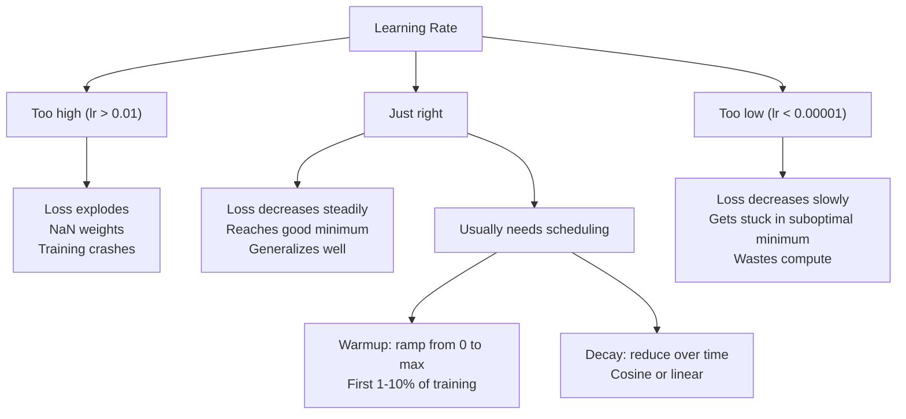
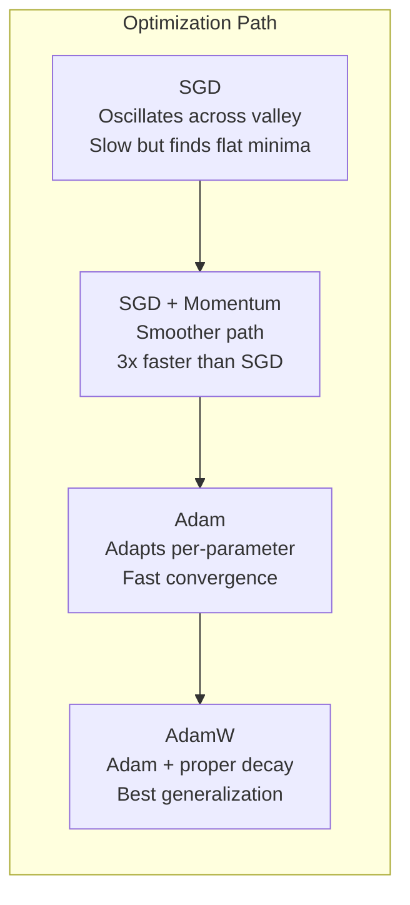
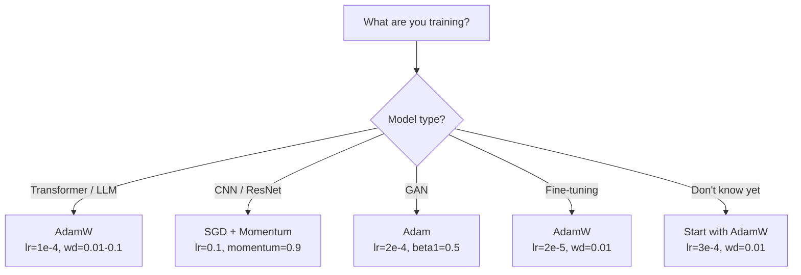

# 优化器

> 渐进式下降告诉你哪个方向移动. 它没有说多少距离或速度. SGD 是一个 компас.亚当是GPS与交通数据.

**Type:** Build
**Languages:** Python
**Prerequisites:** Lesson 03.05 (Loss Functions)
**Time:** ~75 minutes

## 学习目标

- 在Python中从零开始实现SGD,SGD与动力,亚当和亚当W优化器
- 解释亚当的偏见纠正如何补偿早期训练阶段零初始化时刻估计
- 证明为什么AdamW在同一任务上具有L2规律化,比Adam产生更好的概括性
- 选择适合转换器,CNN,GAN和细调的优化器和默认超参数

## 问题

你计算了梯度.你知道重量#4,721应该减少0.003减少损失.但0.003在哪个单位?通过什么?

基梯度下降对每一步的每个参数都应用相同的学习速度:w = w - lr *梯度. 这造成了三种问题,使得训练神经网络在实践中很痛苦.

首先,振荡. 失败的景观很少像一个滑. 这更像是一个长而狭窄的谷. 梯度指向谷 (向),而不是沿谷 (浅向). 渐进的下降反弹前后穿越狭窄的维度,同时在有用的维度上取得微小的进展. 你已经看到了:损失比高原快速下降,不是因为模型合,而是因为它正在振荡.

另一方面,所有参数的学习速度都是错误的.有些重量需要大规模更新 (它们处于早期的,不适合的阶段).其他需要小规模的更新 (它们接近最佳值).一个适合前者学习率破坏后者,反之亦然.

第三,车点.在高层次,损失景观有广的平面区域,梯度接近零. 瓦尼拉 SGD 爬行这些在梯度的速度,实际上是零. 模型看起来卡住了. 它不是卡住的 - - 它在一个平面区域,另一边有有用的下降.

亚当解决了所有三个问题. 它保持每参数的两个运行平均值 - - 平均梯度 (momentum,处理振荡) 和平均二次梯度 (适应速度,处理不同的尺度). 结合前几步的偏差纠正,它给你一个优化器,它可以解决80%的默认超参数问题. 这一课将它从头开始,所以你会明白,

## 概念

### 缩率下降 (SGD)

计算一个小批量上的梯度,然后朝着相反的方向行进.

```
w = w - lr * gradient
```

位式意味着你使用一个随机的子集 (迷你批量) 数据来估计梯度,而不是整个数据集.这个噪音实际上是有用的 - 它帮助逃避严峻的局部最小值.

学习率是唯一的. 太高:损失差异.太低:训练需要永远.最佳的价值取决于架构,数据,批量大小和训练的当前阶段. 在现代网络上,凡尼拉 SGD 的典型价值在0.01~0.1之间.

### 动力

滚球下坡比喻过度使用,但确切.

```
m_t = beta * m_{t-1} + gradient
w = w - lr * m_t
```

贝塔 (通常是0.9) 控制了要保存多少历史记录. 贝塔 =0.9,动力大致是最后10个梯度 (1 / (1 -0.9) =10的平均值.

由于这种方法可以调整振荡,在同一方向指向的梯度积累.反向方向的梯度取消.在那个狭窄的谷中,"横"组件翻转每一步,减温."沿"组件保持一致,得到放大.结果是在有用方向上平稳加速.

实际数字:在一个不良条件的损失景观上,SGD单独可能需要10,000步.在动力 (beta=0.9) 的SGD通常需要3,000-5,000步.

### 标

实际上有效的第一个每参数适应性学习率方法. 希顿在Coursera讲座中提出 (从未正式发表).

```
s_t = beta * s_{t-1} + (1 - beta) * gradient^2
w = w - lr * gradient / (sqrt(s_t) + epsilon)
```

随着一个小的学习率,一个小的学习率 (s_t) 能够分为一个小的学习率.

这解决了"所有参数的学习速度"的问题. 一个已经获得了大规模更新的重量可能接近目标 - - 减速. 一个已经获得了小规模更新的重量可能不够训练 - - 加速.

子 (通常是1e-8) 在没有更新参数时,防止零分.

### 动力+RMSProp

亚当将这两个想法结合在一起,每参数保持两个指数动平均值:

```
m_t = beta1 * m_{t-1} + (1 - beta1) * gradient        (first moment: mean)
v_t = beta2 * v_{t-1} + (1 - beta2) * gradient^2       (second moment: variance)
```

**Bias correction**基本的解释是最少的细节.在步骤1时,m_1= (1 - beta1) *梯度.在beta1=0.9时,这是0.1 *梯度--太小了10倍.移动平均值还没有升温.偏差纠正补偿:

```
m_hat = m_t / (1 - beta1^t)
v_hat = v_t / (1 - beta2^t)
```

在步骤1 (beta1 = 0.9):m_hat =m_1 / (1 - 0.9) =m_1 / 0.1 =实际梯度.在步骤100: (1 - 0.9^100) 约为1.0,因此纠正消失.偏差纠正对第10步很重要,在50后是无关紧要的.

更新:

```
w = w - lr * m_hat / (sqrt(v_hat) + epsilon)
```

亚当默认:lr=0.001,beta1=0.9,beta2=0.999,epsilon=1e-8.这些默认解决80%的问题.如果没有,先更改lr.然后beta2.几乎从来没有更改beta1或epsilon.

### 体重减轻是正确的

在尼拉 SGD 中,这相当于体重衰减 (减去每一步的体重中的 lambda * w).在亚当中,这种等效性断裂.

洛希洛夫和哈特的见解:当你把L2加到损失中,然后亚当处理梯度时,适应性学习率也会扩大调节术语. 具有较大的梯度差异的参数得到较少的调节.具有较小的变异的参数得到更多.这不是你想要的 - - 你想要的调节是不论梯度统计数据如何.

在亚当更新后,亚当W直接将重量衰减应用于重量:

```
w = w - lr * m_hat / (sqrt(v_hat) + epsilon) - lr * lambda * w
```

减肥率 (lr * lambda * w) 不由亚当的适应因子缩小.每个参数都得到相同的比例缩小.

这似乎是一个小细节.它不是.亚当W几乎在每一个任务上都与亚当+L2规律化相比更好的解决方案相近.它是 PyTorch 中的默认优化器,用于训练变压器,扩散模型和大多数现代建筑.BERT,GPT,LLaMA,稳定扩散--所有这些都是使用亚当W训练的.

### 学习率:最重要的超级参数



学习速度的变化比任何建筑决定都重要.

- 清算量: lr = 0.01 至 0.1
- 亚当/亚当W: lr = 1e-4到 3e-4
- 精细调节预训练的模型:lr = 1e-5至 5e-5
- 学习速度升温:在第一步的1-10%上线性坡道

### 优化比较



### 每个优化器都会赢得



```figure
optimizer-trajectory
```

## 建立它

### 步骤1:瓦尼拉 SGD

```python
class SGD:
    def __init__(self, lr=0.01):
        self.lr = lr

    def step(self, params, grads):
        for i in range(len(params)):
            params[i] -= self.lr * grads[i]
```

### 步骤2:SGD与动力

```python
class SGDMomentum:
    def __init__(self, lr=0.01, beta=0.9):
        self.lr = lr
        self.beta = beta
        self.velocities = None

    def step(self, params, grads):
        if self.velocities is None:
            self.velocities = [0.0] * len(params)
        for i in range(len(params)):
            self.velocities[i] = self.beta * self.velocities[i] + grads[i]
            params[i] -= self.lr * self.velocities[i]
```

### 第三步:亚当

```python
import math

class Adam:
    def __init__(self, lr=0.001, beta1=0.9, beta2=0.999, epsilon=1e-8):
        self.lr = lr
        self.beta1 = beta1
        self.beta2 = beta2
        self.epsilon = epsilon
        self.m = None
        self.v = None
        self.t = 0

    def step(self, params, grads):
        if self.m is None:
            self.m = [0.0] * len(params)
            self.v = [0.0] * len(params)

        self.t += 1

        for i in range(len(params)):
            self.m[i] = self.beta1 * self.m[i] + (1 - self.beta1) * grads[i]
            self.v[i] = self.beta2 * self.v[i] + (1 - self.beta2) * grads[i] ** 2

            m_hat = self.m[i] / (1 - self.beta1 ** self.t)
            v_hat = self.v[i] / (1 - self.beta2 ** self.t)

            params[i] -= self.lr * m_hat / (math.sqrt(v_hat) + self.epsilon)
```

### 步骤4:亚当W

```python
class AdamW:
    def __init__(self, lr=0.001, beta1=0.9, beta2=0.999, epsilon=1e-8, weight_decay=0.01):
        self.lr = lr
        self.beta1 = beta1
        self.beta2 = beta2
        self.epsilon = epsilon
        self.weight_decay = weight_decay
        self.m = None
        self.v = None
        self.t = 0

    def step(self, params, grads):
        if self.m is None:
            self.m = [0.0] * len(params)
            self.v = [0.0] * len(params)

        self.t += 1

        for i in range(len(params)):
            self.m[i] = self.beta1 * self.m[i] + (1 - self.beta1) * grads[i]
            self.v[i] = self.beta2 * self.v[i] + (1 - self.beta2) * grads[i] ** 2

            m_hat = self.m[i] / (1 - self.beta1 ** self.t)
            v_hat = self.v[i] / (1 - self.beta2 ** self.t)

            params[i] -= self.lr * m_hat / (math.sqrt(v_hat) + self.epsilon)
            params[i] -= self.lr * self.weight_decay * params[i]
```

### 步骤5:训练比较

训练从05课开始的圆数据集上使用四个优化器.

```python
import random

def sigmoid(x):
    x = max(-500, min(500, x))
    return 1.0 / (1.0 + math.exp(-x))

def make_circle_data(n=200, seed=42):
    random.seed(seed)
    data = []
    for _ in range(n):
        x = random.uniform(-2, 2)
        y = random.uniform(-2, 2)
        label = 1.0 if x * x + y * y < 1.5 else 0.0
        data.append(([x, y], label))
    return data


class OptimizerTestNetwork:
    def __init__(self, optimizer, hidden_size=8):
        random.seed(0)
        self.hidden_size = hidden_size
        self.optimizer = optimizer

        self.w1 = [[random.gauss(0, 0.5) for _ in range(2)] for _ in range(hidden_size)]
        self.b1 = [0.0] * hidden_size
        self.w2 = [random.gauss(0, 0.5) for _ in range(hidden_size)]
        self.b2 = 0.0

    def get_params(self):
        params = []
        for row in self.w1:
            params.extend(row)
        params.extend(self.b1)
        params.extend(self.w2)
        params.append(self.b2)
        return params

    def set_params(self, params):
        idx = 0
        for i in range(self.hidden_size):
            for j in range(2):
                self.w1[i][j] = params[idx]
                idx += 1
        for i in range(self.hidden_size):
            self.b1[i] = params[idx]
            idx += 1
        for i in range(self.hidden_size):
            self.w2[i] = params[idx]
            idx += 1
        self.b2 = params[idx]

    def forward(self, x):
        self.x = x
        self.z1 = []
        self.h = []
        for i in range(self.hidden_size):
            z = self.w1[i][0] * x[0] + self.w1[i][1] * x[1] + self.b1[i]
            self.z1.append(z)
            self.h.append(max(0.0, z))

        self.z2 = sum(self.w2[i] * self.h[i] for i in range(self.hidden_size)) + self.b2
        self.out = sigmoid(self.z2)
        return self.out

    def compute_grads(self, target):
        eps = 1e-15
        p = max(eps, min(1 - eps, self.out))
        d_loss = -(target / p) + (1 - target) / (1 - p)
        d_sigmoid = self.out * (1 - self.out)
        d_out = d_loss * d_sigmoid

        grads = [0.0] * (self.hidden_size * 2 + self.hidden_size + self.hidden_size + 1)
        idx = 0
        for i in range(self.hidden_size):
            d_relu = 1.0 if self.z1[i] > 0 else 0.0
            d_h = d_out * self.w2[i] * d_relu
            grads[idx] = d_h * self.x[0]
            grads[idx + 1] = d_h * self.x[1]
            idx += 2

        for i in range(self.hidden_size):
            d_relu = 1.0 if self.z1[i] > 0 else 0.0
            grads[idx] = d_out * self.w2[i] * d_relu
            idx += 1

        for i in range(self.hidden_size):
            grads[idx] = d_out * self.h[i]
            idx += 1

        grads[idx] = d_out
        return grads

    def train(self, data, epochs=300):
        losses = []
        for epoch in range(epochs):
            total_loss = 0.0
            correct = 0
            for x, y in data:
                pred = self.forward(x)
                grads = self.compute_grads(y)
                params = self.get_params()
                self.optimizer.step(params, grads)
                self.set_params(params)

                eps = 1e-15
                p = max(eps, min(1 - eps, pred))
                total_loss += -(y * math.log(p) + (1 - y) * math.log(1 - p))
                if (pred >= 0.5) == (y >= 0.5):
                    correct += 1
            avg_loss = total_loss / len(data)
            accuracy = correct / len(data) * 100
            losses.append((avg_loss, accuracy))
            if epoch % 75 == 0 or epoch == epochs - 1:
                print(f"    Epoch {epoch:3d}: loss={avg_loss:.4f}, accuracy={accuracy:.1f}%")
        return losses
```

## 用它

 PyTorch 优化器处理参数组,梯度剪辑和学习速度规划:

```python
import torch
import torch.optim as optim

model = torch.nn.Sequential(
    torch.nn.Linear(784, 256),
    torch.nn.ReLU(),
    torch.nn.Linear(256, 10),
)

optimizer = optim.AdamW(model.parameters(), lr=3e-4, weight_decay=0.01)

scheduler = optim.lr_scheduler.CosineAnnealingLR(optimizer, T_max=100)

for epoch in range(100):
    optimizer.zero_grad()
    output = model(torch.randn(32, 784))
    loss = torch.nn.functional.cross_entropy(output, torch.randint(0, 10, (32,)))
    loss.backward()
    torch.nn.utils.clip_grad_norm_(model.parameters(), max_norm=1.0)
    optimizer.step()
    scheduler.step()
```

模式总是:零_级,前进,损失,后退, (剪辑),步骤, (时间表).记住这个顺序.错误 (例如,在优化器.步骤之前调用时间表.步骤()) 是微妙的错误的常见来源.

对于CNN,许多实践者仍然更喜欢SGD+动力 (lr=0.1,动力=0.9,重量_衰减=1e-4) 具有步骤或共数时间表.SGD发现更平坦的最小值,这些通常更好地概括.对于变压器和LLM来说,AdamW+共数衰减是普遍的默认.不要没有测量原因而战.

## 运送它

这一课产生了:
- `outputs/prompt-optimizer-selector.md`-- 选择任何架构的最佳优化器和学习率的决定提示

## 运动

1. 运行Nesterov动力,计算在"看头"位置 (w - lr * beta * v) 转移的梯度,而不是当前位置.

2. 实施学习速度升温时间表:在训练步骤的前10%中从0到max_lr的线性坡路,然后降低到0.与亚当+加热相比亚当没有加热的训练.测量圆数据集中达到90%的准确度需要多少时代.

3. 追踪亚当训练期间每个参数的有效学习率.有效率是lr * m_hat / (sqrt(v_hat) + eps).在10 ,50和200步后绘制有效率的分布.所有参数都以相同的速度更新吗?

4. 执行梯度剪辑 (按全球标准剪辑).设置最高梯度标准为1.0.使用高学习率 (lr=0.01为亚当) 进行剪辑和没有剪辑训练.计算几次跑步分离 (损失到NaN) 进行10个随机种子或没有剪辑.

5. 在一个大型权重网络上比较亚当与亚当W. 启动所有权重以随机值为 [-5, 5] (比正常大得多). 训练200个时代,体重_衰减=0.1. 绘制L2权重标准对两个优化器的训练.亚当W应该显示更快的体重缩小.

## 关键词

| Term | What people say | What it actually means |
|------|----------------|----------------------|
| Learning rate | "Step size" | The scalar multiplier on the gradient update; the single most impactful hyperparameter in training |
| SGD | "Basic gradient descent" | Stochastic gradient descent: update weights by subtracting lr * gradient, computed on a mini-batch |
| Momentum | "Rolling ball analogy" | Exponential moving average of past gradients; dampens oscillation and accelerates consistent directions |
| RMSProp | "Adaptive learning rate" | Divides each parameter's gradient by the running RMS of its recent gradients; equalizes learning rates |
| Adam | "The default optimizer" | Combines momentum (first moment) and RMSProp (second moment) with bias correction for the initial steps |
| AdamW | "Adam done right" | Adam with decoupled weight decay; applies regularization directly to weights rather than through the gradient |
| Bias correction | "Warmup for running averages" | Dividing by (1 - beta^t) to compensate for the zero-initialization of Adam's moment estimates |
| Weight decay | "Shrink the weights" | Subtracting a fraction of the weight value at each step; a regularizer that penalizes large weights |
| Learning rate schedule | "Changing lr over time" | A function that adjusts the learning rate during training; warmup + cosine decay is the modern default |
| Gradient clipping | "Capping the gradient norm" | Scaling down the gradient vector when its norm exceeds a threshold; prevents exploding gradient updates |

## 进一步阅读

- Kingma & Ba, "亚当:一种方法来实现斯托哈斯主义优化" (2014) -- 原始的亚当论文与融合分析和偏差纠正衍生
- 洛希洛夫和哈特, "脱节体重衰减规范化" (2017) -- 证明L2规范化和体重衰减在亚当中并非等同,并提出亚当W
- 史密斯,"训练神经网络周期性学习率" (2017) -- 引入了LR范围测试和周期性时间表,
- 鲁德, "渐进下降优化算法的概述" (2016) - - 优化器变体中最好的单一调查,有明确的比较和直觉
