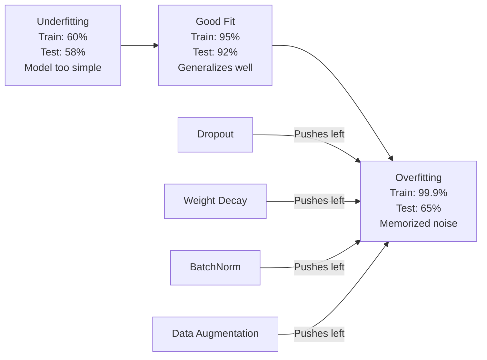
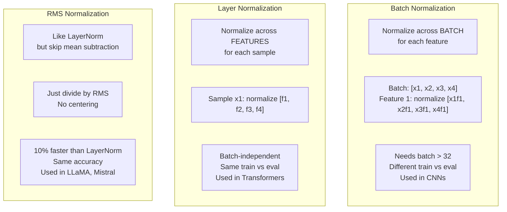
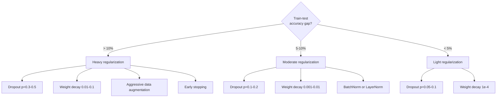

# 规范化

> 你的模型得到了99%的训练数据和60%的测试数据. 它记得而不是学习.规范化是你对复杂性征收的税收,

**Type:** Build
**Languages:** Python
**Prerequisites:** Lesson 03.06 (Optimizers)
**Time:** ~75 minutes

## 学习目标

- 实现倒置缩放,L2体重衰减,批量正常化,层正常化和从零开始的RMSNorm
- 测量火车测试精度差距,并通过规范化实验诊断过度适应
- 解释为什么变压器使用LayerNorm而不是BatchNorm,以及为什么现代LLM更喜欢RMSNorm
- 根据过度适应的严重性,应对正确的规范技术组合

## 问题

网络具有足够的参数可以记住任何数据集.这不是假设的 - 张等人 (2017) 通过在图像网上训练标准网络随机标签证明了这一点.网络在完全随机标签任务上达到接近零的训练损失.他们记住了百万个随机输入输出对,没有学习的模式.训练损失是完美的.测试精度是零.

由于这种情况,GPT-3的训练组具有约500亿个代币. 随着这么多的参数,模型具有足够的能力来文字记住大量的训练数据. 如果没有规范化,它只会重新生成训练示例,而不是学习可通用模式.

训练性能和测试性能之间的差距是过度适应的差距. 每个技术都从不同的角度攻击了这个差距. 由于失效,网络不依赖任何一个神经元. 减肥可以防止任何体重变得过大. 批量正常化使损失景观平滑,使优化器发现更平坦,更可通用的最小值. 层正常化也会做同样的事情,但在批量正常化失败的情况下就能工作 (小批量,变长序列). 通过降低平均计算,RMSNorm可以更快10%. 每个技术都是简单的. 它们是记忆模型和概括模型之间的区别.

## 概念

### 过度适应的频谱

每个模型都在某个频谱上坐落,从不适合 (太简单无法捕捉模式) 到超适合 (太复杂以捕捉噪音).



### 放弃

在训练中,随机设置每个神经元的输出到零,概率为p.

```
output = activation(z) * mask    where mask[i] ~ Bernoulli(1 - p)
```

网络必须学习冗余的表达,因为它无法预测哪些神经元将会有. 这阻止了共适应 - - 神经元学习依赖其他特定的神经元存在.

综合解释:一个网络中N神经元和中断产生2^N可能的子网络 (每个神经元的组合都开放或关闭). 训练与中断约同时训练2^N子网络,每个分类在不同的小批量. 在测试时,你使用所有神经元 (没有放弃) 并将输出量量达 (1 - p) 来匹配训练期间预期的值. 这相当于平均2^N子网络的预测 - - 一个单个模型的巨大组.

实际上,在训练期间使用扩展而不是测试 (反转放弃):

```
During training:  output = activation(z) * mask / (1 - p)
During testing:   output = activation(z)   (no change needed)
```

这更干净,因为测试代码根本不需要知道退学.

默认故障率:变压器的p = 0.1,MLP的p = 0.5 ,CNN的p = 0.2-0.3.

### 体重减退 (L2规律化)

增加所有权重的平方大小:

```
total_loss = task_loss + (lambda / 2) * sum(w_i^2)
```

规律化术语的梯度是lambda * w. 这意味着每一步,每个重量都缩小到零的比例.大重量受到更多的惩罚.模型被推向没有单个重量主导的解决方案.

为什么这有助于通用化:超级适应型号往往具有大重量,这会在训练数据中放大噪音.体重衰减使重量保持小,从而限制了模型的有效能力,迫使其依赖于强,可通用的特性而不是记忆的奇怪.

果超值控制强度.

- 转变器的 AdamW 0.01
- 对于CNN电视台的SGD,
- 0.1 适合重量超级型号

根据第06课中所述,体重减轻和L2规则化在SGD中相当,但在亚当中不是.

### 批量正常化

在将其传递到下一个层之前,将每个层的输出正常化在迷你批量中.

对于某个层中的小型激活:

```
mu = (1/B) * sum(x_i)           (batch mean)
sigma^2 = (1/B) * sum((x_i - mu)^2)   (batch variance)
x_hat = (x_i - mu) / sqrt(sigma^2 + eps)   (normalize)
y = gamma * x_hat + beta        (scale and shift)
```

没有它们,你将迫使每个层的输出变化为零平均单位变化,这可能不是网络想要的.

**Training vs inference split:**在训练期间,mu和sigma来自当前的迷你批量.在推断过程中,你使用训练期间积累的运行平均值 (动力率为0.1的指数,即90%旧 +10%新).

现在还有人讨论 BatchNorm 为什么工作. 原文声称它减少了"内部变量转移" (随着早期层更新而变化的层输入分布). 桑图尔卡等 (2018) 显示了这种解释是错误的. 实际原因是,BatchNorm使损失景观更加平滑. 梯度更具预测性,利普斯奇特常数更小,优化器可以安全地采取更大的步骤. 这就是为什么BatchNorm允许你使用更高的学习率,

批量规则有一个基本的局限性:它取决于批量统计.在批量大小1时,平均和差异是无意义的.在小批量 (<32),统计数据是噪音和损伤性能.这对于对象检测 (记忆限制批量大小) 和语言建模 (测序长度不同的地方) 等任务来说很重要.

### 层正常化

标准化在各个特征上,而不是在整个批量上.

```
mu = (1/D) * sum(x_j)           (feature mean)
sigma^2 = (1/D) * sum((x_j - mu)^2)   (feature variance)
x_hat = (x_j - mu) / sqrt(sigma^2 + eps)
y = gamma * x_hat + beta
```

变压器使用LayerNorm而不是 BatchNorm.序列的长度可变,批量大小通常很小 (或在生成过程中是1),训练和推断之间的计算是相同的.

在变压器中,LayerNorm应在每一个自我注意区块和每一个输送前进区块 (后LN) 后或之前 (前LN,更稳定于训练).

### 标准

没有平均减小的LayerNorm. 张和森尼里希 (2019) 提出.

```
rms = sqrt((1/D) * sum(x_j^2))
y = gamma * x / rms
```

没有平均计算,没有beta参数.观察:LayerNorm中重中心化 (平均减小) 对模型的性能贡献很少,但成本计算.删除它会带来同样的精度,大约10%的总成本.

,,,,,,,,,,,,,,,,,,,,,,,,,,,,,,,,,,,,,,,,,,,,,,,,,,,,,,,,,,,,,,,,,,,,,,,,,,,,,,,,,,,,,,,,,,,,,,,,,,,,,,,,,,,,,,,,,,,,,,,,,,,,,,,,,,,,,,,,,,,,,,,,,,,,,,,,,,,,,,,,,,,,,,,,,,,,,,,,,,,,,,,,,,,,,,,,,,,,,,,,,,,,,,,,,,,,,,,,,,,,,,,,,,,,,,,,,,,,,,,,,,,,,,,,,,,,,,

### 规范化比较



### 数据增长作为规范化

转换训练输入,同时保留标签:

- 图像:随机收获,翻转,旋转,颜色动,切割
- 文字:代名词的替代,回译,随机删除
- 音频:时间延伸,音调转移,噪音增加

效果与规律化相同:它增加了训练集的实际尺寸,使得模型更难记住特定的例子.只能在原始形式中看到每个图像的模型只能记住它.看到每个图像的50个增强版本的模型被迫学习不变结构.

### 早期停止

最简单的调节剂:在验证损失开始增加时停止训练.模型尚未过度适应.实际上,您每一个时代都会跟踪验证损失,保存最好的模型,并继续训练,以实现"耐心"窗口 (通常5-20个时代).如果验证损失在耐心窗口内没有改善,您就会停止和加载最好的保存模型.

### 什么时候应用



```figure
l2-regularization
```

## 建立它

### 步骤1:放弃 (列车和Eval模式)

```python
import random
import math


class Dropout:
    def __init__(self, p=0.5):
        self.p = p
        self.training = True
        self.mask = None

    def forward(self, x):
        if not self.training:
            return list(x)
        self.mask = []
        output = []
        for val in x:
            if random.random() < self.p:
                self.mask.append(0)
                output.append(0.0)
            else:
                self.mask.append(1)
                output.append(val / (1 - self.p))
        return output

    def backward(self, grad_output):
        grads = []
        for g, m in zip(grad_output, self.mask):
            if m == 0:
                grads.append(0.0)
            else:
                grads.append(g / (1 - self.p))
        return grads
```

### 步骤2:L2体重衰减

```python
def l2_regularization(weights, lambda_reg):
    penalty = 0.0
    for w in weights:
        penalty += w * w
    return lambda_reg * 0.5 * penalty

def l2_gradient(weights, lambda_reg):
    return [lambda_reg * w for w in weights]
```

### 步骤3:批量正常化

```python
class BatchNorm:
    def __init__(self, num_features, momentum=0.1, eps=1e-5):
        self.gamma = [1.0] * num_features
        self.beta = [0.0] * num_features
        self.eps = eps
        self.momentum = momentum
        self.running_mean = [0.0] * num_features
        self.running_var = [1.0] * num_features
        self.training = True
        self.num_features = num_features

    def forward(self, batch):
        batch_size = len(batch)
        if self.training:
            mean = [0.0] * self.num_features
            for sample in batch:
                for j in range(self.num_features):
                    mean[j] += sample[j]
            mean = [m / batch_size for m in mean]

            var = [0.0] * self.num_features
            for sample in batch:
                for j in range(self.num_features):
                    var[j] += (sample[j] - mean[j]) ** 2
            var = [v / batch_size for v in var]

            for j in range(self.num_features):
                self.running_mean[j] = (1 - self.momentum) * self.running_mean[j] + self.momentum * mean[j]
                self.running_var[j] = (1 - self.momentum) * self.running_var[j] + self.momentum * var[j]
        else:
            mean = list(self.running_mean)
            var = list(self.running_var)

        self.x_hat = []
        output = []
        for sample in batch:
            normalized = []
            out_sample = []
            for j in range(self.num_features):
                x_h = (sample[j] - mean[j]) / math.sqrt(var[j] + self.eps)
                normalized.append(x_h)
                out_sample.append(self.gamma[j] * x_h + self.beta[j])
            self.x_hat.append(normalized)
            output.append(out_sample)
        return output
```

### 步骤4: 层正常化

```python
class LayerNorm:
    def __init__(self, num_features, eps=1e-5):
        self.gamma = [1.0] * num_features
        self.beta = [0.0] * num_features
        self.eps = eps
        self.num_features = num_features

    def forward(self, x):
        mean = sum(x) / len(x)
        var = sum((xi - mean) ** 2 for xi in x) / len(x)

        self.x_hat = []
        output = []
        for j in range(self.num_features):
            x_h = (x[j] - mean) / math.sqrt(var + self.eps)
            self.x_hat.append(x_h)
            output.append(self.gamma[j] * x_h + self.beta[j])
        return output
```

### 步骤5:RMSNorm

```python
class RMSNorm:
    def __init__(self, num_features, eps=1e-6):
        self.gamma = [1.0] * num_features
        self.eps = eps
        self.num_features = num_features

    def forward(self, x):
        rms = math.sqrt(sum(xi * xi for xi in x) / len(x) + self.eps)
        output = []
        for j in range(self.num_features):
            output.append(self.gamma[j] * x[j] / rms)
        return output
```

### 第六步: 训练,不定期训练

```python
def sigmoid(x):
    x = max(-500, min(500, x))
    return 1.0 / (1.0 + math.exp(-x))


def make_circle_data(n=200, seed=42):
    random.seed(seed)
    data = []
    for _ in range(n):
        x = random.uniform(-2, 2)
        y = random.uniform(-2, 2)
        label = 1.0 if x * x + y * y < 1.5 else 0.0
        data.append(([x, y], label))
    return data


class RegularizedNetwork:
    def __init__(self, hidden_size=16, lr=0.05, dropout_p=0.0, weight_decay=0.0):
        random.seed(0)
        self.hidden_size = hidden_size
        self.lr = lr
        self.dropout_p = dropout_p
        self.weight_decay = weight_decay
        self.dropout = Dropout(p=dropout_p) if dropout_p > 0 else None

        self.w1 = [[random.gauss(0, 0.5) for _ in range(2)] for _ in range(hidden_size)]
        self.b1 = [0.0] * hidden_size
        self.w2 = [random.gauss(0, 0.5) for _ in range(hidden_size)]
        self.b2 = 0.0

    def forward(self, x, training=True):
        self.x = x
        self.z1 = []
        self.h = []
        for i in range(self.hidden_size):
            z = self.w1[i][0] * x[0] + self.w1[i][1] * x[1] + self.b1[i]
            self.z1.append(z)
            self.h.append(max(0.0, z))

        if self.dropout and training:
            self.dropout.training = True
            self.h = self.dropout.forward(self.h)
        elif self.dropout:
            self.dropout.training = False
            self.h = self.dropout.forward(self.h)

        self.z2 = sum(self.w2[i] * self.h[i] for i in range(self.hidden_size)) + self.b2
        self.out = sigmoid(self.z2)
        return self.out

    def backward(self, target):
        eps = 1e-15
        p = max(eps, min(1 - eps, self.out))
        d_loss = -(target / p) + (1 - target) / (1 - p)
        d_sigmoid = self.out * (1 - self.out)
        d_out = d_loss * d_sigmoid

        for i in range(self.hidden_size):
            d_relu = 1.0 if self.z1[i] > 0 else 0.0
            d_h = d_out * self.w2[i] * d_relu
            self.w2[i] -= self.lr * (d_out * self.h[i] + self.weight_decay * self.w2[i])
            for j in range(2):
                self.w1[i][j] -= self.lr * (d_h * self.x[j] + self.weight_decay * self.w1[i][j])
            self.b1[i] -= self.lr * d_h
        self.b2 -= self.lr * d_out

    def evaluate(self, data):
        correct = 0
        total_loss = 0.0
        for x, y in data:
            pred = self.forward(x, training=False)
            eps = 1e-15
            p = max(eps, min(1 - eps, pred))
            total_loss += -(y * math.log(p) + (1 - y) * math.log(1 - p))
            if (pred >= 0.5) == (y >= 0.5):
                correct += 1
        return total_loss / len(data), correct / len(data) * 100

    def train_model(self, train_data, test_data, epochs=300):
        history = []
        for epoch in range(epochs):
            total_loss = 0.0
            correct = 0
            for x, y in train_data:
                pred = self.forward(x, training=True)
                self.backward(y)
                eps = 1e-15
                p = max(eps, min(1 - eps, pred))
                total_loss += -(y * math.log(p) + (1 - y) * math.log(1 - p))
                if (pred >= 0.5) == (y >= 0.5):
                    correct += 1
            train_loss = total_loss / len(train_data)
            train_acc = correct / len(train_data) * 100
            test_loss, test_acc = self.evaluate(test_data)
            history.append((train_loss, train_acc, test_loss, test_acc))
            if epoch % 75 == 0 or epoch == epochs - 1:
                gap = train_acc - test_acc
                print(f"    Epoch {epoch:3d}: train_acc={train_acc:.1f}%, test_acc={test_acc:.1f}%, gap={gap:.1f}%")
        return history
```

## 用它

PyTorch提供了所有正常化和规律化的模块:

```python
import torch
import torch.nn as nn

model = nn.Sequential(
    nn.Linear(784, 256),
    nn.BatchNorm1d(256),
    nn.ReLU(),
    nn.Dropout(0.3),
    nn.Linear(256, 128),
    nn.BatchNorm1d(128),
    nn.ReLU(),
    nn.Dropout(0.3),
    nn.Linear(128, 10),
)

model.train()
out_train = model(torch.randn(32, 784))

model.eval()
out_test = model(torch.randn(1, 784))
```

其他`model.train()`现在,`model.eval()`切换关键. 它将停机关关闭/关闭开关,并告诉BatchNorm使用批量统计与运行统计. 忘记`model.eval()`测试精度会随机波动,因为中断仍然活跃,而BatchNorm正在使用迷你批量统计数据.

对于变压器来说,模式不同:

```python
class TransformerBlock(nn.Module):
    def __init__(self, d_model=512, nhead=8, dropout=0.1):
        super().__init__()
        self.attention = nn.MultiheadAttention(d_model, nhead, dropout=dropout)
        self.norm1 = nn.LayerNorm(d_model)
        self.ff = nn.Sequential(
            nn.Linear(d_model, d_model * 4),
            nn.GELU(),
            nn.Linear(d_model * 4, d_model),
            nn.Dropout(dropout),
        )
        self.norm2 = nn.LayerNorm(d_model)
        self.dropout = nn.Dropout(dropout)

    def forward(self, x):
        attended, _ = self.attention(x, x, x)
        x = self.norm1(x + self.dropout(attended))
        x = self.norm2(x + self.ff(x))
        return x
```

没有什么变压器,没有什么变压器.

## 运送它

这一课产生了:
- `outputs/prompt-regularization-advisor.md`-- 提示诊断过度适应,并建议正确的规范化策略

## 运动

1. 实现2D数据的空间放弃:而不是放弃单个神经元,放弃整个功能道.通过将连续特征的组作为道和放弃整个组来模拟这一点.将火车测试差距与圆数据集中的标准放弃相比较,以 hidden_size=32.

2. 执行从05课开始的标签滑滑,并与从本课结束的排行. 训练有四个配置:没有,只放弃,只放标. 测量每个列车测试的最终精度差距.哪个组合给出最小的差距?

3. 在隐藏层和您的圆数据集网络中的激活之间添加一个BatchNorm层. 在学习率0.01,0.05和0.1的情况下与 BatchNorm一起和没有 BatchNorm一起训练.

4. 执行早期停止:每个时代追踪测试损失,节省最佳权重,并在20个时代内测试损失未改善时停止.运行规律化网络1000个时代.报告哪个时代具有最佳测试精度,以及您节省了多少个计算时代.

5. 根据4层网络 (不仅是2) 的LayerNorm与RMSNorm比较. 启动两者均重量. 训练200个时代,并对比最后的精度,训练速度 (时间每时代),和梯度大小在第一层. 检查RMSNorm是更快的与相同的精度.

## 关键词

| Term | What people say | What it actually means |
|------|----------------|----------------------|
| Overfitting | "Model memorized the data" | When a model's training performance significantly exceeds its test performance, indicating it learned noise rather than signal |
| Regularization | "Preventing overfitting" | Any technique that constrains model complexity to improve generalization: dropout, weight decay, normalization, augmentation |
| Dropout | "Random neuron deletion" | Zeroing random neurons during training with probability p, forcing redundant representations; equivalent to training an ensemble |
| Weight decay | "L2 penalty" | Shrinking all weights toward zero by subtracting lambda * w at each step; penalizes complexity through weight magnitude |
| Batch normalization | "Normalize per batch" | Normalizing layer outputs across the batch dimension using batch statistics during training and running averages during inference |
| Layer normalization | "Normalize per sample" | Normalizing across features within each sample; batch-independent, used in transformers where batch size varies |
| RMSNorm | "LayerNorm without the mean" | Root mean square normalization; drops the mean subtraction from LayerNorm for 10% speedup with equal accuracy |
| Early stopping | "Stop before overfit" | Halting training when validation loss stops improving; the simplest regularizer, often used alongside others |
| Data augmentation | "More data from less" | Transforming training inputs (flip, crop, noise) to increase effective dataset size and force invariance learning |
| Generalization gap | "Train-test split" | The difference between training and test performance; regularization aims to minimize this gap |

## 进一步阅读

- 斯里瓦斯塔瓦等人",脱离:防止神经网络过度适应的简单方法" (2014) - - 带有组合解释和广泛的实验的原始脱离论文
- 伊夫夫和谢杰迪, "批量正常化:通过减少内部变量转移加速深度网络培训" (2015) -- 介绍了BatchNorm及其培训程序,这是最受引用的深度学习论文之一
- 张和森里希,"根中方层正常化" (2019) -- 显示RMSNorm与LayerNorm的准确性相匹配,计算量减少; LLaMA和Mistral采用
- 张等人",理解深度学习需要重新思考通用化" (2017) -- 展示神经网络能够记住随机标签的具有里程碑意义的论文,挑战了传统的通用化观点
