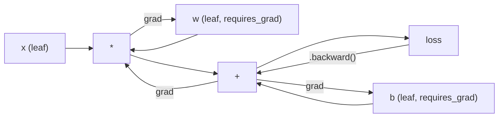
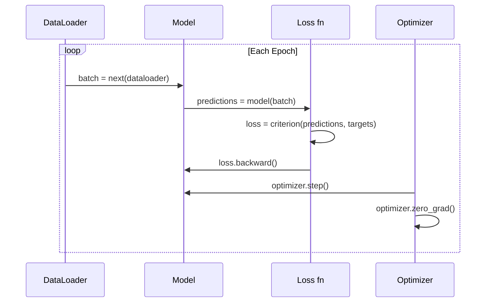

# 介绍PyTorch

> 你用和杆建造了引擎,现在学会每个人真正驾驶的引擎.

**Type:** Build
**Languages:** Python
**Prerequisites:** Lesson 03.10 (Build Your Own Mini Framework)
**Time:** ~75 minutes

## 学习目标

- 使用 PyTorch 的 nn.Module, nn.Sequential 和 autograd 构建和训练神经网络
- 使用PyTorch光器,GPU加速和标准训练循环 (零_级,前进,损失,后退,步骤)
- 转换从零开始的迷你框架组件到它们的PyTorch等级
- 简介和比较您的纯Python框架和PyTorch在同一任务中训练速度

## 问题

您有一个工作的迷你框架.线性层,ReLU,脱落,批量标准,亚当,数据加载器,训练循环.它训练一个四层网络在纯Python中循环分类问题.

对于同样的问题,它也比PyTorch慢500倍.

您的迷你框架一次处理一个样本,使用嵌入式Python循环. PyTorch将相同的操作发送到优化的C++/CUDA内核,运行在GPU上.在单个NVIDIA A100上, PyTorch在 ImageNet上训练一个ResNet-50 (25.6M参数) 在约6小时内.

速度不是唯一的差距.你的框架没有GPU支持.没有自动区分 - - 你手写向后的每个模块.没有序列化.没有分布式训练.没有混合精度.没有方法去调整梯度流程没有打印声明.

PyTorch填补了这些空白.它保持了你已经构建的相同的心理模型:模块,前(),参数(),向后),优化.步骤().概念将一个接一个转移.语法几乎是一样的.区别是 PyTorch 包裹了你从零开始设计的相同界面后的十年系统工程.

## 概念

### 为什么皮托奇赢得了

在2015年, TensorFlow要求你在运行任何东西之前定义静态计算图.你构建图,编译它,然后通过它输送数据.调整意味着着图的可视化.改变架构意味着从零开始重建图.

鱼在2017年推出了不同的理念:渴望执行.你写Python.它立即运行.`y = model(x)`这意味着标准的Python调试工具工作.打印() 工作. pdb工作.如果/else 在你的前进通行工作.

截至2020年,市场已经开始出现.PyTorch在ML研究论文中的份额从7% (2017) 增加到75% (2022).Meta,Google DeepMind,OpenAI,Anthropic和 Hugging Face都使用PyTorch作为其主要框架.TensorFlow 2.x以响应为例,采取了热情执行 - 默认承认PyTorch的设计是正确的.

开发人员经验组合.一个软件框架每次都会有10%的速度慢,但50%的速度更快.

### 电压器

子是一个多维数组,具有三个关键性质:形状,d类型和设备.

```python
import torch

x = torch.zeros(3, 4)           # shape: (3, 4), dtype: float32, device: cpu
x = torch.randn(2, 3, 224, 224) # batch of 2 RGB images, 224x224
x = torch.tensor([1, 2, 3])     # from a Python list
```

**Shape**尺度是形状 (),向量是 (n),矩阵是 (m,n),图像是一批 (批量,道,高度,宽度).

**Dtype**控制精度和记忆力.

| dtype | Bits | Range | Use case |
|-------|------|-------|----------|
| float32 | 32 | ~7 decimal digits | Default training |
| float16 | 16 | ~3.3 decimal digits | Mixed precision |
| bfloat16 | 16 | Same range as float32, less precision | LLM training |
| int8 | 8 | -128 to 127 | Quantized inference |

**Device**计算的发生地.

```python
device = torch.device("cuda" if torch.cuda.is_available() else "cpu")
x = torch.randn(3, 4, device=device)
x = x.to("cuda")
x = x.cpu()
```

任何操作都需要所有电压器在同一设备上.这是第1个PyTorch错误初学者击中:`RuntimeError: Expected all tensors to be on the same device`在计算之前,把所有东西移到同一设备上来解决.

**Reshaping**它改变了元数据,而不是数据.

```python
x = torch.randn(2, 3, 4)
x.view(2, 12)      # reshape to (2, 12) -- must be contiguous
x.reshape(6, 4)    # reshape to (6, 4) -- works always
x.permute(2, 0, 1) # reorder dimensions
x.unsqueeze(0)     # add dimension: (1, 2, 3, 4)
x.squeeze()        # remove size-1 dimensions
```

### 澳门威尼斯人

您的迷你框架需要您对每个模块实现向后 (), pyTorch 不会.它将所有子的操作记录在一个指导的循环图 (计算图) 中,然后反向通过该图以自动计算梯度.



根据PyTorch的数据,每一个操作都在前进传递过程中附加在"磁带"上.`.backward()`转换成反向的磁带.

```python
x = torch.randn(3, requires_grad=True)
y = x ** 2 + 3 * x
z = y.sum()
z.backward()
print(x.grad)  # dz/dx = 2x + 3
```

排行榜的三个规则:

1. 只有叶子子`requires_grad=True`积累梯度
2. 基准默认积累 - 调用`optimizer.zero_grad()`在每次倒退前
3. `torch.no_grad()`禁用梯度跟踪 (评估期间使用)

### nn.模块

`nn.Module`在PyTorch中,每个神经网络组件的基类.你已经在10课程中构建了这个抽象.PyTorch的版本添加了自动参数注册,递归模块发现,设备管理和状态命令序列化.

```python
import torch.nn as nn

class MLP(nn.Module):
    def __init__(self, input_dim, hidden_dim, output_dim):
        super().__init__()
        self.layer1 = nn.Linear(input_dim, hidden_dim)
        self.relu = nn.ReLU()
        self.layer2 = nn.Linear(hidden_dim, output_dim)

    def forward(self, x):
        x = self.layer1(x)
        x = self.relu(x)
        x = self.layer2(x)
        return x
```

当你分配一个`nn.Module`或`nn.Parameter`作为一个属性`__init__`火器自动记录它.`model.parameters()`这就是为什么你永远不必手动收集重量,就像你在迷你框架中做的那样.

基本的建筑物:

| Module | What it does | Parameters |
|--------|-------------|------------|
| nn.Linear(in, out) | Wx + b | in*out + out |
| nn.Conv2d(in_ch, out_ch, k) | 2D convolution | in_ch*out_ch*k*k + out_ch |
| nn.BatchNorm1d(features) | Normalize activations | 2 * features |
| nn.Dropout(p) | Random zeroing | 0 |
| nn.ReLU() | max(0, x) | 0 |
| nn.GELU() | Gaussian error linear | 0 |
| nn.Embedding(vocab, dim) | Lookup table | vocab * dim |
| nn.LayerNorm(dim) | Per-sample normalization | 2 * dim |

### 损失功能和优化器

皮托奇将你建造的产品全部交付到生产.

**Loss functions**(从`torch.nn`):

| Loss | Task | Input |
|------|------|-------|
| nn.MSELoss() | Regression | Any shape |
| nn.CrossEntropyLoss() | Multi-class classification | Logits (not softmax) |
| nn.BCEWithLogitsLoss() | Binary classification | Logits (not sigmoid) |
| nn.L1Loss() | Regression (robust) | Any shape |
| nn.CTCLoss() | Sequence alignment | Log probabilities |

备注:`CrossEntropyLoss`结合`LogSoftmax`其他`NLLLoss`通过原始的输出,而不是软max输出.这是一个常见的错误,

**Optimizers**(从`torch.optim`):

| Optimizer | When to use | Typical LR |
|-----------|-------------|-----------|
| SGD(params, lr, momentum) | CNNs, well-tuned pipelines | 0.01--0.1 |
| Adam(params, lr) | Default starting point | 1e-3 |
| AdamW(params, lr, weight_decay) | Transformers, fine-tuning | 1e-4--1e-3 |
| LBFGS(params) | Small-scale, second-order | 1.0 |

### 训练循环

每个PyTorch训练循环都遵循相同的5步模式.



圣经模式:

```python
for epoch in range(num_epochs):
    model.train()
    for inputs, targets in train_loader:
        inputs, targets = inputs.to(device), targets.to(device)
        optimizer.zero_grad()
        outputs = model(inputs)
        loss = criterion(outputs, targets)
        loss.backward()
        optimizer.step()
```

五条线在批量循环中,五条线训练了GPT-4,稳定扩散和LLaMA. 结构改变. 数据改变.

### 数据集和数据载体

皮托尔奇的`Dataset`是一个具有两个方法的抽象类: `__len__`其他`__getitem__`现在,我们要去.`DataLoader`通过批量,混动和多个进程数据加载.

```python
from torch.utils.data import Dataset, DataLoader

class MNISTDataset(Dataset):
    def __init__(self, images, labels):
        self.images = images
        self.labels = labels

    def __len__(self):
        return len(self.labels)

    def __getitem__(self, idx):
        return self.images[idx], self.labels[idx]

loader = DataLoader(dataset, batch_size=64, shuffle=True, num_workers=4)
```

`num_workers=4`在磁盘上绑定工作负载 (大图像,音频),这单独可以翻倍训练速度.

###  GPU 训练

将模型移动到GPU:

```python
device = torch.device("cuda" if torch.cuda.is_available() else "cpu")
model = model.to(device)
```

后者将每个参数和缓冲器转移到GPU.

```python
inputs, targets = inputs.to(device), targets.to(device)
```

**Mixed precision**通过在 float16 中运行向前/向后,同时保持在 float32 中的主权重,将内存使用量减半,并将现代GPU (A100,H100,RTX 4090) 的吞吐量翻倍:

```python
from torch.amp import autocast, GradScaler

scaler = GradScaler()
for inputs, targets in loader:
    with autocast(device_type="cuda"):
        outputs = model(inputs)
        loss = criterion(outputs, targets)
    scaler.scale(loss).backward()
    scaler.step(optimizer)
    scaler.update()
    optimizer.zero_grad()
```

### 比较:迷你框架vs PyTorchvs JAX

| Feature | Mini Framework (L10) | PyTorch | JAX |
|---------|---------------------|---------|-----|
| Autodiff | Manual backward() | Tape-based autograd | Functional transforms |
| Execution | Eager (Python loops) | Eager (C++ kernels) | Traced + JIT compiled |
| GPU support | No | Yes (CUDA, ROCm, MPS) | Yes (CUDA, TPU) |
| Speed (MNIST MLP) | ~300s/epoch | ~0.5s/epoch | ~0.3s/epoch |
| Module system | Custom Module class | nn.Module | Stateless functions (Flax/Equinox) |
| Debugging | print() | print(), pdb, breakpoint() | Harder (JIT tracing breaks print) |
| Ecosystem | None | Hugging Face, Lightning, timm | Flax, Optax, Orbax |
| Learning curve | You built it | Moderate | Steep (functional paradigm) |
| Production use | Toy problems | Meta, OpenAI, Anthropic, HF | Google DeepMind, Midjourney |

```figure
dropout-mask
```

## 建立它

只有PyTorch原始的MLP,没有高层包装.`torchvision.datasets`我们自己下载和分析原始数据.

### 步骤1:从原始文件中加载MNIST

MNIST 作为4个gzipped文件:训练图像 (60,000 x 28 x 28),训练标签,测试图像 (10,000 x 28 x 28),测试标签.我们下载它们并分析二进制格式.

```python
import torch
import torch.nn as nn
import struct
import gzip
import urllib.request
import os

def download_mnist(path="./mnist_data"):
    base_url = "https://storage.googleapis.com/cvdf-datasets/mnist/"
    files = [
        "train-images-idx3-ubyte.gz",
        "train-labels-idx1-ubyte.gz",
        "t10k-images-idx3-ubyte.gz",
        "t10k-labels-idx1-ubyte.gz",
    ]
    os.makedirs(path, exist_ok=True)
    for f in files:
        filepath = os.path.join(path, f)
        if not os.path.exists(filepath):
            urllib.request.urlretrieve(base_url + f, filepath)

def load_images(filepath):
    with gzip.open(filepath, "rb") as f:
        magic, num, rows, cols = struct.unpack(">IIII", f.read(16))
        data = f.read()
        images = torch.frombuffer(bytearray(data), dtype=torch.uint8)
        images = images.reshape(num, rows * cols).float() / 255.0
    return images

def load_labels(filepath):
    with gzip.open(filepath, "rb") as f:
        magic, num = struct.unpack(">II", f.read(8))
        data = f.read()
        labels = torch.frombuffer(bytearray(data), dtype=torch.uint8).long()
    return labels
```

### 第二步:定义模型

排列三的 MLP: 784 -> 256 -> 128 -> 10. ReLU 激活. 放弃规则化. 没有批量规范,保持简单.

```python
class MNISTModel(nn.Module):
    def __init__(self):
        super().__init__()
        self.net = nn.Sequential(
            nn.Linear(784, 256),
            nn.ReLU(),
            nn.Dropout(0.2),
            nn.Linear(256, 128),
            nn.ReLU(),
            nn.Dropout(0.2),
            nn.Linear(128, 10),
        )

    def forward(self, x):
        return self.net(x)
```

输出层产生10个原始logit (每位数一个).没有软max--`CrossEntropyLoss`内部处理.

参数数:784*256+256+256+256*128+128+128+128*10+10=235,146. 根据现代标准,GPT-2小小有124M. 这在几秒钟内运行.

### 第三步:训练循环

们的前进-损失-后退步骤模式.

```python
def train_one_epoch(model, loader, criterion, optimizer, device):
    model.train()
    total_loss = 0
    correct = 0
    total = 0
    for images, labels in loader:
        images, labels = images.to(device), labels.to(device)
        optimizer.zero_grad()
        outputs = model(images)
        loss = criterion(outputs, labels)
        loss.backward()
        optimizer.step()
        total_loss += loss.item() * images.size(0)
        _, predicted = outputs.max(1)
        correct += predicted.eq(labels).sum().item()
        total += labels.size(0)
    return total_loss / total, correct / total


def evaluate(model, loader, criterion, device):
    model.eval()
    total_loss = 0
    correct = 0
    total = 0
    with torch.no_grad():
        for images, labels in loader:
            images, labels = images.to(device), labels.to(device)
            outputs = model(images)
            loss = criterion(outputs, labels)
            total_loss += loss.item() * images.size(0)
            _, predicted = outputs.max(1)
            correct += predicted.eq(labels).sum().item()
            total += labels.size(0)
    return total_loss / total, correct / total
```

备注`torch.no_grad()`没有它,PyTorch构建一个你从来没有使用的计算图表.

### 第四步:把一切连接在一起

```python
def main():
    device = torch.device("cuda" if torch.cuda.is_available() else "cpu")

    download_mnist()
    train_images = load_images("./mnist_data/train-images-idx3-ubyte.gz")
    train_labels = load_labels("./mnist_data/train-labels-idx1-ubyte.gz")
    test_images = load_images("./mnist_data/t10k-images-idx3-ubyte.gz")
    test_labels = load_labels("./mnist_data/t10k-labels-idx1-ubyte.gz")

    train_dataset = torch.utils.data.TensorDataset(train_images, train_labels)
    test_dataset = torch.utils.data.TensorDataset(test_images, test_labels)
    train_loader = torch.utils.data.DataLoader(
        train_dataset, batch_size=64, shuffle=True
    )
    test_loader = torch.utils.data.DataLoader(
        test_dataset, batch_size=256, shuffle=False
    )

    model = MNISTModel().to(device)
    criterion = nn.CrossEntropyLoss()
    optimizer = torch.optim.Adam(model.parameters(), lr=1e-3)

    num_params = sum(p.numel() for p in model.parameters())
    print(f"Device: {device}")
    print(f"Parameters: {num_params:,}")
    print(f"Train samples: {len(train_dataset):,}")
    print(f"Test samples: {len(test_dataset):,}")
    print()

    for epoch in range(10):
        train_loss, train_acc = train_one_epoch(
            model, train_loader, criterion, optimizer, device
        )
        test_loss, test_acc = evaluate(
            model, test_loader, criterion, device
        )
        print(
            f"Epoch {epoch+1:2d} | "
            f"Train Loss: {train_loss:.4f} | Train Acc: {train_acc:.4f} | "
            f"Test Loss: {test_loss:.4f} | Test Acc: {test_acc:.4f}"
        )

    torch.save(model.state_dict(), "mnist_mlp.pt")
    print(f"\nModel saved to mnist_mlp.pt")
    print(f"Final test accuracy: {test_acc:.4f}")
```

在10个时代后预期输出:测试精度97.8%.CPU训练时间:30秒.GPU:5秒.同样的架构的迷你框架:45分钟.

## 用它

### 快速比较:迷你框架与PyTorch

| Mini Framework (Lesson 10) | PyTorch |
|---------------------------|---------|
| `model = Sequential(Linear(784, 256), ReLU(), ...)` | `model = nn.Sequential(nn.Linear(784, 256), nn.ReLU(), ...)` |
| `pred = model.forward(x)` | `pred = model(x)` |
| `optimizer.zero_grad()` | `optimizer.zero_grad()` |
| `grad = criterion.backward()` then `model.backward(grad)` | `loss.backward()` |
| `optimizer.step()` | `optimizer.step()` |
| No GPU | `model.to("cuda")` |
| Manual backward for every module | Autograd handles everything |

接口几乎是一样的,区别在于罩杯下面的东西.

### 储存和装载模型

```python
torch.save(model.state_dict(), "model.pt")

model = MNISTModel()
model.load_state_dict(torch.load("model.pt", weights_only=True))
model.eval()
```

总是保存`state_dict()`保存模型对象使用,它会破解当你重新编写代码.状态字符是可移植的.

### 学习时间表

```python
scheduler = torch.optim.lr_scheduler.CosineAnnealingLR(
    optimizer, T_max=10
)
for epoch in range(10):
    train_one_epoch(model, train_loader, criterion, optimizer, device)
    scheduler.step()
```

皮托奇发送15多个时间表:StepLR,ExponentialLR,CosineAnnealingLR,OneCycleLR,ReduceLROnPlateau.所有这些都插入了相同的优化界面.

## 运送它

这一课产生的两件文物:

- `outputs/prompt-pytorch-debugger.md`-- 诊断常见的 PyTorch 训练失败的提示
- `outputs/skill-pytorch-patterns.md`-- PyTorch培训模式的技能参考

## 运动

1. **Add batch normalization.**插入`nn.BatchNorm1d`测试精度和训练速度与仅放弃版本的比较.

2. **Implement a learning rate finder.**训练一个时代,学习率呈指数上升 (从1e-7到1.0). 插图损失与 LR. 最佳的 LR是损失开始爬前.使用此来选择一个更好的 LR.

3. **Port to GPU with mixed precision.**加入`torch.amp.autocast`其他`GradScaler`在A100上,预计速度增速2倍.

4. **Build a custom Dataset.**下载Fashion-MNIST (与MNIST相同的格式,但有服装).`FashionMNISTDataset(Dataset)`课程`__getitem__`其他`__len__`时尚-MNIST更难,预计88%与98%

5. **Replace Adam with SGD + momentum.**列车`SGD(params, lr=0.01, momentum=0.9)`现在,我们可以将它们比较到一个`CosineAnnealingLR`时间表,看看 SGD是否能在10时代赶上亚当.

## 关键词

| Term | What people say | What it actually means |
|------|----------------|----------------------|
| Tensor | "A multi-dimensional array" | A typed, device-aware array with automatic differentiation support baked into every operation |
| Autograd | "Automatic backprop" | A tape-based system that records operations during forward pass, then replays them in reverse to compute exact gradients |
| nn.Module | "A layer" | The base class for any differentiable computation block -- registers parameters, supports nesting, handles train/eval modes |
| state_dict | "The model weights" | An OrderedDict mapping parameter names to tensors -- the portable, serializable representation of a trained model |
| .backward() | "Compute gradients" | Traverse the computational graph in reverse, computing and accumulating gradients for every leaf tensor with requires_grad=True |
| .to(device) | "Move to GPU" | Recursively transfer all parameters and buffers to the specified device (CPU, CUDA, MPS) |
| DataLoader | "The data pipeline" | An iterator that batches, shuffles, and optionally parallelizes data loading from a Dataset |
| Mixed precision | "Use float16" | Train with float16 forward/backward for speed while keeping float32 master weights for numerical stability |
| Eager execution | "Run it now" | Operations execute immediately when called, not deferred to a later compilation step -- the core design choice that differentiates PyTorch from TF 1.x |
| zero_grad | "Reset gradients" | Set all parameter gradients to zero before the next backward pass, since PyTorch accumulates gradients by default |

## 进一步阅读

- 帕斯克等人",PyTorch:一个强迫式风格,高性能深度学习图书馆" (2019) -- 解释PyTorch的设计交易的原始论文
- 火器教程: "用例子学习火器" (https://pytorch.org/tutorials/beginner/pytorch_with_examples.html) --从子到 nn.Module 的官方路径
- 火器性能调整指南 (https://pytorch.org/tutorials/recipes/recipes/tuning_guide.html) -- 混合精度,数据载体工作者,固定内存和其他生产优化
- 霍拉斯·赫,"让深度学习变得" (https://horace.io/brrr_intro.html) -- 为什么GPU训练是快速的,
