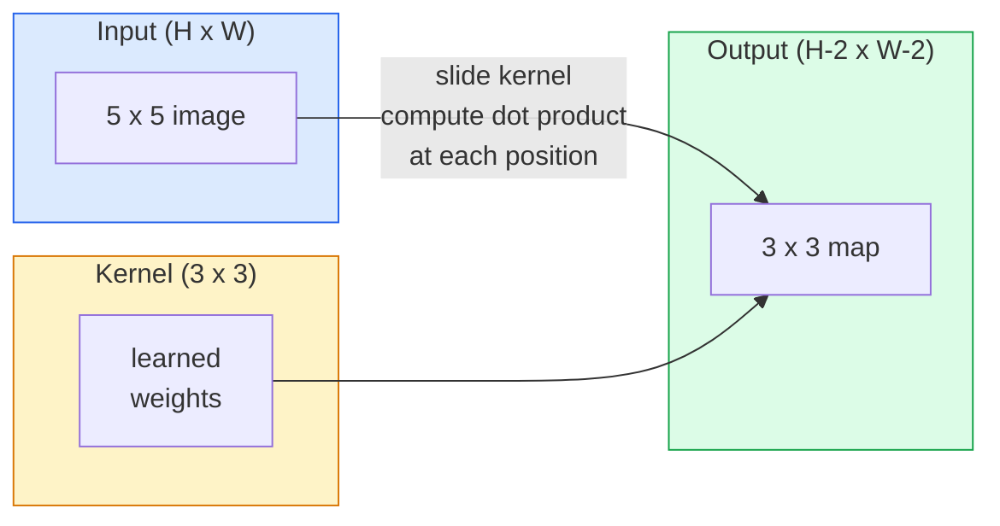
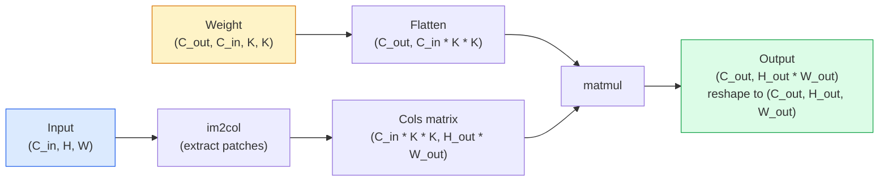

# 从零开始的转变

> 卷积是一个小的密集层,你在图像上滑过,在每个位置都分享相同的重量.

**Type:** Build
**Languages:** Python
**Prerequisites:** Phase 3 (Deep Learning Core), Phase 4 Lesson 01 (Image Fundamentals)
**Time:** ~75 minutes

## 学习目标

- 实现从零开始的2D卷积,仅使用NumPy,包括嵌套循环版本和向量化`im2col`版本
- 计算输出空间大小,内核大小,填充和步骤的任何组合,并证明`(H - K + 2P) / S + 1`公式
- 手工设计的核子 (边缘,模糊,尖,) 并解释为什么每个核子都产生其活动模式
- 堆卷入特征提取器,将堆深度连接到接收场大小

## 问题

对于一个224x224RGB图像的完全连接层,每一个神经元需要224*224*3=150,528个输入权重. 一个隐藏的层有1000个单位,已经有1亿5千万个参数, 更糟糕的是,那层没有任何概念, 上左边的狗和右边的狗是相同的模式. 它将每个像素位置视为独立的, 这对图像来说是完全错误的: 将猫翻译成3像素不应该迫使网络重新学习这个概念.

图像模型需要的两个特性是**translation equivariance**(输出转移时输入转移) 和**parameter sharing**密集层给你没有一个. 缩给你免费的两个.

缩并不是用于深度学习.它是支持JPEG压缩,Photoshop中的高斯模糊,工业视觉中的边缘检测和所有有史以来发送的音频过器的相同操作.CNN在2012年至2020年期间占据了ImageNet的地位,原因是缩是相近的值相关的数据的正确前线,并且可以在任何地方出现相同的模式.

## 概念

### 一个核子,滑动

2D卷积采用一个称为内核 (或过器) 的小重量矩阵,将其滑过输入,并在每个位置计算元素智能的产品的总和.



具体的3x3示例,在5x5输入 (无填充,步骤1):

```
Input X (5 x 5):                Kernel W (3 x 3):

  1  2  0  1  2                   1  0 -1
  0  1  3  1  0                   2  0 -2
  2  1  0  2  1                   1  0 -1
  1  0  2  1  3
  2  1  1  0  1

The kernel slides across every valid 3 x 3 window. Output Y is 3 x 3:

 Y[0,0] = sum( W * X[0:3, 0:3] )
 Y[0,1] = sum( W * X[0:3, 1:4] )
 Y[0,2] = sum( W * X[0:3, 2:5] )
 Y[1,0] = sum( W * X[1:4, 0:3] )
 ... and so on
```

这一公式**shared weights, locality, sliding window**是整个想法. 其余一切都是会计.

### 输出尺寸公式

鉴于输入空间大小`H`核子大小`K`料`P`走进`S`其他:

```
H_out = floor( (H - K + 2P) / S ) + 1
```

记住这一点,你将计算每一个建筑数十倍.

| Scenario | H | K | P | S | H_out |
|----------|---|---|---|---|-------|
| Valid conv, no padding | 32 | 3 | 0 | 1 | 30 |
| Same conv (preserves size) | 32 | 3 | 1 | 1 | 32 |
| Downsample by 2 | 32 | 3 | 1 | 2 | 16 |
| Pool 2x2 | 32 | 2 | 0 | 2 | 16 |
| Large receptive field | 32 | 7 | 3 | 2 | 16 |

"同样的填充"意味着选择P,以便H_out=H当S=1.为奇数K,即P= (K - 1) /2.这就是为什么3x3核主导的.它们是最小的奇数核,仍然有一个中心.

### 子

没有填充,每一个卷积都会缩小特征地图. 堆20个,你的224x224图像变成184x184,这会浪费边界的计算,并使剩余的连接复杂,需要相匹配的形状.

```
Zero padding (P = 1) on a 5 x 5 input:

  0  0  0  0  0  0  0
  0  1  2  0  1  2  0
  0  0  1  3  1  0  0
  0  2  1  0  2  1  0       Now the kernel can centre on pixel
  0  1  0  2  1  3  0       (0, 0) and still have three rows and
  0  2  1  1  0  1  0       three columns of values to multiply.
  0  0  0  0  0  0  0
```

实践中遇到的模式:`zero`子`reflect`(反射边缘,在生成型号中避免硬边界),`replicate`,,,,,,,,,,,,,,,,,,,,,,,,,,,,,,,,,,,,,,,,,,,,,,,,,,,,,,,,,,,,,,,,,,,,,,,,,,,,,,,,,,,,,,,,,,,,,,,,,,,,,,,,,,,,,,,,,,,,,,,,,,,,,,,,,,,,,,,,,,,,,,,,,,,,,,,,,,,,,,,,,,,,,,,,,,,,,,,,,,,,,,,,,,,,,,,,,,,,,,,,,,,,,,,,,,,,,,,,,,,,,,,,,`circular`(包裹,用于形问题).

### 步骤

步骤是滑梯的步骤大小. `stride=1`现在,我们可以在线观看.`stride=2`任何现代建筑 (ResNet,ConvNeXt,MobileNet) 都使用步骤式的轮,而不是最大池.

```
Stride 1 on a 5 x 5 input, 3 x 3 kernel:

  starts: (0,0) (0,1) (0,2)        -> output row 0
          (1,0) (1,1) (1,2)        -> output row 1
          (2,0) (2,1) (2,2)        -> output row 2

  Output: 3 x 3

Stride 2 on the same input:

  starts: (0,0) (0,2)              -> output row 0
          (2,0) (2,2)              -> output row 1

  Output: 2 x 2
```

### 多个输入道

实际图像有三个道.RGB输入上的3x3卷积实际上是3x3x3体积:每输入道一个3x3片.在每个空间位置上,你乘以和加在三个片段上并添加一个偏差.

```
Input:   (C_in,  H,  W)        3 x 5 x 5
Kernel:  (C_in,  K,  K)        3 x 3 x 3 (one kernel)
Output:  (1,     H', W')       2D map

For a layer that produces C_out output channels, you stack C_out kernels:

Weight:  (C_out, C_in, K, K)   e.g. 64 x 3 x 3 x 3
Output:  (C_out, H', W')       64 x 3 x 3

Parameter count: C_out * C_in * K * K + C_out   (the + C_out is biases)
```

对于一个模型的设计,最后一行是你计算的.`64 * 3 * 3 * 3 + 64 = 1,792`价格很低.

### 们的法

嵌套循环是容易读取的,但慢的.GPU需要大矩阵乘法. 技巧是:将输入的每个接收场窗口平坦成一个大矩阵的列,将内核平坦成一排,整个卷积变成一个单一的矩阵.



每个生产 conv 实现都是这个加上缓存的各种方法 (直接 conv, Winograd,FFT conv 对于大型内核).理解 im2col,你就明白核心.

### 接收场

一个3x3conv看出9个输入像素. 堆叠两个3x3conv和第二层的神经元看出5x5输入像素.三个3x3conv给出7x7. 一般来说:

```
RF after L stacked K x K convs (stride 1) = 1 + L * (K - 1)

With strides:   RF grows multiplicatively with stride along each layer.
```

整个"3x3全程下降"的原因 (VGG,ResNet,ConvNeXt) 是两个3x3conv看到相同的输入面积,

```figure
convolution-kernel
```

## 建立它

### 步骤1: 置阵列

首先是最小的原始函数:一个函数在H x W阵列周围着零.

```python
import numpy as np

def pad2d(x, p):
    if p == 0:
        return x
    h, w = x.shape[-2:]
    out = np.zeros(x.shape[:-2] + (h + 2 * p, w + 2 * p), dtype=x.dtype)
    out[..., p:p + h, p:p + w] = x
    return out

x = np.arange(9).reshape(3, 3)
print(x)
print()
print(pad2d(x, 1))
```

追踪轴的技巧`x.shape[:-2]`意思是相同的函数在`(H, W)`现在`(C, H, W)`其他`(N, C, H, W)`没有修改.

### 步骤2: 2D 卷积,带有嵌套循环

 缓慢,但明确的参考实施.`torch.nn.functional.conv2d`基本上是这样.

```python
def conv2d_naive(x, w, b=None, stride=1, padding=0):
    c_in, h, w_in = x.shape
    c_out, c_in_w, kh, kw = w.shape
    assert c_in == c_in_w

    x_pad = pad2d(x, padding)
    h_out = (h + 2 * padding - kh) // stride + 1
    w_out = (w_in + 2 * padding - kw) // stride + 1

    out = np.zeros((c_out, h_out, w_out), dtype=np.float32)
    for oc in range(c_out):
        for i in range(h_out):
            for j in range(w_out):
                hs = i * stride
                ws = j * stride
                patch = x_pad[:, hs:hs + kh, ws:ws + kw]
                out[oc, i, j] = np.sum(patch * w[oc])
        if b is not None:
            out[oc] += b[oc]
    return out
```

它们是基于C_in,kh,kw的隐含数量.

### 步骤3:使用手工设计的内核验证

建立一个垂直的索贝尔核,将它应用到合成步骤图像上,

```python
def synthetic_step_image():
    img = np.zeros((1, 16, 16), dtype=np.float32)
    img[:, :, 8:] = 1.0
    return img

sobel_x = np.array([
    [[-1, 0, 1],
     [-2, 0, 2],
     [-1, 0, 1]]
], dtype=np.float32)[None]

x = synthetic_step_image()
y = conv2d_naive(x, sobel_x, padding=1)
print(y[0].round(1))
```

预计在第7列 (左到右亮度增加) 和其他地方的零值上,

### 步骤4: im2col

转换输入中的每个内核大小的窗口为矩阵的列.`C_in=3, K=3`它们的数量为27个.

```python
def im2col(x, kh, kw, stride=1, padding=0):
    c_in, h, w = x.shape
    x_pad = pad2d(x, padding)
    h_out = (h + 2 * padding - kh) // stride + 1
    w_out = (w + 2 * padding - kw) // stride + 1

    cols = np.zeros((c_in * kh * kw, h_out * w_out), dtype=x.dtype)
    col = 0
    for i in range(h_out):
        for j in range(w_out):
            hs = i * stride
            ws = j * stride
            patch = x_pad[:, hs:hs + kh, ws:ws + kw]
            cols[:, col] = patch.reshape(-1)
            col += 1
    return cols, h_out, w_out
```

现在重量起重将是一个单向的.

### 步骤5:通过im2col + matmul快速调整

换一个矩阵乘法.

```python
def conv2d_im2col(x, w, b=None, stride=1, padding=0):
    c_out, c_in, kh, kw = w.shape
    cols, h_out, w_out = im2col(x, kh, kw, stride, padding)
    w_flat = w.reshape(c_out, -1)
    out = w_flat @ cols
    if b is not None:
        out += b[:, None]
    return out.reshape(c_out, h_out, w_out)
```

检查正确性:运行两个实现和比较.

```python
rng = np.random.default_rng(0)
x = rng.normal(0, 1, (3, 16, 16)).astype(np.float32)
w = rng.normal(0, 1, (8, 3, 3, 3)).astype(np.float32)
b = rng.normal(0, 1, (8,)).astype(np.float32)

y_naive = conv2d_naive(x, w, b, padding=1)
y_im2col = conv2d_im2col(x, w, b, padding=1)

print(f"max abs diff: {np.max(np.abs(y_naive - y_im2col)):.2e}")
```

`max abs diff`应该在附近`1e-5`差异是浮点积累顺序,而不是一个bug.

### 步骤 6:手工设计的核子库

五个过器显示一个单层的可以在任何训练之前表达什么.

```python
KERNELS = {
    "identity": np.array([[0, 0, 0], [0, 1, 0], [0, 0, 0]], dtype=np.float32),
    "blur_3x3": np.ones((3, 3), dtype=np.float32) / 9.0,
    "sharpen": np.array([[0, -1, 0], [-1, 5, -1], [0, -1, 0]], dtype=np.float32),
    "sobel_x": np.array([[-1, 0, 1], [-2, 0, 2], [-1, 0, 1]], dtype=np.float32),
    "sobel_y": np.array([[-1, -2, -1], [0, 0, 0], [1, 2, 1]], dtype=np.float32),
}

def apply_kernel(img2d, kernel):
    x = img2d[None].astype(np.float32)
    w = kernel[None, None]
    return conv2d_im2col(x, w, padding=1)[0]
```

应用到任何灰色图像,模糊的软化,尖的升边缘,Sobel-x照亮垂直边缘,Sobel-y照亮水平边缘.这些正是AlexNet和VGG中*第一*训练的 conv层最终学习的模式,因为一个好的图像模型需要边缘和斑点探测器,无论后面的任务是什么.

## 用它

皮托尔奇的`nn.Conv2d`它们是自动化,CUDA核和cuDNN优化.

```python
import torch
import torch.nn as nn

conv = nn.Conv2d(in_channels=3, out_channels=64, kernel_size=3, stride=1, padding=1)
print(conv)
print(f"weight shape: {tuple(conv.weight.shape)}   # (C_out, C_in, K, K)")
print(f"bias shape:   {tuple(conv.bias.shape)}")
print(f"param count:  {sum(p.numel() for p in conv.parameters())}")

x = torch.randn(8, 3, 224, 224)
y = conv(x)
print(f"\ninput  shape: {tuple(x.shape)}")
print(f"output shape: {tuple(y.shape)}")
```

换换`padding=1`为了`padding=0`输出量下降到222x222.`stride=1`为了`stride=2`现在,我们可以把它放在112x112上.

## 运送它

这一课产生了:

- `outputs/prompt-cnn-architect.md`一个提示,鉴于输入大小,参数预算和目标接收场,设计了一个堆`Conv2d`每一步都用右K/S/P的层.
- `outputs/skill-conv-shape-calculator.md`一个技能,它通过网络规格层次进行行程,并返回每个区块的输出形状,接收场和参数数.

## 运动

1. **(Easy)**考虑到 128x128 的灰度输入和一个堆积的`[Conv3x3(s=1,p=1), Conv3x3(s=2,p=1), Conv3x3(s=1,p=1), Conv3x3(s=2,p=1)]`通过 PyTorch 检查,可通过手动计算出输出空间大小和每个层的接收场`nn.Sequential`的车.
2. **(Medium)**延长时间`conv2d_naive`其他`conv2d_im2col`接受一个`groups`证明这个.`groups=C_in=C_out`复制了深度曲,并且其参数数数是`C * K * K`没有`C * C * K * K`现在,我们要去.
3. **(Hard)**执行后退的转移`conv2d_im2col`通过手动计算:鉴于输出梯度,计算出`x`其他`w`检查对`torch.autograd.grad`俩是 im2col 的梯度是`col2im`它们必须积累重叠的窗户.

## 关键词

| Term | What people say | What it actually means |
|------|----------------|----------------------|
| Convolution | "Sliding a filter" | A learnable dot product applied at every spatial location with shared weights; mathematically a cross-correlation, but everyone calls it convolution |
| Kernel / filter | "The feature detector" | A small weight tensor of shape (C_in, K, K) whose dot product with a window of input produces one output pixel |
| Stride | "How far you jump" | The step size between consecutive kernel placements; stride 2 halves each spatial dimension |
| Padding | "Zeros on the edges" | Extra values added around the input so the kernel can centre on border pixels; `same` padding keeps output size equal to input size |
| Receptive field | "How much the neuron sees" | The patch of original input that a given output activation depends on, growing with depth and stride |
| im2col | "The GEMM trick" | Rearranging every receptive window into columns so convolution becomes one big matrix multiply — the core of every fast conv kernel |
| Depthwise conv | "One kernel per channel" | A conv with `groups == C_in`, computing each output channel from only its matching input channel; the backbone of MobileNet and ConvNeXt |
| Translation equivariance | "Shift in, shift out" | Property that shifting the input by k pixels shifts the output by k pixels; comes for free with shared weights |

## 进一步阅读

- [A guide to convolution arithmetic for deep learning (Dumoulin & Visin, 2016)](https://arxiv.org/abs/1603.07285)每一个课程都默默地复制的补/步骤/扩展的最终图表
- [CS231n: Convolutional Neural Networks for Visual Recognition](https://cs231n.github.io/convolutional-networks/)加拿大法典讲座笔记,包括原始的解释
- [The Annotated ConvNet (fast.ai)](https://nbviewer.org/github/fastai/fastbook/blob/master/13_convolutions.ipynb)从手动卷积到训练有素的数字分类器的笔记本
- [Receptive Field Arithmetic for CNNs (Dang Ha The Hien)](https://distill.pub/2019/computing-receptive-fields/) 接收场计算的纸质互动解释器
