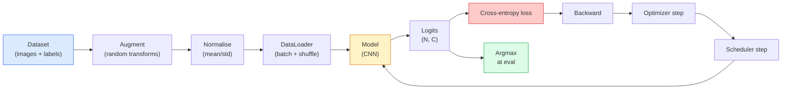

# 图像分类

> 类别是从像素到类别的概率分布的函数.

**Type:** Build
**Languages:** Python
**Prerequisites:** Phase 2 Lesson 09 (Model Evaluation), Phase 3 Lesson 10 (Mini Framework), Phase 4 Lesson 03 (CNNs)
**Time:** ~75 minutes

## 学习目标

- 建立CIFAR-10的端到端图像分类管道:数据集,增强,模型,培训循环,评估
- 解释每个组件的作用 (数据加载器,损失,优化器,计划器,增强) 并预测损失曲线中任何组件的破解如何表现
- 从零开始实施混合,切割和标签滑滑,并证明每一个值得添加的时间
- 阅读一个混矩阵和每个类的精度/召回表,以诊断数据集和模型失误超出总准确性

## 问题

每个视觉任务都将降低到某个层次的图像分类.检测分类区域. 分类分类分类像素.检索分类与类中位数相似.获得分类正确的数据集循环,增强政策,损失,评估是将技能转移到阶段中的其他任务.

许多分类错误都不在模型中. 它们生活在一个道中:一个破碎的规范化,一个不调整的培训组,增强,扭曲标签,一个通过培训数据污染的验证分断, 通过正确的设置,在CIFAR-10上达到93%的CNN通常会在破产时达到70-75%的分数,

通过手动连接整个管道,所以每个部分都可检查.`torchvision.datasets`这可能隐藏了昆虫.

## 概念

### 类别管道



交叉透取原始的记录,而不是软max输出,所以任何`model(x).softmax()`增加仅适用于输入,而不是标签,除了混合,这混合了两者.`optimizer.zero_grad()`错误的发生在一个阶段, 跳过它会积累渐变, 看起来像一个非常不稳定的学习率.

### 交叉,和软max

一个分类器产生`C`应用软max将它们转化为概率分布:

```
softmax(z)_i = exp(z_i) / sum_j exp(z_j)
```

交叉透量测量正确类的负记录概率:

```
CE(z, y) = -log( softmax(z)_y )
        = -z_y + log( sum_j exp(z_j) )
```

右边的表格是数值稳定的表格 (log-sum-exp).`nn.CrossEntropyLoss`软max+NLL在一个操作中合并并并直接取原始的logits. 应用软max自己首先几乎总是一个错误.

### 为什么增强效果

对于转换 (从重量共享) 的 CNN 有诱导偏见,但没有内置的变化,即作物,翻转,颜色的震惊或.教导它这些变化的唯一方法是向它展示它们的像素.训练过程中的每一次随机转变都是说:"这两个图像都有相同的标签;学习忽略差异的特征.

```
Original crop:  "dog facing left"
Flip:           "dog facing right"       <- same label, different pixels
Rotate(+15):    "dog, slight tilt"
Colour jitter:  "dog in warmer light"
RandomErasing:  "dog with patch missing"
```

规则:增强必须保留标签.一个数字上的切割和旋转可以将"6"转换为 "9";对于该数据集,您使用较小的旋转范围,并选择尊重数字特定的不变的增强.

### 混合和切割混合物

常见的增强将像素转化,但保持标签的热度.**Mixup**其他**cutmix**通过插入两者来打破这一点.

```
Mixup:
  lambda ~ Beta(a, a)
  x = lambda * x_i + (1 - lambda) * x_j
  y = lambda * y_i + (1 - lambda) * y_j

Cutmix:
  paste a random rectangle of x_j into x_i
  y = area-weighted mix of y_i and y_j
```

模型停止记忆尖的单热目标,并学习间隔. 训练损失增加,测试精度增加. 这是任何分类器的唯一最便宜的强度升级.

### 标签滑滑

的表哥,而不是训练`[0, 0, 1, 0, 0]`列车对抗`[eps/C, eps/C, 1-eps, eps/C, eps/C]`为了一个小的`eps`模型不会产生任意尖的位,并且几乎没有成本地提高校准.`nn.CrossEntropyLoss(label_smoothing=0.1)`自PyTorch 1.10以来.

### 超出准确性的评估

总的来说,一个90-10的二进制分类器总是预测大多数类的分数是90%.

- **Per-class accuracy**每类一个数字;立即出现低绩效类别.
- **Confusion matrix** C x C 格格,行 i col j = 预测的真实类 i 的数量为类 j; 横向是正确的,外横向是您的模型居住的地方.
- **Top-1 / Top-5**是否正确的类型在前1或前5个预测中;对ImageNet来说,前5个是重要的,因为"诺威奇特里耶尔"与"诺福克特里耶尔"等类型是真正模糊的.
- **Calibration (ECE)**0.8的可靠性预测 80% 的时间是否正确?现代网络系统上过于安全;通过温度缩小或标签平滑来解决.

```figure
receptive-field
```

## 建立它

### 步骤1:确定性合成数据集

为了使这门课程能够复制和快速,我们构建了一个合成数据集,看起来像CIFAR  32x32 RGB图像,具有类型特定的结构,模型必须学习.

```python
import numpy as np
import torch
from torch.utils.data import Dataset


def synthetic_cifar(num_per_class=1000, num_classes=10, seed=0):
    rng = np.random.default_rng(seed)
    X = []
    Y = []
    for c in range(num_classes):
        centre = rng.uniform(0, 1, (3,))
        freq = 2 + c
        for _ in range(num_per_class):
            yy, xx = np.meshgrid(np.linspace(0, 1, 32), np.linspace(0, 1, 32), indexing="ij")
            r = np.sin(xx * freq) * 0.5 + centre[0]
            g = np.cos(yy * freq) * 0.5 + centre[1]
            b = (xx + yy) * 0.5 * centre[2]
            img = np.stack([r, g, b], axis=-1)
            img += rng.normal(0, 0.08, img.shape)
            img = np.clip(img, 0, 1)
            X.append(img.astype(np.float32))
            Y.append(c)
    X = np.stack(X)
    Y = np.array(Y)
    idx = rng.permutation(len(X))
    return X[idx], Y[idx]


class ArrayDataset(Dataset):
    def __init__(self, X, Y, transform=None):
        self.X = X
        self.Y = Y
        self.transform = transform

    def __len__(self):
        return len(self.X)

    def __getitem__(self, i):
        img = self.X[i]
        if self.transform is not None:
            img = self.transform(img)
        img = torch.from_numpy(img).permute(2, 0, 1)
        return img, int(self.Y[i])
```

每个类别都会有自己的颜色调色和频率模式,加上高斯噪音,迫使模型学习信号而不是记忆像素.

### 标准化和增强

两种变化,每个视觉管道都有.

```python
def standardize(mean, std):
    mean = np.array(mean, dtype=np.float32)
    std = np.array(std, dtype=np.float32)
    def _fn(img):
        return (img - mean) / std
    return _fn


def random_hflip(p=0.5):
    def _fn(img):
        if np.random.random() < p:
            return img[:, ::-1, :].copy()
        return img
    return _fn


def random_crop(pad=4):
    def _fn(img):
        h, w = img.shape[:2]
        padded = np.pad(img, ((pad, pad), (pad, pad), (0, 0)), mode="reflect")
        y = np.random.randint(0, 2 * pad)
        x = np.random.randint(0, 2 * pad)
        return padded[y:y + h, x:x + w, :]
    return _fn


def compose(*fns):
    def _fn(img):
        for fn in fns:
            img = fn(img)
        return img
    return _fn
```

放映板在收获之前,而不是零板,因为黑色边界是模型将学会以无用的方式忽略的信号.

### 步骤3:混合

混合了训练阶段内的两个图像和两个标签. 作为一批转换,所以它住在前进的传递旁边而不是数据集内部.

```python
def mixup_batch(x, y, num_classes, alpha=0.2):
    if alpha <= 0:
        return x, torch.nn.functional.one_hot(y, num_classes).float()
    lam = float(np.random.beta(alpha, alpha))
    idx = torch.randperm(x.size(0), device=x.device)
    x_mixed = lam * x + (1 - lam) * x[idx]
    y_onehot = torch.nn.functional.one_hot(y, num_classes).float()
    y_mixed = lam * y_onehot + (1 - lam) * y_onehot[idx]
    return x_mixed, y_mixed


def soft_cross_entropy(logits, soft_targets):
    log_probs = torch.log_softmax(logits, dim=-1)
    return -(soft_targets * log_probs).sum(dim=-1).mean()
```

`soft_cross_entropy`目标是完全单热的时,它降低到通常的单热情况.

### 步骤4:训练循环

完整的食谱:一个通过数据,每批次的梯度,每期的时间表.

```python
import torch
import torch.nn as nn
from torch.utils.data import DataLoader
from torch.optim import SGD
from torch.optim.lr_scheduler import CosineAnnealingLR

def train_one_epoch(model, loader, optimizer, device, num_classes, use_mixup=True):
    model.train()
    total, correct, loss_sum = 0, 0, 0.0
    for x, y in loader:
        x, y = x.to(device), y.to(device)
        if use_mixup:
            x_m, y_soft = mixup_batch(x, y, num_classes)
            logits = model(x_m)
            loss = soft_cross_entropy(logits, y_soft)
        else:
            logits = model(x)
            loss = nn.functional.cross_entropy(logits, y, label_smoothing=0.1)
        optimizer.zero_grad()
        loss.backward()
        optimizer.step()
        loss_sum += loss.item() * x.size(0)
        total += x.size(0)
        # Training accuracy vs the un-mixed labels `y` is only an approximation
        # when mixup is on (the model saw soft targets, not y). Treat it as a
        # rough progress signal; rely on val accuracy for real performance.
        with torch.no_grad():
            pred = logits.argmax(dim=-1)
            correct += (pred == y).sum().item()
    return loss_sum / total, correct / total


@torch.no_grad()
def evaluate(model, loader, device, num_classes):
    model.eval()
    total, correct = 0, 0
    loss_sum = 0.0
    cm = torch.zeros(num_classes, num_classes, dtype=torch.long)
    for x, y in loader:
        x, y = x.to(device), y.to(device)
        logits = model(x)
        loss = nn.functional.cross_entropy(logits, y)
        pred = logits.argmax(dim=-1)
        for t, p in zip(y.cpu(), pred.cpu()):
            cm[t, p] += 1
        loss_sum += loss.item() * x.size(0)
        total += x.size(0)
        correct += (pred == y).sum().item()
    return loss_sum / total, correct / total, cm
```

每次写训练循环时,你检查的五种不变:

1. `model.train()`在培训之前,`model.eval()`在评估之前,  转移退出和批量规范行为.
2. `.zero_grad()`在之前`.backward()`现在,我们要去.
3. `.item()`没有什么能让计算图保持活力.
4. `@torch.no_grad()`节省记忆和时间,防止微妙的事故.
5.                                                                                                                                                                                                                                                               

### 步骤5: 组合

使用`TinyResNet`根据前一课,训练几个时代,评估.

```python
from main import synthetic_cifar, ArrayDataset
from main import standardize, random_hflip, random_crop, compose
from main import mixup_batch, soft_cross_entropy
from main import train_one_epoch, evaluate
# TinyResNet comes from the previous lesson (03-cnns-lenet-to-resnet).
# Adjust the import path to wherever you stored the previous lesson's code.
from cnns_lenet_to_resnet import TinyResNet  # example placeholder

X, Y = synthetic_cifar(num_per_class=500)
split = int(0.9 * len(X))
X_train, Y_train = X[:split], Y[:split]
X_val, Y_val = X[split:], Y[split:]

mean = [0.5, 0.5, 0.5]
std = [0.25, 0.25, 0.25]
train_tf = compose(random_hflip(), random_crop(pad=4), standardize(mean, std))
eval_tf = standardize(mean, std)

train_ds = ArrayDataset(X_train, Y_train, transform=train_tf)
val_ds = ArrayDataset(X_val, Y_val, transform=eval_tf)

train_loader = DataLoader(train_ds, batch_size=128, shuffle=True, num_workers=0)
val_loader = DataLoader(val_ds, batch_size=256, shuffle=False, num_workers=0)

device = "cuda" if torch.cuda.is_available() else "cpu"
model = TinyResNet(num_classes=10).to(device)
optimizer = SGD(model.parameters(), lr=0.1, momentum=0.9, weight_decay=5e-4, nesterov=True)
scheduler = CosineAnnealingLR(optimizer, T_max=10)

for epoch in range(10):
    tr_loss, tr_acc = train_one_epoch(model, train_loader, optimizer, device, 10, use_mixup=True)
    va_loss, va_acc, _ = evaluate(model, val_loader, device, 10)
    scheduler.step()
    print(f"epoch {epoch:2d}  lr {scheduler.get_last_lr()[0]:.4f}  "
          f"train {tr_loss:.3f}/{tr_acc:.3f}  val {va_loss:.3f}/{va_acc:.3f}")
```

在合成数据集中,在五个时代内,这种验证准确性几乎达到完美,这就是点:管道正确,模型可以学习可学的东西.

### 步骤 6:阅读混矩阵

只有精度,它永远不会告诉你模型在哪里失败.

```python
def print_confusion(cm, labels=None):
    c = cm.shape[0]
    labels = labels or [str(i) for i in range(c)]
    print(f"{'':>6}" + "".join(f"{l:>5}" for l in labels))
    for i in range(c):
        row = cm[i].tolist()
        print(f"{labels[i]:>6}" + "".join(f"{v:>5}" for v in row))
    print()
    tp = cm.diag().float()
    fp = cm.sum(dim=0).float() - tp
    fn = cm.sum(dim=1).float() - tp
    prec = tp / (tp + fp).clamp_min(1)
    rec = tp / (tp + fn).clamp_min(1)
    f1 = 2 * prec * rec / (prec + rec).clamp_min(1e-9)
    for i in range(c):
        print(f"{labels[i]:>6}  prec {prec[i]:.3f}  rec {rec[i]:.3f}  f1 {f1[i]:.3f}")

_, _, cm = evaluate(model, val_loader, device, 10)
print_confusion(cm)
```

列是真实类,列是预测.在3级到5级之间,一个离线数量的集群意味着模型混了这两个,并为目标数据收集或类型特定增强提供了起点.

## 用它

`torchvision`对于真正的CIFAR-10来说,全线是四条线加上训练循环.

```python
from torchvision.datasets import CIFAR10
from torchvision.transforms import Compose, RandomCrop, RandomHorizontalFlip, ToTensor, Normalize

mean = (0.4914, 0.4822, 0.4465)
std = (0.2470, 0.2435, 0.2616)
train_tf = Compose([
    RandomCrop(32, padding=4, padding_mode="reflect"),
    RandomHorizontalFlip(),
    ToTensor(),
    Normalize(mean, std),
])
eval_tf = Compose([ToTensor(), Normalize(mean, std)])

train_ds = CIFAR10(root="./data", train=True,  download=True, transform=train_tf)
val_ds   = CIFAR10(root="./data", train=False, download=True, transform=eval_tf)
```

值得注意的是,平均/STD是**dataset-specific**计算在CIFAR-10训练集,而不是ImageNet,反射板是社区默认的作物政策.

## 运送它

这一课产生了:

- `outputs/prompt-classifier-pipeline-auditor.md`一个提示,检查了上述五种变量的训练脚本,并发现了第一个违规行为.
- `outputs/skill-classification-diagnostics.md`一个技能,在一个混矩阵和一个类名单的情况下,总结每个类的失败并提出最具影响力的解决方案.

## 运动

1. **(Easy)**根据合成数据集,在5个时代中,使用和无混合的模型进行训练. 两者都进行了训练. 解释为什么与混合的训练损失更高,但对验证的精度相似或更好.
2. **(Medium)**执行切割  在每个训练图像中零出一个随机8x8平方 并运行一个除除算与没有增长,hflip+crop,hflip+crop+cutout,hflip+crop+mixup. 报告每个图像的精度.
3. **(Hard)**建立一个CIFAR-100管道 (100类,相同输入尺寸) 并将ResNet-34训练运行在公布的准确度的1%内复制. 额外:扫描三个学习率和两个减重,登录到本地CSV,生成最终的混矩阵-顶部混表.

## 关键词

| Term | What people say | What it actually means |
|------|----------------|----------------------|
| Logits | "Raw outputs" | The pre-softmax vector of C numbers per image; cross-entropy expects these, not softmaxed values |
| Cross-entropy | "The loss" | Negative log-probability of the correct class; combines log-softmax and NLL in one stable op |
| DataLoader | "The batcher" | Wraps a dataset with shuffling, batching, and (optional) multi-worker loading; gets blamed for half of training bugs |
| Augmentation | "Random transforms" | Any pixel-level transform at training time that preserves the label; teaches invariances the CNN does not have natively |
| Mixup / Cutmix | "Mix two images" | Blend both inputs and labels so the classifier learns smooth interpolations instead of hard boundaries |
| Label smoothing | "Softer targets" | Replace one-hot with (1-eps, eps/(C-1), ...); improves calibration and slightly boosts accuracy |
| Top-k accuracy | "Top-5" | The correct class is in the k highest-probability predictions; used on datasets with genuinely ambiguous classes |
| Confusion matrix | "Where errors live" | C x C table where entry (i, j) counts images of true class i predicted as j; diagonal is right, off-diagonal tells you what to fix |

## 进一步阅读

- [CS231n: Training Neural Networks](https://cs231n.github.io/neural-networks-3/) 仍然是单页的训练管道最清晰的巡回
- [Bag of Tricks for Image Classification (He et al., 2019)](https://arxiv.org/abs/1812.01187)每一个小技巧,总共增加3~4%的ResNet精度
- [mixup: Beyond Empirical Risk Minimization (Zhang et al., 2017)](https://arxiv.org/abs/1710.09412)原始混合论文;三个页的理论加上令人信服的实验
- [Why temperature scaling matters (Guo et al., 2017)](https://arxiv.org/abs/1706.04599)证明现代网络是错误校准的,并用一个尺度参数来固定它
