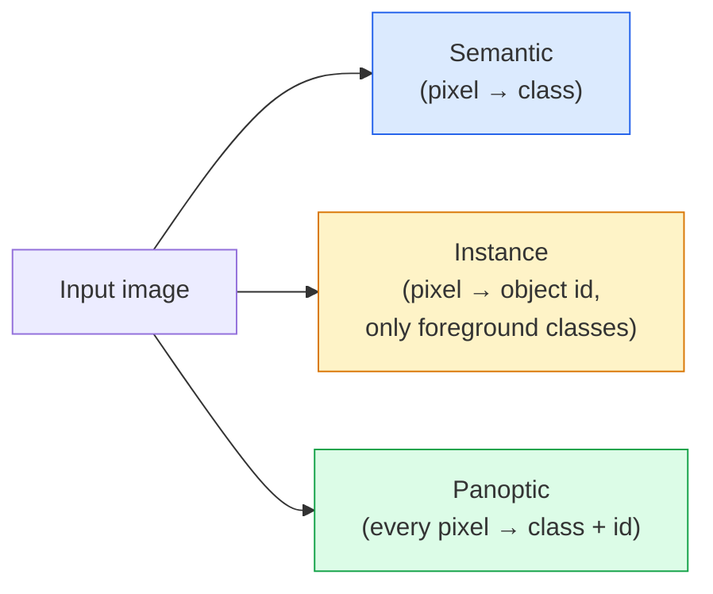
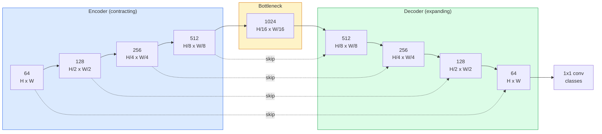

# 语义分类 U-Net

> 细分是每个像素的分类. U-Net通过将下样式编码器与上样式解码器结合起来,并将它们连接连接.

**Type:** Build
**Languages:** Python
**Prerequisites:** Phase 4 Lesson 03 (CNNs), Phase 4 Lesson 04 (Image Classification)
**Time:** ~75 minutes

## 学习目标

- 区分语义,实例和全观分区,并为给定的问题选择正确的任务
- 在 PyTorch 中从零开始构建一个 U-Net,使用编码块,瓶,转换转换的解码器,并跳过连接
- 实现像素式交叉透,子损失,以及医疗和工业分区的当前默认的组合损失
- 阅读各类的IoU和Dice指标,诊断是否来自小物体回忆,边界精度或类的失衡

## 问题

分类输出每张图像一个标签.检测输出每张图像一手几个框. 分类输出每像素一个标签.`H x W`输出是形状子`H x W`它们是`H x W x N_instances`预测每幅图像数百万,而不是一个.

细分结构是为什么它支持几乎所有密集预测视觉产品:医疗成像 (瘤面具),自动驾驶 (道路,车道,障碍),卫星 (建筑脚印,作物边界),文件分析 (布局区),机器人 (可抓住区域).这些任务都不能通过将盒子围绕物体解决;它们需要精确的模样.

建筑问题很简单,而难以解决:您需要网络同时看到图像的全球背景 (这是什么样的场景) 和本地像素细节 (正确的是哪个像素是道路与路面).标准的CNN空间压缩以获得背景,这会丢弃细节.U-Net是设计得到了这两者.

## 概念

### 语义与实例与全观



- **Semantic**这里写着:"这像素是道路,那像素是汽车".
- **Instance**无视背景的东西 ("东西" = 天空,道路,草).
- **Panoptic**每个像素都得到了类标签,每一个实例都得到了独特的ID,

接下来的课程 (面具R-CNN) 涵盖实例.

### 网络形状



编码器将空间分辨率减半四倍,并翻倍频道. 解码器逆转:空间分辨率翻倍四倍,并翻倍频道. 跳转连接连接,每个分辨率都与解码器功能相匹配. 最后的1x1 conv地图`64 -> num_classes`在完全的分辨率下.

由于该系统在下降过程中无法准确地定位边缘,因为该信息被压缩到编码器中. 编码器将高分辨率的功能映射到下降过程中计算的编码器. 编码器的功能是通过编码器进行编码.

### 转换与双线上样本

解码器必须扩大空间尺寸.

- **Transposed convolution**(`nn.ConvTranspose2d`) 可学习的上样本.历史U-Net默认. 如果步骤和内核尺寸不均地分开,可以生成棋盘文物.
- **Bilinear upsample + 3x3 conv**滑的上样本,然后是一个 conv. 较少的文物,较少的参数,现在是现代默认的.

对于第一次U-网来说,双线性更安全.

### 在像素格格子上交叉透

对于C类的语义分类,模型输出是`(N, C, H, W)`目标是`(N, H, W)`交叉透与分类案例相同,只应在每个空间位置上应用:

```
Loss = mean over (n, h, w) of -log( softmax(logits[n, :, h, w])[target[n, h, w]] )
```

`F.cross_entropy`在 PyTorch 处理这种形状原生.

### 子损失和你为什么需要它

交叉透对待每个像素均等.当一个类别主导框架时,这是错误的 (医学成像:99%背景,1%瘤).网络可以通过在任何地方预测背景来获得99%的准确度,但仍然是无用的.

子损失通过直接优化预测和真实的面具之间的重叠来解决这一问题:

```
Dice(p, y) = 2 * sum(p * y) / (sum(p) + sum(y) + epsilon)
Dice_loss = 1 - Dice
```

在哪里`p`是一个类的sigmoid/softmax概率地图,`y`由于它是基于比例的,类失衡是无关紧要的.

实际上,使用**combined loss**其他:

```
L = L_cross_entropy + lambda * L_dice       (lambda ~ 1)
```

交叉透在训练初期提供稳定的梯度; 子将训练的尾巴集中在实际匹配面具形状上. 这种组合是医学图像默认的,并且在任何类失衡的数据集上难以击败.

### 评估指标

- **Pixel accuracy**%的像素预测正确. 便宜. 由于分类的准确性而被破坏在不平衡的数据上.
- **IoU per class**每个类面具的工会交叉;各类间平均值 = mIoU.
- **Dice (F1 on pixels)**类似于IU;`Dice = 2 * IoU / (1 + IoU)`医疗成像更喜欢Days,驾驶社区更喜欢IoU;它们是单调的关系.
- **Boundary F1**测量预测边界与地面真相边界有多近,即使是小变量也会受到惩罚.

平均平均平均平均平均每班人15%而其他9班人85%

### 输入分辨率交易

医疗图像通常是512x512或1024x1024.自动驾驶作物是2048x1024. U-Net的内存成本与`H * W * C_max`通过1024x1024的瓶通道,前进通道已经使用了千兆瓦的VRAM.

两种标准解决方案:
1. 入口处理 256x256 ,覆盖和接.
2. 取代瓶用扩展的卷曲,保持空间分辨率更高,但扩大接收场 (DeepLab家族).

对于第一款模型,一个256x256输入器,具有64通道基线U-Net,可以舒适地使用8GB的VRAM.

```figure
segmentation-flood
```

## 建立它

### 步骤1:编码器封锁

两个3x3的轮,配合批量标准和ReLU.第一轮改变道数量,第二轮保持它.

```python
import torch
import torch.nn as nn
import torch.nn.functional as F

class DoubleConv(nn.Module):
    def __init__(self, in_c, out_c):
        super().__init__()
        self.net = nn.Sequential(
            nn.Conv2d(in_c, out_c, kernel_size=3, padding=1, bias=False),
            nn.BatchNorm2d(out_c),
            nn.ReLU(inplace=True),
            nn.Conv2d(out_c, out_c, kernel_size=3, padding=1, bias=False),
            nn.BatchNorm2d(out_c),
            nn.ReLU(inplace=True),
        )

    def forward(self, x):
        return self.net(x)
```

整个区块都被重复使用.`bias=False`因为BN的beta处理偏见.

### 步骤2:下楼和上楼

```python
class Down(nn.Module):
    def __init__(self, in_c, out_c):
        super().__init__()
        self.net = nn.Sequential(
            nn.MaxPool2d(2),
            DoubleConv(in_c, out_c),
        )

    def forward(self, x):
        return self.net(x)


class Up(nn.Module):
    def __init__(self, in_c, out_c):
        super().__init__()
        self.up = nn.Upsample(scale_factor=2, mode="bilinear", align_corners=False)
        self.conv = DoubleConv(in_c, out_c)

    def forward(self, x, skip):
        x = self.up(x)
        if x.shape[-2:] != skip.shape[-2:]:
            x = F.interpolate(x, size=skip.shape[-2:], mode="bilinear", align_corners=False)
        x = torch.cat([skip, x], dim=1)
        return self.conv(x)
```

仅用于空间的形状检查 (`shape[-2:]`) 处理不可除16个尺寸的输入;`F.interpolate`完全形状的比较也会引发频道数量差异,这应该是一个大声错误,而不是一个沉默的插曲.

### 步骤3:U-Net

```python
class UNet(nn.Module):
    def __init__(self, in_channels=3, num_classes=2, base=64):
        super().__init__()
        self.inc = DoubleConv(in_channels, base)
        self.d1 = Down(base, base * 2)
        self.d2 = Down(base * 2, base * 4)
        self.d3 = Down(base * 4, base * 8)
        self.d4 = Down(base * 8, base * 16)
        self.u1 = Up(base * 16 + base * 8, base * 8)
        self.u2 = Up(base * 8 + base * 4, base * 4)
        self.u3 = Up(base * 4 + base * 2, base * 2)
        self.u4 = Up(base * 2 + base, base)
        self.outc = nn.Conv2d(base, num_classes, kernel_size=1)

    def forward(self, x):
        x1 = self.inc(x)
        x2 = self.d1(x1)
        x3 = self.d2(x2)
        x4 = self.d3(x3)
        x5 = self.d4(x4)
        x = self.u1(x5, x4)
        x = self.u2(x, x3)
        x = self.u3(x, x2)
        x = self.u4(x, x1)
        return self.outc(x)

net = UNet(in_channels=3, num_classes=2, base=32)
x = torch.randn(1, 3, 256, 256)
print(f"output: {net(x).shape}")
print(f"params: {sum(p.numel() for p in net.parameters()):,}")
```

输出形状`(1, 2, 256, 256)`与输入量相同的空间大小,`num_classes`道. 约7.7M参数`base=32`现在,我们要去.

### 第四步:损失

```python
def dice_loss(logits, targets, num_classes, eps=1e-6):
    probs = F.softmax(logits, dim=1)
    targets_one_hot = F.one_hot(targets, num_classes).permute(0, 3, 1, 2).float()
    dims = (0, 2, 3)
    intersection = (probs * targets_one_hot).sum(dim=dims)
    denom = probs.sum(dim=dims) + targets_one_hot.sum(dim=dims)
    dice = (2 * intersection + eps) / (denom + eps)
    return 1 - dice.mean()


def combined_loss(logits, targets, num_classes, lam=1.0):
    ce = F.cross_entropy(logits, targets)
    dc = dice_loss(logits, targets, num_classes)
    return ce + lam * dc, {"ce": ce.item(), "dice": dc.item()}
```

子按类计算,然后平均 (宏子).`eps`防止在不参加批次的类别中以零分为.

### 步骤5:IoU指标

```python
@torch.no_grad()
def iou_per_class(logits, targets, num_classes):
    preds = logits.argmax(dim=1)
    ious = torch.zeros(num_classes)
    for c in range(num_classes):
        pred_c = (preds == c)
        true_c = (targets == c)
        inter = (pred_c & true_c).sum().float()
        union = (pred_c | true_c).sum().float()
        ious[c] = (inter / union) if union > 0 else torch.tensor(float("nan"))
    return ious
```

返回长度C的向量. `nan`                                                                                                                                                                                                                                                              

### 步骤 6:合成数据集进行端到端验证

通过彩色背景生成形状,使网络学习形状,而不是像素颜色.

```python
import numpy as np
from torch.utils.data import Dataset, DataLoader

def synthetic_segmentation(num_samples=200, size=64, seed=0):
    rng = np.random.default_rng(seed)
    images = np.zeros((num_samples, size, size, 3), dtype=np.float32)
    masks = np.zeros((num_samples, size, size), dtype=np.int64)
    for i in range(num_samples):
        bg = rng.uniform(0, 1, (3,))
        images[i] = bg
        masks[i] = 0
        num_shapes = rng.integers(1, 4)
        for _ in range(num_shapes):
            cls = int(rng.integers(1, 3))
            color = rng.uniform(0, 1, (3,))
            cx, cy = rng.integers(10, size - 10, size=2)
            r = int(rng.integers(4, 12))
            yy, xx = np.meshgrid(np.arange(size), np.arange(size), indexing="ij")
            if cls == 1:
                mask = (xx - cx) ** 2 + (yy - cy) ** 2 < r ** 2
            else:
                mask = (np.abs(xx - cx) < r) & (np.abs(yy - cy) < r)
            images[i][mask] = color
            masks[i][mask] = cls
        images[i] += rng.normal(0, 0.02, images[i].shape)
        images[i] = np.clip(images[i], 0, 1)
    return images, masks


class SegDataset(Dataset):
    def __init__(self, images, masks):
        self.images = images
        self.masks = masks

    def __len__(self):
        return len(self.images)

    def __getitem__(self, i):
        img = torch.from_numpy(self.images[i]).permute(2, 0, 1).float()
        mask = torch.from_numpy(self.masks[i]).long()
        return img, mask
```

网络必须学会区分形状.

### 步骤7:训练循环

```python
def train_one_epoch(model, loader, optimizer, device, num_classes):
    model.train()
    loss_sum, total = 0.0, 0
    iou_sum = torch.zeros(num_classes)
    for x, y in loader:
        x, y = x.to(device), y.to(device)
        logits = model(x)
        loss, _ = combined_loss(logits, y, num_classes)
        optimizer.zero_grad()
        loss.backward()
        optimizer.step()
        loss_sum += loss.item() * x.size(0)
        total += x.size(0)
        iou_sum += iou_per_class(logits, y, num_classes).nan_to_num(0)
    return loss_sum / total, iou_sum / len(loader)
```

通过合成数据集进行10-30个时代,并观察mIoU在形状类别上升超过0.9.`nan_to_num(0)`对于每类的精确IOU,按存在和使用量进行面具`torch.nanmean`在评估时间,而不是在这里平均.

## 用它

用于生产`segmentation_models_pytorch`("smp") 包含任何火视觉或timm脊柱的每个标准细分架构.

```python
import segmentation_models_pytorch as smp

model = smp.Unet(
    encoder_name="resnet34",
    encoder_weights="imagenet",
    in_channels=3,
    classes=3,
)
```

对于真正的工作来说,也值得知道:
- **DeepLabV3+**通过扩展的道来取代基于最大池的下样式,使瓶保持分辨率;在卫星和驾驶数据上更快的界限.
- **SegFormer**转换一个层次变压器的 conv编码器;在许多基准上,目前的SOTA.
- **Mask2Former**现在,**OneFormer**统一语义,实例和全观分区在一个建筑中.

现在,我们要把它们全部换成.`smp`或`transformers`通过相同的数据加载器.

## 运送它

这一课产生了:

- `outputs/prompt-segmentation-task-picker.md`一个提示,选择语义,实例和泛光分区之间,并为给定的任务命名架构.
- `outputs/skill-segmentation-mask-inspector.md` 报告类分布,预测面具统计和预测不足或边界模糊的类的技能.

## 运动

1. **(Easy)**实施`bce_dice_loss`在合成的二类数据集上,检查当前面为5%的像素时,结合损失比仅 BCE 快得相近.
2. **(Medium)**取代`nn.Upsample + conv`上区块`nn.ConvTranspose2d`分析和分析,并进行分析,并对象 mIoU.
3. **(Hard)**采用一个真正的细分数据集 (牛津-IIIT物,城市景观小分区或医学子集)`smp.Unet`报告每类的Iow,并确定哪些类因增加 Dice而受益最大.

## 关键词

| Term | What people say | What it actually means |
|------|----------------|----------------------|
| Semantic segmentation | "Label every pixel" | Per-pixel classification into C classes; instances of the same class merge |
| Instance segmentation | "Label every object" | Separates distinct instances of the same class; foreground-only |
| Panoptic segmentation | "Semantic + instance" | Every pixel gets a class; every thing instance also gets a unique id |
| Skip connection | "U-Net bridge" | Concatenation of encoder features into matching-resolution decoder features; preserves high-frequency detail |
| Transposed conv | "Deconvolution" | Learnable upsampling; can produce checkerboard artifacts |
| Dice loss | "Overlap loss" | 1 - 2|A ∩ B| / (|A| + |B|); optimises mask overlap directly and is robust to class imbalance |
| mIoU | "Mean intersection over union" | Average IoU across classes; the community-standard metric for segmentation |
| Boundary F1 | "Boundary accuracy" | F1 score computed on boundary pixels only; matters for precision-critical tasks |

## 进一步阅读

- [U-Net: Convolutional Networks for Biomedical Image Segmentation (Ronneberger et al., 2015)](https://arxiv.org/abs/1505.04597)原始纸;每个人复制的图片在第2页
- [Fully Convolutional Networks (Long et al., 2015)](https://arxiv.org/abs/1411.4038)第一个使分区成为端到端的卷积问题
- [segmentation_models_pytorch](https://github.com/qubvel/segmentation_models.pytorch)生产细分的参考;每一个标准架构加上每一个标准损失
- [Lessons learned from training SOTA segmentation (kaggle.com competitions)](https://www.kaggle.com/code/iafoss/carvana-unet-pytorch)为什么TTA,伪标签和类重量在真实数据上重要
