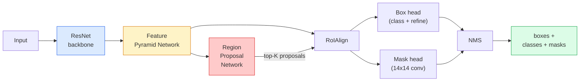

# 机器人机器人机器人机器人机器人机器人机器人机器人机器人机器人机器人机器人机器人机器人机器人机器人机器人机器人机器人机器人机器人机器人机器人机器人机器人机器人机器人机器人机器人机器人机器人机器人机器人机器人机器人机器人机器人机器人机器人机器人机器人机器人机器人机器人机器人机器人机器人机器人机器人机器人机器人机器人机器人机器人机器人机器人机器人机器人机器人机器人机器人机器人机器人机器人机器人机器人机器人机器人机器人机器人机器人机器人机器人机器人机器人机器人机器人机器人机器人机器人机器人机器

> 现在,我们需要一个小的面具分支,

**Type:** Build + Learn
**Languages:** Python
**Prerequisites:** Phase 4 Lesson 06 (YOLO), Phase 4 Lesson 07 (U-Net)
**Time:** ~75 minutes

## 学习目标

- 追踪面具R-CNN架构端到端:脊柱,FPN,RPN,RoIAlign,盒头,面具头
- 实现RoIAlign从零开始,并解释为什么不再使用RoIPool
- 使用火视觉`maskrcnn_resnet50_fpn_v2`预训练式模型生产质量实例面具,并正确读取输出格式
- 通过更换盒子和面具头部并保持脊椎结,将R-CNN在小型定制数据集上调整

## 问题

语义分类给你每类一个面具.实例分类给你每一个对象一个面具,即使两个对象共享一个类.计算个人,跨框架跟踪,测量东西 (墙上的每个的边界框,微镜图像中的每个细胞) 所有都需要实例分类.

面具R-CNN (He等,2017) 通过重新构建实例细分化为检测加面具来解决这一问题.设计非常清洁,在接下来的五年里几乎每个实例细分纸都是面具R-CNN变体,并且火视觉实现仍然是小型到中等数据集的生产默认.

设计难题是采样:如何从一个没有与像素界限一致的角落的提案框中切割一个固定尺寸的特征区域?

## 概念

### 建筑



五个东西要理解:

1. **Backbone** ResNet-50或 ResNet-101 在 ImageNet 上训练. 在步骤 4, 8, 16, 32 产生功能地图的等级.
2. **FPN (Feature Pyramid Network)**上下 + 侧接,给每个级别C道含有语义丰富的特性.检测查询 FPN 级别匹配对象大小.
3. **RPN (Region Proposal Network)**一个小的头,在每个头位置,预测"这里有什么对象吗?"和"我如何精炼盒子?"每张图片产生1000个建议.
4. **RoIAlign**从任何FPN级别的任何盒子中采用固定尺寸 (例如7×7) 功能补丁.
5. **Heads**两层盒头,精炼盒子,选择一个类,加上一个小的卷头,输出一个`28x28`每个提议都会有双面膜.

### 为什么RoIAlign而不是RoIPool

早期的快速R-CNN使用了RoIPool,该方法将一个提案框分成网格,将每个细胞中的最大特征取回,并将所有坐标调整成整数.这种圆形将从输入像素坐标的特征地图错调到一个完整的特征地图像像像像像素小于224x224图像,当特征地图步 32时,这会造成灾难.

```
RoIPool:
  box (34.7, 51.3, 98.2, 142.9)
  round -> (34, 51, 98, 142)
  split grid -> round each cell boundary
  misalignment accumulates at every step

RoIAlign:
  box (34.7, 51.3, 98.2, 142.9)
  sample at exact float coordinates using bilinear interpolation
  no rounding anywhere
```

现在,每个关心定位的探测器都使用了YOLOv7seg,RT-DETR,Mask2Former.

### 单一段的RPN

在图的每个位置,设置不同尺寸和形状的K框. 预测每个的物体性分数和回归偏移,使变成更适合的盒子. 按分数按上方的1000个盒子,在Iow 0.7上应用NMS, 训练的RPN是用自己的迷你损失,与第6课的YOLO损失相同的结构,只有两个类 (对象/无对象).

### 面具头

对于每一个提案 (RoIAlign之后) 面具头是一个小的FCN:四个3x3conv,一个2xdeconv,最后一个1x1conv产生`num_classes`输出频道`28x28`只有与预测类相应的频道保持,而其他频道则被忽视.

通过将28x28面具调整到原始的像素尺寸,

### 损失

罩R-CNN的损失总共为四次:

```
L = L_rpn_cls + L_rpn_box + L_box_cls + L_box_reg + L_mask
```

- `L_rpn_cls`现在`L_rpn_box`对象性+RPN提案的回归框.
- `L_box_cls`标题分类器上的 (C+1) 类 (包括背景) 交叉化.
- `L_box_reg`在头盒上精细的L1.
- `L_mask`每像素的二进制交叉值在28x28面具输出.

每个损失都有自己的默认重量;火视觉实现将它们作为构造论据暴露出来.

### 输出格式

`torchvision.models.detection.maskrcnn_resnet50_fpn_v2`返回一个单词列表,每张图片一个:

```
{
    "boxes":  (N, 4) in (x1, y1, x2, y2) pixel coordinates,
    "labels": (N,) class IDs, 0 = background so indices are 1-based,
    "scores": (N,) confidence scores,
    "masks":  (N, 1, H, W) float masks in [0, 1] — threshold at 0.5 for binary,
}
```

面具已经达到全分辨率, 28×28头输出已经在内部进行了样本化.

```figure
cv3-roialign-sampling
```

## 建立它

### 步骤1:从零开始实现RoIA align

这是一个"面具R-CNN"的组成部分, 简单地理解的代码比散文.

```python
import torch
import torch.nn.functional as F

def roi_align_single(feature, box, output_size=7, spatial_scale=1 / 16.0):
    """
    feature: (C, H, W) single-image feature map
    box: (x1, y1, x2, y2) in original image pixel coordinates
    output_size: side of the output grid (7 for box head, 14 for mask head)
    spatial_scale: reciprocal of the feature map stride
    """
    C, H, W = feature.shape
    x1, y1, x2, y2 = [c * spatial_scale - 0.5 for c in box]
    bin_w = (x2 - x1) / output_size
    bin_h = (y2 - y1) / output_size

    grid_y = torch.linspace(y1 + bin_h / 2, y2 - bin_h / 2, output_size)
    grid_x = torch.linspace(x1 + bin_w / 2, x2 - bin_w / 2, output_size)
    yy, xx = torch.meshgrid(grid_y, grid_x, indexing="ij")

    gx = 2 * (xx + 0.5) / W - 1
    gy = 2 * (yy + 0.5) / H - 1
    grid = torch.stack([gx, gy], dim=-1).unsqueeze(0)
    sampled = F.grid_sample(feature.unsqueeze(0), grid, mode="bilinear",
                            align_corners=False)
    return sampled.squeeze(0)
```

每个数字都在一个双线性样本位置,没有圆,没有量化,没有下降梯度.

### 步骤 2:与火视觉的RoIAlign进行比较

```python
from torchvision.ops import roi_align

feature = torch.randn(1, 16, 50, 50)
boxes = torch.tensor([[0, 10, 20, 100, 90]], dtype=torch.float32)  # (batch_idx, x1, y1, x2, y2)

ours = roi_align_single(feature[0], boxes[0, 1:].tolist(), output_size=7, spatial_scale=1/4)
theirs = roi_align(feature, boxes, output_size=(7, 7), spatial_scale=1/4, sampling_ratio=1, aligned=True)[0]

print(f"shape ours:   {tuple(ours.shape)}")
print(f"shape theirs: {tuple(theirs.shape)}")
print(f"max|diff|:    {(ours - theirs).abs().max().item():.3e}")
```

随着`sampling_ratio=1`其他`aligned=True`两者相匹配`1e-5`现在,我们要去.

### 步骤3:装载预训练的面具R-CNN

```python
import torch
from torchvision.models.detection import maskrcnn_resnet50_fpn_v2, MaskRCNN_ResNet50_FPN_V2_Weights

model = maskrcnn_resnet50_fpn_v2(weights=MaskRCNN_ResNet50_FPN_V2_Weights.DEFAULT)
model.eval()
print(f"params: {sum(p.numel() for p in model.parameters()):,}")
print(f"classes (including background): {len(model.roi_heads.box_predictor.cls_score.out_features * [0])}")
```

46M参数,91类 (COCO).第一类 (ID 0) 是背景;模型实际检测的所有东西都从ID 1开始.

### 步骤4: 运行推断

```python
with torch.no_grad():
    x = torch.randn(3, 400, 600)
    predictions = model([x])
p = predictions[0]
print(f"boxes:  {tuple(p['boxes'].shape)}")
print(f"labels: {tuple(p['labels'].shape)}")
print(f"scores: {tuple(p['scores'].shape)}")
print(f"masks:  {tuple(p['masks'].shape)}")
```

面具的子是形状`(N, 1, H, W)`获得每个对象的二元面具的门为0.5

```python
binary_masks = (p['masks'] > 0.5).squeeze(1)  # (N, H, W) boolean
```

### 步骤5: 换头来进行定制类数

常见的细调配方:重复使用脊柱,FPN和RPN;取代两个分类器头.

```python
from torchvision.models.detection.faster_rcnn import FastRCNNPredictor
from torchvision.models.detection.mask_rcnn import MaskRCNNPredictor

def build_custom_maskrcnn(num_classes):
    model = maskrcnn_resnet50_fpn_v2(weights=MaskRCNN_ResNet50_FPN_V2_Weights.DEFAULT)
    in_features = model.roi_heads.box_predictor.cls_score.in_features
    model.roi_heads.box_predictor = FastRCNNPredictor(in_features, num_classes)
    in_features_mask = model.roi_heads.mask_predictor.conv5_mask.in_channels
    hidden_layer = 256
    model.roi_heads.mask_predictor = MaskRCNNPredictor(in_features_mask, hidden_layer, num_classes)
    return model

custom = build_custom_maskrcnn(num_classes=5)
print(f"custom cls_score.out_features: {custom.roi_heads.box_predictor.cls_score.out_features}")
```

`num_classes`必须包含背景类,所以一个包含4个对象类的数据集使用`num_classes=5`现在,我们要去.

### 步骤 6: 结不需要训练的东西

在小数据集中,冷脊椎和FPN.只有RPN对象性+回归,两个头学习.

```python
def freeze_backbone_and_fpn(model):
    # torchvision Mask R-CNN packs the FPN inside `model.backbone` (as
    # `model.backbone.fpn`), so iterating `model.backbone.parameters()` covers
    # both the ResNet feature layers and the FPN lateral/output convs.
    for p in model.backbone.parameters():
        p.requires_grad = False
    return model

custom = freeze_backbone_and_fpn(custom)
trainable = sum(p.numel() for p in custom.parameters() if p.requires_grad)
print(f"trainable after freeze: {trainable:,}")
```

在500张图像数据集中,这是融合和过度适应之间的区别.

## 用它

鱼视觉中的 Mask R-CNN的全训练循环为40行,并且在任务之间没有有意义的变化.

```python
def train_step(model, images, targets, optimizer):
    model.train()
    loss_dict = model(images, targets)
    losses = sum(loss for loss in loss_dict.values())
    optimizer.zero_grad()
    losses.backward()
    optimizer.step()
    return {k: v.item() for k, v in loss_dict.items()}
```

其他`targets`列表必须包含每张图片的字符.`boxes`现在`labels`其他`masks`(如`(num_instances, H, W)`模型返回了训练期间的四次损失的定位和评估期间的预测列表,按键`model.training`现在,我们要去.

其他`pycocotools`评估器为盒子和面具生产mAP@IoU=0.5:0.95,需要两个数字来确定盒子头还是面具头是瓶.

## 运送它

这一课产生了:

- `outputs/prompt-instance-vs-semantic-router.md`一个提示,问三个问题,选择实例与语义与全观,以及准确的模型.
- `outputs/skill-mask-rcnn-head-swapper.md`一个技能,以生成任何火视觉检测模型的10行代码交换头,`num_classes`现在,我们要去.

## 运动

1. **(Easy)**检查您的 RoIA align `torchvision.ops.roi_align`在100个随机框中. 报告最大绝对差异. 还运行RoIPool (2017年之前的行为) 并显示它在边界附近的框中差距约1-2个特征地图像素.
2. **(Medium)**精细调节`maskrcnn_resnet50_fpn_v2`在50张图像的定制数据集上 (任何两个类型:气球,鱼,坑,标志).
3. **(Hard)**取代R-CNN面具头部以预测56x56的面具头,而不是28x28. 测量mAP@IoU=0.75前后.解释为什么收益 (或缺少) 与预期的边界精度/内存交易差距相匹配.

## 关键词

| Term | What people say | What it actually means |
|------|----------------|----------------------|
| Mask R-CNN | "Detection plus masks" | Faster R-CNN + a small FCN head that predicts a 28x28 mask per proposal per class |
| FPN | "Feature pyramid" | Top-down + lateral connections that give every stride level C channels of semantic-rich features |
| RPN | "Region proposer" | A small conv head that produces ~1000 object/no-object proposals per image |
| RoIAlign | "No-rounding crop" | Bilinearly samples a fixed-size feature grid from any float-coordinate box |
| RoIPool | "Pre-2017 crop" | Same purpose as RoIAlign but rounds box coordinates; obsolete |
| Mask AP | "Instance mAP" | Average precision computed with mask IoU instead of box IoU; the COCO instance segmentation metric |
| Binary mask head | "Per-class mask" | Predicts one binary mask per class for each proposal; only the predicted class's channel is kept |
| Background class | "Class 0" | The catch-all "no object" class; indices for real classes start at 1 |

## 进一步阅读

- [Mask R-CNN (He et al., 2017)](https://arxiv.org/abs/1703.06870)论文; RoIAlign的第3节是关键阅读
- [FPN: Feature Pyramid Networks (Lin et al., 2017)](https://arxiv.org/abs/1612.03144)FPN纸;每一个现代探测器都使用它
- [torchvision Mask R-CNN tutorial](https://pytorch.org/tutorials/intermediate/torchvision_tutorial.html)细调循环的参考
- [Detectron2 model zoo](https://github.com/facebookresearch/detectron2/blob/main/MODEL_ZOO.md)几乎每个检测和细分变体的训练式重量生产实施
