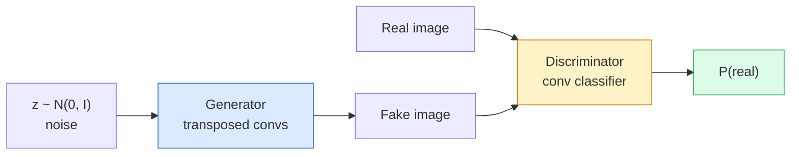
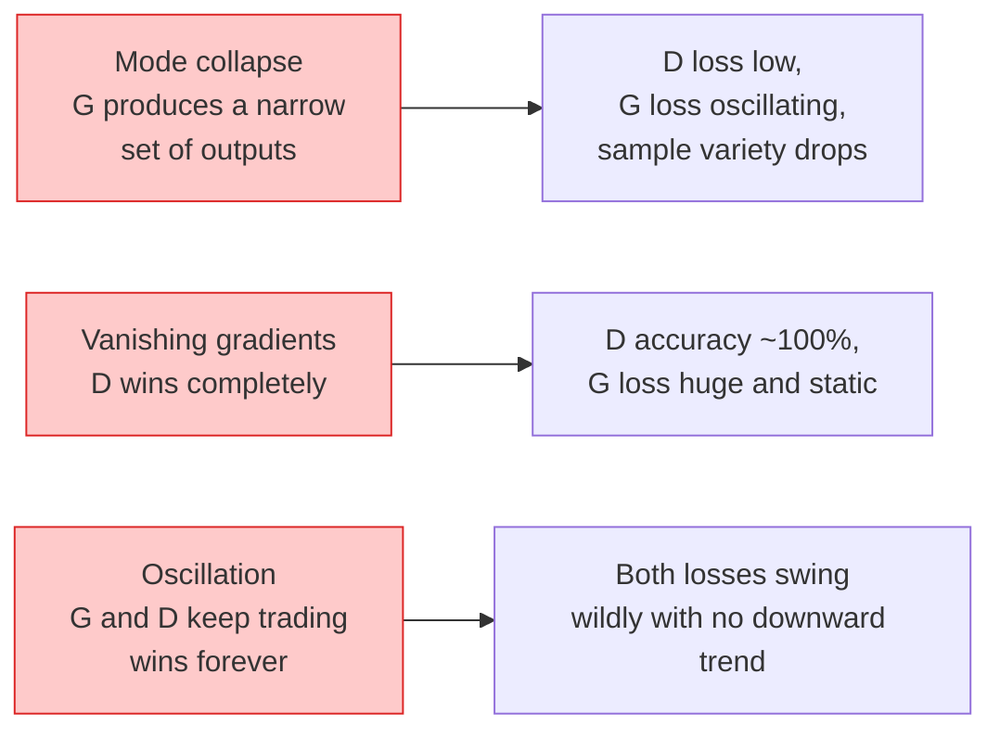

# 图像生成 GAN

> 两种神经网络在一个固定游戏中,一个抽奖,一个批评. 他们一起变得更好,直到图纸欺骗了批评者.

**Type:** Build
**Languages:** Python
**Prerequisites:** Phase 4 Lesson 03 (CNNs), Phase 3 Lesson 06 (Optimizers), Phase 3 Lesson 07 (Regularization)
**Time:** ~75 minutes

## 学习目标

- 解释生成器和分辨器之间的最小数游戏,以及为什么平衡与p_model =p_data相符
- 在 PyTorch 中实现DCGAN,并使它在60行以下生成一致的32x32合成图像
- 通过三个标准技巧稳定GAN训练:不和损失,光谱规范,TTUR (两次更新规则)
- 阅读训练曲线,将健康的融合与模式崩,振荡和歧视者完全区分

## 问题

类别教导网络将图像映射到标签上. 生成逆转问题:样本新图像看起来像来自同一分布. 没有"正确"输出,你可以不同;只有一个你想模仿的分布.

标准损失函数 (MSE,跨进) 无法测量"这个样本是否来自真实分布".减少每像素错误会产生模糊的平均值,而不是现实样本.突破是学习损失:训练第二个网络,其工作是区分真实与假,并使用其判断力推出发电机.

截至2018年,StyleGAN正在生产1024x1024面,无法与照片区分.从那以后,扩散模型已经在质量和可控制性方面占据了王位,但使扩散实用化的每一个技巧都是GAN上第一次理解的.

## 概念

### 两家网络



其他**generator** G 取出噪音向量`z`它们可以通过一个图像来输出.**discriminator**图像的概率是真实的.

### 游戏

格希望D错误,D想要正确.

```
min_G max_D  E_x[log D(x)] + E_z[log(1 - D(G(z)))]
```

读到右到左:D是最大化真实 (`log D(real)`) 和假 (`log (1 - D(fake))`图像. G 正在尽量减少D的虚假信息准确性.`D(G(z))`为了高兴.

士证明这个最小值有一个全球平衡`p_G = p_data`并且在生成和实际分布之间的森-申农分歧是零.

### 无化的损失

早期训练, 早期训练,`D(G(z))`对于每一个假冒,几乎是零,所以`log(1 - D(G(z)))`解决方案是翻转G的损失.

```
L_D = -E_x[log D(x)] - E_z[log(1 - D(G(z)))]
L_G = -E_z[log D(G(z))]                          # non-saturating
```

现在什么时候?`D(G(z))`现在,每一个现代GAN列车都用这种变体.

### DCGAN架构规则

拉德福德,梅茨,辛塔拉 (2015) 将多年的失败实验分成五项规则,使得GAN训练稳定:

1. 换成双脚 (两个网) 的聚合器.
2. 在发电机和分辨器中使用批量标准,除了G输出和D输入.
3. 移除更深层的结构上完全连接的层次.
4. G 在所有层上使用ReLU,除了输出 (在 [-1, 1] 中输出的tanh).
5. D 在所有层上使用LeakyReLU (负_斜率=0.2).

现在,每一个基于的GAN (StyleGAN,BigGAN,GigaGAN) 都从这些规则开始,

### 失败模式及其签名



- **Mode collapse**修复:添加微批次分辨率,光谱规范或标签条件.
- **Discriminator wins**修复:D较小,D学习率较低,或将标签滑滑在真实标签上.
- **Oscillation**修复:TTUR (D学习比G快2倍2倍),或转向Wasserstein损失.

### 评估

没有实在的GAN,你怎么知道它们是有效的?

- **Sample inspection**每一个时代结束时,只要看看64个样本.
- **FID (Fréchet Inception Distance)** 距离在实体和生成集合的分类中.较低更好.
- **Inception Score**年龄较大,较脆弱;更喜欢FID.
- **Precision/Recall for generative models** 单独测量质量 (精度) 和覆盖性 (召回).

对于小型合成数据运行,样本检查就足够了.

```figure
cv-gan-image
```

## 建立它

### 步骤1:发电机

通过 64 维噪音生成32x32图像的小型DCGAN发电机.

```python
import torch
import torch.nn as nn

class Generator(nn.Module):
    def __init__(self, z_dim=64, img_channels=3, feat=64):
        super().__init__()
        self.net = nn.Sequential(
            nn.ConvTranspose2d(z_dim, feat * 4, kernel_size=4, stride=1, padding=0, bias=False),
            nn.BatchNorm2d(feat * 4),
            nn.ReLU(inplace=True),
            nn.ConvTranspose2d(feat * 4, feat * 2, kernel_size=4, stride=2, padding=1, bias=False),
            nn.BatchNorm2d(feat * 2),
            nn.ReLU(inplace=True),
            nn.ConvTranspose2d(feat * 2, feat, kernel_size=4, stride=2, padding=1, bias=False),
            nn.BatchNorm2d(feat),
            nn.ReLU(inplace=True),
            nn.ConvTranspose2d(feat, img_channels, kernel_size=4, stride=2, padding=1, bias=False),
            nn.Tanh(),
        )

    def forward(self, z):
        return self.net(z.view(z.size(0), -1, 1, 1))
```

转换了四个车辆,每个车辆都有`kernel_size=4, stride=2, padding=1`通过TANH,输出激活在 [-1, 1] 中.

### 第二步: 歧视者

漏的雷卢,步骤的电梯,以一个尺度的逻辑结束.

```python
class Discriminator(nn.Module):
    def __init__(self, img_channels=3, feat=64):
        super().__init__()
        self.net = nn.Sequential(
            nn.Conv2d(img_channels, feat, kernel_size=4, stride=2, padding=1),
            nn.LeakyReLU(0.2, inplace=True),
            nn.Conv2d(feat, feat * 2, kernel_size=4, stride=2, padding=1, bias=False),
            nn.BatchNorm2d(feat * 2),
            nn.LeakyReLU(0.2, inplace=True),
            nn.Conv2d(feat * 2, feat * 4, kernel_size=4, stride=2, padding=1, bias=False),
            nn.BatchNorm2d(feat * 4),
            nn.LeakyReLU(0.2, inplace=True),
            nn.Conv2d(feat * 4, 1, kernel_size=4, stride=1, padding=0),
        )

    def forward(self, x):
        return self.net(x).view(-1)
```

最后一个缩一个`4x4`功能地图`1x1`输出是每张图像的单个 skalar;仅在损失计算过程中应用 sigmoid.

### 步骤3:培训步骤

换个方式:一次更新D,然后一次更新G,每批次.

```python
import torch.nn.functional as F

def train_step(G, D, real, z, opt_g, opt_d, device):
    real = real.to(device)
    bs = real.size(0)

    # D step
    opt_d.zero_grad()
    d_real = D(real)
    d_fake = D(G(z).detach())
    loss_d = (F.binary_cross_entropy_with_logits(d_real, torch.ones_like(d_real))
              + F.binary_cross_entropy_with_logits(d_fake, torch.zeros_like(d_fake)))
    loss_d.backward()
    opt_d.step()

    # G step
    opt_g.zero_grad()
    d_fake = D(G(z))
    loss_g = F.binary_cross_entropy_with_logits(d_fake, torch.ones_like(d_fake))
    loss_g.backward()
    opt_g.step()

    return loss_d.item(), loss_g.item()
```

`G(z).detach()`在D步骤中,关键是:我们不希望更新时渐变流入G.忘记这是经典的初学者错误.

### 步骤4:合成形状的全训练循环

```python
from torch.utils.data import DataLoader, TensorDataset
import numpy as np

def synthetic_images(num=2000, size=32, seed=0):
    rng = np.random.default_rng(seed)
    imgs = np.zeros((num, 3, size, size), dtype=np.float32) - 1.0
    for i in range(num):
        r = rng.uniform(6, 12)
        cx, cy = rng.uniform(r, size - r, size=2)
        yy, xx = np.meshgrid(np.arange(size), np.arange(size), indexing="ij")
        mask = (xx - cx) ** 2 + (yy - cy) ** 2 < r ** 2
        color = rng.uniform(-0.5, 1.0, size=3)
        for c in range(3):
            imgs[i, c][mask] = color[c]
    return torch.from_numpy(imgs)

device = "cuda" if torch.cuda.is_available() else "cpu"
data = synthetic_images()
loader = DataLoader(TensorDataset(data), batch_size=64, shuffle=True)

G = Generator(z_dim=64, img_channels=3, feat=32).to(device)
D = Discriminator(img_channels=3, feat=32).to(device)
opt_g = torch.optim.Adam(G.parameters(), lr=2e-4, betas=(0.5, 0.999))
opt_d = torch.optim.Adam(D.parameters(), lr=2e-4, betas=(0.5, 0.999))

for epoch in range(10):
    for (batch,) in loader:
        z = torch.randn(batch.size(0), 64, device=device)
        ld, lg = train_step(G, D, batch, z, opt_g, opt_d, device)
    print(f"epoch {epoch}  D {ld:.3f}  G {lg:.3f}")
```

`Adam(lr=2e-4, betas=(0.5, 0.999))`低的beta1 阻碍动力期来稳定对手的游戏.

### 步骤5:采样

```python
@torch.no_grad()
def sample(G, n=16, z_dim=64, device="cpu"):
    G.eval()
    z = torch.randn(n, z_dim, device=device)
    imgs = G(z)
    imgs = (imgs + 1) / 2
    return imgs.clamp(0, 1)
```

在采样之前,总是切换到评估模式.对于DCGAN来说,这是重要的,因为使用批量规范运行统计数据而不是批量统计数据.

### 步骤 6: 频谱规范化

网络保证的区别器中,BN的替代器是1-Lipschitz.

```python
from torch.nn.utils import spectral_norm

def build_sn_discriminator(img_channels=3, feat=64):
    return nn.Sequential(
        spectral_norm(nn.Conv2d(img_channels, feat, 4, 2, 1)),
        nn.LeakyReLU(0.2, inplace=True),
        spectral_norm(nn.Conv2d(feat, feat * 2, 4, 2, 1)),
        nn.LeakyReLU(0.2, inplace=True),
        spectral_norm(nn.Conv2d(feat * 2, feat * 4, 4, 2, 1)),
        nn.LeakyReLU(0.2, inplace=True),
        spectral_norm(nn.Conv2d(feat * 4, 1, 4, 1, 0)),
    )
```

换换`Discriminator`为了`build_sn_discriminator()`频谱规范是你能应用的最简单的单一强度升级.

## 用它

对于严格的生成,使用预训练的权重或转换为扩散.

- `torch_fidelity`在你的发电机上计算FID/IS,而不需要编写定制的评估代码.
- `pytorch-gan-zoo`其他国家`StudioGAN`试验的DCGAN,WGAN-GP,SN-GAN,StayGAN和BigGAN的实施方案.

在2026年,GAN仍然是最好的选择:实时图像生成 (延迟 <10 ms),风格转移,精确控制的图像到图像翻译 (Pix2Pix,CycleGAN).

## 运送它

这一课产生了:

- `outputs/prompt-gan-training-triage.md`一个提示,读取训练曲线描述,选择失败模式 (模式崩,D-win,振荡) 加上单个建议的修复.
- `outputs/skill-dcgan-scaffold.md`写一个DCGAN架子的技能`z_dim`目标`image_size`其他`num_channels`包括训练循环和样本节省器.

## 运动

1. **(Easy)**在每个时代结束时,将DCGAN训练在合成圈数据集上,并保存16个样本的网格.
2. **(Medium)**换取分辨器的批量标准,用光谱标准. 训练两种版本一边. 哪个版本更快地融合?哪个种子之间的差异较低?
3. **(Hard)**实施条件的DCGAN:将类标签输入到G和D (在G中对噪音进行一次性缩,在D中缩放类嵌入道).从第7课中训练合成"圆与平方"数据集,并通过采用特定标签进行样本测试来证明类调节工作.

## 关键词

| Term | What people say | What it actually means |
|------|----------------|----------------------|
| Generator (G) | "The draws-stuff net" | Maps noise to images; trained to fool the discriminator |
| Discriminator (D) | "The critic" | Binary classifier; trained to distinguish real from generated images |
| Minimax | "The game" | min over G, max over D of an adversarial loss; equilibrium is p_G = p_data |
| Non-saturating loss | "The numerically sane version" | G's loss is -log(D(G(z))) instead of log(1 - D(G(z))) to avoid vanishing gradients early in training |
| Mode collapse | "Generator makes one thing" | G produces only a small subset of the data distribution; fix with SN, minibatch discrimination, or larger batch |
| TTUR | "Two learning rates" | D learns faster than G, typically by a factor of 2-4; stabilises training |
| Spectral norm | "1-Lipschitz layer" | A weight-normalisation that bounds each layer's Lipschitz constant; stops D from becoming arbitrarily steep |
| FID | "Fréchet Inception Distance" | Distance between Inception-v3 feature distributions of real and generated sets; the standard evaluation metric |

## 进一步阅读

- [Generative Adversarial Networks (Goodfellow et al., 2014)](https://arxiv.org/abs/1406.2661)报纸是这一切的起始.
- [DCGAN (Radford, Metz, Chintala, 2015)](https://arxiv.org/abs/1511.06434)使GAN可培训的建筑规则
- [Spectral Normalization for GANs (Miyato et al., 2018)](https://arxiv.org/abs/1802.05957)最有用的稳定技巧
- [StyleGAN3 (Karras et al., 2021)](https://arxiv.org/abs/2106.12423)苏塔甘;读起来像一个最伟大的成功专辑,
