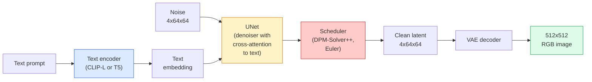

# 稳定扩散 建筑和精细调节

> 稳定扩散是DDPM,在预训练的VAE的隐藏空间中运行,通过横向注意力来调节文字,用快速确定性ODE解决器进行样本测试,并通过无分类器指导来引导.

**Type:** Learn + Use
**Languages:** Python
**Prerequisites:** Phase 4 Lesson 10 (Diffusion), Phase 7 Lesson 02 (Self-Attention)
**Time:** ~75 minutes

## 学习目标

- 追踪稳定扩散管道的五个部分:VAE,文本编码器,U-Net,时间表,安全检查器以及它们实际上每一个都做什么
- 解释隐藏扩散以及为什么训练在4x64x64隐藏空间 (而不是3x512x512图像) 减少计算量48倍,而不损失质量
- 使用`diffusers`通过控制网进行图像生成,图像到图像运行,涂料和引导生成
- 调整细节,在小型定制数据集上使用LoRA稳定扩散,并在推断时加载LoRA适配器

## 问题

直接在512x512RGB图像上训练DDPM是昂贵的.每一步训练都通过U-Net来回升,看到3x512x512 =786,432输入值,采样需要50+次通过同一U-Net.在稳定扩散1.5的质量水平 (2022年发布) 上,像素空间扩散需要大约256个GPU月的训练和每张图像在消费GPU上需要10-30秒.

让开放式文字到图像的操作是**latent diffusion**训练一个VAE,将3x512x512图像映射到4x64x64隐形子,然后在隐形空间中进行扩散.计算下降到`(3*512*512)/(4*64*64) = 48x`在同一GPU上取样从几十秒钟下降到两个秒钟以下.

几乎所有现代图像生成模型都是隐藏的扩散模型,其变化包括自动编码器,指标器 (U-Net或 DiT) 和文本调节.学习稳定扩散,你已经学习了模板.

## 概念

### 管道



- **VAE**冷的自动编码器.编码器将图像转化为隐形 (用于img2img和训练).解码器将隐形转化为图像.
- **Text encoder** CLIP文本编码器 (SD 1.x/2.x), CLIP-L + CLIP-G (SDXL),或 T5-XXL (SD3/FLUX).生成一个代币嵌入的序列.
- **U-Net**标示器. 具有跨重视层,从隐藏到每个分辨率级别内嵌的文本.
- **Scheduler**采样算法 (DDIM,Euler,DPM-Solver++). 选择了 sigmas,将预测的噪音混合到隐藏中.
- **Safety checker**输出图像上可选的NSFW/非法内容过器.

### 无分类指导 (CFG)

简体文本调节学习`epsilon_theta(x_t, t, c)`每次提醒`c` CFG 运营同一个网络`c`结果是: 由于声的发生在声中,声的发生在声中,声的发生在声中.

```
eps = eps_uncond + w * (eps_cond - eps_uncond)
```

`w`率是指导的.`w=0`没有条件`w=1`完全有条件的.`w>1`通过 SD 默认方式, SD 输出将会变得更"即时"`w=7.5`现在,我们要去.

由于CFG是文字到图像的原因,因此产品质量很好.如果没有CFG,输出偏差很弱;如果没有CFG,输出偏差很弱.

### 隐形空间几何学

射器的4通道隐藏不仅仅是压缩图像. 它是一个多元化,数学的大致与语义编辑相匹配 (即时工程 + 插曲都在这里生活), 无机4x64x64隐藏的解码不会产生随机看起来的图像,它产生垃圾,因为只有特定的隐藏的子组才能解码有效的图像.

两种后果:

1. **Img2img**图像结构存活,因为编码几乎可以逆转;内容根据提示变化.
2. **Inpainting**= 与 img2img相同,但指标只更新隐藏区域;未隐藏区域则保持在编码的隐藏状态.

### 网络架构

 SD U-Net是从10课开始的TinyUNet的大版本,

- **Transformer blocks**在每一个空间分辨率上,包含自我注意力+对文本嵌入的横向注意力.
- **Time embedding**通过MLP在鼻状编码上.
- **Skip connections**在相匹配分辨率的编码器和解码器之间.

总参数在SD 1.5: ~860M.SDXL: ~2.6B.FLUX: ~12B.参数跳跃主要是在注意层.

### 洛拉细调

稳定散的完整细节调整需要20 GB以上的VRAM,并更新了860M参数.LoRA (低级调整) 保持了基模型的冷,并将小级分解矩阵注入注意层中.SD的LoRA适配器通常为10-50MB,在单个消费者GPU上在10-60分钟内运行,并在推断时间中作为降入修改进行加载.

```
Original: W_q : (d_in, d_out)   frozen
LoRA:     W_q + alpha * (A @ B)   where A : (d_in, r), B : (r, d_out)

r is typically 4-32.
```

洛拉是几乎每个社区的细节调节分布的方式.

### 你会看到的时间表

- **DDIM**确定性,50步,简单.
- **Euler ancestral** ,30-50步,稍微有创意的样本.
- **DPM-Solver++ 2M Karras**定性,20-30步,生产默认.
- **LCM / TCD / Turbo**一致性模型和蒸变体; 1-4步,以某些质量为代价.

交换时间表是单行变化`diffusers`并且有时在没有任何重新培训的情况下解决样本问题.

```figure
cv3-latent-compression
```

## 建立它

这一课使用`diffusers`它们是自主课程的主题,而不是从零开始重建稳定扩散.你需要重建的部分 (VAE,文本编码器,U-Net,规划器).

### 步骤1:文字到图像

```python
import torch
from diffusers import StableDiffusionPipeline

pipe = StableDiffusionPipeline.from_pretrained(
    "runwayml/stable-diffusion-v1-5",
    torch_dtype=torch.float16,
).to("cuda")

image = pipe(
    prompt="a dog riding a skateboard in tokyo, studio ghibli style",
    guidance_scale=7.5,
    num_inference_steps=25,
    generator=torch.Generator("cuda").manual_seed(42),
).images[0]
image.save("dog.png")
```

`float16`没有明显的质量损失. `num_inference_steps=25`具有默认的DPM-Solver++匹配`num_inference_steps=50`通过DDIM.

### 步骤 2: 改变时间表

```python
from diffusers import DPMSolverMultistepScheduler, EulerAncestralDiscreteScheduler

pipe.scheduler = DPMSolverMultistepScheduler.from_config(pipe.scheduler.config)
pipe.scheduler = EulerAncestralDiscreteScheduler.from_config(pipe.scheduler.config)
```

时间表表的状态与U-Net权重分离.你可以训练DDPM和任何时间表表的样本.

### 步骤3:图像对图像

```python
from diffusers import StableDiffusionImg2ImgPipeline
from PIL import Image

img2img = StableDiffusionImg2ImgPipeline.from_pretrained(
    "runwayml/stable-diffusion-v1-5",
    torch_dtype=torch.float16,
).to("cuda")

init_image = Image.open("dog.png").convert("RGB").resize((512, 512))
out = img2img(
    prompt="a dog riding a skateboard, oil painting",
    image=init_image,
    strength=0.6,
    guidance_scale=7.5,
).images[0]
```

`strength`音量是指在除之前增加多少噪音 (0.0 = 没有变化, 1.0 = 完全再生).

### 步骤4:涂料

```python
from diffusers import StableDiffusionInpaintPipeline

inpaint = StableDiffusionInpaintPipeline.from_pretrained(
    "runwayml/stable-diffusion-inpainting",
    torch_dtype=torch.float16,
).to("cuda")

image = Image.open("dog.png").convert("RGB").resize((512, 512))
mask = Image.open("dog_mask.png").convert("L").resize((512, 512))

out = inpaint(
    prompt="a cat",
    image=image,
    mask_image=mask,
    guidance_scale=7.5,
).images[0]
```

面具中的白色像素是再生区域.

### 步骤5:LoRA加载

```python
pipe.load_lora_weights("sayakpaul/sd-lora-ghibli")
pipe.fuse_lora(lora_scale=0.8)

image = pipe(prompt="a village square in ghibli style").images[0]
```

`lora_scale`控制强度;0.0 =没有效果,1.0 =完全效果. `fuse_lora`调用器将适配器放入适配的重量,但防止交换.`pipe.unfuse_lora()`在加载不同的适配器之前.

### 步骤 6: LoRA培训 (草图)

实际的LORA培训生活在`peft`或`diffusers.training`概述:

```python
# Pseudocode
for step, batch in enumerate(dataloader):
    images, prompts = batch
    latents = vae.encode(images).latent_dist.sample() * 0.18215

    t = torch.randint(0, num_train_timesteps, (batch_size,))
    noise = torch.randn_like(latents)
    noisy_latents = scheduler.add_noise(latents, noise, t)

    text_emb = text_encoder(tokenizer(prompts))

    pred_noise = unet(noisy_latents, t, text_emb)  # LoRA weights injected here

    loss = F.mse_loss(pred_noise, noise)
    loss.backward()
    optimizer.step()
```

只有LoRA矩阵才会接收梯度;基层U-Net,VAE和文本编码器被结. 随着批量大小为1和梯度检查点,这适合8GB的VRAM.

## 用它

在生产中,你实际做出的决定:

- **Model family**:SD 1.5用于开源社区细节调音,SDXL用于更高的忠诚度,SD3 / FLUX用于最先进的技术和严格的许可要求.
- **Scheduler**: DPM-Solver++ 2M Karras 进行20-30步,LCM-LoRA 延迟低于1秒时.
- **Precision**其他`float16`关于4080/4090的情况`bfloat16`在A100及新型道路上,`int8`(通过`bitsandbytes`或`compel`) 当VRAM紧张时.
- **Conditioning**: 简体文本工作;为了更强大的控制,在基管线上添加ControlNet (可,深度,姿势).

对于批发发,`AUTO1111`现在,`ComfyUI`对于生产API, `diffusers`其他`accelerate`或`optimum-nvidia`通过 TensorRT 编译.

## 运送它

这一课产生了:

- `outputs/prompt-sd-pipeline-planner.md`一个提示,以选择SD 1.5 / SDXL / SD3 / FLUX加上调度器和精度,考虑到延迟预算,忠诚度目标和许可限制.
- `outputs/skill-lora-training-setup.md`写完整的 LoRA 训练配置,包括标题,排名,批量大小和学习率.

## 运动

1. **(Easy)**生成相同的提示`guidance_scale`在`[1, 3, 5, 7.5, 10, 15]`图像的变化如何?
2. **(Medium)**拍摄任何真实的照片,查看它.`StableDiffusionImg2ImgPipeline`在`strength`在`[0.2, 0.4, 0.6, 0.8, 1.0]`什么强度保留了组合,同时改变了风格?为什么1.0完全忽略了输入?
3. **(Hard)**训练一个LoRA在一个主体 (一个物,一个标志,一个角色) 的10-20个图像上,并生成其中的主体的新奇场景. 报告LoRA排名和训练步骤,没有过度适应输入图像的最佳身份保护.

## 关键词

| Term | What people say | What it actually means |
|------|----------------|----------------------|
| Latent diffusion | "Diffuse in latents" | Run the entire DDPM in the VAE latent space (4x64x64) instead of pixel space (3x512x512); 48x compute saving |
| VAE scale factor | "0.18215" | Constant that rescales the VAE's raw latent to roughly unit variance; hardcoded in every SD pipeline |
| Classifier-free guidance | "CFG" | Mix conditional and unconditional noise predictions; the single most impactful inference knob |
| Scheduler | "Sampler" | The algorithm that turns noise + model predictions into a denoised latent trajectory |
| LoRA | "Low-rank adapter" | Small rank-decomposition matrices that fine-tune attention layers without touching base weights |
| Cross-attention | "Text-image attention" | Attention from latent tokens to text tokens; injects prompt information at every U-Net level |
| ControlNet | "Structure conditioning" | A separately-trained adapter that steers SD with an extra input (canny, depth, pose, segmentation) |
| DPM-Solver++ | "The default scheduler" | Second-order deterministic ODE solver; best quality at low step counts (20-30) in 2026 |

## 进一步阅读

- [High-Resolution Image Synthesis with Latent Diffusion (Rombach et al., 2022)](https://arxiv.org/abs/2112.10752)稳定散纸;包括任何证明设计合理的除
- [Classifier-Free Diffusion Guidance (Ho & Salimans, 2022)](https://arxiv.org/abs/2207.12598)CFG文件
- [LoRA: Low-Rank Adaptation of Large Language Models (Hu et al., 2021)](https://arxiv.org/abs/2106.09685) LoRA是NLP的第一位;它几乎没有变化转移到SD
- [diffusers documentation](https://huggingface.co/docs/diffusers)每个SD/SDXL/SD3/FLUX管道的参考
