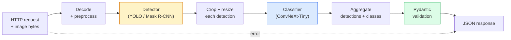

# 建立一个完整的视觉管道  石头

> 产品视觉系统是一个由数据合同编织成的模型和规则链.

**Type:** Build
**Languages:** Python
**Prerequisites:** Phase 4 Lessons 01-15
**Time:** ~120 minutes

## 学习目标

- 设计一个产品视觉管道,检测到物体,分类它们,并发出结构化的JSON ,每一个处理失败路径
- 连接一个探测器 (面具R-CNN或YOLO),一个分类器 (ConvNeXt-Tiny),以及一个数据合同 (Pydantic) 进入一个服务
- 标记端到端管道并确定第一个瓶 (通常是预处理,然后是检测器)
- 运送一个最小的FastAPI服务,它接受图像上传,运行管道,并返回分类的检测

## 问题

视觉模型是有用的;视觉产品是它们的链.零售货架审计是检测器加上产品分类器加上价格OCR管道.自动驾驶是2D检测器加上3D检测器加上分类器加上跟踪器加上规划器.医疗预显示器是分类器加上区域分类器加上临床 UI.

连接这些链是分离ML原型与产品的部分. 模型之间的每个接口都是错误的新地方. 每个坐标转换,每一个正常化,每一个面具尺寸变化都是一个沉默失败候选人. 管道是最弱的接口一样强大.

这块顶石设置了最小可行的管道:检测+分类+结构化输出+服务层.第四阶段的其他所有插槽都进入这个骨架:换面膜R-CNN为YOLOv8,添加OCR头,添加细分分支,添加跟踪器.架构稳定;碎片可插.

## 概念

### 管道



两种模型阶段是昂贵的,其他五个阶段是昆虫居住的地方.

### 与Pydantic签订数据合同

每个模型边界都变成一个打字的对象,这将沉默的失败变成响的失败.

```
Detection(
    box: tuple[float, float, float, float],   # (x1, y1, x2, y2), absolute pixels
    score: float,                              # [0, 1]
    class_id: int,                             # from detector's label map
    mask: Optional[list[list[int]]],           # RLE-encoded if present
)

PipelineResult(
    image_id: str,
    detections: list[Detection],
    classifications: list[Classification],
    inference_ms: float,
)
```

当探测器返回盒子时`(cx, cy, w, h)`没有`(x1, y1, x2, y2)`通过Pydantic的验证在边界失败,你立即发现,而不是调试下游的作物,

### 延迟时间的发生

几乎每个视觉管道都有三个真理:

1. **Preprocessing is often the biggest single block.**解码JPEG,转换色域,重新尺寸这些都是CPU绑定的,容易忘记.
2. **The detector dominates GPU time.**现在,我们在检测前进传输中使用70到90%的GPU时间.
3. **Postprocessing (NMS, RLE encode/decode) is cheap on GPU, expensive on CPU.**总是与实际目标联系在一起.

了解分布是使优化成为优先事项列表的原因.

### 失败模式

- **Empty detections**返回空清单,不要崩.
- **Out-of-bounds boxes**在切割前将图像尺寸固定.
- **Tiny crops** 对于小于分类器的最低输入值小的框,跳过分类.
- **Corrupt upload** 400个特定错误代码的响应,而不是 500个.
- **Model load failure**服务启动时失败,而不是在第一次请求时.

一个生产管道处理这些,没有写通用.`try/except`每个失败都会得到一个名字代码和一个反应.

### 批量

产品服务服务于多个客户端. 批量检测和分类在请求中乘以吞吐量. 交易:等待批量填充的额外延迟. 典型的设置:收集到20ms的请求,批量在一起,处理,分配响应. `torchserve`其他`triton`预测负载的小型服务器自行推出自己的微型批量.

```figure
v4-vision-pipeline
```

## 建立它

### 步骤1:数据合同

```python
from pydantic import BaseModel, Field
from typing import List, Optional, Tuple

class Detection(BaseModel):
    box: Tuple[float, float, float, float]
    score: float = Field(ge=0, le=1)
    class_id: int = Field(ge=0)
    mask_rle: Optional[str] = None


class Classification(BaseModel):
    detection_index: int
    class_id: int
    class_name: str
    score: float = Field(ge=0, le=1)


class PipelineResult(BaseModel):
    image_id: str
    detections: List[Detection]
    classifications: List[Classification]
    inference_ms: float
```

五秒代码可以节省一个小时的调试任何严重的管道.

### 步骤2:最低管道类

```python
import time
import numpy as np
import torch
from PIL import Image

class VisionPipeline:
    def __init__(self, detector, classifier, class_names,
                 device="cpu", min_crop=32):
        self.detector = detector.to(device).eval()
        self.classifier = classifier.to(device).eval()
        self.class_names = class_names
        self.device = device
        self.min_crop = min_crop

    def preprocess(self, image):
        """
        image: PIL.Image or np.ndarray (H, W, 3) uint8
        returns: CHW float tensor on device
        """
        if isinstance(image, Image.Image):
            image = np.asarray(image.convert("RGB"))
        tensor = torch.from_numpy(image).permute(2, 0, 1).float() / 255.0
        return tensor.to(self.device)

    @torch.no_grad()
    def detect(self, image_tensor):
        return self.detector([image_tensor])[0]

    @torch.no_grad()
    def classify(self, crops):
        if len(crops) == 0:
            return []
        batch = torch.stack(crops).to(self.device)
        logits = self.classifier(batch)
        probs = logits.softmax(-1)
        scores, cls = probs.max(-1)
        return list(zip(cls.tolist(), scores.tolist()))

    def run(self, image, image_id="anonymous"):
        t0 = time.perf_counter()
        tensor = self.preprocess(image)
        det = self.detect(tensor)

        crops = []
        detections = []
        valid_indices = []
        for i, (box, score, cls) in enumerate(zip(det["boxes"], det["scores"], det["labels"])):
            x1, y1, x2, y2 = [max(0, int(b)) for b in box.tolist()]
            x2 = min(x2, tensor.shape[-1])
            y2 = min(y2, tensor.shape[-2])
            detections.append(Detection(
                box=(x1, y1, x2, y2),
                score=float(score),
                class_id=int(cls),
            ))
            if (x2 - x1) < self.min_crop or (y2 - y1) < self.min_crop:
                continue
            crop = tensor[:, y1:y2, x1:x2]
            crop = torch.nn.functional.interpolate(
                crop.unsqueeze(0),
                size=(224, 224),
                mode="bilinear",
                align_corners=False,
            )[0]
            crops.append(crop)
            valid_indices.append(i)

        class_preds = self.classify(crops)

        classifications = []
        for valid_idx, (cls_id, cls_score) in zip(valid_indices, class_preds):
            classifications.append(Classification(
                detection_index=valid_idx,
                class_id=int(cls_id),
                class_name=self.class_names[cls_id],
                score=float(cls_score),
            ))

        return PipelineResult(
            image_id=image_id,
            detections=detections,
            classifications=classifications,
            inference_ms=(time.perf_counter() - t0) * 1000,
        )
```

每个界面都会被打字,每一个失败路径都有特定的处理决定.

### 步骤3: 连接探测器和分类器

```python
from torchvision.models.detection import maskrcnn_resnet50_fpn_v2
from torchvision.models import convnext_tiny

# Use ImageNet-pretrained weights for a realistic pipeline without training
detector = maskrcnn_resnet50_fpn_v2(weights="DEFAULT")
classifier = convnext_tiny(weights="DEFAULT")
class_names = [f"imagenet_class_{i}" for i in range(1000)]

pipe = VisionPipeline(detector, classifier, class_names)

# Smoke test with a synthetic image
test_image = (np.random.rand(400, 600, 3) * 255).astype(np.uint8)
result = pipe.run(test_image, image_id="demo")
print(result.model_dump_json(indent=2)[:500])
```

### 步骤4:快速API服务

```python
from fastapi import FastAPI, UploadFile, HTTPException
from io import BytesIO

app = FastAPI()
pipe = None  # initialised on startup

@app.on_event("startup")
def load():
    global pipe
    detector = maskrcnn_resnet50_fpn_v2(weights="DEFAULT").eval()
    classifier = convnext_tiny(weights="DEFAULT").eval()
    pipe = VisionPipeline(detector, classifier, class_names=[f"c{i}" for i in range(1000)])

@app.post("/detect")
async def detect_endpoint(file: UploadFile):
    if file.content_type not in {"image/jpeg", "image/png", "image/webp"}:
        raise HTTPException(status_code=400, detail="unsupported image type")
    data = await file.read()
    try:
        img = Image.open(BytesIO(data)).convert("RGB")
    except Exception:
        raise HTTPException(status_code=400, detail="cannot decode image")
    result = pipe.run(img, image_id=file.filename or "upload")
    return result.model_dump()
```

走上`uvicorn main:app --host 0.0.0.0 --port 8000`试验`curl -F 'file=@dog.jpg' http://localhost:8000/detect`现在,我们要去.

### 步骤5: 标记管道

```python
import time

def benchmark(pipe, num_runs=20, image_size=(400, 600)):
    img = (np.random.rand(*image_size, 3) * 255).astype(np.uint8)
    pipe.run(img)  # warm up

    stages = {"preprocess": [], "detect": [], "classify": [], "total": []}
    for _ in range(num_runs):
        t0 = time.perf_counter()
        tensor = pipe.preprocess(img)
        t1 = time.perf_counter()
        det = pipe.detect(tensor)
        t2 = time.perf_counter()
        crops = []
        for box in det["boxes"]:
            x1, y1, x2, y2 = [max(0, int(b)) for b in box.tolist()]
            x2 = min(x2, tensor.shape[-1])
            y2 = min(y2, tensor.shape[-2])
            if (x2 - x1) >= pipe.min_crop and (y2 - y1) >= pipe.min_crop:
                crop = tensor[:, y1:y2, x1:x2]
                crop = torch.nn.functional.interpolate(
                    crop.unsqueeze(0), size=(224, 224), mode="bilinear", align_corners=False
                )[0]
                crops.append(crop)
        pipe.classify(crops)
        t3 = time.perf_counter()
        stages["preprocess"].append((t1 - t0) * 1000)
        stages["detect"].append((t2 - t1) * 1000)
        stages["classify"].append((t3 - t2) * 1000)
        stages["total"].append((t3 - t0) * 1000)

    for stage, times in stages.items():
        times.sort()
        print(f"{stage:12s}  p50={times[len(times)//2]:7.1f} ms  p95={times[int(len(times)*0.95)]:7.1f} ms")
```

在CPU上,典型输出:预处理~3ms,检测300-500ms,分类20-40ms,总数350-550ms.在GPU上,检测是20-40ms,而预处理+分类开始在相对方面更重要.

## 用它

生产模板与相同的结构相结合,加上:

- **Model versioning** 总是记录模型名称和重量哈希在响应中.
- **Per-request trace IDs**记录每个请求的每个阶段时间,以便您可以将缓慢的响应与阶段相关联.
- **Fallback path**如果分类器已停止使用,请返回没有分类的检测,而不是完全不执行请求.
- **Safety filters** NSFW/PII过器在分类后,在响应离开服务之前运行.
- **Batch endpoint**一个`/detect_batch`接受大量处理的图像URL列表.

供生产服务`torchserve`现在`Triton Inference Server`其他`BentoML`处理批量,版本,指标和健康检查.`FastAPI`直接对原型和小型产品来说是很好的.

## 运送它

这一课产生了:

- `outputs/prompt-vision-service-shape-reviewer.md`一个提示,检查视觉服务的代码,以查询合同/响应形状违规行为,并命名第一个破解错误.
- `outputs/skill-pipeline-budget-planner.md`一个技能,鉴于目标延迟和吞吐量,将时间预算分配给每个管道阶段,并标记哪个阶段将首先错过预算.

## 运动

1. **(Easy)**运行任何开放数据集中的10张图像的管道. 报告每个阶段的平均时间和每个图像的检测数量的分布.
2. **(Medium)**添加一个面具输出字段到`Detection`检查JSON的容量低于1MB,即使是10个对象图像.
3. **(Hard)**在分类器前添加微分量器:收集最大10ms的作物,将它们分类成一个GPU调用,每次请求返回结果.每秒5次同时请求的吞吐量增长量和延迟加量.

## 关键词

| Term | What people say | What it actually means |
|------|----------------|----------------------|
| Pipeline | "The system" | An ordered chain of preprocessing, inference, and postprocessing steps with a typed interface between each pair |
| Data contract | "The schema" | Pydantic / dataclass definitions that every stage input and output conforms to; catches integration bugs at the boundary |
| Preprocessing | "Before the model" | Decoding, colour conversion, resizing, normalising; usually the biggest CPU time sink |
| Postprocessing | "After the model" | NMS, mask resize, threshold, RLE encode; cheap on GPU, expensive on CPU |
| Microbatcher | "Collect then forward" | Aggregator that waits a fixed window for multiple requests, runs a single batched forward pass |
| Trace ID | "Request id" | Per-request identifier logged at every stage so slow requests can be traced end-to-end |
| Failure code | "Named error" | Specific error code per failure class instead of generic 500; enables client retry logic |
| Health check | "Readiness probe" | Cheap endpoint that reports whether the service can answer; loadbalancers rely on this |

## 进一步阅读

- [Full Stack Deep Learning — Deploying Models](https://fullstackdeeplearning.com/course/2022/lecture-5-deployment/)生产 ML部署的常规概述
- [BentoML docs](https://docs.bentoml.com)服务框架,配套,版本和指标
- [torchserve docs](https://pytorch.org/serve/)PyTorch的官方服务图书馆
- [NVIDIA Triton Inference Server](https://developer.nvidia.com/triton-inference-server)高吞吐量服务,配套和多型号支持
