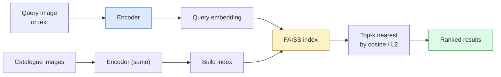

# 图像检索和测量学习

> 测量学习是塑造空间的学科,使距离意味着你想要的.

**Type:** Build
**Languages:** Python
**Prerequisites:** Phase 4 Lesson 14 (ViT), Phase 4 Lesson 18 (CLIP)
**Time:** ~45 minutes

## 学习目标

- 解释三小部分,对比和代理的指标学习损失,并选择给定的数据集的正确数据
- 执行L2规范化和共数相似性正确,并审核"同类"和"同类"检索之间的差异
- 建立一个 FAISS 指数,通过文字和图像查询,并报告回忆@K 对于一个已保留的查询集
- 使用DINOv2,Clip和SigLIP作为现货嵌入骨,并知道每一个赢得什么时候

## 问题

检索在生产视觉中无处不在:重复检测,反向图像搜索,视觉搜索 ("找到类似的产品"),面部重新识别,监控的人身份,电子商务的实例级匹配.

两个设计决定塑造整个系统.嵌入式 产生向量模型.索引 如何在尺度上找到最近的邻居.这两种都是2026年的商品 (嵌入式 DINOv2 ,索引式 FAISS),这提高了条:最难的部分是定义 *什么是类似的* 对于您的应用,然后塑造嵌入式空间,使距离匹配.

塑造是一种微小但高杆性的学科.

## 概念

### 一眼发现



### 失去的四个家庭

| Loss | Requires | Pros | Cons |
|------|----------|------|------|
| **Contrastive** | (anchor, positive) + negatives | Simple, works with any pair label | Slow to converge without many negatives |
| **Triplet** | (anchor, positive, negative) | Intuitive; direct margin control | Hard-triplet mining is expensive |
| **NT-Xent / InfoNCE** | Pairs + batch-mined negatives | Scales to large batches | Needs big batch or momentum queue |
| **Proxy-based (ProxyNCA)** | Class labels only | Fast, stable, no mining | Can overfit to proxies on small datasets |

在大多数生产使用案例中,从预训练的脊椎开始,只需在测试组上使用的嵌入式性能低,才能添加测量学习细节调整.

### 官方的三分之一损失

```
L = max(0, ||f(a) - f(p)||^2 - ||f(a) - f(n)||^2 + margin)
```

拉`a`接近正面`p`让它远离负面`n`通过`margin`对于任何类似性来说,这将使得图像结构普遍化.

矿业问题:轻松三重 (`n`现在还不太久了`a`只有硬三分之一教网络.`n`超过`p`虽然这项技术是最重要的,但在边缘范围内) 是2016年FaceNet的配方,

### 子相似性与L2

两个指标,两个公约:

- **Cosine**需要L2标准化嵌入式.
- **L2**工作在原始或正常嵌入式上,但通常与L2正常化 +2L2相对.

对于大多数现代网络来说,这两种网络是相当的:`||a - b||^2 = 2 - 2 cos(a, b)`什么时候`||a|| = ||b|| = 1`选择与你的嵌入训练相匹配的会议; 默默地混合它们改变了"最接近"的意思.

### 提醒@K

标准检索指标:

```
recall@K = fraction of queries where at least one correct match is in the top K results
```

报告 recall@1, @5, @10 旁边. recall@10 在 0.95 之上, recall@1 在 0.5 之下,意味着嵌入空间有正确的结构,但排名很尝试更长的细节调节或重新排名步骤.

对于重复检测,精度@K更重要,因为每一个假正是用户可见的错误.

### 单一段落中的 FAISS

根据"Facebook AI相似性搜索"的实际图书馆,

- `IndexFlatIP`现在,`IndexFlatL2`粗力,精确,没有训练. 运用到1M向量.
- `IndexIVFFlat`分成K细胞,只搜索最近的几个细胞. 接近,快速,需要训练数据.
- `IndexHNSW`基于图表,最快于许多查询,大指数尺寸.

对于100万个向量,你可能想要`IndexFlatIP`对于10万,你想要的`IndexIVFFlat`对于100万+与产品量化相结合 (`IndexIVFPQ`)

### 实例级别与类别级别检索

两个完全不同的问题,

- **Category-level**"在我的目录中找到猫".类条件相似性;现货CLIP/DINOv2嵌入式工作良好.
- **Instance-level**"在我的目录中找到*这个精确的产品*".需要细微的区分相同类别的视觉相似物体;现货嵌入式性能低;对测量学习问题进行细微调整.

在选择模型之前,你总是问你要解决哪个问题.

```figure
metric-embedding
```

## 建立它

### 步骤1:三分钟损失

```python
import torch
import torch.nn.functional as F

def triplet_loss(anchor, positive, negative, margin=0.2):
    d_ap = F.pairwise_distance(anchor, positive, p=2)
    d_an = F.pairwise_distance(anchor, negative, p=2)
    return F.relu(d_ap - d_an + margin).mean()
```

能在L2标准化或原始嵌入式上使用.

### 步骤2:半硬的采矿

根据嵌入式和标签的批量, 找出每个的最难的半硬负值.

```python
def semi_hard_negatives(emb, labels, margin=0.2):
    dist = torch.cdist(emb, emb)
    same_class = labels[:, None] == labels[None, :]
    diff_class = ~same_class
    N = emb.size(0)

    positives = dist.clone()
    positives[~same_class] = float("-inf")
    positives.fill_diagonal_(float("-inf"))
    pos_idx = positives.argmax(dim=1)

    semi_hard = dist.clone()
    semi_hard[same_class] = float("inf")
    d_ap = dist[torch.arange(N), pos_idx].unsqueeze(1)
    semi_hard[dist <= d_ap] = float("inf")
    neg_idx = semi_hard.argmin(dim=1)

    fallback_mask = semi_hard[torch.arange(N), neg_idx] == float("inf")
    if fallback_mask.any():
        hardest = dist.clone()
        hardest[same_class] = float("inf")
        neg_idx = torch.where(fallback_mask, hardest.argmin(dim=1), neg_idx)
    return pos_idx, neg_idx
```

每个都有最硬的正值,半硬的负值,远于正值,但在边缘范围内.

### 步骤3:回忆@K

```python
def recall_at_k(query_emb, gallery_emb, query_labels, gallery_labels, k=1):
    sim = query_emb @ gallery_emb.T
    _, top_k = sim.topk(k, dim=-1)
    matches = (gallery_labels[top_k] == query_labels[:, None]).any(dim=-1)
    return matches.float().mean().item()
```

在L2标准化嵌入式上,内产量上-k等于kosine上-k.报告至少一个正确邻居的平均查询比例.

### 步骤4: 组合

```python
import torch
import torch.nn as nn
from torch.optim import Adam

class Encoder(nn.Module):
    def __init__(self, in_dim=128, emb_dim=64):
        super().__init__()
        self.net = nn.Sequential(
            nn.Linear(in_dim, 128), nn.ReLU(),
            nn.Linear(128, emb_dim),
        )

    def forward(self, x):
        return F.normalize(self.net(x), dim=-1)

torch.manual_seed(0)
num_classes = 6
protos = F.normalize(torch.randn(num_classes, 128), dim=-1)

def sample_batch(bs=32):
    labels = torch.randint(0, num_classes, (bs,))
    x = protos[labels] + 0.15 * torch.randn(bs, 128)
    return x, labels

enc = Encoder()
opt = Adam(enc.parameters(), lr=3e-3)

for step in range(200):
    x, y = sample_batch(32)
    emb = enc(x)
    pos_idx, neg_idx = semi_hard_negatives(emb, y)
    loss = triplet_loss(emb, emb[pos_idx], emb[neg_idx])
    opt.zero_grad(); loss.backward(); opt.step()
```

后几百步,嵌入集群形成一个集群每个类.

## 用它

2026年生产堆:

- **DINOv2 + FAISS**一般用途的视觉检索.
- **CLIP + FAISS**当查询是短信时.
- **Fine-tuned DINOv2 + FAISS**实例级检索,面部重新识别,时尚,电子商务.
- **Milvus / Weaviate / Qdrant**管理在 FAISS 或 HNSW 周围的向量 DB 包装.

对于SOTA实例检索,配方是:DINOv2脊柱,添加嵌入头,通过三小组调整或InfoNCE损失在实例标记的对,索引在FAISS中.

## 运送它

这一课产生了:

- `outputs/prompt-retrieval-loss-picker.md`一个提示,选择给定的检索问题的三小部分 / InfoNCE / ProxyNCA.
- `outputs/skill-recall-at-k-runner.md`写一个清洁的评估带,以火车//图库分区和适当的数据合同.

## 运动

1. **(Easy)**在训练前和后,用PCA绘制嵌入式图,看看六个集群形成.
2. **(Medium)**添加ProxyNCA损失实现:每个类学习一个"代理",在可西因相似度上标准交叉.在玩具数据上比较缩速度与三分钟损失.
3. **(Hard)**通过 HuggingFace 嵌入DINOv2的1000个ImageNet验证图像,构建一个 FAISS平面索引,并报告回忆@{1, 5, 10}与查询相同的图像 (应该是1.0) 和与ImageNet标签的持久分离作为基础真相.

## 关键词

| Term | What people say | What it actually means |
|------|----------------|----------------------|
| Metric learning | "Shape the space" | Training an encoder so distances in its output space reflect a target similarity |
| Triplet loss | "Pull and push" | L = max(0, d(a, p) - d(a, n) + margin); the canonical metric-learning loss |
| Semi-hard mining | "Useful negatives" | Negatives further from the anchor than the positive but within margin; empirically the most informative |
| Proxy-based loss | "Class prototypes" | One learned proxy per class; cross-entropy over similarity-to-proxies; no pair mining |
| Recall@K | "Top-K hit rate" | Fraction of queries with at least one correct result in the top K |
| Instance retrieval | "Find this exact thing" | Fine-grained matching; off-the-shelf features usually underperform |
| FAISS | "The NN library" | Facebook's nearest-neighbour library; supports exact and approximate indexes |
| HNSW | "Graph index" | Hierarchical navigable small world; fast approximate NN with small memory overhead |

## 进一步阅读

- [FaceNet: A Unified Embedding for Face Recognition (Schroff et al., 2015)](https://arxiv.org/abs/1503.03832)三片损失/半硬的矿山纸
- [In Defense of the Triplet Loss for Person Re-Identification (Hermans et al., 2017)](https://arxiv.org/abs/1703.07737)三重小组细调的实用指南
- [FAISS documentation](https://github.com/facebookresearch/faiss/wiki)每一个指数,每一个交易
- [SMoT: Metric Learning Taxonomy (Kim et al., 2021)](https://arxiv.org/abs/2010.06927)现代损失及其联系的调查
