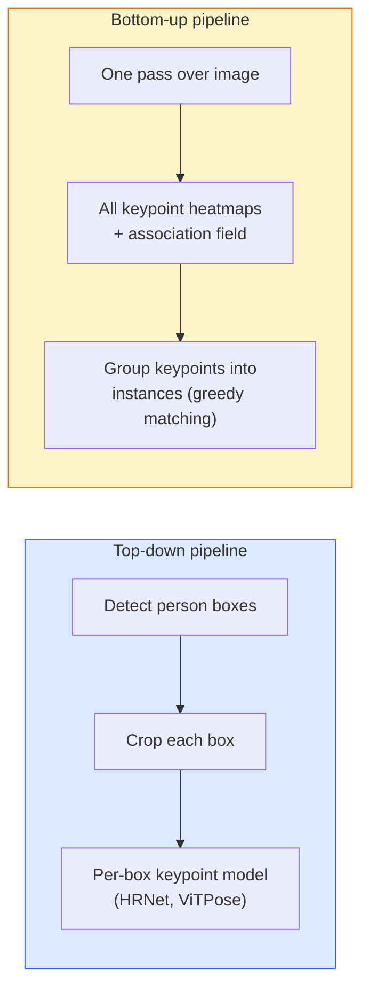

# 关键点检测和姿势估计

> 姿势是一个排序的关键点.一个关键点探测器是热图回归器. 其他的都是会计.

**Type:** Build
**Languages:** Python
**Prerequisites:** Phase 4 Lesson 06 (Detection), Phase 4 Lesson 07 (U-Net)
**Time:** ~45 minutes

## 学习目标

- 区分上下和下上姿势估计,并说明每一个姿势是什么时候使用的
- 对于K键点的回归热图,以每键点的高斯目标,并在推断时提取键点坐标
- 解释部分亲密性字段 (PAF) 以及下向上管道如何将关键点将分为实例
- 使用MediaPipe Pose或MMPose来估算生产关键点,并了解其输出格式

## 问题

关键任务隐藏在许多名字下:人姿 (17 个身体关节),面部标志 (68 或 478 个点),手 (21 个点),动物姿势,机器人物体姿势,医学解剖学标志.它们每个都具有相同的结构:检测对象上的K分离点并输出它们的 (x, y) 坐标.

姿势估计是运动捕捉,健身应用,体育分析,手势控制,动画,AR试验和机器人抓取的基础. 2D 案例已经成熟; 3D 姿势 (从单个摄像头来估计世界坐标中的联合位置) 是当前的研究界限.

工程问题是规模.一个单个图像,一个人姿势是一个20ms的问题.在人群中30fps的多人姿势是一个不同的问题,不同架构.

## 概念

### 向上和下



- **Top-down**首先检测到人,然后在每种作物上运行一个人均关键点模型.
- **Bottom-up**一个前进传输预测所有关键点加上一个关键字段;组组它们.不论群众规模如何,持续时间.

顶部 (HRNet,ViTPose) 是精度领导者;下部 (OpenPose,HigherHRNet) 是拥挤场景的吞吐量领导者.

### 热图回归

没有退缩`(x, y)`直接预测一个`H x W`热地图每一个键点,一个位于真实位置的高斯斑点.

```
target[k, y, x] = exp(-((x - cx_k)^2 + (y - cy_k)^2) / (2 sigma^2))
```

在推断时,每个热图的 argmax 是预测的关键点位置.

为什么热图比直接回归更有效:网络的空间结构 (conv功能地图) 与空间输出自然一致.高斯目标也规范一个小的定位错误会产生小损失,而不是零.

### 亚像素定位

为了获得子像素精度,通过将抛物线与 argmax 和其邻居相连,或使用已知的偏移来精炼.`(dx, dy) = 0.25 * (heatmap[y, x+1] - heatmap[y, x-1], ...)`方向.

### 部分亲密性领域 (PAF)

开放Pose的俩用于下方上方关联.对于每个连接关键点的对 (例如左肩到左肘),预测一个2通道的领域,编码从一个向另一个指向的单元向量.将肩膀与肘部关联,将PAF整合在连接候选对的线路上;具有最高整体的对匹配.

```
For each connection (limb):
  PAF channels: 2 (unit vector x, y)
  Line integral: sum over sample points of (PAF . line_direction)
  Higher integral = stronger match
```

优雅,可达到任意的群众规模,

### COCO关键点

标准的体位数据集:每个人17个关键点,PCK (正确关键点的百分比) 和OKS (对象关键点相似性) 作为指标.OKS是IoU的关键点模拟器,这是COCO mAP@OKS报告的.

### 两维对三维

- **2D pose**图像坐标;在生产质量下解决 (MediaPipe,HRNet,ViTPose).
- **3D pose**世界/摄像机坐标;仍在进行研究.
  - 通过一个小的MLP (VideoPose3D) 将2D预测转换为3D.
  - 直接3D回归从图像 (PyMAF, MHFormer).
  - 为了地上的真相,设置多视图 (CMU Panoptic).

```figure
cv3-pose-heatmap
```

## 建立它

### 步骤1:高斯热图目标

```python
import numpy as np
import torch

def gaussian_heatmap(size, cx, cy, sigma=2.0):
    yy, xx = np.meshgrid(np.arange(size), np.arange(size), indexing="ij")
    return np.exp(-((xx - cx) ** 2 + (yy - cy) ** 2) / (2 * sigma ** 2)).astype(np.float32)

hm = gaussian_heatmap(64, 32, 32, sigma=2.0)
print(f"peak: {hm.max():.3f} at ({hm.argmax() % 64}, {hm.argmax() // 64})")
```

按键点的热图沿着一个道轴堆叠,提供了全部目标子.

### 步骤2: 小键点头

通过U-Net的模型,输出K热图频道.

```python
import torch.nn as nn
import torch.nn.functional as F

class TinyKeypointNet(nn.Module):
    def __init__(self, num_keypoints=4, base=16):
        super().__init__()
        self.down1 = nn.Sequential(nn.Conv2d(3, base, 3, 2, 1), nn.ReLU(inplace=True))
        self.down2 = nn.Sequential(nn.Conv2d(base, base * 2, 3, 2, 1), nn.ReLU(inplace=True))
        self.mid = nn.Sequential(nn.Conv2d(base * 2, base * 2, 3, 1, 1), nn.ReLU(inplace=True))
        self.up1 = nn.ConvTranspose2d(base * 2, base, 2, 2)
        self.up2 = nn.ConvTranspose2d(base, num_keypoints, 2, 2)

    def forward(self, x):
        h1 = self.down1(x)
        h2 = self.down2(h1)
        h3 = self.mid(h2)
        u1 = self.up1(h3)
        return self.up2(u1)
```

输入`(N, 3, H, W)`产量`(N, K, H, W)`损失是每像素的MSE对高斯目标.

### 步骤3: 推理 提取键点坐标

```python
def heatmap_to_coords(heatmaps):
    """
    heatmaps: (N, K, H, W)
    returns:  (N, K, 2) float coordinates in image pixels
    """
    N, K, H, W = heatmaps.shape
    hm = heatmaps.reshape(N, K, -1)
    idx = hm.argmax(dim=-1)
    ys = (idx // W).float()
    xs = (idx % W).float()
    return torch.stack([xs, ys], dim=-1)

coords = heatmap_to_coords(torch.randn(2, 4, 32, 32))
print(f"coords: {coords.shape}")  # (2, 4, 2)
```

为了提高子精度,在 argmax 周围插入.

### 步骤4:合成键点数据集

简单:画出四个点在白色的画布上,

```python
def make_synthetic_sample(size=64):
    img = np.ones((3, size, size), dtype=np.float32)
    rng = np.random.default_rng()
    kps = rng.integers(8, size - 8, size=(4, 2))
    for cx, cy in kps:
        img[:, cy - 2:cy + 2, cx - 2:cx + 2] = 0.0
    hms = np.stack([gaussian_heatmap(size, cx, cy) for cx, cy in kps])
    return img, hms, kps
```

很容易让一个小模型在一分钟内学会.

### 五步:培训

```python
model = TinyKeypointNet(num_keypoints=4)
opt = torch.optim.Adam(model.parameters(), lr=3e-3)

for step in range(200):
    batch = [make_synthetic_sample() for _ in range(16)]
    imgs = torch.from_numpy(np.stack([b[0] for b in batch]))
    hms = torch.from_numpy(np.stack([b[1] for b in batch]))
    pred = model(imgs)
    # Upsample pred to full resolution
    pred = F.interpolate(pred, size=hms.shape[-2:], mode="bilinear", align_corners=False)
    loss = F.mse_loss(pred, hms)
    opt.zero_grad(); loss.backward(); opt.step()
```

## 用它

- **MediaPipe Pose**谷歌的生产姿势估计器; 运输 WebGL + 手机运行时间低于10ms延迟.
- **MMPose**综合研究代码库;每一个SOTA架构都具有预训练的权重.
- **YOLOv8-pose**最快的实时多人姿势,只有一个前进的传球.
- **transformers HumanDPT / PoseAnything**对开放词汇姿势 (任何对象,任何关键点集合) 的新视觉语言方法.

## 运送它

这一课产生了:

- `outputs/prompt-pose-stack-picker.md`一个提示,以视频/YOLOv8-pose/HRNet/ViTPose为期,群众规模和2D对3D需求.
- `outputs/skill-heatmap-to-coords.md`写出每个生产姿势模型使用的子像素热地图到协调程序的技能.

## 运动

1. **(Easy)**报告平均值在预测和真实的关键点之间错误L2200步后.
2. **(Medium)**添加子像素精炼:鉴于 argmax 位置,将一个 1D 抛物线沿 x 和 y 连接到邻近的像素. 报告准确度增长与整数 argmax.
3. **(Hard)**构建一个2人合成数据集,每个图像显示4键点模式的两个实例.使用PAF预测哪个键点属于哪个实例的下游管道,并评估OKS.

## 关键词

| Term | What people say | What it actually means |
|------|----------------|----------------------|
| Keypoint | "A landmark" | A specific ordered point on an object (joint, corner, feature) |
| Pose | "The skeleton" | An ordered set of keypoints belonging to one instance |
| Top-down | "Detect then pose" | Two-stage pipeline: person detector + per-crop keypoint model; highest accuracy |
| Bottom-up | "Pose first, group later" | Single-pass all-keypoint prediction + grouping; constant time in crowd size |
| Heatmap | "Gaussian target" | H x W tensor per keypoint with peak at the true location; the preferred regression target |
| PAF | "Part Affinity Field" | 2-channel unit vector field encoding limb directions; used to group keypoints into instances |
| OKS | "Keypoint IoU" | Object Keypoint Similarity; the COCO metric for pose |
| HRNet | "High-Resolution Net" | The dominant top-down keypoint architecture; preserves high-res features throughout |

## 进一步阅读

- [OpenPose (Cao et al., 2017)](https://arxiv.org/abs/1812.08008) 低至上的PAF;仍然是方法的最佳写作
- [HRNet (Sun et al., 2019)](https://arxiv.org/abs/1902.09212)上下引用架构
- [ViTPose (Xu et al., 2022)](https://arxiv.org/abs/2204.12484)简单的ViT作为一个姿势的脊柱;在许多基准上,目前的SOTA
- [MediaPipe Pose](https://developers.google.com/mediapipe/solutions/vision/pose_landmarker)实时生产姿势;2026年部署最快的堆
