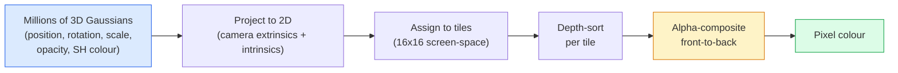

# 从零开始进行3D高斯式光

> 一个场景是数百万的3D高斯人云. 每个场景都有位置,方向,尺度,度,以及一种颜色,取决于视角方向.

**Type:** Build
**Languages:** Python
**Prerequisites:** Phase 4 Lesson 13 (3D Vision & NeRF), Phase 1 Lesson 12 (Tensor Operations), Phase 4 Lesson 10 (Diffusion basics optional)
**Time:** ~90 minutes

## 学习目标

- 解释为什么3D高斯斯派特替代了NeRF作为2026年光现实3D重建的生产默认
- 说明每高斯参数的六个参数 (位置,旋转四旋翼,尺度,度,球状和色,可选特征) 以及每个浮动的数量
- 通过使用2D高斯式光光器从零开始`alpha`编译,然后显示3D案例如何向同一循环投影
- 使用`nerfstudio`现在`gsplat`其他`SuperSplat`为了从20-50张照片中重建一个场景,`KHR_gaussian_splatting`扩展GLTF或OpenUSD 26.03 `UsdVolParticleField3DGaussianSplat`方案

## 问题

一个NeRF存储一个场景作为一个MLP的权重.每一个染的像素都是数百个MLP查询沿线射线.训练需要几个小时,染需要几秒,并且权重不能编辑.如果你想在场景内移动椅子,你必须重新训练.

现在,我们已经开始使用了3D高斯式分光 (Kerbl,Kopanas,Leimkühler,Drettakis,SIGGRAPH 2023) 一个场景是3D高斯人. 转像是GPU缩速度100+fps. 训练需要几分钟. 编辑是直接的:翻译一个小组的高西人,你已经移动了椅子. 到2026年,克罗诺斯集团批准了高斯斯地块的GLTF扩展,OpenUSD 26.03将一个高斯地块方案发送,Zillow和 Apartments.com将房地产带入,大多数关于3D重建的新研究论文都是3DGS核心想法的变体.

心理模型很简单,数学有足够的移动部分,大多数介绍都从化开始,然后跳过投影和球状和.这个课程首先构建了整个东西 2D版本,然后是3D扩展.

## 概念

### 盖斯人带着什么

一个3D高斯人是空间中的一个参数点,

```
position         mu         (3,)    centre in world coordinates
rotation         q          (4,)    unit quaternion encoding orientation
scale            s          (3,)    log-scales per axis (exponentiated at render time)
opacity          alpha      (1,)    post-sigmoid opacity [0, 1]
SH coefficients  c_lm       (3 * (L+1)^2,)   view-dependent colour
```

转换+尺度构建3x3的共变性: `Sigma = R S S^T R^T`球状和使颜色变化,视角方向镜亮点,微妙的光,视角依赖的光,而不需要存储视角纹理.在SH级3时,每种颜色道均为16个系数,仅仅为颜色,每种颜色均为48个浮动.

一场场景通常有1-500万个高斯人.每个场景都存储约60个浮动 (3 + 4 + 3 + 1 + 48 + 混合).这为5百万个高斯人场景的240MB,远小于每个点纹理的等级点云,并且大小量小于NeRF的MLP重量,高分辨率重新呈现.

### 化,而不是射线行驶



五步,所有 GPU 兼容,每像素没有 MLP 查询. 一个 RTX 3080 Ti 能在 147 fps 提供600 万个位置.

### 投影步骤

现在,我们在世界位置上.`mu`具有3D共变性`Sigma`投影机在屏幕位置上`mu'`具有2D共变性`Sigma'`其他:

```
mu' = project(mu)
Sigma' = J W Sigma W^T J^T          (2 x 2)

W = viewing transform (rotation + translation of camera)
J = Jacobian of the perspective projection at mu'
```

两维高斯人的足迹是一个圆,其轴是`Sigma'`每个圆的内部的像素都得到了高斯人的贡献,`exp(-0.5 * (p - mu')^T Sigma'^-1 (p - mu'))`现在,我们要去.

### 组的规则

对于一个像素,它覆盖的高西式被排序为前向 (或以逆式相等于前向后向).颜色由80年代以来的每种半透明的纹器相同的方程组成:

```
C_pixel = sum_i alpha_i * T_i * c_i

T_i = prod_{j < i} (1 - alpha_j)       transmittance up to i
alpha_i = opacity_i * exp(-0.5 * d^T Sigma'^-1 d)   local contribution
c_i = eval_SH(SH_i, view_direction)    view-dependent colour
```

这是**the same equation as NeRF's volumetric render**由于这种身份,所以染质量与NeRF相匹配,它们都整合了相同的辐射场方程.

### 为什么这可以区分

根据高斯的参数,每个步骤都可对其进行分化. 鉴于真相图像,计算呈现的像素损失,通过拉斯特里斯器进行后置,更新所有`(mu, q, s, alpha, c_lm)`通过梯度下降. 超过3万次的代,高斯人找到正确的位置,尺度和颜色.

### 密集和切割

一组固定的高斯人不能覆盖一个复杂的场景.

- **Clone**现在的位置是高斯的,但它的尺度很小.
- **Split**高梯度时,一个大高梯度太平滑,不能适合该区域.
- **Prune**光率下降到值以下的高斯人,

密度运行每次N代.一个场景通常从100k初始高斯人 (从SfM点种植) 增长到训练结束时的1-5M.

### 圆形和在一个段落中

视图依赖的颜色是函数`c(direction)`球体和是球体的福利尔基.`L`你会得到`(L+1)^2`根据一个频道的基本函数.对新视图的颜色进行评估是学习的SH系数和在视图方向评估的基础之间的点分数. 度0 =一个系数 = 常态颜色. 度3 = 16系数 = 足以捕捉兰伯特色,镜像和轻微反射. SD Gaussian Splatting 论文默认使用3 度.

### 2026年生产堆

```
1. Capture         smartphone / DJI drone / handheld scanner
2. SfM / MVS       COLMAP or GLOMAP derives camera poses + sparse points
3. Train 3DGS      nerfstudio / gsplat / inria official / PostShot (~10-30 min on RTX 4090)
4. Edit            SuperSplat / SplatForge (clean floaters, segment)
5. Export          .ply -> glTF KHR_gaussian_splatting or .usd (OpenUSD 26.03)
6. View            Cesium / Unreal / Babylon.js / Three.js / Vision Pro
```

### 4D和生成型变体

- **4D Gaussian Splatting**高西人是时间的函数;用于体积视频 (超人2026年,A$AP罗基的"直升机").
- **Generative splats**文字到片模型 (世界实验室的理石) 幻觉整个场景.
- **3D Gaussian Unscented Transform**NVIDIA NuRec的自动驾驶模拟版本.

```figure
cv3-gaussian-splat
```

## 建立它

### 步骤1:一个2D高斯人

我们首先建造一个2D的纹器,然后在投影后,3D的缩到它.

```python
import torch
import torch.nn as nn
import torch.nn.functional as F


def eval_2d_gaussian(means, covs, points):
    """
    means:  (G, 2)      centres
    covs:   (G, 2, 2)   covariance matrices
    points: (H, W, 2)   pixel coordinates
    returns: (G, H, W)  density at every pixel for every Gaussian
    """
    G = means.size(0)
    H, W, _ = points.shape
    flat = points.view(-1, 2)
    inv = torch.linalg.inv(covs)
    diff = flat[None, :, :] - means[:, None, :]
    d = torch.einsum("gpi,gij,gpj->gp", diff, inv, diff)
    density = torch.exp(-0.5 * d)
    return density.view(G, H, W)
```

`einsum`方形形状是什么?`diff^T Sigma^-1 diff`对于每一个 (高斯,像素) 双.

### 步骤2: 2D 喷式片

两维的深度是无意义的,所以我们使用了学到的每高斯人的尺度来来排序.

```python
def rasterise_2d(means, covs, colours, opacities, depths, image_size):
    """
    means:     (G, 2)
    covs:      (G, 2, 2)
    colours:   (G, 3)
    opacities: (G,)     in [0, 1]
    depths:    (G,)     per-Gaussian scalar used for ordering
    image_size: (H, W)
    returns:   (H, W, 3) rendered image
    """
    H, W = image_size
    yy, xx = torch.meshgrid(
        torch.arange(H, dtype=torch.float32, device=means.device),
        torch.arange(W, dtype=torch.float32, device=means.device),
        indexing="ij",
    )
    points = torch.stack([xx, yy], dim=-1)

    densities = eval_2d_gaussian(means, covs, points)
    alphas = opacities[:, None, None] * densities
    alphas = alphas.clamp(0.0, 0.99)

    order = torch.argsort(depths)
    alphas = alphas[order]
    colours_sorted = colours[order]

    T = torch.ones(H, W, device=means.device)
    out = torch.zeros(H, W, 3, device=means.device)
    for i in range(means.size(0)):
        a = alphas[i]
        out += (T * a)[..., None] * colours_sorted[i][None, None, :]
        T = T * (1.0 - a)
    return out
```

实际的实现不快,使用基 CUDA ,但正确的数学和完全可分化.

### 步骤3:可训练的2D喷场景

```python
class Splats2D(nn.Module):
    def __init__(self, num_splats=128, image_size=64, seed=0):
        super().__init__()
        g = torch.Generator().manual_seed(seed)
        H, W = image_size, image_size
        self.means = nn.Parameter(torch.rand(num_splats, 2, generator=g) * torch.tensor([W, H]))
        self.log_scale = nn.Parameter(torch.ones(num_splats, 2) * math.log(2.0))
        self.rot = nn.Parameter(torch.zeros(num_splats))  # single angle in 2D
        self.colour_logits = nn.Parameter(torch.randn(num_splats, 3, generator=g) * 0.5)
        self.opacity_logit = nn.Parameter(torch.zeros(num_splats))
        self.depth = nn.Parameter(torch.rand(num_splats, generator=g))

    def covs(self):
        s = torch.exp(self.log_scale)
        c, si = torch.cos(self.rot), torch.sin(self.rot)
        R = torch.stack([
            torch.stack([c, -si], dim=-1),
            torch.stack([si, c], dim=-1),
        ], dim=-2)
        S = torch.diag_embed(s ** 2)
        return R @ S @ R.transpose(-1, -2)

    def forward(self, image_size):
        covs = self.covs()
        colours = torch.sigmoid(self.colour_logits)
        opacities = torch.sigmoid(self.opacity_logit)
        return rasterise_2d(self.means, covs, colours, opacities, self.depth, image_size)
```

`log_scale`现在`opacity_logit`其他`colour_logits`通过正确的激活在染时间,所有不受限制的参数都被映射出来.这是每个3DGS实现的标准模式.

### 步骤4:将2D高西安器与目标图像相匹配

```python
import math
import numpy as np

def make_target(size=64):
    yy, xx = np.meshgrid(np.arange(size), np.arange(size), indexing="ij")
    img = np.zeros((size, size, 3), dtype=np.float32)
    # Red circle
    mask = (xx - 20) ** 2 + (yy - 20) ** 2 < 10 ** 2
    img[mask] = [1.0, 0.2, 0.2]
    # Blue square
    mask = (np.abs(xx - 45) < 8) & (np.abs(yy - 40) < 8)
    img[mask] = [0.2, 0.3, 1.0]
    return torch.from_numpy(img)


target = make_target(64)
model = Splats2D(num_splats=64, image_size=64)
opt = torch.optim.Adam(model.parameters(), lr=0.05)

for step in range(200):
    pred = model((64, 64))
    loss = F.mse_loss(pred, target)
    opt.zero_grad(); loss.backward(); opt.step()
    if step % 40 == 0:
        print(f"step {step:3d}  mse {loss.item():.4f}")
```

通过200个步骤,64个高斯人定居在两个形状中.这是整个观念.

### 步骤5:从2D到3D

现在,我们需要一个新的系统,

1. 转换为一个角,而不是一个角.
2. 性是`R S S^T R^T`随着`R`基于四旋翼和`S = diag(exp(log_scale))`现在,我们要去.
3. 投影`(mu, Sigma) -> (mu', Sigma')`通过使用相机外观和视角投影的雅可比安`mu`现在,我们要去.
4. 颜色成为一个球状和的扩展;在观测方向评估它.
5. 根据实际的相机空间,而不是学习的尺度.

每个生产实施 (`gsplat`现在`inria/gaussian-splatting`现在`nerfstudio`) 在基于的CUDA核的GPU上做了这么做.

### 步骤 6: 球形和评价

标准标准为3级,每频道有16个条件.

```python
def eval_sh_degree_3(sh_coeffs, dirs):
    """
    sh_coeffs: (..., 16, 3)   last dim is RGB channels
    dirs:      (..., 3)       unit vectors
    returns:   (..., 3)
    """
    C0 = 0.282094791773878
    C1 = 0.488602511902920
    C2 = [1.092548430592079, 1.092548430592079,
          0.315391565252520, 1.092548430592079,
          0.546274215296039]
    x, y, z = dirs[..., 0], dirs[..., 1], dirs[..., 2]
    x2, y2, z2 = x * x, y * y, z * z
    xy, yz, xz = x * y, y * z, x * z

    result = C0 * sh_coeffs[..., 0, :]
    result = result - C1 * y[..., None] * sh_coeffs[..., 1, :]
    result = result + C1 * z[..., None] * sh_coeffs[..., 2, :]
    result = result - C1 * x[..., None] * sh_coeffs[..., 3, :]

    result = result + C2[0] * xy[..., None] * sh_coeffs[..., 4, :]
    result = result + C2[1] * yz[..., None] * sh_coeffs[..., 5, :]
    result = result + C2[2] * (2.0 * z2 - x2 - y2)[..., None] * sh_coeffs[..., 6, :]
    result = result + C2[3] * xz[..., None] * sh_coeffs[..., 7, :]
    result = result + C2[4] * (x2 - y2)[..., None] * sh_coeffs[..., 8, :]

    # degree 3 terms omitted here for brevity; full 16-coefficient version in the code file
    return result
```

学习`sh_coeffs`在转换时,你将其对当前的视图方向进行评估,并得到3向量 RGB.

## 用它

对于真正的3DGS工作,使用`gsplat`其他地方`nerfstudio`其他:

```bash
pip install nerfstudio gsplat
ns-download-data example
ns-train splatfacto --data path/to/data
```

`splatfacto`运行时间在RTX 4090上需要10-30分钟,

2026年重要的出口选择:

- `.ply`原始的高斯云 (可载,最大的文件).
- `.splat` 播放卡通/超级平板量化格式.
- 鱼`KHR_gaussian_splatting` 克罗诺斯标准,可通过观众传输 (Feb 2026 RC).
- 开通美元`UsdVolParticleField3DGaussianSplat` 美国元原产品,用于NVIDIA Omniverse和Vision Pro管道.

对于4D/动态场景,`4DGS`其他`Deformable-3DGS`延伸相同的机器,使用不同的时间和不透明度.

## 运送它

这一课产生了:

- `outputs/prompt-3dgs-capture-planner.md`一个提示,为特定场景类型计划拍摄会话 (照片数量,摄像头路径,照明).
- `outputs/skill-3dgs-export-router.md`选择合适的出口格式的技能 (`.ply`现在,`.splat`视频显示器或发动机.

## 运动

1. **(Easy)**运行上面的2D光训练器,以不同的合成图像.`num_splats`在`[16, 64, 256]`确定降低回报的点.
2. **(Medium)**扩展2D纹器以支持每高斯式RGB颜色,这些颜色依赖于一个尺度"视角"通过2度和. 训练一对目标图像,并验证模型重建两者.
3. **(Hard)**克隆`nerfstudio`列车`splatfacto`您的任何场景 (桌子,植物,面部,房间) 拍摄的20张照片.`KHR_gaussian_splatting`打开一个视频器 (Three.js `GaussianSplats3D`报告训练时间,高斯人数量,和转载的fps.

## 关键词

| Term | What people say | What it actually means |
|------|----------------|----------------------|
| 3DGS | "Gaussian splats" | Explicit scene representation as millions of 3D Gaussians with per-Gaussian position, rotation, scale, opacity, SH colour |
| Covariance | "Shape of the Gaussian" | `Sigma = R S S^T R^T`; orientation and anisotropic scale of one Gaussian |
| Alpha compositing | "Back-to-front blend" | Same equation as NeRF's volumetric render, now over an explicit sparse set |
| Densification | "Clone and split" | Adaptive addition of new Gaussians where reconstruction is under-fit |
| Pruning | "Delete low-opacity" | Remove Gaussians that have collapsed to near-zero opacity during training |
| Spherical harmonics | "View-dependent colour" | Fourier basis on the sphere; stores colour as a function of viewing direction |
| Splatfacto | "nerfstudio's 3DGS" | The easiest path to training 3DGS in 2026 |
| `KHR_gaussian_splatting` | "glTF standard" | Khronos 2026 extension that makes 3DGS portable across viewers and engines |

## 进一步阅读

- [3D Gaussian Splatting for Real-Time Radiance Field Rendering (Kerbl et al., SIGGRAPH 2023)](https://repo-sam.inria.fr/fungraph/3d-gaussian-splatting/)原始纸
- [gsplat (Meta/nerfstudio)](https://github.com/nerfstudio-project/gsplat)生产质量的CUDA粉丝
- [nerfstudio Splatfacto](https://docs.nerf.studio/nerfology/methods/splat.html)参考培训配方
- [Khronos KHR_gaussian_splatting extension](https://github.com/KhronosGroup/glTF/blob/main/extensions/2.0/Khronos/KHR_gaussian_splatting/README.md)2026年可移植格式
- [OpenUSD 26.03 release notes](https://openusd.org/release/) `UsdVolParticleField3DGaussianSplat`方案
- [THE FUTURE 3D State of Gaussian Splatting 2026](https://www.thefuture3d.com/blog-0/2026/4/4/state-of-gaussian-splatting-2026)行业概述
