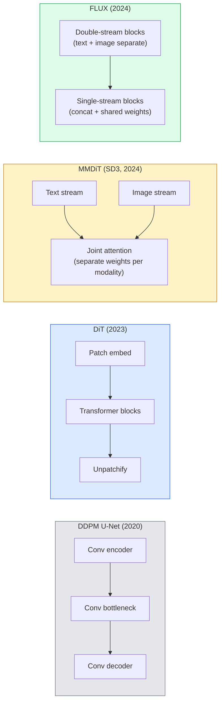

# 散变压器和调整流量

> 转换一个变压器,换一个直线流量,突然间你就有了SD3,FLUX,以及每一个2026年的文字到图像模型.

**Type:** Learn + Build
**Languages:** Python
**Prerequisites:** Phase 4 Lesson 10 (Diffusion DDPM), Phase 4 Lesson 14 (ViT), Phase 7 Lesson 02 (Self-Attention)
**Time:** ~75 minutes

## 学习目标

- 追踪从U-Net DDPM (课程10) 发展到散变压器 (DiT),MMDiT (SD3),单+双流DiT (FLUX)
- 解释调整流量:为什么噪音和数据之间的直线轨迹允许模型在20个步骤中采样而不是1000个步骤
- 实现一个小的DIT块和一个正流训练循环,两者都在100条以下
- 根据架构,参数数数和许可证来区分模型变量 (SD3,FLUX.1-dev,FLUX.1-schnell,Z-Image,Qwen-Image)

## 问题

第10课构建了DDPM与U-Net指标.该配方主导于2020-2023年:U-Net +beta时间表 +噪音预测损失.它产生了稳定扩散1.5和2.1和DALL-E 2.

每个2026年最先进的文本到图像模型都已经过去了它.稳定射3,FLUX,SD4,Z-图像,Qwen-图像,Hunyuan-图像 都没有使用U-网.它们使用射变换器 (DiT).SD3和FLUX也替换了DDPM噪声时间表,以进行修复流程,这使得从噪声到数据的路径更为直线,并允许在一致性或蒸变异的情况下推断1-4步.

转变是重要的,因为它是基于扩散的图像生成成为可控制,快速准确的原因 (SD3/SD4解决文本染),以及生产快速的原因.理解DIT+修改流程是理解2026年生成图像堆.

## 概念

### 从U-Net到变压器



- **DiT**在隐藏的补丁上用一种类似VIT的变压器取代U-Net.通过适应性层标准 (AdaLN) 调 conditioning.
- **MMDiT**两个流,对共享关注的文本和图像代币有不同的权重.
- **FLUX**(黑森林实验室, 2024) 最初的N块像SD3一样双流,后来的块连接并共享重量 (单流) 以提高高深度的效率.
- **Z-Image**在6B参数上有效的单流DT,挑战"无论如何的规模".

### 一段时间内调整的流量

未来的过程是杂的SDE,`x_t`学习的反向是第二个SDE,通过1000个小步骤解决.

调整流量定义了**straight-line**清洁数据与清洁噪音之间的插射:

```
x_t = (1 - t) * x_0 + t * epsilon,     t in [0, 1]
```

训练一个网络来预测速度`v_theta(x_t, t) = epsilon - x_0`从清洁数据到噪音的直线路沿向方向 (`dx_t/dt`) 在采样过程中,你将这种速度整合到后面,从噪音向数据迈进.

SD3叫这么说**Rectified Flow Matching**,Z-图像和大多数2026模型都使用相同的目标.典型的推断:旧的DDPM模式中20-30个欧勒步骤 (确定性) 与50多个DDIM步骤.蒸/轮/快速/LCM变体将其降至1-4个步骤.

### 适应性调节

通过 时间步骤和课程/文本的DIT条件**adaptive layer norm**预测`scale`其他`shift`它们比U-Nets中的FiLM式调节更清洁,而且是每个现代的DIT中默认的.

```
cond -> MLP -> (scale, shift, gate)
norm(x) * (1 + scale) + shift, then residual add * gate
```

### 在SD3和FLUX中编码文字

- **SD3**使用三个文本编码器:两个CLIP模型+T5-XXL.嵌入式连接并作为文本调节输入到图像流中.
- **FLUX**使用一个Clip-L + T5-XXL.
- **Qwen-Image / Z-Image**变体使用自己的内部文本编码器,与其基本的LLM一致.

文字编码器是 SD3/FLUX为什么比 SD1.5更好地解释提示的重要原因.

### 无分类指导仍然有效

修改流量改变了样本,而不是条件化.无分类指导 (训练期间的10%概率,在推断时混合有条件和无条件的预测) 与修改流量相同.大多数2026型号使用了比SD1.5的7.5低的指导尺度3.5-5,因为修改流量模型默认更紧密地遵循提示.

### 连贯性,土波,施内尔,LCM

为了一个想法,我们要将慢慢的多步模型成快速的几步模型.

- **LCM (Latent Consistency Model)**培训一个预测最终的学生`x_0`任何中间体`x_t`在一个步骤.
- **SDXL Turbo / FLUX schnell** 1-4 阶段模型,采用反向扩散蒸.
- **SD Turbo**适应隐藏传播的OpenAI式一致性模型.

任何新型船的生产服务都具有"完整质量"检查点和"轮机/快速"变体.Schnell ("快速"在德语,黑森林实验室的会议) 在1-4步骤中运行,并适用于实时管道.

### 2026年样式景观

| Model | Size | Architecture | License |
|-------|------|--------------|---------|
| Stable Diffusion 3 Medium | 2B | MMDiT | SAI Community |
| Stable Diffusion 3.5 Large | 8B | MMDiT | SAI Community |
| FLUX.1-dev | 12B | Double + Single Stream DiT | non-commercial |
| FLUX.1-schnell | 12B | same, distilled | Apache 2.0 |
| FLUX.2 | — | iterated FLUX.1 | mixed |
| Z-Image | 6B | S3-DiT (Scalable Single-Stream) | permissive |
| Qwen-Image | ~20B | DiT + Qwen text tower | Apache 2.0 |
| Hunyuan-Image-3.0 | ~80B | DiT | research |
| SD4 Turbo | 3B | DiT + distillation | SAI Commercial |

果版是2026年开源默认版本.Z-Image是效率领先者.FLUX.2和SD4是当前的质量提示.

### 为什么这个阶段转变是重要的

化系统+U-Net工作了.**better, faster, and scales more cleanly**转型与从RNN到NLP中的转换器相似:两种架构都解决了相同的问题,但转换器扩大了规模,现在占据主导地位. 2026年每篇关于图像,视频或3D生成的论文都使用了DT形状的指标,通常是修改的流量目标.U-Net DDPM现在主要是教学性 (课 10).

```figure
cv3-rectified-flow
```

## 建立它

### 步骤1:使用AdaLN进行DiT阻塞

```python
import torch
import torch.nn as nn


class AdaLNZero(nn.Module):
    """
    Adaptive LayerNorm with a gate. Predicts (scale, shift, gate) from the conditioning.
    Init such that the whole block starts as identity ("zero init").
    """

    def __init__(self, dim, cond_dim):
        super().__init__()
        self.norm = nn.LayerNorm(dim, elementwise_affine=False)
        self.mlp = nn.Linear(cond_dim, dim * 3)
        nn.init.zeros_(self.mlp.weight)
        nn.init.zeros_(self.mlp.bias)

    def forward(self, x, cond):
        scale, shift, gate = self.mlp(cond).chunk(3, dim=-1)
        h = self.norm(x) * (1 + scale.unsqueeze(1)) + shift.unsqueeze(1)
        return h, gate.unsqueeze(1)


class DiTBlock(nn.Module):
    def __init__(self, dim=192, heads=3, mlp_ratio=4, cond_dim=192):
        super().__init__()
        self.adaln1 = AdaLNZero(dim, cond_dim)
        self.attn = nn.MultiheadAttention(dim, heads, batch_first=True)
        self.adaln2 = AdaLNZero(dim, cond_dim)
        self.mlp = nn.Sequential(
            nn.Linear(dim, dim * mlp_ratio),
            nn.GELU(),
            nn.Linear(dim * mlp_ratio, dim),
        )

    def forward(self, x, cond):
        h, gate1 = self.adaln1(x, cond)
        a, _ = self.attn(h, h, h, need_weights=False)
        x = x + gate1 * a
        h, gate2 = self.adaln2(x, cond)
        x = x + gate2 * self.mlp(h)
        return x
```

`AdaLNZero`训练将区块远离身份,这将显著稳定深度变压器扩散模型.

### 步骤2:一个小的DIT

```python
def timestep_embedding(t, dim):
    import math
    half = dim // 2
    freqs = torch.exp(-math.log(10000) * torch.arange(half, device=t.device) / half)
    args = t[:, None].float() * freqs[None]
    return torch.cat([args.sin(), args.cos()], dim=-1)


class TinyDiT(nn.Module):
    def __init__(self, image_size=16, patch_size=2, in_channels=3, dim=96, depth=4, heads=3):
        super().__init__()
        self.patch_size = patch_size
        self.num_patches = (image_size // patch_size) ** 2
        self.patch = nn.Conv2d(in_channels, dim, kernel_size=patch_size, stride=patch_size)
        self.pos = nn.Parameter(torch.zeros(1, self.num_patches, dim))
        self.time_mlp = nn.Sequential(
            nn.Linear(dim, dim * 2),
            nn.SiLU(),
            nn.Linear(dim * 2, dim),
        )
        self.blocks = nn.ModuleList([DiTBlock(dim, heads, cond_dim=dim) for _ in range(depth)])
        self.norm_out = nn.LayerNorm(dim, elementwise_affine=False)
        self.head = nn.Linear(dim, patch_size * patch_size * in_channels)

    def forward(self, x, t):
        n = x.size(0)
        x = self.patch(x)
        x = x.flatten(2).transpose(1, 2) + self.pos
        t_emb = self.time_mlp(timestep_embedding(t, self.pos.size(-1)))
        for blk in self.blocks:
            x = blk(x, t_emb)
        x = self.norm_out(x)
        x = self.head(x)
        return self._unpatchify(x, n)

    def _unpatchify(self, x, n):
        p = self.patch_size
        h = w = int(self.num_patches ** 0.5)
        x = x.view(n, h, w, p, p, -1).permute(0, 5, 1, 3, 2, 4).reshape(n, -1, h * p, w * p)
        return x
```

### 步骤3:修改流程训练

```python
import torch.nn.functional as F

def rectified_flow_train_step(model, x0, optimizer, device):
    model.train()
    x0 = x0.to(device)
    n = x0.size(0)
    t = torch.rand(n, device=device)
    epsilon = torch.randn_like(x0)
    x_t = (1 - t[:, None, None, None]) * x0 + t[:, None, None, None] * epsilon

    target_velocity = epsilon - x0
    pred_velocity = model(x_t, t)

    loss = F.mse_loss(pred_velocity, target_velocity)
    optimizer.zero_grad()
    loss.backward()
    optimizer.step()
    return loss.item()
```

与DDPM的噪音预测损失 (课10) 相比:相同的结构,不同的目标.`epsilon`我们预测**velocity** `epsilon - x_0`通过直线插射,从数据到噪音.

### 步骤4: 艾勒样本

修改流程是ODE. 艾勒的方法是最简单的,并且对于训练有素的修改流程模型,几乎与高级解决器一样精确,在20+步骤.

```python
@torch.no_grad()
def rectified_flow_sample(model, shape, steps=20, device="cpu"):
    model.eval()
    x = torch.randn(shape, device=device)
    dt = 1.0 / steps
    t = torch.ones(shape[0], device=device)
    for _ in range(steps):
        v = model(x, t)
        x = x - dt * v
        t = t - dt
    return x
```

在训练有素的模型上,它可以与1000步DDPM相比较的样本产生.

### 步骤5:端到端烟雾测试

```python
import numpy as np

def synthetic_blobs(num=200, size=16, seed=0):
    rng = np.random.default_rng(seed)
    out = np.zeros((num, 3, size, size), dtype=np.float32)
    yy, xx = np.meshgrid(np.arange(size), np.arange(size), indexing="ij")
    for i in range(num):
        cx, cy = rng.uniform(4, size - 4, size=2)
        r = rng.uniform(2, 4)
        mask = (xx - cx) ** 2 + (yy - cy) ** 2 < r ** 2
        colour = rng.uniform(-1, 1, size=3)
        for c in range(3):
            out[i, c][mask] = colour[c]
    return torch.from_numpy(out)
```

列车`TinyDiT`在500步后,样本输出应该看起来像薄的色彩.

## 用它

对于使用 FLUX / SD3 / Z-Image的真实图像生成, `diffusers`每个船只都具有统一的API:

```python
from diffusers import FluxPipeline, StableDiffusion3Pipeline
import torch

pipe = FluxPipeline.from_pretrained(
    "black-forest-labs/FLUX.1-schnell",
    torch_dtype=torch.bfloat16,
).to("cuda")

out = pipe(
    prompt="a golden retriever surfing a tsunami, hyperrealistic, studio lighting",
    guidance_scale=0.0,           # schnell was trained without CFG
    num_inference_steps=4,
    max_sequence_length=256,
).images[0]
out.save("surf.png")
```

三个行.`FLUX.1-schnell`换取模型身份证`black-forest-labs/FLUX.1-dev`对于更高质量的20-30步骤,使用CFG.

对于SD3:

```python
pipe = StableDiffusion3Pipeline.from_pretrained(
    "stabilityai/stable-diffusion-3.5-large",
    torch_dtype=torch.bfloat16,
).to("cuda")
out = pipe(prompt, guidance_scale=3.5, num_inference_steps=28).images[0]
```

## 运送它

这一课产生了:

- `outputs/prompt-dit-model-picker.md`选择SD3,FLUX.1-dev,FLUX.1-schnell,Z-Image,SD4 Turbo 鉴于质量,延迟和许可限制.
- `outputs/skill-rectified-flow-trainer.md`通过AdaLN DiT和Euler样本采集编写了完整的调整流程训练循环.

## 运动

1. **(Easy)**按上述合成块数据集进行500步的训练. 进行 10, 20 和 50 个欧勒步骤的样本比较.
2. **(Medium)**通过将学习类嵌入式连接到嵌入式时间 (10 个"类"按颜色的斑点) 添加文本调节.
3. **(Hard)**计算从 rectified-flow和 DDPM版本生成的样本之间的Fréchet距离 (FID代理) 基于相同数据训练的相同规模网络. 报告更快的收缩.

## 关键词

| Term | What people say | What it actually means |
|------|----------------|----------------------|
| DiT | "Diffusion transformer" | Transformer that replaces the U-Net as the diffusion denoiser; operates on patchified latents |
| AdaLN | "Adaptive layer norm" | Timestep/text conditioning via learned scale, shift, gate applied after LayerNorm; standard in every modern DiT |
| MMDiT | "Multi-modal DiT (SD3)" | Separate weight streams for text and image tokens that share a joint self-attention |
| Single-stream / double-stream | "FLUX trick" | First N blocks double-stream (separate weights per modality), later blocks single-stream (concat + shared weights) for efficiency |
| Rectified flow | "Straight-line noise-to-data" | Linear interpolation between data and noise; network predicts velocity; fewer ODE steps needed at inference |
| Velocity target | "epsilon - x_0" | The regression target in rectified flow; points from clean data to noise |
| CFG guidance | "classifier-free guidance" | Mix conditional and unconditional predictions; still used in rectified-flow models |
| Schnell / turbo / LCM | "1-4 step distillation" | Small-step variants distilled from full-quality models; production real-time |

## 进一步阅读

- [Scalable Diffusion Models with Transformers (Peebles & Xie, 2023)](https://arxiv.org/abs/2212.09748)        
- [Scaling Rectified Flow Transformers (Esser et al., SD3 paper)](https://arxiv.org/abs/2403.03206) MMDiT和直流量
- [FLUX.1 model card and technical report (Black Forest Labs)](https://huggingface.co/black-forest-labs/FLUX.1-dev)双式+单流细节
- [Z-Image: Efficient Image Generation Foundation Model (2025)](https://arxiv.org/html/2511.22699v1)单流在6B
- [Elucidating the Design Space of Diffusion (Karras et al., 2022)](https://arxiv.org/abs/2206.00364)每一个扩散设计交易的参考
- [Latent Consistency Models (Luo et al., 2023)](https://arxiv.org/abs/2310.04378)如何LCM- LoRA给你提供4步推断
