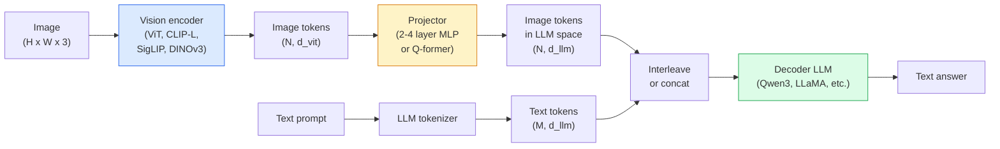

# 视觉语言模型  ViT-MLP-LLM模式

> 视觉编码器将图像转换为代币.一个MLP投影机将这些代币映射到LLM的嵌入空间中.一个语言模型完成其余.该模式是2026年每个生产VLM.

**Type:** Learn + Use
**Languages:** Python
**Prerequisites:** Phase 4 Lesson 14 (ViT), Phase 4 Lesson 18 (CLIP), Phase 7 Lesson 02 (Self-Attention)
**Time:** ~75 minutes

## 学习目标

- 描述ViT-MLP-LLM架构,并解释三个组件中的每个组件有何贡献
- 比较Qwen3-VL,InternVL3.5,LLaVA-Next和GLM-4.6V的参数数,文本长度和基准性能
- 解释DeepStack:为什么多层 ViT 功能比单个最后层功能更加强视觉语言的配合
- 测量生产中的VLM幻觉,使用跨模式错误率 (CMER) 并且对信号进行操作

## 问题

CLIP (阶段4课 18) 给你一个共享嵌入空间图像和文本,这足以进行零镜头分类和检索.它不能回答"这个图像中有多少红色车?"因为 CLIP 没有生成文本它只得分相似性.

视觉语言模型 (VLM)  Qwen3-VL,InternVL3.5,LLaVA-Next,GLM-4.6V 将CLIP家族图像编码器转换为一个完整的语言模型.该模型看到图像加上一个问题并生成答案. 2026年,开源VLM在多模式基准 (MMMU,MMBench,DocVQA,ChartQA,MathVista,OSWorld) 上竞争或击败GPT-5和Gemini-2.5-Pro.

模型中的不同是 ViT,哪个投影机,哪个投影机,哪个 LLM,培训数据和配列配方.一旦你理解了模式,交换任何组件都是机械的.

## 概念

### 维特-MLP-LLM架构



1. **Vision encoder**预训练的ViT (CLIP-L/14,SigLIP,DINOv3或精细调节的变体).
2. **Projector**一个小模块 (2-4层MLP,或Q-former) 将视觉代币映射到LLM的嵌入维度. 这就是大多数细节调整发生的地方.
3. **LLM**仅使用解码器语言模型 (Qwen3,Llama,Mistral,GLM,InternLM). 读取视觉+文本代币顺序,生成文本.

实际上,视觉编码器和LLM基本上保持冷,而投影器则便宜地训练几十亿参数的信号.

### 子

尼拉投影只使用最后一个ViT层.DeepStack (Qwen3-VL) 样本从多个ViT深度特征并堆叠它们.深层带有高层次的语义;浅层带有细粒度的空间和纹理信息.将两者都输入LLM缩小了"图像包含什么" (语义) 和"究竟在哪里" (空间接地).

### 三个培训阶段

现代VLM在阶段进行训练:

1. **Alignment**结结ViT和LLM. 训练只在图像标题对. 教导投影机将视觉空间映射到语言空间.
2. **Pre-training**解一切. 训练大规模的交织图像文本数据 (500万+对). 建立模型的视觉知识.
3. **Instruction tuning**精细调节 (图像,问题,答案) 组合三重. 教授对话行为和任务格式. 这就是使"视觉意识的LM"成为可用的助理.

大多数LoRA细调的目标是3阶段,

### 模型家庭比较 (2026年初)

| Model | Params | Vision encoder | LLM | Context | Strengths |
|-------|--------|----------------|-----|---------|-----------|
| Qwen3-VL-235B-A22B (MoE) | 235B (22B active) | custom ViT + DeepStack | Qwen3 | 256K | General SOTA, GUI agent |
| Qwen3-VL-30B-A3B (MoE) | 30B (3B active) | custom ViT + DeepStack | Qwen3 | 256K | Smaller MoE alternative |
| Qwen3-VL-8B (dense) | 8B | custom ViT | Qwen3 | 128K | Production dense default |
| InternVL3.5-38B | 38B | InternViT-6B | Qwen3 + GPT-OSS | 128K | Strong MMBench / MMVet |
| InternVL3.5-241B-A28B | 241B (28B active) | InternViT-6B | Qwen3 | 128K | Competitive with GPT-4o |
| LLaVA-Next 72B | 72B | SigLIP | Llama-3 | 32K | Open, easy to fine-tune |
| GLM-4.6V | ~70B | custom | GLM | 64K | Open-source, strong OCR |
| MiniCPM-V-2.6 | 8B | SigLIP | MiniCPM | 32K | Edge-friendly |

### 视觉剂

wen3-VL-235B在OSWorld上达到全球最高绩效**visual agents**操作GUI (桌面,移动,网页).该模型会看到一个截图,理解UI,并发出操作 (点击,键字,滚动).与工具相结合,它关闭了常见桌面任务的循环.这是大多数2026年"AI PC"演示程序在罩杯下运行的.

### 代理能力+ROPE变体

维LM需要知道**when**文3-VL从T-RoPE (时间旋转位置嵌入) 发展到**text-based time alignment** 视频框架中插入的明确时刻标签文本代币.模型看到"`<timestamp 00:32>`能思考时间关系.

### 调整问题

搜索数据集中的12%的图像-文本对包含未完全基于图像的描述.一个训练有素的VLM默默地学习幻觉,构造物体,误读数字,发明关系.在生产中,这是主导的失败模式.

太空工作.ai 引入了**Cross-Modal Error Rate (CMER)**追踪:

```
CMER = fraction of outputs where the text confidence is high but the image-text similarity (via a CLIP-family checker) is low
```

高CMER意味着模型自信地说出没有基于图像的东西.监测CMER并将其视为生产KPI在部署中降低了幻觉率约35%. 技巧不是"修复模型",而是"将高CMER输出引导到人类审查".

### 精细调节与LoRA/QLoRA

对于70BVLM的完整调整,大多数团队无法实现.在注意力+投影器层上,LoRA (排名16-64) 或4位基重量QLoRA,适合单个A100/H100.成本:5,000-50,000个例子,$100-$计算的5000个,训练2-10小时.

### 空间推理仍然很弱

目前的VLM在空间推理基准上获得50-60%.如果您的使用情况取决于"哪个对象在哪个对象上",请认证大大一般VLM性能低于人类.纯空间任务的更好的替代方案是:专业的关键点/姿势估计器,深度模型或后处理的盒子几何学的检测模型.

```figure
v4-vlm-projector
```

## 建立它

### 步骤1:投影机

你最常训练的部分.

```python
import torch
import torch.nn as nn


class Projector(nn.Module):
    def __init__(self, vit_dim=768, llm_dim=4096, hidden=4096):
        super().__init__()
        self.net = nn.Sequential(
            nn.Linear(vit_dim, hidden),
            nn.GELU(),
            nn.Linear(hidden, llm_dim),
        )

    def forward(self, x):
        return self.net(x)
```

输入是一个`(N_patches, d_vit)`输出是`(N_patches, d_llm)`法律法师将每一行输出都视为另一个标志.

### 步骤2:将ViT-MLP-LLM端到端组装

实际代码使用的是`transformers`它们的概念结构.

```python
class MinimalVLM(nn.Module):
    def __init__(self, vit, projector, llm, image_token_id):
        super().__init__()
        self.vit = vit
        self.projector = projector
        self.llm = llm
        self.image_token_id = image_token_id  # placeholder token in text prompt

    def forward(self, image, input_ids, attention_mask):
        # 1. vision features
        vision_tokens = self.vit(image)                     # (B, N_patches, d_vit)
        vision_embeds = self.projector(vision_tokens)       # (B, N_patches, d_llm)

        # 2. text embeddings
        text_embeds = self.llm.get_input_embeddings()(input_ids)  # (B, M, d_llm)

        # 3. replace image placeholder tokens with vision embeds
        merged = self._merge(text_embeds, vision_embeds, input_ids)

        # 4. run LLM
        return self.llm(inputs_embeds=merged, attention_mask=attention_mask)

    def _merge(self, text_embeds, vision_embeds, input_ids):
        out = text_embeds.clone()
        expected = vision_embeds.size(1)
        for b in range(input_ids.size(0)):
            positions = (input_ids[b] == self.image_token_id).nonzero(as_tuple=True)[0]
            if len(positions) != expected:
                raise ValueError(
                    f"batch item {b} has {len(positions)} image tokens but vision_embeds has {expected} patches."
                    " Every sample in the batch must be pre-padded to the same number of image placeholder tokens.")
            out[b, positions] = vision_embeds[b]
        return out
```

其他`<image>`文字中的位置符号被真正的图像嵌入所取代.

### 步骤3: CMER计算

轻量级的运行时间检查.

```python
import torch.nn.functional as F


def cross_modal_error_rate(image_emb, text_emb, text_confidence, sim_threshold=0.25, conf_threshold=0.8):
    """
    image_emb, text_emb: embeddings of image and generated text (normalised internally)
    text_confidence:     mean per-token probability in [0, 1]
    Returns:             fraction of high-confidence outputs with low image-text alignment
    """
    image_emb = F.normalize(image_emb, dim=-1)
    text_emb = F.normalize(text_emb, dim=-1)
    sim = (image_emb * text_emb).sum(dim=-1)        # cosine similarity
    high_conf_low_sim = (text_confidence > conf_threshold) & (sim < sim_threshold)
    return high_conf_low_sim.float().mean().item()
```

视CMER为生产KPI. 监控它每端点,每提示类型,每客户. 升级CMER表明模型开始对一些输入分布产生幻觉.

### 步骤 4:玩具VLM分类器 (可运行)

假的"ViT特征"进入,一个小的LLM风格的代币预测一个课程.

```python
class ToyVLM(nn.Module):
    def __init__(self, vit_dim=32, llm_dim=64, num_classes=5):
        super().__init__()
        self.projector = Projector(vit_dim, llm_dim, hidden=64)
        self.head = nn.Linear(llm_dim, num_classes)

    def forward(self, vision_tokens):
        projected = self.projector(vision_tokens)
        pooled = projected.mean(dim=1)
        return self.head(pooled)
```

足以显示投影机模式的运作.

## 用它

2026年生产团队将使用VLM的三个方法:

- **Hosted API**OpenAI视觉,人类克劳德视觉,谷歌双胞胎视觉.零下线,供应商风险.
- **Open-source self-host** Qwen3-VL或InternVL3.5 通过`transformers`其他`vllm`完全控制,提前的努力.
- **Fine-tune on domain**加载Qwen2.5-VL-7B或LLaVA-1.6-7B,LoRA在5k-50k定制示例上,使用`vllm`或`TGI`现在,我们要去.

```python
from transformers import AutoProcessor, AutoModelForVision2Seq
import torch
from PIL import Image

model_id = "Qwen/Qwen3-VL-8B-Instruct"
processor = AutoProcessor.from_pretrained(model_id)
model = AutoModelForVision2Seq.from_pretrained(model_id, torch_dtype=torch.bfloat16, device_map="auto")

messages = [{
    "role": "user",
    "content": [
        {"type": "image", "image": Image.open("plot.png")},
        {"type": "text", "text": "What does this chart show?"},
    ],
}]
inputs = processor.apply_chat_template(messages, add_generation_prompt=True, tokenize=True, return_dict=True, return_tensors="pt").to("cuda")
generated = model.generate(**inputs, max_new_tokens=256)
answer = processor.decode(generated[0][inputs["input_ids"].shape[1]:], skip_special_tokens=True)
```

`apply_chat_template`隐藏了`<image>`位置持有符号化;模型内部处理合并.

## 运送它

这一课产生了:

- `outputs/prompt-vlm-selector.md`选择Qwen3-VL / InternVL3.5 / LLaVA-Next / API 鉴于精度,延迟,文本长度和预算.
- `outputs/skill-cmer-monitor.md`发出代码,以仪器生产VLM终端点,具有跨模式错误率,每个终端点仪表板和警报门.

## 运动

1. **(Easy)**在五张图像中通过任何开放的VLM执行三个提示 ("这是什么?","数对象","描述场景").每一个回答都按手进行正确/部分正确/幻觉.计算一个像CMR一样的率.
2. **(Medium)**精细调 Qwen2.5-VL-3B或 LLaVA-1.6-7B,使用 LoRA (排名 16) 在标题的目标域的500个图像上.
3. **(Hard)**取代VLM的图像编码器用DINOv3而不是其默认的SigLIP/CLIP.只重训投影器 (结LLM +结DINOv3).测量密集预测任务 (计算,空间推理) 是否改善.

## 关键词

| Term | What people say | What it actually means |
|------|----------------|----------------------|
| ViT-MLP-LLM | "The VLM pattern" | Vision encoder + projector + language model; every 2026 VLM |
| Projector | "The bridge" | 2-4 layer MLP (or Q-former) that maps vision tokens into LLM embedding space |
| DeepStack | "Qwen3-VL feature trick" | Multi-level ViT features stacked rather than last-layer only |
| Image token | "<image> placeholder" | Special token in the text stream replaced by projected vision embeddings |
| CMER | "Hallucination KPI" | Cross-Modal Error Rate; high when text confidence is high but image-text similarity is low |
| Visual agent | "VLM that clicks" | VLM operating GUIs (OSWorld, mobile, web) with tool calls |
| Q-former | "Fixed-count token bridge" | BLIP-2 style projector producing a fixed number of visual query tokens |
| Alignment / pre-training / instruction tuning | "Three stages" | Standard VLM training pipeline |

## 进一步阅读

- [Qwen3-VL Technical Report (arXiv 2511.21631)](https://arxiv.org/abs/2511.21631)
- [InternVL3.5 Advancing Open-Source Multimodal Models (arXiv 2508.18265)](https://arxiv.org/html/2508.18265v1)
- [LLaVA-Next series](https://llava-vl.github.io/blog/2024-05-10-llava-next-stronger-llms/)
- [BentoML: Best Open-Source VLMs 2026](https://www.bentoml.com/blog/multimodal-ai-a-guide-to-open-source-vision-language-models)
- [MMMU: Multi-discipline Multimodal Understanding benchmark](https://mmmu-benchmark.github.io/)
- [VLMs in manufacturing (Robotics Tomorrow, March 2026)](https://www.roboticstomorrow.com/story/2026/03/when-machines-learn-to-see-like-experts-the-rise-of-vision-language-models-in-manufacturing/26335/)
