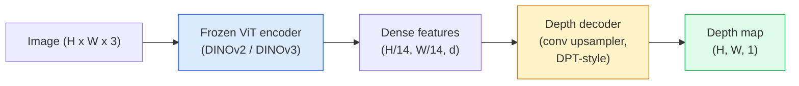

# 单光深度和几何估计

> 深度地图是一个单通道图像,每个像素是距离摄像头的距离.从一个RGB框架预测以前是不可能的没有立体音频或LiDAR.在2026年,一个冷的ViT编码器加上轻量级的头将在几百分比的地面真相范围内.

**Type:** Build + Use
**Languages:** Python
**Prerequisites:** Phase 4 Lesson 14 (ViT), Phase 4 Lesson 17 (Self-Supervised Vision), Phase 4 Lesson 07 (U-Net)
**Time:** ~60 minutes

## 学习目标

- 区分每个生产模型 (MiDaS,Marigold,Deepth Anything V3,ZoeDepth) 所解决的相对和指标深度和状态
- 使用深度任何东西 V3 (DINOv2脊柱) 预测任意单个图像的深度,没有校准
- 解释为什么单光深度从单个图像 (视角线索,纹理梯度,学到的先例) 完全运行,以及它不能恢复的 (绝对尺度,被遮蔽的几何学)
- 通过深度地图和孔摄像头内在的方法将2D检测到3D点

## 问题

深度是2D计算机视觉中缺失的轴.鉴于RGB,你知道图像平面中物体在哪里出现;你不知道它们在多远.深度传感器 (立体机器,LiDAR,飞行时间) 直接解决这一问题,但成本昂贵,脆弱,范围有限.

单光深度估计 从单个RGB框架预测深度 用于产生模糊,不可靠的输出. 到2026年,大型预训练的编码器改变了这一点:深度任何V3使用结的DINOv2脊柱,并产生了在室内,室外,医疗和卫星领域的深度地图. 马里戈德将深度重新构成成一个条件性扩散问题. 底反转了真正的测量距离.

深度也是2D检测和3D理解之间的桥梁:乘以深度乘以检测盒的像素,然后你将2D对象抬起到3D点云中.这是每个AR遮蔽系统的核心,每个障碍回避管道,

## 概念

### 相对对对度深度

- **Relative depth**订单`z`"A像素比B像素更接近,但距离的比率不依据米.
- **Metric depth**距离相机的绝对距离在米. 需要模型了解图像线索与实际距离之间的统计关系.

密达斯和深度任何V3产生相对深度.玛丽戈德产生相对深度. ZoeDepth,UniDepth和Metric3D产生测量深度.测量模型对相机内在感觉;相对模型不是.

### 编码-解码模式



密度任何东西V3将编码器结,仅训练DPT式解码器.编码器提供丰富的功能;解码器将它们插入到图像分辨率,并降低深度.

### 为什么一个图像能产生深度

两维图像包含许多与深度相关的单光线线:

- **Perspective** 3D中的平行线在2D中相近.
- **Texture gradient**远处的表面具有较小,更密集的纹理.
- **Occlusion order**更近的物体遮住更远的物体.
- **Size constancy**已知物体 (汽车,人类) 提供了近似的规模.
- **Atmospheric perspective**在室外场景中,远处的物体看起来更加淡,更蓝色.

通过使用数十亿图像来训练的ViT将这些线索内部化. 凭借足够的数据和强大的脊柱,单光层深度达到合理的精度,

### 单眼深度不能做什么

- **Absolute metric scale**网络可以预测"杯子远远于子的两倍",而不知道杯子距离1米还是10米.
- **Occluded geometry**椅子背部是不可见的,不能可靠地推断.
- **Truly untextured / reflective surfaces**镜子,玻璃,均的墙壁.

### 2026年任何东西都会深入 V3

- 尼拉 DINOv2 ViT-L/14作为编码器 (结).
- 除器.
- 训练在各种来源的插图对 (除了光学一致性之外,不需要明确的深度监督).
- 预测从 **an arbitrary number of visual inputs, with or without known camera poses**现在,我们要去.
- 单光深度,任何视图几何,视觉染,摄像头姿势估计.

这就是2026年需要深度时的投降模型.

### 

马里戈德 (Ke et al., CVPR 2024) 将深度估计作为条件图像扩散. 条件:RGB. 目标:深度地图. 使用预训练的稳定扩散2U-网作为脊柱. 输出深度地图在对象边界非常敏. 交易:比输送前进模型 (指向步骤10-50) 慢推断.

### 内部和孔摄像头

提升一个像素`(u, v)`的深度`d`转到一个3D点`(X, Y, Z)`在摄像头坐标中:

```
fx, fy, cx, cy = camera intrinsics
X = (u - cx) * d / fx
Y = (v - cy) * d / fy
Z = d
```

内部数据来自EXIF元数据,校准模式或单元内核估计器 (Perspective Fields, UniDepth).没有内核数据,您仍然可以通过假设60-70° FOV和中度分辨率原则来呈现一个点云,可用于可视化而不是测量.

### 评估

标准的两个指标:

- **AbsRel**(绝对相对错误): `mean(|d_pred - d_gt| / d_gt)`低于较好的.0.05-0.1用于生产模型.
- **delta < 1.25**(门准确性): 像素的小部分`max(d_pred/d_gt, d_gt/d_pred) < 1.25`较高就更好.

对于相对深度 (Deepth Anything V3, MiDaS),评估使用了两个指标的尺度和转移不变版本.

```figure
depth-sweep
```

## 建立它

### 步骤1:深度指标

```python
import torch

def abs_rel_error(pred, target, mask=None):
    if mask is not None:
        pred = pred[mask]
        target = target[mask]
    return (torch.abs(pred - target) / target.clamp(min=1e-6)).mean().item()


def delta_accuracy(pred, target, threshold=1.25, mask=None):
    if mask is not None:
        pred = pred[mask]
        target = target[mask]
    ratio = torch.maximum(pred / target.clamp(min=1e-6), target / pred.clamp(min=1e-6))
    return (ratio < threshold).float().mean().item()
```

在评估前,始终掩盖无效深度像素 (零,NaN,和)

### 步骤2: 规模和转变的配合

对于相对深度模型,在计算指标之前,将预测与基础真相相一致.`a * pred + b = target`其他:

```python
def align_scale_shift(pred, target, mask=None):
    if mask is not None:
        p = pred[mask]
        t = target[mask]
    else:
        p = pred.flatten()
        t = target.flatten()
    A = torch.stack([p, torch.ones_like(p)], dim=1)
    coeffs, *_ = torch.linalg.lstsq(A, t.unsqueeze(-1))
    a, b = coeffs[:2, 0]
    return a * pred + b
```

跑步`align_scale_shift`在之前`abs_rel_error`在评估MiDaS/深度任何东西时.

### 步骤3:将深度提高到点云

```python
import numpy as np

def depth_to_point_cloud(depth, intrinsics):
    H, W = depth.shape
    fx, fy, cx, cy = intrinsics
    v, u = np.meshgrid(np.arange(H), np.arange(W), indexing="ij")
    z = depth
    x = (u - cx) * z / fx
    y = (v - cy) * z / fy
    return np.stack([x, y, z], axis=-1)


depth = np.random.uniform(0.5, 4.0, (240, 320))
intr = (320.0, 320.0, 160.0, 120.0)
pc = depth_to_point_cloud(depth, intr)
print(f"point cloud shape: {pc.shape}  (H, W, 3)")
```

运输点云到`.ply`在 MeshLab或 CloudCompare 中打开.

### 步骤4:使用合成深度场景进行烟雾测试

```python
def synthetic_depth(size=96):
    yy, xx = np.meshgrid(np.arange(size), np.arange(size), indexing="ij")
    # Floor: linear gradient from near (top) to far (bottom)
    depth = 1.0 + (yy / size) * 4.0
    # Box in the middle: closer
    mask = (np.abs(xx - size / 2) < size / 6) & (np.abs(yy - size * 0.6) < size / 6)
    depth[mask] = 2.0
    return depth.astype(np.float32)


gt = torch.from_numpy(synthetic_depth(96))
pred = gt + 0.3 * torch.randn_like(gt)  # simulated prediction
aligned = align_scale_shift(pred, gt)
print(f"before align  absRel = {abs_rel_error(pred, gt):.3f}")
print(f"after align   absRel = {abs_rel_error(aligned, gt):.3f}")
```

### 步骤5:任何深度 V3 使用 (参考)

```python
import torch
from transformers import pipeline
from PIL import Image

pipe = pipeline(task="depth-estimation", model="LiheYoung/depth-anything-v2-large")

image = Image.open("street.jpg").convert("RGB")
out = pipe(image)
depth_np = np.array(out["depth"])
```

三个行.`out["depth"]`对于深度任何V3具体来说,在发布后,切换模型ID;API没有改变.

## 用它

- **Depth Anything V3**(Meta AI / ByteDance, 2024-2026) 相对深度的默认.生产中最快的VIT大脊椎模型.
- **Marigold**视觉质量最高,推断速度慢.
- **UniDepth**尺度深度与相机内在估计.
- **ZoeDepth**度量深度;年龄较老,仍然可靠.
- **MiDaS v3.1**遗产但稳定;对比较的基准良好.

典型的集成模式:

1. 现在,RGB框架到达了.
2. 深度模型产生深度地图.
3. 探测器生产盒子.
4. 通过深度升降盒中型体到3D;可用时与点云相结合.
5. 下游:AR遮蔽,路径规划,对象尺寸估计,立体音频替换.

对于实时使用,深度任何V2小 (INT8量化) 在消费者GPU上以518x518的速度达到30fps.

## 运送它

这一课产生了:

- `outputs/prompt-depth-model-picker.md`选择深度任何V3,玛丽戈德,UniDepth,MiDaS,因为延迟,测量对相对需求,以及场景类型.
- `outputs/skill-depth-to-pointcloud.md`从深度地图中构建点云的技能,`.ply`现在,我们要去.

## 运动

1. **(Easy)**运行任何10张桌面图像的深度V2. 保存深度为灰色 PNG,检查. 识别一个预测深度看起来错误的对象,并解释为什么单光线线线失败.
2. **(Medium)**根据RGB+深度从深度任何V2,升到一个点云和染`open3d`比较两个场景 (室内/室外) 并注意看起来更可信的场景.
3. **(Hard)**采用 UniDepth 来预测两者中的度量深度.报告预测距离的三角形与真实的三分之一.

## 关键词

| Term | What people say | What it actually means |
|------|----------------|----------------------|
| Monocular depth | "Single-image depth" | Depth estimation from one RGB frame, no stereo or LiDAR |
| Relative depth | "Ordered depth" | Ordered z-values without real-world units |
| Metric depth | "Absolute distance" | Depth in metres; requires calibration or a model trained with metric supervision |
| AbsRel | "Absolute relative error" | Mean of |d_pred - d_gt| / d_gt; standard depth metric |
| Delta accuracy | "delta < 1.25" | Fraction of pixels with prediction within 25% of ground truth |
| Pinhole camera | "fx, fy, cx, cy" | The camera model used to lift (u, v, d) to (X, Y, Z) |
| DPT | "Dense Prediction Transformer" | The conv-based decoder used on top of frozen ViT encoders for depth |
| DINOv2 backbone | "The reason it works" | Self-supervised features that generalise across domains without depth labels |

## 进一步阅读

- [Depth Anything V3 paper page](https://depth-anything.github.io/) SOTA单光深度与DINOv2编码器
- [Marigold (Ke et al., CVPR 2024)](https://marigoldmonodepth.github.io/)基于扩散的深度估计
- [UniDepth (Piccinelli et al., 2024)](https://arxiv.org/abs/2403.18913)内在的尺度深度
- [MiDaS v3.1 (Intel ISL)](https://github.com/isl-org/MiDaS)可尼克式相对深度基线
- [DINOv3 blog post (Meta)](https://ai.meta.com/blog/dinov3-self-supervised-vision-model/)提高深度精度的编码器家族
