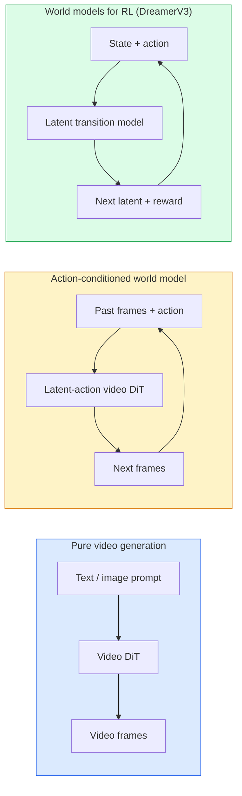

# 世界模特和视频传播

> 预测场景的下一秒钟的视频模型是世界模拟器, 条件下预测行动,你就有了学习的游戏引擎.

**Type:** Learn + Build
**Languages:** Python
**Prerequisites:** Phase 4 Lesson 10 (Diffusion), Phase 4 Lesson 12 (Video Understanding), Phase 4 Lesson 23 (DiT + Rectified Flow)
**Time:** ~75 minutes

## 学习目标

- 解释纯视频生成模型 (Sora 2) 和动作条件的世界模型 (Genie 3, DreamerV3) 的区别
- 描述视频的DIT:空间时间补丁,3D位置编码,跨 (T,H,W) 代币的联合关注
- 追踪世界模型如何连接到机器人:VLM计划 →视频模型模拟 →反向动态发射行动
- 选择Sora 2,Genie 3,跑道GWM-1世界,Wan-Video和HunyuanVideo之间的特定使用情况 (创意视频,交互式模拟,自动驾驶合成)

## 问题

视频生成和世界建模将在2026年融合. 一个能够生成一个连贯的视频分钟的模型, 从某种意义上讲, 已经学会了世界如何移动:物体永久性,重力,因果性,风格. 如果您将这些预测条件定为行动 (左步,打开门), 视频模型将成为一个可学习的模拟器,

注是具体的. 基尼3从一个图像中生成可播放环境. 跑道GWM-1世界合成无限的可探索场景. 索拉2制作了长达几分钟的视频, 对于自动驾驶车辆训练数据,NVIDIA Cosmos-Drive,Wayve Gaia-2和Tesla DrivingWorld生成了现实驾驶视频. 机器人系统正在静地接管现实化.

这一课是第四阶段的"大图片"课程. 它将图像生成,视频理解和代理推理连接到主导研究正在发展的建筑模式中.

## 概念

### 世界模型的三个家庭



- **Sora 2**没有动作接口,在部署中无法"引导".
- **Genie 3**现在**GWM-1 Worlds**现在**Mirage / Magica**互动式 你按键或移动相机,场景响应.
- **DreamerV3**通过一个奖励信号训练,在隐藏的空间中预测. 视觉较少,更有用的样本效率的RL.

### 视频 设计

```
Video latent:          (C, T, H, W)
Patchify (spatial):    grid of P_h x P_w patches per frame
Patchify (temporal):   group P_t frames into a temporal patch
Resulting tokens:      (T / P_t) * (H / P_h) * (W / P_w) tokens
```

位置编码是3D:每 (t, h, w) 坐标的旋转或学习嵌入.注意力可以是:

- **Full joint**所有代币都会关注所有代币. O  N ^ 2 具有 N 代币.禁止长视频.
- **Divided**交替时间注意 (时间间位置相同:`(H*W) * T^2`空间关注 (同一时间段,跨空间:`T * (H*W)^2`时光former和大多数视频节目.
- **Window** (t, h, w) 中的本地窗户.

每个2026年视频传播模型都使用了以下三个模式之一,加上AdaLN调节 (课3) 和修改流.

### 行动条件:隐藏行动模式

精灵学会了什么?**latent action**模型的解码器则在推断的隐藏行动而不是明确键盘键上进行条件.在推断时,用户可以指定隐藏行动 (或从新先前的样本中进行一个) 模型生成与该行动一致的下一个框架.

索拉完全跳过了操作界面.它的解码器预测了过去的空间时间代币的下一个空间时间代币.

### 物理可靠性

苏拉2的2026年发布明确宣告**physical plausibility**通过手动评级可靠性分数测量;模型明显改善了落下的物体,字符碰撞和故意失败 (错过跳跃) 情况.

合理性仍然是主导的失败模式.2024-2025年人们吃西瓜或喝杯的视频显示了模型缺乏持久的对象表示.2026年模型 (索拉2,跑道Gen-5,洪源视频) 减少但不消除这些.

### 自动驾驶世界车型

驾驶世界模型可以根据轨迹,界限框或导航地图生成现实道路场景.

- **Cosmos-Drive-Dreams**生成几分钟的驾驶视频用于RL训练.
- **Gaia-2** 轨迹条件的场景合成,用于政策评估.
- **DrivingWorld**模拟各种天气,日间时间,交通条件.
- **Vista**反应驾驶场景合成.

它们取代了昂贵的真实数据收集, 对于角落的案例, 晚上行人走路,冰的交叉路口,

### 机器人堆:VLM+视频模型+反向动态

现在,我们正在研究一个新的机器人循环.

1. **VLM**分析目标 ("挑起红杯"),计划高层次的行动序列.
2. **Video generation model**预测未来的观察 N 框架.
3. **Inverse dynamics model**引擎指令将产生这些观察.

这取代了奖励形状和样本重的RL.世界模型是想象力;反动动态关闭了动作循环.精灵设想器是一个实例;许多研究小组正在融合这个结构.

### 评估

- **Visual quality**FVD (Fréchet视频距离),用户研究.
- **Prompt alignment**每框的CLIPS分,VQA类型的评估.
- **Physical plausibility**在基准组上进行手动评级 (索拉2内部基准,VBench).
- **Controllability**行动 →观察一致性;你能回到以前的状态吗?

### 2026年样式景观

| Model | Use | Parameters | Output | License |
|-------|-----|------------|--------|---------|
| Sora 2 | text-to-video, audio | — | 1-min 1080p + audio | API only |
| Runway Gen-5 | text/image-to-video | — | 10s clips | API |
| Runway GWM-1 Worlds | interactive world | — | infinite 3D rollout | API |
| Genie 3 | interactive world from image | 11B+ | playable frames | research preview |
| Wan-Video 2.1 | open text-to-video | 14B | high-quality clips | non-commercial |
| HunyuanVideo | open text-to-video | 13B | 10s clips | permissive |
| Cosmos / Cosmos-Drive | autonomous driving sim | 7-14B | driving scenes | NVIDIA open |
| Magica / Mirage 2 | AI-native game engine | — | modifiable worlds | product |

```figure
v4-world-rollout
```

## 建立它

### 步骤1: 3D 贴合视频

```python
import torch
import torch.nn as nn


class VideoPatch3D(nn.Module):
    def __init__(self, in_channels=4, dim=64, patch_t=2, patch_h=2, patch_w=2):
        super().__init__()
        self.proj = nn.Conv3d(
            in_channels, dim,
            kernel_size=(patch_t, patch_h, patch_w),
            stride=(patch_t, patch_h, patch_w),
        )
        self.patch_t = patch_t
        self.patch_h = patch_h
        self.patch_w = patch_w

    def forward(self, x):
        # x: (N, C, T, H, W)
        x = self.proj(x)
        n, c, t, h, w = x.shape
        tokens = x.reshape(n, c, t * h * w).transpose(1, 2)
        return tokens, (t, h, w)
```

具有步骤等于内核的3D卷轴作为空间时间补丁器. `(T, H, W) -> (T/2, H/2, W/2)`电池的电池.

### 步骤2: 3D旋转位置编码

单独应用的旋转位置嵌入式 (RoPE) `t`现在`h`现在`w`轴:

```python
def rope_3d(tokens, t_dim, h_dim, w_dim, grid):
    """
    tokens: (N, T*H*W, D)
    grid: (T, H, W) sizes
    t_dim + h_dim + w_dim == D
    """
    T, H, W = grid
    n, seq, d = tokens.shape
    if t_dim + h_dim + w_dim != d:
        raise ValueError(f"t_dim+h_dim+w_dim ({t_dim}+{h_dim}+{w_dim}) must equal D={d}")
    assert seq == T * H * W
    t_idx = torch.arange(T, device=tokens.device).repeat_interleave(H * W)
    h_idx = torch.arange(H, device=tokens.device).repeat_interleave(W).repeat(T)
    w_idx = torch.arange(W, device=tokens.device).repeat(T * H)
    # Simplified: just scale channels by frequencies. Real RoPE rotates pairs.
    freqs_t = torch.exp(-torch.log(torch.tensor(10000.0)) * torch.arange(t_dim // 2, device=tokens.device) / (t_dim // 2))
    freqs_h = torch.exp(-torch.log(torch.tensor(10000.0)) * torch.arange(h_dim // 2, device=tokens.device) / (h_dim // 2))
    freqs_w = torch.exp(-torch.log(torch.tensor(10000.0)) * torch.arange(w_dim // 2, device=tokens.device) / (w_dim // 2))
    emb_t = torch.cat([torch.sin(t_idx[:, None] * freqs_t), torch.cos(t_idx[:, None] * freqs_t)], dim=-1)
    emb_h = torch.cat([torch.sin(h_idx[:, None] * freqs_h), torch.cos(h_idx[:, None] * freqs_h)], dim=-1)
    emb_w = torch.cat([torch.sin(w_idx[:, None] * freqs_w), torch.cos(w_idx[:, None] * freqs_w)], dim=-1)
    return tokens + torch.cat([emb_t, emb_h, emb_w], dim=-1)
```

简单的添加形式:真正的ROPE在频率上旋转对通道;位置信息相同.

### 步骤3: 分开注意力

```python
class DividedAttentionBlock(nn.Module):
    def __init__(self, dim=64, heads=2):
        super().__init__()
        self.time_attn = nn.MultiheadAttention(dim, heads, batch_first=True)
        self.space_attn = nn.MultiheadAttention(dim, heads, batch_first=True)
        self.ln1 = nn.LayerNorm(dim)
        self.ln2 = nn.LayerNorm(dim)
        self.ln3 = nn.LayerNorm(dim)
        self.mlp = nn.Sequential(nn.Linear(dim, 4 * dim), nn.GELU(), nn.Linear(4 * dim, dim))

    def forward(self, x, grid):
        T, H, W = grid
        n, seq, d = x.shape
        # time attention: same (h, w), across t
        xt = x.view(n, T, H * W, d).permute(0, 2, 1, 3).reshape(n * H * W, T, d)
        a, _ = self.time_attn(self.ln1(xt), self.ln1(xt), self.ln1(xt), need_weights=False)
        xt = (xt + a).reshape(n, H * W, T, d).permute(0, 2, 1, 3).reshape(n, seq, d)
        # space attention: same t, across (h, w)
        xs = xt.view(n, T, H * W, d).reshape(n * T, H * W, d)
        a, _ = self.space_attn(self.ln2(xs), self.ln2(xs), self.ln2(xs), need_weights=False)
        xs = (xs + a).reshape(n, T, H * W, d).reshape(n, seq, d)
        xs = xs + self.mlp(self.ln3(xs))
        return xs
```

时间注意力在每个空间位置之间随时;空间注意力在每个框架之间随时随时随时随时随时随时随时随时随时随时随时随时随时随时随时随时随时随时随时随时随时随时随时随时随时随时随时随时随时随时随时随时随时随时随时随时随时随时随时随时随时随时随时随时随时随时随时随时随时随时随时随时随时随时随时随时随时随时随时随时随时随时随时随时随时随时随时随时随时随时随时随时随时随时随时随时随时随时随时随时随时随时随时随时随时随时随时随时随时随时随时随时随时随时随时随时随时随时随时随时随时随时随时随时随时随时随时随时随时随时随时随时随时随时随时随时随时随时随时随时随时随时随时随时随时随时随时随时随时随时随时随时随时随时随时随时随时随时随时随时随时随时随时随时随时随时随时随时随时随时随时随时随的随时随时随时随时随时随时随时随时随时随的随时随时随时随的随时随时随时随时随的随时随时随的随时随时随时随的随时随的随时随的随时随的随时随时随的随时随时随的随的随时随的随时随的随时随时随的随的随时随的随的随时随时随的随时随时随的随时随的随的随的随时随的随的随时随之之之之之之之之之之之之之之之之之之之之之之之之之之之之之之之之之之之之之之之之之之之之之之之之之之之之之之之之

### 步骤4:编写一个小视频

```python
class TinyVideoDiT(nn.Module):
    def __init__(self, in_channels=4, dim=64, depth=2, heads=2):
        super().__init__()
        self.patch = VideoPatch3D(in_channels=in_channels, dim=dim, patch_t=2, patch_h=2, patch_w=2)
        self.blocks = nn.ModuleList([DividedAttentionBlock(dim, heads) for _ in range(depth)])
        self.out = nn.Linear(dim, in_channels * 2 * 2 * 2)

    def forward(self, x):
        tokens, grid = self.patch(x)
        for blk in self.blocks:
            tokens = blk(tokens, grid)
        return self.out(tokens), grid
```

没有一个工作的视频生成器;一个结构性演示,

### 步骤5:检查形状

```python
vid = torch.randn(1, 4, 8, 16, 16)  # (N, C, T, H, W)
model = TinyVideoDiT()
out, grid = model(vid)
print(f"input  {tuple(vid.shape)}")
print(f"tokens grid {grid}")
print(f"output {tuple(out.shape)}")
```

期待`grid = (4, 8, 8)`其他`out = (1, 256, 32)`之后,头部将其投射到每代币的空间时间补丁, 准备好重新重新被放入视频中.

## 用它

2026年生产准入模式:

- **Sora 2 API**文字到视频,同步音频.
- **Runway Gen-5 / GWM-1**视频互动世界.
- **Wan-Video 2.1 / HunyuanVideo**开源自主主机.
- **Cosmos / Cosmos-Drive**驾驶模拟开放权重.
- **Genie 3**研究预览,请求访问.

为了构建一个互动的世界模型演示:从 Wan-Video开始,以提供质量,在隐形动作适配器上进行交互性.

对于机器人, 野生的堆:

1. 语言目标 -> VLM (Qwen3-VL) -> 高级计划.
2. 计划 -> 隐形行动视频模型 -> 想象中的部署.
3. 推出 -> 反动态模型 -> 低级操作.
4. 执行的操作 -> 观察返回步骤1.

## 运送它

这一课产生了:

- `outputs/prompt-video-model-picker.md`选择Sora 2 / 跑道 / 瓦恩 / 洪源视频 / 宇宙给任务,许可证和延迟.
- `outputs/skill-physical-plausibility-checks.md`定义自动检查 (物体永久性,重力,连续性) 在发送之前运行任何生成的视频的技能.

## 运动

1. **(Easy)**计算5秒 360p视频的代币数量在补丁 t=2,补丁 h=8,补丁 w=8.
2. **(Medium)**换上方的分离注意力块,以获得一个完整的关联注意力块,并测量形状和参数数.解释为什么在真实视频模型中需要分离注意力.
3. **(Hard)**建立一个最小的隐形动作视频模型:采用 (frame_t, action_t, frame_{t+1}) 三倍的数据集 (任何简单的2D游戏),训练一个微小的视频DiT,以动作嵌入为条件,并显示不同的动作产生不同的下一个框架.

## 关键词

| Term | What people say | What it actually means |
|------|----------------|----------------------|
| World model | "Learned simulator" | A model that predicts future observations given state and action |
| Video DiT | "Spacetime transformer" | Diffusion transformer with 3D patchification and divided attention |
| Latent action | "Inferred control" | Discrete or continuous action latent inferred from frame pairs; used to condition next-frame generation |
| Divided attention | "Time then space" | Two attention operations per block — across time then across space — to keep O(N^2) manageable |
| Object permanence | "Things stay real" | Scene property that video models must learn; classic failure mode on food, glassware |
| FVD | "Fréchet Video Distance" | Video equivalent of FID; primary visual quality metric |
| Inverse dynamics model | "Observations to actions" | Given (state, next state), output the action that connects them; closes robotics loop |
| Cosmos-Drive | "NVIDIA driving sim" | Open-weights autonomous-driving world model for RL and evaluation |

## 进一步阅读

- [Sora technical report (OpenAI)](https://openai.com/index/video-generation-models-as-world-simulators/)
- [Genie: Generative Interactive Environments (Bruce et al., 2024)](https://arxiv.org/abs/2402.15391)隐藏的行动世界模型
- [TimeSformer (Bertasius et al., 2021)](https://arxiv.org/abs/2102.05095) 视频转换器的重视
- [DreamerV3 (Hafner et al., 2023)](https://arxiv.org/abs/2301.04104)全球RL模型
- [Cosmos-Drive-Dreams (NVIDIA, 2025)](https://research.nvidia.com/labs/toronto-ai/cosmos-drive-dreams/)驾驶世界模式
- [Top 10 Video Generation Models 2026 (DataCamp)](https://www.datacamp.com/blog/top-video-generation-models)
- [From Video Generation to World Model — survey repo](https://github.com/ziqihuangg/Awesome-From-Video-Generation-to-World-Model/)
