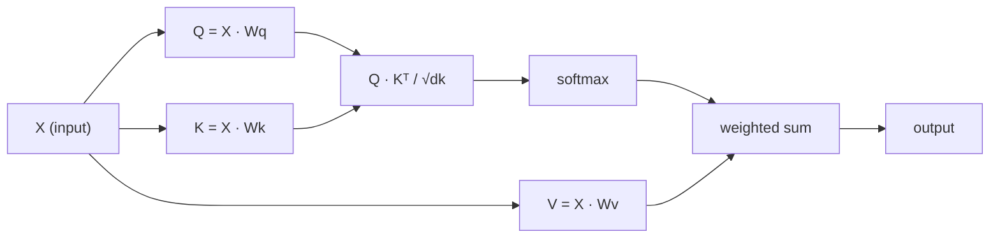

# 自从零开始注意自己

> 关注是一个搜索表,每个字都会问"谁对我有关心?" - -

**Type:** Build
**Languages:** Python
**Prerequisites:** Phase 3 (Deep Learning Core), Phase 5 Lesson 10 (Sequence-to-Sequence)
**Time:** ~90 minutes

## 学习目标

- 实现从零开始的点产品自注意,仅使用NumPy,包括查询/关键/值预测和软max权重的总和
- 构建一个多头注意力层,分开头头,计算并行注意力,并连接结果
- 追踪注意力矩阵如何捕获代币关系,并解释为什么按sqrt(d_k) 缩小可以防止软max 和
- 应用因果掩饰,将双向注意力转换为自动降低 (解码器式) 的注意力

## 问题

通过RNN处理一个代币一次序列.到达代币50时,代币1的信息已经通过50个压缩步骤被压缩.长距离的依赖性被压碎到固体尺寸的隐藏状态 - 一个瓶,没有多少LSTM门完全解决.

2014年巴哈达纳乌关注论文显示了解决方案:让解码器回顾每个编码器位置,决定哪些对当前步骤重要.但它仍然被绑定到RNN上.2017年的"注意力是你需要的"论文提出了一个更明确的问题:如果注意力是唯一的机制呢?没有重复.没有卷曲.只是注意力.

随着自觉的注意力,一个连续的位置可以在一个平行步骤中照顾其他位置.

## 概念

### 数据库搜索比喻

想象注意力是一个软的数据库搜索:

```
Traditional database:
  Query: "capital of France"  -->  exact match  -->  "Paris"

Attention:
  Query: "capital of France"  -->  similarity to ALL keys  -->  weighted blend of ALL values
```

每个符号都产生三个向量:
- **Query (Q)**"我在找什么?"
- **Key (K)**"我含有什么?"
- **Value (V)**: "如果选出,我应该提供什么信息?"

查询和所有键之间的点分数产生注意力分数.高分数意味着"这个键匹配我的查询".这些分数权重值.输出是权重的值.

### 计算

每个代币嵌入都通过三个学习的权重矩阵进行投影:

```
Input embeddings (sequence of n tokens, each d-dimensional):

  X = [x1, x2, x3, ..., xn]       shape: (n, d)

Three weight matrices:

  Wq  shape: (d, dk)
  Wk  shape: (d, dk)
  Wv  shape: (d, dv)

Projections:

  Q = X @ Wq    shape: (n, dk)      each token's query
  K = X @ Wk    shape: (n, dk)      each token's key
  V = X @ Wv    shape: (n, dv)      each token's value
```

视觉上,一个标志:

```
             Wq
  x_i ------[*]------> q_i    "What am I looking for?"
       |
       |     Wk
       +----[*]------> k_i    "What do I contain?"
       |
       |     Wv
       +----[*]------> v_i    "What do I offer?"
```

### 关注矩阵

一旦你对所有代币有Q,K,V,注意力分数形成一个矩阵:

```
Scores = Q @ K^T    shape: (n, n)

              k1    k2    k3    k4    k5
        +-----+-----+-----+-----+-----+
   q1   | 2.1 | 0.3 | 0.1 | 0.8 | 0.2 |   <- how much q1 attends to each key
        +-----+-----+-----+-----+-----+
   q2   | 0.4 | 1.9 | 0.7 | 0.1 | 0.3 |
        +-----+-----+-----+-----+-----+
   q3   | 0.2 | 0.6 | 2.3 | 0.5 | 0.1 |
        +-----+-----+-----+-----+-----+
   q4   | 0.9 | 0.1 | 0.4 | 1.7 | 0.6 |
        +-----+-----+-----+-----+-----+
   q5   | 0.1 | 0.3 | 0.2 | 0.5 | 2.0 |
        +-----+-----+-----+-----+-----+

Each row: one token's attention over the entire sequence
```

每次查询都会扫描键:每个行都会分分每个代币,软max将分数转换为权重,

```figure
attention-matrix
```

### 为什么要扩大规模?

如果dk=64,点产品可以在数十范围内,将软max推向渐变消失的区域.

```
Scaled scores = (Q @ K^T) / sqrt(dk)
```

这将值保持在软max产生有用的梯度范围.

### 软max 将分数转化为重量

软max将原始分数转换为每个行中的概率分布:

```
Raw scores for q1:   [2.1, 0.3, 0.1, 0.8, 0.2]
                            |
                         softmax
                            |
Attention weights:   [0.52, 0.09, 0.07, 0.14, 0.08]   (sums to ~1.0)
```

每个代币都有一个重量,说明要多少钱来看待其他代币.

### 值的权衡总和

每个代币的最终输出是所有值向量的权重总和:

```
output_i = sum( attention_weight[i][j] * v_j  for all j )

For token 1:
  output_1 = 0.52 * v1 + 0.09 * v2 + 0.07 * v3 + 0.14 * v4 + 0.08 * v5
```

### 整个管道



一行公式:

```
Attention(Q, K, V) = softmax( Q @ K^T / sqrt(dk) ) @ V
```

```figure
softmax-attention-scaling
```

## 建立它

### 步骤1:从零开始软max

软max将原始的 logits转换为概率.

```python
import numpy as np

def softmax(x):
    shifted = x - np.max(x, axis=-1, keepdims=True)
    exp_x = np.exp(shifted)
    return exp_x / np.sum(exp_x, axis=-1, keepdims=True)

logits = np.array([2.0, 1.0, 0.1])
print(f"logits:  {logits}")
print(f"softmax: {softmax(logits)}")
print(f"sum:     {softmax(logits).sum():.4f}")
```

### 步骤2: 量化点产品关注

取出Q,K,V矩阵,然后返回注意力输出加重矩阵.

```python
def scaled_dot_product_attention(Q, K, V):
    dk = Q.shape[-1]
    scores = Q @ K.T / np.sqrt(dk)
    weights = softmax(scores)
    output = weights @ V
    return output, weights
```

### 步骤3:学习预测的自我注意课程

具有Wq,Wk,Wv重量矩阵的全自注意模块,以Xavier式扩展启动.

```python
class SelfAttention:
    def __init__(self, d_model, dk, dv, seed=42):
        rng = np.random.default_rng(seed)
        scale = np.sqrt(2.0 / (d_model + dk))
        self.Wq = rng.normal(0, scale, (d_model, dk))
        self.Wk = rng.normal(0, scale, (d_model, dk))
        scale_v = np.sqrt(2.0 / (d_model + dv))
        self.Wv = rng.normal(0, scale_v, (d_model, dv))
        self.dk = dk

    def forward(self, X):
        Q = X @ self.Wq
        K = X @ self.Wk
        V = X @ self.Wv
        output, weights = scaled_dot_product_attention(Q, K, V)
        return output, weights
```

### 步骤4:用句子运行

创造一个句子的假嵌入,看看注意力重量.

```python
sentence = ["The", "cat", "sat", "on", "the", "mat"]
n_tokens = len(sentence)
d_model = 8
dk = 4
dv = 4

rng = np.random.default_rng(42)
X = rng.normal(0, 1, (n_tokens, d_model))

attn = SelfAttention(d_model, dk, dv, seed=42)
output, weights = attn.forward(X)

print("Attention weights (each row: where that token looks):\n")
print(f"{'':>6}", end="")
for token in sentence:
    print(f"{token:>6}", end="")
print()

for i, token in enumerate(sentence):
    print(f"{token:>6}", end="")
    for j in range(n_tokens):
        w = weights[i][j]
        print(f"{w:6.3f}", end="")
    print()
```

### 步骤5:用ASCII热图可视化注意力

给角色绘制一个快速的视觉.

```python
def ascii_heatmap(weights, tokens, chars=" ░▒▓█"):
    n = len(tokens)
    print(f"\n{'':>6}", end="")
    for t in tokens:
        print(f"{t:>6}", end="")
    print()

    for i in range(n):
        print(f"{tokens[i]:>6}", end="")
        for j in range(n):
            level = int(weights[i][j] * (len(chars) - 1) / weights.max())
            level = min(level, len(chars) - 1)
            print(f"{'  ' + chars[level] + '   '}", end="")
        print()

ascii_heatmap(weights, sentence)
```

## 用它

皮托尔奇的`nn.MultiheadAttention`它们是我们所构建的,加上多头分和输出投影:

```python
import torch
import torch.nn as nn

d_model = 8
n_heads = 2
seq_len = 6

mha = nn.MultiheadAttention(embed_dim=d_model, num_heads=n_heads, batch_first=True)

X_torch = torch.randn(1, seq_len, d_model)

output, attn_weights = mha(X_torch, X_torch, X_torch)

print(f"Input shape:            {X_torch.shape}")
print(f"Output shape:           {output.shape}")
print(f"Attention weight shape: {attn_weights.shape}")
print(f"\nAttn weights (averaged over heads):")
print(attn_weights[0].detach().numpy().round(3))
```

关键区别:多头注意力并行运行多个注意力函数,每个具有自己的Q,K,V投影大小 dk = d_model / n_heads,然后连接结果. 这使模型可以同时关注不同的关系类型.

## 运送它

这一课产生了:
- `outputs/prompt-attention-explainer.md`- 通过数据库搜索比喻解释注意力的提示

## 运动

1. 修改`scaled_dot_product_attention`接受可选的面具矩阵,在软max之前设置某些位置为负无限 (因果/解码面具是这样工作的)
2. 从零开始实施多头注意力:分为Q,K,V`n_heads`按一下,将注意力运行到每个块,连接,然后通过最终的重量矩阵投射
3. 接下来,我们将两句相同长度的句子,通过同一 SelfAttention 实例来养它们,并比较它们的注意力模式.

## 关键词

| Term | What people say | What it actually means |
|------|----------------|----------------------|
| Query (Q) | "The question vector" | A learned projection of the input that represents what information this token is looking for |
| Key (K) | "The label vector" | A learned projection that represents what information this token contains, matched against queries |
| Value (V) | "The content vector" | A learned projection carrying the actual information that gets aggregated based on attention scores |
| Scaled dot-product attention | "The attention formula" | softmax(QK^T / sqrt(dk)) @ V - scaling prevents softmax saturation in high dimensions |
| Self-attention | "The token looks at itself and others" | Attention where Q, K, V all come from the same sequence, letting every position attend to every other position |
| Attention weights | "How much focus" | A probability distribution over positions, produced by softmax over scaled dot products |
| Multi-head attention | "Parallel attention" | Running multiple attention functions with different projections, then concatenating results for richer representations |

## 进一步阅读

- [Attention Is All You Need (Vaswani et al., 2017)](https://arxiv.org/abs/1706.03762)- 原始变压纸
- [The Illustrated Transformer (Jay Alammar)](https://jalammar.github.io/illustrated-transformer/)- 完整的建筑中最好的视觉通行
- [The Annotated Transformer (Harvard NLP)](https://nlp.seas.harvard.edu/annotated-transformer/)- 逐行实施 PyTorch,并提供说明
