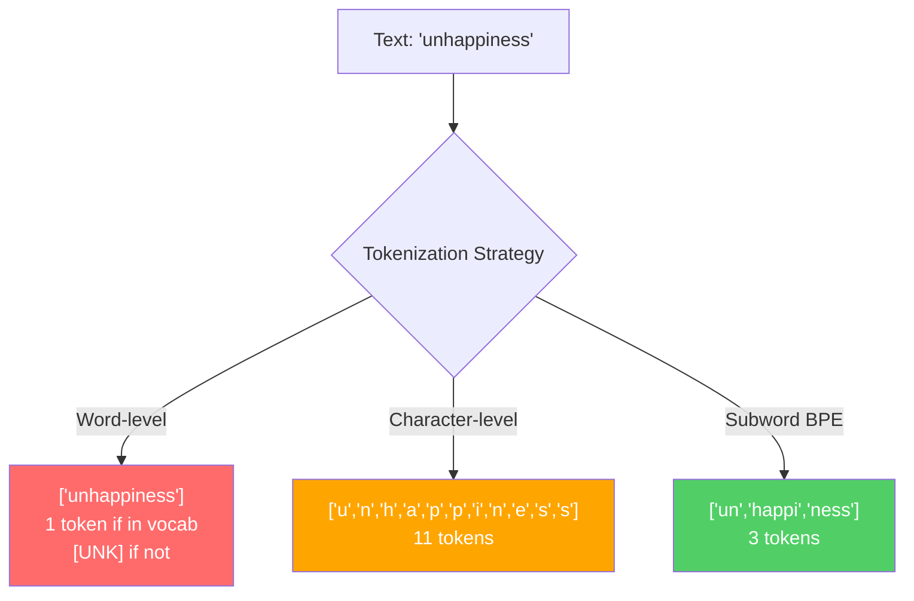
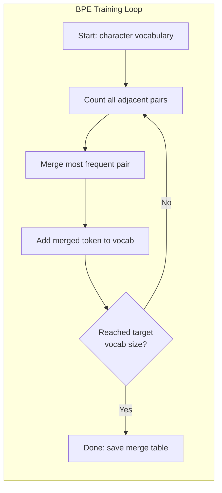
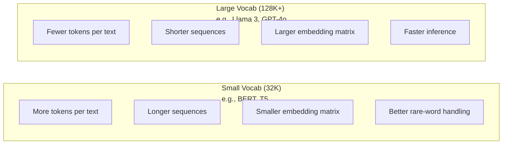

# 标记:BPE,WordPiece,SentencePiece

> 您的LLM不读英语,它读整数. 代币器决定这些整数是否具有意义或浪费.

**Type:** Build
**Languages:** Python
**Prerequisites:** Phase 05 (NLP Foundations)
**Time:** ~90 minutes

## 学习目标

- 从零开始实施BPE,WordPiece和Unigram代码代码化算法,并比较它们的合并策略
- 解释词汇大小如何影响模型效率:太小就会产生长序列,太大的废物会嵌入参数
- 分析跨语言和代码的代币化文物,确定特定代币化器在哪里分解
- 使用TikTok和句子图库来标记文字,并检查结果的标记ID

## 问题

你的法师不会读英语,不会读任何语言,只会读数字.

对于"世界好!"和"世界好!"之间的差距是代号符号.模型可以处理之前,每一个词,每一个空间,每一个分分符号都必须转换为整数.这种转换不是中立的.它将假设变成模型,之后不能撤销.

错误的模型将浪费了编码的能力. "不幸的是"变成了四个代币,而不是一个. 你的128K文本窗口只会缩小75%因为文本重于多字母字母. 让它正确,同样的文本窗口含有两倍的含义. "这个模型处理代码很好"和"这个模型窒息在Python"之间的区别通常归结于代币器如何训练.

每次你向GPT-4或Claude打出的API通话都以每个代币为价格.每一个代币你模型生成的代币都会计算成本.出口所需的代币越少,端到端推断就越快.代币化不是预处理.它是架构.

## 概念

### 三种失败的方法 (一种赢得的方法)

转换文字为数字的三种方法,其中两个方法不适用于尺度.

**Word-level tokenization**它们分为空间和分字符. "猫坐了"变成了 ["The", "cat", "sat"].简单.但是"代码化"怎么样?或者"GPT-4o"?或者一个德国复合词,比如"Geschwindigkeitsbegrenzung"?字层需要一个巨大的词汇来涵盖每个语言的每一个词.错过一个词,你会得到可怕的`[UNK]`单独的英语有超过100万个单词形式. 添加代码,URL,科学符号,以及100种其他语言,你需要无限的词汇库.

**Character-level tokenization**语文库很小 (几百个字符). 没有未知的代号. 但序列变得非常长. 一句句话是10个字符级代号变成50个字符级代号. 模型必须学到"t","h","e"一起意味着"the" - - 燃烧注意力能力在一个人学到3岁时的事情.

**Subword tokenization**找出甜点.常见的单词保持整体: "the"是一个标志.罕见的单词分解成有意义的部分:"不快乐"变成 ["un","happy","ness"].词汇保持可管理 (30K到128K标志).序列保持短.未知的标志基本上消失,因为任何单词都可以从子词的部分构建.

每个现代的LLM都使用子词代号化.GPT-2,GPT-4,BERT,Llama3,Claude.



### 字节对编码

果是一个贪的压缩算法, 为了代码化, 这个想法是足够简单的,

开始单个字符,计算训练组中的每一个相邻的对,将最频繁的对合并到一个新的代币,重复直到你达到目标词汇尺寸.

```figure
tokenizer-bpe
```

这里是BPE在一个小的体积上运行的"低","低"和"最新"的单词:

```
Corpus (with word frequencies):
  "lower"  x5
  "lowest" x2
  "newest" x6

Step 0 -- Start with characters:
  l o w e r       (x5)
  l o w e s t     (x2)
  n e w e s t     (x6)

Step 1 -- Count adjacent pairs:
  (e,s): 8    (s,t): 8    (l,o): 7    (o,w): 7
  (w,e): 13   (e,r): 5    (n,e): 6    ...

Step 2 -- Merge most frequent pair (w,e) -> "we":
  l o we r        (x5)
  l o we s t      (x2)
  n e we s t      (x6)

Step 3 -- Recount and merge (e,s) -> "es":
  l o we r        (x5)
  l o we s t      (x2)    <- 'es' only forms from 'e'+'s', not 'we'+'s'
  n e we s t      (x6)    <- wait, the 'e' before 'we' and 's' after 'we'

Actually tracking this precisely:
  After "we" merge, remaining pairs:
  (l,o): 7   (o,we): 7   (we,r): 5   (we,s): 8
  (s,t): 8   (n,e): 6    (e,we): 6

Step 3 -- Merge (we,s) -> "wes" or (s,t) -> "st" (tied at 8, pick first):
  Merge (we,s) -> "wes":
  l o we r        (x5)
  l o wes t       (x2)
  n e wes t       (x6)

Step 4 -- Merge (wes,t) -> "west":
  l o we r        (x5)
  l o west        (x2)
  n e west        (x6)

...continue until target vocab size reached.
```

合并表是代码符号.为了编码新文本,应用合并按照学习的顺序.培训组确定哪些合并存在,而这种选择永久地塑造模型看到的东西.



### 字节级BPE (GPT-2,GPT-3,GPT-4)

标准BPE使用Unicode字符.字节级BPE使用原始字节 (0-255).这为您提供了精确的256个基础词汇,处理任何语言或编码,从来没有产生未知的代币.

基词库涵盖每一个可能的字节.BPE 融合在此基础上.OpenAI的TikToken库使用以下字节级BPE实现:

- 其他: 其他: 其他:
- 基因代码 (GPT-3.5/GPT-4: ~100,256个代码 (cl100k_base编码)
- 其他类型: 子,子,子,子,子,子,子,子,子,子,子,子,子,子,子,子,子,子,子,子,子,子,子,子,子,子,子,子,子,子,子,子,子,子,子,子,子,子,子,子,子,子,子,子,子,子,子,子,子,子,子,子,子,子,子,子,子,子,子,子,子,子,子,子,子,子,子,子,子,子,子,子,子,子,子,子,子,子,子,子,子,子,子,子,子,子,子,子,子,子,子,子,子,子,子,子,子,子,子

### 字体 (BERT)

虽然WordPiece与BPE相似,但选择的融合不同.

```
BPE merge criterion:      count(A, B)
WordPiece merge criterion: count(AB) / (count(A) * count(B))
```

语:BPE问:"哪个对出现最频繁?"WordPiece问:"哪个对出现在一起比你偶然想象的更频繁?"这种微妙的差异产生不同的词汇.WordPiece喜欢合并,而不是只是频繁的合并.

字体Piece也使用"##"前为延续子词:

```
"unhappiness" -> ["un", "##happi", "##ness"]
"embedding"   -> ["em", "##bed", "##ding"]
```

首尾号"##"告诉你,这个部分继续前一个代币.BERT使用WordPiece,其词汇总数为30522代币.每一个BERT变体--DistilBERT,RoBERTa的代币符号实际上是BPE,但BERT本身是WordPiece.

### 句子 (拉马,T5)

语句Piece将输入作为包括白色空间在内的单元码字符的原始流.没有预代码化步骤.没有语言特定的语文规则关于词界限.这使其真正的语言无知 - 它在中文,日本,泰语和其他语言上运行,空间不分离单词.

语句Piece支持两个算法:
- **BPE mode**:与标准BPE相同的融合逻辑,适用于原始字符序列
- **Unigram mode**开始用大量的词汇,并反复删除影响总体概率最小的代币.

拉马2使用SentencePiece BPE,其词汇总数为32,000个代币.T5使用SentencePiece Unigram,其代币数为32,000个.注:拉马3转换为基于TikTok的字节级BPE代币,其代币数为128,256.

### 词汇尺寸交易

这是一个真正的工程决定,



具体数字.对于一个128K词汇库,包含4,096维嵌入,嵌入矩阵本身是128,000 x4,096 =52400万参数.对于一个32K词汇库,它是13100万参数.这仅仅是代币选择的400M参数差异.

但更大的词汇库更积极地压缩文本.同一个英语段落需要100个代币,32K的词汇库可能需要70个代币,128K的词汇库.这意味着在生成过程中 30%的前进传递减少.对于一个服务于数百万请求的模型,这是直接降低计算成本.

趋势很明显:词汇规模正在增加.GPT-2使用了50.257.GPT-4使用了100K.Llama 3使用了128K.GPT-4o使用了200K.

| Model | Vocab Size | Tokenizer Type | Avg Tokens per English Word |
|-------|-----------|----------------|---------------------------|
| BERT | 30,522 | WordPiece | ~1.4 |
| GPT-2 | 50,257 | Byte-level BPE | ~1.3 |
| Llama 2 | 32,000 | SentencePiece BPE | ~1.4 |
| GPT-4 | ~100,256 | Byte-level BPE | ~1.2 |
| Llama 3 | 128,256 | Byte-level BPE (tiktoken) | ~1.1 |
| GPT-4o | 200,019 | Byte-level BPE | ~1.0 |

### 多语言税

韩国语的语文在GPT-2的语文中平均每字有2-3个代币.中国语可能更糟糕. 这意味着韩国用户实际上有一个背景窗口,大小是英语用户的一半 - - 支付相同的价格,以减少信息密度.

这就是为什么Llama 3从32K增加到128K的词汇库.更多的代币用于非英语脚本意味着语言之间的压缩更公平.

```figure
tokenizer-tradeoff
```

## 建立它

### 步骤1:字符级标记器

开始从基础上.一个字符级代码符号将每个字符映射到其Unicode代码点.没有培训.没有未知的代码.只是直接映射.

```python
class CharTokenizer:
    def encode(self, text):
        return [ord(c) for c in text]

    def decode(self, tokens):
        return "".join(chr(t) for t in tokens)
```

每个字符都是自己的符号.这是我们改进的基线.

### 步骤 2:从零开始的BPE标记器

我们训练在原始字节 (如GPT-2),数对,合并最频繁的,并记录每个合并顺序.合并表是代币.

```python
from collections import Counter

class BPETokenizer:
    def __init__(self):
        self.merges = {}
        self.vocab = {}

    def _get_pairs(self, tokens):
        pairs = Counter()
        for i in range(len(tokens) - 1):
            pairs[(tokens[i], tokens[i + 1])] += 1
        return pairs

    def _merge_pair(self, tokens, pair, new_token):
        merged = []
        i = 0
        while i < len(tokens):
            if i < len(tokens) - 1 and tokens[i] == pair[0] and tokens[i + 1] == pair[1]:
                merged.append(new_token)
                i += 2
            else:
                merged.append(tokens[i])
                i += 1
        return merged

    def train(self, text, num_merges):
        tokens = list(text.encode("utf-8"))
        self.vocab = {i: bytes([i]) for i in range(256)}

        for i in range(num_merges):
            pairs = self._get_pairs(tokens)
            if not pairs:
                break
            best_pair = max(pairs, key=pairs.get)
            new_token = 256 + i
            tokens = self._merge_pair(tokens, best_pair, new_token)
            self.merges[best_pair] = new_token
            self.vocab[new_token] = self.vocab[best_pair[0]] + self.vocab[best_pair[1]]

        return self

    def encode(self, text):
        tokens = list(text.encode("utf-8"))
        for pair, new_token in self.merges.items():
            tokens = self._merge_pair(tokens, pair, new_token)
        return tokens

    def decode(self, tokens):
        byte_sequence = b"".join(self.vocab[t] for t in tokens)
        return byte_sequence.decode("utf-8", errors="replace")
```

训练循环是BPE的核心:数对,合并赢家,重复.每次合并都减少了全部代币数量.`num_merges`字母数量从256个 (基字节) 增加到256个+数_合并.

编码应用合并在它们所学到的确切顺序中.这很重要.如果合并1创建"th"并合并5创建"the",编码必须首先应用合并1以便"the"可以从"th" +"e"在合并5中形成.

解码是相反的:查看词汇中的每个代币ID,连接字节,解码到UTF-8.

### 步骤3: 编码和解码回路

```python
corpus = (
    "The cat sat on the mat. The cat ate the rat. "
    "The dog sat on the log. The dog ate the frog. "
    "Natural language processing is the study of how computers "
    "understand and generate human language. "
    "Tokenization is the first step in any NLP pipeline."
)

tokenizer = BPETokenizer()
tokenizer.train(corpus, num_merges=40)

test_sentences = [
    "The cat sat on the mat.",
    "Natural language processing",
    "tokenization pipeline",
    "unhappiness",
]

for sentence in test_sentences:
    encoded = tokenizer.encode(sentence)
    decoded = tokenizer.decode(encoded)
    raw_bytes = len(sentence.encode("utf-8"))
    ratio = len(encoded) / raw_bytes
    print(f"'{sentence}'")
    print(f"  Tokens: {len(encoded)} (from {raw_bytes} bytes) -- ratio: {ratio:.2f}")
    print(f"  Roundtrip: {'PASS' if decoded == sentence else 'FAIL'}")
```

压缩比告诉你代币器是多有效的. 标记符将文字压缩到原始字节的半个标记. 低点更好. 在训练中,比率将是好的. 在未发行的文本上,例如"不快乐" (它不出现在体内), 比率会更糟糕 - - 代币器回归于字符级编码,

### 步骤 4:与TikTok进行比较

```python
import tiktoken

enc = tiktoken.get_encoding("cl100k_base")

texts = [
    "The cat sat on the mat.",
    "unhappiness",
    "Hello, world!",
    "def fibonacci(n): return n if n < 2 else fibonacci(n-1) + fibonacci(n-2)",
    "Geschwindigkeitsbegrenzung",
]

for text in texts:
    our_tokens = tokenizer.encode(text)
    tiktoken_tokens = enc.encode(text)
    tiktoken_pieces = [enc.decode([t]) for t in tiktoken_tokens]
    print(f"'{text}'")
    print(f"  Our BPE:   {len(our_tokens)} tokens")
    print(f"  tiktoken:  {len(tiktoken_tokens)} tokens -> {tiktoken_pieces}")
```

tiktoken 使用相同的算法,但在100,000次合并中训练了数百个千兆字节的文本.算法是相同的.区别在于训练数据和合并数量.你的代币器训练在40次合并的段落上不能与 tiktoken的100K合并在一个巨大的体积上竞争.但机制是一样的.

### 步骤5:词汇分析

```python
def analyze_vocabulary(tokenizer, test_texts):
    total_tokens = 0
    total_chars = 0
    token_usage = Counter()

    for text in test_texts:
        encoded = tokenizer.encode(text)
        total_tokens += len(encoded)
        total_chars += len(text)
        for t in encoded:
            token_usage[t] += 1

    print(f"Vocabulary size: {len(tokenizer.vocab)}")
    print(f"Total tokens across all texts: {total_tokens}")
    print(f"Total characters: {total_chars}")
    print(f"Avg tokens per character: {total_tokens / total_chars:.2f}")

    print(f"\nMost used tokens:")
    for token_id, count in token_usage.most_common(10):
        token_bytes = tokenizer.vocab[token_id]
        display = token_bytes.decode("utf-8", errors="replace")
        print(f"  Token {token_id:4d}: '{display}' (used {count} times)")

    unused = [t for t in tokenizer.vocab if t not in token_usage]
    print(f"\nUnused tokens: {len(unused)} out of {len(tokenizer.vocab)}")
```

这显示了你的词汇中的Zipf分布.几个代币占主导地位 (空间,"the","e").大多数代币很少被使用.生产代币器优化这种分布 - - 常见模式得到了短代币ID,罕见模式得到了更长的表示.

## 用它

你的子BPE工作了.现在看看生产工具是什么样子.

### 投资者

```python
import tiktoken

enc = tiktoken.get_encoding("cl100k_base")

text = "Tokenizers convert text to integers"
tokens = enc.encode(text)
print(f"Tokens: {tokens}")
print(f"Pieces: {[enc.decode([t]) for t in tokens]}")
print(f"Roundtrip: {enc.decode(tokens)}")
```

标用Python绑定编写了Rust. 它每秒编码数百万个代币. 同样的BPE算法,工业强度实现.

### 拥抱脸标记器

```python
from tokenizers import Tokenizer
from tokenizers.models import BPE
from tokenizers.trainers import BpeTrainer
from tokenizers.pre_tokenizers import ByteLevel

tokenizer = Tokenizer(BPE())
tokenizer.pre_tokenizer = ByteLevel()

trainer = BpeTrainer(vocab_size=1000, special_tokens=["<pad>", "<eos>", "<unk>"])
tokenizer.train(["corpus.txt"], trainer)

output = tokenizer.encode("The cat sat on the mat.")
print(f"Tokens: {output.tokens}")
print(f"IDs: {output.ids}")
```

抱脸代币库也是Rust下帽子. 它在几秒钟内训练BPE在千兆尺度的体体.

### 装载拉马的标记器

```python
from transformers import AutoTokenizer

tokenizer = AutoTokenizer.from_pretrained("meta-llama/Llama-3.1-8B")

text = "Tokenizers are the unsung heroes of LLMs"
tokens = tokenizer.encode(text)
print(f"Token IDs: {tokens}")
print(f"Tokens: {tokenizer.convert_ids_to_tokens(tokens)}")
print(f"Vocab size: {tokenizer.vocab_size}")

multilingual = ["Hello world", "Hola mundo", "Bonjour le monde"]
for text in multilingual:
    ids = tokenizer.encode(text)
    print(f"'{text}' -> {len(ids)} tokens")
```

拉马3的128K词汇库压缩了非英语文本,比GPT-2的50K词汇库要好得多.你可以自己验证这一点,

## 运送它

这一课产生了`outputs/prompt-tokenizer-analyzer.md`-- 一个可重复使用的提示,分析任何文本和模型组合的代币化效率. 给它一个文本样本,它告诉你哪个模型的代币化器处理它最好.

## 运动

1. 修改BPE标记器以在每个 merge步骤中打印词汇.观察"t" + "h"如何成为"th",然后"th" + "e"成为"the".追踪普通英语词汇如何逐步组装.

2. 添加特殊代币 (`<pad>`现在`<eos>`现在`<unk>`) 给BPE代币器. 赋予他们0 ,1,2的ID,并相应地移动所有其他代币. 在运行BPE之前,执行预代币化步骤,在白空间上分开.

3. 执行WordPiece合并标准 (概率比率而不是频率).训练BPE和WordPiece在同一组合中使用相同数量的合并.比较结果的词汇库 - 哪个产生更有语言意义的子词?

4. 建立一个多语言代币器效率基准.用英语,西班牙语,中国,韩语和阿拉伯语进行10句子.用Tik Token (cl100k_base) 代币每个字符,并测量每字符的平均代币.量化每个语言的"多语言税".

5. 训练你的BPE标记器在更大的体积上 (下载维基百科文章).调整合并数量以达到相同文本上的10%的压缩比率.这迫使你了解体积,合并数量和压缩质量之间的关系.

## 关键词

| Term | What people say | What it actually means |
|------|----------------|----------------------|
| Token | "A word" | A unit in the model's vocabulary -- could be a character, subword, word, or multi-word chunk |
| BPE | "Some compression thing" | Byte Pair Encoding -- iteratively merge the most frequent adjacent pair of tokens until the target vocabulary size is reached |
| WordPiece | "BERT's tokenizer" | Like BPE but merges maximize the likelihood ratio count(AB)/(count(A)*count(B)) instead of raw frequency |
| SentencePiece | "A tokenizer library" | A language-agnostic tokenizer that operates on raw Unicode without pre-tokenization, supporting BPE and Unigram algorithms |
| Vocabulary size | "How many words it knows" | The total number of unique tokens: GPT-2 has 50,257, BERT has 30,522, Llama 3 has 128,256 |
| Fertility | "Not a tokenizer term" | Average number of tokens per word -- measures tokenizer efficiency across languages (1.0 is perfect, 3.0 means the model works three times harder) |
| Byte-level BPE | "GPT's tokenizer" | BPE operating on raw bytes (0-255) instead of Unicode characters, guaranteeing no unknown tokens for any input |
| Merge table | "The tokenizer file" | Ordered list of pair merges learned during training -- this IS the tokenizer, and order matters |
| Pre-tokenization | "Splitting on spaces" | Rules applied before subword tokenization: whitespace splitting, digit separation, punctuation handling |
| Compression ratio | "How efficient the tokenizer is" | Tokens produced divided by input bytes -- lower means better compression and faster inference |

## 进一步阅读

- [Sennrich et al., 2016 -- "Neural Machine Translation of Rare Words with Subword Units"](https://arxiv.org/abs/1508.07909)-- 引入了BPE为NLP的论文,将1994年的压缩算法变成现代代币化的基础
- [Kudo & Richardson, 2018 -- "SentencePiece: A simple and language independent subword tokenizer"](https://arxiv.org/abs/1808.06226)--使多语言模型成为实用的语言认知标记
- [OpenAI tiktoken repository](https://github.com/openai/tiktoken)--生产BPE实现在Rust with Python绑定中,使用GPT-3.5/4/4o
- [Hugging Face Tokenizers documentation](https://huggingface.co/docs/tokenizers)-- 具有性性能的生产级代币器培训
