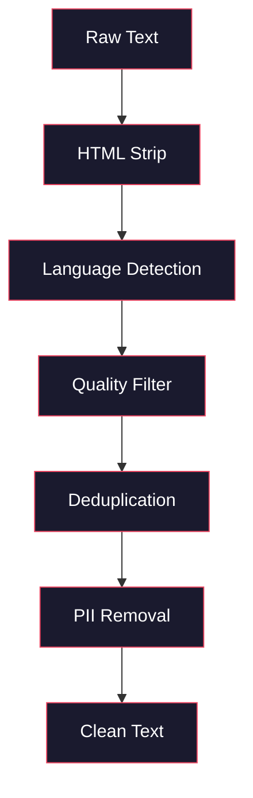
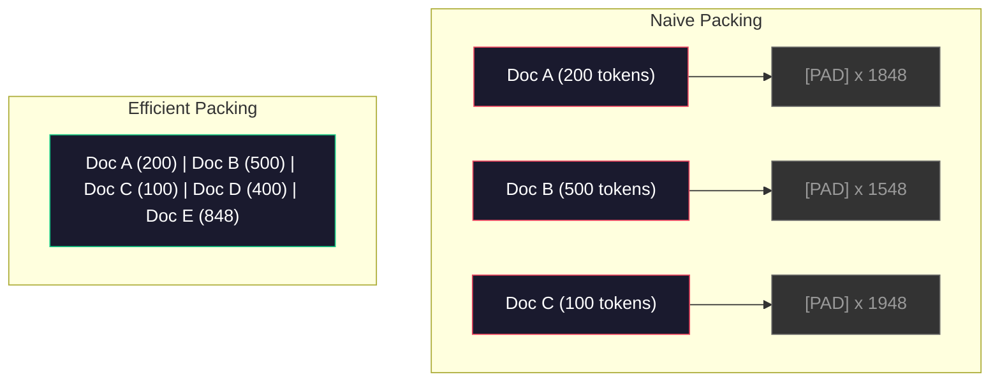

# 预训练数据管道

> 模型是镜子,它反映出你给它提供的数据,它给它垃圾,它反映垃圾,完全流利.

**Type:** Build
**Languages:** Python
**Prerequisites:** Phase 10, Lessons 01-02 (Tokenizers, Building a Tokenizer)
**Time:** ~90 minutes

## 学习目标

- 建立一个流媒体数据管道,将图标,块,混动和批量图拉字节的文本,而不需要将其全部加载到内存中
- 实施在实际预训管道中使用的数据质量过器 (脱复,语言检测,内容过)
- 建立固定长度训练序列,使用适当的注意力面具和文件边界处理
- 为了确保数据加载器跟上GPU训练速度

## 问题

你有代币,现在你需要数据.

没有数据集,没有CSV文件. 文字的太字节 - - 清理,减倍,过质量,将其代币化成固定长度的序列,

大多数人认为,培训LLM是关于模型架构.不是.Llama 3使用了15.6万亿代币.GPT-3使用了300亿代币.DeepSeek-V2使用了8.1万亿代币.三者的架构大致相同:堆叠的变压器块,有注意力和反层.输出质量差异主要来自数据.

深思维的辛奇拉论文确切地说明了这一点. 对于给定的计算预算,模型参数与训练令牌的最佳比例. 奇拉表明,大多数2022年的模型都很少训练, 训练用14万亿代币 (Chinchilla-optimal) 的70B参数模型超过了训练用300亿代币 (Gopher) 的280B模型.

您的数据管道决定您的模型是否学习语言或学习噪音.

## 概念

### 数据来源于哪里

每个大型语言模型都基于各种来源进行训练.

| Source | Size | Quality | Used By |
|--------|------|---------|---------|
| Common Crawl | ~250 TB raw | Low (needs heavy filtering) | GPT-3, Llama, most open models |
| Wikipedia | ~20 GB | High | Every major LLM |
| GitHub code | ~1 TB+ | Medium (lots of duplicates, dead code) | StarCoder, CodeLlama, DeepSeek-Coder |
| Books (BookCorpus, Pile) | ~100 GB | High | GPT-2, GPT-3, early models |
| Academic papers (arXiv, S2ORC) | ~100 GB | High for STEM | Llama, Galactica |
| StackOverflow, Reddit | ~100 GB | Medium | Llama, Falcon |
| Curated web (C4, RefinedWeb) | ~5 TB | Medium-High (pre-filtered) | T5, Falcon |

拉马3公布了其数据组合:大约50%的网页数据,25%的代码,13%的书籍和学术论文,8%的数学数据,4%的多语言网页数据.总共来自超过5TB原始文本的15.6万亿代币.

比例与总规模一样重要.太多的网络数据,模型变成了Reddit.太少代码,它无法编程.太少数学,它无法推理.

### 数据清理

常见的爬垃圾包含:

- HTML标签和JavaScript
- 炉板头,脚,导航菜单
- 复制页面 (准确和接近复制)
- 机器生成的垃圾邮件
- 个人身份信息 (PII)
- 低质量的文本 (关键词列表,SEO垃圾邮件)
- 编码为文本的非文本内容

清理不是可选的.这是生成一致段落的模型和输出与产品列表混合的HTML标签之间的区别.



每一步都消除了一类噪音:

**HTML stripping:**删除所有标记,只保留可见的文本内容.`trafilatura`或`readability`提取文章内容,同时丢弃导航,广告和板.

**Language detection:**使用快Text的语言识别模型 (lid.176.bin) 来分类每个文档. 过到您的目标语言.一个以0.8以下的信心分类为英语的文档可能不是清洁的英语.

**Quality filtering:**这就是有趣的地方. 精炼Web (猎背后的数据集) 使用基于困难的过器:训练维基百科中的一个小语言模型,然后分分每份文档. 很高的困难意味着文档与维基百科不同 - 可能是垃圾邮件,关键词列表或机器生成的内容.

**Deduplication:**简单的清洁步骤.普通爬行包含大量的复制页面 - - 法律豁免, Cookie通知,服务条款.

**PII removal:**基于Regex的检测,用于结构化 PII,NER模型,用于名字的背景.

### 除使用 MinHash

精确的排版很容易:哈希每个文件,删除重复.但近重复是真正的问题.两个副本的相同新闻文章,周围有略有不同的广告是近重复.内容是95%相同的,但它们的字节对字节不同.

微软+本地敏感密码 (LSH) 能有效地解决这一问题.


他们的想法:

1. **Shingling:**转换每份文件成 n 克的集合 (例如, 5 克的词或字符). "快棕狐"与 3 字的带成为 {"快棕狐"",快棕狐"}.

2. **MinHash:**对于每个文件的纹集合,计算k哈希值.每个哈希值是在不同哈希函数下所有纹中最小的哈希值. 这会产生一个固定尺寸的"签名",它接近任何两个文件之间的Jaccard相似性.

3. **LSH:**根据他们MinHash签名的带,将文件组成桶.同一桶中的文件是候选人近重复. 这避免了每对的比较 - - 你只比较候选人.

4. **Verify:**对于每个候选对,计算出精确的Jaccard相似性. 如果相似性超过门值 (通常是0.8),则删除一本.

拉马团队报告说,通过排版删除了约38%的网络数据.这并不小数.超过三分之一的通用爬虫是重复或接近重复的内容.

### 序列包装

您的模型预计的输入序列是固定的长度.您的文件是变长度.有些是50个代币.有些是50,000个代币.

简单的方法:将每个文件填充到最大的序列长度. 这就会浪费大量的计算,

较好的方法:将多份文件捆绑在一个单一的序列中,由序列结束代币分开. 2048代币的序列可能包含三个短文档,它们之间有 [EOS]代币.



注意力面具必须正确设置.文件 A 的代币不应在同一包装序列内与文件 B 的代币相处.这需要一个区块斜角的注意力面具.

长文档在序列边界被缩小或分成块. 分断点是重要的:分断句子中部迫使模型看到不完整的想法.有些管道将分断与段落或句子边界进行排列,如果可能的话.

### 奇拉尺度定律

对于固定计算预算C (以FLOP计量),最佳模型大小N和数据集大小D是:

```
N_opt ~ C^0.5
D_opt ~ C^0.5
```

实际上,这意味着你应该大约同样扩展模型大小和数据集大小.一个具有10倍以上参数的模型需要大约10倍更多的训练令牌才能达到相同的损失.

| Model | Parameters | Training Tokens | Chinchilla-Optimal? |
|-------|-----------|----------------|-------------------|
| GPT-3 | 175B | 300B | No (undertrained 3-4x) |
| Chinchilla | 70B | 1.4T | Yes (by design) |
| Llama 2 | 70B | 2T | Overtrained (intentionally) |
| Llama 3 | 70B | 15T | Heavily overtrained |

拉马3故意违反了辛奇拉法.Meta发现,在更多数据上进行过度训练 - - 远远超出计算-最佳比率 - - - 产生了更好的推理模型.额外的训练成本是一次支付的,但较小的模型更便宜永远服务.这有时被称为"推理-最佳"规模化方法,并成为2024年以来的行业标准.

```figure
l5-data-pipeline
```

## 建立它

### 第一个步骤:清洁文字

删除非文本内容,将公共领域文本 (Gutenberg项目) 作为我们的小体.

```python
import re

def clean_text(text):
    text = re.sub(r"<[^>]+>", "", text)
    text = re.sub(r"http\S+", "", text)
    text = re.sub(r"[^\x20-\x7E\n]", "", text)
    text = re.sub(r"\n{3,}", "\n\n", text)
    text = re.sub(r" {2,}", " ", text)
    return text.strip()

def quality_filter(text, min_words=50, max_ratio_caps=0.3, max_ratio_special=0.1):
    words = text.split()
    if len(words) < min_words:
        return False
    caps_ratio = sum(1 for w in words if w.isupper()) / len(words)
    if caps_ratio > max_ratio_caps:
        return False
    special_chars = sum(1 for c in text if not c.isalnum() and not c.isspace())
    if special_chars / max(len(text), 1) > max_ratio_special:
        return False
    return True
```

质量过器捕获SEO垃圾邮件 (ALL CAPS),机器生成的噪音 (特殊字符比例高),以及页 (太短).仅仅这些三个检查可以从网页爬行中清除惊人的垃圾量.

### 步骤2: 微量化

没有需要外部图书馆,只是`hashlib`现在,我们要去.

```python
import hashlib
from collections import defaultdict

def get_shingles(text, k=5):
    words = text.lower().split()
    if len(words) < k:
        return set()
    return {" ".join(words[i:i+k]) for i in range(len(words) - k + 1)}

def minhash_signature(shingles, num_hashes=128):
    signature = []
    for i in range(num_hashes):
        min_hash = float("inf")
        for shingle in shingles:
            h = int(hashlib.sha256(f"{i}:{shingle}".encode()).hexdigest(), 16)
            min_hash = min(min_hash, h)
        signature.append(min_hash)
    return signature

def lsh_buckets(signature, bands=16):
    rows_per_band = len(signature) // bands
    buckets = []
    for b in range(bands):
        start = b * rows_per_band
        band_data = tuple(signature[start:start + rows_per_band])
        bucket_hash = hashlib.md5(str(band_data).encode()).hexdigest()
        buckets.append((b, bucket_hash))
    return buckets

def deduplicate(documents, threshold=0.8, num_hashes=128, bands=16):
    signatures = []
    shingle_sets = []
    for doc in documents:
        shingles = get_shingles(doc)
        shingle_sets.append(shingles)
        signatures.append(minhash_signature(shingles, num_hashes))

    bucket_map = defaultdict(list)
    for doc_idx, sig in enumerate(signatures):
        for band_id, bucket_hash in lsh_buckets(sig, bands):
            bucket_map[(band_id, bucket_hash)].append(doc_idx)

    duplicate_pairs = set()
    for bucket_docs in bucket_map.values():
        if len(bucket_docs) < 2:
            continue
        for i in range(len(bucket_docs)):
            for j in range(i + 1, len(bucket_docs)):
                duplicate_pairs.add((bucket_docs[i], bucket_docs[j]))

    removed = set()
    for i, j in duplicate_pairs:
        if i in removed or j in removed:
            continue
        s1, s2 = shingle_sets[i], shingle_sets[j]
        if not s1 or not s2:
            continue
        jaccard = len(s1 & s2) / len(s1 | s2)
        if jaccard >= threshold:
            removed.add(j)

    return [doc for idx, doc in enumerate(documents) if idx not in removed], len(removed)
```

其他`num_hashes=128`其他`bands=16`更多的哈希提供更准确的相似性估计.更多的频段以更大的假正值来增加回忆 (捕获更多重复).这些值对典型的网页文本工作很好.

### 步骤3:标记并将序列包装

清洁的,复制的文本,将其标记成标记,然后将其包装成固定长度的序列,

```python
def tokenize_corpus(documents, tokenizer):
    all_tokens = []
    for doc in documents:
        tokens = tokenizer.encode(doc)
        all_tokens.extend(tokens)
        all_tokens.append(tokenizer.eos_id)
    return all_tokens

def pack_sequences(token_ids, seq_length, pad_id=0):
    sequences = []
    attention_masks = []
    for i in range(0, len(token_ids), seq_length):
        seq = token_ids[i:i + seq_length]
        mask = [1] * len(seq)
        if len(seq) < seq_length:
            pad_count = seq_length - len(seq)
            seq = seq + [pad_id] * pad_count
            mask = mask + [0] * pad_count
        sequences.append(seq)
        attention_masks.append(mask)
    return sequences, attention_masks
```

### 步骤4:培训数据载体

随机组装序列的结果. 这就是训练循环所消耗的.

```python
import random

class PreTrainingDataLoader:
    def __init__(self, sequences, attention_masks, batch_size, shuffle=True):
        self.sequences = sequences
        self.attention_masks = attention_masks
        self.batch_size = batch_size
        self.shuffle = shuffle

    def __len__(self):
        return (len(self.sequences) + self.batch_size - 1) // self.batch_size

    def __iter__(self):
        indices = list(range(len(self.sequences)))
        if self.shuffle:
            random.shuffle(indices)
        for start in range(0, len(indices), self.batch_size):
            batch_idx = indices[start:start + self.batch_size]
            batch_seqs = [self.sequences[i] for i in batch_idx]
            batch_masks = [self.attention_masks[i] for i in batch_idx]
            yield batch_seqs, batch_masks
```

### 步骤5:数据集统计

计算重要数字:总代币,独特代币,压缩比,文件长度分布.

```python
from collections import Counter

def compute_statistics(documents, token_ids, sequences, tokenizer_vocab_size):
    total_chars = sum(len(d) for d in documents)
    total_tokens = len(token_ids)
    unique_tokens = len(set(token_ids))
    compression_ratio = total_chars / total_tokens

    doc_lengths = [len(d.split()) for d in documents]
    avg_doc_length = sum(doc_lengths) / max(len(doc_lengths), 1)
    max_doc_length = max(doc_lengths) if doc_lengths else 0
    min_doc_length = min(doc_lengths) if doc_lengths else 0

    token_counts = Counter(token_ids)
    top_tokens = token_counts.most_common(10)

    non_pad_tokens = sum(sum(1 for t in seq if t != 0) for seq in sequences)
    total_positions = sum(len(seq) for seq in sequences)
    utilization = non_pad_tokens / max(total_positions, 1)

    stats = {
        "total_documents": len(documents),
        "total_characters": total_chars,
        "total_tokens": total_tokens,
        "unique_tokens": unique_tokens,
        "vocab_utilization": unique_tokens / tokenizer_vocab_size,
        "compression_ratio": compression_ratio,
        "avg_doc_length_words": avg_doc_length,
        "max_doc_length_words": max_doc_length,
        "min_doc_length_words": min_doc_length,
        "num_sequences": len(sequences),
        "sequence_utilization": utilization,
        "top_10_tokens": top_tokens,
    }
    return stats
```

压缩比率告诉你代币器在这个体积上是多么高效.英语文本通常压缩到每代币约3-4个字符.如果你看到每代币1.5个字符,你的代币器会被分化过于激进.如果你看到8+,它已经学会了非常特定的域的合并.

序列利用告诉你你的包装序列中的多少是真实数据与填充.90%以下意味着你的包装是不高效的 - - 你正在浪费计算在填充代币.

## 用它

### 与"抱抱脸"数据集进行比较

通过 HuggingFace 的数据库中加载相同的数据库,并比较管道速度.

```python
from datasets import load_dataset
from transformers import AutoTokenizer

ds = load_dataset("wikitext", "wikitext-2-raw-v1", split="train")
tokenizer = AutoTokenizer.from_pretrained("meta-llama/Meta-Llama-3-8B")

import time

start = time.time()
tokenized = ds.map(
    lambda x: tokenizer(x["text"], truncation=True, max_length=2048),
    batched=True,
    num_proc=4,
)
hf_time = time.time() - start
total_tokens = sum(len(t) for t in tokenized["input_ids"])
print(f"HuggingFace: {total_tokens:,} tokens in {hf_time:.2f}s ({total_tokens/hf_time:,.0f} tokens/sec)")
```

脸管道使用罩下的Rust代币,并行处理在4个核心.你的纯 Python 管道将会10-50倍慢.这差距是为什么生产团队使用编译代币.算法是一样的.实现语言是差异.

## 运送它

本课程提供了验证和调试LLM培训管道数据质量的提示.`outputs/prompt-data-quality-checker.md`现在,我们要去.

## 运动

1. **Easy:**通过简单的学 (字符集分析) 添加语言检测到清洁管道. 仅仅将英语文档过,并测量取消的文档数量.
2. **Medium:**通过使用 SHA-256 哈希和 MinHash 接近排版一起实现精确排版. 通过每个方法在网页剪辑的体积上捕获的排版数量进行比较.
3. **Hard:**建立一个基于杂性的质量过器. 在维基百科文本上训练一个小的大图语言模型,根据杂性评分每个文档,然后删除下面的20%.在训练过数据和未过数据时,比较模型输出质量.

## 关键词

| Term | What people say | What it actually means |
|------|----------------|----------------------|
| Common Crawl | "The internet" | A non-profit that crawls the web monthly -- ~250TB raw, the starting point for most LLM training data |
| MinHash | "Some hashing trick" | A technique to estimate Jaccard similarity between sets using fixed-size signatures -- enables near-duplicate detection at scale |
| LSH | "Locality-Sensitive Hashing" | A method to group similar items into the same bucket -- reduces pairwise comparisons from O(n^2) to near-linear |
| Sequence packing | "Concatenating documents" | Fitting multiple documents into fixed-length sequences with proper attention masks -- eliminates padding waste |
| Chinchilla scaling | "Train on more data" | For a fixed compute budget, optimal performance requires scaling model size and training tokens roughly equally |
| Fertility | "Tokens per word" | Average number of tokens per word -- 1.3 for English in GPT-4, higher for non-Latin scripts |
| Data mixing | "Choosing training data" | The ratio of code vs text vs math vs multilingual data -- no formula, requires experimentation |
| Perplexity filter | "Quality scoring" | Use a small language model to score documents -- high perplexity means the text is unlike clean reference data |
| Deduplication | "Removing copies" | Eliminating exact and near-duplicate documents -- typically removes 30-40% of raw web data |
| Attention mask | "Which tokens to look at" | A binary mask that prevents attention across document boundaries in packed sequences |

## 进一步阅读

- [Hoffmann et al., 2022 -- Training Compute-Optimal Large Language Models (Chinchilla)](https://arxiv.org/abs/2203.15556)改变了我们对数据规模的看法.
- [Penedo et al., 2023 -- The RefinedWeb Dataset for Falcon LLM](https://arxiv.org/abs/2306.01116)--如何过普通爬虫到高质量
- [Touvron et al., 2023 -- Llama 2: Open Foundation and Fine-Tuned Chat Models](https://arxiv.org/abs/2307.09288)-- 关于Llama 2的数据管道详情
- [Lee et al., 2022 -- Deduplicating Training Data Makes Language Models Better](https://arxiv.org/abs/2107.06499)-- 为什么减倍比你想象的更重要
- [Broder, 1997 -- On the Resemblance and Containment of Documents](https://ieeexplore.ieee.org/document/666900)-- 简单的MINHASH纸
- [Meta, 2024 -- Llama 3 Technical Report](https://arxiv.org/abs/2407.21783)-- 15.6T代币,数据混合比率,过管道
