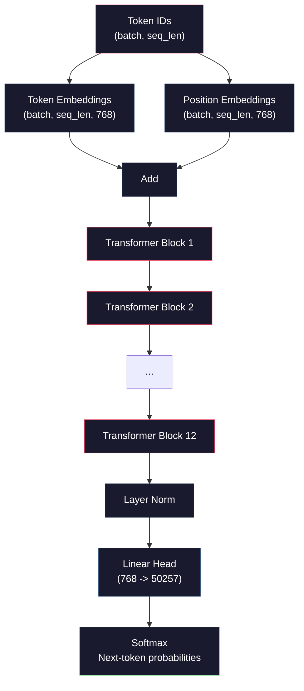
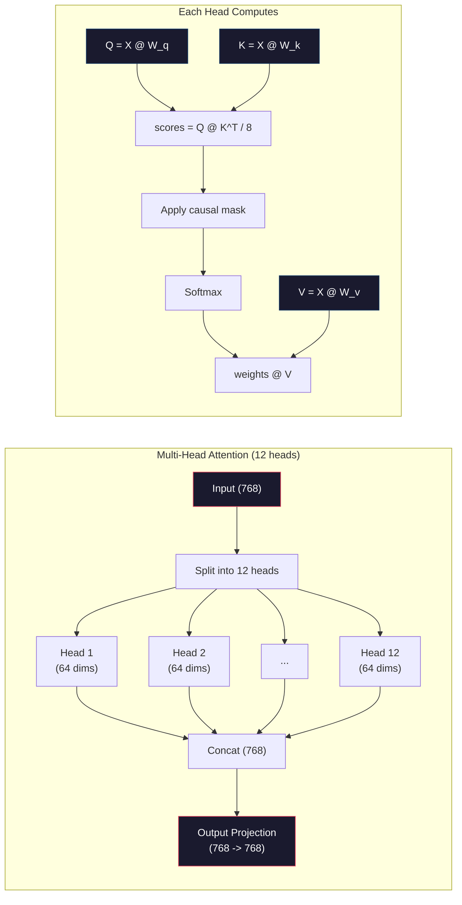
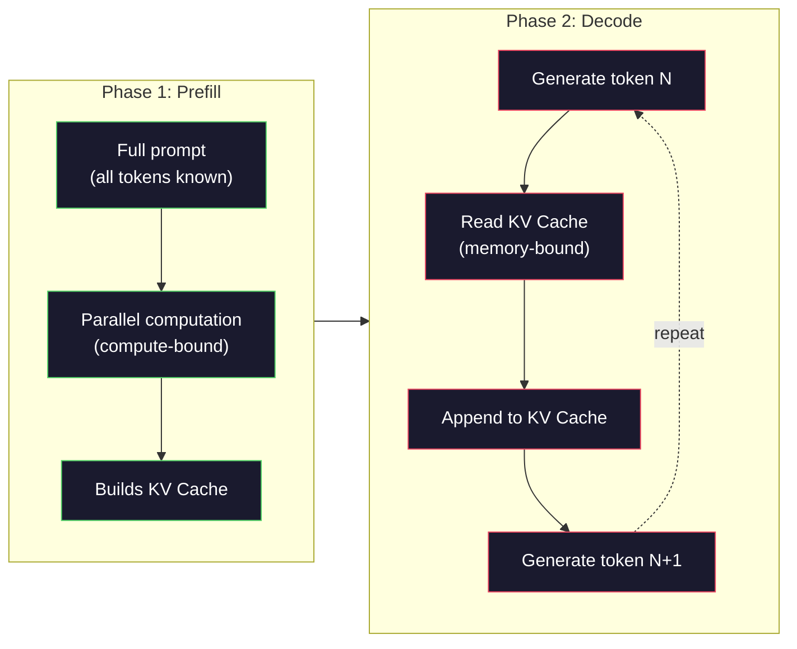

# 预训练小型GPT (124M参数)

> GPT-2 Small有12400万个参数.这就是12个变压器层,12个注意力头,768维嵌入式.你可以从零开始训练它在几小时内.大多数人从来没有这样做.他们使用预训练的检查站.

**Type:** Build
**Languages:** Python (with numpy)
**Prerequisites:** Phase 10, Lessons 01-03 (Tokenizers, Building a Tokenizer, Data Pipelines)
**Time:** ~120 minutes

## 学习目标

- 从零开始实现完整的GPT-2架构 (124M参数):代币嵌入,定位嵌入,变压器块和语言模型头
- 通过使用交叉缩损失下一个代码预测来训练GPT模型在文本体内
- 实现自动降低文字生成,采用温度采样和顶k/topp过
- 监测训练损失曲线,验证模型学习一致的语言模式

## 问题

你知道变压器是什么. 你已经阅读了图表. 你可以说"注意力就是你需要的"并画一个白板上标记的框"多头注意力".

没有什么意味着你明白模型生成文字时会发生什么.

在GPT-2小 (含重量绑定) 中有124,438,272个参数. 每个都通过运行训练循环来设置:前进通过,计算损失,倒退通过,更新权重. 十二个变压器块. 每街区有12个注意力头. 它们是768维的嵌入空间. 词汇总数为50,257个代币. 每次模型生成代币时,所有1.24亿参数都参与一个单一的矩阵乘法链,该链接采用代币ID的序列,并产生了对下一个代币的概率分布.

如果你从未自己构建过这个模型,你就在使用黑盒子.你可以使用API.你可以调整.但是当某种东西发生错误时 - - 当模型幻觉,重复,拒绝遵循指令时 - - 你没有什么心理模型为什么.

这一课构建了GPT-2小从零开始.不是在 PyTorch.在 numpy. 每个矩阵乘法都可见. 每个梯度都由你的代码计算.你会看到12400万个数字如何阴谋预测下一个词.

## 概念

### GPT架构

GPT是一个自动降低语言模型. "自动降低"意味着它一次生成一个代币,每个代币都基于所有之前的代币.

以下是从代币ID到下一个代币概率的完整计算图:

1. 标签 ID 进入. 形状: (批量大小,seq_len).
2. 标志嵌入查找.每个ID映射到768维向量. 形状: (批量大小,seq_len,768).
3. 位置嵌入式查找.每个位置 (0, 1, 2, ...) 映射到768维向量.相同的形状.
4. 添加代币嵌入 + 位置嵌入.
5. 通过12个变压器块.
6. 终极层正常化.
7. 线性投影到词汇尺寸. 形状: (批量尺寸,seq_len,vocacab_size).
8. 软max 得到概率.

没有曲,没有重复,只有嵌入,注意力,传输网络,以及层规范堆了12次.



### 变压器块

12个块中的每块都遵循相同的模式.前标准架构 (GPT-2 使用前标准,而不是后标准像原始变压器):

1. 标准层
2. 多头自律
3. 剩余连接 (添加输入回)
4. 标准层
5. 输送输送网络 (MLP)
6. 剩余连接 (添加输入回)

由于这些变化,在转移过程中,渐变在达到区块1时消失.通过它们,渐变可以直接从损失到任何层通过"跳转"路径流动.这就是为什么你可以堆叠12,32甚至96个区块 (据传GPT-4使用120).

### 注意:核心机制

自我注意让每个代币看看之前的代币,

对于每个代币位置,从输入计算三个向量:
- **Query (Q)**"我在找什么?"
- **Key (K)**"我含有什么?"
- **Value (V)**"我带着什么信息?"

```
Q = input @ W_q    (768 -> 768)
K = input @ W_k    (768 -> 768)
V = input @ W_v    (768 -> 768)

attention_scores = Q @ K^T / sqrt(d_k)
attention_scores = mask(attention_scores)   # causal mask: -inf for future positions
attention_weights = softmax(attention_scores)
output = attention_weights @ V
```

原因面具是使GPT具有自动降低性.第5位置可以关注0-5位置,但不能关注6,7,8等.这可以防止模型在训练期间通过观察未来代币"欺骗".

**Multi-head attention**根据"一头"的定义,一个头可以追踪语法关系 (主体-动词协议).另一个头可以追踪语义相似性 (同义词).另一个头可以追踪位置接近性 (近距离的词).所有12个头的输出都是连锁的,并投射到768个维度.



没有它,点产品会变得更大,使软max 进入渐变率接近零的区域.这是最初的"注意力是你需要的"论文中的关键见解之一.

### 基维缓存:为什么推理是快速的

在训练过程中,你一次处理整个序列.在推断过程中,你一次生成一个代币.没有优化,生成代币N需要重新计算所有N-1前代币的注意力.这就是每生成的代币O(N^2) 或为长度N的序列O(N^3) 总数.

凯维缓存解决了这个问题. 计算每个代币的K和V后,存储它们. 在生成代币N+1时,你只需要计算Q为新代币,并从所有之前的代币中查找缓存的K和V. 这将每代币成本从O(N) 降低到O(1) 对于K和V计算. 关注分数计算仍然是O(N) 因为你关注所有前位置,但你避免输入上的冗余矩阵乘法.

对于12层和12个头的GPT-2,KV缓存存储2 (K + V) x12层 x12头 x64个值 =每代币的18.432值.对于1024代币序列,这在FP32中约为75MB.对于128层的Llama 3 405B,单个序列的KV缓存存量可以超过10GB.这就是为什么长文本推理是内存绑定的原因.

### 预填与解码:两阶段的推理

当你向法学士发送提示时, 推断发生在两个不同的阶段.

**Prefill**处理整个提示符并行.所有代币都已知,所以模型可以同时计算所有位置的注意力.这个阶段是计算的 - - GPU在完成全吞吐量矩阵乘法.对于一个A100上的1000代币提示符,预填需要大约20-50ms.

**Decode**发行一个接一个的代币. 每个新的代币都取决于所有以前的代币. 这一阶段是记忆的 - - 瓶是从GPU记忆中读取模型重量和KV缓存,而不是矩阵数学本身.  GPU 的计算核心大部分都在等待内存读数. 对于GPT-2,每一步解码都需要大约同一个时间,不管木需要多少FLOP,因为内存带宽是限制.

这种区别对于生产系统来说很重要.使用GPU计算预填输量 (更多FLOPS =更快的预填).用存储带宽 (更快的存储器 =更快的解码) 解码输量.这就是为什么NVIDIA的H100专注于提升存储带宽比A100 - 它直接加快代币生成.



### 训练循环

训练一个LLM是下一个代币预测.给定代币 [0, 1, 2, ..., N-1],预测代币 [1, 2, 3, ..., N].损失函数是模型预测概率分布和实际下一个代币之间的交叉透.

一个训练步骤:

1. **Forward pass**通过所有12个区块进行分数,每个位置都获得分数 (前软最大分数).
2. **Compute loss**: 记录和目标代币之间的交叉值 (输入转移到一个位置).
3. **Backward pass**计算所有124M参数的梯度,使用后延.
4. **Optimizer step**基普特-2使用亚当学习速度加热和阴茎衰退.

学习率的时间表比你可能预期的更重要.GPT-2在前2000步的时间里从0升至学习率的最高水平,然后在一个曲线下分解.开始学习率高导致模型的分歧.保持高水平的模式导致后来的训练中振荡.每一个主要的LLM都使用了升温然后衰变模式.

### 简体中文版-2 小号:数字

| Component | Shape | Parameters |
|-----------|-------|------------|
| Token embeddings | (50257, 768) | 38,597,376 |
| Position embeddings | (1024, 768) | 786,432 |
| Per-block attention (W_q, W_k, W_v, W_out) | 4 x (768, 768) | 2,359,296 |
| Per-block FFN (up + down) | (768, 3072) + (3072, 768) | 4,718,592 |
| Per-block LayerNorms (2x) | 2 x 768 x 2 | 3,072 |
| Final LayerNorm | 768 x 2 | 1,536 |
| **Total per block** | | **7,080,960** |
| **Total (12 blocks)** | | **85,054,464 + 39,383,808 = 124,438,272** |

输出投影 (logits头) 与代币嵌入矩阵共享重量. 这称为重量绑定 - 它减少参数数数量38M,提高性能,因为它迫使模型使用相同的表示空间输入和输出.

## 建立它

### 步骤1: 嵌入层

符号嵌入式将每一个可能的50,257个符号映射到768维向量.位置嵌入式添加有关每个符号在序列中的位置的信息.这两个是相结合的.

```python
import numpy as np

class Embedding:
    def __init__(self, vocab_size, embed_dim, max_seq_len):
        self.token_embed = np.random.randn(vocab_size, embed_dim) * 0.02
        self.pos_embed = np.random.randn(max_seq_len, embed_dim) * 0.02

    def forward(self, token_ids):
        seq_len = token_ids.shape[-1]
        tok_emb = self.token_embed[token_ids]
        pos_emb = self.pos_embed[:seq_len]
        return tok_emb + pos_emb
```

开始的0.02标准偏差来自GPT-2论文.太大,初步前进通过产生极端值,破坏了训练的稳定性.太小,初始输出几乎是所有输入相同的,使早期梯度信号无用.

### 步骤2: 用因果面具自卫

原因面具在软max之前将未来位置设置为负无限,确保每个位置只能关注自己和以前的位置.

```python
def attention(Q, K, V, mask=None):
    d_k = Q.shape[-1]
    scores = Q @ K.transpose(0, -1, -2 if Q.ndim == 4 else 1) / np.sqrt(d_k)
    if mask is not None:
        scores = scores + mask
    weights = np.exp(scores - scores.max(axis=-1, keepdims=True))
    weights = weights / weights.sum(axis=-1, keepdims=True)
    return weights @ V
```

软max实现将最大值减去,然后将其减去.如果没有, exp(large_number) 过度流到无限.这是一个数值稳定技巧,不会改变输出,因为软max(x - c) =软max(x) 对任何常数 c.

### 步骤3:多头注意力

根据768维输入的数据,分为12个,每个头有64维度.每个头独立计算注意力.

```python
class MultiHeadAttention:
    def __init__(self, embed_dim, num_heads):
        self.num_heads = num_heads
        self.head_dim = embed_dim // num_heads
        self.W_q = np.random.randn(embed_dim, embed_dim) * 0.02
        self.W_k = np.random.randn(embed_dim, embed_dim) * 0.02
        self.W_v = np.random.randn(embed_dim, embed_dim) * 0.02
        self.W_out = np.random.randn(embed_dim, embed_dim) * 0.02

    def forward(self, x, mask=None):
        batch, seq_len, d = x.shape
        Q = (x @ self.W_q).reshape(batch, seq_len, self.num_heads, self.head_dim).transpose(0, 2, 1, 3)
        K = (x @ self.W_k).reshape(batch, seq_len, self.num_heads, self.head_dim).transpose(0, 2, 1, 3)
        V = (x @ self.W_v).reshape(batch, seq_len, self.num_heads, self.head_dim).transpose(0, 2, 1, 3)

        scores = Q @ K.transpose(0, 1, 3, 2) / np.sqrt(self.head_dim)
        if mask is not None:
            scores = scores + mask
        weights = np.exp(scores - scores.max(axis=-1, keepdims=True))
        weights = weights / weights.sum(axis=-1, keepdims=True)
        attn_out = weights @ V

        attn_out = attn_out.transpose(0, 2, 1, 3).reshape(batch, seq_len, d)
        return attn_out @ self.W_out
```

转型转型转型舞蹈是多头关注最困惑的部分. 这就是发生的事情: (批量,seq_len,768) 数变成 (批量,seq_len,12,64),然后 (批量,12,seq_len,64). 现在,每一个12个头都有一个自己的矩阵 (seq_len, 64) 关注之后,我们逆转了这个过程: (批次,12次,seq_len,64) 变成 (批次,seq_len,12次,64) 变成 (批次,seq_len,768).

### 步骤4:变压器块

一个完整的变压器块:LayerNorm,多头注意力与残余,LayerNorm,向与残余.

```python
class LayerNorm:
    def __init__(self, dim, eps=1e-5):
        self.gamma = np.ones(dim)
        self.beta = np.zeros(dim)
        self.eps = eps

    def forward(self, x):
        mean = x.mean(axis=-1, keepdims=True)
        var = x.var(axis=-1, keepdims=True)
        return self.gamma * (x - mean) / np.sqrt(var + self.eps) + self.beta


class FeedForward:
    def __init__(self, embed_dim, ff_dim):
        self.W1 = np.random.randn(embed_dim, ff_dim) * 0.02
        self.b1 = np.zeros(ff_dim)
        self.W2 = np.random.randn(ff_dim, embed_dim) * 0.02
        self.b2 = np.zeros(embed_dim)

    def forward(self, x):
        h = x @ self.W1 + self.b1
        h = np.maximum(0, h)  # GELU approximation: ReLU for simplicity
        return h @ self.W2 + self.b2


class TransformerBlock:
    def __init__(self, embed_dim, num_heads, ff_dim):
        self.ln1 = LayerNorm(embed_dim)
        self.attn = MultiHeadAttention(embed_dim, num_heads)
        self.ln2 = LayerNorm(embed_dim)
        self.ffn = FeedForward(embed_dim, ff_dim)

    def forward(self, x, mask=None):
        x = x + self.attn.forward(self.ln1.forward(x), mask)
        x = x + self.ffn.forward(self.ln2.forward(x))
        return x
```

传输网络将768维输入扩大到3072维度 (4x),应用非线性,然后将其投射回768. 这种扩展-缩减模式为模型提供了"更广泛"的内部表示,可以在每个位置工作.GPT-2使用GELU激活,但我们在这里使用ReLU为了简单化 - 区别对于理解架构来说是微小的.

### 步骤5:完整的GPT模型

堆12个变压器块,在前面添加嵌入层,后面添加输出投影.

```python
class MiniGPT:
    def __init__(self, vocab_size=50257, embed_dim=768, num_heads=12,
                 num_layers=12, max_seq_len=1024, ff_dim=3072):
        self.embedding = Embedding(vocab_size, embed_dim, max_seq_len)
        self.blocks = [
            TransformerBlock(embed_dim, num_heads, ff_dim)
            for _ in range(num_layers)
        ]
        self.ln_f = LayerNorm(embed_dim)
        self.vocab_size = vocab_size
        self.embed_dim = embed_dim

    def forward(self, token_ids):
        seq_len = token_ids.shape[-1]
        mask = np.triu(np.full((seq_len, seq_len), -1e9), k=1)

        x = self.embedding.forward(token_ids)
        for block in self.blocks:
            x = block.forward(x, mask)
        x = self.ln_f.forward(x)

        logits = x @ self.embedding.token_embed.T
        return logits

    def count_parameters(self):
        total = 0
        total += self.embedding.token_embed.size
        total += self.embedding.pos_embed.size
        for block in self.blocks:
            total += block.attn.W_q.size + block.attn.W_k.size
            total += block.attn.W_v.size + block.attn.W_out.size
            total += block.ffn.W1.size + block.ffn.b1.size
            total += block.ffn.W2.size + block.ffn.b2.size
            total += block.ln1.gamma.size + block.ln1.beta.size
            total += block.ln2.gamma.size + block.ln2.beta.size
        total += self.ln_f.gamma.size + self.ln_f.beta.size
        return total
```

注意重量结合:`logits = x @ self.embedding.token_embed.T`输出投影重复使用代币嵌入矩阵 (转换). 这不仅仅是节省参数的技巧. 这意味着模型使用相同的向量空间来理解代币 (嵌入) 和预测它们 (输出).

### 第六步:训练循环

对于一个真正的训练运行在124M参数,你需要一个GPU和PyTorch.这个训练循环展示了一个小型模型的机械,它运行在纯粹的 numpy.我们使用一个小模型 (4层, 4头, 128 个) 让它可处理.

```python
def cross_entropy_loss(logits, targets):
    batch, seq_len, vocab_size = logits.shape
    logits_flat = logits.reshape(-1, vocab_size)
    targets_flat = targets.reshape(-1)

    max_logits = logits_flat.max(axis=-1, keepdims=True)
    log_softmax = logits_flat - max_logits - np.log(
        np.exp(logits_flat - max_logits).sum(axis=-1, keepdims=True)
    )

    loss = -log_softmax[np.arange(len(targets_flat)), targets_flat].mean()
    return loss


def train_mini_gpt(text, vocab_size=256, embed_dim=128, num_heads=4,
                   num_layers=4, seq_len=64, num_steps=200, lr=3e-4):
    tokens = np.array(list(text.encode("utf-8")[:2048]))
    model = MiniGPT(
        vocab_size=vocab_size, embed_dim=embed_dim, num_heads=num_heads,
        num_layers=num_layers, max_seq_len=seq_len, ff_dim=embed_dim * 4
    )

    print(f"Model parameters: {model.count_parameters():,}")
    print(f"Training tokens: {len(tokens):,}")
    print(f"Config: {num_layers} layers, {num_heads} heads, {embed_dim} dims")
    print()

    for step in range(num_steps):
        start_idx = np.random.randint(0, max(1, len(tokens) - seq_len - 1))
        batch_tokens = tokens[start_idx:start_idx + seq_len + 1]

        input_ids = batch_tokens[:-1].reshape(1, -1)
        target_ids = batch_tokens[1:].reshape(1, -1)

        logits = model.forward(input_ids)
        loss = cross_entropy_loss(logits, target_ids)

        if step % 20 == 0:
            print(f"Step {step:4d} | Loss: {loss:.4f}")

    return model
```

随着训练的进步,损失会下降,因为模型学会预测常见模式: "th"后"t",时间后空间等等.

在生产中,你会使用亚当优化器,加上梯度,学习速度加热,和梯度剪辑.前进-通过-损失-后退更新循环是相同的.优化器更复杂.

### 步骤7: 创建文字

生成使用训练模型以一次预测一个代币.每个预测都是从输出分布中采样 (或贪地用 argmax)

```python
def generate(model, prompt_tokens, max_new_tokens=100, temperature=0.8):
    tokens = list(prompt_tokens)
    seq_len = model.embedding.pos_embed.shape[0]

    for _ in range(max_new_tokens):
        context = np.array(tokens[-seq_len:]).reshape(1, -1)
        logits = model.forward(context)
        next_logits = logits[0, -1, :]

        next_logits = next_logits / temperature
        probs = np.exp(next_logits - next_logits.max())
        probs = probs / probs.sum()

        next_token = np.random.choice(len(probs), p=probs)
        tokens.append(next_token)

    return tokens
```

温度控制随机性.温度1.0使用原始分布.温度0.5加快它 (更确定性 - 模型更频繁地选择其顶级选择).温度1.5平坦化它 (更随机性 - - 低概率的代币获得更大的机会).温度0.0是贪的解码 (总是选择最高概率的代币).

其他`tokens[-seq_len:]`窗口是必要的,因为模型的最大文本长度是1024 GPT-2.一旦你超过了它,你必须放弃最古老的代币.这是每个人都谈论的"文本窗口".

```figure
sampling-decoder
```

## 用它

### 完整的培训和演示

```python
corpus = """The transformer architecture has revolutionized natural language processing.
Attention mechanisms allow the model to focus on relevant parts of the input.
Self-attention computes relationships between all pairs of positions in a sequence.
Multi-head attention splits the representation into multiple subspaces.
Each attention head can learn different types of relationships.
The feedforward network provides nonlinear transformations at each position.
Residual connections enable gradient flow through deep networks.
Layer normalization stabilizes training by normalizing activations.
Position embeddings give the model information about token ordering.
The causal mask ensures autoregressive generation during training.
Pre-training on large text corpora teaches the model general language understanding.
Fine-tuning adapts the pre-trained model to specific downstream tasks."""

model = train_mini_gpt(corpus, num_steps=200)

prompt = list("The transformer".encode("utf-8"))
output_tokens = generate(model, prompt, max_new_tokens=100, temperature=0.8)
generated_text = bytes(output_tokens).decode("utf-8", errors="replace")
print(f"\nGenerated: {generated_text}")
```

在一个小模板的小体积上,生成的文本最好是半一致的. 它将从训练文本中学习一些字节级别的模式,但不能将GPT-2的方法概括为40GB的训练数据和完整的124M参数架构. 问题不是输出质量. 问题是,你可以追踪每一步:嵌入搜索,注意力计算, 输送转换, 逻辑投影,软max, 每个操作都可见.

## 运送它

这一课产生了`outputs/prompt-gpt-architecture-analyzer.md`通过GPT模型的结构选择进行分析,给它提供模型卡或技术报告,

## 运动

1. 修改模型以使用24层和16个头,而不是12/12. 计算参数. 翻倍深度与翻倍宽度 (嵌入维度) 相比如何?

2. 执行GELU激活函数 (GELU(x) = x * 0.5 * (1 + erf(x / sqrt(2)))) 并在输送网络中取代ReLU. 每次激活时进行500步的训练,并比较最终损失.

3. 添加一个KV缓存到生成函数. 存储K和V缩器在第一次前传后,然后再用于后续代币. 测量加快速度:生成200个代币,无论是没有缓存,并比较墙钟时间.

4. 实施顶级k样本 (只考虑k最有可能的代币) 和顶级p样本 (核心样本:考虑积累概率超过p的最小代币集合). 进行0.8温度的输出质量与顶级k=50相比,顶级p=0.95.

5. 建立训练损失曲线计画器.训练模型1000步,图片损失与步骤.确定三个阶段:快速初始下降 (学习普通字节),慢的中期 (学习字节模式) 和平原 (在小体积上加载).无论您正在训练128维模型还是GPT-4.

## 关键词

| Term | What people say | What it actually means |
|------|----------------|----------------------|
| Autoregressive | "It generates one word at a time" | Each output token is conditioned on all previous tokens -- the model predicts P(token_n \| token_0, ..., token_{n-1}) |
| Causal mask | "It can't see the future" | An upper-triangular matrix of -infinity values that prevents attention to future positions during training |
| Multi-head attention | "Multiple attention patterns" | Splitting Q, K, V into parallel heads (e.g., 12 heads of 64 dims each for GPT-2) so each head can learn different relationship types |
| KV Cache | "Caching for speed" | Storing computed Key and Value tensors from previous tokens to avoid redundant computation during autoregressive generation |
| Prefill | "Processing the prompt" | The first inference phase where all prompt tokens are processed in parallel -- compute-bound on GPU FLOPS |
| Decode | "Generating tokens" | The second inference phase where tokens are generated one at a time -- memory-bound on GPU bandwidth |
| Weight tying | "Sharing embeddings" | Using the same matrix for input token embeddings and the output projection head -- saves 38M params in GPT-2 |
| Residual connection | "Skip connection" | Adding the input directly to the output of a sublayer (x + sublayer(x)) -- enables gradient flow in deep networks |
| Layer normalization | "Normalizing activations" | Normalizing across the feature dimension to mean 0 and variance 1, with learnable scale and bias parameters |
| Cross-entropy loss | "How wrong the predictions are" | -log(probability assigned to the correct next token), averaged over all positions -- the standard LLM training objective |

## 进一步阅读

- [Radford et al., 2019 -- "Language Models are Unsupervised Multitask Learners" (GPT-2)](https://cdn.openai.com/better-language-models/language_models_are_unsupervised_multitask_learners.pdf)-- 引入了124M到1.5B参数家族的GPT-2论文
- [Vaswani et al., 2017 -- "Attention Is All You Need"](https://arxiv.org/abs/1706.03762)-- 原始的变压器纸, 具有扩展的点点产品关注和多头关注
- [Llama 3 Technical Report](https://arxiv.org/abs/2407.21783)-- 如何Meta将GPT架构扩展到405B参数,使用16K的GPU
- [Pope et al., 2022 -- "Efficiently Scaling Transformer Inference"](https://arxiv.org/abs/2211.05102)-- 论文正式化了预填与解码和KV缓存分析
