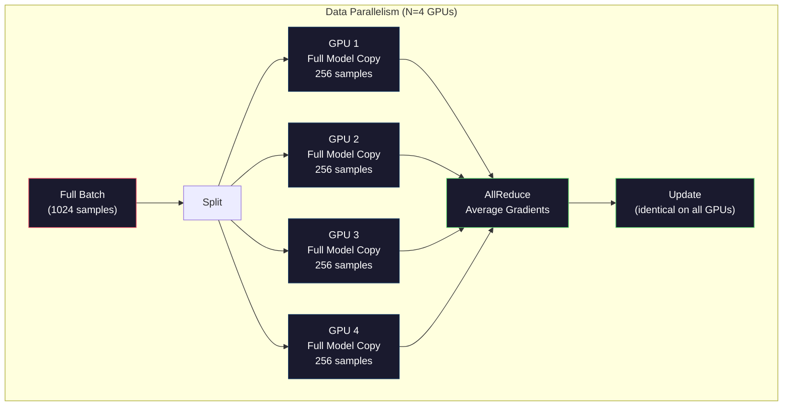
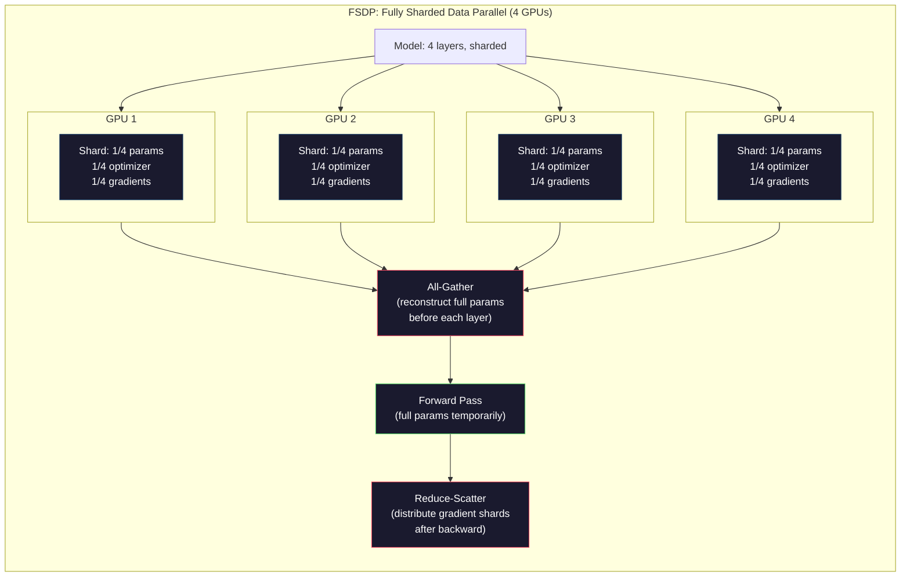
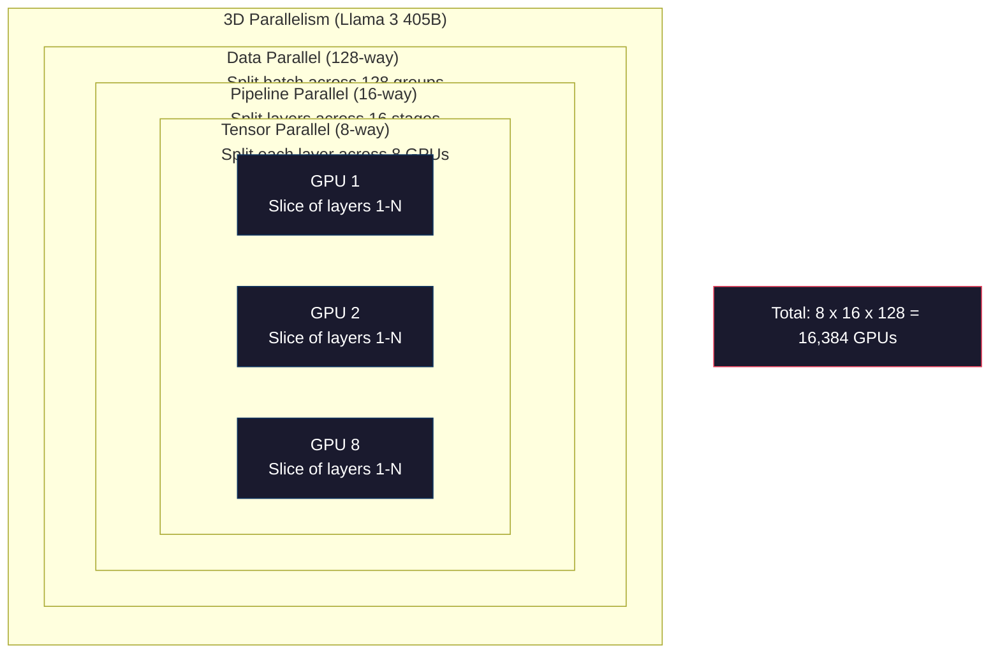

# 规模化:分布式培训,FSDP,深度速度

> 现在试试70亿参数,模型不适合内存,数据需要几周的时间,在单个机器上.分布式训练不是可选的.这是唯一的途径.

**Type:** Build
**Languages:** Python
**Prerequisites:** Phase 10, Lesson 04 (Pre-Training a Mini GPT)
**Time:** ~120 minutes

## 学习目标

- 解释三个类型的平行性 (数据,子,管道) 以及每种类型的必要性,根据模型和集群大小
- 使用 PyTorch DDP 实现数据平行训练,并通过多个GPU进行梯度同步
- 计算给定模型大小的内存预算 (重量+优化状态+梯度+激活) 确定最小硬件
- 配置FSDP或DeepSpeed ZeRO阶段,将模型状态分成GPU和超越单GPU内存的适应模型

## 问题

在FP16中,一个7B参数模型只需要14GB的权重.亚当优化器存储每个参数的两个额外副本 (第一和第二时刻估计).这又是28GB.后延的基梯子增加了14GB.在单次激活之前,您在56GB上存储.

现在,NVIDIA A100的内存是80GB.

消耗的80GB中56GB.这使得激活的数量24GB,在前进传递过程中计算的中间值,必须保持活跃,以便向后传播.在4096维模型中的2048代币序列中,单层激活的数量约为64MB.在32层中,你需要每样本的2GB.

现在试试70B参数. 单独的重量:FP16中的140GB. 不适合一个GPU. 仅仅需要保持重量,至少需要2个A100 (2 x 80GB = 160GB). 添加优化状态和梯度,你需要更多的:3+GPU最小,而实际上8-16取决于碎片策略.

拉马3405B使用了16,384个NVIDIAH100GPU.$100 million in compute. DeepSeek V3 trained a comparable model for roughly $5,6亿通过对建筑 (专家混合意味着每代币只能激活一小部分参数) 和训练效率.

本课程涵盖了使大规模训练成为可能的四种策略:数据平行,子平行,管道平行和完全碎片化的数据平行.

## 概念

### 为什么需要分发

现在我们要做的是记忆模型的数学,每个数字都是计算的,而不是估算的.

| Model | Params | Weights (FP16) | Adam States | Gradients (FP16) | Total (no activations) |
|-------|--------|----------------|-------------|------------------|----------------------|
| GPT-2 Small | 124M | 248 MB | 992 MB | 248 MB | 1.5 GB |
| Llama 3 8B | 8B | 16 GB | 64 GB | 16 GB | 96 GB |
| Llama 3 70B | 70B | 140 GB | 560 GB | 140 GB | 840 GB |
| Llama 3 405B | 405B | 810 GB | 3,240 GB | 810 GB | 4,860 GB |

亚当状态列是杀手.亚当为每个参数存储运行平均值 (m) 和运行变量 (v).对于70B模型,这为70B x 4字节 x 2 = 560GB.

一个H100拥有80GB.Llama 3 405B需要至少61个H100来控制权重,优化器和梯度.加上激活,数量会进一步增加.Meta使用了16384个GPU,不是因为他们想要,因为他们必须.

### 数据平行

简单的分布式策略.将整个模型复制成NGPU.将每个训练批量分为N等部分.每个GPU在数据片段上运行前后传递.后传递后,平均所有GPU的梯度.每个GPU更新其重量副本,保持所有副本的同步.

**The good:**线性吞吐量扩展.NGPU每步处理N倍的数据.通信仅限于梯度平均值,它与计算重叠.

**The bad:**每个GPU都包含模型的完整副本,优化状态和梯度.对于70B模型,每个GPU需要840GB.数据平行化没有任何作用,以减少每GPU内存.它只减少了训练时间.

**The math:**有效批量大小 = per_gpu_batch_size x N.对于每GPU批量为16个GPU的N=64GPU,有效批量为1,024. Llama 3使用了每步的有效批量大小为1600万代币.



### 度平行

分开 GPU 之间单个层次.单个矩阵乘法被分为 GPU 之间,每个计算结果的部分.

考虑一个重量矩阵 (8192,8192) 在一个输送前进层.通过4个方向的子平行性,每个GPU都保持一个 (8192,2048) 片段.每个GPU乘以其片段输入,产生部分结果.部分结果被结合 (通过全部减小或全部收集) 来产生全部输出.

**The good:**减少模型重量的每GPU内存. 70B模型分为8个GPU,意味着每个GPU都具有8.75B参数的重量.

**The bad:**每层后都需要快速的GPU间通信.每层后的全减后每 matmul增加延迟.这与NVLink (900GB/s在同一节点的GPU之间) 运作良好,但通过InfiniBand (400GB/s,约50GB/s) 连接的节点之间不太好.紧张平行几乎总是局限于单个节点 (8GPU) 内.

**Real usage:**梅加特龙-LM是子平行论的先驱.Llama 3 405B使用每个节点内的8个方向子平行论.

### 管道平行

按层次分类模型.GPU 1运行层次1-8.GPU 2运行层次9-16.GPU 3运行层次17-24.GPU 4运行层次25-32.数据通过管道流动:GPU 1计算其层次,并发送激活到GPU 2,该层次计算并发送到GPU 3,等.

**The good:** GPU 之间的通信最小,只是在层边界的激活,这些激活与梯度或重量相比较小.

**The bad:**管道泡.当GPU4计算了微批次1的前进传递时,GPU1,2和3是空置的 (它们已经转发了部分).在后进传递时,模式反转.在天真的管道线下,GPU的使用率为N管道阶段的1/N.

**GPipe and PipeDream**通过分批量为微批量来解决泡问题.GPU 1 在转发微批量完成后就开始在微批量 2 上启动.这在管道阶段之间进行计算重叠.在M微批量和N阶段时,泡分数降至 (N-1) /M.使用M=16个微批量,N=4个阶段,泡为3/16=18.75%的空置时间.

### FSDP:完全分碎的数据并行

FSDP 结合数据平行化的扩展性和碎片化的内存效率.而不是每个GPU都持有模型的完整副本,每个GPU只持有1/N的参数,梯度和优化状态.

在一个层向前传递之前,FSDP运行一个**all-gather**后续传输后,每个GPU都会丢弃非本地参数.在倒退期间,全集再次运行,以重建梯度计算参数.**reduce-scatter**它们只存储1 N的梯度.

**The math for a 70B model on 8 GPUs:**

| Component | Without FSDP | With FSDP |
|-----------|-------------|-----------|
| Weights (FP16) | 140 GB per GPU | 17.5 GB per GPU |
| Adam States (FP32) | 560 GB per GPU | 70 GB per GPU |
| Gradients (FP16) | 140 GB per GPU | 17.5 GB per GPU |
| **Total** | **840 GB per GPU** | **105 GB per GPU** |

没有FSDP,你不能安装70B模型在一个80GB的GPU上.在8GB的GPU上,FSDP每个GPU使用105GB - 等,这仍然不合适.你需要至少16个GPU以达到80GB以下的GPU,或者你将FSDP与激活检查组合在一起 (反向的激活度重新计算,而不是存储它们).

由于每个层前的全部收集,通信成本比尼拉数据平行性更高.



### 极速飞行器

根据概念,DeepSpeed的Zero Redundancy Optimizer与FSDP相同,但由微软独立开发.它定义了三个阶段,每个阶段更积极地分化:

| Stage | Shards | Memory Savings | Communication |
|-------|--------|---------------|---------------|
| ZeRO-1 | Optimizer states only | ~4x reduction | Same as data parallel |
| ZeRO-2 | + Gradients | ~8x reduction | Slightly more |
| ZeRO-3 | + Parameters | ~Nx reduction (N GPUs) | All-gather per layer |

泽罗-3与FSDP相当.名称不同,机制相同.PyTorch在DeepSpeed证明了这个概念后,添加了FSDP作为本土实现.

速也引入了ZERO-Offload (对CPU RAM进行卸载优化状态,这是更便宜和更大的) 和ZERO-Infinity (对NVMe SSD进行卸载).这些交易计算速度用于内存容量 - - 卸载操作更慢,但释放了GPU内存.

### 混合精准训练

现代训练同时使用多种浮点格式:

- **Forward pass**子在子核上运行速度是两倍.
- **Master weights**: FP32 (32位). 在重量更新期间,优化器保持数值精度.
- **Loss scaling**乘以后向前一个大常数,以防止FP16梯度下流到零. 在优化步骤前乘以相同的常数.

BF16 (Brain Float 16) 与 FP32 (8个指数位) 的指数范围相同,但精度降低 (7个 mantissa 位与 FP32 的23).它很少需要损失扩展,因为它可以代表相同的值范围. FP16 有5个指数位和10个 mantissa 位 - 它可以代表细粒度的值,但在极端大小下流过/下流.

谷歌的TPU使用BF16本土.NVIDIA的A100和H100支持FP16和BF16.该行业已大大转向BF16,因为它消除了损失缩小头痛.

**Memory comparison for a 7B model:**

| Precision | Weights | Optimizer | Gradients | Total |
|-----------|---------|-----------|-----------|-------|
| FP32 everywhere | 28 GB | 56 GB | 28 GB | 112 GB |
| Mixed (BF16 + FP32 master) | 14 GB | 56 GB | 14 GB | 84 GB |

混合精度节省了28GB的存储量. 优化器状态不管是32FP,这是大部分内存的位置.

### 光电和3D平行

实际的大规模培训结合了三个平行:

- **Data parallelism**通过节点组 (批量规模)
- **Tensor parallelism**在一个节点内 (分开8个GPU的层)
- **Pipeline parallelism**通过节点 (在机器之间分层组)

拉马3405B在16384辆H100上:
- 每个节点内的8个向子平行性 (8个GPU每个节点)
- 节点间16个路管道平行性 (16个管道阶段)
- 剩余维度的128个方向数据平行 (16,384 / 8 / 16 = 128)

这种3D分解 (8 x 16 x 128 = 16,384) 是你如何扩展到数千个GPU.每个GPU看到不同的数据片段 (数据平行),保持每个层的一片 (ensor平行),并计算不同的层集 (管道平行).

它们的专家组合架构每代币只激活了671B参数中的37B.这意味着每个GPU只需要计算 (并存储激活) 活跃参数. 他们训练了2,048个H800GPU - 比Meta的GPU数量少于1/8 -$5.6M vs Meta's estimated $百米.



```figure
paged-kv-cache
```

## 建立它

### 步骤1:模拟数据平行

按图像组分成模拟GPU.每个GPU计算其碎片的前进传输.平均"梯度" (我们模拟它们为损失值).

```python
import numpy as np

def simulate_data_parallelism(data, num_gpus, model_fn):
    batch_size = len(data)
    shard_size = batch_size // num_gpus
    remainder = batch_size % num_gpus

    gpu_losses = []
    gpu_gradients = []

    offset = 0
    for gpu_id in range(num_gpus):
        extra = 1 if gpu_id < remainder else 0
        shard = data[offset:offset + shard_size + extra]
        offset += shard_size + extra

        loss, grad = model_fn(shard)
        gpu_losses.append(loss)
        gpu_gradients.append(grad)

    avg_loss = np.mean(gpu_losses)
    avg_gradient = np.mean(gpu_gradients, axis=0)

    return avg_loss, avg_gradient
```

完全降低操作 (平均梯度) 是数据平行性唯一的通信. 在实践中,这使用了NVIDIA GPU上的NCCL库,该系统实现了环全减:每个 GPU 将1/N的梯度发送给邻居,从另一个邻居接收1/N,并在N-1步骤后每个 GPU 得到了完整的平均值. 通信总体: 2 x gradient_size x (N-1)/N,接近大 N 的 gradient 尺寸的 2x

### 步骤 2:模拟度平行

每个GPU计算一个部分矩阵乘法. 结合结果.

```python
def simulate_tensor_parallelism(input_data, weight_matrix, num_gpus):
    d_in, d_out = weight_matrix.shape
    assert d_out % num_gpus == 0, f"d_out {d_out} not divisible by num_gpus {num_gpus}"
    shard_size = d_out // num_gpus

    partial_results = []
    for gpu_id in range(num_gpus):
        start = gpu_id * shard_size
        end = start + shard_size
        weight_shard = weight_matrix[:, start:end]

        partial = input_data @ weight_shard
        partial_results.append(partial)

    full_output = np.concatenate(partial_results, axis=-1)

    direct_output = input_data @ weight_matrix
    error = np.abs(full_output - direct_output).max()

    return full_output, error
```

错误应该是完全零 (或机器的epsilon).电压平行是数学上精确的 - 它产生与计算一个GPU上的全matmul相同的结果. 分裂沿着输出维度,所以每个GPU产生不同的列,和连锁重建完整的结果.

在一个变压器 FFN 中,第一个线性 (扩展) 使用列式并行,第二个线性 (合同) 使用列式并行. 这避免了两层之间的全部减少.

### 步骤3:模拟管道平行

显示泡问题,早期阶段停留在空中,而后期阶段计算.

```python
def simulate_pipeline_parallelism(num_layers, num_stages, num_microbatches):
    layers_per_stage = num_layers // num_stages

    timeline = {}
    clock = 0

    for mb in range(num_microbatches):
        for stage in range(num_stages):
            start_time = max(
                timeline.get((stage, mb - 1, "fwd"), (0, 0))[1] if mb > 0 else 0,
                timeline.get((stage - 1, mb, "fwd"), (0, 0))[1] if stage > 0 else 0,
            )
            end_time = start_time + layers_per_stage
            timeline[(stage, mb, "fwd")] = (start_time, end_time)

    last_fwd_end = max(v[1] for v in timeline.values())

    for mb in range(num_microbatches - 1, -1, -1):
        for stage in range(num_stages - 1, -1, -1):
            deps = [last_fwd_end]
            if mb < num_microbatches - 1 and (stage, mb + 1, "bwd") in timeline:
                deps.append(timeline[(stage, mb + 1, "bwd")][1])
            if stage < num_stages - 1 and (stage + 1, mb, "bwd") in timeline:
                deps.append(timeline[(stage + 1, mb, "bwd")][1])
            start_time = max(deps)
            end_time = start_time + layers_per_stage
            timeline[(stage, mb, "bwd")] = (start_time, end_time)

    total_time = max(v[1] for v in timeline.values())
    compute_time = num_microbatches * num_stages * layers_per_stage * 2
    bubble_fraction = 1.0 - compute_time / (total_time * num_stages)

    return timeline, total_time, bubble_fraction
```

通过4个阶段和1个微批,泡分数为75% - - 每四个GPU中的三个在任何时候都会置. 16个微批,它会下降到19%.消除泡的成本是内存:你必须同时存储所有飞行中的微批的激活.

### 步骤4: 记忆计算器

计算训练任何模型尺寸的精确的内存需求.

```python
def memory_calculator(
    params_billions,
    precision_bytes=2,
    optimizer="adam",
    num_gpus=1,
    sharding="none",
    sequence_length=2048,
    batch_size_per_gpu=1,
    hidden_dim=None,
    num_layers=None,
):
    params = params_billions * 1e9

    weight_memory = params * precision_bytes

    if optimizer == "adam":
        optimizer_memory = params * 4 * 2
    elif optimizer == "sgd":
        optimizer_memory = params * 4
    else:
        optimizer_memory = 0

    gradient_memory = params * precision_bytes

    total_no_activation = weight_memory + optimizer_memory + gradient_memory

    if hidden_dim and num_layers:
        activation_per_layer = (
            sequence_length * batch_size_per_gpu * hidden_dim * precision_bytes * 4
        )
        activation_memory = activation_per_layer * num_layers
    else:
        activation_memory = params * precision_bytes * 0.5

    if sharding == "fsdp" or sharding == "zero3":
        weight_memory /= num_gpus
        optimizer_memory /= num_gpus
        gradient_memory /= num_gpus
    elif sharding == "zero2":
        optimizer_memory /= num_gpus
        gradient_memory /= num_gpus
    elif sharding == "zero1":
        optimizer_memory /= num_gpus

    per_gpu_total = weight_memory + optimizer_memory + gradient_memory + activation_memory

    return {
        "params_billions": params_billions,
        "weights_gb": weight_memory / 1e9,
        "optimizer_gb": optimizer_memory / 1e9,
        "gradients_gb": gradient_memory / 1e9,
        "activations_gb": activation_memory / 1e9,
        "per_gpu_total_gb": per_gpu_total / 1e9,
        "total_across_gpus_gb": per_gpu_total * num_gpus / 1e9,
        "fits_on_80gb": per_gpu_total / 1e9 <= 80,
        "num_gpus": num_gpus,
        "sharding": sharding,
    }
```

这台计算器回答了每一个ML工程师问的问题:"我需要多少GPU?"给它提供模型大小,看看它是否适合. juste 分片策略直到每GPU总量下降到80GB以下.

### 步骤5:混合精密模拟

进行FP32,FP16和混合精度训练之间的内存使用比较.

```python
def mixed_precision_comparison(params_billions):
    params = params_billions * 1e9

    fp32_weights = params * 4
    fp32_optimizer = params * 4 * 2
    fp32_gradients = params * 4
    fp32_total = fp32_weights + fp32_optimizer + fp32_gradients

    fp16_weights = params * 2
    fp16_master = params * 4
    fp16_optimizer = params * 4 * 2
    fp16_gradients = params * 2
    fp16_total = fp16_weights + fp16_master + fp16_optimizer + fp16_gradients

    mixed_weights = params * 2
    mixed_optimizer = params * 4 * 2
    mixed_gradients = params * 2
    mixed_total = mixed_weights + mixed_optimizer + mixed_gradients

    return {
        "fp32_total_gb": fp32_total / 1e9,
        "fp16_with_master_gb": fp16_total / 1e9,
        "mixed_bf16_gb": mixed_total / 1e9,
        "savings_vs_fp32": 1 - mixed_total / fp32_total,
    }
```

对于大多数人来说,最大的惊喜是:混合精度不会减半内存.优化器状态 (亚当的m和v) 无论精度如何都保持在FP32.对于7B模型,FP32训练使用112GB.混合精度使用84GB.这意味着25%的减少,而不是50%.优化器占主导地位.

## 用它

### 运行所有模拟

```python
def run_all_demos():
    print("=" * 70)
    print("DATA PARALLELISM SIMULATION")
    print("=" * 70)

    np.random.seed(42)
    data = np.random.randn(64, 32)
    weight = np.random.randn(32, 16)

    def model_fn(batch):
        output = batch @ weight
        loss = np.mean(output ** 2)
        grad = 2 * batch.T @ (batch @ weight) / len(batch)
        return loss, grad

    for n_gpus in [1, 2, 4, 8]:
        loss, grad = simulate_data_parallelism(data, n_gpus, model_fn)
        print(f"  {n_gpus} GPUs: loss={loss:.4f}, grad_norm={np.linalg.norm(grad):.4f}")

    print()
    print("=" * 70)
    print("TENSOR PARALLELISM SIMULATION")
    print("=" * 70)

    x = np.random.randn(4, 8192)
    W = np.random.randn(8192, 8192)

    for n_gpus in [1, 2, 4, 8]:
        output, error = simulate_tensor_parallelism(x, W, n_gpus)
        print(f"  {n_gpus} GPUs: output_shape={output.shape}, max_error={error:.2e}")

    print()
    print("=" * 70)
    print("PIPELINE PARALLELISM SIMULATION")
    print("=" * 70)

    for n_mb in [1, 4, 8, 16, 32]:
        _, total_t, bubble = simulate_pipeline_parallelism(32, 4, n_mb)
        print(f"  {n_mb:2d} micro-batches: total_time={total_t:4d}, bubble={bubble:.1%}")

    print()
    print("=" * 70)
    print("MEMORY CALCULATOR")
    print("=" * 70)

    configs = [
        (7, "none", 1),
        (7, "fsdp", 8),
        (70, "none", 1),
        (70, "fsdp", 8),
        (70, "fsdp", 16),
        (405, "fsdp", 64),
        (405, "fsdp", 128),
    ]

    print(f"  {'Model':>8} {'Sharding':>8} {'GPUs':>5} {'Per-GPU':>10} {'Fits 80GB':>10}")
    print("  " + "-" * 50)
    for params, shard, gpus in configs:
        result = memory_calculator(params, num_gpus=gpus, sharding=shard)
        fits = "Yes" if result["fits_on_80gb"] else "No"
        print(f"  {params:>6}B {shard:>8} {gpus:>5} {result['per_gpu_total_gb']:>8.1f}GB {fits:>10}")

    print()
    print("=" * 70)
    print("MIXED PRECISION COMPARISON")
    print("=" * 70)

    for params_b in [7, 13, 70, 405]:
        result = mixed_precision_comparison(params_b)
        print(f"  {params_b}B: FP32={result['fp32_total_gb']:.0f}GB, "
              f"Mixed BF16={result['mixed_bf16_gb']:.0f}GB, "
              f"Savings={result['savings_vs_fp32']:.0%}")
```

## 运送它

这一课产生了`outputs/prompt-distributed-training-planner.md`-- 提示需要模型尺寸和可用的硬件,然后生成一个完整的分布式培训计划:平行战略,内存预算,通信总费和预期吞吐量.

## 运动

1. 修改记忆计算器,以包括激活检查点. 检查点,只在每个K-th层 (典型的K=1,这意味着重新计算所有) 上存活点. 显示记忆-计算的权衡:检查点节省多少记忆,并且它会减慢训练的速度 (大约33%更多的计算为完整的检查点)?

2. 扩展管道平行模拟,实现PipeDream使用的1F1B (一向前,一向后) 时间表.将泡分数与4个阶段和8个微批的天真时间表进行比较. 1F1B时间表应该具有较小的峰值内存,因为它更早开始向后传递.

3. 实现梯度积累模拟器.在每个微批次之后,不要把梯度全部减少,而是把梯度集中在K步骤中,然后把梯度全部减少.

4. 根据模型大小,目标代币数量,GPU类型 (A100在 $2/hr, H100 at $根据已知成本的验证:据报道,Llama 3 405B 成本~$100M, DeepSeek V3 cost ~$五,六米.

5. 加入ZERO-Offload到内存计算器.假设CPU RAM为每节点512GB,NVMe为2TB. 显示如何将优化器卸载到CPU允许70B模型在16个 GPU的时间里训练4个 GPU,而不是30-50%慢的优化器步骤.

## 关键词

| Term | What people say | What it actually means |
|------|----------------|----------------------|
| Data parallelism | "Copy the model to every GPU" | Each GPU processes a different data shard; gradients are averaged via all-reduce after each step |
| Tensor parallelism | "Split a layer across GPUs" | Partition weight matrices so each GPU computes part of the matmul; requires fast NVLink interconnect |
| Pipeline parallelism | "Split layers across GPUs" | Each GPU runs a different group of layers; data flows through the pipeline with micro-batches to reduce bubbles |
| FSDP | "Shard everything" | Fully Sharded Data Parallel -- each GPU holds 1/N of weights, gradients, and optimizer states; all-gather before compute |
| ZeRO | "DeepSpeed's version of FSDP" | Zero Redundancy Optimizer with 3 stages: shard optimizer (Stage 1), + gradients (Stage 2), + parameters (Stage 3) |
| All-reduce | "Average across GPUs" | Collective operation where every GPU ends with the sum (or average) of all GPUs' inputs -- typically implemented as ring all-reduce |
| All-gather | "Collect from all GPUs" | Collective operation where every GPU ends with the concatenation of all GPUs' data -- used in FSDP to reconstruct full parameters |
| Reduce-scatter | "Sum and distribute" | Collective operation that reduces (sums) data and scatters different chunks to different GPUs -- used in FSDP for gradient sharding |
| Mixed precision | "Train in half precision" | Use FP16/BF16 for forward/backward and FP32 for optimizer states -- saves ~25% memory, not 50%, because the optimizer dominates |
| Pipeline bubble | "Idle time in the pipeline" | Fraction of time GPUs sit idle waiting for data from the previous stage -- reduced by using more micro-batches |

## 进一步阅读

- [Rajbhandari et al., 2020 -- "ZeRO: Memory Optimizations Toward Training Trillion Parameter Models"](https://arxiv.org/abs/1910.02054)根据深度速度的Zero论文,
- [Shoeybi et al., 2020 -- "Megatron-LM: Training Multi-Billion Parameter Language Models Using Model Parallelism"](https://arxiv.org/abs/1909.08053)对于转变器的NVIDIA的子平行性
- [Narayanan et al., 2021 -- "Efficient Large-Scale Language Model Training on GPU Clusters Using Megatron-LM"](https://arxiv.org/abs/2104.04473)-- 3D平行结合数据,子和管道
- [Zhao et al., 2023 -- "PyTorch FSDP: Experiences on Scaling Fully Sharded Data Parallel"](https://arxiv.org/abs/2304.11277)-- PyTorch 的本地FSDP实现
- [Llama 3 Technical Report](https://arxiv.org/abs/2407.21783)-- 16,384个GPU训练, 3D平行细节
- [DeepSeek-V3 Technical Report](https://arxiv.org/abs/2412.19437)-- 如何使MoE架构降低培训成本
