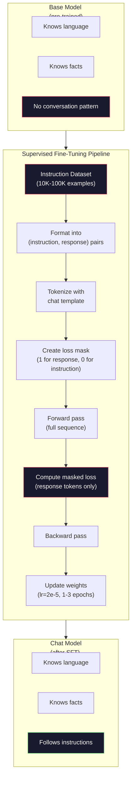

# 指示调整 (SFT)

> 基本模型预测下一个代币.就这样了.它不遵循说明,不回答问题,也不拒绝有害请求.SFT是代币预测器和有用的助理之间的桥梁.你曾经交谈过的每个模型 - - 克劳德,GPT,Llama Chat - - 都经历了这个步骤.

**Type:** Build
**Languages:** Python (with numpy)
**Prerequisites:** Phase 10, Lesson 04 (Pre-Training a Mini GPT)
**Time:** ~90 minutes

## 学习目标

- 实施监督细节调整 (SFT),将基语言模型转换为遵循指令的助理
- 使用系统,用户和助理角色的聊天模板格式化训练数据,以及非助理代币的面具损失
- 解释为什么SFT是必要的:基本模型继续文字而不是回答问题
- 通过对待持久的指令组的基模型与精细调节的模型响应进行评估,评估SFT质量

## 问题

它们可以预测下一个代币给给给的序列. 给它"变压器架构"并可能继续"已经彻底改变了自然语言处理". 这对下一个代币预测器来说是令人印象深刻的.

现在试试一下:给它提供"法国的首都是什么?"一个基本模型没有回答"巴黎". 德国的首都是什么? 因为它从包含问题列表的文件中学到. 或许它会产生"很多人问的问题",因为这是一个可信的下一个标志的延续. 模型没有"答案"的概念. 它只知道"继续".

这就是GPT-3 (基本模型,2020年6月发布) 和ChatGPT (指令调整,2022年11月发布) 之间的差距.相同的架构.相同的预训练.差异是20,000至100,000个精心设计的 (指令,反应) 双子,教导模型遵循对话模式.

斯坦福阿尔帕卡证明你不需要数百万个例子. 在2023年3月,他们调整了Llama 7B仅在GPT-3.5生成的52,000个指示响应对.$600. The result was a chatbot that could follow instructions, answer questions, and hold conversations. Not as good as ChatGPT, but shockingly close for $六百个和几个小时的训练.

基因分析系统的基础知识是: 质量比数量更重要. 熟练的注释者写的27,000个例子超过了从互联网上剪除的100万个噪音例子.

## 概念

### 实际上SFT所做的事情

监督精细调节从训练前开始继续进行相同的训练循环 - - 进步,计算损失,倒退,更新权重 - - 但用不同的数据.

```json
{
  "system": "You are a helpful assistant.",
  "user": "What is the capital of France?",
  "assistant": "The capital of France is Paris."
}
```

模型已经知道巴黎是法国的首都.它在维基百科,教科书和网页上预训练中学到了这一点.SFT不教模型新的事实.它教模型一个新的 *行为*:当你看到一个问题,产生答案.当你看到一个指示,产生完成.当你看到一个有害的请求,产生拒绝.

预训练给模型知识,SFT给模型礼仪.

### 数据格式

现在,我们在这个行业中,有三种格式. 每个格式都编码相同的信息,

**Alpaca Format**美国政府的要求

```json
{
  "instruction": "Summarize the following article in 3 sentences.",
  "input": "The European Central Bank raised interest rates...",
  "output": "The ECB increased rates by 25 basis points..."
}
```

简单且广泛使用.`input`斯坦福发布了52,000个例子,由GPT-3.5为600美元. 这启动了开源命令调整运动.

**ShareGPT Format**(共同体,2023年):

```json
{
  "conversations": [
    {"from": "system", "value": "You are a helpful assistant."},
    {"from": "human", "value": "What causes tides?"},
    {"from": "gpt", "value": "Tides are caused by the gravitational pull of the Moon..."},
    {"from": "human", "value": "How often do they occur?"},
    {"from": "gpt", "value": "Most coastal areas experience two high tides and two low tides per day..."}
  ]
}
```

支持多转交谈. "from" 字段使用"human"和"gpt"按照规则,不管实际模型.Vicuna在使用者共享的ChatGPT转录中从70,000个ShareGPT对话中训练.

**ChatML Format**(OpenAI,许多开源模型使用):

```
<|im_start|>system
You are a helpful assistant.<|im_end|>
<|im_start|>user
What is the capital of France?<|im_end|>
<|im_start|>assistant
The capital of France is Paris.<|im_end|>
```

使用特殊代币 (`<|im_start|>`现在`<|im_end|>`文,等许多其他模型使用ChatML. 文和文的代码是通过文和文的代码来定义角色.

所有三个格式都能做到同样的:它们告诉模型"这是指令,这是反应,学习这个模式".

### 为什么它能有效

模型已经从训练前就知道语言. 它已经看到数十亿个问题,然后得到答案,然后得到说明,然后完成,以及人们之间的对话.

基于这种潜伏能力,SFT 专注于这种潜伏能力.而不是模型需要从文本中弄清楚是否应回答问题或继续文件,SFT 则明确地训练在对话模式上.经过几千个例子,模型学会了:当你看到助理角色标记时,产生有用的反应.

这就是为什么27000个例子足够的.你不教导模型英语.你不教导模型英语.你不教导模型英语.你不教导模型英语.你教导模型英语.

### 隐藏的损失

对于SFT来说,这是最重要的技术细节,

在预训练期间,你计算每个代币的损失.模型学习在序列中预测每一个下一个代币.在SFT期间,你只计算在 *响应*代币上的损失.指令代币是为了文本,但模型不会因为"预测"它们错误而受到惩罚.

为什么?因为你不想模型学会*生成*指示.你想它学会*响应*指示.如果你计算了指示代币的损失,你正在训练模型预测"法国的首都是什么?"就好像是问这个问题的人.这浪费了梯度信号,可以让模型困惑于它的作用.

实际上,你创建一个损失面具: 1用于响应代币, 0用于指示代币.

```
Tokens:    [SYS] You are helpful [USER] What is the capital? [ASST] Paris is the capital [EOS]
Loss mask:   0    0    0     0      0     0   0  0     0       1     1    1   1     1      1
```

只有之后的代币`[ASST]`模型在前进传递过程中看到整个对话 (它需要指示才能产生正确的反应),但仅根据预测反应的程度更新其权重.

### 训练超参数

对于训练前的超值,SFT使用了非常不同的超值.你不是从头开始训练,而是调整已经运行的模型.

| Parameter | Pre-Training (Llama 2 7B) | SFT (Llama 2 Chat) |
|-----------|---------------------------|---------------------|
| Learning rate | 3e-4 (peak) | 2e-5 |
| Epochs | 1 (single pass over data) | 2 |
| Batch size | 4M tokens | 64 examples |
| Warmup steps | 2,000 | 0-100 |
| Weight decay | 0.1 | 0.0-0.1 |
| Data size | 2T tokens | 27,000 examples |

对于SFT来说,学习率是15倍低的.这是关键的.细调过程中学习率高,破坏了预训练知识.模型"忘记"所学到的东西,并过度进入小细调数据集.这是灾难性的忘记.

两个时代意味着模型看到每个训练示例两次. 在一个小数据集上,超过3个时代导致记忆 -- 模型开始将训练示例复制成文字,而不是概括.

### 遗忘是灾难性的

调整细节可以破坏一般能力.训练太长时间使用指令后的数据,模型就会失去编码,数学或创意文本的能力.它变得非常擅长其训练数据的特定格式,而其他一切都很糟糕.

减轻三种情况:

1. **Low learning rate.**更新更小意味着减少了预先训练的功能破坏.

2. **Short training.**在模型过之前停止.

3. **Mix in pre-training data.**拉马2聊天将少量的原始预训数据 (2-5%) 混合到SFT数据集中.这在学习新的指示后行为时"提醒"其一般能力模型.

### 真实数字

在一个NVIDIA A100 80GB GPU上,需要大约1小时来调整7B模型,

- 平均数量为1万个例子 × 512个代币 = 5,12M个代币
- 两个时期 = 总共1024万个代币
- 对于7B型号细调的A100输出量: ~3,000个代币/秒
- 时间: 时间:

对于我们的小GPT (4层, 128个),训练几乎是即时的.



```figure
loss-masking
```

## 建立它

### 步骤1:指令数据集

在生产过程中,像Scale AI和Anthropic这样的公司使用人类注释器来编写这些.我们将编程创建它们,以展示格式.

```python
import numpy as np

INSTRUCTION_DATA = [
    {
        "instruction": "What is the capital of France?",
        "response": "The capital of France is Paris."
    },
    {
        "instruction": "Explain gravity in one sentence.",
        "response": "Gravity is the force that attracts objects with mass toward each other."
    },
    {
        "instruction": "Write a haiku about the ocean.",
        "response": "Waves crash on the shore, salt and foam beneath the sun, endless blue expanse."
    },
    {
        "instruction": "What is 15 multiplied by 7?",
        "response": "15 multiplied by 7 is 105."
    },
    {
        "instruction": "Name three programming languages.",
        "response": "Three programming languages are Python, Rust, and TypeScript."
    },
    {
        "instruction": "Summarize photosynthesis.",
        "response": "Photosynthesis converts sunlight, water, and carbon dioxide into glucose and oxygen."
    },
    {
        "instruction": "What year did World War II end?",
        "response": "World War II ended in 1945."
    },
    {
        "instruction": "Define machine learning.",
        "response": "Machine learning is a field where algorithms learn patterns from data to make predictions."
    },
]
```

斯坦福阿尔帕卡使用了52,000个,但无论你有8个还是52,000个,都是一样的:代币化,面具化,仅仅在响应上计算损失.

### 步骤2:使用聊天模板标记

将命令-响应对转换为用特殊角色标记的符号序列.标记告诉模型命令结束和响应开始的地方.

```python
SPECIAL_TOKENS = {
    "INST_START": 253,
    "INST_END": 254,
    "RESP_START": 255,
}


def tokenize_instruction_pair(instruction, response, vocab_size=256):
    inst_tokens = list(instruction.encode("utf-8"))
    resp_tokens = list(response.encode("utf-8"))

    inst_tokens = [min(t, vocab_size - 4) for t in inst_tokens]
    resp_tokens = [min(t, vocab_size - 4) for t in resp_tokens]

    tokens = (
        [SPECIAL_TOKENS["INST_START"]]
        + inst_tokens
        + [SPECIAL_TOKENS["INST_END"]]
        + [SPECIAL_TOKENS["RESP_START"]]
        + resp_tokens
    )

    return tokens


def create_loss_mask(tokens):
    mask = np.zeros(len(tokens), dtype=np.float32)
    in_response = False

    for i, token in enumerate(tokens):
        if token == SPECIAL_TOKENS["RESP_START"]:
            in_response = True
            continue
        if in_response:
            mask[i] = 1.0

    return mask
```

输出面具是指令令令牌的零,响应令牌的零.`RESP_START`代币本身得到0的面具,因为它是界限器,而不是响应内容的一部分.

### 步骤3: 面具的交叉透损失

标准的交叉缩,但乘以损失面具.

```python
def masked_cross_entropy_loss(logits, targets, loss_mask):
    batch, seq_len, vocab_size = logits.shape
    logits_flat = logits.reshape(-1, vocab_size)
    targets_flat = targets.reshape(-1)
    mask_flat = loss_mask.reshape(-1)

    max_logits = logits_flat.max(axis=-1, keepdims=True)
    log_softmax = logits_flat - max_logits - np.log(
        np.exp(logits_flat - max_logits).sum(axis=-1, keepdims=True)
    )

    per_token_loss = -log_softmax[np.arange(len(targets_flat)), targets_flat]

    masked_loss = per_token_loss * mask_flat
    num_response_tokens = mask_flat.sum()
    if num_response_tokens == 0:
        return 0.0
    loss = masked_loss.sum() / num_response_tokens

    return loss
```

标题是`num_response_tokens`没有`seq_len`如果按全序列长度划分,长度指令会稀释梯度信号.通过响应代币数量划分,无论指令长度如何,每个响应代币的重量都保证相同.

### 步骤4:SFT训练循环

训练循环几乎与预训练相同,但有指示格式化和隐藏损失.

```python
import sys
import os
sys.path.insert(0, os.path.join(os.path.dirname(__file__), "..", "..", "04-pre-training-mini-gpt", "code"))
from main import MiniGPT, LayerNorm, FeedForward, MultiHeadAttention, TransformerBlock, Embedding


def sft_train(model, dataset, num_epochs=2, lr=2e-5, seq_len=64):
    formatted_data = []
    for example in dataset:
        tokens = tokenize_instruction_pair(example["instruction"], example["response"])
        mask = create_loss_mask(tokens)
        formatted_data.append((tokens, mask))

    print(f"SFT Training: {len(formatted_data)} examples, {num_epochs} epochs, lr={lr}")
    print(f"Total tokens: {sum(len(t) for t, _ in formatted_data):,}")
    print()

    losses = []

    for epoch in range(num_epochs):
        epoch_loss = 0.0
        num_batches = 0

        indices = np.random.permutation(len(formatted_data))

        for idx in indices:
            tokens, mask = formatted_data[idx]

            if len(tokens) < 3:
                continue
            if len(tokens) > seq_len:
                tokens = tokens[:seq_len]
                mask = mask[:seq_len]

            input_ids = np.array(tokens[:-1]).reshape(1, -1)
            target_ids = np.array(tokens[1:]).reshape(1, -1)
            loss_mask = np.array(mask[1:]).reshape(1, -1)

            logits = model.forward(input_ids)
            loss = masked_cross_entropy_loss(logits, target_ids, loss_mask)

            batch_size, s_len, v_size = logits.shape
            probs = np.exp(logits - logits.max(axis=-1, keepdims=True))
            probs = probs / probs.sum(axis=-1, keepdims=True)
            dlogits = probs.copy()
            dlogits[np.arange(batch_size)[:, None], np.arange(s_len), target_ids] -= 1.0

            mask_expanded = loss_mask[:, :, np.newaxis]
            num_resp = loss_mask.sum()
            if num_resp > 0:
                dlogits = dlogits * mask_expanded / num_resp

            for block in model.blocks:
                block.ffn.W1 -= lr * np.random.randn(*block.ffn.W1.shape) * 0.01
                block.ffn.W2 -= lr * np.random.randn(*block.ffn.W2.shape) * 0.01
                block.ffn.b1 -= lr * np.random.randn(*block.ffn.b1.shape) * 0.01
                block.ffn.b2 -= lr * np.random.randn(*block.ffn.b2.shape) * 0.01

            epoch_loss += loss
            num_batches += 1
            losses.append(loss)

        avg_loss = epoch_loss / max(num_batches, 1)
        print(f"Epoch {epoch + 1}/{num_epochs} | Avg Loss: {avg_loss:.4f}")

    return model, losses
```

学习率是2e-5,与Llama 2聊天相匹配.比较前训练中使用的3e-4--小15倍.梯度是隐藏的:指令令令令令产生零梯度.只有响应令令令令推重.

### 步骤5: 基因与SFT模型进行比较

通过检查模型如何对命令格式输入进行响应而不是原始文本延续.

```python
def generate_response(model, prompt_tokens, max_new_tokens=50, temperature=0.8):
    tokens = list(prompt_tokens)
    seq_len = model.embedding.pos_embed.shape[0]

    for _ in range(max_new_tokens):
        context = np.array(tokens[-seq_len:]).reshape(1, -1)
        logits = model.forward(context)
        next_logits = logits[0, -1, :]

        next_logits = next_logits / max(temperature, 1e-8)
        probs = np.exp(next_logits - next_logits.max())
        probs = probs / probs.sum()
        probs = np.clip(probs, 1e-10, 1.0)
        probs = probs / probs.sum()

        next_token = np.random.choice(len(probs), p=probs)
        tokens.append(int(next_token))

    return tokens


def evaluate_instruction_following(model, instructions):
    print("Evaluating instruction following:")
    print("-" * 50)

    for instruction in instructions:
        tokens = (
            [SPECIAL_TOKENS["INST_START"]]
            + [min(t, 252) for t in list(instruction.encode("utf-8"))]
            + [SPECIAL_TOKENS["INST_END"]]
            + [SPECIAL_TOKENS["RESP_START"]]
        )

        output = generate_response(model, tokens, max_new_tokens=30, temperature=0.6)
        response_start = len(tokens)
        response_tokens = output[response_start:]
        response_bytes = bytes([t for t in response_tokens if t < 128])
        response_text = response_bytes.decode("utf-8", errors="replace")

        print(f"  Q: {instruction}")
        print(f"  A: {response_text[:80]}")
        print()
```

在一个小模型上,有8个例子,答案不会有意义.这是预期的.重要的是*结构*:模型学习在答案标记之后输出,而不是继续生成更多的指示.

### 第六步: 测量遗忘

模型在SFT之前和之后的下一个代币预测能力进行比较.如果SFT损害了一般功能,原始文本的损失将增加.

```python
def measure_forgetting(model, test_text, seq_len=64):
    tokens = np.array(list(test_text.encode("utf-8")[:512]))

    total_loss = 0.0
    num_windows = 0

    for start in range(0, len(tokens) - seq_len - 1, seq_len):
        input_ids = tokens[start:start + seq_len].reshape(1, -1)
        target_ids = tokens[start + 1:start + seq_len + 1].reshape(1, -1)

        logits = model.forward(input_ids)

        batch, s_len, vocab_size = logits.shape
        logits_flat = logits.reshape(-1, vocab_size)
        targets_flat = target_ids.reshape(-1)

        max_logits = logits_flat.max(axis=-1, keepdims=True)
        log_softmax = logits_flat - max_logits - np.log(
            np.exp(logits_flat - max_logits).sum(axis=-1, keepdims=True)
        )

        loss = -log_softmax[np.arange(len(targets_flat)), targets_flat].mean()
        total_loss += loss
        num_windows += 1

    return total_loss / max(num_windows, 1)
```

如果原始文本丢失增加了10-15%以上,你的SFT太激进了.降低学习速度或减少时代数量.

## 用它

### 完整的SFT管道演示

```python
if __name__ == "__main__":
    np.random.seed(42)

    test_text = """The transformer architecture processes sequences through self-attention.
Each layer applies multi-head attention followed by a feedforward network.
Residual connections and layer normalization stabilize deep networks.
The model learns to predict the next token given all previous tokens."""

    print("=" * 70)
    print("INSTRUCTION TUNING (SFT) DEMO")
    print("=" * 70)
    print()

    model = MiniGPT(
        vocab_size=256, embed_dim=128, num_heads=4,
        num_layers=4, max_seq_len=128, ff_dim=512
    )
    print(f"Model: {model.count_parameters():,} parameters")
    print(f"Config: 4 layers, 4 heads, 128 dims (mini GPT from Lesson 04)")
    print()

    print("PRE-SFT: Measuring base model loss on raw text")
    base_loss = measure_forgetting(model, test_text)
    print(f"  Base model loss: {base_loss:.4f}")
    print()

    print("=" * 70)
    print("SFT TRAINING")
    print("=" * 70)

    model, losses = sft_train(
        model, INSTRUCTION_DATA, num_epochs=3, lr=2e-5, seq_len=128
    )

    print()
    print("POST-SFT: Measuring fine-tuned model loss on raw text")
    sft_loss = measure_forgetting(model, test_text)
    print(f"  SFT model loss: {sft_loss:.4f}")
    print(f"  Change: {((sft_loss - base_loss) / base_loss * 100):+.1f}%")
    if abs(sft_loss - base_loss) / base_loss < 0.15:
        print("  Minimal forgetting (< 15% change)")
    else:
        print("  Significant forgetting detected")
    print()

    print("=" * 70)
    print("INSTRUCTION FOLLOWING EVALUATION")
    print("=" * 70)
    print()

    test_instructions = [
        "What is the capital of France?",
        "Name a programming language.",
        "Define gravity.",
    ]
    evaluate_instruction_following(model, test_instructions)

    print("=" * 70)
    print("DATA FORMAT EXAMPLES")
    print("=" * 70)
    print()

    for i, example in enumerate(INSTRUCTION_DATA[:3]):
        tokens = tokenize_instruction_pair(example["instruction"], example["response"])
        mask = create_loss_mask(tokens)
        resp_count = int(mask.sum())
        total_count = len(tokens)
        print(f"  Example {i + 1}: {total_count} tokens, {resp_count} response tokens ({resp_count/total_count:.0%} of sequence)")
        print(f"    Instruction: {example['instruction']}")
        print(f"    Response: {example['response']}")
        print()

    print("=" * 70)
    print("TRAINING LOSS CURVE")
    print("=" * 70)
    print()

    if losses:
        window = max(1, len(losses) // 5)
        for i in range(0, len(losses), window):
            chunk = losses[i:i + window]
            avg = sum(chunk) / len(chunk)
            print(f"  Steps {i:3d}-{i + len(chunk) - 1:3d}: avg loss = {avg:.4f}")
```

## 运送它

这一课产生了`outputs/prompt-sft-data-curator.md`根据目标能力 (代码生成,数学,对话),它产生了一个数据收集计划,包含格式规格,质量标准和多样性要求.

## 运动

1. 添加系统快速支持. 修改`tokenize_instruction_pair`创建5个例子,使用不同的系统提示 ("你是诗人","你是数学教师") 并验证模型在训练中看到不同的系统提示.

2. 实现数据混合.创建一个采用SFT数据集和原始文本体的函数,然后生成训练批次,其中5%的例子是原始文本 (没有掩盖) 和95%是指令对 (掩盖).运行3个时代,并将忘记指标与纯SFT训练进行比较.

3. 构建数据质量分数器.对于每个命令响应对,计算: (a) 代币中的响应长度, (b) 命令-响应比率, (c) 词汇多样性 (独特代币/总代币). 过出响应长度 < 10 代币或多样性 < 0.3 的例子. 显示过如何影响最终损失.

4. 实现多轮对话训练.扩展代币化以处理3轮对话 (用户助理-用户助理-用户助理).损失面具应覆盖所有三轮助理.通过打印一个例子来验证代币-面具对齐的正确性.

5. 进行学习比较. 训练相同的模型三次 lr=1e-4, lr=2e-5,和 lr=1e-6. 绘制损失曲线. 1e-4运行应该显示出快速的初始下降,但最终损失更高 (过度). 1e-6运行几乎不能移动. 2e-5运行应该是甜点.

## 关键词

| Term | What people say | What it actually means |
|------|----------------|----------------------|
| SFT | "Fine-tuning on conversations" | Supervised Fine-Tuning: continuing training on (instruction, response) pairs with loss computed only on response tokens |
| Instruction tuning | "Teaching the model to follow instructions" | Training on explicit instruction-response pairs so the base model learns the conversation pattern, not new knowledge |
| Loss masking | "Ignoring the prompt" | Setting loss to zero for instruction tokens so gradients only flow from response token predictions |
| ChatML | "Chat Markup Language" | A token format using `<\|im_start\|>` and `<\|im_end\|>` delimiters to mark speaker roles in conversation data |
| Alpaca format | "Stanford's format" | A JSON format with instruction/input/output fields, used for 52K GPT-3.5-generated examples that cost $600 |
| Catastrophic forgetting | "The model gets dumber" | Fine-tuning destroys pre-trained capabilities because gradient updates overwrite general knowledge with task-specific patterns |
| Weight tying | "Shared embeddings" | Using the same matrix for input token embeddings and output prediction head, saving parameters and improving coherence |
| Chat template | "How you format the prompt" | The specific token sequence (role markers, delimiters) that structures a conversation for the model |

## 进一步阅读

- [Ouyang et al., 2022 -- "Training language models to follow instructions with human feedback" (InstructGPT)](https://arxiv.org/abs/2203.02155)-- 引入了OpenAI的指令调整+RLHF的论文
- [Taori et al., 2023 -- "Stanford Alpaca: An Instruction-following LLaMA Model"](https://github.com/tatsu-lab/stanford_alpaca)根据SFT的数据集,
- [Touvron et al., 2023 -- "Llama 2: Open Foundation and Fine-Tuned Chat Models"](https://arxiv.org/abs/2307.09288)--Meta的SFT+RLHF管道,含有27K高质量的例子
- [Chiang et al., 2023 -- "Vicuna: An Open-Source Chatbot Impressing GPT-4"](https://lmsys.org/blog/2023-03-30-vicuna/)-- 培训70K的分享GPT对话
- [Zhou et al., 2023 -- "LIMA: Less Is More for Alignment"](https://arxiv.org/abs/2305.11206)-- 证明1000个精心策划的例子可以在更大的数据集上匹配SFT
