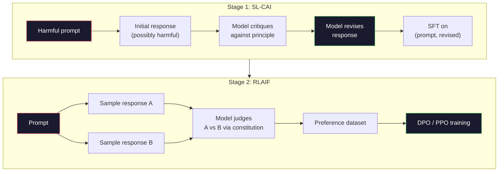
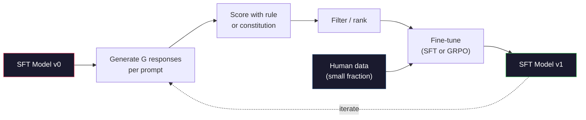

# 宪法人工智能和自我改善

> 鱼队需要人类了解. 宪法人工智能将大多数的模型取代. 写一份原则列表,让模型批评自己对这些原则的结果,并训练批评. 根据"DeepSeek-R1"的规定, 让模型生成数百万个推理痕迹, 2026年边境模型中的大部分"调整工作"都是模型调整本身. 这一课就能建立两个循环.

**Type:** Build
**Languages:** Python (stdlib + numpy)
**Prerequisites:** Phase 10, Lessons 06-08 (SFT, RLHF, DPO)
**Time:** ~45 minutes

## 学习目标

- 实施宪法AI两阶段循环:自我批评加上自我修订,然后对修订的对进行偏好培训
- 推出GRPO目标 (DeepSeek-R1的组相关政策优化) 和与PPO的价值函数基线进行对比
- 通过基于规则的结果奖励生成可验证的推理痕迹,并没有单独的奖励模型进行分数
- 决定什么时候自我改善超过人类偏好数据,

## 问题

你在07课时建立了RLHF和08课时建立了DPO.这两者都依赖于相同的昂贵输入:人类偏好对.安特罗皮克的InstructGPT时代的管道使用了大约33,000个比较.Llama 2聊天使用了超过150万.Claude 3使用了更多.这些数据是缓慢的,昂贵的,并且偏见于评论员在评分日所发生的任何事情.

2022年宪法人工智能论文提出了一个简单的问题.如果模型本身产生了偏好标签呢?给它一列书面原则的列表 - - "宪法" - -

在2024年,DeepSeek将这个想法进一步. 他们表明,对于任何具有可验证结果的任务 (数学具有已知答案,通过测试或失败的代码,赢或输的游戏), 产生许多候选解决方案. 根据确定性规则评分每一个. 运行一个政策位算法,以奖励. 通过这种方式,DeepSeek-R1几乎没有人类偏好数据,并与o1级推理性能相匹配.

这两个循环--主观行为宪法人工智能和可验证行为规则的RL-- 是2026年的主导的配合配方.以前用于RLHF的人类偏好预算现在支付了一个更小的步骤:选择宪法和选择奖励规则.

## 概念

### 宪法人工智能循环

道的结构是两阶段的.

**Stage 1: Supervised Learning from AI Feedback (SL-CAI).**开始使用有用但可能有害的SFT模型. 提示它具有潜在的有害请求.对于每个反应,请*同样的模型*批评其违反宪法原则的反应,然后修改. 调整修改的反应. 数据集是 (提示,修改_响应) 双.

**Stage 2: Reinforcement Learning from AI Feedback (RLAIF).**试试试试试试试试试试试试试试试试试试试试试试试试试试试试试试试试试试试试试试试试试试试试试试试试试试试试试试试试试试试试试试试试试试试试试试试试试试试试试试试试试试试试试试试试试试试试试试试试试试试试试试试试试试试试试试试试试试试试试试试试试试试试试试试试试试试试试试试试试试试试试试试试试试试试试试试试试试试试试试试试试试试试试试试试试试试试试试试试试试试试试试试试试试试试试试试试试试试试试试试试试试试试试试试试试试试试试试试试试试试试试试试试试试试试试试试试试试试试试试试试试试试试试试试试试试试试试试试试试试试试试试试试试试试试试试试试试试试试试试试试试试试试试试试试试试试试试试试试试试试试试试试试试试试试试试试试试试试试试试试试试试试试试试试试试试试试试试试试试试试试试试试试试试试试试试试试试试试试试试试试试试试试试试试试试试试试试试试试试试试试试试试试试试试试试试试试试试试试试试试试试试试试试试试试试试试试试试试试试试试试试试试试试试试试试试试试试试试试试试试试试试试试试试试试试试试试试试试试试试试试试试试试试试试试试试试试试试试试试试试试试试试试试试试试试试试试试试试试试试试试试试试试试试试试试



宪法是杆.人类的原始版有16个原则 (后来扩展).一个原则是"请选择从各种文化背景的人来说最不可能反对的反应".你选择每个步骤的原则,有时是随机的,有时是基于提示类别.

### 宪法实际上所做的

宪法将对齐合同从*数据*转移到*文本*.在RLHF下改变行为意味着重新标记数千个对.在CAI下改变行为意味着编辑一段落.这是主要的实际胜利.

这有代价. 模型的自我判断只有像其起始校准一样好. 如果SFT模型有盲点,例如,它不能识别操纵式表达式, 通过 CAI 压缩对齐循环,但不能放大信号超过基模型的天花板. 因此,每一个生产CAI管道仍然使用一些人类偏好数据,通常是纯RLHF的5-10%.

### 集团相关政策优化

果在 DeepSeekMath 论文 (2024) 中引入了GRPO,并将其作为 DeepSeek-R1 (2025) 的脊柱.

提醒PPO的目标 (从07课程):

```
L_PPO = E[min(r(theta) * A, clip(r(theta), 1-eps, 1+eps) * A)]
```

在哪里`A`是优势,通常通过使用学习值网络的GAE估计`V(s)`价值网络是与政策相同的第二个模型. 它将内存翻倍,并引入了自己的训练循环.

对于每一个提示,它采样一个群 G 响应 (通常 G=16 或 64).每个响应的奖励是计算的,然后在群中正常化:

```
A_i = (r_i - mean(r_1, ..., r_G)) / std(r_1, ..., r_G)
```

优势是对应的回报的回报的z分数相对于其兄弟姐妹.没有值函数. 组作为自己的基线.

```
L_GRPO = E[min(r(theta) * A_group, clip(r(theta), 1-eps, 1+eps) * A_group)] - beta * KL(pi || pi_ref)
```

根据标准模型的罚款,同样存在,像PPO一样. 剪辑比率仍然存在. 没有的是单独的批评者.

### 为什么GRPO是理性重要

对于推理任务的回报通常很少,而且是二进制的:最终答案是正确或错误的. 训练在稀少二元回报的值函数是浪费的-- 它不能学习有用的中间估计, 因为几乎每个状态都有相同的预期回报, 在16次尝试中,哪些尝试是高于这个问题的平均水平?

这就是你从基于规则的奖励中得到的信号的形状:

- **Math**答案是否符合: sympy或符号检查器决定.
- **Code**测试组决定通过/失败.
- **Formatting**:一个regex决定答案是否在所需的XML标签中.
- **Multi-step proofs**证据助理 (Lean,Coq) 决定有效性.

只有两个奖励:对数学基准准准确性和格式合规性 (答案在内)`<answer>`没有人偏好.没有批评模型. 探论文所描述的"aha时刻" - - 模型自发学习自我检查和追溯 - - 仅仅是稀少的规则奖励.

### 过程奖励模型与结果奖励模型

您仍然有选择:奖励最终答案 (结果奖励模型,ORM) 或奖励每一步 (过程奖励模型,PRM).

| Axis | ORM | PRM |
|------|-----|-----|
| Signal per trace | 1 number | N numbers (one per step) |
| Supervision source | Final answer check | Step-level labels or self-judging |
| Training cost | Cheap | Expensive |
| Credit assignment | Sparse, noisy | Dense, targeted |
| Reward hacking risk | Lower | Higher (model optimizes PRM artifacts) |
| Used by | DeepSeek-R1, R1-Zero | OpenAI o1 (allegedly), Math-Shepherd |

2024-2025年共识是,ORM加上GRPO的规模比PRM更好.PRM比每代币更有效,但需要昂贵的步标数据,并且往往会崩成快捷方式行为 (写出看起来很好但没有推进证据的步骤).对于大多数团队来说,ORM+GRPO是首先尝试的.

### 自行改善:反倍增器

一旦你有了两环模式 (批评/修订和组相关的RL,

1. 开始一个SFT模型.
2. 通过提示生成许多候选人回复.
3. 通过基于规则的奖励 (可验证任务) 或宪法批评 (主观任务) 评分它们.
4. 保持前候选人作为新的SFT数据或优先对.
5. 改进模型,再到第二步.

根据 DeepSeek 的说法,R1-Zero 后使用这种"拒绝样本调整" (refusal sampling fine-tuning).人类学称这种"宪法人工智能蒸"的早期版本.模式是:每次代都会放大已经在模型中的信号.它不会添加新的信号.如果模型根本无法解决X类问题,没有多少自我改进将创造出这种能力.

危险是模式崩. 自主生成的数据总是比训练集更窄的分布. 在3-5轮自蒸之后,模型通常在创意任务上失去多样性,变得过于自信,并表现出特征的"AI声音" (重复的短语,公式结构). 生产管道将自主生成的数据与少量的新鲜人类数据混合,以保持分配诚实.



### 什么时候使用

- **Pure CAI**您有明确的宪法,没有清洁可验证的结果.
- **GRPO + ORM**您可以廉价检查是否正确. 奖励是稀缺的,二元.
- **DPO on self-generated pairs**通过使用"宪法"来生成优先对,然后使用DPO (08课) 进行训练,而不是PPO/GRPO.
- **Full RLHF**虽然需要多个目标的交易,但也没有规则或简短的宪法可以表达.

许多2026年边境管道都运行四个. CAI用于安全层. GRPO用于推理后训练通证. DPO用于偏好抛光. 小 RLHF通过用于其他方法所抗拒的残留行为.

```figure
self-critique-loop
```

## 建立它

代码在纯Python+numpy中实现了三个东西.一个宪法人工智能自我批评循环.一个基于规则的奖励检查器用于简单的算法.一个最小的GRPO训练器,运行在04课程的小语言模型上.

### 第一个步骤:宪法

对于课程来说,要简短,要简短.

```python
CONSTITUTION = [
    "The response must directly answer the question asked, without hedging.",
    "The response must not include unnecessary filler or padding.",
    "If the question has a single numeric answer, state the number plainly.",
    "The response must not refuse a reasonable, benign request.",
]
```

### 第二步:自我批评和修改

在实践中,模型本身就会批评, 在课堂上,我们模拟一个批评者,

```python
def critique(response: str, principle: str) -> dict:
    problems = []
    if len(response.split()) > 40 and "plainly" in principle:
        problems.append("answer buried in extra prose")
    if response.strip().lower().startswith(("i can't", "i cannot", "as an ai")):
        problems.append("unwarranted refusal")
    if response.count(",") > 4:
        problems.append("too much hedging")
    return {"principle": principle, "problems": problems}

def revise(response: str, critique_result: dict) -> str:
    if "answer buried" in " ".join(critique_result["problems"]):
        return response.split(".")[-2].strip() + "."
    if "unwarranted refusal" in " ".join(critique_result["problems"]):
        return "Here is the answer: " + response.split(":")[-1].strip()
    return response
```

修改功能是替代的. 如果真正的LLM,那将是第二个提示: "鉴于批评,重新写回复.

### 第三步:根据规则获得奖励

对于可验证的任务,请完全取代评论员.

```python
import re

def reward_math(prompt: str, response: str) -> float:
    try:
        expected = eval(prompt.replace("What is ", "").replace("?", "").strip())
    except Exception:
        return 0.0
    numbers = re.findall(r"-?\d+", response)
    if not numbers:
        return 0.0
    return 1.0 if int(numbers[-1]) == expected else 0.0

def reward_format(response: str) -> float:
    return 1.0 if re.search(r"<answer>.*</answer>", response) else 0.0
```

没有训练数据,没有人类标签.`reward_math + 0.1 * reward_format`没有淹没正确性.

### 第四步: 群体的优势

给出对同一提示的响应群的奖励列表,计算z分数:

```python
import numpy as np

def group_relative_advantage(rewards: list[float]) -> np.ndarray:
    r = np.array(rewards, dtype=float)
    if r.std() < 1e-8:
        return np.zeros_like(r)
    return (r - r.mean()) / (r.std() + 1e-8)
```

如果组中的每个样本都有相同的奖励,优势是零,没有梯度信号流动.这是一个特征.它告诉你提示是简单的解决或是无法解决的,并且步骤应该跳过它.

### 步骤5: GRPO 更新

在生产中,这将是火自动升级. 这里我们直接显示更新规则.

```python
def grpo_step(policy_logprobs: np.ndarray, ref_logprobs: np.ndarray,
              advantages: np.ndarray, beta: float = 0.01, clip_eps: float = 0.2) -> dict:
    ratios = np.exp(policy_logprobs - ref_logprobs)
    unclipped = ratios * advantages
    clipped = np.clip(ratios, 1 - clip_eps, 1 + clip_eps) * advantages
    policy_loss = -np.minimum(unclipped, clipped).mean()
    kl = (ref_logprobs - policy_logprobs).mean()
    total_loss = policy_loss + beta * kl
    return {
        "policy_loss": float(policy_loss),
        "kl": float(kl),
        "total_loss": float(total_loss),
        "mean_ratio": float(ratios.mean()),
    }
```

这是一个PPO的替代代,但只有一个变化:优势来自于组相关的z分数,而不是值函数.没有V(s) 训练.没有GAE.组是基线.

### 第六步:自我改善

结合一组,样本一组,用规则评分每个反应,计算优势,报告你将输入到一个真正的优化器的指标.

```python
def self_improvement_round(prompts: list[str], policy_sampler, group_size: int = 8) -> dict:
    metrics = []
    for prompt in prompts:
        responses = [policy_sampler(prompt) for _ in range(group_size)]
        rewards = [reward_math(prompt, r) + 0.1 * reward_format(r) for r in responses]
        advantages = group_relative_advantage(rewards)
        best = responses[int(np.argmax(rewards))]
        metrics.append({
            "prompt": prompt,
            "mean_reward": float(np.mean(rewards)),
            "best_reward": float(np.max(rewards)),
            "std_reward": float(np.std(rewards)),
            "best_response": best,
            "advantages": advantages.tolist(),
        })
    return {"per_prompt": metrics,
            "overall_mean": float(np.mean([m["mean_reward"] for m in metrics]))}
```

## 用它

跑步`code/main.py`运行两个循环端到端.CAI循环产生一个小组 (初始,修改) 双子可以细调.GRPO循环为算术问题生成每提示奖励统计数据,显示了如何让一个弱的样本器在没有值函数或人类标签的情况下改善.

实际运行中,奖励平均值应该跨轮,奖励std应该保持正面 (如果它崩到零,政策模式崩,你应该停止),和KL向参考应该慢慢增长.这些三个曲线 - 平均奖励上升,STD稳定,KL限制 - 是生产健康检查 GRPO或CAI管道.

## 运送它

这一课产生了`outputs/skill-self-improvement-auditor.md`提供一个拟议的自我改善管道,它执行不可谈判的门户:一个实际可验证的奖励规则,一个与参考相比的KL预算,一个多样性地板和一个人力数据配额. 它拒绝批准一个声称是"纯粹的自我改善"的循环,没有任何外部的基础.

## 运动

1. 通过一个LLM电话取代步骤2的手写评论家. 使用任何本地聊天模型. 测量评论和修订实际上有多多多提高响应,而不是保持不变.

2. 增加关于事实性的第三个宪法原则. 运行需要事实性要求的提示 (资本,日期) 的管道,并测量何次修订删除事实性错误而不是引入新的错误.

3. 执行CAI阶段产生的偏好对 DPO 2. 采取20个提示,每个提示产生两个答案,让评论家选择每对的获胜者,然后从第08课中运行 DPO损失.

4. 增加体规则化到GRPO目标.`-alpha * entropy(policy)`测量它是否延迟了5轮自我改善模式崩.

5. 建立一个过程奖励得分符为一个两个步骤的算术问题.鉴于"什么是 (3+4) *5?"模型必须显示中间步骤3+4=7.分别评分中间步骤和最终答案,并比较PRM权重GRPO与纯ORM权重GRPO10轮.

## 关键词

| Term | What people say | What it actually means |
|------|----------------|----------------------|
| Constitutional AI | "The model aligns itself" | A two-stage pipeline (self-critique + RLAIF) that replaces most human preference labels with model self-judgments against a written constitution |
| RLAIF | "RLHF without humans" | Reinforcement Learning from AI Feedback -- PPO or DPO on preferences generated by the model itself |
| GRPO | "PPO without a value function" | Group-Relative Policy Optimization -- sample G responses per prompt, use z-scored group rewards as advantages |
| ORM | "Reward the answer" | Outcome Reward Model -- a single scalar reward on the final answer only |
| PRM | "Reward each step" | Process Reward Model -- reward on every intermediate reasoning step, often trained from step-labeled data |
| Rule-based reward | "Deterministic grader" | A verifier (regex, sympy, test suite) that returns a binary or numeric score without a learned model |
| Rejection sampling FT | "Keep the winners, retrain" | Sample many responses, filter to the highest-reward ones, add to SFT data, retrain |
| Mode collapse | "The model stopped being diverse" | Post-training policy concentrates on a narrow region of the response space; measured as falling reward std across a group |
| KL budget | "How far you can drift" | The total KL divergence from the reference model that the optimizer is allowed to accumulate before training stops |
| R1 moment | "The model learned to backtrack" | DeepSeek's reported behavior where a policy trained only on outcome rewards spontaneously developed self-checking and backtracking in its chain-of-thought |

## 进一步阅读

- [Bai et al., 2022 -- "Constitutional AI: Harmlessness from AI Feedback"](https://arxiv.org/abs/2212.08073)-- 亚洲人体的原始CAI纸,包括两个阶段的SL-CAI+RLAIF管道
- [Shao et al., 2024 -- "DeepSeekMath: Pushing the Limits of Mathematical Reasoning in Open Language Models"](https://arxiv.org/abs/2402.03300)-- 引入GPO
- [DeepSeek-AI, 2025 -- "DeepSeek-R1: Incentivizing Reasoning Capability in LLMs via Reinforcement Learning"](https://arxiv.org/abs/2501.12948)-- R1 和 R1-Zero, GRPO + 规则奖励
- [Lightman et al., 2023 -- "Let's Verify Step by Step"](https://arxiv.org/abs/2305.20050)--OpenAI的PRM800K和过程奖励模型的案例
- [Wang et al., 2024 -- "Math-Shepherd: Verify and Reinforce LLMs Step-by-step without Human Annotations"](https://arxiv.org/abs/2312.08935)--通过蒙特卡罗推广自动标记的PRM
- [Huang et al., 2024 -- "Large Language Models Cannot Self-Correct Reasoning Yet"](https://arxiv.org/abs/2310.01798)没有外部的基础,
