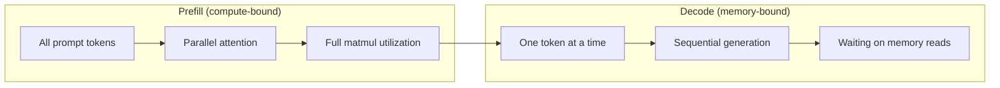
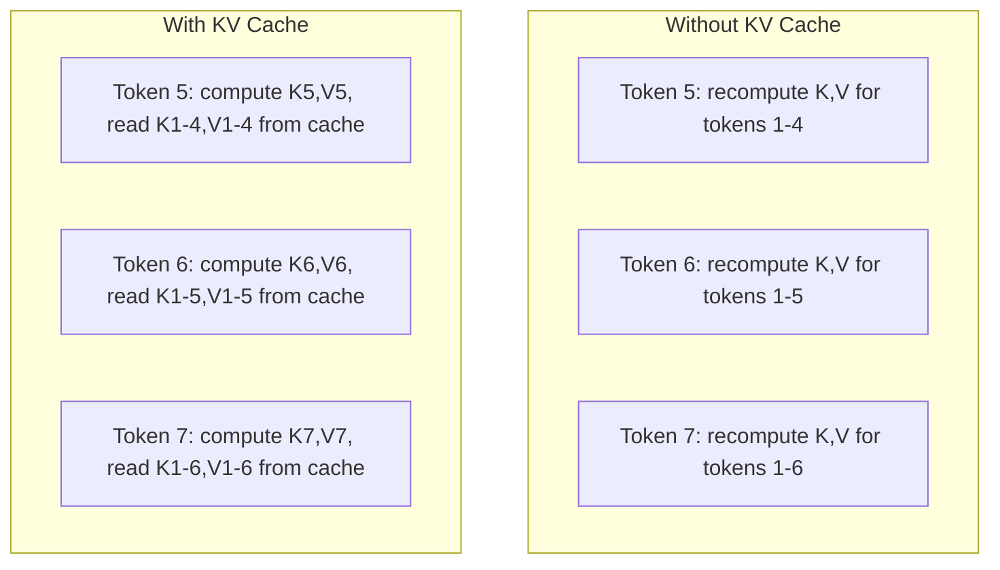
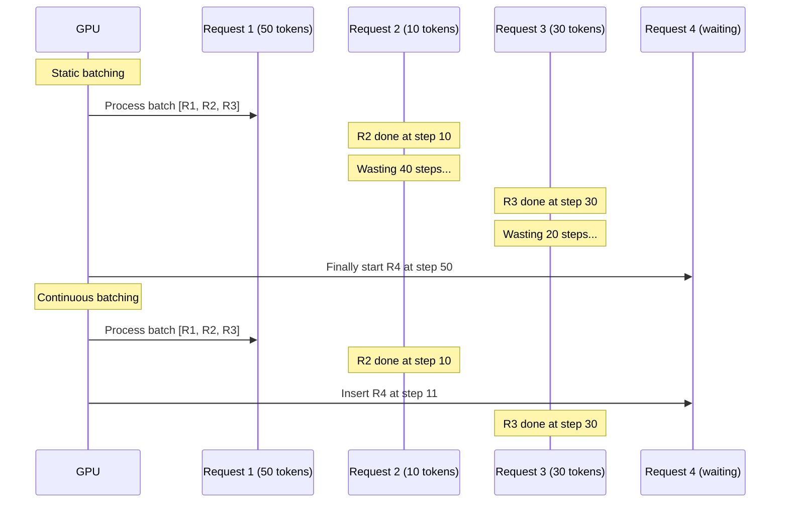
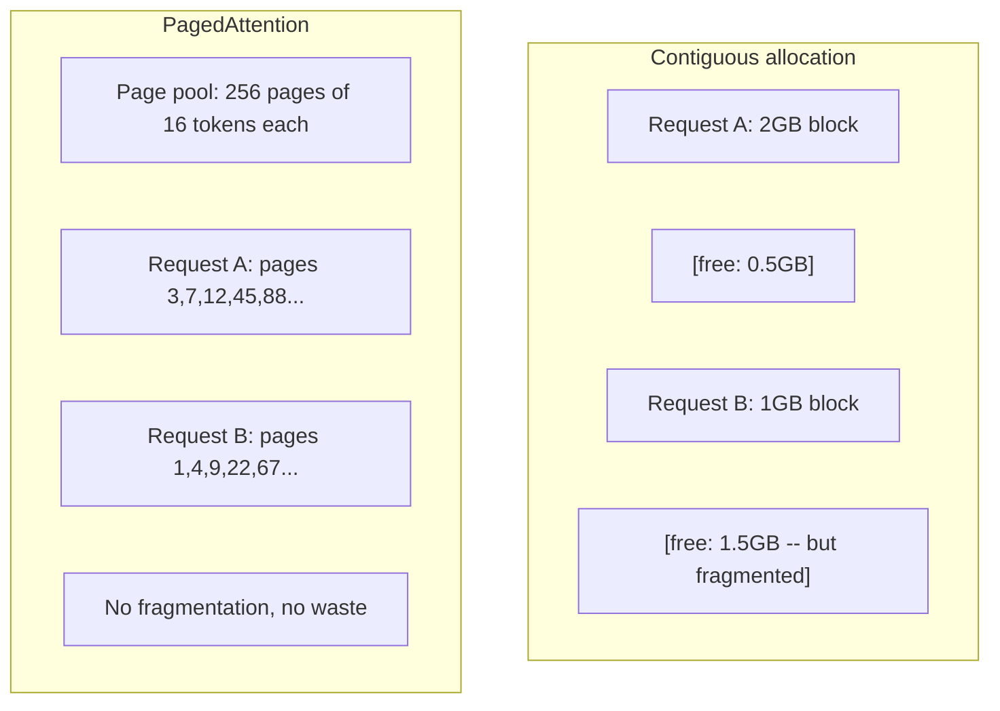
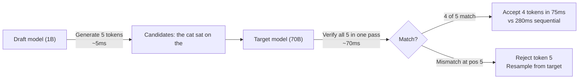

# 推理优化

> 两个阶段定义了LLM推理.预填处理你的提示并行 - - 计算式.解码一次生成代币 - - 记忆式.每个优化都针对一个或两个.

**Type:** Build
**Languages:** Python
**Prerequisites:** Phase 10, Lessons 01-08 (Transformer architecture, attention)
**Time:** ~120 minutes

## 学习目标

- 实现KV缓存,以消除自动降低代币生成期间冗余计算
- 解释LLM推理的预填与解码阶段以及为什么每个阶段都有不同的瓶 (计算与记忆)
- 实现连续批量和PagedAttention概念,以最大限度地在同时请求下利用GPU
- 比较推断优化技术 (KV缓存,投机解码,闪存注意力) 和其吞吐量/延迟权衡

## 问题

您在 4xA100 GPU 上部署Llama 3 70B. 一个用户每秒获得约50个代币.感觉很快. 然后100个用户同时达到终端点. 吞吐量下降到3个代币/秒/用户. 您的每月25,000美元的 GPU 账单服务响应速度比人类类型慢.

模型本身在1用户到100用户之间不会发生变化. 体重相同,建筑相同,数学相同. 改变的是你安排工作的方式. 简单的推断浪费了90%以上的可用GPU计算. 预测到一个用户在等待代币47时, 整个批量插槽保持开放, 而GPU内存巴士在子之间停留. 另一方面,一个新用户的2000个代币提示可以用有用的计算来填补那个空白时间.

这不是扩展问题. 这是一个规划问题. 这课中的技术 - - KV缓存,连续批量,页面注意,推测解码,前缓存 - - 是分开一个$25k/month inference bill from a $平均每月5千辆,服务于同一个交通.

通过4xA100-80GB的Llama 3 70B服务的vLLM在低同步时实现了50个代币/秒/用户,并通过连续批量和PagedAttention支持100个同步请求的15-25个TPS/用户.没有这些优化,相同的硬件在同步时服务于5个TPS/用户.相同的GPU,相同的模型,吞吐量为4倍.

## 概念

### 预填与解码

每个士推断请求都有两个不同的阶段.

**Prefill**处理整个输入提示.所有代币都已知,因此注意力可以平行计算在整个序列中.这是一个大的矩阵乘法 - - GPU 核心保持忙碌.瓶是计算:你的硬件每秒能输送多少FLOPS.A100可以提供312 TFLOPS (BF16).在70B模型上预填4 096代币提示需要400ms在单个A100上.

**Decode**发出输出代币一次. 每个新代币都会与之前的所有代币相结合,但每次前进通行只会产生一个代币. 按矩阵的尺寸与预填量相同,但你将它们乘以单个向量而不是矩阵.  GPU 核心在微秒内完成,然后等待下一批重量从内存到达. 瓶是内存带宽:你能如何快速将模型重量从HBM流到计算单元. 机有2TB/s的带宽. 对于FP16的70B模型,则是140GB. 一次阅读完整模型需要70ms,这是你单次解码步骤的地板.



其他**ops:byte ratio**计算量是计算的,它可以测量你每次从内存中加载的字节中执行多少操作.

```
ops:byte ratio = FLOPs per token / bytes read from memory
```

在 4,096 个代币的批量中,你执行每次加载重量的 4,096 个多积累操作.比率高 - 你是计算的.在批量大小 1 的解码过程中,你执行每次加载重量的 ~ 1 个操作.比率低 - 你是记忆的.

基本的见解: *解码是记忆的,因为你读完整个模型,以产生一个代币*. 下面的每一个优化,

### 存储器

在注意期间,每个代币的查询都会关注每个前代币的关键和值向量.没有缓存,生成代币N需要重新计算所有N-1前代币的关键和值预测.在生成代币 2,然后再次为代币3,然后再次为代币4.通过代币1000,你已经投影代币1总共999次.

存储KV缓存存储所有前代币的关键和值预测.在生成代币N时,您只计算代币N的关键和值,然后将它们与从代币1到N-1的缓存K/V连接.



**Memory formula for KV cache:**

```
KV cache size = 2 * num_layers * num_kv_heads * head_dim * seq_len * bytes_per_param
```

对于Llama 3 70B (80层,8KV头,GQA,头_dim=128,BF16):

```
per token: 2 * 80 * 8 * 128 * 2 bytes = 327,680 bytes = 320 KB
at 4,096 tokens: 320 KB * 4,096 = 1.28 GB
at 128K tokens: 320 KB * 131,072 = 40 GB
```

单个128K文本对话用于Llama 3 70B消耗40GBKV缓存 - - 一半是A100的内存.每一个4K代币的100个同步用户,KV缓存单独需要128GB.这就是为什么KV缓存管理是推断优化的主要挑战.

### 连续批量

静态批量等到N请求的批量到来,处理它们在一起,并在接受新请求之前等到*全部*完成.如果一个请求需要500个代币,另一个需要10,则短请求在完成后490个解码步骤停留无所作为.

连续批量 (也称为反复级批量) 随着任何请求完成,就会将新请求插入批量中.每次解码步骤都会重新评估批量.在10个代币后完成的请求立即被等待请求取代.



输出长度有多大,输出长度有多大,输出长度有多大,输出长度有多大,输出长度有多大,输出长度有多大,输出长度有多大,输出长度有多大.输出长度有多大,输出长度有多大,输出长度有多大,输出长度有多大.输出长度有多大,输出长度有多大,输出长度有多大,输出长度有多大,输出长度有多大,输出长度有多大,输出长度有多大,输出长度有多大,输出长度有多大,输出长度有多大,输出长度有多大,输出长度有多大,输出长度有多大,输出长度有多大,输出长度有多大,因为 GPU 插槽永远不会空空.

### 页面关注

每个请求的KV缓存是连续的内存块.随着请求的到来和离开,内存碎片就像操作系统中的RAM碎片化一样.一个4K代码请求需要连续的1.28GB.即使你有2GB的自由总数,你可能没有1.28GB的连续性*.你要么浪费内存,要么拒绝请求.

页面注意力 (vLLM) 应用OS式虚拟内存到KV缓存中.它不分配每请求一个连接块,而是分配固定尺寸的"页面" (通常每个 16 个代币).页面可以在物理GPU内存中的任何地方.页面表将每个请求的逻辑序列位置映射到物理页面位置.



页面注意力也可以实现**copy-on-write**如果 50 个请求共享相同的系统提示,则该系统提示的 KV缓存页面会一次存储并被所有 50 个请求引用.只有当请求分离 (不同用户消息) 时,它才会获得自己的页面.这会大幅减少共享系统提示的应用程序的内存使用.

通过PagedAttention,vLLM报告了接近零的记忆浪费 (在无明的分配中~4%vs~60-80%).

### 投机式解码

解码是慢的,因为它是序列的 - - 你生成一个代币,回它,生成下一个.

预测解码使用一个小,快速的**draft model**为了生成K候选代币.**target model**然后将所有K候选人处理在一个前进传递中 (看起来像一个预填 - 平行,计算,高效).如果目标模型与草案模型的预测一致,你会在一个目标前进传递的时间接受所有K代币.如果它在位置j上不同意,你会接受代币1到j-1,然后丢弃其余.



速度取决于**acceptance rate**对于一个Llama 3 8B的编写,接受率为70-85%是自然语言的典型.这意味着解码速度增加了2-3倍.

推测解码的三个方法:

| Method | Draft source | Acceptance rate | Overhead |
|--------|-------------|-----------------|----------|
| Draft-target (Leviathan et al.) | Separate small model | 70-85% | Draft model memory |
| EAGLE (Li et al.) | Lightweight head on target | 75-90% | ~1% extra parameters |
| N-gram lookup | Token n-gram table | 40-60% | Negligible |

**EAGLE**训练一个小的自动降低头, 它预测下一个代币的嵌入,使用目标模型的第二至最后层功能. 由于它运行目标模型的自己的表示 (而不是单独的模型),因此它实现了更高的接受率,并且具有最小的额外内存. -2增加了一个动态的草稿树,根据环境调整候选人数量.

**N-gram speculative decoding**如果草案与同一对话中之前出现的内容 (重复模式,代码,结构化输出) 匹配,则它会带来零神经网络的通用费用.接受率平均较低,但每次猜测的成本基本上是免费的.

测量解码是 *数学上精确* - - 输出分布与目标模型的分布相同.它不是近似.验证步骤确保每个接受的代币都有目标模型分配的概率.

### 预写 缓存

许多请求共享相同的预先语.一个聊天机器人系统提示.一个RAG文本区块.几个拍摄的例子设置.没有预先语缓存,每个请求从零开始重新计算这些共享代币的KV缓存.

预先预先存储KV缓存用于常见预先存储器,并在请求中重复使用.当一个新的请求带有已知预先存储器到来时,系统复制 (或引用) 缓存的KV输入,仅计算KV为独特的后音.

对于所有请求中共享2000个代币的系统提示,预先缓存消除了每请求的预填量400ms. 在每秒100次请求时,这节省了每秒40秒的GPU计算 - - 超过一个GPU的值.

根据其标志内容,该树将预写标志索引.任何与存储的预写标志相匹配的请求都会免费获得其KV缓存.该树可实现部分预写标志相匹配 - - 如果你共享了1,500个2000个预写标志的缓存输入,你将重新使用这些1,500个,只会重新计算500个.

### 推进引擎

生产的三种发动机主导着LLM服务:

| Engine | Key innovation | Best for |
|--------|---------------|----------|
| vLLM | PagedAttention, continuous batching | General-purpose serving, highest compatibility |
| SGLang | RadixAttention (prefix caching), structured generation | Multi-turn chatbots, constrained decoding |
| TensorRT-LLM | NVIDIA kernel fusion, FP8 quantization | Maximum single-GPU throughput on NVIDIA hardware |

**vLLM**它支持最广泛的模型,运行在任何GPU供应商 (NVIDIA,AMD,Intel) 上,并通过PagedAttention +连续批量实现强大的吞吐量.OpenAI兼容的API意味着您可以将其作为任何OpenAI API调用的替代品.

**SGLang**基于vLLM的基础,但增加了RadixAttention用于预写缓存和结构化的LLM程序的域名特定语言.如果您的工作负载涉及多轮对话,工具使用或限制式解码 (JSON输出,regex指导生成),SGLang通常通过预写重复使用超过vLLM2-5倍.

**TensorRT-LLM**它将模型组建成优化NVIDIA GPU内核. 它将操作 (注意力+线性+激活在一个内核中) 合并,在H100 GPU上使用FP8,并用于生产部署与NVIDIA Triton 输入服务器集成. 它实现了NVIDIA硬件上最高的单GPU吞吐量,但需要更多的设置,并且仅在NVIDIA GPU上工作.

对于Llama 3 70B (4xA100-80GB,BF16) 的现实世界号码:

| Metric | vLLM | SGLang | TensorRT-LLM |
|--------|------|--------|---------------|
| Throughput (1 user) | ~50 TPS | ~55 TPS | ~65 TPS |
| Throughput (100 users) | ~2,500 total TPS | ~3,200 total TPS | ~3,000 total TPS |
| Time to first token | ~400ms | ~300ms (prefix hit) | ~350ms |
| Max context | 128K | 128K | 128K |

### 操作:字节框架

运营:字节比率告诉你你是否是计算或记忆的,这决定了哪些优化是重要的.

```
Compute roof: peak FLOPS of the GPU
Memory roof:  peak bandwidth * ops:byte ratio
```

当ops:byte低 (解码,小批量),你会击中内存带宽屋顶.增加更多计算 (较高的钟,更多的核心) 不会有帮助.你需要减少内存读数 (量化,KV缓存压缩) 或增加批量大小,以抵偿更有用的工作.

运算:byte高时 (预填,大批量),你会碰到计算屋顶.内存带宽优化并没有帮助.你需要更快的GPU,内核融合或更低的精度来挤压更多的FLOPS.

| Scenario | ops:byte | Bound | Optimize with |
|----------|----------|-------|---------------|
| Prefill, batch=1 | ~4,096 | Compute | Kernel fusion, FP8 |
| Decode, batch=1 | ~1 | Memory | Quantization, KV compression |
| Decode, batch=32 | ~32 | Memory | Larger batch, continuous batching |
| Decode, batch=256 | ~256 | Transitioning | Both matter |
| Decode, batch=1024 | ~1,024 | Compute | Kernel fusion, tensor parallelism |

在A100上的交叉点是 ops:byte = 156 (312 TFLOPS / 2 TB/s) 周围.在156下,你是记忆绑定.在156上,你是计算绑定.持续批量通过每次代码包装更多代码来推动解码到这个交叉.

```figure
context-window-slide
```

## 建立它

### 步骤1:从零开始存储KV缓存

我们建立了一个多头KV缓存, 存储每个层,每个头的关键和值预测,

```python
import numpy as np

class KVCache:
    def __init__(self, num_layers, num_heads, head_dim, max_seq_len, dtype=np.float16):
        self.num_layers = num_layers
        self.num_heads = num_heads
        self.head_dim = head_dim
        self.max_seq_len = max_seq_len
        self.dtype = dtype

        self.k_cache = np.zeros(
            (num_layers, num_heads, max_seq_len, head_dim), dtype=dtype
        )
        self.v_cache = np.zeros(
            (num_layers, num_heads, max_seq_len, head_dim), dtype=dtype
        )
        self.seq_len = 0

    def update(self, layer_idx, new_keys, new_values):
        num_new = new_keys.shape[1]
        end = self.seq_len + num_new
        self.k_cache[layer_idx, :, self.seq_len:end, :] = new_keys
        self.v_cache[layer_idx, :, self.seq_len:end, :] = new_values
        return (
            self.k_cache[layer_idx, :, :end, :],
            self.v_cache[layer_idx, :, :end, :]
        )

    def advance(self, num_tokens):
        self.seq_len += num_tokens

    def memory_bytes(self):
        return self.k_cache.nbytes + self.v_cache.nbytes

    def used_bytes(self):
        per_token = 2 * self.num_layers * self.num_heads * self.head_dim * np.dtype(self.dtype).itemsize
        return per_token * self.seq_len
```

### 步骤 2: KV缓存的注意力

简单的多头注意力,使用KV缓存解码步骤.

```python
def scaled_dot_product_attention(query, keys, values):
    head_dim = query.shape[-1]
    scores = np.matmul(query, keys.transpose(0, 1, 3, 2)) / np.sqrt(head_dim)
    seq_len_q = scores.shape[-2]
    seq_len_k = scores.shape[-1]
    if seq_len_q > 1:
        mask = np.triu(np.ones((seq_len_q, seq_len_k), dtype=np.float32), k=seq_len_k - seq_len_q + 1)
        scores = scores + mask * (-1e9)
    max_scores = np.max(scores, axis=-1, keepdims=True)
    exp_scores = np.exp(scores - max_scores)
    attn_weights = exp_scores / np.sum(exp_scores, axis=-1, keepdims=True)
    return np.matmul(attn_weights, values)


class MultiHeadAttention:
    def __init__(self, d_model, num_heads):
        self.num_heads = num_heads
        self.head_dim = d_model // num_heads
        scale = np.sqrt(2.0 / d_model)
        self.W_q = np.random.randn(d_model, d_model).astype(np.float32) * scale
        self.W_k = np.random.randn(d_model, d_model).astype(np.float32) * scale
        self.W_v = np.random.randn(d_model, d_model).astype(np.float32) * scale
        self.W_o = np.random.randn(d_model, d_model).astype(np.float32) * scale

    def forward(self, x, kv_cache=None, layer_idx=0):
        batch, seq_len, d_model = x.shape
        Q = np.matmul(x, self.W_q).reshape(batch, seq_len, self.num_heads, self.head_dim).transpose(0, 2, 1, 3)
        K = np.matmul(x, self.W_k).reshape(batch, seq_len, self.num_heads, self.head_dim).transpose(0, 2, 1, 3)
        V = np.matmul(x, self.W_v).reshape(batch, seq_len, self.num_heads, self.head_dim).transpose(0, 2, 1, 3)

        if kv_cache is not None:
            K_full, V_full = kv_cache.update(layer_idx, K[0], V[0])
            K = K_full[np.newaxis, :, :, :]
            V = V_full[np.newaxis, :, :, :]
            if seq_len == 1:
                kv_cache.advance(1)

        attn_out = scaled_dot_product_attention(Q, K, V)
        attn_out = attn_out.transpose(0, 2, 1, 3).reshape(batch, -1, d_model)
        return np.matmul(attn_out, self.W_o)
```

### 步骤3:连续批量模拟器

这模拟了静态和连续批量之间的时间表差异.

```python
import heapq

class Request:
    def __init__(self, request_id, prompt_tokens, output_tokens, arrival_step):
        self.request_id = request_id
        self.prompt_tokens = prompt_tokens
        self.output_tokens = output_tokens
        self.arrival_step = arrival_step
        self.tokens_generated = 0
        self.start_step = None
        self.end_step = None

    def is_done(self):
        return self.tokens_generated >= self.output_tokens


def simulate_static_batching(requests, batch_size):
    step = 0
    completed = []
    queue = list(requests)
    queue.sort(key=lambda r: r.arrival_step)

    while queue:
        batch = []
        while queue and len(batch) < batch_size:
            r = queue.pop(0)
            r.start_step = max(step, r.arrival_step)
            batch.append(r)

        if batch:
            step = max(step, max(r.start_step for r in batch))
            max_output = max(r.output_tokens for r in batch)
            for r in batch:
                r.tokens_generated = r.output_tokens
                r.end_step = step + max_output
            step += max_output
            completed.extend(batch)

    return completed


def simulate_continuous_batching(requests, batch_size):
    step = 0
    completed = []
    queue = sorted(requests, key=lambda r: r.arrival_step)
    queue_idx = 0
    active = []
    waiting = []

    while queue_idx < len(queue) or active or waiting:
        while queue_idx < len(queue) and queue[queue_idx].arrival_step <= step:
            waiting.append(queue[queue_idx])
            queue_idx += 1

        while waiting and len(active) < batch_size:
            r = waiting.pop(0)
            r.start_step = step
            active.append(r)

        if not active:
            if waiting:
                step += 1
                continue
            elif queue_idx < len(queue):
                step = queue[queue_idx].arrival_step
                continue
            else:
                break

        for r in active:
            r.tokens_generated += 1

        done = [r for r in active if r.is_done()]
        for r in done:
            r.end_step = step + 1
            completed.append(r)
        active = [r for r in active if not r.is_done()]

        step += 1

    return completed


def batching_stats(completed):
    latencies = [r.end_step - r.arrival_step for r in completed]
    total_time = max(r.end_step for r in completed) - min(r.arrival_step for r in completed)
    total_tokens = sum(r.output_tokens for r in completed)
    return {
        "avg_latency": np.mean(latencies),
        "p50_latency": np.median(latencies),
        "p99_latency": np.percentile(latencies, 99),
        "total_time": total_time,
        "throughput": total_tokens / total_time if total_time > 0 else 0,
    }
```

### 步骤4:预写缓存

基于试验的预写缓存,存储共享预写的KV输入.

```python
class TrieNode:
    def __init__(self):
        self.children = {}
        self.kv_data = None
        self.hit_count = 0


class PrefixCache:
    def __init__(self, max_entries=1000):
        self.root = TrieNode()
        self.max_entries = max_entries
        self.total_entries = 0
        self.hits = 0
        self.misses = 0

    def _walk(self, token_ids):
        node = self.root
        depth = 0
        for tid in token_ids:
            if tid not in node.children:
                break
            node = node.children[tid]
            depth += 1
        return node, depth

    def lookup(self, token_ids):
        node, depth = self._walk(token_ids)
        if depth > 0:
            self.hits += 1
            current = self.root
            for tid in token_ids[:depth]:
                current = current.children[tid]
                current.hit_count += 1
            kv_entries = []
            current = self.root
            for tid in token_ids[:depth]:
                current = current.children[tid]
                if current.kv_data is not None:
                    kv_entries.append(current.kv_data)
            return depth, kv_entries
        self.misses += 1
        return 0, []

    def insert(self, token_ids, kv_per_token):
        node = self.root
        for i, tid in enumerate(token_ids):
            if tid not in node.children:
                if self.total_entries >= self.max_entries:
                    return i
                node.children[tid] = TrieNode()
                self.total_entries += 1
            node = node.children[tid]
            if i < len(kv_per_token):
                node.kv_data = kv_per_token[i]
        return len(token_ids)

    def hit_rate(self):
        total = self.hits + self.misses
        return self.hits / total if total > 0 else 0.0
```

### 步骤5: 推测式解码模拟器

我们模拟了可配置的接受率.

```python
class DraftModel:
    def __init__(self, vocab_size, acceptance_rate=0.8):
        self.vocab_size = vocab_size
        self.acceptance_rate = acceptance_rate

    def generate(self, context, num_tokens):
        tokens = np.random.randint(0, self.vocab_size, size=num_tokens)
        return tokens

    def get_probs(self, context, token):
        probs = np.random.dirichlet(np.ones(self.vocab_size))
        return probs


class TargetModel:
    def __init__(self, vocab_size):
        self.vocab_size = vocab_size

    def get_probs(self, context, tokens=None):
        if tokens is not None:
            return [np.random.dirichlet(np.ones(self.vocab_size)) for _ in tokens]
        return np.random.dirichlet(np.ones(self.vocab_size))


def speculative_decode(draft_model, target_model, context, num_speculative=5,
                       draft_cost=1.0, target_cost=10.0, verify_cost=12.0):
    total_tokens = 0
    total_cost = 0.0
    accepted_counts = []
    context = list(context)

    max_tokens = 100

    while total_tokens < max_tokens:
        draft_tokens = draft_model.generate(context, num_speculative)
        total_cost += draft_cost * num_speculative

        target_probs = target_model.get_probs(context, draft_tokens)
        total_cost += verify_cost

        accepted = 0
        for i, token in enumerate(draft_tokens):
            draft_p = draft_model.get_probs(context + list(draft_tokens[:i]), token)
            target_p = target_probs[i]

            r = np.random.random()
            acceptance_prob = min(1.0, target_p[token] / (draft_p[token] + 1e-10))

            if r < draft_model.acceptance_rate:
                accepted += 1
                context.append(token)
                total_tokens += 1
            else:
                new_token = np.random.choice(draft_model.vocab_size, p=target_p)
                context.append(new_token)
                total_tokens += 1
                break

        accepted_counts.append(accepted)

        if accepted == num_speculative:
            bonus_probs = target_model.get_probs(context)
            bonus_token = np.random.choice(draft_model.vocab_size, p=bonus_probs)
            context.append(bonus_token)
            total_tokens += 1

    sequential_cost = total_tokens * target_cost
    return {
        "total_tokens": total_tokens,
        "speculative_cost": total_cost,
        "sequential_cost": sequential_cost,
        "speedup": sequential_cost / total_cost if total_cost > 0 else 1.0,
        "avg_accepted": np.mean(accepted_counts),
        "acceptance_rate": np.mean(accepted_counts) / num_speculative,
    }


def compare_speculation_strategies(vocab_size=1000, num_trials=20):
    results = {}

    for name, acceptance_rate, spec_tokens in [
        ("Draft-target (8B->70B)", 0.78, 5),
        ("EAGLE", 0.85, 6),
        ("N-gram", 0.50, 4),
        ("No speculation", 0.0, 0),
    ]:
        if spec_tokens == 0:
            results[name] = {
                "speedup": 1.0,
                "acceptance_rate": 0.0,
                "avg_accepted": 0.0,
            }
            continue

        trial_results = []
        for _ in range(num_trials):
            draft = DraftModel(vocab_size, acceptance_rate=acceptance_rate)
            target = TargetModel(vocab_size)
            context = list(np.random.randint(0, vocab_size, size=10))
            result = speculative_decode(draft, target, context, num_speculative=spec_tokens)
            trial_results.append(result)

        results[name] = {
            "speedup": np.mean([r["speedup"] for r in trial_results]),
            "acceptance_rate": np.mean([r["acceptance_rate"] for r in trial_results]),
            "avg_accepted": np.mean([r["avg_accepted"] for r in trial_results]),
        }

    return results
```

### 步骤 6: KV缓存存储器配置文件

计算KV缓存内存要求用于实际模型配置.

```python
MODEL_CONFIGS = {
    "Llama-3-8B": {
        "num_layers": 32, "num_kv_heads": 8, "head_dim": 128,
        "model_params_b": 8, "gqa": True,
    },
    "Llama-3-70B": {
        "num_layers": 80, "num_kv_heads": 8, "head_dim": 128,
        "model_params_b": 70, "gqa": True,
    },
    "Llama-3-405B": {
        "num_layers": 126, "num_kv_heads": 8, "head_dim": 128,
        "model_params_b": 405, "gqa": True,
    },
    "Mistral-7B": {
        "num_layers": 32, "num_kv_heads": 8, "head_dim": 128,
        "model_params_b": 7, "gqa": True,
    },
    "GPT-4-est": {
        "num_layers": 120, "num_kv_heads": 96, "head_dim": 128,
        "model_params_b": 1800, "gqa": False,
    },
}


def kv_cache_memory(config, seq_len, dtype_bytes=2):
    per_token = 2 * config["num_layers"] * config["num_kv_heads"] * config["head_dim"] * dtype_bytes
    total = per_token * seq_len
    return {
        "per_token_bytes": per_token,
        "per_token_kb": per_token / 1024,
        "total_bytes": total,
        "total_mb": total / (1024 ** 2),
        "total_gb": total / (1024 ** 3),
    }


def memory_budget(config, gpu_memory_gb, model_dtype_bytes=2, kv_dtype_bytes=2):
    model_memory_gb = config["model_params_b"] * 1e9 * model_dtype_bytes / (1024 ** 3)
    overhead_gb = gpu_memory_gb * 0.1
    available_for_kv = gpu_memory_gb - model_memory_gb - overhead_gb

    if available_for_kv <= 0:
        return {"error": "Model does not fit in GPU memory", "model_memory_gb": model_memory_gb}

    per_token = 2 * config["num_layers"] * config["num_kv_heads"] * config["head_dim"] * kv_dtype_bytes
    max_tokens = int(available_for_kv * (1024 ** 3) / per_token)

    return {
        "gpu_memory_gb": gpu_memory_gb,
        "model_memory_gb": round(model_memory_gb, 1),
        "overhead_gb": round(overhead_gb, 1),
        "available_for_kv_gb": round(available_for_kv, 1),
        "max_total_tokens": max_tokens,
        "max_users_at_2k": max_tokens // 2048,
        "max_users_at_4k": max_tokens // 4096,
        "max_users_at_32k": max_tokens // 32768,
    }
```

## 用它

通过vLLM:

```python
from vllm import LLM, SamplingParams

llm = LLM(
    model="meta-llama/Llama-3-70B-Instruct",
    tensor_parallel_size=4,
    enable_prefix_caching=True,
    max_model_len=8192,
    gpu_memory_utilization=0.9,
)

params = SamplingParams(temperature=0.7, max_tokens=256)
outputs = llm.generate(["Explain inference optimization in one paragraph."], params)
```

通过SGLang用于预写缓存 +结构输出:

```python
import sglang as sgl

@sgl.function
def classify(s, text):
    s += sgl.system("You are a classifier. Output JSON only.")
    s += sgl.user(f"Classify this text: {text}")
    s += sgl.assistant(sgl.gen("result", regex=r'\{"label": "(positive|negative|neutral)"\}'))

runtime = sgl.Runtime(model_path="meta-llama/Llama-3-70B-Instruct", tp_size=4)
sgl.set_default_backend(runtime)

results = classify.run_batch([
    {"text": "This product is amazing!"},
    {"text": "Terrible experience."},
    {"text": "It was okay I guess."},
])
```

使用TensorRT-LLM:

```python
import tensorrt_llm
from tensorrt_llm.runtime import ModelRunner

runner = ModelRunner.from_dir("./llama-70b-trt-engine/", rank=0)

outputs = runner.generate(
    batch_input_ids=[tokenizer.encode("Explain KV caching.")],
    max_new_tokens=256,
    temperature=0.7,
)
```

## 运送它

这一课产生了:
- `outputs/skill-inference-optimization.md`对于诊断和优化LLM推断服务的技能

## 运动

1. 修改KV缓存配置文件,以比较FP16与FP8与INT4KV缓存量化.在4K环境下,计算每一个用户的最大共享用户为4xA100-80GB.KV量化到INT4应该大约是4倍的用户容量.

2. 扩展连续批量模拟器,以追踪GPU利用率 (每步填充的批量插槽的部分).随时间推移,用于静态和连续批量,采用50个请求,其输出长度遵循帕雷托分布 (形状=1.5,规模=20).连续批量应保持80%的利用率.

3. 实现KV缓存的集成查询注意 (GQA) 版本,`num_kv_heads < num_query_heads`计算存储存量与全重多头注意力 (KV缓存大小减少8倍).

4. 建立一个使用 LRU 驱逐的预写缓存.设置最大_entries为500,生成1000个请求,其中60%共享了5个常见预写中的一个.测量击率并与无限缓存进行比较.如果有良好的驱逐,击率应该保持在 55% 以上.

5. 扩展投机解码模拟器实现基于树的投机 (EAGLE-2 式).而不是单个链K草案代币,生成一个候选树 (例如,每个3级的2个分支=8个叶子候选).对验证轮和线性投机均接受的总代币进行比较.

## 关键词

| Term | What people say | What it actually means |
|------|----------------|----------------------|
| Prefill | "Processing the prompt" | Computing attention over all input tokens in parallel -- compute-bound because the full matrix multiplication keeps GPU cores busy |
| Decode | "Generating tokens" | Producing one token per forward pass, reading the full model weights each time -- memory-bound because compute finishes before the next weights arrive |
| KV cache | "Caching attention states" | Storing the key and value projections for all previous tokens so they are not recomputed at each decode step -- trades memory for compute |
| Continuous batching | "Dynamic batching" | Inserting new requests into the running batch as soon as any request finishes, evaluated at every decode iteration rather than waiting for the whole batch |
| PagedAttention | "Virtual memory for KV cache" | Allocating KV cache in fixed-size pages instead of contiguous blocks, eliminating memory fragmentation and enabling copy-on-write for shared prefixes |
| Speculative decoding | "Draft and verify" | Using a fast draft model to propose multiple tokens, then verifying them all in one target model forward pass -- mathematically exact, 2-3x speedup |
| EAGLE | "Self-speculative decoding" | A speculative decoding variant that trains a lightweight head on the target model's own hidden states, achieving higher acceptance rates than a separate draft model |
| Prefix caching | "Reusing system prompt KV" | Storing computed KV cache entries for common prefixes (system prompts, few-shot examples) and reusing them across requests to skip redundant prefill |
| Ops:byte ratio | "Arithmetic intensity" | The ratio of compute operations to memory bytes read -- determines whether a workload is compute-bound (high ratio) or memory-bound (low ratio) |
| Time to first token | "TTFT" | Latency from receiving a request to producing the first output token -- dominated by prefill time for long prompts |

## 进一步阅读

- 昆等人",用页面注意力服务的大语言模型的有效内存管理" (2023) - 引入页面 KV缓存管理的vLLM论文,现在是推断服务的行业标准
- 利维亚坦等, "通过推测解码从变压器快速推理" (2023) -- 证明了草案验证推测产生了精确的目标模型分布,同时实现了2-3倍的速度
- 利等人",EAGLE:投机性样本采集需要重新思考特征不确定性" (2024) --通过培训一个头脑对目标模型的特征而不是使用单独的草案模型来实现更高的接受率
- 等",SGLang:结构化语言模型程序的有效执行" (2024) -- 引入了RadixAttention用于预写缓存和多调用LLM课程的编程模型
- 威廉姆斯等人",多核架构的屋顶线:一个洞察力的视觉性能模型" (2009) - - 官方的原始屋顶线论文,将 ops:byte框架正式化为计算与内存瓶的推理
