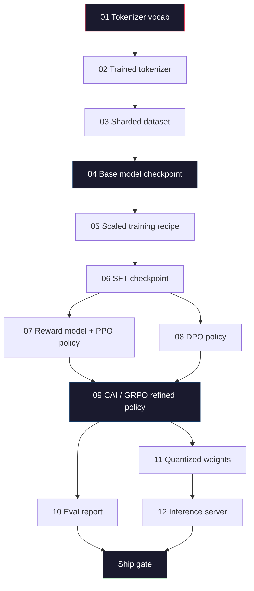
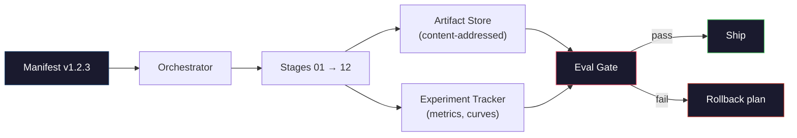

# 建立一个完整的LLM管道

> 从第1课到第12课,一切都是一个管道的阶段. 这一课是把这些阶段变成一个单一的终端运行:代码化,预列,规模化,SFT,排列,评估,量化,服务. 你不会在笔记本电脑上训练70B型号. 你将制作编排层,表格,评估门和2026年边境团队使用的反弹计划, 这是顶点.

**Type:** Build
**Languages:** Python (stdlib)
**Prerequisites:** All Phase 10 lessons 01-12
**Time:** ~120 minutes

## 学习目标

- 组合前十一个课程 (托肯化器,数据,预训练,扩展,SFT,RLHF,DPO,CAI,评估,量化,推断) 成为一个可复制的管道规范
- 定义阶段之间的艺术品合同:每个阶段所消耗的东西,它产生的东西,以及下一个阶段如何验证输入
- 建立一个追踪实验,哈希文物,和通过评估门的管弦仪
- 设计回归计划:哪些文物是廉价的重新运行,哪些是昂贵的,以及一个腐败的检查站的成本

## 问题

之前的课程每一个工作. 托克尼泽训练. 小 GPT预训练. SFT 数据集组组装. 奖励模型训练. DPO运行. 测量等值. 量化权重出口. 输入服务器 spun up. 每个是笔记本. 每个都有自己的公约,自己的输出路径,自己的种子.

边境训练不是笔记本. 拉马3405B在大约54天内花了3000万H100小时. 探V3使用了约2800万H800小时. 在那段时间里,一个破产的检查点,一个数据污染,一个评估回归, 团队通过管道卫生来生存下来:每个阶段都有确定性输入,确定性输出,表达,哈希和门口.

这就是结尾石.你不会在笔记本电脑上运行管道端到端.你会写编辑器协调阶段,说明运行的表格,验证器,通过运输决定,以及让第三方从单个文件中重新运行你的工作的重播计划.代码很小,纪律很大.

模式从100M到1T参数不变.相同的四个组件 - - 表格,调整器,评估门,文物存储 - - 运行Llama 3 并运行您的爱好GPT. 区别在于每个阶段配置中的数字的尺寸,而不是管道的形状.

## 概念

### 十二个阶段

每个10期课程都是一个阶段.



阶段07和08可以并行运行.其他一切都是一个艰难的依赖. 阶段02 (托肯尼泽) 的变化无效所有下游文物. 阶段10 (eval) 的变化只无效了船决定.

### 显而易见的

简单单单是单个文件,描述一个运行完全足以重播.管道产生的任何东西都不应该取决于没有在简单单单单中的状态. 字段是无聊的和强制性的.

```
pipeline_version: 1.2.3
seed: 42
git_commit: a1b2c3d4
stages:
  01_tokenizer:
    recipe: bpe_32k
    input_hash: sha256:...
    output_hash: sha256:...
    wall_clock_sec: 3600
    cost_usd: 12
```

阶段N的输出哈希是阶段N+1的输入哈希.任何偏差和管道停止. 这就是你早期捕获数据腐败的方式. 这也是一个不同大陆的队友如何验证他们的重播产生与你的相同的文物.

在实践中,团队使用一个小的YAML方案加上一个与之前成功运行不同的表现检查器.任何在预期的领域之外的三角形 (成本,墙钟) 是红旗.

### 工艺品的类型

每个阶段的输出都是一个打字的文物,不是一个目录,不是一个,而是一个已知的模式的命名类型.

| Stage | Artifact Type | Key Fields |
|-------|--------------|-----------|
| 01-02 | Tokenizer | vocab.json, merges.txt, config.json, hash |
| 03 | Dataset | shards[], row count, token count, dedup stats |
| 04-05 | Checkpoint | weights.safetensors, config.json, optimizer state, step count |
| 06 | SFT Model | checkpoint + SFT recipe + data mix |
| 07 | Reward Model | RM checkpoint + preference data hash |
| 08-09 | Policy | checkpoint + reference hash + beta + KL budget consumed |
| 10 | Eval Report | benchmark scores + regression diffs + eval data hash |
| 11 | Quantized Model | quantized weights + calibration data + accuracy delta vs FP16 |
| 12 | Server Spec | endpoint + model hash + config + observability hooks |

打字防止最常见的故障模式:使用步骤 08输出作为步骤 06输入,通过SFT路径运输一个DPO训练模型.打字的文物和打字的步骤签名使这些错误是编译时间故障,而不是五天的故障.

### 伊瓦尔门

运输不是"训练完成". 运输是"训练完成,评估门通过.

```
gates:
  mmlu:      >= baseline + 0.5   # no regression
  humaneval: >= baseline + 1.0
  truthfulqa: >= baseline         # no drop
  safety_refusal_rate: <= 0.05
  kl_from_reference: <= 25.0
  cost_total_usd: <= 50000
```

每个门都是数字门.没有"看起来很好"的门,没有主观的签名.如果每个门通过,文物标记为可运输的.如果任何门失败,运行将在一个名为的审查者明确的过关之前举行,该项目本身被登记在表中.

两门门捕获大多数灾难.一个*退缩*门 (新型车型必须至少与前一个核心基准标准一样好) 捕获训练错误.一个*KL预算*门 (调整政策不应偏离X的参考) 捕获调整过度.每个生产管道都有两者.

### 乐团主持人

简单的代码,读取说明书,发送阶段,追踪文物,停止任何违反合同.这不是空气流.这不是库贝流.

管家的工作很狭:

1. 现在,请从文件中删除日期.
2. 对于每个阶段,检查预期输出是否已经存在于正确的哈希 (如果是这样的话,跳转).
3. 走上舞台,捕捉到的时间,测量墙上的钟表和成本.
4. 验证输出哈希与下游阶段预期输入哈希相比.
5. 如果失败,请写一个部分表格,准确的失败阶段,然后退出非零.

这就是200行Python. 它将看起来像文件.`code/main.py`在这个课程中,在帽子下,真正的管道使用`torchrun`或`ray`管家自己在单个盒子上运行.

### 实验跟踪和艺术品存储

两种外部系统住了管道.

**Experiment tracker (wandb, neptune, mlflow).**记录损失曲线,评估指标,系统远程测量每个阶段. 追踪器是你需要比较3周后的运行A与运行B时去的地方. 团队几乎总是使用一个托管的追踪器来做这个 - - 写你的自己的时间会损失,应该进入训练.

**Artifact store (S3, R2, GCS).**检查点,数据集,代币,评估报告的不可变的对象存储.`latest.pt`是脚步枪;`ckpt-7b-step-20000-sha256:abc123.safetensors`是一个合同.

管家写信给两者.跟踪器是为了人类查看图表. 艺术品商店是为了下一个阶段查找输入.

### 成本

边境运行有美元号码,预算纪律在两个地方发生.

**Pre-run estimate.**从表格中计算预期FLOP (预训练:6x参数 x代币),预期GPU时间 (FLOP /峰值吞吐量 /利用率),以及美元成本以当前租金率计算.如果估计超过预算门,管道拒绝启动.

**In-run tracking.**阶段一步墙钟和成本记录在表格中.每阶段后,剩余预算都会被检查.如果一个阶段超过,下一个阶段的门将与新剩余预算进行评估.当风险投资公司打电话时,你不会发现你没有钱.

拉马3的报告成本是$61M. DeepSeek-V3 reported $5.6M主要预训练运行.比率主要是硬件效率加上专家组合 - 但具体成本是可见的,因为两个团队都跟踪了每个阶段,而不是每个运行.

### 复制性与确定性

它们不同. *可复制性*意味着相同的表格加上相同的代码加上相同的基础设施产生了具有相等下游指标的检查点. *确定性*意味着比特相同的输出.

现代的LLM培训可复制,但不是确定性. 分布训练的降级序列,GPU内核非确定性 (cuBLAS,闪电attn) 和混合精度圆结结合,产生在运行之间差异的浮动. 对于最后的指标来说,这很好,它们不会移动. 如果您试图通过位级差异进行调试,那么这会致命. 治疗方法是记录每个阶段的输入和输出和标题指标-- 如果它们匹配, 运行会"复制",即使重量不相同.



### 滚动计划

在比赛开始之前,写下每个阶段失败发生的事情.

- **Cheap to re-run**标记器,评估,量化,推断服务器.
- **Medium**(日):SFT,DPO,CAI. 保持基本模型;只重复调整阶段.
- **Expensive**现在,我们需要做一些好工作, 让我们可以做一些好工作, 让我们可以做一些好工作.

由于阶段依赖性是输入和哈希的,因此主管可以自动计算反弹集:无效的阶段加上每个后代.在阶段06 (SFT) 失败无效的06,07,08,09,10,11,12.在阶段11 (量化) 失败无效的11和12.在早上4点时,提前命名避免即兴.

### 2026年观察到的生产配方

许多边境团队都在同一骨架上.

- 标记器: 128k BPE 字节倒退. 训练在一个小,平衡的多语言片.
- 预训练: 10-20T代币,主要是网络加代码加合成. Muon或 AdamW优化器. FSDP2或DeepSpeed ZeRO-3. 渐进检查. BF16重量,FP32主.
- 标准:500k-2M指令对,混合人体和合成,与评估集进行严格的测试.
- 配合:DPO或CAI+GRPO. 只有当偏好信号对DPO太多维度时,RLHF.
- ,,,,,,,,,,,,,,,,,,,,,,,,,,,,,,,,,,,,,,,,,,,,,,,,,,,,,,,,,,,,,,,,,,,,,,,,,,,,,,,,,,,,,,,,,,,,,,,,,,,,,,,,,,,,,,,,,,,,,,,,,,,,,,,,,,,,,,,,,,,,,,,,,,,,,,,,,,,,,,,,,,,,,,,,,,,,,,,,,,,,,,,,,,,,,,,,,,,,,,,,,,,,,,,,,,,,,,,,,,,,,,,,,,,,,,,,,,,,,,,,,,,,,,,,,,,,,,
- 量化:为服务提供4位GPTQ或 AWQ,在精度分别重要时进行8位安全评估.
- 服务:vLLM,TensorRT-LLM,或内部. 连续批量. 投机解码. KV缓存驱逐.

六个月就会有变化,但骨架却没有.

```figure
beam-search
```

## 建立它

课程代码是一个管弦和一个明示检查器,而不是十二个训练脚本.每个阶段都用一个定位器模拟,产生一个正确的形状和哈希的输出文物.在实际阶段燃烧GPU资金之前,从端到端运行管弦证明管道工作.

看到`code/main.py`基本内容:

- `Manifest`数据类:管道版本,种子, Git 提交,阶段,门户.
- `Stage`数据类:名称,类型,输入 (hashes),输出 (hash),墙钟,成本.
- `Orchestrator.run()`解决DAG,发送阶段,验证哈希,更新表现.
- `EvalGate.check()`:阅读门值,与最新的评估报告进行比较,返回通过/失败.
- `ArtifactStore`按哈希,模拟S3.
- `CostTracker`按阶段和累计,限量超过时停止.

管道在`main.py`通过一个不良的评估门来显示一个被运行的运行是什么样子. 换取每个位数的实际训练脚本从相应的课程,你有一个骨架一个真正的边界管道使用.

## 用它

标准工作流程有三个命令.

```
python code/main.py plan    # validate manifest, compute cost estimate, print DAG
python code/main.py run     # execute stages, writing to manifest.out.yaml
python code/main.py gate    # read manifest.out.yaml, apply eval gates, ship-or-hold
```

跑步`plan`现在,我们在线运输系统中出现了很多错误,`plan`免费的.`run`通过获虫,可以节省钱.

产量`gate`是否是`SHIP`或`HOLD: <reason>`经过的运行不是失败,而是决定点.一个名为的审查员要么过失 (并且过失记录),要么他们批准了过失.

## 运送它

这一课产生了`outputs/skill-llm-pipeline-reviewer.md`提供一个拟议的管道说明书,并检查所有合同:阶段键入,哈希链,门户,反弹计划,成本估计.它拒绝批准一个没有评估门户的说明书,一个无限的KL预算,或一个运行混合评估和培训数据.

## 运动

1. 扩展调整器,以支持7和08阶段的并行执行.`concurrent.futures`确认最后的表格记录了两个阶段的输出,并且9阶段的输入哈希是两者的确定性组合.

2. 添加"污染检查"门.鉴于评估数据集和训练数据集的细节,计算重叠 (精确的字符串匹配或13克匹配).如果重叠超过0.1%,则门失败.将污染的训练集输入,并确认门能保持运行.

3. 根据第一原则实施成本估计器.对于第04阶段 (预训练),估计FLOP为6x参数 x代币,假设H100的40%MFU (模型FLOP利用率) 在989 TFLOPs BF16,在2.50美元/GPU-小时.报告2T代币训练的7B模型的估计.比较已发布的Llama 2数字.

4. 构建部分反弹.模拟在09级 (CAI) 发生失败,然后在01-08被缓存的同时重启09至12级.调整器应该通过哈希检测到缓存的文物并跳过它们.测量保存的墙钟与完全重启.

5. 添加可观测性. 发出OpenTelemetry 跨度为每个阶段,具有参数,看到的代币,损失和成本的属性. 输入跨度到本地收藏器. 问题不是仪表板; 问题是每个阶段的健康可以从单个痕迹识别器中追踪.

## 关键词

| Term | What people say | What it actually means |
|------|----------------|----------------------|
| Manifest | "The recipe file" | YAML or JSON describing pipeline version, seed, per-stage config, and gate thresholds — sufficient to replay a run |
| Content-addressed | "By hash not name" | Artifacts stored by SHA-256 of their contents, so you can never confuse version A with version B |
| Eval gate | "The ship criteria" | Numeric thresholds on benchmark metrics and safety scores that must pass before an artifact is marked shippable |
| KL budget | "How far alignment drifted" | A cap on cumulative KL(policy || reference) across alignment stages, enforced as a gate |
| MFU | "How much of the GPU you used" | Model FLOPs Utilization — achieved FLOPs divided by theoretical peak. 40% is typical at 70B scale, 55% at 7B |
| Rollback plan | "What we do when it breaks" | Pre-written set of actions per stage on failure: re-run, fall back, retrain with revised inputs |
| Orchestrator | "The conductor" | The process that reads the manifest, dispatches stages, verifies hashes, halts on any contract violation |
| Artifact store | "Versioned S3 for weights" | Immutable content-addressed object store — single source of truth for checkpoints, datasets, eval reports |
| Reproducible | "Same metrics on replay" | Different bit-level weights but equivalent downstream metrics — the realistic target for distributed LLM training |
| Cost gate | "You cannot exceed X" | Pre-run cost estimate plus in-run tracker — the pipeline refuses to start if the estimate exceeds budget |

## 进一步阅读

- [Dubey et al., 2024 -- "The Llama 3 Herd of Models"](https://arxiv.org/abs/2407.21783)-- 边境管道最详细的公开描述,包括数据,培训,调整,评估
- [DeepSeek-AI, 2024 -- "DeepSeek-V3 Technical Report"](https://arxiv.org/abs/2412.19437)提高效率率,占Llama3类培训成本的10分之一
- [Kaplan et al., 2020 -- "Scaling Laws for Neural Language Models"](https://arxiv.org/abs/2001.08361)-- 计算数据参数规模关系的原始
- [Hoffmann et al., 2022 -- "Training Compute-Optimal Large Language Models (Chinchilla)"](https://arxiv.org/abs/2203.15556)-- 校正卡普兰,重新校准了现代数据预算
- [PyTorch FSDP2 documentation](https://pytorch.org/docs/stable/fsdp.html)-- 在 PyTorch 2.4+ 中,FSDP1的分布式训练原始替代
- [Weights & Biases LLM Reports](https://wandb.ai/site/llms)-- 开源LLM运行的实验追踪器输出,作为可刺的模板有用
