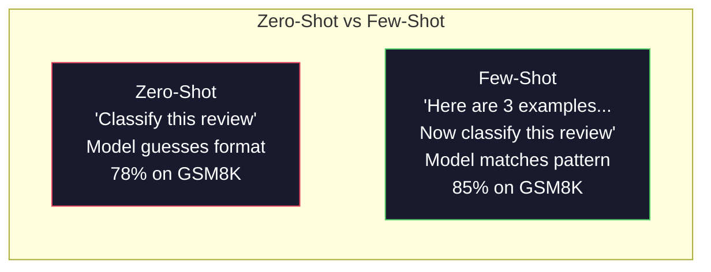
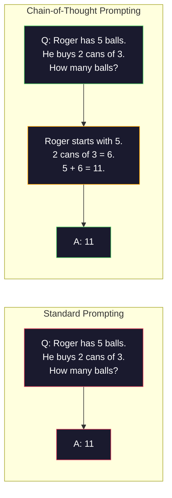
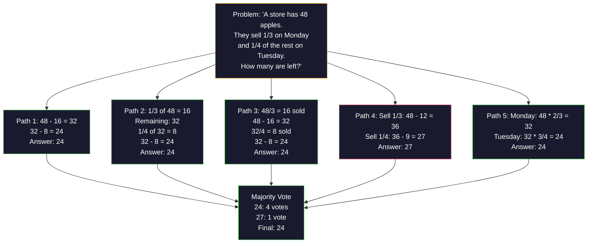
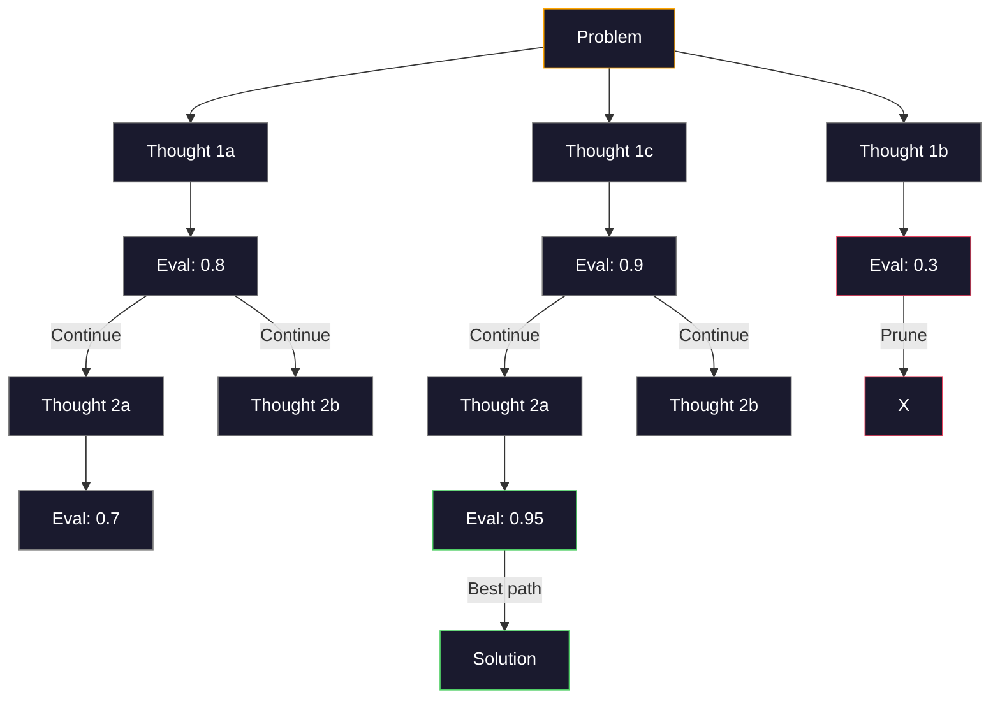

# 短暂的时间,思想链,思想树

> 告诉模型该做什么是促使. 展示它如何思考是工程. 在同一模型,同一任务,相同数据上,78%到91%的准确度之间的差距不是更好的模型.

**Type:** Build
**Languages:** Python
**Prerequisites:** Lesson 11.01 (Prompt Engineering)
**Time:** ~45 minutes

## 学习目标

- 通过选择和格式化最大限度地完成任务准确性的示例,实现少数拍摄提示
- 应用链思维 (CoT) 推理,以提高多步骤问题上的准确性,如数学词题
- 建立一个思考树提示,探索多种推理路径,选择最好的
- 测量从零射击对少数射击对CoT的准确性提高,根据标准基准

## 问题

你建立了一个数学教学应用程序.你的提示是"解决这个词问题".GPT-5在GSM8K上得到了94%的时间,这是标准的小学数学基准.你认为你已经达到顶峰.你没有思想链仍然增加3-4分.

添加五个单词, "让我们一步一步思考" - - 精度跳到91%.添加几种工作的例子,它达到95%.同样的模型.同样的温度.同样的API成本.唯一的区别是你给了模型的草纸.

这不是一个黑客.这是推理工作的方式.人类不会在一个心理跳跃中解决多步骤的问题.转变器也不会.当你迫使模型生成中间代币时,这些代币成为下一个代币的背景的一部分.每一步推理都能给下一个代币提供食物.模型字面上计算到答案.

但"一步一步思考"是开始,而不是结束.如果你采用五种推理方法,并获得多数票,你会怎么样?如果你让模型探索一个可能性树,评估和剪枝?如果你将推理与工具的使用交织在一起呢?这些不是假设.它们是有测量改进的发表技术,你将在这个课程中构建它们.

## 概念

### 零射击与少射击:当例子击败指令时

零射击提示给模型一个任务,而没有其他任务. 少数射击提示首先给它举例.

微等人 (2022) 在8个基准中测量了这一点.对于像情感分类这样的简单任务,零射击和少射击在彼此的2%内执行.对于多步数学和象征性推理这样的复杂任务,少射击提高了10-25%的准确性.

直觉:例子是压缩的指令.你不描述输出格式,而是显示它.你不解释推理过程,而是展示它.模型模式比解释抽象指令更可靠地匹配例子.



**When few-shot wins:**对于格式敏感任务,分类,结构化提取,特定领域的语,任何模型需要匹配特定模式的任务.

**When zero-shot wins:**简单的事实问题,创意任务,例子限制创造力,找到好的例子比写好说明更难的任务.

### 选择例子:类似的击球随机

不是所有例子都是相同的.选择类似于目标输入的例子在分类任务上比随机选择5-15%更好 (Liu等人, 2022).三个原则:

1. **Semantic similarity**: 选择最接近输入空间的例子
2. **Label diversity**: 涵盖您的示例中的所有输出类别
3. **Difficulty matching**根据目标问题的复杂性水平

在3下,模型没有足够的信号来提取模式.在5上,你会击中减少回报和浪费文本窗口代币.对于许多标签的分类,请使用每个标签的一个例子.

### 思想链:提供模特的草纸

推出了"链思维" (CoT) 提示,由微等人 (2022) 在谷歌大脑上推出. 这个想法很简单:而不是仅仅要求模型回答,请它先显示其推理步骤.



由于这种方法是机械的,变压器生成的每个代币都会成为下一个代币的背景.没有CoT,模型必须将所有推理压缩到单个前进传递的隐藏状态中.

**GSM8K benchmarks (grade-school math, 8.5K problems):**

| Model | Zero-Shot | Zero-Shot CoT | Few-Shot CoT |
|-------|-----------|---------------|--------------|
| GPT-4o | 78% | 91% | 95% |
| GPT-5 | 94% | 97% | 98% |
| o4-mini (reasoning) | 97% | — | — |
| Claude Opus 4.7 | 93% | 97% | 98% |
| Gemini 3 Pro | 92% | 96% | 98% |
| Llama 4 70B | 80% | 89% | 94% |
| DeepSeek-V3.1 | 89% | 94% | 96% |

**Note on reasoning models.**开放AI的o系列 (o3,o4-mini) 和DeepSeek-R1等模型在发出答案之前内部运行思想链.在推理模型中添加"让我们一步一步思考"是冗余的,有时是反效的.

两种风味:

**Zero-shot CoT**没有需要举例.科吉马等人 (2022) 表明,这个单一句子在算术,常识和象征性推理任务中提高了准确性.

**Few-shot CoT**模型可以看到你预期的正确的推理格式,因此比零射击CoT更有效.

**When CoT hurts**简单的事实回忆 ("法国的首都是什么?"),单步分类,速度比精确性更重要的工作.

### 统一: 抽取许多人,一次投票

等人 (2023) 引入了自相一致性. 洞察:单个CoT路径可能包含推理错误. 但如果你采用N独立推理路径 (使用温度>0) 并对最终答案获得多数票,错误会被取消.



自律性提高了GSM8K精度,从56.5% (单次CoT) 提高到74.4%,在最初的PaLM 540B实验中N=40 在GPT-5上,改善很小 (97%至98%) 因为基准已经和. 这种技术最能在60-85%的基准CT模型上发挥作用. 单路错误经常发生,但并非系统. 对于推理模型 (o系列,R1) 的自相一致性由内置的内部采样进行.

交易:N样本意味着Nx API成本和延迟.实际上,N=5占据了大部分的好处.N=3是有意义的投票的最低值.N>10对大多数任务的回报率下降.

### 思想树:分支探索

等人 (2023) 引入了思维树 (ToT).在CT遵循一个线性推理路径时,ToT在继续之前探索多个分支并评估最有前途的.



托特有三个组成部分:

1. **Thought generation**: 产生多个候选人下一步
2. **State evaluation**:每位候选人都能获得分数 (可以作为评估者使用LLM本身)
3. **Search algorithm**: BFS或 DFS 穿过树木,切割低分分分的枝

在24任务游戏中 (通过算法结合4个数字,使24),GPT-4与标准提示解决7.3%的问题.在CoT中,4.0% (CoT实际上在这里很痛苦,因为搜索空间很宽).在ToT中,74%.

树中的每个节点都需要一个LLM调用.一个分分数3和深度3的树需要高达39个LLM调用.只用于搜索空间很大但可评估的问题 - 规划,解题,创造性解决问题,但有限制.

### 反应:思考+行动

雅奥等人 (2022) 将推理的痕迹与行动结合在一起.该模型在思考 (产生推理) 和行动 (调用工具,搜索,计算) 之间交替.

```mermaid
graph LR
    Q["Question:\nWhat is the\npopulation of the\ncountry where\nthe Eiffel Tower\nis located?"]
    T1["Thought: I need to\nfind which country\nhas the Eiffel Tower"]
    A1["Action: search\n'Eiffel Tower location'"]
    O1["Observation:\nParis, France"]
    T2["Thought: Now I need\nFrance's population"]
    A2["Action: search\n'France population 2024'"]
    O2["Observation:\n68.4 million"]
    T3["Thought: I have\nthe answer"]
    F["Answer:\n68.4 million"]

    Q --> T1 --> A1 --> O1 --> T2 --> A2 --> O2 --> T3 --> F

    style Q fill:#1a1a2e,stroke:#ffa500,color:#fff
    style T1 fill:#1a1a2e,stroke:#51cf66,color:#fff
    style A1 fill:#1a1a2e,stroke:#e94560,color:#fff
    style O1 fill:#1a1a2e,stroke:#808080,color:#fff
    style T2 fill:#1a1a2e,stroke:#51cf66,color:#fff
    style A2 fill:#1a1a2e,stroke:#e94560,color:#fff
    style O2 fill:#1a1a2e,stroke:#808080,color:#fff
    style T3 fill:#1a1a2e,stroke:#51cf66,color:#fff
    style F fill:#1a1a2e,stroke:#51cf66,color:#fff
```



在知识密集任务中,ReAct 优于纯粹的CoT,因为它可以将其推理基于真实的数据.在HotpotQA (多跳答题),ReAct 与GPT-4实现了35.1%的精确匹配,而仅仅为CoT而言,达到29.4%的精确匹配.真正的力量是,推理错误通过观察得到纠正 - 模型可以在执行中更新计划.

反应是现代人工智能代理的基础.每个代理框架 (长链, CrewAI,自动生成) 实现了思考-行动-观察循环的某种变化.你将在第14阶段构建完整的代理.

### 结构化提示:XML标签,界限符,标题

随着提示变得复杂,结构可以防止模型混乱的部分.

**XML tags**(与克劳德最好,在任何地方都很坚固):
```
<context>
You are reviewing a pull request.
The codebase uses TypeScript and React.
</context>

<task>
Review the following diff for bugs, security issues, and style violations.
</task>

<diff>
{diff_content}
</diff>

<output_format>
List each issue with: file, line, severity (critical/warning/info), description.
</output_format>
```

**Markdown headers**(普遍):
```
## Role
Senior security engineer at a fintech company.

## Task
Analyze this API endpoint for vulnerabilities.

## Input
{api_code}

## Rules
- Focus on OWASP Top 10
- Rate each finding: critical, high, medium, low
- Include remediation steps
```

**Delimiters**(最小但有效):
```
---INPUT---
{user_text}
---END INPUT---

---INSTRUCTIONS---
Summarize the above in 3 bullet points.
---END INSTRUCTIONS---
```

### 快速链接:序列分解

一些任务对于一个提示来说太复杂了. 提示链将它们分成步骤,其中一个提示的输出成为下一个提示的输入.


链接跳动单次,原因是三个:

1. **Each step is simpler**:模型处理一个集中任务,而不是道所有事情
2. **Intermediate outputs are inspectable**您可以在步骤之间验证和纠正
3. **Different steps can use different models**采用便宜的模型来提取,而昂贵的模型来推理

### 性能比较

| Technique | Best For | GSM8K Accuracy (GPT-5) | API Calls | Token Overhead | Complexity |
|-----------|----------|------------------------|-----------|----------------|------------|
| Zero-Shot | Simple tasks | 94% | 1 | None | Trivial |
| Few-Shot | Format matching | 96% | 1 | 200-500 tokens | Low |
| Zero-Shot CoT | Quick reasoning boost | 97% | 1 | 50-200 tokens | Trivial |
| Few-Shot CoT | Maximum single-call accuracy | 98% | 1 | 300-600 tokens | Low |
| Self-Consistency (N=5) | High-stakes reasoning | 98.5% | 5 | 5x token cost | Medium |
| Reasoning model (o4-mini) | Drop-in CoT replacement | 97% | 1 | hidden (2-10x internal) | Trivial |
| Tree-of-Thought | Search/planning problems | N/A (74% on Game of 24) | 10-40+ | 10-40x token cost | High |
| ReAct | Knowledge-grounded reasoning | N/A (35.1% on HotpotQA) | 3-10+ | Variable | High |
| Prompt Chaining | Complex multi-step tasks | 96% (pipeline) | 2-5 | 2-5x token cost | Medium |

对于大多数生产系统,只有3个样本自相一致性倒退的少量COT覆盖90%的使用情况.

```figure
few-shot-curve
```

## 建立它

我们将构建一个数学问题解决方案,将短暂的提示,链条思维推理和自律投票结合成一个管道.

全面实施在`code/advanced_prompting.py`它们是主要的组成部分.

### 步骤1:少拍的例子商店

第一个组件管理了少数镜头的例子,并选择了对特定问题的最相关的例子.

```python
GSM8K_EXAMPLES = [
    {
        "question": "Janet's ducks lay 16 eggs per day. She eats three for breakfast every morning and bakes muffins for her friends every day with four. She sells every egg at the farmers' market for $2. How much does she make every day at the farmers' market?",
        "reasoning": "Janet's ducks lay 16 eggs per day. She eats 3 and bakes 4, using 3 + 4 = 7 eggs. So she has 16 - 7 = 9 eggs left. She sells each for $2, so she makes 9 * 2 = $18 per day.",
        "answer": "18"
    },
    ...
]
```

每个例子都有三个部分:问题,推理链和最终答案.推理链是将一个普通的几次例子转化为一个CoT的几次例子.

### 第二步: 构建思想链的提示

提示构造器将系统信息,一些投影例子与推理链,以及目标问题组合成一个提示.

```python
def build_cot_prompt(question, examples, num_examples=3):
    system = (
        "You are a math problem solver. "
        "For each problem, show your step-by-step reasoning, "
        "then give the final numerical answer on the last line "
        "in the format: 'The answer is [number]'."
    )

    example_text = ""
    for ex in examples[:num_examples]:
        example_text += f"Q: {ex['question']}\n"
        example_text += f"A: {ex['reasoning']} The answer is {ex['answer']}.\n\n"

    user = f"{example_text}Q: {question}\nA:"
    return system, user
```

格式限制 ("答案是[数]") 很重要.没有它,自相一致性无法从样本中提取和比较答案.

### 步骤3:自主投票

采用N推理方式,并取多数答案.

```python
def self_consistency_solve(question, examples, client, model, n_samples=5):
    system, user = build_cot_prompt(question, examples)

    answers = []
    reasonings = []
    for _ in range(n_samples):
        response = client.chat.completions.create(
            model=model,
            messages=[
                {"role": "system", "content": system},
                {"role": "user", "content": user}
            ],
            temperature=0.7
        )
        text = response.choices[0].message.content
        reasonings.append(text)
        answer = extract_answer(text)
        if answer is not None:
            answers.append(answer)

    vote_counts = Counter(answers)
    best_answer = vote_counts.most_common(1)[0][0] if vote_counts else None
    confidence = vote_counts[best_answer] / len(answers) if best_answer else 0

    return best_answer, confidence, reasonings, vote_counts
```

温度是0.7很重要.在温度是0.0,所有N样本都会相同,从而打败目的.你需要足够的随机性来进行不同的推理方式,但不是那么多,模型产生语.

### 第四步:思考树的解决方法

在线性推理失败的问题上,ToT探讨多种方法,并评估哪个方向最有前途.

```python
def tree_of_thought_solve(question, client, model, breadth=3, depth=3):
    thoughts = generate_initial_thoughts(question, client, model, breadth)
    scored = [(t, evaluate_thought(t, question, client, model)) for t in thoughts]
    scored.sort(key=lambda x: x[1], reverse=True)

    for current_depth in range(1, depth):
        next_thoughts = []
        for thought, score in scored[:2]:
            extensions = extend_thought(thought, question, client, model, breadth)
            for ext in extensions:
                ext_score = evaluate_thought(ext, question, client, model)
                next_thoughts.append((ext, ext_score))
        scored = sorted(next_thoughts, key=lambda x: x[1], reverse=True)

    best_thought = scored[0][0] if scored else ""
    return extract_answer(best_thought), best_thought
```

评估者本身就是一个LLM. 你问模型:"在0.0到1.0的尺度上,这个推理方法如何解决问题?"这是ToT的关键见解 - - 模型评估自己的部分解决方案.

### 步骤5: 完整的管道

管道将所有技术与升级战略结合在一起.

```python
def solve_with_escalation(question, examples, client, model):
    system, user = build_cot_prompt(question, examples)
    single_response = call_llm(client, model, system, user, temperature=0.0)
    single_answer = extract_answer(single_response)

    sc_answer, confidence, _, _ = self_consistency_solve(
        question, examples, client, model, n_samples=5
    )

    if confidence >= 0.8:
        return sc_answer, "self_consistency", confidence

    tot_answer, _ = tree_of_thought_solve(question, client, model)
    return tot_answer, "tree_of_thought", None
```

升级逻辑:首先尝试便宜的 (单个CT).如果自相一致性信心低于0.8 (五个样本中有4个不赞成),升级到ToT. 这平衡了成本和精度 - - 大多数问题是便宜地解决的,

## 用它

### 基于模板的几次拍摄提示

兰格链为快速模板和输出解析提供内置支持,简化了少量拍摄和CoT模式:

```python
from langchain_core.prompts import FewShotPromptTemplate, PromptTemplate
from langchain_openai import ChatOpenAI

example_prompt = PromptTemplate(
    input_variables=["question", "reasoning", "answer"],
    template="Q: {question}\nA: {reasoning} The answer is {answer}."
)

few_shot_prompt = FewShotPromptTemplate(
    examples=examples,
    example_prompt=example_prompt,
    suffix="Q: {input}\nA: Let's think step by step.",
    input_variables=["input"]
)

llm = ChatOpenAI(model="gpt-4o", temperature=0.7)
chain = few_shot_prompt | llm
result = chain.invoke({"input": "If a train travels 120 km in 2 hours..."})
```

长链也有了`ExampleSelector`语义相似性选择类:

```python
from langchain_core.example_selectors import SemanticSimilarityExampleSelector
from langchain_openai import OpenAIEmbeddings

selector = SemanticSimilarityExampleSelector.from_examples(
    examples,
    OpenAIEmbeddings(),
    k=3
)
```

### 编译的提示

作为一个可优化模块,DSPy将提示策略视为可优化模块.

```python
import dspy

dspy.configure(lm=dspy.LM("openai/gpt-4o", temperature=0.7))

class MathSolver(dspy.Module):
    def __init__(self):
        self.solve = dspy.ChainOfThought("question -> answer")

    def forward(self, question):
        return self.solve(question=question)

solver = MathSolver()
result = solver(question="Janet's ducks lay 16 eggs per day...")
```

鱼的鱼`ChainOfThought`它们可以自动增加推理的痕迹.`dspy.majority`实现自律性:

```python
result = dspy.majority(
    [solver(question=q) for _ in range(5)],
    field="answer"
)
```

### 比较:从零到框架

| Feature | From-Scratch (this lesson) | LangChain | DSPy |
|---------|--------------------------|-----------|------|
| Control over prompt format | Full | Template-based | Automatic |
| Self-consistency | Manual voting | Manual | Built-in (`dspy.majority`) |
| Example selection | Custom logic | `ExampleSelector` | `dspy.BootstrapFewShot` |
| Tree-of-Thought | Custom tree search | Community chains | Not built-in |
| Prompt optimization | Manual iteration | Manual | Automatic compilation |
| Best for | Learning, custom pipelines | Standard workflows | Research, optimization |

## 运送它

这一课产生了两个文物.

**1. Reasoning Chain Prompt**(`outputs/prompt-reasoning-chain.md`):为自行一致的短拍CT即可生产的提示模板. 插入您的例子和问题域.

**2. CoT Pattern Selection Skill**(`outputs/skill-cot-patterns.md`):根据任务类型,准确性要求和成本限制,选择正确推理技术的决策框架.

## 运动

1. **Measure the gap**根据GSM8K的10个问题,每一个问题都用零射,少射,零射,和少射的 CoT来解决.

2. **Example selection experiment**对于相同的10个问题,比较随机的例子选择与手动选择的类似例子.测量精度差异.在哪个时候,示例质量比示例数量更重要?

3. **Self-consistency cost curve**运行自行一致性与N=1,3,5,7,10在20GSM8K问题.图谱精度与成本 (总代币).您的模型曲线的膝盖在哪里?

4. **Build a ReAct loop**通过计算器工具扩展管道.当模型生成数学表达式时,用Python执行它.`eval()`测量是否基于工具的推理比纯粹的CoT更有效.

5. **ToT for creative tasks**根据"创意写作任务"的方法,可以使用"创意写作"的方法.

## 关键词

| Term | What people say | What it actually means |
|------|----------------|----------------------|
| Few-shot prompting | "Give it some examples" | Including input-output demonstrations in the prompt to anchor the model's output format and behavior |
| Chain-of-Thought | "Make it think step by step" | Eliciting intermediate reasoning tokens that extend the model's effective computation before producing a final answer |
| Self-Consistency | "Run it multiple times" | Sampling N diverse reasoning paths at temperature > 0 and selecting the most common final answer by majority vote |
| Tree-of-Thought | "Let it explore options" | Structured search over reasoning branches where each partial solution is evaluated and only promising paths are expanded |
| ReAct | "Thinking + tool use" | Interleaving reasoning traces with external actions (search, compute, API calls) in a Thought-Action-Observation loop |
| Prompt chaining | "Break it into steps" | Decomposing a complex task into sequential prompts where each output feeds the next input |
| Zero-shot CoT | "Just add 'think step by step'" | Appending a reasoning trigger phrase to a prompt without any examples, relying on the model's latent reasoning capability |

## 进一步阅读

- [Chain-of-Thought Prompting Elicits Reasoning in Large Language Models](https://arxiv.org/abs/2201.11903)谷歌脑部的原始COT论文.
- [Self-Consistency Improves Chain of Thought Reasoning in Language Models](https://arxiv.org/abs/2203.11171)张等同.2023年.自律论文.表1有你需要的所有数字.
- [Tree of Thoughts: Deliberate Problem Solving with Large Language Models](https://arxiv.org/abs/2305.10601)和其他2023年. 关于24场比赛的结果在第4节是最突出的.
- [ReAct: Synergizing Reasoning and Acting in Language Models](https://arxiv.org/abs/2210.03629)现在,我们在研究人工智能的基础上,我们将在研究中发现,
- [Large Language Models are Zero-Shot Reasoners](https://arxiv.org/abs/2205.11916)让我们一步一步思考"的论文. 对于它的简单性来说,这令人惊地有效.
- [DSPy: Compiling Declarative Language Model Calls into Self-Improving Pipelines](https://arxiv.org/abs/2310.03714)哈塔布等2023年. 处理提示作为编译问题.
- [OpenAI — Reasoning models guide](https://platform.openai.com/docs/guides/reasoning)供应商指导, 思考链是什么时候成为一个内部的,价格为每代币的"推理"模式,
- [Lightman et al., "Let's Verify Step by Step" (2023)](https://arxiv.org/abs/2305.20050)-- 过程奖励模型 (PRM) 评分链中的每一步; 推理监督信号,
- [Snell et al., "Scaling LLM Test-Time Compute Optimally" (2024)](https://arxiv.org/abs/2408.03314)-- 系统研究CoT长度,自相一致性样本采集,以及MCTS; "一步一步思考"是什么时候的,
