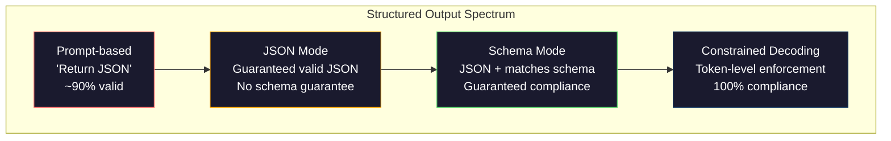
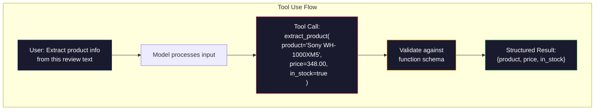

# 结构化输出:JSON,方案验证,限制解码

> 你的LLM返回一个字符串.你的应用程序需要JSON. 这个差距已经破解了更多的生产系统比任何模型幻觉. 结构化输出是自然语言和打字数据之间的桥梁. 得到正确的,你的LLM成为可靠的API. 错误的,你在3点上通过regex解析自由文本.

**Type:** Build
**Languages:** Python
**Prerequisites:** Phase 10, Lessons 01-05 (LLMs from Scratch)
**Time:** ~90 minutes
**Related:**阶段5 · 20 (结构化输出和限制式解码) 涵盖了解码级理论 (FSM/CFG逻辑处理器,概要,XGrammar).本课程重点关注生产SDK表面 (OpenAI `response_format`阅读第5阶段 · 20 首先,如果你想了解API下面发生了什么.

## 学习目标

- 使用OpenAI和人类API参数实现JSON模式和方案限制输出
- 建立一个拒绝错误的LLM输出和反复试验的Pydantic验证层
- 解释限制解码如何在代币级别上有效的JSON,而不需要后处理
- 设计强大的提取提示器,可靠地将未结构化的文本转换为打字数据结构

## 问题

你问一个法学士:"从本文中取出产品名称,价格和可用性".

```
The product is the Sony WH-1000XM5 headphones, which cost $348.00 and are currently in stock.
```

您的库存系统需要`{"product": "Sony WH-1000XM5", "price": 348.00, "in_stock": true}`您需要一个具有特定键,特定类型和特定值限制的JSON对象.

简单的解决方案:在提示中添加"JSON中回答". 这种方法90%的时间都能有效. 另外10%的模型将JSON包裹在标记码围中,或者添加一个序言,如"这里是JSON:",或者产生语法不有效的JSON,因为它关闭了一个括号早些时候. 你的JSON解析器崩了. 你的管道断裂. 加入试/除外,然后再试循环. 试验有时会产生不同的数据. 现在你有一个连贯性问题,

这不是一个快速工程问题.这是一个解码问题.模型生成左到右的代币.在每个位置,它从100K+选项的词汇库中选择了最有可能的下一个代币.这些选项中的大多数将在任何位置产生无效的JSON.如果模型刚刚发射`{"price":`接下来的代币必须是数字,一个引用 (为字符串),`null`现在`true`现在`false`没有限制,模型可能会选择一个完全合理的英语词,这是灾难性的语法错误.

## 概念

### 结构化输出频谱

结构化输出控制的四个层次,每个层次比前一个更可靠.



**Prompt-based**("有效的JSON中回复"):没有执行.模型通常符合,但有时不.可靠性: ~90%.失败模式:标记围,序言文本,缩短输出,结构错误.

**JSON mode**通过 API 确保输出是有效的 JSON.`response_format: { type: "json_object" }`输出将没有错误进行分析. 但它可能不符合预期的方案 - - 额外的键,错误的类型,缺失的字段.

**Schema mode**通过JSON模式,确保输出与它匹配. 到2026年,所有主要供应商都支持本地:OpenAI的`response_format: { type: "json_schema", json_schema: {...} }`(也称为`tool_choice="required"`), 类的工具使用`input_schema`双子座的`response_schema`其他`response_mime_type: "application/json"`输出中包含了你指定的密钥,类型和限制.

**Constrained decoding**代码器在生成过程中在每个代币位置上掩盖所有将产生不有效输出的代币.如果该方案需要一个数字,模型即将发出一字母,则该代币设置为概率零.该模型只能产生导致有效输出的代币.这是OpenAI的结构化输出模式和图书馆如概况和指导在罩杯下实现的.

### 约定语言

 JSON 方案是如何告诉模型 (或验证层) 输出必须有什么形状.

```json
{
  "type": "object",
  "properties": {
    "product": { "type": "string" },
    "price": { "type": "number", "minimum": 0 },
    "in_stock": { "type": "boolean" },
    "categories": {
      "type": "array",
      "items": { "type": "string" }
    }
  },
  "required": ["product", "price", "in_stock"]
}
```

这个方案说:输出必须是具有字符串的对象`product`没有负数`price`尔式`in_stock`并且可选的字符串阵列`categories`任何不匹配的输出都会被拒绝.

方案处理硬件:嵌套物体,有打字的物体的阵列,enums (限制一个字符串到特定值),图案匹配 (在字符串上重复),和组合器 (oneOf, anyOf,allOf多形输出).

### 皮达因特模式

在Python中,你不用手写JSON Schema.你定义一个Pydantic模型,它为你生成了该方案.

```python
from pydantic import BaseModel

class Product(BaseModel):
    product: str
    price: float
    in_stock: bool
    categories: list[str] = []
```

这产生了如上所述的JSON方案.教师库 (和OpenAI的SDK) 直接接受Pydantic模型:通过模型类,获得验证实例.如果LLM输出不匹配,教师自动重新尝试.

### 函数调用/工具使用

模特将一个函数调用,并将其输出到一个函数. 模特将其输出一个函数调用,并将其输出到一个函数调用. OpenAI称之为"函数调用".



如果您有10种不同的提取方案,并且模型必须根据输入选择正确的方案,则工具使用将给您提供既方案选择,又结构化输出.

### 常见的失败方式

即使是执行方案,结构化输出也可能以微妙的方式失败.

**Hallucinated values**输出与方案相匹配,但包含发明的数据.`{"price": 299.99}`图表验证不能捕获这个-- 类型是正确的,值是错误的.

**Enum confusion**限制一个字段到`["in_stock", "out_of_stock", "preorder"]`模型的输出`"available"`虽然它是基于语义上的,但不是允许的集合. 良好的限制解码阻止了这一点.

**Nested object depth**密集化模式 (4+级) 产生更多错误. 每个级别的嵌套化是模型可能失去结构的另一个地方.

**Array length**模型可能会在数组中产生太多或太少的项目.`minItems`其他`maxItems`但并非所有提供商都在解码层面执行它们.

**Optional field omission**模型遗漏技术上可选但对您的使用情况具有意义上的重要性的字段.即使有时数据缺失,也可以根据图案要求设置它们.`null`显然.

```figure
mx-schema-funnel
```

## 建立它

### 步骤1: JSON 方案验证器

建立一个验证器从零开始,以检查Python对象是否匹配JSON方案.这是输出侧运行的,以验证合规性.

```python
import json

def validate_schema(data, schema):
    errors = []
    _validate(data, schema, "", errors)
    return errors

def _validate(data, schema, path, errors):
    schema_type = schema.get("type")

    if schema_type == "object":
        if not isinstance(data, dict):
            errors.append(f"{path}: expected object, got {type(data).__name__}")
            return
        for key in schema.get("required", []):
            if key not in data:
                errors.append(f"{path}.{key}: required field missing")
        properties = schema.get("properties", {})
        for key, value in data.items():
            if key in properties:
                _validate(value, properties[key], f"{path}.{key}", errors)

    elif schema_type == "array":
        if not isinstance(data, list):
            errors.append(f"{path}: expected array, got {type(data).__name__}")
            return
        min_items = schema.get("minItems", 0)
        max_items = schema.get("maxItems", float("inf"))
        if len(data) < min_items:
            errors.append(f"{path}: array has {len(data)} items, minimum is {min_items}")
        if len(data) > max_items:
            errors.append(f"{path}: array has {len(data)} items, maximum is {max_items}")
        items_schema = schema.get("items", {})
        for i, item in enumerate(data):
            _validate(item, items_schema, f"{path}[{i}]", errors)

    elif schema_type == "string":
        if not isinstance(data, str):
            errors.append(f"{path}: expected string, got {type(data).__name__}")
            return
        enum_values = schema.get("enum")
        if enum_values and data not in enum_values:
            errors.append(f"{path}: '{data}' not in allowed values {enum_values}")

    elif schema_type == "number":
        if not isinstance(data, (int, float)):
            errors.append(f"{path}: expected number, got {type(data).__name__}")
            return
        minimum = schema.get("minimum")
        maximum = schema.get("maximum")
        if minimum is not None and data < minimum:
            errors.append(f"{path}: {data} is less than minimum {minimum}")
        if maximum is not None and data > maximum:
            errors.append(f"{path}: {data} is greater than maximum {maximum}")

    elif schema_type == "boolean":
        if not isinstance(data, bool):
            errors.append(f"{path}: expected boolean, got {type(data).__name__}")

    elif schema_type == "integer":
        if not isinstance(data, int) or isinstance(data, bool):
            errors.append(f"{path}: expected integer, got {type(data).__name__}")
```

### 步骤2:从皮达因式模型到方案

建立一个最小的类到方案转换器.定义一个Python类,自动生成其JSON方案.

```python
class SchemaField:
    def __init__(self, field_type, required=True, default=None, enum=None, minimum=None, maximum=None):
        self.field_type = field_type
        self.required = required
        self.default = default
        self.enum = enum
        self.minimum = minimum
        self.maximum = maximum

def python_type_to_schema(field):
    type_map = {
        str: "string",
        int: "integer",
        float: "number",
        bool: "boolean",
    }

    schema = {}

    if field.field_type in type_map:
        schema["type"] = type_map[field.field_type]
    elif field.field_type == list:
        schema["type"] = "array"
        schema["items"] = {"type": "string"}
    elif isinstance(field.field_type, dict):
        schema = field.field_type

    if field.enum:
        schema["enum"] = field.enum
    if field.minimum is not None:
        schema["minimum"] = field.minimum
    if field.maximum is not None:
        schema["maximum"] = field.maximum

    return schema

def model_to_schema(name, fields):
    properties = {}
    required = []

    for field_name, field in fields.items():
        properties[field_name] = python_type_to_schema(field)
        if field.required:
            required.append(field_name)

    return {
        "type": "object",
        "properties": properties,
        "required": required,
    }
```

### 步骤3: 限制的标志过

模拟限制解码. 鉴于部分JSON字符串和图案,确定当前位置是否有效的代币类别.

```python
def next_valid_tokens(partial_json, schema):
    stripped = partial_json.strip()

    if not stripped:
        return ["{"]

    try:
        json.loads(stripped)
        return ["<EOS>"]
    except json.JSONDecodeError:
        pass

    last_char = stripped[-1] if stripped else ""

    if last_char == "{":
        return ['"', "}"]
    elif last_char == '"':
        if stripped.endswith('":'):
            return ['"', "0-9", "true", "false", "null", "[", "{"]
        return ["a-z", '"']
    elif last_char == ":":
        return [" ", '"', "0-9", "true", "false", "null", "[", "{"]
    elif last_char == ",":
        return [" ", '"', "{", "["]
    elif last_char in "0123456789":
        return ["0-9", ".", ",", "}", "]"]
    elif last_char == "}":
        return [",", "}", "]", "<EOS>"]
    elif last_char == "]":
        return [",", "}", "<EOS>"]
    elif last_char == "[":
        return ['"', "0-9", "true", "false", "null", "{", "[", "]"]
    else:
        return ["any"]

def demonstrate_constrained_decoding():
    partial_states = [
        '',
        '{',
        '{"product"',
        '{"product":',
        '{"product": "Sony"',
        '{"product": "Sony",',
        '{"product": "Sony", "price":',
        '{"product": "Sony", "price": 348',
        '{"product": "Sony", "price": 348}',
    ]

    print(f"{'Partial JSON':<45} {'Valid Next Tokens'}")
    print("-" * 80)
    for state in partial_states:
        valid = next_valid_tokens(state, {})
        display = state if state else "(empty)"
        print(f"{display:<45} {valid}")
```

### 步骤4:提取管道

将所有东西结合到一个提取管道中:定义一个方案,模拟一个LLM产生结构化输出,验证输出,并处理重试.

```python
def simulate_llm_extraction(text, schema, attempt=0):
    if "headphones" in text.lower() or "sony" in text.lower():
        if attempt == 0:
            return '{"product": "Sony WH-1000XM5", "price": 348.00, "in_stock": true, "categories": ["audio", "headphones"]}'
        return '{"product": "Sony WH-1000XM5", "price": 348.00, "in_stock": true}'

    if "laptop" in text.lower():
        return '{"product": "MacBook Pro 16", "price": 2499.00, "in_stock": false, "categories": ["computers"]}'

    return '{"product": "Unknown", "price": 0, "in_stock": false}'

def extract_with_retry(text, schema, max_retries=3):
    for attempt in range(max_retries):
        raw = simulate_llm_extraction(text, schema, attempt)

        try:
            data = json.loads(raw)
        except json.JSONDecodeError as e:
            print(f"  Attempt {attempt + 1}: JSON parse error -- {e}")
            continue

        errors = validate_schema(data, schema)
        if not errors:
            return data

        print(f"  Attempt {attempt + 1}: Schema validation errors -- {errors}")

    return None

product_schema = {
    "type": "object",
    "properties": {
        "product": {"type": "string"},
        "price": {"type": "number", "minimum": 0},
        "in_stock": {"type": "boolean"},
        "categories": {"type": "array", "items": {"type": "string"}},
    },
    "required": ["product", "price", "in_stock"],
}
```

### 步骤5: 运行全管道

```python
def run_demo():
    print("=" * 60)
    print("  Structured Output Pipeline Demo")
    print("=" * 60)

    print("\n--- Schema Definition ---")
    product_fields = {
        "product": SchemaField(str),
        "price": SchemaField(float, minimum=0),
        "in_stock": SchemaField(bool),
        "categories": SchemaField(list, required=False),
    }
    generated_schema = model_to_schema("Product", product_fields)
    print(json.dumps(generated_schema, indent=2))

    print("\n--- Schema Validation ---")
    test_cases = [
        ({"product": "Test", "price": 10.0, "in_stock": True}, "Valid object"),
        ({"product": "Test", "price": -5.0, "in_stock": True}, "Negative price"),
        ({"product": "Test", "in_stock": True}, "Missing price"),
        ({"product": "Test", "price": "ten", "in_stock": True}, "String as price"),
        ("not an object", "String instead of object"),
    ]

    for data, label in test_cases:
        errors = validate_schema(data, product_schema)
        status = "PASS" if not errors else f"FAIL: {errors}"
        print(f"  {label}: {status}")

    print("\n--- Constrained Decoding Simulation ---")
    demonstrate_constrained_decoding()

    print("\n--- Extraction Pipeline ---")
    texts = [
        "The Sony WH-1000XM5 headphones are priced at $348 and currently available.",
        "The new MacBook Pro 16-inch laptop costs $2499 but is sold out.",
        "This is a random sentence with no product info.",
    ]

    for text in texts:
        print(f"\n  Input: {text[:60]}...")
        result = extract_with_retry(text, product_schema)
        if result:
            print(f"  Output: {json.dumps(result)}")
        else:
            print(f"  Output: FAILED after retries")
```

## 用它

### 开放AI结构化输出

```python
# from openai import OpenAI
# from pydantic import BaseModel
#
# client = OpenAI()
#
# class Product(BaseModel):
#     product: str
#     price: float
#     in_stock: bool
#
# response = client.beta.chat.completions.parse(
#     model="gpt-5-mini",
#     messages=[
#         {"role": "system", "content": "Extract product information."},
#         {"role": "user", "content": "Sony WH-1000XM5, $348, in stock"},
#     ],
#     response_format=Product,
# )
#
# product = response.choices[0].message.parsed
# print(product.product, product.price, product.in_stock)
```

开放AI的结构化输出模式使用内部限制式解码.模型生成的每个代币都保证与Pydantic方案相匹配的输出.不需要重试.不需要验证.限制被入解码过程中.

### 人类工具的使用

```python
# import anthropic
#
# client = anthropic.Anthropic()
#
# response = client.messages.create(
#     model="claude-opus-4-7",
#     max_tokens=1024,
#     tools=[{
#         "name": "extract_product",
#         "description": "Extract product information from text",
#         "input_schema": {
#             "type": "object",
#             "properties": {
#                 "product": {"type": "string"},
#                 "price": {"type": "number"},
#                 "in_stock": {"type": "boolean"},
#             },
#             "required": ["product", "price", "in_stock"],
#         },
#     }],
#     messages=[{"role": "user", "content": "Extract: Sony WH-1000XM5, $348, in stock"}],
# )
```

通过工具使用,Anthropic实现结构化输出.该模型发出一个与 input_schema相匹配的结构化参数的工具调用.相同的结果,不同的API表面.

### 导师图书馆

```python
# pip install instructor
# import instructor
# from openai import OpenAI
# from pydantic import BaseModel
#
# client = instructor.from_openai(OpenAI())
#
# class Product(BaseModel):
#     product: str
#     price: float
#     in_stock: bool
#
# product = client.chat.completions.create(
#     model="gpt-5-mini",
#     response_model=Product,
#     messages=[{"role": "user", "content": "Sony WH-1000XM5, $348, in stock"}],
# )
```

导师将任何LLM客户端包裹并添加自动复试验证.如果第一次尝试失败验证,它将错误作为文本返回模型,并要求它修复输出.这与任何提供商都能合作,而不仅仅是OpenAI.

## 运送它

这一课产生了`outputs/prompt-structured-extractor.md`--一个可重复使用的提示模板,从任何定义的图案中提取结构化数据. 给它提供一个JSON图案和非结构化文本,然后返回验证的JSON.

它还产生了`outputs/skill-structured-outputs.md`根据供应商,可靠性要求和方案复杂性,选择正确的结构化输出策略的决策框架.

## 运动

1. 扩展到支持的方案验证器`oneOf`处理多形输出,例如,一个可以是`Product`或是`Service`具有不同形状的物体.

2. 建立一个"方案差异"工具,可以比较两个方案,并识别破解变化 (删除所需的字段,改变类型) 与不破解变化 (添加选项字段,放松的限制).这是生产中版本化您的提取方案的必不可少.

3. 实施一个更现实的限制解码模拟器. 鉴于JSON方案和100个代码 (字母,数字,分区别,关键字) 的词汇库,一步一步通过生成,每个位置都掩盖了无效代码. 测量每个步骤中的词汇库有多少个百分比有效.

4. 建立一个提取评估套件. 创建50个产品描述,使用手动标记的JSON输出. 在所有50个中运行提取管道,测量准确匹配,场面级准确性和类型合规性. 确定哪些领域最难正确地提取.

5. 对于每一个提取的字段,估计模型的信心程度 (基于代币概率,或通过运行提取3次和测量一致性). 标签低信心字段用于人类审查.

## 关键词

| Term | What people say | What it actually means |
|------|----------------|----------------------|
| JSON mode | "Returns JSON" | API flag that guarantees syntactically valid JSON output, but does not enforce any particular schema |
| Structured output | "Typed JSON" | Output that matches a specific JSON Schema with correct keys, types, and constraints |
| Constrained decoding | "Guided generation" | At each token position, mask out tokens that would produce invalid output -- guarantees 100% schema compliance |
| JSON Schema | "A JSON template" | A declarative language for describing the structure, types, and constraints of JSON data (used by OpenAPI, JSON Forms, etc.) |
| Pydantic | "Python dataclasses+" | Python library that defines data models with type validation, used by FastAPI and Instructor to generate JSON Schemas |
| Function calling | "Tool use" | LLM outputs a structured function invocation (name + typed arguments) instead of free text -- OpenAI and Anthropic both support this |
| Instructor | "Pydantic for LLMs" | Python library that wraps LLM clients to return validated Pydantic instances, with automatic retry on validation failure |
| Token masking | "Filtering the vocabulary" | Setting specific token probabilities to zero during generation so the model cannot produce them |
| Schema compliance | "Matches the shape" | The output has every required field, correct types, values within constraints, and no extra disallowed fields |
| Retry loop | "Try again until it works" | Send validation errors back to the model and ask it to fix the output -- Instructor does this automatically, up to a configurable max |

## 进一步阅读

- [OpenAI Structured Outputs Guide](https://platform.openai.com/docs/guides/structured-outputs)-- 基于JSON方案的限制解码在OpenAIAPI中的官方文档
- [Willard & Louf, 2023 -- "Efficient Guided Generation for Large Language Models"](https://arxiv.org/abs/2307.09702)-- 概述论文,描述如何将JSON图案编译成有限状态机,
- [Instructor documentation](https://python.useinstructor.com/)-- 获得任何具有Pydantic验证和重试的LLM结构化输出的标准图书馆
- [Anthropic Tool Use Guide](https://docs.anthropic.com/en/docs/tool-use)-- 克劳德如何通过工具使用JSON Schema input_schema实现结构化输出
- [JSON Schema specification](https://json-schema.org/)-- 对于每个主要结构化输出系统所使用的方案语言的完整规格
- [Outlines library](https://github.com/outlines-dev/outlines)--使用 regex 和 JSON 方案编译到有限状态机器的开源限制生成
- [Dong et al., "XGrammar: Flexible and Efficient Structured Generation Engine for Large Language Models" (MLSys 2025)](https://arxiv.org/abs/2411.15100)现在的最先进的语法引擎; 按下自动组合, 掩盖代币的代币为100ns/代币.
- [Beurer-Kellner et al., "Prompting Is Programming: A Query Language for Large Language Models" (LMQL)](https://arxiv.org/abs/2212.06094)-- LMQL 纸张框架限制了解码作为一个查询语言,
- [Microsoft Guidance (framework docs)](https://github.com/guidance-ai/guidance)--基于模板的限制生成; 供应商无知的补充到概要和XGrammar.
